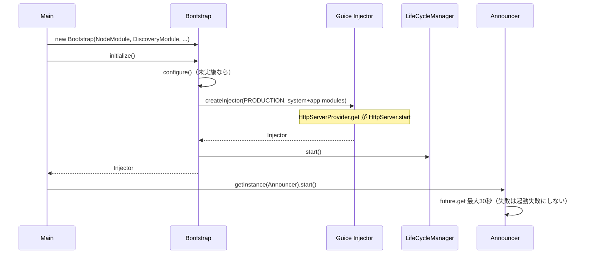

# 第1章 アーキテクチャ全体像とサーバ起動

> **本章で読むソース**
>
> - [sample-server/src/main/java/io/airlift/sample/Main.java](https://github.com/airlift/airlift/blob/439/sample-server/src/main/java/io/airlift/sample/Main.java)
> - [sample-server/src/main/java/io/airlift/sample/MainModule.java](https://github.com/airlift/airlift/blob/439/sample-server/src/main/java/io/airlift/sample/MainModule.java)
> - [bootstrap/src/main/java/io/airlift/bootstrap/Bootstrap.java](https://github.com/airlift/airlift/blob/439/bootstrap/src/main/java/io/airlift/bootstrap/Bootstrap.java)
> - [node/src/main/java/io/airlift/node/NodeModule.java](https://github.com/airlift/airlift/blob/439/node/src/main/java/io/airlift/node/NodeModule.java)
> - [discovery/src/main/java/io/airlift/discovery/client/DiscoveryModule.java](https://github.com/airlift/airlift/blob/439/discovery/src/main/java/io/airlift/discovery/client/DiscoveryModule.java)
> - [discovery/src/main/java/io/airlift/discovery/client/Announcer.java](https://github.com/airlift/airlift/blob/439/discovery/src/main/java/io/airlift/discovery/client/Announcer.java)
> - [http-server/src/main/java/io/airlift/http/server/HttpServerModule.java](https://github.com/airlift/airlift/blob/439/http-server/src/main/java/io/airlift/http/server/HttpServerModule.java)
> - [http-server/src/main/java/io/airlift/http/server/HttpServerProvider.java](https://github.com/airlift/airlift/blob/439/http-server/src/main/java/io/airlift/http/server/HttpServerProvider.java)
> - [http-server/src/main/java/io/airlift/http/server/HttpServer.java](https://github.com/airlift/airlift/blob/439/http-server/src/main/java/io/airlift/http/server/HttpServer.java)

## この章の狙い

Airlift のサーバは、単一の巨大な `main` ではなく、Guice の `Module` 群を `Bootstrap` に渡して組み立てる。
本章では `sample-server` の `Main` を入口に、モジュール合成から `Injector` 取得、`Announcer.start` までを一本の起動経路として追う。
各モジュールの内部実装は後の部に譲り、ここでは「何がどの順で立ち上がるか」を固定する。

## 前提

読者は Java の基本構文と、Guice の `Module` / `Injector` / `bind` の役割を知っているものとする。
Jakarta EE の `@PostConstruct` / `@PreDestroy` や JAX-RS のリソース登録の詳細は、後続章で改めて扱う。

## モジュール合成によるサーバ構築

Airlift が提供するのは、HTTP サーバ、JSON、JAX-RS、サービスディスカバリ、JMX、トレーシングといった横断関心である。
アプリケーションはそれらの `Module` を選び、必要なら自前の `Module` を末尾に足して `Bootstrap` に渡す。
依存性注入のグラフは起動時に一度組み立てられ、実行時の配線は `Injector` 経由で解決される。

`sample-server` の `Main` が渡すモジュール列は、そのまま「Airlift の標準面」の地図になる。

[sample-server/src/main/java/io/airlift/sample/Main.java L45-L57](https://github.com/airlift/airlift/blob/439/sample-server/src/main/java/io/airlift/sample/Main.java#L45-L57)

```java
        Bootstrap app = new Bootstrap(
                new NodeModule(),
                new DiscoveryModule(),
                new HttpServerModule(),
                new JsonModule(),
                new JaxrsModule(),
                new MBeanModule(),
                new JmxModule(),
                new JmxHttpModule(),
                new JmxOpenMetricsModule(),
                new LogJmxModule(),
                new TracingModule("sample", VERSION),
                new MainModule());
```

先頭の `NodeModule` はノード識別（`NodeInfo`）をバインドする。
`DiscoveryModule` はアナウンスとサービス選択のクライアントを用意する。
`HttpServerModule` と `JsonModule`、`JaxrsModule` が HTTP 面と JSON、JAX-RS を担う。
続く `MBeanModule`（外部 jmxutils）、`JmxModule`、`JmxHttpModule`、`JmxOpenMetricsModule`、`LogJmxModule` が可観測性を足す。
`TracingModule` は OpenTelemetry 系を入れ、最後の `MainModule` が sample 固有のリソースとアナウンスを登録する。

各モジュールの役割を、後の部との対応で整理する。

| モジュール | 役割の要約 | 主に扱う部 |
|---|---|---|
| `NodeModule` | ノード識別と設定 | 第7部 |
| `DiscoveryModule` | アナウンスとセレクタ | 第7部 |
| `HttpServerModule` | Jetty HTTP サーバ | 第4部 |
| `JsonModule` | `JsonMapper` / `JsonCodec` | 第3部 |
| `JaxrsModule` | JAX-RS Servlet | 第5部 |
| JMX / OpenMetrics / LogJMX | MBean とメトリクス公開 | 第8部 |
| `TracingModule` | トレーシング | 第8部 |
| `MainModule` | アプリ固有の bind | （本サンプル） |

`NodeModule` 自体は短い。
`NodeInfo` をシングルトンでバインドし、`NodeConfig` を設定クラスとして登録し、JMX へエクスポートするだけである。

[node/src/main/java/io/airlift/node/NodeModule.java L28-L34](https://github.com/airlift/airlift/blob/439/node/src/main/java/io/airlift/node/NodeModule.java#L28-L34)

```java
    @Override
    public void configure(Binder binder)
    {
        binder.bind(NodeInfo.class).in(Scopes.SINGLETON);
        configBinder(binder).bindConfig(NodeConfig.class);
        newExporter(binder).export(NodeInfo.class).withGeneratedName();
    }
```

HTTP サーバの起動主経路は、`HttpServerModule` → `HttpServerProvider.get` → `new HttpServer` → `httpServer.start` である。
モジュールは `HttpServer` を `HttpServerProvider` へバインドするだけである。

[http-server/src/main/java/io/airlift/http/server/HttpServerModule.java L84-L97](https://github.com/airlift/airlift/blob/439/http-server/src/main/java/io/airlift/http/server/HttpServerModule.java#L84-L97)

```java
    public HttpServerModule()
    {
        this("http-server", Optional.empty(), null);
    }

    @Override
    protected void setup(Binder binder)
    {
        binder.bind(qualifiedKey(qualifier, HttpServer.class))
                .toProvider(new HttpServerProvider(name, qualifier))
                .in(SINGLETON);
        newOptionalBinder(binder, qualifiedKey(qualifier, ClientCertificate.class)).setDefault().toInstance(ClientCertificate.NONE);
        newExporter(binder).export(qualifiedKey(qualifier, HttpServer.class)).withGeneratedName();
        newSetBinder(binder, qualifiedKey(qualifier, ServerFeature.class));
```

`HttpServerProvider.get` は Injector から依存を集め、`HttpServer` を構築し、**返却前に** `httpServer.start()` を明示呼出しする。

[http-server/src/main/java/io/airlift/http/server/HttpServerProvider.java L66-L85](https://github.com/airlift/airlift/blob/439/http-server/src/main/java/io/airlift/http/server/HttpServerProvider.java#L66-L85)

```java
    @Override
    public HttpServer get()
    {
        try {
            HttpServer httpServer = new HttpServer(
                    name,
                    injector.getInstance(qualifiedKey(qualifier, HttpServerInfo.class)),
                    injector.getInstance(NodeInfo.class),
                    injector.getInstance(qualifiedKey(qualifier, HttpServerConfig.class)),
                    injector.getInstance(qualifiedKey(qualifier, new TypeLiteral<>() {})),
                    injector.getInstance(qualifiedKey(qualifier, new TypeLiteral<>() {})),
                    injector.getInstance(qualifiedKey(qualifier, Servlet.class)),
                    injector.getInstance(qualifiedKey(qualifier, new TypeLiteral<>() {})),
                    injector.getInstance(qualifiedKey(qualifier, new TypeLiteral<>() {})),
                    injector.getInstance(qualifiedKey(qualifier, new TypeLiteral<>() {})),
                    injector.getInstance(qualifiedKey(qualifier, ClientCertificate.class)),
                    mBeanServer,
                    injector.getInstance(qualifiedKey(qualifier, new TypeLiteral<>() {})));
            httpServer.start();
            return httpServer;
```

`HttpServer.start` 自体には `@PostConstruct` が付いている。

[http-server/src/main/java/io/airlift/http/server/HttpServer.java L538-L544](https://github.com/airlift/airlift/blob/439/http-server/src/main/java/io/airlift/http/server/HttpServer.java#L538-L544)

```java
    @PostConstruct
    public void start()
            throws Exception
    {
        server.start();
        checkState(server.isStarted(), "server is not started");
    }
```

したがって起動には二つの接続がある。
Provider が返却前に `start` を直接呼ぶ経路と、返却後に `LifeCycleModule` の `ProvisionListener` が同じインスタンスを捕捉してライフサイクル管理へ載せる経路である。
「`@PostConstruct` 付きなら provision 経由で起動済みになり得る」だけでは、Provider 直接 start を見落とす。
コネクタやハンドラ連鎖の詳細は第4部に譲る。

## アプリ固有モジュールと Discovery の接続

`MainModule` は sample のドメインを Guice グラフに足す。
`PersonStore` のバインド、JAX-RS リソース、設定クラス、そして HTTP アナウンスの登録が並ぶ。

[sample-server/src/main/java/io/airlift/sample/MainModule.java L31-L42](https://github.com/airlift/airlift/blob/439/sample-server/src/main/java/io/airlift/sample/MainModule.java#L31-L42)

```java
    public void configure(Binder binder)
    {
        binder.bind(PersonStore.class).in(Scopes.SINGLETON);
        newExporter(binder).export(PersonStore.class).withGeneratedName();

        jaxrsBinder(binder).bind(PersonsResource.class);
        jaxrsBinder(binder).bind(PersonResource.class);

        configBinder(binder).bindConfig(StoreConfig.class);

        discoveryBinder(binder).bindHttpAnnouncement("person");
    }
```

`discoveryBinder(...).bindHttpAnnouncement("person")` は、サービス種別 `"person"` の HTTP アナウンスを multibinder へ入れる。
フレームワーク側の受け皿は `DiscoveryModule` にある。

[discovery/src/main/java/io/airlift/discovery/client/DiscoveryModule.java L54-L68](https://github.com/airlift/airlift/blob/439/discovery/src/main/java/io/airlift/discovery/client/DiscoveryModule.java#L54-L68)

```java
        binder.bind(DiscoveryLookupClient.class).to(HttpDiscoveryLookupClient.class).in(Scopes.SINGLETON);
        binder.bind(DiscoveryAnnouncementClient.class).to(HttpDiscoveryAnnouncementClient.class).in(Scopes.SINGLETON);
        jsonCodecBinder(binder).bindJsonCodec(ServiceDescriptorsRepresentation.class);
        jsonCodecBinder(binder).bindJsonCodec(Announcement.class);

        // bind the http client
        httpClientBinder(binder).bindHttpClient("discovery", ForDiscoveryClient.class);

        // bind announcer
        binder.bind(Announcer.class).in(Scopes.SINGLETON);
        newExporter(binder).export(Announcer.class).withGeneratedName();

        // Must create a multibinder for service announcements or construction will fail if no
        // service announcements are bound, which is legal for processes that don't have public services
        newSetBinder(binder, ServiceAnnouncement.class);
```

`Announcer` はシングルトンでバインドされ、`ServiceAnnouncement` の empty multibinder も用意される。
アプリがアナウンスを一つも登録しなくても Injector 作成が落ちないようにするための空セットである。
`MainModule` が `"person"` を足すと、そのセットに一件入る。

## Bootstrap.initialize と Announcer.start

組み立てた `Bootstrap` に対し、`Main` は `initialize` を呼び、返ってきた `Injector` から `Announcer` を取り出して `start` する。

[sample-server/src/main/java/io/airlift/sample/Main.java L59-L66](https://github.com/airlift/airlift/blob/439/sample-server/src/main/java/io/airlift/sample/Main.java#L59-L66)

```java
        try {
            Injector injector = app.initialize();
            injector.getInstance(Announcer.class).start();
        }
        catch (Throwable e) {
            log.error(e);
            System.exit(1);
        }
```

ここで二つの境界がはっきりする。

1. **`Bootstrap.initialize`**：設定検証、Guice `Injector` 作成、ライフサイクル開始までを担当する（詳細は第2章）。
2. **`Announcer.start`**：サービスアナウンスの開始はライフサイクル自動起動ではなく、アプリが明示呼出しする。

`initialize` の末尾は次のとおりである。
システムモジュールとアプリモジュールを結合し、`Stage.PRODUCTION` で Injector を作り、`LifeCycleManager.start` を呼んでから Injector を返す。

[bootstrap/src/main/java/io/airlift/bootstrap/Bootstrap.java L345-L374](https://github.com/airlift/airlift/blob/439/bootstrap/src/main/java/io/airlift/bootstrap/Bootstrap.java#L345-L374)

```java
    public Injector initialize()
    {
        checkState(state != State.INITIALIZED, "Already initialized");
        if (state == State.UNINITIALIZED) {
            configure();
        }
        state = State.INITIALIZED;

        // system modules
        Builder<Module> moduleList = ImmutableList.builder();
        moduleList.add(new LifeCycleModule(name));
        moduleList.add(new ConfigurationModule(configurationFactory));
        moduleList.add(binder -> closingBinder(binder).registerCloseable(configurationFactory));
        moduleList.add(binder -> binder.bind(WarningsMonitor.class).toInstance(log::warn));

        // disable broken Guice "features"
        moduleList.add(Binder::disableCircularProxies);
        moduleList.add(Binder::requireExplicitBindings);
        moduleList.add(Binder::requireExactBindingAnnotations);

        moduleList.add(binder -> binder.bind(SecretsResolver.class).toInstance(secretsResolver));
        moduleList.addAll(modules);

        // create the injector
        Injector injector = Guice.createInjector(Stage.PRODUCTION, moduleList.build());

        injector.getInstance(LifeCycleManager.class).start();

        return injector;
    }
```

この時点で HTTP サーバは、前述のとおり `HttpServerProvider.get` 内の明示 `start` によりすでに待ち受けを始めている。
一方サービスディスカバリへの初回アナウンスは、まだ始まっていない。
`Announcer.start` がその残りを閉じる。

[discovery/src/main/java/io/airlift/discovery/client/Announcer.java L84-L96](https://github.com/airlift/airlift/blob/439/discovery/src/main/java/io/airlift/discovery/client/Announcer.java#L84-L96)

```java
    public void start()
    {
        checkState(!executor.isShutdown(), "Announcer has been destroyed");
        if (started.compareAndSet(false, true)) {
            // announce immediately, if discovery is running
            ListenableFuture<Duration> announce = announce(System.nanoTime(), new Duration(0, SECONDS));
            try {
                announce.get(30, SECONDS);
            }
            catch (Exception ignored) {
            }
        }
    }
```

`compareAndSet` で一度だけ開始し、遅延 0 の即時アナウンス future を得る。
続く `announce.get(30, SECONDS)` は**呼出しスレッドを最大 30 秒ブロック**する。
discovery が応答しないときもプロセスは一時停止しうる。
ただし無期限には待たず、timeout や future 失敗の例外は起動失敗にしない。
なお `announce(...)` 自体の呼出しは try の外にあるので、そこで投げられた例外まで無条件に握りつぶすわけではない。

future には callback が付いており、成功時も失敗時も次のアナウンスを schedule する。

[discovery/src/main/java/io/airlift/discovery/client/Announcer.java L146-L166](https://github.com/airlift/airlift/blob/439/discovery/src/main/java/io/airlift/discovery/client/Announcer.java#L146-L166)

```java
        ListenableFuture<Duration> future = announcementClient.announce(getServiceAnnouncements());

        Futures.addCallback(future, new FutureCallback<>()
        {
            @Override
            public void onSuccess(Duration expectedDelay)
            {
                errorBackOff.success();

                // wait 80% of the suggested delay
                expectedDelay = new Duration(expectedDelay.toMillis() * 0.8, MILLISECONDS);
                scheduleNextAnnouncement(expectedDelay);
            }

            @Override
            public void onFailure(Throwable t)
            {
                Duration duration = errorBackOff.failed(t);
                scheduleNextAnnouncement(duration);
            }
        }, executor);
```

失敗時の待ちは `ExponentialBackOff` が決める。
初回 `get` が終わったあとも、再試行は executor 上で続く（詳細は第16章）。

## 起動処理の流れ

`Main.main` から見た起動完了までの流れは次のとおりである。



要点は三つある。

- **モジュール列がサーバの構成そのもの**であり、足したものだけが Injector に入る。
- **`initialize` が DI とライフサイクル開始の境界**であり、既定（`skipErrorReporting` が false）では設定エラーを `configure` 時点で fail-fast できる（例外経路は第2章）。
- **`Announcer.start` は明示呼出し**で、`@PreDestroy` の `destroy` はあるが開始はアプリ責務のまま残している。

## 高速化と最適化の工夫

既定経路では、設定と DI を Injector 作成前に切り分ける。
`initialize` は未実施なら先に `configure` を呼び、`skipErrorReporting` が無効なとき未使用プロパティや検証エラーがあれば `Guice.createInjector` に進まない。
巨大なオブジェクトグラフを組んでから設定ミスに気づく、という無駄を避けている。

`Announcer.start` は初回 future を最大 30 秒待つが、timeout や失敗を起動失敗にはしない。
callback が `ExponentialBackOff` で次の再試行を schedule するので、discovery 未達でもプロセスがそこで終了しない。

## まとめ

- Airlift サーバは Guice `Module` の合成で構成され、`sample-server` の `Main` がその標準セットを示す。
- HTTP サーバは `HttpServerProvider.get` が返却前に `HttpServer.start` を呼ぶ経路で立ち上がり、`@PostConstruct` 経由のライフサイクル管理とも接続する。
- `Bootstrap.initialize` が設定検証、Injector 作成、`LifeCycleManager.start` までを担う。
- 起動完了の最後の一手は `Announcer.start` の明示呼出しであり、初回は最大 30 秒ブロックしうるが失敗は起動失敗にせず再試行を schedule する。

## 関連する章

- [第2章 Bootstrap と Injector 構築](../part01-di-lifecycle/02-bootstrap.md)
- [第3章 ライフサイクル管理とリソース解放](../part01-di-lifecycle/03-lifecycle.md)
- [第8章 HttpServerModule と Provider](../part04-http-server/08-http-server-module.md)
- [第16章 ノード識別とサービスアナウンス](../part07-node-discovery/16-node-announce.md)
