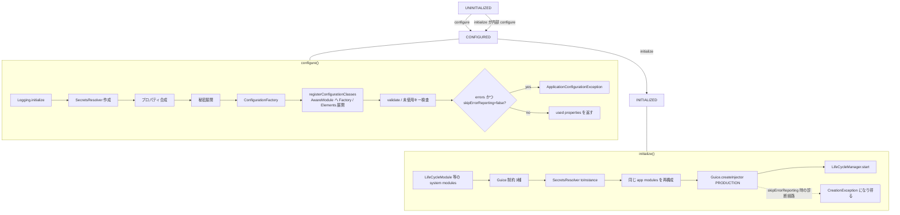

# 第2章 Bootstrap と Injector 構築

> **本章で読むソース**
>
> - [bootstrap/src/main/java/io/airlift/bootstrap/Bootstrap.java](https://github.com/airlift/airlift/blob/439/bootstrap/src/main/java/io/airlift/bootstrap/Bootstrap.java)
> - [configuration/src/main/java/io/airlift/configuration/secrets/SecretsResolver.java](https://github.com/airlift/airlift/blob/439/configuration/src/main/java/io/airlift/configuration/secrets/SecretsResolver.java)
> - [configuration/src/main/java/io/airlift/configuration/ConfigurationFactory.java](https://github.com/airlift/airlift/blob/439/configuration/src/main/java/io/airlift/configuration/ConfigurationFactory.java)

## この章の狙い

第1章で見た `app.initialize()` の中身を分解する。
`Bootstrap` は **configure（設定検証）** と **initialize（Injector 作成とライフサイクル開始）** の二段階であり、状態機械で順序を縛る。
本章ではプロパティ合成、設定クラス登録と検証、SecretsResolver の境界、Guice 制約、`LifeCycleManager.start` までの順序をソースで追う。

## 前提

第1章のモジュール合成と `Main` からの呼出し順を理解しているものとする。
`ConfigurationFactory` のメタデータ詳細と `@PostConstruct` の実装は、それぞれ第2部、第3章に譲る。
本章は `Bootstrap` がそれらをどの順で呼び出すか、というオーケストレーションに集中する。

## 状態機械：UNINITIALIZED / CONFIGURED / INITIALIZED

`Bootstrap` は内部状態を三つ持つ。

[bootstrap/src/main/java/io/airlift/bootstrap/Bootstrap.java L78-L96](https://github.com/airlift/airlift/blob/439/bootstrap/src/main/java/io/airlift/bootstrap/Bootstrap.java#L78-L96)

```java
    private enum State
    {
        UNINITIALIZED, CONFIGURED, INITIALIZED
    }

    private final List<Module> modules;

    private Map<String, String> requiredConfigurationProperties;
    private Map<String, String> optionalConfigurationProperties;
    private boolean initializeLogging = true;
    private boolean envInterpolation = true;
    private boolean useSystemProperties = true;
    private boolean quiet = parseBoolean(System.getProperty("airlift.quiet"));
    private boolean loadSecretsPlugins;
    private boolean skipErrorReporting;

    private State state = State.UNINITIALIZED;
    private ConfigurationFactory configurationFactory;
    private SecretsResolver secretsResolver;
```

`configure` は `UNINITIALIZED` からのみ呼べる。
`initialize` は二重初期化を拒否し、未 configure なら内部で `configure` を呼ぶ。
テストやツールが設定だけ検証したいとき、`configure` 単独でも使えるようになっている。

## configure：プロパティ合成から検証まで

`configure` の入口で状態を進め、必要ならログ基盤を立ち上げ、続けて `SecretsResolver` を用意する。

[bootstrap/src/main/java/io/airlift/bootstrap/Bootstrap.java L225-L248](https://github.com/airlift/airlift/blob/439/bootstrap/src/main/java/io/airlift/bootstrap/Bootstrap.java#L225-L248)

```java
    public Set<ConfigPropertyMetadata> configure()
    {
        checkState(state == State.UNINITIALIZED, "Already configured");
        state = State.CONFIGURED;

        Logging logging = null;
        if (initializeLogging) {
            logging = Logging.initialize();
        }

        this.secretsResolver = envInterpolation ?
                new SecretsResolver(ImmutableMap.of("env", new EnvironmentVariableSecretProvider())) :
                new SecretsResolver(ImmutableMap.of());

        if (loadSecretsPlugins) {
            log.info("Loading secrets plugins");
            String secretsConfigFile = System.getProperty("secretsConfig");
            if (secretsConfigFile != null) {
                SecretsPluginManager secretsPluginManager = new SecretsPluginManager(createTomlConfiguration(new File(secretsConfigFile)));
                secretsPluginManager.installPlugins();
                secretsPluginManager.load();
                this.secretsResolver = secretsPluginManager.getSecretsResolver();
            }
        }
```

既定では `env` という名前の `EnvironmentVariableSecretProvider` だけを載せる。
`loadSecretsPlugins()` を選んだときだけ、システムプロパティ `secretsConfig` からプラグインマネージャを起動し、リゾルバを差し替える。
秘密解決の実装は configuration モジュール側に閉じ、`Bootstrap` は「いつ、どのリゾルバを持つか」だけを決める。

続いて必須プロパティと任意プロパティ、system properties を合成し、リゾルバで値を展開する。

[bootstrap/src/main/java/io/airlift/bootstrap/Bootstrap.java L250-L290](https://github.com/airlift/airlift/blob/439/bootstrap/src/main/java/io/airlift/bootstrap/Bootstrap.java#L250-L290)

```java
        Map<String, String> requiredProperties;
        if (requiredConfigurationProperties == null) {
            // initialize configuration
            log.info("Loading configuration");

            requiredProperties = Map.of();
            String configFile = System.getProperty("config");
            if (configFile != null) {
                try {
                    requiredProperties = loadPropertiesFrom(configFile);
                }
                catch (IOException e) {
                    throw new UncheckedIOException(e);
                }
            }
        }
        else {
            requiredProperties = requiredConfigurationProperties;
        }
        Map<String, String> unusedProperties = new TreeMap<>(requiredProperties);

        // combine property sources
        Map<String, String> properties = new HashMap<>();
        if (optionalConfigurationProperties != null) {
            properties.putAll(optionalConfigurationProperties);
        }
        properties.putAll(requiredProperties);

        if (useSystemProperties) {
            properties.putAll(getSystemProperties());
        }

        // replace secrets in property values
        List<Message> errors = new ArrayList<>();
        properties = ImmutableSortedMap.copyOf(secretsResolver.getResolvedConfiguration(properties, (key, error) -> {
            unusedProperties.remove(key);
            errors.add(new Message(error.getMessage()));
        }));

        List<Message> warnings = new ArrayList<>();
        configurationFactory = new ConfigurationFactory(properties, warning -> warnings.add(new Message(warning)));
```

優先順位は optional → required（または config ファイル）→ system properties である。
後から入れた側が同じキーを上書きする。
ユニットテストでは `setRequiredConfigurationProperties` でファイル無しの起動ができる。
本番では通常、システムプロパティ `config` が指すファイルを読む。

合成後のマップは `SecretsResolver.getResolvedConfiguration` を通る。
`${provider:key}` 形式のプレースホルダを、登録済み `SecretProvider` で実値へ置換する。

[configuration/src/main/java/io/airlift/configuration/secrets/SecretsResolver.java L52-L73](https://github.com/airlift/airlift/blob/439/configuration/src/main/java/io/airlift/configuration/secrets/SecretsResolver.java#L52-L73)

```java
    public Map<String, String> getResolvedConfiguration(Map<String, String> properties, BiConsumer<String, Throwable> onError)
    {
        ImmutableMap.Builder<String, String> builder = ImmutableMap.builderWithExpectedSize(properties.size());
        properties.forEach((propertyKey, propertyValue) -> {
            try {
                builder.put(propertyKey, resolveConfiguration(propertyValue));
            }
            catch (RuntimeException exception) {
                onError.accept(propertyKey, exception);
            }
        });
        return builder.buildOrThrow();
    }

    private String resolveConfiguration(String configurationValue)
    {
        return PATTERN.matcher(configurationValue).replaceAll(match -> {
            String secretProviderName = match.group(1).toLowerCase(ENGLISH);
            String keyName = match.group(2);
            return quoteReplacement(resolveSecret(secretProviderName, keyName));
        });
    }
```

`Bootstrap` 側のコールバックは、解決失敗のキーを `unusedProperties` から外し、エラーメッセージへ積む。
未使用判定と秘密解決失敗を、同じ errors リストへ合流させるためである。

## 設定クラスの登録と検証、未使用プロパティ

`ConfigurationFactory` ができたら、ログ設定の適用、モジュール内の設定クラス登録、検証、未使用キー検査が続く。

[bootstrap/src/main/java/io/airlift/bootstrap/Bootstrap.java L292-L321](https://github.com/airlift/airlift/blob/439/bootstrap/src/main/java/io/airlift/bootstrap/Bootstrap.java#L292-L321)

```java
        Boolean quietConfig = configurationFactory.build(BootstrapConfig.class).isQuiet();

        // initialize logging
        if (logging != null) {
            log.info("Initializing logging");
            LoggingConfiguration configuration = configurationFactory.build(LoggingConfiguration.class);
            logging.configure(configuration);
        }

        // Register configuration classes defined in the modules
        errors.addAll(configurationFactory.registerConfigurationClasses(modules));

        // Validate configuration classes
        errors.addAll(configurationFactory.validateRegisteredConfigurationProvider());

        // at this point all config file properties should be used
        // so we can calculate the unused properties
        Set<String> usedProperties = configurationFactory.getUsedProperties().stream()
                .map(ConfigPropertyMetadata::name)
                .collect(toImmutableSet());
        unusedProperties.keySet().removeAll(usedProperties);

        for (String key : unusedProperties.keySet()) {
            errors.add(new Message(("Configuration property '%s' was not used" + suggest(key, configurationFactory.getAllSeenProperties())).formatted(key)));
        }

        // If there are configuration errors, fail-fast to keep output clean
        if (!skipErrorReporting && !errors.isEmpty()) {
            throw new ApplicationConfigurationException(errors, warnings);
        }
```

エラーで即 throw するのは **`!skipErrorReporting && !errors.isEmpty()` のときだけ**である。
`skipErrorReporting` は既定では false なので、本番相当の起動ではここで `ApplicationConfigurationException` になる。
フラグを有効にすると configure はエラーを持ったまま通り、後述の initialize で Guice の解決時に別種の例外（`CreationException`）へ持ち越され得る。
診断用の例外経路であり、既定の fail-fast とは別物である。

`registerConfigurationClasses` は設定クラス名の一覧走査ではない。
先に `ConfigurationAwareModule` へ同じ `ConfigurationFactory` を渡し、続けて `Elements.getElements(modules)` でモジュール要素を展開し、`ConfigurationProvider` や defaults / listener を登録する。

[configuration/src/main/java/io/airlift/configuration/ConfigurationFactory.java L178-L227](https://github.com/airlift/airlift/blob/439/configuration/src/main/java/io/airlift/configuration/ConfigurationFactory.java#L178-L227)

```java
    public Collection<Message> registerConfigurationClasses(Collection<? extends Module> modules)
    {
        // some modules need access to configuration factory so they can lazy register additional config classes
        // initialize configuration factory
        modules.stream()
                .filter(ConfigurationAwareModule.class::isInstance)
                .map(ConfigurationAwareModule.class::cast)
                .forEach(module -> module.setConfigurationFactory(this));

        List<Message> errors = new ArrayList<>();

        for (Element element : Elements.getElements(modules)) {
            element.acceptVisitor(new DefaultElementVisitor<Void>()
            {
                @Override
                public <T> Void visit(Binding<T> binding)
                {
                    if (binding instanceof InstanceBinding<?> instanceBinding) {
                        // configuration listener
                        if (instanceBinding.getInstance() instanceof ConfigurationBindingListenerHolder) {
                            addConfigurationBindingListener(((ConfigurationBindingListenerHolder) instanceBinding.getInstance()).getConfigurationBindingListener());
                        }

                        // config defaults
                        if (instanceBinding.getInstance() instanceof ConfigDefaultsHolder) {
                            registerConfigDefaults((ConfigDefaultsHolder<?>) instanceBinding.getInstance());
                        }
                    }

                    // configuration provider
                    if (binding instanceof ProviderInstanceBinding<?> providerInstanceBinding) {
                        Provider<?> provider = providerInstanceBinding.getProviderInstance();
                        if (provider instanceof ConfigurationProvider<?> configurationProvider) {
                            registerConfigurationProvider(configurationProvider, Optional.of(binding.getSource()));
                        }
                    }
                    return null;
                }

                @Override
                public Void visit(Message error)
                {
                    errors.add(error);
                    return null;
                }
            });
        }

        return errors;
    }
```

ここが configure と initialize を分けられる機構の中心である。
configure では要素展開で設定の登録と検証を行い、initialize では同じアプリ `modules` を実 Injector 用に再度構成する。
二段の module 処理により、Injector 作成前に設定だけを確定できる。

`validateRegisteredConfigurationProvider` が変換と Bean Validation を走らせる（内部は第5章）。
必須プロパティのうち一度も読まれなかったキーはエラーになる。
タイポ検知のため、`suggest` が既知プロパティから近い名前を添える。

[bootstrap/src/main/java/io/airlift/bootstrap/Bootstrap.java L406-L418](https://github.com/airlift/airlift/blob/439/bootstrap/src/main/java/io/airlift/bootstrap/Bootstrap.java#L406-L418)

```java
    private static String suggest(String key, Set<String> knownProperties)
    {
        List<String> suggestions = findSimilar(key, knownProperties, 3);
        if (suggestions.isEmpty()) {
            return "";
        }

        return ". Did you mean to use " + switch (suggestions.size()) {
            case 3 -> "'" + suggestions.get(0) + "', '" + suggestions.get(1) + "' or '" + suggestions.get(2) + "'?";
            case 2 -> "'" + suggestions.get(0) + "' or '" + suggestions.get(1) + "'?";
            default -> "'" + suggestions.get(0) + "'?";
        };
    }
```

エラーが空なら、quiet でなければ実効設定をログし、警告があればまとめて出す。
戻り値は「実際に使われたプロパティ」の集合である。

## initialize：システムモジュール、Guice 制約、Injector

`initialize` は状態を `INITIALIZED` にし、システムモジュールを先に積んでからアプリモジュールを足す。

[bootstrap/src/main/java/io/airlift/bootstrap/Bootstrap.java L345-L374](https://github.com/airlift/airlift/blob/439/bootstrap/src/main/java/io/airlift/bootstrap/Bootstrap.java#L345-L374)

```java
    public Injector initialize()
    {
        checkState(state != State.INITIALIZED, "Already initialized");
        if (state == State.UNINITIALIZED) {
            configure();
        }
        state = State.INITIALIZED;

        // system modules
        Builder<Module> moduleList = ImmutableList.builder();
        moduleList.add(new LifeCycleModule(name));
        moduleList.add(new ConfigurationModule(configurationFactory));
        moduleList.add(binder -> closingBinder(binder).registerCloseable(configurationFactory));
        moduleList.add(binder -> binder.bind(WarningsMonitor.class).toInstance(log::warn));

        // disable broken Guice "features"
        moduleList.add(Binder::disableCircularProxies);
        moduleList.add(Binder::requireExplicitBindings);
        moduleList.add(Binder::requireExactBindingAnnotations);

        moduleList.add(binder -> binder.bind(SecretsResolver.class).toInstance(secretsResolver));
        moduleList.addAll(modules);

        // create the injector
        Injector injector = Guice.createInjector(Stage.PRODUCTION, moduleList.build());

        injector.getInstance(LifeCycleManager.class).start();

        return injector;
    }
```

順序の意味は次のとおりである。

1. **`LifeCycleModule`**：provision 時に `@PostConstruct` / `@PreDestroy` を拾う（第3章）。
2. **`ConfigurationModule`**：検証済み `ConfigurationFactory` を Injector から使えるようにする。
3. **`closingBinder`**：`ConfigurationFactory` を終了時に閉じる登録を入れる。
4. **Guice 制約**：循環プロキシ禁止、明示バインド必須、正確な binding annotation 必須により、暗黙や曖昧な解決を起動時に落とす。
5. **`SecretsResolver` を toInstance**：configure で確定したリゾルバを、実行時の注入にも同じインスタンスで渡す。
6. **アプリの `modules`**：第1章で見た列をそのまま追加する。
7. **`Guice.createInjector(Stage.PRODUCTION, ...)`**：本番ステージでグラフを構築する。
8. **`LifeCycleManager.start()`**：シャットダウンフック登録と STARTED 遷移であり、個々の `@PostConstruct` 呼出し自体は主に Injector 構築中の provision 側で進む（第3章）。

`skipErrorReporting` が有効な診断経路では、configure が設定エラーを throw しないまま initialize へ進む。
その場合、壊れた設定や解決不能な Provider は `Guice.createInjector` 中の provider 解決で `CreationException` になり得る。
既定経路の `ApplicationConfigurationException` とは例外の種類と発生点が違う。

SecretsResolver の境界を改めて整理する。

- **configure 時点**：プロパティ値の `${...}` 展開に使い、失敗は設定エラーへ合流する。
- **initialize 時点**：同じインスタンスを Guice に `toInstance` で載せ、実行時に秘密を再解決したいコンポーネントが同じリゾルバを注入できる。
- **プラグイン経路**：`loadSecretsPlugins` が有効で `secretsConfig` があるときだけ、デフォルトの env プロバイダから差し替える。

Configure で確定したリゾルバを initialize で共有するので、設定ファイルに書いた秘密参照と実行時参照の実装が分岐しない。

## 処理の流れ



呼出し側が `configure` を省略しても、`initialize` が同じ経路を踏む。
既に `CONFIGURED` なら二重の設定読込は起きない。

## 高速化と最適化の工夫

既定経路では、Injector 作成前に設定を検証する。
設定タイポや未使用キー、検証失敗を `ApplicationConfigurationException` で切ると、Guice の巨大なプロビジョニングが走らない。
エラー出力も設定の問題に揃うので、依存解決の長いスタックトレースと混ざらない。

未使用キーへの `findSimilar` 提案は、候補名をメッセージに出し、設定キーの照合作業を減らす。
`SecretsResolver` を configure で確定して initialize で `toInstance` するのは、展開と実行時注入の実装を一本に揃えるためである。

## まとめ

- `Bootstrap` は `UNINITIALIZED` → `CONFIGURED` → `INITIALIZED` の状態機械で、configure と initialize を分離する。
- configure はプロパティ合成、SecretsResolver による展開、`registerConfigurationClasses` の二段 module 処理（AwareModule へ Factory 渡しと Elements 展開）、検証、未使用キー検査までを担う。
- 既定では設定エラー時に `ApplicationConfigurationException` で止まって Injector を作らないが、`skipErrorReporting` 有効時は configure が通り、initialize の Guice 解決で `CreationException` になり得る。
- initialize はシステムモジュールと Guice 制約を先に積み、同じアプリ modules を再度構成して `Stage.PRODUCTION` の Injector を作り、最後に `LifeCycleManager.start` を呼ぶ。
- SecretsResolver は configure で確定し、initialize で同じインスタンスをバインドする。

## 関連する章

- [第1章 アーキテクチャ全体像とサーバ起動](../part00-overview/01-architecture.md)
- [第3章 ライフサイクル管理とリソース解放](../part01-di-lifecycle/03-lifecycle.md)
- [第4章 設定の入力とバインド](../part02-config/04-config-binding.md)
- [第5章 設定メタデータと検証](../part02-config/05-config-metadata.md)
