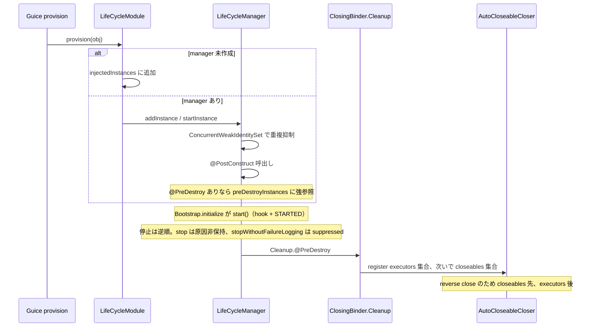

# 第3章 ライフサイクル管理とリソース解放

> **本章で読むソース**
>
> - [bootstrap/src/main/java/io/airlift/bootstrap/LifeCycleModule.java](https://github.com/airlift/airlift/blob/439/bootstrap/src/main/java/io/airlift/bootstrap/LifeCycleModule.java)
> - [bootstrap/src/main/java/io/airlift/bootstrap/LifeCycleManager.java](https://github.com/airlift/airlift/blob/439/bootstrap/src/main/java/io/airlift/bootstrap/LifeCycleManager.java)
> - [bootstrap/src/main/java/io/airlift/bootstrap/ConcurrentWeakIdentitySet.java](https://github.com/airlift/airlift/blob/439/bootstrap/src/main/java/io/airlift/bootstrap/ConcurrentWeakIdentitySet.java)
> - [bootstrap/src/main/java/io/airlift/bootstrap/ClosingBinder.java](https://github.com/airlift/airlift/blob/439/bootstrap/src/main/java/io/airlift/bootstrap/ClosingBinder.java)
> - [bootstrap/src/main/java/io/airlift/bootstrap/AutoCloseableCloser.java](https://github.com/airlift/airlift/blob/439/bootstrap/src/main/java/io/airlift/bootstrap/AutoCloseableCloser.java)

## この章の狙い

第2章の末尾で `LifeCycleManager.start` が呼ばれることを見た。
本章では、Guice の provision から `@PostConstruct` / `@PreDestroy` へつながる経路と、executor / `AutoCloseable` を逆順で閉じる経路を分ける。
`ExportBinder` と `@Managed` は外部 `org.weakref.jmx` の境界であり、Airlift 本体のライフサイクル機構そのものではない。

## 前提

Guice の `ProvisionListener` と multibinder、Jakarta の `@PostConstruct` / `@PreDestroy` の意味を知っているものとする。
`Bootstrap.initialize` が `LifeCycleModule` をシステムモジュールとして先に積むこと（第2章）を前提にする。

## LifeCycleModule：provision で拾う

`LifeCycleModule.configure` はすべてのバインディングに `ProvisionListener` を付け、あわせて `LifeCycleManager` を JMX へエクスポートする。

[bootstrap/src/main/java/io/airlift/bootstrap/LifeCycleModule.java L58-L64](https://github.com/airlift/airlift/blob/439/bootstrap/src/main/java/io/airlift/bootstrap/LifeCycleModule.java#L58-L64)

```java
    @Override
    public void configure(Binder binder)
    {
        binder.bindListener(any(), this::provision);

        newExporter(binder).export(LifeCycleManager.class).withGeneratedName();
    }
```

`newExporter` は `org.weakref.jmx.guice.ExportBinder` である。
計測用の公開経路であり、開始や停止の本体ではない。

provision のコールバックは、生成されたオブジェクトにライフサイクル注釈があるときだけ `LifeCycleManager` へ渡す。

[bootstrap/src/main/java/io/airlift/bootstrap/LifeCycleModule.java L66-L95](https://github.com/airlift/airlift/blob/439/bootstrap/src/main/java/io/airlift/bootstrap/LifeCycleModule.java#L66-L95)

```java
    private <T> void provision(ProvisionInvocation<T> provision)
    {
        Object obj = provision.provision();
        if ((obj == null) || !isLifeCycleClass(obj.getClass())) {
            return;
        }

        LifeCycleManager manager = lifeCycleManager.get();
        if (manager != null) {
            try {
                manager.addInstance(obj);
            }
            catch (Exception e) {
                throwIfUnchecked(e);
                throw new RuntimeException(e);
            }
        }
        else {
            injectedInstances.add(obj);
        }
    }

    @Provides
    @Singleton
    public LifeCycleManager getLifeCycleManager()
    {
        LifeCycleManager lifeCycleManager = new LifeCycleManager(name, injectedInstances, lifeCycleMethodsMap);
        this.lifeCycleManager.set(lifeCycleManager);
        return lifeCycleManager;
    }
```

Manager がまだ無いあいだに provision されたインスタンスは `injectedInstances` に溜まる。
`@Provides` で Manager を作るとき、溜まったリストをコンストラクタへ渡し、その場で `addInstance` する。
以後の provision は Manager へ直接渡る。
この二段バッファにより、Injector 構築中の順序依存を吸収する。

## LifeCycleManager：開始、重複抑制、逆順停止

`addInstance` は状態が STOPPING / STOPPED でなければ `startInstance` を呼ぶ。
`startInstance` が `@PostConstruct` を実行し、`@PreDestroy` があるものだけ停止キューへ入れる。

[bootstrap/src/main/java/io/airlift/bootstrap/LifeCycleManager.java L236-L273](https://github.com/airlift/airlift/blob/439/bootstrap/src/main/java/io/airlift/bootstrap/LifeCycleManager.java#L236-L273)

```java
    private void startInstance(Object obj)
            throws LifeCycleStartException
    {
        log.debug("Starting %s", obj.getClass().getName());
        LifeCycleMethods methods = methodsMap.get(obj.getClass());

        if (!methods.hasFor(PostConstruct.class) && !methods.hasFor(PreDestroy.class)) {
            // no need to track in startedInstances or managedInstances
            return;
        }

        // Guice can double provision instances (in particular with Optional binding).
        // Protect against calling post-construct and pre-destroy methods more than once
        if (!startedInstances.add(obj)) {
            return;
        }

        for (Method postConstruct : methods.methodsFor(PostConstruct.class)) {
            log.debug("- invoke %s::%s()", postConstruct.getDeclaringClass().getName(), postConstruct.getName());
            try {
                postConstruct.invoke(obj);
            }
            catch (Exception e) {
                LifeCycleStartException failure = new LifeCycleStartException(
                        "Exception in PostConstruct method %s::%s()".formatted(obj.getClass().getName(), postConstruct.getName()),
                        unwrapInvocationTargetException(e));
                stopInstance(obj, (Class<?> klass, Method method, Exception exception) -> {
                    String message = "Exception in PreDestroy method %1$s::%2$s() after PostConstruct failure in %1$s::%3$s()".formatted(klass.getName(), method.getName(), postConstruct.getName());
                    failure.addSuppressed(new RuntimeException(message, exception));
                });
                throw failure;
            }
        }

        if (methods.hasFor(PreDestroy.class)) {
            preDestroyInstances.add(obj);
        }
    }
```

Guice は Optional バインディングなどで同一インスタンスを二重に provision しうる。
そのとき `@PostConstruct` を二度呼ぶと資源リークや状態破壊になる。
抑制は `ConcurrentWeakIdentitySet` が担う。

[bootstrap/src/main/java/io/airlift/bootstrap/ConcurrentWeakIdentitySet.java L16-L57](https://github.com/airlift/airlift/blob/439/bootstrap/src/main/java/io/airlift/bootstrap/ConcurrentWeakIdentitySet.java#L16-L57)

```java
    // copied/modified from WeakHashMap implementation
    private static class Wrapper
            extends WeakReference<Object>
    {
        private final int id;

        private Wrapper(Object o, ReferenceQueue<Object> queue)
        {
            super(o, queue);

            // Asserting that "id" refers to an object's address in memory and that no
            // two objects can have the same identityHashCode.
            // This may not be true for all VM implementations.
            id = identityHashCode(o);
        }

        @Override
        public boolean equals(Object o)
        {
            return (this == o) || ((o instanceof Wrapper wrapper) && (wrapper.id == id));
        }

        @Override
        public int hashCode()
        {
            return id;
        }
    }

    // ... (中略) ...

    boolean add(Object o)
    {
        removeStaleEntries();

        return set.add(new Wrapper(o, queue));
    }
```

`Wrapper.equals` は参照先を `==` では比較せず、`identityHashCode` が同じ Wrapper を同一扱いする。
ソース自身が「アドレスでも一意でもない可能性がある」と注記しており、衝突すれば別インスタンスを重複と誤判定しうる。
弱参照で集合に留めないのは、主に `@PostConstruct` だけを持つ対象の保持を避けるためである。
`@PreDestroy` を持つ対象は、直後に `preDestroyInstances` へ入り、停止まで強参照される。
「ライフサイクル対象全体の寿命を歪めない」わけではない。
`add` が `false` を返したとき、`startInstance` は即座に return する。

`Bootstrap.initialize` が呼ぶ `LifeCycleManager.start` 自体は、shutdown hook の登録と STARTED 遷移が主である。
すでに provision 経由で `@PostConstruct` 済みのインスタンスが止まらないよう、状態を公開する役割が大きい。

## 通常停止の失敗契約

停止は `preDestroyInstances` の登録逆順で進む。
公開 API は二つあり、失敗の扱いだけが違う。

[bootstrap/src/main/java/io/airlift/bootstrap/LifeCycleManager.java L129-L173](https://github.com/airlift/airlift/blob/439/bootstrap/src/main/java/io/airlift/bootstrap/LifeCycleManager.java#L129-L173)

```java
    /**
     * Stop the lifecycle - all instances will have their {@link PreDestroy} method(s) called
     * and any exceptions raised will be collected and thrown in a wrapped {@link LifeCycleStopException} as
     * suppressed exceptions. Those failures will not be logged and are the responsibility of the caller to
     * handle appropriately.
     *
     * @throws LifeCycleStopException If any failure occurs during the clean up process
     */
    @Managed
    public void stopWithoutFailureLogging()
            throws LifeCycleStopException
    {
        List<Exception> failures = new ArrayList<>();
        stop((_, _, exception) -> failures.add(exception));
        if (!failures.isEmpty()) {
            LifeCycleStopException stopException = new LifeCycleStopException();
            for (Exception e : failures) {
                stopException.addSuppressed(e);
            }
            throw stopException;
        }
    }

    /**
     * Stop the life cycle - all instances will have their {@link PreDestroy} method(s) called
     * and any exceptions raised will be immediately logged. If any such exceptions occur, a single
     * {@link LifeCycleStopException} will be raised at the end of processing which will <b>not</b>
     * contain any reference to exceptions already logged.
     *
     * @throws LifeCycleStopException If any failure occurs during the clean up process
     */
    @Managed
    public void stop()
            throws LifeCycleStopException
    {
        AtomicBoolean failure = new AtomicBoolean(false);
        stop((klass, method, exception) -> {
            failure.set(true);
            log.error(exception, "Exception in PreDestroy method %s::%s()", klass.getName(), method.getName());
        });

        if (failure.get()) {
            throw new LifeCycleStopException();
        }
    }
```

どちらも内部の `stop(handler)` に委譲する。
個別例外の行き先だけが分岐する。

[bootstrap/src/main/java/io/airlift/bootstrap/LifeCycleManager.java L179-L234](https://github.com/airlift/airlift/blob/439/bootstrap/src/main/java/io/airlift/bootstrap/LifeCycleManager.java#L179-L234)

```java
    private void stop(LifeCycleStopFailureHandler handler)
    {
        if (!state.compareAndSet(State.STARTED, State.STOPPING)) {
            return;
        }

        Thread thread = shutdownHook.getAndSet(null);
        if (thread != null) {
            try {
                Runtime.getRuntime().removeShutdownHook(thread);
            }
            catch (IllegalStateException ignored) {
            }
        }

        log.debug("Lifecycle '%s' stopping...", name);

        for (Object obj : new ArrayList<>(preDestroyInstances).reversed()) {
            stopInstance(obj, handler);
        }

        state.set(State.STOPPED);
        if (!preDestroyInstances.isEmpty()) {
            log.debug("Lifecycle '%s' stopped with %d managed instance(s)", name, preDestroyInstances.size());
        }
    }

    // ... (中略) ...

    private void stopInstance(Object obj, LifeCycleStopFailureHandler handler)
    {
        log.debug("Stopping %s", obj.getClass().getName());
        LifeCycleMethods methods = methodsMap.get(obj.getClass());
        for (Method preDestroy : methods.methodsFor(PreDestroy.class)) {
            log.debug("- invoke %s::%s()", preDestroy.getDeclaringClass().getName(), preDestroy.getName());
            try (ThreadContextClassLoader _ = new ThreadContextClassLoader(obj.getClass().getClassLoader())) {
                preDestroy.invoke(obj);
            }
            catch (Exception e) {
                handler.handlePreDestroyException(obj.getClass(), preDestroy, unwrapInvocationTargetException(e));
            }
        }
    }
```

`stopInstance` は各 `@PreDestroy` の例外を handler に渡し、後続メソッドと後続インスタンスを続ける。
逆順停止は最後まで進む。
通常の `stop()` は個別例外をその場でログし、終端の `LifeCycleStopException` には原因を載せない。
`stopWithoutFailureLogging()` はログせず、個別例外を `LifeCycleStopException` の suppressed に積んで投げる。
後から立ち上がった依存側を先に壊し、基盤側を後に残す点は共通である。
`@Managed` の付いた公開メソッドは外部 jmxutils の公開面でもあるが、失敗契約そのものはこの分岐にある。

## ClosingBinder と AutoCloseableCloser

注釈ベースとは別に、`ClosingBinder` は `@ForCleanup` 付き multibinder に executor と `AutoCloseable` を集め、eager singleton の `Cleanup` が `@PreDestroy` でまとめて閉じる。

[bootstrap/src/main/java/io/airlift/bootstrap/ClosingBinder.java L37-L42](https://github.com/airlift/airlift/blob/439/bootstrap/src/main/java/io/airlift/bootstrap/ClosingBinder.java#L37-L42)

```java
    private ClosingBinder(Binder binder)
    {
        executors = newSetBinder(binder, ExecutorService.class, ForCleanup.class);
        closeables = newSetBinder(binder, AutoCloseable.class, ForCleanup.class);
        binder.bind(Cleanup.class).asEagerSingleton();
    }
```

[bootstrap/src/main/java/io/airlift/bootstrap/ClosingBinder.java L108-L126](https://github.com/airlift/airlift/blob/439/bootstrap/src/main/java/io/airlift/bootstrap/ClosingBinder.java#L108-L126)

```java
    private record Cleanup(@ForCleanup Set<ExecutorService> executors, @ForCleanup Set<AutoCloseable> closeables)
    {
        @Inject
        private Cleanup
        {
            executors = ImmutableSet.copyOf(executors);
            closeables = ImmutableSet.copyOf(closeables);
        }

        @PreDestroy
        public void shutdown()
                throws Exception
        {
            try (var closer = AutoCloseableCloser.create()) {
                executors.forEach(executor -> closer.register(executor::shutdownNow));
                closeables.forEach(closer::register);
            }
        }
    }
```

登録順は ExecutorService 集合を先に `shutdownNow` ラッパーとして載せ、AutoCloseable 集合を後に載せる。
`AutoCloseableCloser` は登録の逆順で `close` するため、**closeables が先、executors が後**である。
各集合の内部順序は multibinder の反復順（`ImmutableSet.copyOf`）に従う。
カテゴリ間の順序は、この二集合の登録と逆順解放で固定されている。

[bootstrap/src/main/java/io/airlift/bootstrap/AutoCloseableCloser.java L53-L85](https://github.com/airlift/airlift/blob/439/bootstrap/src/main/java/io/airlift/bootstrap/AutoCloseableCloser.java#L53-L85)

```java
    @Override
    public void close()
            throws Exception
    {
        List<AutoCloseable> closeables;
        synchronized (this) {
            closed = true;
            closeables = List.copyOf(this.closeables.reversed());
            this.closeables.clear();
            this.closeables.trimToSize();
        }
        Throwable rootCause = null;
        for (AutoCloseable closeable : closeables) {
            try {
                closeable.close();
            }
            catch (Throwable t) {
                if (rootCause == null) {
                    rootCause = t;
                }
                else if (rootCause != t) {
                    // Self-suppression not permitted
                    rootCause.addSuppressed(t);
                }
            }
        }
        if (rootCause != null) {
            throwIfInstanceOf(rootCause, Exception.class);
            throwIfUnchecked(rootCause);
            // not possible
            throw new AssertionError(rootCause);
        }
    }
```

途中の `close` が失敗しても後続を打ち切らない。
最初の例外以外は suppressed に積む。
一つのリソース失敗で残りの解放を止めないための機構である。

## 処理の流れ



## 高速化と最適化の工夫

重複 provision への防御を弱参照と `identityHashCode` の集合で行うことで、同一オブジェクトへの `@PostConstruct` 二重実行を抑えつつ、`@PostConstruct` だけの対象を強参照で留めない。
衝突可能性という制約はあるが、Optional 二重 provision のような頻出ケースを安価に弾く。
逆順停止と `AutoCloseableCloser` の suppressed 集約は、失敗しても解放処理を最後まで進める。
通常の `stop()` は原因を例外に載せずログへ逃がし、呼び出し側の契約を単純に保つ。

## まとめ

- `LifeCycleModule` の `ProvisionListener` がライフサイクル対象を拾い、Manager 生成前後でバッファか直接登録かを切り替える。
- `LifeCycleManager` は `ConcurrentWeakIdentitySet` で重複開始を抑え、`@PreDestroy` 対象は `preDestroyInstances` が停止まで保持する。
- 通常の `stop()` は個別失敗をログして原因非保持の `LifeCycleStopException` を投げ、`stopWithoutFailureLogging()` は suppressed に積む。
- `ClosingBinder` は executors 集合を先に、closeables 集合を後に登録し、逆順 close で closeables が先に解放される。
- `ExportBinder` / `@Managed` は外部 jmxutils の観測境界でもあるが、失敗契約の本体は上記の分岐である。

## 関連する章

- [第2章 Bootstrap と Injector 構築](02-bootstrap.md)
- [第4章 設定の入力とバインド](../part02-config/04-config-binding.md)
- [第20章 JMX と OpenMetrics 公開](../part08-observability/20-jmx-openmetrics.md)
