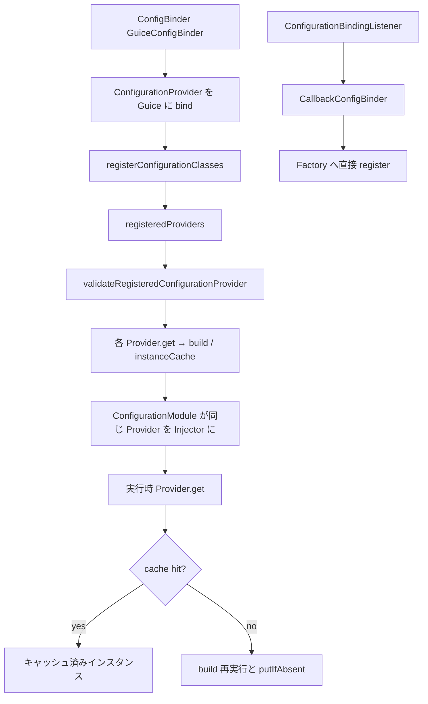

# 第4章 設定の入力とバインド

> **本章で読むソース**
>
> - [configuration/src/main/java/io/airlift/configuration/ConfigurationLoader.java](https://github.com/airlift/airlift/blob/439/configuration/src/main/java/io/airlift/configuration/ConfigurationLoader.java)
> - [configuration/src/main/java/io/airlift/configuration/ConfigBinder.java](https://github.com/airlift/airlift/blob/439/configuration/src/main/java/io/airlift/configuration/ConfigBinder.java)
> - [configuration/src/main/java/io/airlift/configuration/ConfigurationProvider.java](https://github.com/airlift/airlift/blob/439/configuration/src/main/java/io/airlift/configuration/ConfigurationProvider.java)
> - [configuration/src/main/java/io/airlift/configuration/ConfigurationFactory.java](https://github.com/airlift/airlift/blob/439/configuration/src/main/java/io/airlift/configuration/ConfigurationFactory.java)

## この章の狙い

Airlift の設定経路は、文字列マップの読込と、Guice への設定クラス登録と、実体生成の三段に分かれる。
本章では `ConfigurationLoader` による入力、`ConfigBinder` / `ConfigurationProvider` によるバインド、`ConfigurationFactory.build` への接続を追う。
プロパティ名と setter の対応付け、型変換、Bean Validation の詳細は第5章に分ける。

## 前提

第2章で見た `Bootstrap.configure` がプロパティ合成と `ConfigurationFactory` 作成を行うことを知っているものとする。
Guice の `Provider` と `Elements.getElements` によるモジュール走査の概念があると読みやすい。

## ConfigurationLoader：静的な入力入口

`ConfigurationLoader` はインスタンス状態を持たない静的ユーティリティである。
ファイルと system properties をマップへ落とすだけを担当する。

[configuration/src/main/java/io/airlift/configuration/ConfigurationLoader.java L35-L47](https://github.com/airlift/airlift/blob/439/configuration/src/main/java/io/airlift/configuration/ConfigurationLoader.java#L35-L47)

```java
    public static Map<String, String> loadProperties()
            throws IOException
    {
        Map<String, String> result = new TreeMap<>();
        String configFile = System.getProperty("config");
        if (configFile != null) {
            result.putAll(loadPropertiesFrom(configFile));
        }

        result.putAll(getSystemProperties());

        return ImmutableSortedMap.copyOf(result);
    }
```

ファイルを先に入れ、system properties で上書きする。
`Bootstrap` 本体は任意プロパティや secrets 展開を足すため、必ずしもこの一メソッドだけを使うわけではない。
それでも「どこから文字列プロパティが来るか」の原型はここにある。

ファイル読込は `Properties.load` のあと、値を trim して不変マップにする。

[configuration/src/main/java/io/airlift/configuration/ConfigurationLoader.java L56-L74](https://github.com/airlift/airlift/blob/439/configuration/src/main/java/io/airlift/configuration/ConfigurationLoader.java#L56-L74)

```java
    public static Map<String, String> loadPropertiesFrom(String path)
            throws IOException
    {
        Properties properties = new Properties();
        try (InputStream inputStream = new FileInputStream(path)) {
            properties.load(inputStream);
        }

        return fromProperties(properties).entrySet().stream()
                .collect(toImmutableMap(Entry::getKey, entry -> entry.getValue().trim()));
    }

    public static Map<String, String> getSystemProperties()
    {
        Properties systemProperties = System.getProperties();
        synchronized (systemProperties) {
            return fromProperties(systemProperties);
        }
    }
```

`getSystemProperties` は `Properties` のスナップショットを同期ブロック内で取る。
列挙中に別スレッドが system property を変えても、コピーが一貫することを狙っている。

## ConfigBinder：設定クラスを Guice に載せる

アプリケーションやフレームワークの `Module` は、だいたい `configBinder(binder).bindConfig(SomeConfig.class)` を呼ぶ。
公開 API は最終的に `Key`、設定クラス、任意の prefix を `ConfigurationBinding` に包んで内部 binder へ渡す。

[configuration/src/main/java/io/airlift/configuration/ConfigBinder.java L177-L180](https://github.com/airlift/airlift/blob/439/configuration/src/main/java/io/airlift/configuration/ConfigBinder.java#L177-L180)

```java
    public <T> void bindConfig(Key<T> key, Class<T> configClass, String prefix)
    {
        binder.bind(new ConfigurationBinding<>(key, configClass, Optional.ofNullable(prefix)));
    }
```

Guice 経路の実装は `GuiceConfigBinder` である。
設定キーを `ConfigurationProvider` の Provider としてバインドする。

[configuration/src/main/java/io/airlift/configuration/ConfigBinder.java L49-L55](https://github.com/airlift/airlift/blob/439/configuration/src/main/java/io/airlift/configuration/ConfigBinder.java#L49-L55)

```java
        @Override
        public <T> void bind(ConfigurationBinding<T> configurationBinding)
        {
            Key<T> key = configurationBinding.key();
            binder.bind(key).toProvider(new ConfigurationProvider<>(configurationBinding));
            createConfigDefaultsBinder(key);
        }
```

同時に defaults 用の multibinder も用意する。
設定オブジェクトそのものはこの時点では作らない。
「このキーは `ConfigurationProvider` 経由で供給する」という宣言だけが Guice グラフに入る。

もう一つの内部実装が `CallbackConfigBinder` である。
`ConfigurationAwareModule.buildConfigObject` が使うのはこちらではない。
第6章の `AbstractConfigurationAwareModule` は渡された Guice Binder に対し `configBinder(binder)`、つまり通常の `GuiceConfigBinder` を使う。
`CallbackConfigBinder` は、`ConfigurationFactory` が `ConfigurationBindingListener.configurationBound` を呼ぶときに渡す binder である。

[configuration/src/main/java/io/airlift/configuration/ConfigBinder.java L93-L121](https://github.com/airlift/airlift/blob/439/configuration/src/main/java/io/airlift/configuration/ConfigBinder.java#L93-L121)

```java
    private static final class CallbackConfigBinder
            implements InternalConfigBinder
    {
        private final ConfigurationFactory configurationFactory;
        private final Optional<Object> bindingSource;

        public CallbackConfigBinder(ConfigurationFactory configurationFactory, Optional<Object> bindingSource)
        {
            this.configurationFactory = requireNonNull(configurationFactory, "configurationFactory is null");
            this.bindingSource = requireNonNull(bindingSource, "bindingSource is null");
        }

        @Override
        public <T> void bind(ConfigurationBinding<T> configurationBinding)
        {
            configurationFactory.registerConfigurationProvider(new ConfigurationProvider<>(configurationBinding), bindingSource);
        }

        @Override
        public <T> void bindConfigDefaults(ConfigDefaultsHolder<T> configDefaultsHolder)
        {
            configurationFactory.registerConfigDefaults(configDefaultsHolder);
        }

        @Override
        public void bindConfigurationBindingListener(ConfigurationBindingListener configurationBindingListener)
        {
            configurationFactory.addConfigurationBindingListener(configurationBindingListener);
        }
```

[configuration/src/main/java/io/airlift/configuration/ConfigurationFactory.java L786-L802](https://github.com/airlift/airlift/blob/439/configuration/src/main/java/io/airlift/configuration/ConfigurationFactory.java#L786-L802)

```java
    private class ConfigurationProviderConsumer
            implements Consumer<ConfigurationProvider<?>>
    {
        private final ConfigurationBindingListener listener;
        private final ConfigBinder configBinder;

        public ConfigurationProviderConsumer(ConfigurationBindingListener listener)
        {
            this.listener = listener;
            this.configBinder = ConfigBinder.configBinder(ConfigurationFactory.this, Optional.of(listener));
        }

        @Override
        public void accept(ConfigurationProvider<?> configurationProvider)
        {
            listener.configurationBound(configurationProvider.getConfigurationBinding(), configBinder);
        }
```

listener が追加した binding / default / listener は Guice へは行かず、Factory へ直接登録される。
再帰的な callback 経路であり、Injector 前の設定走査とは別の仕組みである。

## ConfigurationProvider：validate と注入の二段

`ConfigurationProvider.get` は注入された `ConfigurationFactory` に構築を委譲する。

[configuration/src/main/java/io/airlift/configuration/ConfigurationProvider.java L61-L67](https://github.com/airlift/airlift/blob/439/configuration/src/main/java/io/airlift/configuration/ConfigurationProvider.java#L61-L67)

```java
    @Override
    public T get()
    {
        requireNonNull(configurationFactory, "configurationFactory");

        return configurationFactory.build(this);
    }
```

Provider 自身は `ConfigurationBinding`（key / class / prefix）を保持するだけである。
等値性も binding 単位なので、同じ binding の Provider はキャッシュキーとして同一視できる。

ただし通常の Bootstrap 経路では、実行時注入まで生成を遅延しない。
`Bootstrap.configure` は `registerConfigurationClasses` のあと `validateRegisteredConfigurationProvider` を呼び、登録済み Provider の `get` を全件実行して `instanceCache` を埋める。

[configuration/src/main/java/io/airlift/configuration/ConfigurationFactory.java L255-L271](https://github.com/airlift/airlift/blob/439/configuration/src/main/java/io/airlift/configuration/ConfigurationFactory.java#L255-L271)

```java
    public List<Message> validateRegisteredConfigurationProvider()
    {
        List<Message> messages = new ArrayList<>();
        for (ConfigurationProvider<?> configurationProvider : ImmutableList.copyOf(registeredProviders)) {
            try {
                // call the getter which will cause object creation
                configurationProvider.get();
            }
            catch (ConfigurationException e) {
                // if we got errors, add them to the errors list
                ImmutableList<Object> sources = configurationProvider.getBindingSource().map(ImmutableList::of).orElse(ImmutableList.of());
                for (Message message : e.getErrorMessages()) {
                    messages.add(new Message(sources, message.getMessage(), message.getCause()));
                }
            }
        }
        return messages;
```

その後 `ConfigurationModule` が同じ Provider を実 Injector に bind する。
標準経路の実行時注入は、だいたいキャッシュ済みインスタンスを受け取る。
したがって段落は register → validate（全件 build / cache）→ ConfigurationModule → 実行時 Provider.get（cache hit）の二段である。

## ConfigurationFactory：登録掃き出しと build

`Bootstrap.configure` はモジュールを渡して `registerConfigurationClasses` を呼ぶ。
ここは Guice の要素ツリーを歩き、`ConfigurationProvider` インスタンスを factory に登録する。

[configuration/src/main/java/io/airlift/configuration/ConfigurationFactory.java L189-L215](https://github.com/airlift/airlift/blob/439/configuration/src/main/java/io/airlift/configuration/ConfigurationFactory.java#L189-L215)

```java
        for (Element element : Elements.getElements(modules)) {
            element.acceptVisitor(new DefaultElementVisitor<Void>()
            {
                @Override
                public <T> Void visit(Binding<T> binding)
                {
                    if (binding instanceof InstanceBinding<?> instanceBinding) {
                        // configuration listener
                        if (instanceBinding.getInstance() instanceof ConfigurationBindingListenerHolder) {
                            addConfigurationBindingListener(((ConfigurationBindingListenerHolder) instanceBinding.getInstance()).getConfigurationBindingListener());
                        }

                        // config defaults
                        if (instanceBinding.getInstance() instanceof ConfigDefaultsHolder) {
                            registerConfigDefaults((ConfigDefaultsHolder<?>) instanceBinding.getInstance());
                        }
                    }

                    // configuration provider
                    if (binding instanceof ProviderInstanceBinding<?> providerInstanceBinding) {
                        Provider<?> provider = providerInstanceBinding.getProviderInstance();
                        if (provider instanceof ConfigurationProvider<?> configurationProvider) {
                            registerConfigurationProvider(configurationProvider, Optional.of(binding.getSource()));
                        }
                    }
                    return null;
                }
```

Injector を作る前に「どの設定クラスがグラフに載るか」を確定できる。
未使用プロパティ検査（第2章）の前提がここで揃う。

Provider 経由の `build` は、登録、キャッシュ参照、実体生成、警告通知、キャッシュ格納の順である。

[configuration/src/main/java/io/airlift/configuration/ConfigurationFactory.java L336-L366](https://github.com/airlift/airlift/blob/439/configuration/src/main/java/io/airlift/configuration/ConfigurationFactory.java#L336-L366)

```java
    <T> T build(ConfigurationProvider<T> configurationProvider)
    {
        requireNonNull(configurationProvider, "configurationProvider");
        registerConfigurationProvider(configurationProvider, Optional.empty());

        // check for a prebuilt instance
        T instance = getCachedInstance(configurationProvider);
        if (instance != null) {
            return instance;
        }

        ConfigurationBinding<T> configurationBinding = configurationProvider.getConfigurationBinding();
        ConfigurationHolder<T> holder = build(configurationBinding.configClass(), configurationBinding.prefix(), getConfigDefaults(configurationBinding.key()));
        instance = holder.instance();

        // inform caller about warnings
        if (warningsMonitor != null) {
            for (Message message : holder.problems().getWarnings()) {
                warningsMonitor.onWarning(message.toString());
            }
        }

        // add to instance cache
        T existingValue = putCachedInstance(configurationProvider, instance);
        // if key was already associated with a value, there was a
        // creation race and we lost. Just use the winners' instance;
        if (existingValue != null) {
            return existingValue;
        }
        return instance;
    }
```

同一 `ConfigurationProvider` に対する二度目以降の要求は、`instanceCache` から返す。
キャッシュの単位は設定クラスそのものではなく、`ConfigurationBinding`（key / class / prefix）と等価な Provider である。
`putIfAbsent` は build のあとに走る。
したがって並行の初回要求では、複数スレッドが new / defaults / setter / warning まで実行しうる。
保証されるのは、キャッシュに残り呼び出し側へ返る正本が勝者一件になることだけである。
「setter 呼出しを常に一回に抑える」わけではない。
標準 Bootstrap では先に `validateRegisteredConfigurationProvider` が埋めるため、その後の Injector 注入では競合が起きにくい。

## 処理の流れ



読み取り（Loader）と宣言（ConfigBinder）と生成（Factory.build）がファイル境界でも分かれている。
第5章のメタデータ検証は、この図の `build` の内側で起きる。

## 高速化と最適化の工夫

設定インスタンスは `ConcurrentHashMap` の `instanceCache` に Provider 単位で載せる。
標準経路では validate 時にキャッシュが埋まるため、Injector 注入時の再構築を避けられる。
`putIfAbsent` は並行初回でも返す正本を一件に揃えるが、負けた側の setter 実行まで無かったことにはしない。
事前検証済み経路に限れば、実質的な二重適用は起きにくい。

## まとめ

- `ConfigurationLoader` は config ファイルと system properties を文字列マップへ落とす静的入口である。
- `ConfigBinder` の主経路は `GuiceConfigBinder` であり、`CallbackConfigBinder` は listener の再帰 callback 用である。
- `registerConfigurationClasses` のあと `validateRegisteredConfigurationProvider` が全件 build / cache する。
- `ConfigurationFactory.build(ConfigurationProvider)` のキャッシュ単位は Provider（binding）であり、`putIfAbsent` は正本一件を保証する。

## 関連する章

- [第2章 Bootstrap と Injector 構築](../part01-di-lifecycle/02-bootstrap.md)
- [第5章 設定メタデータと検証](05-config-metadata.md)
- [第6章 ConfigurationAwareModule](06-config-aware-module.md)
