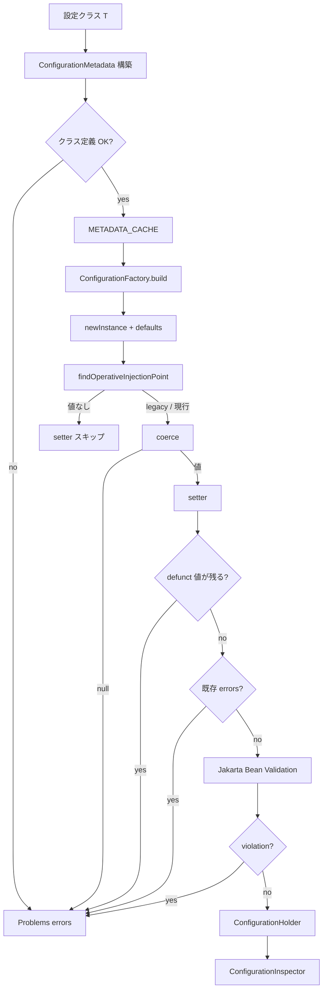

# 第5章 設定メタデータと検証

> **本章で読むソース**
>
> - [configuration/src/main/java/io/airlift/configuration/ConfigurationMetadata.java](https://github.com/airlift/airlift/blob/439/configuration/src/main/java/io/airlift/configuration/ConfigurationMetadata.java)
> - [configuration/src/main/java/io/airlift/configuration/ConfigurationFactory.java](https://github.com/airlift/airlift/blob/439/configuration/src/main/java/io/airlift/configuration/ConfigurationFactory.java)
> - [configuration/src/main/java/io/airlift/configuration/Problems.java](https://github.com/airlift/airlift/blob/439/configuration/src/main/java/io/airlift/configuration/Problems.java)
> - [configuration/src/main/java/io/airlift/configuration/ConfigurationInspector.java](https://github.com/airlift/airlift/blob/439/configuration/src/main/java/io/airlift/configuration/ConfigurationInspector.java)

## この章の狙い

第4章の `ConfigurationFactory.build` は、内側で二つの仕事をしている。
一つは設定クラスの形そのものの検査であり、もう一つは文字列プロパティから実体への注入と実行時検証である。
前者は `ConfigurationMetadata`、後者は `ConfigurationFactory` が担う。
本章ではこの責務境界を分けたうえで、defunct property、型変換、Jakarta Bean Validation、`Problems` / `ConfigurationInspector` まで追う。

## 前提

第4章の `ConfigBinder` → `ConfigurationProvider` → `build` の接続を理解しているものとする。
`@Config` アノテーション付き setter、任意の getter、`@DefunctConfig` という設定クラスの慣習を知っているとよい。

## 責務境界：Metadata と Factory

役割を先に固定する。

| 役割 | 担当 | 扱う対象 |
|---|---|---|
| クラス静的構造の発見と整合 | `ConfigurationMetadata` | `@Config` / getter / legacy / defunct 宣言の妥当性 |
| 実行時プロパティの適用と検証 | `ConfigurationFactory` | 文字列→型、setter 呼出し、defunct の残存値、Bean Validation |
| エラー蓄積 | `Problems` | 両者が共有するメッセージ袋 |
| 実効設定の閲覧 | `ConfigurationInspector` | 登録済み Provider から default / runtime 値を摘む |

Metadata は「このクラスは設定クラスとして筋が通っているか」を見る。
Factory は「いまのプロパティマップでこのクラスを正しく埋められるか」を見る。
同じ `Problems` 型を使うが、検査の問いが違う。

## ConfigurationMetadata：発見とクラス側検証

ファクトリメソッドはコンストラクタを包むだけである。
本体はプライベートコンストラクタで属性マップを組み立てる。

[configuration/src/main/java/io/airlift/configuration/ConfigurationMetadata.java L64-L125](https://github.com/airlift/airlift/blob/439/configuration/src/main/java/io/airlift/configuration/ConfigurationMetadata.java#L64-L125)

```java
    private ConfigurationMetadata(Class<T> configClass)
    {
        if (configClass == null) {
            throw new NullPointerException("configClass is null");
        }

        this.configClass = configClass;
        if (Modifier.isAbstract(configClass.getModifiers())) {
            problems.addError("Config class [%s] is abstract", configClass.getName());
        }
        if (!Modifier.isPublic(configClass.getModifiers())) {
            problems.addError("Config class [%s] is not public", configClass.getName());
        }

        this.defunctConfig = new HashSet<>();
        if (configClass.isAnnotationPresent(DefunctConfig.class)) {
            DefunctConfig defunctConfig = configClass.getAnnotation(DefunctConfig.class);
            if (defunctConfig.value().length < 1) {
                problems.addError("@DefunctConfig annotation on class [%s] is empty", configClass.getName());
            }
            for (String defunct : configClass.getAnnotation(DefunctConfig.class).value()) {
                if (defunct.isEmpty()) {
                    problems.addError("@DefunctConfig annotation on class [%s] contains empty values", configClass.getName());
                }
                else if (!this.defunctConfig.add(defunct)) {
                    problems.addError("Defunct property '%s' is listed more than once in @DefunctConfig for class [%s]", defunct, configClass.getName());
                }
            }
        }

        // verify there is a public no-arg constructor
        Constructor<T> constructor = null;
        try {
            constructor = configClass.getDeclaredConstructor();
            if (!Modifier.isPublic(constructor.getModifiers())) {
                problems.addError("Constructor [%s] is not public", constructor.toGenericString());
            }
        }
        catch (Exception e) {
            problems.addError("Configuration class [%s] does not have a public no-arg constructor", configClass.getName());
        }
        this.constructor = constructor;

        Multimap<String, Method> methods = collectDeclaredMethods(configClass);
        this.attributes = ImmutableSortedMap.copyOf(buildAttributeMetadata(configClass, methods));

        // find invalid config methods not skipped by findConfigMethods()
        for (Method method : methods.values()) {
            if (method.isAnnotationPresent(Config.class)) {
                if (!Modifier.isPublic(method.getModifiers())) {
                    problems.addError("@Config method [%s] is not public", method.toGenericString());
                }
                if (Modifier.isStatic(method.getModifiers())) {
                    problems.addError("@Config method [%s] is static", method.toGenericString());
                }
            }
        }

        if (problems.getErrors().isEmpty() && this.attributes.isEmpty() && defunctConfig.isEmpty()) {
            problems.addError("Configuration class [%s] does not have any @Config annotations", configClass.getName());
        }
    }
```

ここまでの問いはすべてクラス定義である。
プロパティマップの中身はまだ見ない。
`@DefunctConfig` の一覧は属性構築でも参照される。

属性単位の組み立ては、setter 注釈の検証、getter 探索、defunct との衝突検査、legacy 注入点の追加である。

[configuration/src/main/java/io/airlift/configuration/ConfigurationMetadata.java L263-L314](https://github.com/airlift/airlift/blob/439/configuration/src/main/java/io/airlift/configuration/ConfigurationMetadata.java#L263-L314)

```java
    private AttributeMetadata buildAttributeMetadata(Class<T> configClass, Multimap<String, Method> methods, Method configMethod)
    {
        if (!validateAnnotations(configMethod)) {
            return null;
        }

        // verify parameters
        if (!validateSetter(configMethod)) {
            return null;
        }

        String propertyName = configMethod.getAnnotation(Config.class).value();
        final boolean securitySensitive = configMethod.isAnnotationPresent(ConfigSecuritySensitive.class);
        final boolean hidden = configMethod.isAnnotationPresent(ConfigHidden.class);

        // determine the attribute name
        String attributeName = configMethod.getName().substring(3);

        AttributeMetaDataBuilder builder = new AttributeMetaDataBuilder(configClass, attributeName, securitySensitive, hidden);

        if (configMethod.isAnnotationPresent(ConfigDescription.class)) {
            builder.setDescription(configMethod.getAnnotation(ConfigDescription.class).value());
        }

        // find the getter
        Method getter = findGetter(methods, configMethod, attributeName);
        if (getter != null) {
            builder.setGetter(getter);

            if (configMethod.isAnnotationPresent(Deprecated.class) != getter.isAnnotationPresent(Deprecated.class)) {
                problems.addError("Methods [%s] and [%s] must be @Deprecated together", configMethod, getter);
            }
        }

        if (defunctConfig.contains(propertyName)) {
            problems.addError("@Config property '%s' on method [%s] is defunct on class [%s]", propertyName, configMethod, configClass);
        }

        // Add the injection point for the current setter/property
        builder.addInjectionPoint(InjectionPointMetaData.newCurrent(configClass, propertyName, TypeToken.of(configMethod.getGenericParameterTypes()[0]), configMethod));

        // Add injection points for legacy setters/properties
        for (InjectionPointMetaData injectionPoint : findLegacySetters(methods, propertyName, attributeName)) {
            if (!injectionPoint.getSetter().isAnnotationPresent(Config.class) && !injectionPoint.getSetter().isAnnotationPresent(Deprecated.class)) {
                problems.addWarning("Replaced @LegacyConfig method [%s] should be @Deprecated", injectionPoint.getSetter().toGenericString());
            }

            builder.addInjectionPoint(injectionPoint);
        }

        return builder.build();
    }
```

「いま生きている `@Config` プロパティが `@DefunctConfig` に載っている」のはメタデータ段階のエラーである。
実行時にその名前の値が残っているかどうかは、次節の Factory が別途見る。

## ConfigurationFactory.build：適用と実行時検証

Factory はメタデータをキャッシュ経由で取る。

[configuration/src/main/java/io/airlift/configuration/ConfigurationFactory.java L100-L101](https://github.com/airlift/airlift/blob/439/configuration/src/main/java/io/airlift/configuration/ConfigurationFactory.java#L100-L101)

```java
    private static final LoadingCache<Class<?>, ConfigurationMetadata<?>> METADATA_CACHE = CacheBuilder.newBuilder()
            .build(CacheLoader.from(ConfigurationMetadata::getConfigurationMetadata));
```

[configuration/src/main/java/io/airlift/configuration/ConfigurationFactory.java L467-L470](https://github.com/airlift/airlift/blob/439/configuration/src/main/java/io/airlift/configuration/ConfigurationFactory.java#L467-L470)

```java
    private <T> ConfigurationMetadata<T> getMetadata(Class<T> configClass)
    {
        return (ConfigurationMetadata<T>) METADATA_CACHE.getUnchecked(configClass);
    }
```

クラスごとのリフレクション結果をグローバルに再利用する。
同じ設定クラスを何度 build しても、属性発見は初回だけである。

プライベート `build` が実行時経路の本体である。

[configuration/src/main/java/io/airlift/configuration/ConfigurationFactory.java L380-L453](https://github.com/airlift/airlift/blob/439/configuration/src/main/java/io/airlift/configuration/ConfigurationFactory.java#L380-L453)

```java
    private <T> ConfigurationHolder<T> build(Class<T> configClass, Optional<String> configPrefix, ConfigDefaults<T> configDefaults)
    {
        if (configClass == null) {
            throw new NullPointerException("configClass is null");
        }

        String prefix = configPrefix
                .map(value -> value + ".")
                .orElse("");
        Problems problems = new Problems();

        ConfigurationMetadata<T> configurationMetadata = getMetadata(configClass);
        problems.record(configurationMetadata.getProblems());
        problems.throwIfHasErrors();

        T instance = newInstance(configurationMetadata);

        configDefaults.setDefaults(instance);

        for (AttributeMetadata attribute : configurationMetadata.getAttributes().values()) {
            allSeenProperties.add(prefix + attribute.getInjectionPoint().getProperty());
            Problems attributeProblems = new Problems();
            try {
                setConfigProperty(instance, attribute, prefix, attributeProblems);
            }
            catch (InvalidConfigurationException e) {
                attributeProblems.addError(e.getCause(), "%s", e.getMessage());
            }
            problems.record(attributeProblems);
        }

        // Check that none of the defunct properties are still in use
        if (configClass.isAnnotationPresent(DefunctConfig.class)) {
            for (String value : configClass.getAnnotation(DefunctConfig.class).value()) {
                String name = prefix + value;
                if (!value.isEmpty() && properties.get(name) != null) {
                    problems.addError("Defunct property '%s' (class [%s]) cannot be configured.", name, configClass.toString());
                }
            }
        }

        // if there already problems, don't run the bean validation as it typically reports duplicate errors
        problems.throwIfHasErrors();

        for (ConstraintViolation<?> violation : validate(instance)) {
            String propertyFieldName = violation.getPropertyPath().toString();
            // upper case first character to match config attribute name
            String attributeName = LOWER_CAMEL.to(UPPER_CAMEL, propertyFieldName);
            AttributeMetadata attribute = configurationMetadata.getAttributes().get(attributeName);
            if (attribute != null && attribute.getInjectionPoint() != null) {
                String propertyName = attribute.getInjectionPoint().getProperty();
                if (!prefix.isEmpty()) {
                    propertyName = prefix + propertyName;
                }
                problems.addError(
                        "Invalid configuration property %s: %s (for class %s.%s)",
                        propertyName,
                        violation.getMessage(),
                        configClass.getName(),
                        violation.getPropertyPath());
            }
            else {
                problems.addError(
                        "Invalid configuration property with prefix '%s': %s (for class %s.%s)",
                        prefix,
                        violation.getMessage(),
                        configClass.getName(),
                        violation.getPropertyPath());
            }
        }
        problems.throwIfHasErrors();

        return new ConfigurationHolder<>(instance, problems);
    }
```

手順は次のとおりである。

1. メタデータのエラーを取り込み、クラス定義が壊れていれば即失敗する。
2. インスタンスを new し、defaults を載せる。
3. 各属性へ `setConfigProperty` する。
4. `@DefunctConfig` 名がプロパティマップに残っていればエラーにする。
5. ここまでエラーが無ければ Jakarta Bean Validation を走らせる。

メタデータ側の「defunct と現行 `@Config` の衝突」と、factory 側の「defunct 名の値がまだ供給されている」は別の検査である。

属性注入は、生きている注入点を選び、文字列を型へ coerce し、setter を呼ぶ。

[configuration/src/main/java/io/airlift/configuration/ConfigurationFactory.java L485-L511](https://github.com/airlift/airlift/blob/439/configuration/src/main/java/io/airlift/configuration/ConfigurationFactory.java#L485-L511)

```java
    private <T> void setConfigProperty(T instance, AttributeMetadata attribute, String prefix, Problems problems)
            throws InvalidConfigurationException
    {
        // Get property value
        ConfigurationMetadata.InjectionPointMetaData injectionPoint = findOperativeInjectionPoint(attribute, prefix, problems);

        // If we did not get an injection point, do not call the setter
        if (injectionPoint == null) {
            return;
        }

        if (injectionPoint.getSetter().isAnnotationPresent(Deprecated.class)) {
            problems.addWarning("%s", describeDeprecation(prefix, injectionPoint));
        }

        Object value = getInjectedValue(attribute, injectionPoint, prefix);

        try {
            injectionPoint.getSetter().invoke(instance, value);
        }
        catch (Throwable e) {
            if (e instanceof InvocationTargetException && e.getCause() != null) {
                e = e.getCause();
            }
            throw new InvalidConfigurationException(e, "Error invoking configuration method [%s]".formatted(injectionPoint.getSetter().toGenericString()));
        }
    }
```

## findOperativeInjectionPoint：legacy の実行時契約

現行 `@Config` の値と `@LegacyConfig` の値のあいだで、どれを採用するかを決める。

[configuration/src/main/java/io/airlift/configuration/ConfigurationFactory.java L523-L570](https://github.com/airlift/airlift/blob/439/configuration/src/main/java/io/airlift/configuration/ConfigurationFactory.java#L523-L570)

```java
    private ConfigurationMetadata.InjectionPointMetaData findOperativeInjectionPoint(AttributeMetadata attribute, String prefix, Problems problems)
            throws ConfigurationException
    {
        ConfigurationMetadata.InjectionPointMetaData operativeInjectionPoint = attribute.getInjectionPoint();
        String operativeName = null;
        String operativeValue = null;
        if (operativeInjectionPoint != null) {
            operativeName = prefix + operativeInjectionPoint.getProperty();
            operativeValue = properties.get(operativeName);
        }
        String printableOperativeValue = operativeValue;
        if (attribute.isSecuritySensitive()) {
            printableOperativeValue = "[REDACTED]";
        }

        for (ConfigurationMetadata.InjectionPointMetaData injectionPoint : attribute.getLegacyInjectionPoints()) {
            String fullName = prefix + injectionPoint.getProperty();
            String value = properties.get(fullName);
            String printableValue = value;
            if (attribute.isSecuritySensitive()) {
                printableValue = "[REDACTED]";
            }
            if (value != null) {
                String replacement = "deprecated.";
                if (attribute.getInjectionPoint() != null) {
                    replacement = "replaced. Use '%s' instead.".formatted(prefix + attribute.getInjectionPoint().getProperty());
                }
                problems.addWarning("Configuration property '%s' has been %s", fullName, replacement);

                if (operativeValue == null) {
                    operativeInjectionPoint = injectionPoint;
                    operativeValue = value;
                    printableOperativeValue = printableValue;
                    operativeName = fullName;
                }
                else {
                    problems.addError("Configuration property '%s' (=%s) conflicts with property '%s' (=%s)", fullName, printableValue, operativeName, printableOperativeValue);
                }
            }
        }

        problems.throwIfHasErrors();
        if (operativeValue == null) {
            // No injection from configuration
            return null;
        }

        return operativeInjectionPoint;
```

分岐は次の三つに整理できる。

1. **現行プロパティに値が無く、legacy に値がある**：legacy setter / 値を採用し、deprecated / replaced の warning を出す。
2. **現行と legacy の両方に値がある**：conflict error にし、表示値は security-sensitive なら `[REDACTED]` に置き換える。
3. **どちらにも値が無い**：`null` を返し、setter を呼ばず defaults を残す。

「生きている注入点を選ぶ」というのは、この実行時契約の要約である。

## getInjectedValue と coerce

[configuration/src/main/java/io/airlift/configuration/ConfigurationFactory.java L573-L600](https://github.com/airlift/airlift/blob/439/configuration/src/main/java/io/airlift/configuration/ConfigurationFactory.java#L573-L600)

```java
    private Object getInjectedValue(AttributeMetadata attribute, ConfigurationMetadata.InjectionPointMetaData injectionPoint, String prefix)
            throws InvalidConfigurationException
    {
        String name = prefix + injectionPoint.getProperty();
        usedProperties.add(new ConfigPropertyMetadata(name, attribute.isSecuritySensitive()));

        // Get the property value
        String value = properties.get(name);
        String printableValue = value;
        if (attribute.isSecuritySensitive()) {
            printableValue = "[REDACTED]";
        }

        if (value == null) {
            return null;
        }

        // coerce the property value to the final type
        Object finalValue = coerce(injectionPoint.getPropertyType(), value);
        if (finalValue == null) {
            throw new InvalidConfigurationException("Invalid value '%s' for type %s (property '%s') in order to call [%s]".formatted(
                    printableValue,
                    injectionPoint.getPropertyType().getType().getTypeName(),
                    name,
                    injectionPoint.getSetter().toGenericString()));
        }
        return finalValue;
    }
```

`usedProperties` への登録もここで起きる。
第2章の未使用キー検査は、この消費記録に依存する。
`coerce` が `null` を返したとき、上記が `InvalidConfigurationException` になる。
変換本体は次のとおりである。

[configuration/src/main/java/io/airlift/configuration/ConfigurationFactory.java L602-L744](https://github.com/airlift/airlift/blob/439/configuration/src/main/java/io/airlift/configuration/ConfigurationFactory.java#L602-L744)

```java
    private static Object coerce(TypeToken<?> type, String value)
    {
        if (type.isPrimitive() && value == null) {
            return null;
        }

        try {
            if (String.class == type.getRawType()) {
                return value;
            }
            if (Boolean.class == type.getRawType() || boolean.class == type.getRawType()) {
                // Boolean.valueOf returns `false` when called with `"true "` argument
                if ("true".equalsIgnoreCase(value)) {
                    return Boolean.TRUE;
                }
                if ("false".equalsIgnoreCase(value)) {
                    return Boolean.FALSE;
                }
                return null;
            }
            if (Byte.class == type.getRawType() || byte.class == type.getRawType()) {
                return Byte.valueOf(value);
            }
            if (Short.class == type.getRawType() || short.class == type.getRawType()) {
                return Short.valueOf(value);
            }
            if (Integer.class == type.getRawType() || int.class == type.getRawType()) {
                return Integer.valueOf(value);
            }
            if (Long.class == type.getRawType() || long.class == type.getRawType()) {
                return Long.valueOf(value);
            }
            if (Float.class == type.getRawType() || float.class == type.getRawType()) {
                return Float.valueOf(value);
            }
            if (Double.class == type.getRawType() || double.class == type.getRawType()) {
                return Double.valueOf(value);
            }
            if (URI.class == type.getRawType()) {
                return URI.create(value);
            }
        }
        catch (Exception ignored) {
            // ignore the random exceptions from the built in types
            return null;
        }

        Map<String, Method> stringAcceptingMethods = STRING_FACTORY_METHODS.get(type.getRawType());
        // Look for a static fromString(String) methods. This is used in preference
        // to the built-in valueOf() method for enums.
        if (stringAcceptingMethods.get("fromString") instanceof Method fromString) {
            if (type.isSubtypeOf(fromString.getGenericReturnType())) {
                try {
                    return invokeFactory(fromString, value);
                }
                catch (ReflectiveOperationException e) {
                    return null;
                }
            }
        }

        if (type.isSubtypeOf(TypeToken.of(Enum.class))) {
            try {
                return Enum.valueOf(type.getRawType().asSubclass(Enum.class), value.toUpperCase(ENGLISH));
            }
            catch (IllegalArgumentException ignored) {
            }

            Object match = null;
            for (Enum<?> option : type.getRawType().asSubclass(Enum.class).getEnumConstants()) {
                String enumValue = value.replace("-", "_");
                if (option.name().equalsIgnoreCase(enumValue)) {
                    if (match != null) {
                        // Ambiguity
                        return null;
                    }
                    match = option;
                }
            }
            return match;
        }

        if (type.isSubtypeOf(TypeToken.of(Set.class))) {
            TypeToken<?> argumentToken = getActualTypeArgument(type);

            return VALUE_SPLITTER.splitToStream(value)
                    .map(item -> coerce(argumentToken, item))
                    .collect(toImmutableSet());
        }

        if (type.isSubtypeOf(TypeToken.of(List.class))) {
            TypeToken<?> argumentToken = getActualTypeArgument(type);

            return VALUE_SPLITTER.splitToStream(value)
                    .map(item -> coerce(argumentToken, item))
                    .collect(toImmutableList());
        }

        if (type.isSubtypeOf(TypeToken.of(Optional.class))) {
            TypeToken<?> argumentToken = getActualTypeArgument(type);
            return Optional.ofNullable(coerce(argumentToken, value));
        }

        // Look for a static valueOf(String) method
        if (stringAcceptingMethods.get("valueOf") instanceof Method valueOf) {
            if (type.isSubtypeOf(valueOf.getGenericReturnType())) {
                try {
                    return invokeFactory(valueOf, value);
                }
                catch (ReflectiveOperationException e) {
                    return null;
                }
            }
        }

        // Look for a static of(String) method
        if (stringAcceptingMethods.get("of") instanceof Method of) {
            if (type.isSubtypeOf(of.getGenericReturnType())) {
                try {
                    return invokeFactory(of, value);
                }
                catch (ReflectiveOperationException e) {
                    return null;
                }
            }
        }

        // Look for a constructor taking a string
        for (Constructor<?> constructor : type.getRawType().getConstructors()) {
            if (acceptsSingleStringParameter(constructor)) {
                try {
                    if (constructor.isVarArgs()) {
                        return constructor.newInstance(value, new String[0]);
                    }
                    return constructor.newInstance(value);
                }
                catch (ReflectiveOperationException e) {
                    return null;
                }
            }
        }

        return null;
```

順序の要点は次である。

1. boolean は `"true"` / `"false"` の厳密判定であり、空白付きなどは `null`（失敗）になる。
2. 数値と `URI` は組み込み変換である。
3. **静的 `fromString` は enum / `valueOf` より先**であり、コメントも enum の `valueOf` より優先すると明記している。
4. enum は大文字化の `Enum.valueOf` のあと、ハイフンを `_` に置換した名前照合へ落ちる。
5. `Set` / `List` / `Optional` は要素型へ再帰する。
6. fallback は `valueOf` → `of` → `String` 一引数コンストラクタである。
7. どれも失敗すれば `null` を返し、呼び出し側が `InvalidConfigurationException` にする。

## Problems と ConfigurationInspector

`Problems` は errors と warnings を分けて持ち、errors があると `ConfigurationException` へ畳む。

[configuration/src/main/java/io/airlift/configuration/Problems.java L35-L41](https://github.com/airlift/airlift/blob/439/configuration/src/main/java/io/airlift/configuration/Problems.java#L35-L41)

```java
    public void throwIfHasErrors()
            throws ConfigurationException
    {
        if (!errors.isEmpty()) {
            throw getException();
        }
    }
```

`ConfigurationInspector` は登録済み Provider を走査し、default 値と runtime 値の表を作る。
`Bootstrap` の設定ログはこの表を読む。

[configuration/src/main/java/io/airlift/configuration/ConfigurationInspector.java L34-L43](https://github.com/airlift/airlift/blob/439/configuration/src/main/java/io/airlift/configuration/ConfigurationInspector.java#L34-L43)

```java
    public SortedSet<ConfigRecord<?>> inspect(ConfigurationFactory configurationFactory)
    {
        ImmutableSortedSet.Builder<ConfigRecord<?>> builder = ImmutableSortedSet.naturalOrder();
        for (ConfigurationProvider<?> configurationProvider : configurationFactory.getConfigurationProviders()) {
            ConfigRecord<?> result = new ConfigRecord<>(configurationFactory, configurationProvider);
            builder.add(result);
        }

        return builder.build();
    }
```

各レコードは、defaults と runtime を別経路で取る。

[configuration/src/main/java/io/airlift/configuration/ConfigurationInspector.java L74-L119](https://github.com/airlift/airlift/blob/439/configuration/src/main/java/io/airlift/configuration/ConfigurationInspector.java#L74-L119)

```java
        private ConfigRecord(ConfigurationFactory configurationFactory, ConfigurationProvider<T> configurationProvider)
        {
            requireNonNull(configurationProvider, "configurationProvider");

            ConfigurationBinding<T> configurationBinding = configurationProvider.getConfigurationBinding();
            key = configurationBinding.key();
            configClass = configurationBinding.configClass();
            prefix = configurationBinding.prefix().orElse(null);

            ConfigurationMetadata<T> metadata = getConfigurationMetadata(configurationBinding.configClass());

            T defaults = configurationFactory.getDefaultConfig(configurationBinding.key());

            T instance = null;
            try {
                instance = configurationProvider.get();
            }
            catch (Throwable ignored) {
                // provider could blow up for any reason, which is fine for this code
                // this is catch throwable because we may get an AssertionError
            }

            String prefix = configurationBinding.prefix()
                    .map(value -> value + ".")
                    .orElse("");

            ImmutableSortedSet.Builder<ConfigAttribute> builder = ImmutableSortedSet.naturalOrder();
            for (AttributeMetadata attribute : metadata.getAttributes().values()) {
                String propertyName = prefix + attribute.getInjectionPoint().getProperty();
                Method getter = attribute.getGetter();

                String defaultValue = getValue(getter, defaults, "-- none --");
                String currentValue = getValue(getter, instance, "-- n/a --");
                String description = attribute.getDescription();
                if (description == null) {
                    description = "";
                }

                if (attribute.isHidden() && !Boolean.getBoolean("config.includeHidden")) {
                    continue;
                }

                builder.add(new ConfigAttribute(attribute.getName(), propertyName, defaultValue, currentValue, description, attribute.isSecuritySensitive()));
            }
            attributes = builder.build();
        }
```

`getDefaultConfig` は registered な global / key defaults を載せた既定インスタンスを作る。
runtime は `configurationProvider.get` である。
未キャッシュならここで build / validation が誘発されるが、`Throwable` を捕捉してインスタンスを `null` のままにする。
そのとき current 側の既定表示は `-- n/a --` になる。
`config.includeHidden` が無ければ hidden 属性は表から除外する。
security-sensitive は `ConfigAttribute` 構築時に default / current とも `[REDACTED]` へ置き換える。

[configuration/src/main/java/io/airlift/configuration/ConfigurationInspector.java L183-L205](https://github.com/airlift/airlift/blob/439/configuration/src/main/java/io/airlift/configuration/ConfigurationInspector.java#L183-L205)

```java
        private ConfigAttribute(String attributeName, String propertyName, String defaultValue, String currentValue, String description, boolean securitySensitive)
        {
            requireNonNull(attributeName, "attributeName");
            requireNonNull(propertyName, "propertyName");
            requireNonNull(defaultValue, "defaultValue");
            requireNonNull(currentValue, "currentValue");
            requireNonNull(description, "description");

            this.attributeName = attributeName;
            this.propertyName = propertyName;
            if (securitySensitive) {
                this.defaultValue = "[REDACTED]";
            }
            else {
                this.defaultValue = defaultValue;
            }
            if (securitySensitive) {
                this.currentValue = "[REDACTED]";
            }
            else {
                this.currentValue = currentValue;
            }
            this.description = description;
```

Inspector は検証そのものはしない。
観測面で失敗と秘匿を吸収する読み出し層である。

## 処理の流れ



## 高速化と最適化の工夫

`METADATA_CACHE` により、同じ設定クラスのリフレクションをプロセス内で一度に抑える。
属性発見は比較的重いので、起動時に多数の config クラスがあっても繰り返しコストが増えにくい。
また setter 適用や defunct 検査ですでにエラーがあるとき、Bean Validation を走らせない。
重複メッセージを避け、失敗時の診断を設定プロパティ側に寄せる。

## まとめ

- `ConfigurationMetadata` は setter / getter / 注釈から属性メタデータを作り、クラス定義の整合を検証する。
- `findOperativeInjectionPoint` は現行無なら legacy 採用（warning）、両方なら conflict（redaction）、どちらも無なら defaults を残す。
- `coerce` は boolean / 数値 / `fromString` 優先 / enum / 集合再帰 / `valueOf`→`of`→String ctor の順で変換し、失敗は `null` 経由で例外化する。
- `ConfigurationInspector` は `getDefaultConfig` と Provider.get を並べ、失敗時は `-- n/a --`、hidden / redaction で観測面を制御する。

## 関連する章

- [第4章 設定の入力とバインド](04-config-binding.md)
- [第6章 ConfigurationAwareModule](06-config-aware-module.md)
- [第2章 Bootstrap と Injector 構築](../part01-di-lifecycle/02-bootstrap.md)
