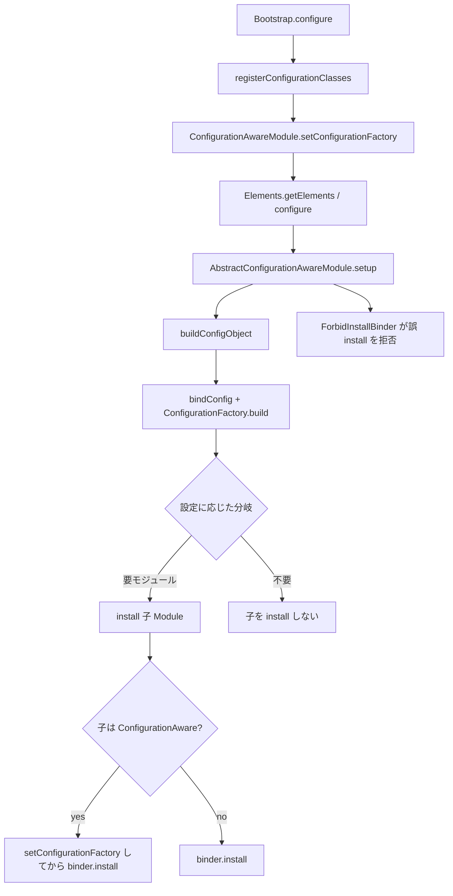

# 第6章 ConfigurationAwareModule

> **本章で読むソース**
>
> - [configuration/src/main/java/io/airlift/configuration/ConfigurationAwareModule.java](https://github.com/airlift/airlift/blob/439/configuration/src/main/java/io/airlift/configuration/ConfigurationAwareModule.java)
> - [configuration/src/main/java/io/airlift/configuration/AbstractConfigurationAwareModule.java](https://github.com/airlift/airlift/blob/439/configuration/src/main/java/io/airlift/configuration/AbstractConfigurationAwareModule.java)
> - [configuration/src/main/java/io/airlift/configuration/ConditionalModule.java](https://github.com/airlift/airlift/blob/439/configuration/src/main/java/io/airlift/configuration/ConditionalModule.java)
> - [configuration/src/main/java/io/airlift/configuration/ConfigurationFactory.java](https://github.com/airlift/airlift/blob/439/configuration/src/main/java/io/airlift/configuration/ConfigurationFactory.java)

## この章の狙い

第4章と第5章は、設定クラスを Guice に登録し、文字列プロパティから実体を作る経路を追った。
しかし Injector を組む途中で「いまの設定値を見て、入れる Module を変えたい」ことがある。
その要求を満たす入口が `ConfigurationAwareModule` と `AbstractConfigurationAwareModule.buildConfigObject` である。
本章では Factory 注入、`buildConfigObject` の二重の副作用、`install` の約束、そして `ConditionalModule` の構成時分岐を追う。

## 前提

第2章の `Bootstrap.configure` が `configurationFactory.registerConfigurationClasses(modules)` を呼ぶこと、第4章の `ConfigBinder` / `ConfigurationFactory.build` を知っているものとする。
Guice の `Module.configure` と `binder.install` の違いを理解しているとよい。

## ConfigurationAwareModule：設定を読める Module

通常の Guice `Module` は `configure(Binder)` しか持たない。
設定値を見て分岐する Module は、バインド走査の前に同じ `ConfigurationFactory` を受け取る必要がある。
その契約が `ConfigurationAwareModule` である。

[configuration/src/main/java/io/airlift/configuration/ConfigurationAwareModule.java L26-L53](https://github.com/airlift/airlift/blob/439/configuration/src/main/java/io/airlift/configuration/ConfigurationAwareModule.java#L26-L53)

```java
public interface ConfigurationAwareModule
        extends Module
{
    void setConfigurationFactory(ConfigurationFactory configurationFactory);

    static Module combine(Module... modules)
    {
        return combine(ImmutableList.copyOf(modules));
    }

    static Module combine(Iterable<Module> modulesIterable)
    {
        List<Module> modules = ImmutableList.copyOf(modulesIterable);
        checkArgument(!modules.isEmpty(), "no modules provided");
        if (modules.size() == 1) {
            return modules.getFirst();
        }
        return new AbstractConfigurationAwareModule()
        {
            @Override
            protected void setup(Binder binder)
            {
                for (Module module : modules) {
                    install(module);
                }
            }
        };
    }
```

`combine` は複数 Module を一つの `AbstractConfigurationAwareModule` にまとめる。
子はすべて `install` 経由で入り、Factory が連鎖して渡る。

## Factory の注入と configure の順序

`Bootstrap.configure` から呼ばれる `registerConfigurationClasses` は、要素走査の前に Factory を配る。

[configuration/src/main/java/io/airlift/configuration/ConfigurationFactory.java L178-L185](https://github.com/airlift/airlift/blob/439/configuration/src/main/java/io/airlift/configuration/ConfigurationFactory.java#L178-L185)

```java
    public Collection<Message> registerConfigurationClasses(Collection<? extends Module> modules)
    {
        // some modules need access to configuration factory so they can lazy register additional config classes
        // initialize configuration factory
        modules.stream()
                .filter(ConfigurationAwareModule.class::isInstance)
                .map(ConfigurationAwareModule.class::cast)
                .forEach(module -> module.setConfigurationFactory(this));
```

コメントが示すとおり、目的は「遅延して追加の設定クラスを登録できる」ことである。
このあと `Elements.getElements(modules)` が各 Module の `configure` を走らせ、`ConfigurationProvider` が集まる（第2章、第4章）。

`AbstractConfigurationAwareModule` は、その `setConfigurationFactory` と `configure` を同期メソッドとして実装する。

[configuration/src/main/java/io/airlift/configuration/AbstractConfigurationAwareModule.java L44-L69](https://github.com/airlift/airlift/blob/439/configuration/src/main/java/io/airlift/configuration/AbstractConfigurationAwareModule.java#L44-L69)

```java
    @Override
    public synchronized void setConfigurationFactory(ConfigurationFactory configurationFactory)
    {
        // Prevent re-setting the configuration factory. The primary goal is to prevent using a single
        // instance from multiple threads. Doing so could easily lead to silent correctness issues.
        checkState(
                LEGACY_LAX_SET_CONFIGURATION_FACTORY || this.configurationFactory == null || this.configurationFactory == configurationFactory,
                "configurationFactory is already set to %s when setting to %s",
                this.configurationFactory,
                configurationFactory);
        this.configurationFactory = requireNonNull(configurationFactory, "configurationFactory is null");
    }

    @Override
    public final synchronized void configure(Binder binder)
    {
        checkState(configurationFactory != null, "configurationFactory was not set");
        checkState(this.binder == null, "re-entry not allowed");
        this.binder = requireNonNull(binder, "binder is null");
        try {
            setup(ForbidInstallBinder.proxy(binder));
        }
        finally {
            this.binder = null;
        }
    }
```

`configure` はテンプレートメソッドである。
利用側は `setup(Binder)` を実装し、そこで `buildConfigObject` や `install` を呼ぶ。
渡される Binder は後述のプロキシであり、素の `binder.install` で `ConfigurationAwareModule` を入れると即座に失敗する。

Factory の再設定は、同じインスタンスへの再設定か、system property `io.airlift.configuration.AbstractConfigurationAwareModule.legacyLaxSetConfigurationFactory` が真のときだけ許される。
既定では「一度渡したら差し替えない」が前提であり、並行利用の silently-wrong を避けるためのガードである。

## buildConfigObject：バインドと即時構築

`setup` 内で設定を読む入口が `buildConfigObject` である。

[configuration/src/main/java/io/airlift/configuration/AbstractConfigurationAwareModule.java L86-L109](https://github.com/airlift/airlift/blob/439/configuration/src/main/java/io/airlift/configuration/AbstractConfigurationAwareModule.java#L86-L109)

```java
    protected synchronized <T> T buildConfigObject(Class<T> configClass)
    {
        return buildConfigObject(configClass, null);
    }

    protected synchronized <T> T buildConfigObject(Class<T> configClass, String prefix)
    {
        configBinder(binder).bindConfig(configClass, prefix);
        return configurationFactory.build(configClass, prefix);
    }

    protected synchronized <T> T buildConfigObject(Key<T> key, Class<T> configClass, String prefix)
    {
        configBinder(binder).bindConfig(key, configClass, prefix);
        return configurationFactory.build(configClass, prefix);
    }

    protected synchronized void install(Module module)
    {
        if (module instanceof ConfigurationAwareModule) {
            ((ConfigurationAwareModule) module).setConfigurationFactory(configurationFactory);
        }
        binder.install(module);
    }
```

ここには二つの仕事がある。

1. `configBinder(...).bindConfig(...)` で、現在の Binder に `ConfigurationProvider` の binding を追加する。
2. 同じ呼び出しで `configurationFactory.build(configClass, prefix)` を即時実行し、分岐用の設定オブジェクトを返す。

一つの API 呼出しで「binding の宣言」と「分岐用の即時 build」をそろえる入口である。
ただし即時の `build(configClass, prefix)` は Provider の `instanceCache` を使わない。

[configuration/src/main/java/io/airlift/configuration/ConfigurationFactory.java L323-L331](https://github.com/airlift/airlift/blob/439/configuration/src/main/java/io/airlift/configuration/ConfigurationFactory.java#L323-L331)

```java
    public <T> T build(Class<T> configClass)
    {
        return build(configClass, null);
    }

    public <T> T build(Class<T> configClass, @Nullable String prefix)
    {
        return build(configClass, Optional.ofNullable(prefix), ConfigDefaults.noDefaults()).instance();
    }
```

一方、標準の Bootstrap 経路では、Elements 走査で `ConfigurationProvider` が Factory に登録されたあと、`validateRegisteredConfigurationProvider` が各 Provider の `get` を呼ぶ。

[configuration/src/main/java/io/airlift/configuration/ConfigurationFactory.java L255-L272](https://github.com/airlift/airlift/blob/439/configuration/src/main/java/io/airlift/configuration/ConfigurationFactory.java#L255-L272)

```java
    public List<Message> validateRegisteredConfigurationProvider()
    {
        List<Message> messages = new ArrayList<>();
        for (ConfigurationProvider<?> configurationProvider : ImmutableList.copyOf(registeredProviders)) {
            try {
                // call the getter which will cause object creation
                configurationProvider.get();
            }
            catch (ConfigurationException e) {
                // if we got errors, add them to the errors list
                ImmutableList<Object> sources = configurationProvider.getBindingSource().map(ImmutableList::of).orElse(ImmutableList.of());
                for (Message message : e.getErrorMessages()) {
                    messages.add(new Message(sources, message.getMessage(), message.getCause()));
                }
            }
        }
        return messages;
    }
```

Provider 経由の `build` は `instanceCache` と `getConfigDefaults(key)` を使う。

[configuration/src/main/java/io/airlift/configuration/ConfigurationFactory.java L336-L366](https://github.com/airlift/airlift/blob/439/configuration/src/main/java/io/airlift/configuration/ConfigurationFactory.java#L336-L366)

```java
    <T> T build(ConfigurationProvider<T> configurationProvider)
    {
        requireNonNull(configurationProvider, "configurationProvider");
        registerConfigurationProvider(configurationProvider, Optional.empty());

        // check for a prebuilt instance
        T instance = getCachedInstance(configurationProvider);
        if (instance != null) {
            return instance;
        }

        ConfigurationBinding<T> configurationBinding = configurationProvider.getConfigurationBinding();
        ConfigurationHolder<T> holder = build(configurationBinding.configClass(), configurationBinding.prefix(), getConfigDefaults(configurationBinding.key()));
        instance = holder.instance();

        // inform caller about warnings
        if (warningsMonitor != null) {
            for (Message message : holder.problems().getWarnings()) {
                warningsMonitor.onWarning(message.toString());
            }
        }

        // add to instance cache
        T existingValue = putCachedInstance(configurationProvider, instance);
        // if key was already associated with a value, there was a
        // creation race and we lost. Just use the winners' instance;
        if (existingValue != null) {
            return existingValue;
        }
        return instance;
    }
```

したがって標準経路では、分岐用の即時インスタンスと、Provider の検証とキャッシュ用インスタンスは別々に構築され得る。
defaults、setter、Bean Validation も後段で再実行され得る。
`buildConfigObject` は構築回数を減らす API ではない。

Key 付きオーバーロードでは、責務境界がさらに鋭い。
`Key` は `bindConfig(key, configClass, prefix)` にだけ渡る。
即時構築は常に `configurationFactory.build(configClass, prefix)` であり、`getConfigDefaults(key)` も Provider の cache も見ない。
条件述語が見るオブジェクトと、あとで Key 付き Provider が返す ConfigDefaults 適用済みオブジェクトは、同一とは限らない。

`HttpServerModule` や `TracingModule` が `setup` 冒頭でこれを呼ぶのは、条件分岐用の値を得ると同時に、使う設定クラスを Guice へ正式登録するためでもある。

`install` は子が `ConfigurationAwareModule` なら Factory を渡してから `binder.install` する。
この経路だけが、設定を読める子 Module を正しく起動する。

## ForbidInstallBinder：誤った install の早期失敗

`setup` に渡る Binder は、`ConfigurationAwareModule` 向けの `install` を禁止するプロキシである。

[configuration/src/main/java/io/airlift/configuration/AbstractConfigurationAwareModule.java L113-L151](https://github.com/airlift/airlift/blob/439/configuration/src/main/java/io/airlift/configuration/AbstractConfigurationAwareModule.java#L113-L151)

```java
    private static class ForbidInstallBinder
            extends AbstractInvocationHandler
    {
        private static final Method INSTALL_METHOD;

        static {
            try {
                INSTALL_METHOD = Binder.class.getMethod("install", Module.class);
            }
            catch (NoSuchMethodException e) {
                throw new RuntimeException(e);
            }
        }

        static Binder proxy(Binder binder)
        {
            return (Binder) Proxy.newProxyInstance(
                    ForbidInstallBinder.class.getClassLoader(),
                    new Class<?>[] {Binder.class},
                    new ForbidInstallBinder(binder));
        }

        private final Binder delegate;

        public ForbidInstallBinder(Binder delegate)
        {
            this.delegate = requireNonNull(delegate, "delegate is null");
        }

        @Override
        protected Object handleInvocation(Object proxy, Method method, Object[] args)
                throws Throwable
        {
            if (INSTALL_METHOD.equals(method) && (args[0] instanceof ConfigurationAwareModule)) {
                throw new IllegalStateException("Use super.install() for ConfigurationAwareModule, not binder.install()");
            }

            return method.invoke(delegate, args);
        }
```

素の `binder.install(configurationAwareChild)` では `setConfigurationFactory` が走らない。
子の `configure` は `configurationFactory was not set` で落ちるか、もっと悪い場合は Factory なしのまま進む。
プロキシは「Factory を渡す `super.install`（実際は `install` メソッド）」以外の経路を構成時に塞ぐ。

通常の Module（設定非依存）は `binder.install` で入れてよい。
禁止されるのは引数が `ConfigurationAwareModule` のときだけである。

## ConditionalModule：構成時分岐と推奨経路

`ConditionalModule` は、設定オブジェクトに対する述語が真のときだけ子 Module を `install` する薄い実装である。

[configuration/src/main/java/io/airlift/configuration/ConditionalModule.java L81-L102](https://github.com/airlift/airlift/blob/439/configuration/src/main/java/io/airlift/configuration/ConditionalModule.java#L81-L102)

```java
    private final Key<T> key;
    private final Class<T> config;
    private final @Nullable String prefix;
    private final Predicate<T> predicate;
    private final Module module;

    private ConditionalModule(Key<T> key, Class<T> config, String prefix, Predicate<T> predicate, Module module)
    {
        this.key = requireNonNull(key, "key is null");
        this.config = requireNonNull(config, "config is null");
        this.prefix = prefix;
        this.predicate = requireNonNull(predicate, "predicate is null");
        this.module = requireNonNull(module, "module is null");
    }

    @Override
    protected void setup(Binder binder)
    {
        if (predicate.test(buildConfigObject(key, config, prefix))) {
            install(module);
        }
    }
```

処理は一行に近い。
`buildConfigObject(key, config, prefix)` で binding を宣言し、即時オブジェクトを述語に渡し、通れば `install(module)` する。
ここでも Key は登録側だけで、述語が見る値は `build(configClass, prefix)`（ConfigDefaults なし）の結果である。
静的ファクトリ群は `@Deprecated` である。

クラス先頭の Javadoc は、このラッパー自体を推奨していない。

[configuration/src/main/java/io/airlift/configuration/ConditionalModule.java L26-L43](https://github.com/airlift/airlift/blob/439/configuration/src/main/java/io/airlift/configuration/ConditionalModule.java#L26-L43)

```java
/**
 * ConditionalModule is not preferable to using buildConfigObject directly.
 * For example,
 * <pre>
 * install(conditionalModule(
 *         SomeConfig.class,
 *         config -> config.getSomeOption().equals("x"),
 *         binder -> binder.bind(String.class).toInstance("X")));
 * </pre>
 *
 * can be replaced with:
 * <pre>
 * SomeConfig testConfig = buildConfigObject(SomeConfig.class);
 * if (testConfig.getSomeOption().equals("x")) {
 *         binder.bind(String.class).toInstance("X");
 * }
 * </pre>
 */
```

要点は次の二つである。

1. **優先すべきは `buildConfigObject` を `setup` で直接呼ぶこと**である。
2. `ConditionalModule` は、その直接呼び出しを Module オブジェクトに包んだ同等物であり、新規コードでは薄い糖衣として扱う。

otherwise 付きのファクトリは、肯定側と否定側を `ConfigurationAwareModule.combine` で並べただけである。
`SwitchModule` も同様に「`buildConfigObject` 直接利用のほうが好ましい」と Javadoc に書いて `@Deprecated` になっている。
分岐の表現力が欲しいときは、専用クラスより `setup` 内の分岐を読むほうが、バインド地点が追いやすい。

## 処理の流れ



構成時に設定を読む経路と、Injector 生成後に `ConfigurationProvider.get` で読む経路は別である。
前者は Module グラフそのものを変え、後者は既に決まったバインディングから実体を返す。

## 高速化と最適化の工夫

条件に合わない Module を `install` しないことで、その子が展開する binding、Provider 登録、検証のコストを起動経路から外せる。
これはランタイムのマイクロ最適化というより、Injector 構築の幅を構成の段階で狭める機構である。
未使用プロパティ検査まで必ず静かになるわけではない。
条件不成立で子を `install` しなければ、その子だけが消費する required / config-file のプロパティが入力に残っている場合、むしろ未使用キーとしてエラーになりうる。
未使用キーの結果は入力次第であり、確実に減るのは子の展開コストのほうである。

## まとめ

- `ConfigurationAwareModule` は、Module 構成前に `ConfigurationFactory` を受け取る契約である。
- `buildConfigObject` は一つの API で binding 宣言と分岐用の即時 build をそろえるが、即時オブジェクトと Provider 経由のキャッシュ対象は別構築になり得る。
- Key 付き呼び出しでも即時 build は `build(configClass, prefix)` であり、ConfigDefaults 適用済みの Provider 結果と同一とは限らない。
- 子の `ConfigurationAwareModule` は `install` 経由でのみ入れ、`ForbidInstallBinder` が素の `binder.install` を拒否する。
- `ConditionalModule` は構成時分岐の薄い実装だが、Javadoc は **`buildConfigObject` の直接利用を優先**すると明記している。

## 関連する章

- [第4章 設定の入力とバインド](04-config-binding.md)
- [第5章 設定メタデータと検証](05-config-metadata.md)
- [第2章 Bootstrap と Injector 構築](../part01-di-lifecycle/02-bootstrap.md)
- [第8章 HttpServerModule と Provider](../part04-http-server/08-http-server-module.md)
