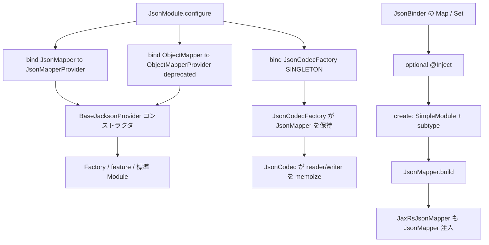

# 第7章 JsonCodec と JsonMapper

> **本章で読むソース**
>
> - [json/src/main/java/io/airlift/json/JsonModule.java](https://github.com/airlift/airlift/blob/439/json/src/main/java/io/airlift/json/JsonModule.java)
> - [json/src/main/java/io/airlift/json/JsonMapperProvider.java](https://github.com/airlift/airlift/blob/439/json/src/main/java/io/airlift/json/JsonMapperProvider.java)
> - [json/src/main/java/io/airlift/json/ObjectMapperProvider.java](https://github.com/airlift/airlift/blob/439/json/src/main/java/io/airlift/json/ObjectMapperProvider.java)
> - [json/src/main/java/io/airlift/json/BaseJacksonProvider.java](https://github.com/airlift/airlift/blob/439/json/src/main/java/io/airlift/json/BaseJacksonProvider.java)
> - [json/src/main/java/io/airlift/json/RecordAutoDetectModule.java](https://github.com/airlift/airlift/blob/439/json/src/main/java/io/airlift/json/RecordAutoDetectModule.java)
> - [json/src/main/java/io/airlift/json/JsonCodec.java](https://github.com/airlift/airlift/blob/439/json/src/main/java/io/airlift/json/JsonCodec.java)
> - [json/src/main/java/io/airlift/json/JsonCodecFactory.java](https://github.com/airlift/airlift/blob/439/json/src/main/java/io/airlift/json/JsonCodecFactory.java)
> - [json/src/main/java/io/airlift/json/JsonBinder.java](https://github.com/airlift/airlift/blob/439/json/src/main/java/io/airlift/json/JsonBinder.java)
> - [jaxrs/src/main/java/io/airlift/jaxrs/JaxRsJsonMapper.java](https://github.com/airlift/airlift/blob/439/jaxrs/src/main/java/io/airlift/jaxrs/JaxRsJsonMapper.java)

## この章の狙い

Airlift の JSON 経路は、Jackson の mapper 構築と、型付き変換ファサード `JsonCodec` に分かれる。
`JsonModule` が主にバインドするのは Jackson の `JsonMapper`（`JsonMapperProvider` 経由）であり、`ObjectMapper` は後方互換用の deprecated バインディングである。
本章では、拡張点の集約（`BaseJacksonProvider`）、`JsonCodec` / `JsonCodecFactory`、そして主経路と互換分岐の関係を追う。

## 前提

Guice の `Module` / `Provider`、および型パラメータ付き `Key`（例: `JsonCodec<Foo>`）の注入を知っているものとする。
Jackson の `ObjectMapper` と、Jackson 2.10 以降の `JsonMapper`（`ObjectMapper` の JSON 特化サブクラス）の関係をざっくり理解しているとよい。

## JsonModule：主経路 JsonMapper と互換 ObjectMapper

`JsonModule` の `configure` は短い。

[json/src/main/java/io/airlift/json/JsonModule.java L24-L50](https://github.com/airlift/airlift/blob/439/json/src/main/java/io/airlift/json/JsonModule.java#L24-L50)

```java
public class JsonModule
        implements Module
{
    @Override
    public void configure(Binder binder)
    {
        // NOTE: this MUST NOT be a singleton because ObjectMappers are mutable. This means
        // one component could reconfigure the mapper and break all other components.
        // When updated to Jackson 3.x this is no longer a case since the JsonMapper instances
        // are immutable.
        binder.bind(JsonMapper.class).toProvider(JsonMapperProvider.class);
        bindDeprecatedProvider(binder);

        binder.bind(JsonCodecFactory.class).in(Scopes.SINGLETON);
    }

    @SuppressWarnings("deprecation")
    private static void bindDeprecatedProvider(Binder binder)
    {
        // NOTE: this MUST NOT be a singleton because ObjectMappers are mutable. This means
        // one component could reconfigure the mapper and break all other components.
        // When updated to Jackson 3.x this is no longer a case since the JsonMapper instances
        // are immutable.

        // For backward compatibility with the usage sites that depends on ObjectMapper
        binder.bind(ObjectMapper.class).toProvider(ObjectMapperProvider.class);
    }
```

読み取るべき分岐は次のとおりである。

- **主経路**：`JsonMapper` → `JsonMapperProvider`（スコープは未指定、すなわち毎回 Provider が新規 mapper を組み立て得る）
- **互換分岐**：`ObjectMapper` → `ObjectMapperProvider`（コメントどおり backward compatibility、クラス自体も `@Deprecated`）
- **共通ファサード**：`JsonCodecFactory` は SINGLETON

`ObjectMapper` / `JsonMapper` を SINGLETON にしない理由は、Jackson 2.x の mapper が mutable だからである。
あるコンポーネントが設定をいじると、共有インスタンス経由で他コンポーネントが壊れる。
コメントは Jackson 3.x で `JsonMapper` が immutable になる変化も先取りして書いている。

## JsonMapperProvider と ObjectMapperProvider

両者とも `BaseJacksonProvider` を継承し、`get()` で `create()` の結果を返すだけである。

[json/src/main/java/io/airlift/json/JsonMapperProvider.java L24-L46](https://github.com/airlift/airlift/blob/439/json/src/main/java/io/airlift/json/JsonMapperProvider.java#L24-L46)

```java
public class JsonMapperProvider
        extends BaseJacksonProvider<JsonMapper, JsonMapperProvider>
{
    public JsonMapperProvider()
    {
        this(new JsonFactoryBuilder());
    }

    public JsonMapperProvider(JsonFactory jsonFactory)
    {
        this(new JsonFactoryBuilder(requireNonNull(jsonFactory, "jsonFactory is null")));
    }

    private JsonMapperProvider(JsonFactoryBuilder jsonFactoryBuilder)
    {
        super(jsonFactoryBuilder);
    }

    @Override
    public JsonMapper get()
    {
        return create();
    }
```

[json/src/main/java/io/airlift/json/ObjectMapperProvider.java L9-L35](https://github.com/airlift/airlift/blob/439/json/src/main/java/io/airlift/json/ObjectMapperProvider.java#L9-L35)

```java
/**
 * Use {@link JsonMapperProvider} instead.
 */
@Deprecated
public class ObjectMapperProvider
        extends BaseJacksonProvider<ObjectMapper, ObjectMapperProvider>
{
    public ObjectMapperProvider()
    {
        this(new JsonFactoryBuilder());
    }

    public ObjectMapperProvider(JsonFactory jsonFactory)
    {
        this(new JsonFactoryBuilder(requireNonNull(jsonFactory, "jsonFactory is null")));
    }

    private ObjectMapperProvider(JsonFactoryBuilder jsonFactoryBuilder)
    {
        super(jsonFactoryBuilder);
    }

    @Override
    public ObjectMapper get()
    {
        return create();
    }
```

互換側も内部では同じ `create()` を呼び、戻り値の静的型だけが `ObjectMapper` である。
`JsonMapper` は `ObjectMapper` のサブクラスなので、構築ロジックは一本化されている。

## BaseJacksonProvider：拡張の集約と mapper 構築

実体の組み立ては `BaseJacksonProvider` にある。
コンストラクタが `JsonFactoryBuilder` と `JsonMapper.Builder` に、Airlift 既定の制約と feature を載せる。

[json/src/main/java/io/airlift/json/BaseJacksonProvider.java L48-L83](https://github.com/airlift/airlift/blob/439/json/src/main/java/io/airlift/json/BaseJacksonProvider.java#L48-L83)

```java
    protected BaseJacksonProvider(JsonFactoryBuilder jsonFactoryBuilder)
    {
        // Disable the length limit, caller will be responsible for validating the input length
        jsonFactoryBuilder.streamReadConstraints(StreamReadConstraints
                .builder()
                .maxStringLength(Integer.MAX_VALUE)
                .maxNestingDepth(Integer.MAX_VALUE)
                .maxNameLength(Integer.MAX_VALUE)
                .maxDocumentLength(Long.MAX_VALUE)
                .build());

        jsonFactoryBuilder.streamWriteConstraints(StreamWriteConstraints
                .builder()
                .maxNestingDepth(Integer.MAX_VALUE)
                .build());

        jsonFactoryBuilder.enable(StreamWriteFeature.USE_FAST_DOUBLE_WRITER);
        jsonFactoryBuilder.enable(StreamReadFeature.USE_FAST_BIG_NUMBER_PARSER);
        jsonFactoryBuilder.enable(StreamReadFeature.USE_FAST_DOUBLE_PARSER);

        /*
         * When multiple threads deserialize JSON responses concurrently,
         * Jackson's default behavior of interning field names causes severe lock contention
         * on the JVM's global String pool. This manifests as threads blocked waiting at
         * InternCache.intern.
         *
         * Disabling INTERN_FIELD_NAMES eliminates this contention with minimal performance
         * impact - field name deduplication becomes slightly less memory-efficient, but the
         * elimination of lock contention far outweighs this cost in high-concurrency scenarios.
         *
         * See: https://github.com/FasterXML/jackson-core/issues/332.
         */
        jsonFactoryBuilder.disable(JsonFactory.Feature.INTERN_FIELD_NAMES);
        jsonFactoryBuilder.recyclerPool(JsonRecyclerPools.threadLocalPool());

        jsonMapper = JsonMapper.builder(jsonFactoryBuilder.build());
```

ストリーム長の上限は緩くし、呼び出し側（HTTP 層など）に長さ検証を委ねる。
高速パーサとライターの feature を有効にし、フィールド名 intern は無効化する。
バッファ再利用は thread-local の recycler pool にする。

続けて、デシリアライズ／シリアライズの feature と、標準 Module 群を載せる。

[json/src/main/java/io/airlift/json/BaseJacksonProvider.java L85-L125](https://github.com/airlift/airlift/blob/439/json/src/main/java/io/airlift/json/BaseJacksonProvider.java#L85-L125)

```java
        // ignore unknown fields (for backwards compatibility)
        jsonMapper.disable(DeserializationFeature.FAIL_ON_UNKNOWN_PROPERTIES);

        // do not allow converting a float to an integer
        jsonMapper.disable(DeserializationFeature.ACCEPT_FLOAT_AS_INT);

        // use ISO dates
        jsonMapper.disable(SerializationFeature.WRITE_DATES_AS_TIMESTAMPS);

        // Fail if there are trailing tokens after entity was read and mapped
        jsonMapper.enable(DeserializationFeature.FAIL_ON_TRAILING_TOKENS);

        // When serialization fails in the middle, it's better to return a truncated (invalid) JSON
        // than something that could be interpreted as a valid (but incorrect) result.
        // This is especially applicable to server endpoints that return JSON responses.
        jsonMapper.disable(JsonGenerator.Feature.AUTO_CLOSE_JSON_CONTENT);

        // Skip fields that are null or absent (Optional) when serializing objects.
        // This only applies to mapped object fields, not containers like Map or List.
        jsonMapper.defaultPropertyInclusion(JsonInclude.Value.construct(JsonInclude.Include.NON_ABSENT, JsonInclude.Include.ALWAYS));

        // disable auto detection of json properties... all properties must be explicit
        jsonMapper.disable(MapperFeature.AUTO_DETECT_CREATORS);
        jsonMapper.disable(MapperFeature.AUTO_DETECT_FIELDS);
        jsonMapper.disable(MapperFeature.AUTO_DETECT_SETTERS);
        jsonMapper.disable(MapperFeature.AUTO_DETECT_GETTERS);
        jsonMapper.disable(MapperFeature.AUTO_DETECT_IS_GETTERS);
        jsonMapper.disable(MapperFeature.USE_GETTERS_AS_SETTERS);
        jsonMapper.disable(MapperFeature.CAN_OVERRIDE_ACCESS_MODIFIERS);
        jsonMapper.disable(MapperFeature.INFER_PROPERTY_MUTATORS);
        jsonMapper.disable(MapperFeature.ALLOW_FINAL_FIELDS_AS_MUTATORS);

        jsonMapper.addModule(new Jdk8Module());
        jsonMapper.addModule(new JavaTimeModule());
        jsonMapper.addModule(new GuavaModule());
        jsonMapper.addModule(new ParameterNamesModule());
        jsonMapper.addModule(new RecordAutoDetectModule());
        // Replace reflection-based bean access with runtime-generated accessors (LambdaMetafactory).
        // Property detection is unchanged (still driven by explicit annotations above); only the
        // get/set mechanism is faster, reducing CPU and allocation on serialization/deserialization.
        jsonMapper.addModule(new BlackbirdModule());
```

未知フィールドは無視し、末尾トークンは拒否する。
通常の bean 向けには `AUTO_DETECT_*` をすべて切り、プロパティをアノテーション明示へ寄せる。
その直後に `RecordAutoDetectModule` を足す点が例外である。

[json/src/main/java/io/airlift/json/RecordAutoDetectModule.java L43-L66](https://github.com/airlift/airlift/blob/439/json/src/main/java/io/airlift/json/RecordAutoDetectModule.java#L43-L66)

```java
    private static class Introspector
            extends AnnotationIntrospector
    {
        private static final VisibilityChecker.Std RECORD_VISIBILITY_CHECKER = VisibilityChecker.Std.defaultInstance()
                .withGetterVisibility(JsonAutoDetect.Visibility.PUBLIC_ONLY)
                .withCreatorVisibility(JsonAutoDetect.Visibility.DEFAULT)
                .withFieldVisibility(JsonAutoDetect.Visibility.DEFAULT)
                .withIsGetterVisibility(JsonAutoDetect.Visibility.DEFAULT);

        @Override
        public VisibilityChecker<?> findAutoDetectVisibility(AnnotatedClass ac, VisibilityChecker<?> checker)
        {
            if (ac.getRawType().isRecord()) {
                JsonAutoDetect overrideAnnotation = ac.getRawType().getAnnotation(JsonAutoDetect.class);
                if (overrideAnnotation != null) {
                    return VisibilityChecker.Std.construct(JsonAutoDetect.Value.from(overrideAnnotation));
                }
                if (ac.getRawType().isAnnotationPresent(LegacyRecordIntrospection.class)) {
                    return RECORD_VISIBILITY_CHECKER;
                }
                return new RecordVisibilityChecker(ac.getRawType().asSubclass(Record.class));
            }
            return checker;
        }
```

record に限り、この Introspector が可視性を差し替える。
既定の `RecordVisibilityChecker` は public な record component accessor と canonical creator を可視とし、`@JsonAutoDetect` があればその override を使う。
通常 bean は明示注釈、record は `RecordAutoDetectModule` の限定的自動検出、と書き分ける必要がある。
`BlackbirdModule` はプロパティ発見の方針を変えず、アクセス機構だけを生成アクセサへ置き換える。

Guice からの拡張点は、optional な `@Inject` setter で地図と集合を受け取る。

| 注入 | 役割 |
|---|---|
| `Map<Class<?>, JsonSerializer<?>>` など | 型ごとの serializer / deserializer / key serde |
| `Set<Module>`（Jackson） | 追加 Jackson Module |
| `Set<JsonSubType>` | ポリモーフィック subtype 用 Module 群 |

`create()` がこれらを `SimpleModule` と subtype Module にまとめ、最後に `jsonMapper.build()` する。

[json/src/main/java/io/airlift/json/BaseJacksonProvider.java L207-L239](https://github.com/airlift/airlift/blob/439/json/src/main/java/io/airlift/json/BaseJacksonProvider.java#L207-L239)

```java
    protected JsonMapper create()
    {
        if (jsonSerializers != null || jsonDeserializers != null || keySerializers != null || keyDeserializers != null) {
            SimpleModule module = new SimpleModule(getClass().getName(), new Version(1, 0, 0, null, null, null));
            if (jsonSerializers != null) {
                for (Map.Entry<Class<?>, JsonSerializer<?>> entry : jsonSerializers.entrySet()) {
                    addSerializer(module, entry.getKey(), entry.getValue());
                }
            }
            if (jsonDeserializers != null) {
                for (Map.Entry<Class<?>, JsonDeserializer<?>> entry : jsonDeserializers.entrySet()) {
                    addDeserializer(module, entry.getKey(), entry.getValue());
                }
            }
            if (keySerializers != null) {
                for (Map.Entry<Class<?>, JsonSerializer<?>> entry : keySerializers.entrySet()) {
                    addKeySerializer(module, entry.getKey(), entry.getValue());
                }
            }
            if (keyDeserializers != null) {
                for (Map.Entry<Class<?>, KeyDeserializer> entry : keyDeserializers.entrySet()) {
                    module.addKeyDeserializer(entry.getKey(), entry.getValue());
                }
            }
            jsonMapper.addModule(module);
        }

        for (JsonSubType jsonSubType : jsonSubTypes) {
            jsonSubType.modules()
                    .forEach(jsonMapper::addModule);
        }

        return jsonMapper.build();
```

アプリケーション側がこれらの Map / Set を埋める API が `JsonBinder` である。

[json/src/main/java/io/airlift/json/JsonBinder.java L40-L52](https://github.com/airlift/airlift/blob/439/json/src/main/java/io/airlift/json/JsonBinder.java#L40-L52)

```java
    public static JsonBinder jsonBinder(Binder binder)
    {
        return new JsonBinder(binder);
    }

    private JsonBinder(Binder binder)
    {
        binder = requireNonNull(binder, "binder is null").skipSources(getClass());
        keySerializerMapBinder = MapBinder.newMapBinder(binder, new TypeLiteral<>() {}, new TypeLiteral<>() {}, JsonKeySerde.class);
        keyDeserializerMapBinder = MapBinder.newMapBinder(binder, new TypeLiteral<>() {}, new TypeLiteral<>() {}, JsonKeySerde.class);
        serializerMapBinder = MapBinder.newMapBinder(binder, new TypeLiteral<>() {}, new TypeLiteral<>() {});
        deserializerMapBinder = MapBinder.newMapBinder(binder, new TypeLiteral<>() {}, new TypeLiteral<>() {});
        moduleBinder = newSetBinder(binder, Module.class);
```

MapBinder / Multibinder に載せたものが、Provider 生成時の optional 注入へ合流する。

## JsonCodec：型付き変換ファサード

`JsonCodec<T>` は、特定の Java 型に対する `fromJson` / `toJson` を提供する。
静的ファクトリは、クラス内の共有 `JSON_MAPPER`（pretty print 有効）を使う。

[json/src/main/java/io/airlift/json/JsonCodec.java L42-L55](https://github.com/airlift/airlift/blob/439/json/src/main/java/io/airlift/json/JsonCodec.java#L42-L55)

```java
@ThreadSafe
public class JsonCodec<T>
{
    private static final JsonMapper JSON_MAPPER = new JsonMapperProvider().get()
            .rebuild()
            .enable(INDENT_OUTPUT)
            .build();

    public static <T> JsonCodec<T> jsonCodec(Class<T> type)
    {
        requireNonNull(type, "type is null");

        return new JsonCodec<>(JSON_MAPPER, type);
    }
```

Guice 経由では、注入された `JsonMapper` をコンストラクタが受け取り、型ごとに `ObjectWriter` / `ObjectReader` をメモ化する。

[json/src/main/java/io/airlift/json/JsonCodec.java L117-L124](https://github.com/airlift/airlift/blob/439/json/src/main/java/io/airlift/json/JsonCodec.java#L117-L124)

```java
    JsonCodec(JsonMapper mapper, Type type)
    {
        JavaType javaType = mapper.constructType(type);
        this.typeToken = (TypeToken<T>) TypeToken.of(type);
        this.type = javaType;
        this.writer = Suppliers.memoize(() -> mapper.writerFor(javaType));
        this.reader = Suppliers.memoize(() -> mapper.readerFor(javaType));
    }
```

変換本体は reader / writer に委譲し、失敗を `IllegalArgumentException` に畳む。

[json/src/main/java/io/airlift/json/JsonCodec.java L141-L168](https://github.com/airlift/airlift/blob/439/json/src/main/java/io/airlift/json/JsonCodec.java#L141-L168)

```java
    public T fromJson(String json)
            throws IllegalArgumentException
    {
        try {
            return reader.get().readValue(json);
        }
        catch (Exception e) {
            throw mapException(e, "string", type);
        }
    }

    /**
     * Converts the specified instance to json.
     *
     * @param instance the instance to convert to json
     * @return json string
     * @throws IllegalArgumentException if the specified instance can not be converted to json
     */
    public String toJson(T instance)
            throws IllegalArgumentException
    {
        try {
            return writer.get().writeValueAsString(instance);
        }
        catch (IOException e) {
            throw new IllegalArgumentException("%s could not be converted to JSON".formatted(instance.getClass().getName()), e);
        }
    }
```

入力は String 以外にもある。
`byte[]`、`InputStream`、`Reader` も同じ reader と `mapException` 経路で処理する。

[json/src/main/java/io/airlift/json/JsonCodec.java L200-L263](https://github.com/airlift/airlift/blob/439/json/src/main/java/io/airlift/json/JsonCodec.java#L200-L263)

```java
    public T fromJson(byte[] json)
            throws IllegalArgumentException
    {
        try {
            return reader.get().readValue(json);
        }
        catch (Exception e) {
            throw mapException(e, "bytes", type);
        }
    }

    // ... (中略) ...

    public T fromJson(InputStream json)
            throws IllegalArgumentException
    {
        try {
            return reader.get().readValue(json);
        }
        catch (Exception e) {
            throw mapException(e, "stream", type);
        }
    }

    /**
     * Coverts the specified {@link Reader} into an instance of type T.
     *
     * @param json the json character stream to parse
     * @return parsed response; never null
     * @throws IllegalArgumentException if the json characters can not be converted to the type T
     */
    public T fromJson(Reader json)
            throws IllegalArgumentException
    {
        try {
            return reader.get().readValue(json);
        }
        catch (Exception e) {
            throw mapException(e, "characters", type);
        }
    }
```

`mapException` は、`FAIL_ON_TRAILING_TOKENS` 由来の `MismatchedInputException` を「末尾に文字あり」専用メッセージへ変換する。

[json/src/main/java/io/airlift/json/JsonCodec.java L265-L272](https://github.com/airlift/airlift/blob/439/json/src/main/java/io/airlift/json/JsonCodec.java#L265-L272)

```java
    private static IllegalArgumentException mapException(Exception e, String source, Type type)
    {
        return switch (e) {
            case MismatchedInputException mismatchedInputException when mismatchedInputException.getMessage().contains("not allowed as per `DeserializationFeature.FAIL_ON_TRAILING_TOKENS`") -> new IllegalArgumentException("Found characters after the expected end of input", e);
            case IllegalArgumentException iae -> iae;
            default -> new IllegalArgumentException("Invalid JSON %s for %s".formatted(source, type), e);
        };
    }
```

出力側の明示的な長さ制限は `toJsonWithLengthLimit` だけである。
`LengthLimitedWriter` で文字数上限を超えれば `Optional.empty()` を返し、それ以外の `IOException` は `IllegalArgumentException` にする。

[json/src/main/java/io/airlift/json/JsonCodec.java L178-L191](https://github.com/airlift/airlift/blob/439/json/src/main/java/io/airlift/json/JsonCodec.java#L178-L191)

```java
    public Optional<String> toJsonWithLengthLimit(T instance, int lengthLimit)
    {
        try (StringWriter stringWriter = new StringWriter();
                LengthLimitedWriter lengthLimitedWriter = new LengthLimitedWriter(stringWriter, lengthLimit)) {
            writer.get().writeValue(lengthLimitedWriter, instance);
            return Optional.of(stringWriter.getBuffer().toString());
        }
        catch (LengthLimitExceededException e) {
            return Optional.empty();
        }
        catch (IOException e) {
            throw new IllegalArgumentException("%s could not be converted to JSON".formatted(instance.getClass().getName()), e);
        }
    }
```

`BaseJacksonProvider` が stream read/write の制約を実質無制限にし、呼び出し側の検証へ委ねている。
Codec 側でこの出力長制限を見落とすと、安全境界の説明が mapper の緩和だけに偏る。

静的入口と Factory 入口の違いは、使う `JsonMapper` の出自である。
静的入口はプロセス内の既定 mapper（pretty）を共有し、Factory 入口は Injector が組んだ（拡張済みの）`JsonMapper` を使う。

## JsonCodecFactory：Injector 上の Codec 工場

[json/src/main/java/io/airlift/json/JsonCodecFactory.java L31-L68](https://github.com/airlift/airlift/blob/439/json/src/main/java/io/airlift/json/JsonCodecFactory.java#L31-L68)

```java
public class JsonCodecFactory
{
    private final JsonMapper jsonMapper;

    public JsonCodecFactory()
    {
        this(new JsonMapperProvider().get());
    }

    @Inject
    public JsonCodecFactory(JsonMapper jsonMapper)
    {
        this.jsonMapper = requireNonNull(jsonMapper, "jsonMapper is null");
    }

    @Deprecated
    public JsonCodecFactory(Provider<JsonMapper> jsonMapperProvider)
    {
        this(jsonMapperProvider.get());
    }

    @Deprecated
    public JsonCodecFactory(Provider<JsonMapper> jsonMapperProvider, boolean prettyPrint)
    {
        this(withPrettyPrint(jsonMapperProvider.get(), prettyPrint));
    }

    public JsonCodecFactory prettyPrint()
    {
        return new JsonCodecFactory(withPrettyPrint(jsonMapper, true));
    }

    public <T> JsonCodec<T> jsonCodec(Class<T> type)
    {
        requireNonNull(type, "type is null");

        return new JsonCodec<>(jsonMapper, type);
    }
```

`@Inject` コンストラクタが `JsonMapper` を取る点が、主経路の証跡である。
`Provider<JsonMapper>` を取るコンストラクタは deprecated である。
`JsonCodecBinder` は `JsonCodecProvider` 経由で `JsonCodecFactory.jsonCodec(type)` を SINGLETON の `JsonCodec<?>` へバインドする補助である。

## JaxRsJsonMapper も JsonMapper を注入される

HTTP リソース層の JSON Provider も、互換の `ObjectMapper` ではなく `JsonMapper` を受け取る。

[jaxrs/src/main/java/io/airlift/jaxrs/JaxRsJsonMapper.java L26-L35](https://github.com/airlift/airlift/blob/439/jaxrs/src/main/java/io/airlift/jaxrs/JaxRsJsonMapper.java#L26-L35)

```java
public class JaxRsJsonMapper
        extends JacksonJsonProvider
{
    @Inject
    public JaxRsJsonMapper(JsonMapper jsonMapper)
    {
        super(jsonMapper);
        enable(ADD_NO_SNIFF_HEADER);
        enable(INCLUDE_SOURCE_IN_LOCATION);
    }
```

Codec も JAX-RS も、同じ主経路の `JsonMapper` バインディングに乗る。
ただし `JsonMapper` は unscoped なので、`JsonCodecFactory`（SINGLETON）が保持するインスタンスと、`JaxRsJsonMapper` が受け取るインスタンスは、同一バインディング経路でも同一オブジェクトとは限らない。
「同じ主経路を共有する」は構築方針と Provider が同じことを指し、インスタンス共有を意味しない。
`ObjectMapper` バインディングは、古い注入サイトを生かすための傍流である。
JAX-RS 統合の詳細は第11章で扱う。

## 処理の流れ



主経路は常に `JsonMapper` である。
`ObjectMapper` は同じ Provider 系譜の戻り値を広い型で晒す互換面に過ぎない。

## 高速化と最適化の工夫

`INTERN_FIELD_NAMES` の無効化は、並行デシリアライズ時に JVM の String intern ロックへ集中する争奪を避けるための機構である。
コメントが示すとおり、フィールド名の重複排除は少し弱まるが、高並行ではロック待ち削減のほうが勝つ、というトレードオフである。
あわせて `BlackbirdModule` が Bean アクセスを生成アクセサへ置き換え、`JsonCodec` が `ObjectReader` / `ObjectWriter` を `Suppliers.memoize` で型ごとに再利用する。
mapper 自体を SINGLETON にしない判断は、mutable 共有による正しさの破壊を優先して、構築コストを許容する側にある。

## まとめ

- `JsonModule` の主バインドは `JsonMapper` → `JsonMapperProvider` であり、`ObjectMapper` → `ObjectMapperProvider` は後方互換の deprecated 分岐である。
- `BaseJacksonProvider` が通常 bean の AUTO_DETECT を切ったうえで `RecordAutoDetectModule` を足し、record だけ限定的自動検出を許す。
- `JsonCodec` は String に加え byte[] / InputStream / Reader を同じ `mapException` 経路で読み、`toJsonWithLengthLimit` が唯一の明示的出力長制限である。
- `JsonCodecFactory` と `JaxRsJsonMapper` は同じ `JsonMapper` 主経路に乗るが、unscoped のため同一インスタンス共有は保証されない。

## 関連する章

- [第1章 アーキテクチャ全体像とサーバ起動](../part00-overview/01-architecture.md)
- [第11章 JAX-RS 統合](../part05-jaxrs/11-jaxrs.md)
- [第13章 ResponseHandler](../part06-http-client/13-response-handler.md)
