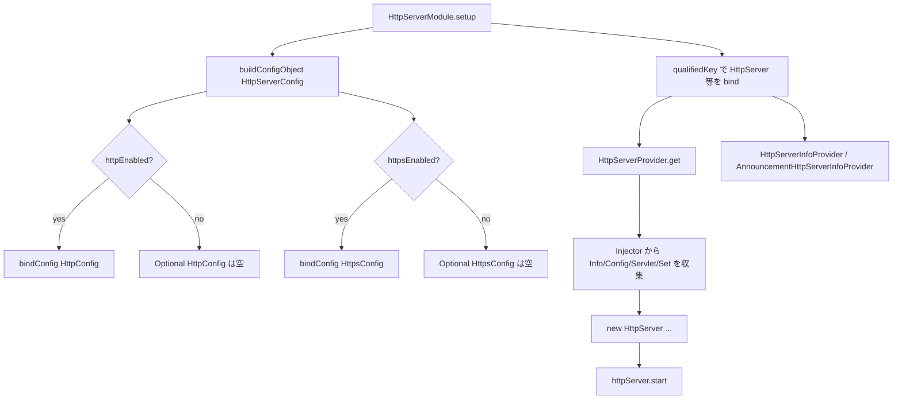

# 第8章 HttpServerModule と Provider

> **本章で読むソース**
>
> - [http-server/src/main/java/io/airlift/http/server/HttpServerModule.java](https://github.com/airlift/airlift/blob/439/http-server/src/main/java/io/airlift/http/server/HttpServerModule.java)
> - [http-server/src/main/java/io/airlift/http/server/HttpServerProvider.java](https://github.com/airlift/airlift/blob/439/http-server/src/main/java/io/airlift/http/server/HttpServerProvider.java)
> - [http-server/src/main/java/io/airlift/http/server/BinderUtils.java](https://github.com/airlift/airlift/blob/439/http-server/src/main/java/io/airlift/http/server/BinderUtils.java)
> - [bootstrap/src/main/java/io/airlift/bootstrap/LifeCycleModule.java](https://github.com/airlift/airlift/blob/439/bootstrap/src/main/java/io/airlift/bootstrap/LifeCycleModule.java)
> - [http-server/src/main/java/io/airlift/http/server/HttpServerInfoProvider.java](https://github.com/airlift/airlift/blob/439/http-server/src/main/java/io/airlift/http/server/HttpServerInfoProvider.java)
> - [http-server/src/main/java/io/airlift/http/server/AnnouncementHttpServerInfoProvider.java](https://github.com/airlift/airlift/blob/439/http-server/src/main/java/io/airlift/http/server/AnnouncementHttpServerInfoProvider.java)
> - [http-server/src/main/java/io/airlift/http/server/HttpServerBinder.java](https://github.com/airlift/airlift/blob/439/http-server/src/main/java/io/airlift/http/server/HttpServerBinder.java)

## この章の狙い

HTTP サーバの Guice 組み立て入口は `HttpServerModule` である。
本章では、qualifier 付きバインディング、HTTP / HTTPS の条件付き設定バインド、そして `HttpServerProvider` が Injector から servlet / filter / resource / feature を集めて `HttpServer` を構築し `start` する経路を追う。

## 前提

第2章の Bootstrap / Injector、第3章のライフサイクル、第6章の `AbstractConfigurationAwareModule`（`buildConfigObject`）を読んだものとする。
Guice の `OptionalBinder`、`Multibinder`、アノテーションによる qualified `Key` の違いを知っているとよい。

## HttpServerModule：名前と qualifier

`HttpServerModule` は `AbstractConfigurationAwareModule` を継承する。
無引数コンストラクタは既定の `"http-server"` と qualifier なしを使う。
名前、qualifier、設定プレフィックスを渡すオーバーロードもあり、1 プロセス内に複数サーバを同居させられる。

[http-server/src/main/java/io/airlift/http/server/HttpServerModule.java L61-L87](https://github.com/airlift/airlift/blob/439/http-server/src/main/java/io/airlift/http/server/HttpServerModule.java#L61-L87)

```java
public class HttpServerModule
        extends AbstractConfigurationAwareModule
{
    private final String name;
    private final Optional<Class<? extends Annotation>> qualifier;
    private final @Nullable String configPrefix;

    public HttpServerModule(String name, Optional<Class<? extends Annotation>> qualifier, @Nullable String configPrefix)
    {
        this.name = requireNonNull(name, "name is null");
        this.qualifier = requireNonNull(qualifier, "qualifier is null");
        this.configPrefix = configPrefix;

        if (this.qualifier.isPresent()) {
            checkArgument(this.configPrefix != null, "qualifier is present but configPrefix is null");
        }
    }

    public HttpServerModule(String name, Class<? extends Annotation> qualifier, @Nullable String configPrefix)
    {
        this(name, Optional.of(requireNonNull(qualifier, "qualifier is null")), configPrefix);
    }

    public HttpServerModule()
    {
        this("http-server", Optional.empty(), null);
    }
```

qualifier があるときは `configPrefix` も必須である。
同一型の設定クラスをプレフィックスで分けないと、複数サーバのプロパティが衝突する。

## setup：qualified binding と拡張点

`setup` は、サーバ本体と周辺型を同じ qualifier で揃えてバインドする。

[http-server/src/main/java/io/airlift/http/server/HttpServerModule.java L89-L113](https://github.com/airlift/airlift/blob/439/http-server/src/main/java/io/airlift/http/server/HttpServerModule.java#L89-L113)

```java
    @Override
    protected void setup(Binder binder)
    {
        binder.bind(qualifiedKey(qualifier, HttpServer.class))
                .toProvider(new HttpServerProvider(name, qualifier))
                .in(SINGLETON);
        newOptionalBinder(binder, qualifiedKey(qualifier, ClientCertificate.class)).setDefault().toInstance(ClientCertificate.NONE);
        newExporter(binder).export(qualifiedKey(qualifier, HttpServer.class)).withGeneratedName();
        newSetBinder(binder, qualifiedKey(qualifier, ServerFeature.class));
        newSetBinder(binder, qualifiedKey(qualifier, Filter.class)).addBinding()
                .to(TracingServletFilter.class)
                .in(SINGLETON);
        newSetBinder(binder, qualifiedKey(qualifier, HttpResourceBinding.class));
        newOptionalBinder(binder, qualifiedKey(qualifier, SslContextFactory.Server.class));
        configBinder(binder).bindConfig(qualifiedKey(qualifier, HttpServerConfig.class), HttpServerConfig.class, configPrefix);
        newOptionalBinder(binder, qualifiedKey(qualifier, HttpConfig.class));
        newOptionalBinder(binder, qualifiedKey(qualifier, HttpsConfig.class));

        binder.bind(qualifiedKey(qualifier, AnnouncementHttpServerInfo.class))
                .toProvider(new AnnouncementHttpServerInfoProvider(qualifier))
                .in(SINGLETON);

        binder.bind(qualifiedKey(qualifier, HttpServerInfo.class))
                .toProvider(new HttpServerInfoProvider(qualifier))
                .in(SINGLETON);
```

ここでの役割分担は次のとおりである。

- **HttpServer**：`HttpServerProvider` 経由の SINGLETON。JMX にも export する
- **ClientCertificate**：既定は `NONE`。HTTPS クライアント証明書の要求度を差し替えられる
- **ServerFeature / Filter / HttpResourceBinding**：Set の multibinder。アプリ側が追加する拡張点である
- **TracingServletFilter**：Filter の Set に既定で 1 件入る
- **SslContextFactory.Server**：Optional。外部から SSL ファクトリを注入できる穴である
- **HttpServerConfig**：常に configBinder する
- **HttpConfig / HttpsConfig**：まず OptionalBinder だけ用意し、実体の config バインドは後段の条件付きで足す
- **HttpServerInfo / AnnouncementHttpServerInfo**：いずれも Provider 経由の SINGLETON

`qualifiedKey` は qualifier の有無を `Key` に畳むヘルパである。

[http-server/src/main/java/io/airlift/http/server/BinderUtils.java L9-L26](https://github.com/airlift/airlift/blob/439/http-server/src/main/java/io/airlift/http/server/BinderUtils.java#L9-L26)

```java
class BinderUtils
{
    private BinderUtils() {}

    static <T> Key<T> qualifiedKey(Optional<Class<? extends Annotation>> qualifier, Class<T> type)
    {
        return qualifier
                .map(annotation -> Key.get(type, annotation))
                .orElseGet(() -> Key.get(type));
    }

    static <T> Key<T> qualifiedKey(Optional<Class<? extends Annotation>> qualifier, TypeLiteral<T> type)
    {
        return qualifier
                .map(annotation -> Key.get(type, annotation))
                .orElseGet(() -> Key.get(type));
    }
}
```

qualifier が空なら素の `Key.get(type)`、あれば `Key.get(type, annotation)` になる。
Module、Provider、Binder の三者がこのヘルパを共有するため、資格子の付け忘れで別インスタンスに分岐しにくい。

アプリ側が静的リソースを足す入口は `HttpServerBinder.bindResource` である。

[http-server/src/main/java/io/airlift/http/server/HttpServerBinder.java L76-L81](https://github.com/airlift/airlift/blob/439/http-server/src/main/java/io/airlift/http/server/HttpServerBinder.java#L76-L81)

```java
    public HttpResourceBinding bindResource(String baseUri, String classPathResourceBase)
    {
        HttpResourceBinding httpResourceBinding = new HttpResourceBinding(baseUri, classPathResourceBase);
        newSetBinder(binder, qualifiedKey(qualifier, HttpResourceBinding.class)).addBinding().toInstance(httpResourceBinding);
        return httpResourceBinding;
    }
```

同じ qualifier の `HttpResourceBinding` Set へ実体を足す。
第10章の `ClassPathResourceFilter` がその Set を消費する。

## 条件付き HttpConfig / HttpsConfig

`HttpServerConfig` を一度 `buildConfigObject` で実体化し、有効なプロトコル分だけ詳細設定をバインドする。

[http-server/src/main/java/io/airlift/http/server/HttpServerModule.java L115-L122](https://github.com/airlift/airlift/blob/439/http-server/src/main/java/io/airlift/http/server/HttpServerModule.java#L115-L122)

```java
        HttpServerConfig config = buildConfigObject(qualifiedKey(qualifier, HttpServerConfig.class), HttpServerConfig.class, configPrefix);
        if (config.isHttpEnabled()) {
            configBinder(binder).bindConfig(qualifiedKey(qualifier, HttpConfig.class), HttpConfig.class, configPrefix);
        }
        if (config.isHttpsEnabled()) {
            configBinder(binder).bindConfig(qualifiedKey(qualifier, HttpsConfig.class), HttpsConfig.class, configPrefix);
        }
    }
```

前段で `newOptionalBinder` しているため、無効側の `Optional<HttpConfig>` / `Optional<HttpsConfig>` は空のまま注入できる。
有効側だけ `bindConfig` が走り、キーストアパスなど HTTPS 固有の検証も、HTTPS を立てたときだけ要求される。
第6章の `ConditionalModule` と同じく、構成時に設定を読んで分岐する `ConfigurationAwareModule` の使い方である。

## HttpServerProvider：集約と start

`HttpServerProvider` は Injector を setter 注入で受け取り、`get()` で依存をまとめて `HttpServer` を構築する。

[http-server/src/main/java/io/airlift/http/server/HttpServerProvider.java L54-L95](https://github.com/airlift/airlift/blob/439/http-server/src/main/java/io/airlift/http/server/HttpServerProvider.java#L54-L95)

```java
    @Inject(optional = true)
    public void setMBeanServer(MBeanServer mBeanServer)
    {
        this.mBeanServer = Optional.of(requireNonNull(mBeanServer, "mBeanServer is null"));
    }

    @Inject
    public void setInjector(Injector injector)
    {
        this.injector = requireNonNull(injector, "injector is null");
    }

    @Override
    public HttpServer get()
    {
        try {
            HttpServer httpServer = new HttpServer(
                    name,
                    injector.getInstance(qualifiedKey(qualifier, HttpServerInfo.class)),
                    injector.getInstance(NodeInfo.class),
                    injector.getInstance(qualifiedKey(qualifier, HttpServerConfig.class)),
                    injector.getInstance(qualifiedKey(qualifier, new TypeLiteral<>() {})),
                    injector.getInstance(qualifiedKey(qualifier, new TypeLiteral<>() {})),
                    injector.getInstance(qualifiedKey(qualifier, Servlet.class)),
                    injector.getInstance(qualifiedKey(qualifier, new TypeLiteral<>() {})),
                    injector.getInstance(qualifiedKey(qualifier, new TypeLiteral<>() {})),
                    injector.getInstance(qualifiedKey(qualifier, new TypeLiteral<>() {})),
                    injector.getInstance(qualifiedKey(qualifier, ClientCertificate.class)),
                    mBeanServer,
                    injector.getInstance(qualifiedKey(qualifier, new TypeLiteral<>() {})));
            httpServer.start();
            return httpServer;
        }
        catch (InterruptedException e) {
            Thread.currentThread().interrupt();
            throw new RuntimeException(e);
        }
        catch (Exception e) {
            throwIfUnchecked(e);
            throw new RuntimeException(e);
        }
    }
```

コンストラクタ引数の並びに対応する取得は次である。

- `HttpServerInfo`、`HttpServerConfig`、`Servlet`、`ClientCertificate`：qualified の具象型
- `Optional<HttpConfig>`、`Optional<HttpsConfig>`、`Set<Filter>`、`Set<HttpResourceBinding>`、`Set<ServerFeature>`、`Optional<SslContextFactory.Server>`：匿名 `TypeLiteral<>` でジェネリクスを保った Key
- `NodeInfo`：qualifier なし（ノード全体で共有）
- `MBeanServer`：任意注入。無ければ空の `Optional`

構築直後に `httpServer.start()` を呼ぶ。
標準経路では、このあと Guice の `ProvisionListener` が同じインスタンスを `LifeCycleManager` へ渡す。

[bootstrap/src/main/java/io/airlift/bootstrap/LifeCycleModule.java L66-L86](https://github.com/airlift/airlift/blob/439/bootstrap/src/main/java/io/airlift/bootstrap/LifeCycleModule.java#L66-L86)

```java
    private <T> void provision(ProvisionInvocation<T> provision)
    {
        Object obj = provision.provision();
        if ((obj == null) || !isLifeCycleClass(obj.getClass())) {
            return;
        }

        LifeCycleManager manager = lifeCycleManager.get();
        if (manager != null) {
            try {
                manager.addInstance(obj);
            }
            catch (Exception e) {
                throwIfUnchecked(e);
                throw new RuntimeException(e);
            }
        }
        else {
            injectedInstances.add(obj);
        }
    }
```

`addInstance` → `startInstance` が `@PostConstruct` の `HttpServer.start` を再度呼ぶ。

[http-server/src/main/java/io/airlift/http/server/HttpServer.java L538-L544](https://github.com/airlift/airlift/blob/439/http-server/src/main/java/io/airlift/http/server/HttpServer.java#L538-L544)

```java
    @PostConstruct
    public void start()
            throws Exception
    {
        server.start();
        checkState(server.isStarted(), "server is not started");
    }
```

順序は次のとおりである。

1. `HttpServerProvider.get` がコンストラクタのあとで `start()` を先に呼ぶ（Jetty `Server` が STARTED になる）
2. provision が完了し、`LifeCycleModule` が同一インスタンスを Manager へ登録する
3. Manager が `@PostConstruct` 経由でもう一度 `start()` を呼ぶ

二度目が再初期化にならないのは、Airlift 側のガードではなく Jetty `LifeCycle` の契約による。
既に STARTED のコンポーネントへ `start()` しても `doStart` は再実行されず、すぐに戻る。
`checkState(server.isStarted())` も二度目でそのまま通る。
Provider 側の先行 start は、「Injector から取り出した直後に accept 可能にする」ためのものであり、lifecycle 経路の代わりではない。

`Servlet` 自体のバインドは本章の Module には無い。
第11章の JAX-RS 経路（またはアプリの独自 Servlet）が、同じ qualifier の `Servlet` を供給する前提である。

## HttpServerInfo と Announcement の Provider

ポート URI の実体化は `HttpServerInfoProvider` が担う。

[http-server/src/main/java/io/airlift/http/server/HttpServerInfoProvider.java L32-L40](https://github.com/airlift/airlift/blob/439/http-server/src/main/java/io/airlift/http/server/HttpServerInfoProvider.java#L32-L40)

```java
    @Override
    public HttpServerInfo get()
    {
        HttpServerConfig serverConfig = injector.getInstance(qualifiedKey(qualifier, HttpServerConfig.class));
        Optional<HttpConfig> httpConfig = injector.getInstance(qualifiedKey(qualifier, new TypeLiteral<>() {}));
        Optional<HttpsConfig> httpsConfig = injector.getInstance(qualifiedKey(qualifier, new TypeLiteral<>() {}));
        NodeInfo nodeInfo = injector.getInstance(NodeInfo.class);
        return new HttpServerInfo(serverConfig, httpConfig, httpsConfig, nodeInfo);
    }
```

discovery 向けの見た目は `AnnouncementHttpServerInfoProvider` が `HttpServerInfo` を包む。

[http-server/src/main/java/io/airlift/http/server/AnnouncementHttpServerInfoProvider.java L31-L35](https://github.com/airlift/airlift/blob/439/http-server/src/main/java/io/airlift/http/server/AnnouncementHttpServerInfoProvider.java#L31-L35)

```java
    @Override
    public AnnouncementHttpServerInfo get()
    {
        return new LocalAnnouncementHttpServerInfo(injector.getInstance(qualifiedKey(qualifier, HttpServerInfo.class)));
    }
```

`HttpServerInfo` のチャネル bind と URI 計算の中身は第9章で追う。
ここでは、Module が「情報」と「サーバ本体」を別 Provider に分け、どちらも同じ qualifier で揃えていることだけ押さえる。

## 処理の流れ



構成時にプロトコル分岐を固め、実行時の Provider は Injector 上の成果物を集めて起動する、という二段構えである。

## 高速化と最適化の工夫

条件付き `bindConfig` により、無効なプロトコルの設定クラスをわざわざ構築も検証もしない。
HTTPS を落としているプロセスではキーストア関連のプロパティ欠如で起動失敗せず、Bean Validation の対象も狭まる。
また `HttpServer` を SINGLETON にし Provider 内で `start` まで進めるため、初回解決でスレッドプールとコネクタが立ち上がり、以降の注入サイトは同じ稼働中インスタンスを共有する。
毎回の構築コストを払わず、アナウンスやクライアントが参照する URI（`HttpServerInfo`）ともライフタイムを揃えやすい。

## まとめ

- `HttpServerModule` は qualifier と `configPrefix` で複数サーバを分け、`qualifiedKey` で型を揃えてバインドする。
- `HttpServerConfig` を `buildConfigObject` したうえで、有効なプロトコルだけ `HttpConfig` / `HttpsConfig` をバインドする。
- Filter、静的リソース、`ServerFeature`、SSL ファクトリ、クライアント証明書は Optional / Set の拡張点として空または既定値が用意される。
- `HttpServerProvider` が Injector から依存を集め `HttpServer` を構築し、直後に `start` する。
- 同じ `start` は provision 後の `@PostConstruct` でも呼ばれるが、Jetty `LifeCycle` が STARTED 再入を no-op にするため再初期化は起きない。

## 関連する章

- [第1章 アーキテクチャ全体像とサーバ起動](../part00-overview/01-architecture.md)
- [第6章 ConfigurationAwareModule](../part02-config/06-config-aware-module.md)
- [第9章 HttpServerInfo とコネクタ](09-http-server-info.md)
- [第10章 HttpServer のハンドラ連鎖](10-http-server-handlers.md)
- [第11章 JAX-RS 統合](../part05-jaxrs/11-jaxrs.md)
