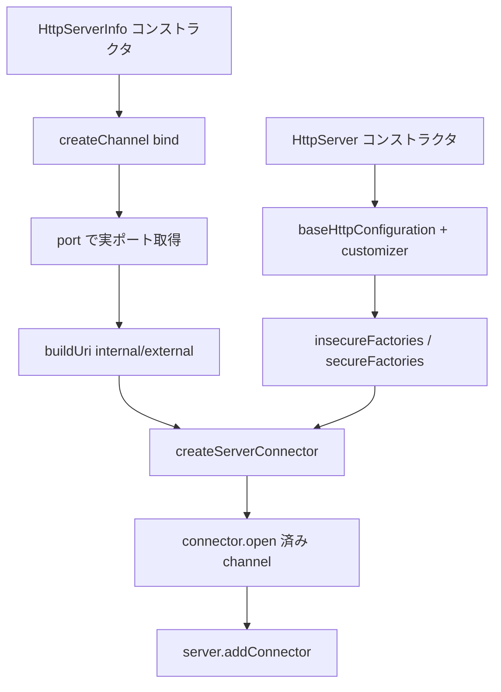

# 第9章 HttpServerInfo とコネクタ

> **本章で読むソース**
>
> - [http-server/src/main/java/io/airlift/http/server/HttpServerInfo.java](https://github.com/airlift/airlift/blob/439/http-server/src/main/java/io/airlift/http/server/HttpServerInfo.java)
> - [http-server/src/main/java/io/airlift/http/server/HttpServer.java](https://github.com/airlift/airlift/blob/439/http-server/src/main/java/io/airlift/http/server/HttpServer.java)
> - [http-server/src/main/java/io/airlift/http/server/HttpServerConfig.java](https://github.com/airlift/airlift/blob/439/http-server/src/main/java/io/airlift/http/server/HttpServerConfig.java)
> - [http-server/src/main/java/io/airlift/http/server/HttpConfig.java](https://github.com/airlift/airlift/blob/439/http-server/src/main/java/io/airlift/http/server/HttpConfig.java)
> - [http-server/src/main/java/io/airlift/http/server/HttpsConfig.java](https://github.com/airlift/airlift/blob/439/http-server/src/main/java/io/airlift/http/server/HttpsConfig.java)

## この章の狙い

`HttpServerInfo` は Jetty の `Server.start` より先に `ServerSocketChannel` を bind し、実ポートを URI に焼き込む。
コネクタ本体（`ServerConnector`、`ConnectionFactory`、request customizer）の組み立てと、その事前 bind 済み channel の受け渡しは `HttpServer` 側である。
本章では設定クラスとあわせて、ポート決定からコネクタ登録までの経路を追う。

## 前提

第8章の `HttpServerModule` / Provider を読んだものとする。
`NodeInfo` の internal / external / bind IP、および Jetty の connector / connection factory の役割をざっくり知っているとよい。
ハンドラ連鎖（servlet、compression、request log）は第10章で扱う。

## HttpServerInfo：先に channel を bind する

コンストラクタは、有効なプロトコルごとにチャネルを開き、local port から URI を作る。

[http-server/src/main/java/io/airlift/http/server/HttpServerInfo.java L41-L67](https://github.com/airlift/airlift/blob/439/http-server/src/main/java/io/airlift/http/server/HttpServerInfo.java#L41-L67)

```java
    @Inject
    public HttpServerInfo(HttpServerConfig config, Optional<HttpConfig> httpConfig, Optional<HttpsConfig> httpsConfig, NodeInfo nodeInfo)
    {
        if (config.isHttpEnabled()) {
            HttpConfig http = httpConfig.orElseThrow(() -> new IllegalArgumentException("httpConfig must be present when HTTP is enabled"));
            httpChannel = createChannel(nodeInfo.getBindIp(), http.getHttpPort(), http.getAcceptQueueSize());
            httpUri = buildUri("http", nodeInfo.getInternalAddress(), port(httpChannel));
            httpExternalUri = buildUri("http", nodeInfo.getExternalAddress(), httpUri.getPort());
        }
        else {
            httpChannel = null;
            httpUri = null;
            httpExternalUri = null;
        }

        if (config.isHttpsEnabled()) {
            HttpsConfig https = httpsConfig.orElseThrow(() -> new IllegalArgumentException("httpsConfig must be present when HTTPS is enabled"));
            httpsChannel = createChannel(nodeInfo.getBindIp(), https.getHttpsPort(), https.getAcceptQueueSize());
            httpsUri = buildUri("https", nodeInfo.getInternalAddress(), port(httpsChannel));
            httpsExternalUri = buildUri("https", nodeInfo.getExternalAddress(), httpsUri.getPort());
        }
        else {
            httpsChannel = null;
            httpsUri = null;
            httpsExternalUri = null;
        }
    }
```

設定上のポートが `0`（エフェメラル）でも、`port(httpChannel)` は OS が割り当てた実ポートを返す。
内部 URI は `NodeInfo` の internal address、外部 URI は external address をホストにし、ポートは同じ実ポートを共有する。
無効なプロトコル側は channel / URI とも null で、呼び出し側は `getHttpUri()` などの null 可否を設定と合わせて見る。

チャネル生成は `SO_REUSEADDR` を立ててから `bind` する。

[http-server/src/main/java/io/airlift/http/server/HttpServerInfo.java L109-L131](https://github.com/airlift/airlift/blob/439/http-server/src/main/java/io/airlift/http/server/HttpServerInfo.java#L109-L131)

```java
    @VisibleForTesting
    static int port(ServerSocketChannel channel)
    {
        try {
            return ((InetSocketAddress) channel.getLocalAddress()).getPort();
        }
        catch (IOException e) {
            throw new UncheckedIOException(e);
        }
    }

    private static ServerSocketChannel createChannel(InetAddress address, int port, int acceptQueueSize)
    {
        try {
            ServerSocketChannel channel = ServerSocketChannel.open();
            channel.socket().setReuseAddress(true);
            channel.socket().bind(new InetSocketAddress(address, port), acceptQueueSize);
            return channel;
        }
        catch (IOException e) {
            throw new UncheckedIOException("Failed to bind to %s:%s".formatted(address, port), e);
        }
    }
```

URI 組み立ては scheme / host / port だけを持つ階層なし URI である。

[http-server/src/main/java/io/airlift/http/server/HttpServerInfo.java L99-L107](https://github.com/airlift/airlift/blob/439/http-server/src/main/java/io/airlift/http/server/HttpServerInfo.java#L99-L107)

```java
    private static URI buildUri(String scheme, String host, int port)
    {
        try {
            return new URI(scheme, null, host, port, null, null, null);
        }
        catch (URISyntaxException e) {
            throw new IllegalArgumentException(e);
        }
    }
```

重要な分岐は「Jetty が listen を始める前に、すでに OS 上でポートが確定している」ことである。
discovery のアナウンスや他コンポーネントは、`server.start()` を待たずに `HttpServerInfo` の URI を読んでよい。

## HttpServerConfig / HttpConfig / HttpsConfig

サーバ全体のオンオフと共通チューニングは `HttpServerConfig` が持つ。

[http-server/src/main/java/io/airlift/http/server/HttpServerConfig.java L101-L129](https://github.com/airlift/airlift/blob/439/http-server/src/main/java/io/airlift/http/server/HttpServerConfig.java#L101-L129)

```java
    public boolean isHttpEnabled()
    {
        return httpEnabled;
    }

    @Config("http-server.http.enabled")
    public HttpServerConfig setHttpEnabled(boolean httpEnabled)
    {
        this.httpEnabled = httpEnabled;
        return this;
    }

    public boolean isHttpsEnabled()
    {
        return httpsEnabled;
    }

    @Config("http-server.https.enabled")
    public HttpServerConfig setHttpsEnabled(boolean httpsEnabled)
    {
        this.httpsEnabled = httpsEnabled;
        return this;
    }

    @AssertTrue(message = "either HTTP or HTTPS must be enabled")
    public boolean isProtocolEnabled()
    {
        return httpEnabled || httpsEnabled;
    }
```

HTTP 側の listen ポートと accept キューは `HttpConfig` である。

[http-server/src/main/java/io/airlift/http/server/HttpConfig.java L22-L53](https://github.com/airlift/airlift/blob/439/http-server/src/main/java/io/airlift/http/server/HttpConfig.java#L22-L53)

```java
public class HttpConfig
{
    private int httpPort = 8080;
    private int acceptQueueSize = 8000;
    private Integer httpAcceptorThreads;
    private Integer httpSelectorThreads;

    public int getHttpPort()
    {
        return httpPort;
    }

    @Config("http-server.http.port")
    public HttpConfig setHttpPort(int httpPort)
    {
        this.httpPort = httpPort;
        return this;
    }

    @Min(1)
    public int getAcceptQueueSize()
    {
        return acceptQueueSize;
    }

    @Config("http-server.http.accept-queue-size")
    @LegacyConfig("http-server.accept-queue-size")
    public HttpConfig setAcceptQueueSize(int acceptQueueSize)
    {
        this.acceptQueueSize = acceptQueueSize;
        return this;
    }
```

HTTPS はポートに加え、キーストア（または automatic shared secret）が必須になる。

[http-server/src/main/java/io/airlift/http/server/HttpsConfig.java L44-L54](https://github.com/airlift/airlift/blob/439/http-server/src/main/java/io/airlift/http/server/HttpsConfig.java#L44-L54)

```java
    public int getHttpsPort()
    {
        return httpsPort;
    }

    @Config("http-server.https.port")
    public HttpsConfig setHttpsPort(int httpsPort)
    {
        this.httpsPort = httpsPort;
        return this;
    }
```

[http-server/src/main/java/io/airlift/http/server/HttpsConfig.java L122-L151](https://github.com/airlift/airlift/blob/439/http-server/src/main/java/io/airlift/http/server/HttpsConfig.java#L122-L151)

```java
    public String getKeystorePath()
    {
        return keystorePath;
    }

    @Config("http-server.https.keystore.path")
    public HttpsConfig setKeystorePath(String keystorePath)
    {
        this.keystorePath = keystorePath;
        return this;
    }

    public String getKeystorePassword()
    {
        return keystorePassword;
    }

    @Config("http-server.https.keystore.key")
    @ConfigSecuritySensitive
    public HttpsConfig setKeystorePassword(String keystorePassword)
    {
        this.keystorePassword = keystorePassword;
        return this;
    }

    @AssertTrue(message = "Keystore path or automatic HTTPS shared secret must be provided when HTTPS is enabled")
    public boolean isHttpsConfigurationValid()
    {
        return getKeystorePath() != null || getAutomaticHttpsSharedSecret() != null;
    }
```

第8章の条件付きバインドのおかげで、この検証は HTTPS を有効にしたときだけ走る。

## HttpServer：HttpConfiguration と customizer

`HttpServer` コンストラクタは、まず共通の `HttpConfiguration` にカスタマイザとサイズ上限を載せる。

[http-server/src/main/java/io/airlift/http/server/HttpServer.java L197-L231](https://github.com/airlift/airlift/blob/439/http-server/src/main/java/io/airlift/http/server/HttpServer.java#L197-L231)

```java
        HttpConfiguration baseHttpConfiguration = new HttpConfiguration();
        baseHttpConfiguration.setSendServerVersion(false);
        baseHttpConfiguration.setSendXPoweredBy(false);
        baseHttpConfiguration.setNotifyRemoteAsyncErrors(config.isNotifyRemoteAsyncErrors());

        baseHttpConfiguration.addCustomizer(switch (config.getProcessForwarded()) {
            case REJECT -> new RejectForwardedRequestCustomizer();
            case ACCEPT -> new ForwardedRequestCustomizer();
            case IGNORE -> new IgnoreForwardedRequestCustomizer();
        });

        // Adds :authority pseudoheader on HTTP/2
        baseHttpConfiguration.addCustomizer(new AuthorityCustomizer());

        // Adds :host header on HTTP/1.0 and HTTP/2
        baseHttpConfiguration.addCustomizer(new HostHeaderCustomizer());

        if (config.getMaxRequestHeaderSize() != null) {
            baseHttpConfiguration.setRequestHeaderSize(toIntExact(config.getMaxRequestHeaderSize().toBytes()));
        }
        if (config.getMaxResponseHeaderSize() != null) {
            baseHttpConfiguration.setMaxResponseHeaderSize(toIntExact(config.getMaxResponseHeaderSize().toBytes()));
        }
        if (config.getOutputBufferSize() != null) {
            baseHttpConfiguration.setOutputBufferSize(toIntExact(config.getOutputBufferSize().toBytes()));
        }

        // see https://bugs.eclipse.org/bugs/show_bug.cgi?id=414449#c4
        baseHttpConfiguration.setHeaderCacheCaseSensitive(serverFeatures.contains(CASE_SENSITIVE_HEADER_CACHE));

        if (serverFeatures.contains(LEGACY_URI_COMPLIANCE)) {
            // allow encoded slashes to occur in URI paths
            UriCompliance uriCompliance = UriCompliance.from(EnumSet.of(AMBIGUOUS_PATH_SEPARATOR, AMBIGUOUS_PATH_ENCODING, SUSPICIOUS_PATH_CHARACTERS));
            baseHttpConfiguration.setUriCompliance(uriCompliance);
        }
```

`ProcessForwardedMode` はプロキシ配下で `Forwarded` / `X-Forwarded-*` を受け入れるか、拒否するか、無視するかを選ぶ。
既定は REJECT である。
`AuthorityCustomizer` と `HostHeaderCustomizer` は HTTP/2 や HTTP/1.0 でもホスト情報を揃える。

## スレッドプールとコネクタの実行資源

コネクタを触る前に、`HttpServer` は要求処理用のスレッドプールを組む。

[http-server/src/main/java/io/airlift/http/server/HttpServer.java L159-L183](https://github.com/airlift/airlift/blob/439/http-server/src/main/java/io/airlift/http/server/HttpServer.java#L159-L183)

```java
        MonitoredQueuedThreadPool threadPool = new MonitoredQueuedThreadPool(config.getMaxThreads());
        threadPool.setMinThreads(config.getMinThreads());
        threadPool.setIdleTimeout(toIntExact(config.getThreadMaxIdleTime().toMillis()));
        threadPool.setName(name + "-worker");
        threadPool.setDetailedDump(true);
        if (serverFeatures.contains(VIRTUAL_THREADS)) {
            VirtualThreadPool virtualExecutor = new VirtualThreadPool();
            virtualExecutor.setMaxConcurrentTasks(config.getMaxThreads());
            virtualExecutor.setName(name + "-worker#v");
            virtualExecutor.setDetailedDump(true);
            log.info("Virtual threads support is enabled");
            threadPool.setVirtualThreadsExecutor(virtualExecutor);
        }

        int maxBufferSize = toIntExact(max(
                max(toSafeBytes(config.getMaxRequestHeaderSize()).orElse(8192),
                        toSafeBytes(config.getMaxResponseHeaderSize()).orElse(8192)),
                toSafeBytes(config.getOutputBufferSize()).orElse(32768)));

        server = new Server(threadPool, new ScheduledExecutorScheduler(name + "-scheduler", false), createByteBufferPool(maxBufferSize, config));
        server.setName(name);
        // stopAtShutdown registers a shutdown hook that stops the server, when JVM exits. It's not needed
        // as the LifeCycleManager takes care of stopping the server at exit.
        server.setStopAtShutdown(false);
        server.setStopTimeout(config.getStopTimeout().toMillis());
```

`MonitoredQueuedThreadPool` が Worker である。
`VIRTUAL_THREADS` が有効なら、その上に `VirtualThreadPool` を載せる。
このプールが `Server` のデフォルト executor になり、ハンドラ上の要求処理を担当する。

コネクタの acceptor / selector は論理的な役割であり、`createServerConnector` へ渡す executor が `null` のため、実行資源としてはこの Worker プールを共有する。

## HTTP / HTTPS コネクタの組み立て

HTTP コネクタは、`HttpServerInfo` のチャネルと URI ポートをそのまま使う。

[http-server/src/main/java/io/airlift/http/server/HttpServer.java L233-L263](https://github.com/airlift/airlift/blob/439/http-server/src/main/java/io/airlift/http/server/HttpServer.java#L233-L263)

```java
        // set up HTTP connector
        ServerConnector httpConnector;
        if (config.isHttpEnabled()) {
            HttpConfiguration httpConfiguration = new HttpConfiguration(baseHttpConfiguration);
            // if https is enabled, set the CONFIDENTIAL and INTEGRAL redirection information
            if (config.isHttpsEnabled()) {
                httpConfiguration.setSecureScheme("https");
                httpConfiguration.setSecurePort(httpServerInfo.getHttpsUri().getPort());
            }

            Integer acceptors = httpConfig.getHttpAcceptorThreads();
            Integer selectors = httpConfig.getHttpSelectorThreads();
            httpConnector = createServerConnector(
                    httpServerInfo.getHttpChannel(),
                    server,
                    null,
                    requireNonNullElse(acceptors, -1),
                    requireNonNullElse(selectors, -1),
                    insecureFactories(config, httpConfiguration));
            httpConnector.setName("http");
            httpConnector.setPort(httpServerInfo.getHttpUri().getPort());
            httpConnector.setIdleTimeout(config.getNetworkMaxIdleTime().toMillis());
            httpConnector.setHost(nodeInfo.getBindIp().getHostAddress());
            httpConnector.setAcceptQueueSize(httpConfig.getAcceptQueueSize());

            // track connection statistics
            ConnectionStatistics connectionStats = new ConnectionStatistics();
            httpConnector.addBean(connectionStats);
            this.httpConnectionStats = new ConnectionStats(connectionStats);
            server.addConnector(httpConnector);
        }
```

`HttpConfig`（HTTPS なら `HttpsConfig`）の acceptor / selector スレッド数を読み、null なら `-1` にして Jetty の既定選択へ委ねる。
`createServerConnector` へ渡す executor 引数は常に `null` であり、このとき Jetty の `AbstractConnector` は connector executor を `Server.getThreadPool()` に設定する。
したがって acceptor / selector / 要求処理はいずれもコネクタ固有の論理役割ではあるが、専用 executor を持たず、上の Server 側 Worker プールが実行する。
並列実行の分担は役割として次のように限定できる。

- **acceptor**：新しい TCP 接続の受理
- **selector**：確立済み接続の I/O 選択
- **worker（MonitoredQueuedThreadPool / 任意で VirtualThreadPool）**：要求のディスパッチとハンドラ実行

接続統計（`ConnectionStatistics`）は各コネクタに `addBean` され、ハンドラ連鎖の `StatisticsHandler`（第10章）とは別物である。

HTTPS も同様に、事前 bind 済みの `httpsChannel` を渡し、secure 用の factory 列を載せる。

[http-server/src/main/java/io/airlift/http/server/HttpServer.java L265-L292](https://github.com/airlift/airlift/blob/439/http-server/src/main/java/io/airlift/http/server/HttpServer.java#L265-L292)

```java
        // set up NIO-based HTTPS connector
        ServerConnector httpsConnector;
        if (config.isHttpsEnabled()) {
            HttpConfiguration httpsConfiguration = new HttpConfiguration(baseHttpConfiguration);
            setSecureRequestCustomizer(httpsConfiguration);

            this.sslContextFactory = Optional.of(this.sslContextFactory.orElseGet(() -> createReloadingSslContextFactory(name, httpsConfig, clientCertificate, nodeInfo.getEnvironment())));
            Integer acceptors = httpsConfig.getHttpsAcceptorThreads();
            Integer selectors = httpsConfig.getHttpsSelectorThreads();
            httpsConnector = createServerConnector(
                    httpServerInfo.getHttpsChannel(),
                    server,
                    null,
                    requireNonNullElse(acceptors, -1),
                    requireNonNullElse(selectors, -1),
                    secureFactories(config, httpsConfiguration, sslContextFactory.orElseThrow()));
            httpsConnector.setName("https");
            httpsConnector.setPort(httpServerInfo.getHttpsUri().getPort());
            httpsConnector.setIdleTimeout(config.getNetworkMaxIdleTime().toMillis());
            httpsConnector.setHost(nodeInfo.getBindIp().getHostAddress());
            httpsConnector.setAcceptQueueSize(httpsConfig.getAcceptQueueSize());

            // track connection statistics
            ConnectionStatistics connectionStats = new ConnectionStatistics();
            httpsConnector.addBean(connectionStats);
            this.httpsConnectionStats = new ConnectionStats(connectionStats);
            server.addConnector(httpsConnector);
        }
```

`SslContextFactory.Server` が Optional で外から来ていなければ、`ReloadableSslContextFactoryProvider` でキーストアを定期再読込するファクトリを自前構築する。

## ConnectionFactory と事前 bind 済み channel

平文側は HTTP/1.1 と HTTP/2 cleartext（h2c）を並べる。

[http-server/src/main/java/io/airlift/http/server/HttpServer.java L386-L398](https://github.com/airlift/airlift/blob/439/http-server/src/main/java/io/airlift/http/server/HttpServer.java#L386-L398)

```java
    private ConnectionFactory[] insecureFactories(HttpServerConfig config, HttpConfiguration httpConfiguration)
    {
        HttpConnectionFactory http1 = new HttpConnectionFactory(httpConfiguration);
        HTTP2CServerConnectionFactory http2c = new HTTP2CServerConnectionFactory(httpConfiguration);
        http2c.setInitialSessionRecvWindow(toIntExact(config.getHttp2InitialSessionReceiveWindowSize().toBytes()));
        http2c.setInitialStreamRecvWindow(toIntExact(config.getHttp2InitialStreamReceiveWindowSize().toBytes()));
        http2c.setMaxConcurrentStreams(config.getHttp2MaxConcurrentStreams());
        http2c.setInputBufferSize(toIntExact(config.getHttp2InputBufferSize().toBytes()));
        http2c.setStreamIdleTimeout(config.getHttp2StreamIdleTimeout().toMillis());
        http2c.setRateControlFactory(new RateControl.Factory() {}); // disable rate control

        return new ConnectionFactory[] {http1, http2c};
    }
```

TLS 側は `SslConnectionFactory` → ALPN → HTTP/2 / HTTP/1.1 の順である。

[http-server/src/main/java/io/airlift/http/server/HttpServer.java L400-L417](https://github.com/airlift/airlift/blob/439/http-server/src/main/java/io/airlift/http/server/HttpServer.java#L400-L417)

```java
    private ConnectionFactory[] secureFactories(HttpServerConfig config, HttpConfiguration httpsConfiguration, SslContextFactory.Server server)
    {
        ConnectionFactory http1 = new HttpConnectionFactory(httpsConfiguration);
        ALPNServerConnectionFactory alpn = new ALPNServerConnectionFactory();
        alpn.setDefaultProtocol(http1.getProtocol());

        SslConnectionFactory tls = new SslConnectionFactory(server, alpn.getProtocol());

        HTTP2ServerConnectionFactory http2 = new HTTP2ServerConnectionFactory(httpsConfiguration);
        http2.setInitialSessionRecvWindow(toIntExact(config.getHttp2InitialSessionReceiveWindowSize().toBytes()));
        http2.setInitialStreamRecvWindow(toIntExact(config.getHttp2InitialStreamReceiveWindowSize().toBytes()));
        http2.setMaxConcurrentStreams(config.getHttp2MaxConcurrentStreams());
        http2.setInputBufferSize(toIntExact(config.getHttp2InputBufferSize().toBytes()));
        http2.setStreamIdleTimeout(config.getHttp2StreamIdleTimeout().toMillis());
        http2.setRateControlFactory(new RateControl.Factory() {}); // disable rate control

        return new ConnectionFactory[] {tls, alpn, http2, http1};
    }
```

事前 bind 済み channel をコネクタへ渡す部分が `createServerConnector` である。

[http-server/src/main/java/io/airlift/http/server/HttpServer.java L584-L596](https://github.com/airlift/airlift/blob/439/http-server/src/main/java/io/airlift/http/server/HttpServer.java#L584-L596)

```java
    private static ServerConnector createServerConnector(
            ServerSocketChannel channel,
            Server server,
            Executor executor,
            int acceptors,
            int selectors,
            ConnectionFactory... factories)
            throws IOException
    {
        ServerConnector connector = new ServerConnector(server, executor, null, null, acceptors, selectors, factories);
        connector.open(channel);
        return connector;
    }
```

`ServerConnector` を新規オープンして二重に bind するのではなく、`connector.open(channel)` で既存チャネルを引き継ぐ。
`HttpServerInfo` が確保したポート、accept キュー、`SO_REUSEADDR` の決定が、そのまま Jetty の accept に使われる。
`acceptors` / `selectors` はここに渡った値であり、executor の `null` は Server の Worker プール共有を意味する。

HTTPS 用の `SecureRequestCustomizer` は、既存 customizer の先頭に差し込む。

[http-server/src/main/java/io/airlift/http/server/HttpServer.java L419-L425](https://github.com/airlift/airlift/blob/439/http-server/src/main/java/io/airlift/http/server/HttpServer.java#L419-L425)

```java
    private static void setSecureRequestCustomizer(HttpConfiguration configuration)
    {
        configuration.setCustomizers(ImmutableList.<HttpConfiguration.Customizer>builder()
                .add(new SecureRequestCustomizer(false))
                .addAll(configuration.getCustomizers())
                .build());
    }
```

コンストラクタ引数は Jetty の `sniHostCheck` である。
`false` は SNI host check を無効にする。

## 処理の流れ



URI 確定（Info）とプロトコル実装（ConnectionFactory）が分かれ、接点は `open(channel)` だけである。

## 高速化と最適化の工夫

チャネルをコンストラクタ時点で bind し、実ポートを URI に固定する機構は、エフェメラルポート利用時の競合を避ける。
Jetty の `start` 後に local port を読み直す必要がなく、アナウンスやクライアント設定がサーバ起動完了を待たない。
`connector.open(channel)` で同じソケットを再利用するため、二重 bind による `Address already in use` も起きない。
HTTP/2 のウィンドウやストリーム上限、`RateControl` 無効化はコネクタ生成時に一度だけ設定し、リクエスト経路の都度分岐を増やす代わりに接続ファクトリ側で上限を決める。

## まとめ

- `HttpServerInfo` は HTTP / HTTPS それぞれで `ServerSocketChannel` を先に bind し、実ポート付き URI を保持する。
- ポートと accept キューは `HttpConfig` / `HttpsConfig`、プロトコル全体のオンオフと転送ヘッダ方針は `HttpServerConfig` が分担する。
- `HttpServer` が Worker プール（任意で VirtualThread）と `HttpConfiguration`、customizer、`ConnectionFactory` 列を組み、`createServerConnector` で事前 bind 済み channel を `open` する。
- acceptor / selector はコネクタ固有の論理役割と個数だが、executor に null を渡すため受理・選択・要求処理はいずれも Server の Worker プールが実行する。
- `SecureRequestCustomizer(false)` は SNI host check を無効にする。
- 平文は HTTP/1.1 + h2c、TLS は SSL + ALPN + HTTP/2 + HTTP/1.1 である。

## 関連する章

- [第8章 HttpServerModule と Provider](08-http-server-module.md)
- [第10章 HttpServer のハンドラ連鎖](10-http-server-handlers.md)
- [第16章 ノード識別とサービスアナウンス](../part07-node-discovery/16-node-announce.md)
