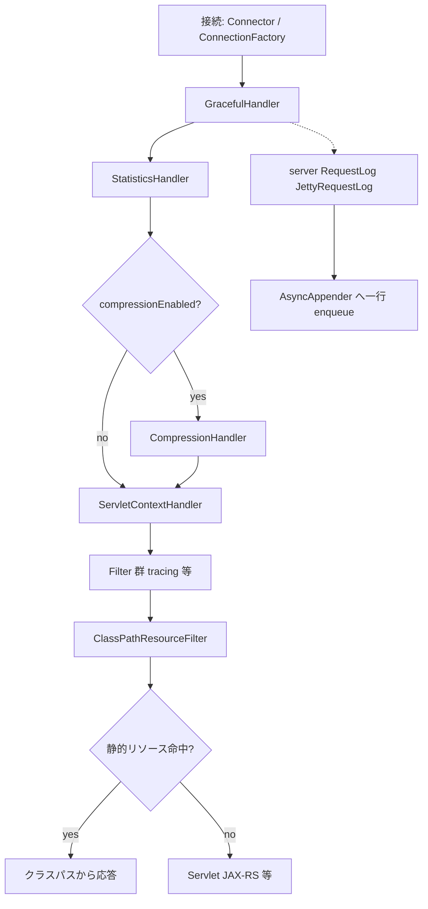

# 第10章 HttpServer のハンドラ連鎖

> **本章で読むソース**
>
> - [http-server/src/main/java/io/airlift/http/server/HttpServer.java](https://github.com/airlift/airlift/blob/439/http-server/src/main/java/io/airlift/http/server/HttpServer.java)
> - [http-server/src/main/java/io/airlift/http/server/ClassPathResourceFilter.java](https://github.com/airlift/airlift/blob/439/http-server/src/main/java/io/airlift/http/server/ClassPathResourceFilter.java)
> - [http-server/src/main/java/io/airlift/http/server/JettyRequestLog.java](https://github.com/airlift/airlift/blob/439/http-server/src/main/java/io/airlift/http/server/JettyRequestLog.java)
> - [http-server/src/main/java/io/airlift/http/server/HttpServerBinder.java](https://github.com/airlift/airlift/blob/439/http-server/src/main/java/io/airlift/http/server/HttpServerBinder.java)

## この章の狙い

第9章でコネクタまで追った `HttpServer` コンストラクタの後半は、Jetty のハンドラ連鎖を組む。
本章では servlet、filter、静的リソース（`ClassPathResourceFilter`）、compression、graceful / error handler、request log（`JettyRequestLog`）の接続順と、各段がリクエストに対して何をするかを追う。

## 前提

第8章と第9章を読んだものとする。
Jakarta Servlet の Filter / Servlet、および Jetty の `Handler` がネストする構造を知っているとよい。
JAX-RS の `ServletContainer` がここに渡る経路の詳細は第11章である。

## ハンドラ連鎖の骨格

コンストラクタ末尾のコメントが、意図した入れ子をそのまま書いている。

[http-server/src/main/java/io/airlift/http/server/HttpServer.java L294-L361](https://github.com/airlift/airlift/blob/439/http-server/src/main/java/io/airlift/http/server/HttpServer.java#L294-L361)

```java
        /*
         * Jetty's handlers chain is:
         *    channel listener (protocol)
         *    |--- graceful handler (tracks active requests)
         *         |--- statistics handler
         *              |--- compression handler (if enabled)
         *                   |--- servlet context handler
         *                        |--- error handler
         *                        |--- servlet filters (i.e. tracing)
         *                        |--- the servlet (i.e. Jersey's ServletContainer)
         *                        |--- static resources
         *    |--- error handler
         */
        StatisticsHandler statsHandler = new StatisticsHandler();

        Set<String> connectorNames = new HashSet<>();
        if (config.isHttpEnabled()) {
            connectorNames.add("http");
        }
        if (config.isHttpsEnabled()) {
            connectorNames.add("https");
        }
        ServletContextHandler servletContext = createServletContext(servlet, resources, filters, connectorNames, showStackTrace, serverFeatures.contains(LEGACY_URI_COMPLIANCE));

        if (enableCompression) {
            CompressionHandler compressionHandler = new CompressionHandler();

            Iterator<Compression> loader = ServiceLoader.load(Compression.class, HttpServer.class.getClassLoader())
                    .iterator();

            while (loader.hasNext()) {
                try {
                    compressionHandler.putCompression(loader.next());
                }
                catch (Throwable t) {
                    log.error(t, "Error loading http server compression");
                }
            }

            CompressionConfig compressionConfig = CompressionConfig.builder()
                    .defaults()
                    .build();

            compressionHandler.putConfiguration("/*", compressionConfig);
            compressionHandler.setHandler(servletContext);

            statsHandler.setHandler(compressionHandler);
        }
        else {
            statsHandler.setHandler(servletContext);
        }

        if (config.isLogEnabled()) {
            server.setRequestLog(new JettyRequestLog(
                    config.getLogPath(),
                    config.getLogHistory(),
                    config.getLogQueueSize(),
                    config.getLogMaxFileSize().toBytes(),
                    config.isCompressionEnabled(),
                    config.isLogImmediateFlush()));
        }
        server.setHandler(new GracefulHandler(statsHandler));
        ErrorHandler errorHandler = new ErrorHandler();
        errorHandler.setShowMessageInTitle(showStackTrace);
        errorHandler.setShowStacks(showStackTrace);
        errorHandler.setDefaultResponseMimeType(TEXT_PLAIN.asString());
        server.setErrorHandler(errorHandler);
    }
```

外側から見ると次の順である。

- **GracefulHandler**：停止時に稼働中リクエスト数を追跡する（後述の `stop` が参照する）
- **StatisticsHandler**：ハンドラ連鎖を通る要求と応答の統計（接続統計ではない）
- **CompressionHandler**（任意）：`ServiceLoader` で得た `Compression` 実装を載せ、`/*` に既定設定を付ける
- **ServletContextHandler**：filter / 静的リソース / servlet
- **server の ErrorHandler**：スタック表示の可否と MIME

接続統計は第9章のとおり、各 `ServerConnector` に `addBean` した `ConnectionStatistics` / `ConnectionStats` が担う。
`StatisticsHandler` と混同しない。

request log は Handler の子ではなく `server.setRequestLog` である。
ログ有効時だけ `JettyRequestLog` を付ける。
コンストラクタ引数の compression フラグには `config.isCompressionEnabled()` が渡っており、レスポンス圧縮のスイッチと同じ値でログファイルの `.gz` 回転も制御する。

## ServletContext：filter、静的リソース、servlet

文脈の実体は `createServletContext` が作る。

[http-server/src/main/java/io/airlift/http/server/HttpServer.java L427-L469](https://github.com/airlift/airlift/blob/439/http-server/src/main/java/io/airlift/http/server/HttpServer.java#L427-L469)

```java
    private static ServletContextHandler createServletContext(
            Servlet servlet,
            Set<HttpResourceBinding> resources,
            Set<Filter> filters,
            Set<String> connectorNames,
            boolean showStackTrace,
            boolean enableLegacyUriCompliance)
    {
        ServletContextHandler context = new ServletContextHandler(ServletContextHandler.NO_SESSIONS);
        ErrorHandler handler = new ErrorHandler();
        handler.setShowStacks(showStackTrace);
        handler.setShowMessageInTitle(showStackTrace);
        context.setErrorHandler(handler);

        if (enableLegacyUriCompliance) {
            // allow encoded slashes to occur in URI paths
            context.getServletHandler().setDecodeAmbiguousURIs(true);
        }
        // -- user provided filters
        for (Filter filter : filters) {
            context.addFilter(new FilterHolder(filter), "/*", null);
        }
        // -- static resources
        for (HttpResourceBinding resource : resources) {
            ClassPathResourceFilter filter = new ClassPathResourceFilter(
                    resource.getBaseUri(),
                    resource.getClassPathResourceBase(),
                    resource.getWelcomeFiles());
            context.addFilter(new FilterHolder(filter), filter.getBaseUri() + "/*", null);
        }
        // -- the servlet
        ServletHolder servletHolder = new ServletHolder(servlet);
        context.addServlet(servletHolder, "/*");

        // Starting with Jetty 9 there is no way to specify connectors directly, but
        // there is this wonky @ConnectorName virtual hosts automatically added
        List<String> virtualHosts = connectorNames.stream()
                .map(connectorName -> "@" + connectorName)
                .collect(toImmutableList());

        context.setVirtualHosts(virtualHosts);
        return context;
    }
```

登録順は filter → 静的リソース用 filter → servlet である。
セッションは持たない（`NO_SESSIONS`）。
`virtualHosts` に `@http` / `@https` を付け、第9章でコネクタへ付けた名前と対応づける。
これにより、同じ `ServletContextHandler` が HTTP コネクタと HTTPS コネクタの両方から見える。

静的リソースのバインディング型は第8章で触れた `HttpResourceBinding` である。

[http-server/src/main/java/io/airlift/http/server/HttpServerBinder.java L83-L115](https://github.com/airlift/airlift/blob/439/http-server/src/main/java/io/airlift/http/server/HttpServerBinder.java#L83-L115)

```java
    public static class HttpResourceBinding
    {
        private final String baseUri;
        private final String classPathResourceBase;
        private final List<String> welcomeFiles = new ArrayList<>();

        public HttpResourceBinding(String baseUri, String classPathResourceBase)
        {
            this.baseUri = baseUri;
            this.classPathResourceBase = classPathResourceBase;
        }

        public String getBaseUri()
        {
            return baseUri;
        }

        public String getClassPathResourceBase()
        {
            return classPathResourceBase;
        }

        public List<String> getWelcomeFiles()
        {
            return ImmutableList.copyOf(welcomeFiles);
        }

        public HttpResourceBinding withWelcomeFile(String welcomeFile)
        {
            welcomeFiles.add(welcomeFile);
            return this;
        }
    }
```

`baseUri` とクラスパス上のルート、任意の welcome ファイルだけを持つ値オブジェクトである。

## ClassPathResourceFilter：クラスパスから静的配信

`ClassPathResourceFilter` は `HttpFilter` である。
入口で `getResourcePath` がパスを解釈し、扱えない要求は null を返して後続へ委譲する。

[http-server/src/main/java/io/airlift/http/server/ClassPathResourceFilter.java L137-L157](https://github.com/airlift/airlift/blob/439/http-server/src/main/java/io/airlift/http/server/ClassPathResourceFilter.java#L137-L157)

```java
    @Nullable
    private String getResourcePath(HttpServletRequest request)
    {
        String pathInfo = request.getPathInfo();

        // Only serve the content if the request matches the base path.
        if (pathInfo == null || !pathInfo.startsWith(baseUri)) {
            return null;
        }

        // chop off the base uri
        pathInfo = pathInfo.substring(baseUri.length());

        if (!pathInfo.startsWith("/") && !pathInfo.isEmpty()) {
            // basepath is /foo and request went to /foobar --> pathInfo starts with bar
            // basepath is /foo and request went to /foo --> pathInfo should be /index.html
            return null;
        }

        return pathInfo;
    }
```

分岐は次のとおりである。

- `pathInfo` が null、または `baseUri` で始まらない：null（後続へ）
- `baseUri` を削った残りが `/` で始まらず、かつ空でもない：null（`/foo` と `/foobar` を区別する）
- それ以外：削ったあとの相対パス（空文字や `/` を含む）を返す

`doFilter` は、その結果が null ならただちに `chain.doFilter` する。

[http-server/src/main/java/io/airlift/http/server/ClassPathResourceFilter.java L84-L135](https://github.com/airlift/airlift/blob/439/http-server/src/main/java/io/airlift/http/server/ClassPathResourceFilter.java#L84-L135)

```java
    @Override
    public void doFilter(HttpServletRequest request, HttpServletResponse response, FilterChain chain)
            throws IOException, ServletException
    {
        String resourcePath = getResourcePath(request);
        if (resourcePath == null) {
            chain.doFilter(request, response);
            return;
        }

        if (resourcePath.isEmpty()) {
            response.setStatus(HttpServletResponse.SC_TEMPORARY_REDIRECT);
            response.setHeader(HttpHeaders.LOCATION, response.encodeRedirectURL(baseUri + "/"));
            return;
        }

        URL resource = getResource(resourcePath);
        if (resource == null) {
            chain.doFilter(request, response);
            return;
        }

        String method = request.getMethod();
        boolean skipContent = false;
        if (!HttpMethod.GET.is(method)) {
            if (HttpMethod.HEAD.is(method)) {
                skipContent = true;
            }
            else {
                response.sendError(HttpServletResponse.SC_METHOD_NOT_ALLOWED);
                return;
            }
        }

        InputStream resourceStream = null;
        try {
            resourceStream = resource.openStream();

            String contentType = MIME_TYPES.getMimeByExtension(resource.toString());
            response.setContentType(contentType);
            response.setCharacterEncoding(MIME_TYPES.getCharset(contentType));

            if (skipContent) {
                return;
            }

            resourceStream.transferTo(response.getOutputStream());
        }
        finally {
            closeQuietly(resourceStream);
        }
    }
```

リソース解決はクラスローダの `getResource` に任せ、ディレクトリ相当（`/`）なら welcome ファイルを順に試す。

[http-server/src/main/java/io/airlift/http/server/ClassPathResourceFilter.java L159-L175](https://github.com/airlift/airlift/blob/439/http-server/src/main/java/io/airlift/http/server/ClassPathResourceFilter.java#L159-L175)

```java
    private URL getResource(String resourcePath)
    {
        checkArgument(resourcePath.startsWith("/"), "resourcePath does not start with a slash: %s", resourcePath);

        if (!"/".equals(resourcePath)) {
            return getClass().getClassLoader().getResource(classPathResourceBase + resourcePath);
        }

        // check welcome files
        for (String welcomeFile : welcomeFiles) {
            URL resource = getClass().getClassLoader().getResource(classPathResourceBase + welcomeFile);
            if (resource != null) {
                return resource;
            }
        }
        return null;
    }
```

API 用の servlet（例：Jersey）と静的ファイルを同じ context に載せつつ、パスが合わない要求では classpath 探索をすぐ打ち切る。

## JettyRequestLog：非同期のアクセスログ

`JettyRequestLog` は Logback の rolling + async appender で行を書く。

[http-server/src/main/java/io/airlift/http/server/JettyRequestLog.java L51-L88](https://github.com/airlift/airlift/blob/439/http-server/src/main/java/io/airlift/http/server/JettyRequestLog.java#L51-L88)

```java
    public JettyRequestLog(String filename, int maxHistory, int queueSize, long maxFileSizeInBytes, boolean compressionEnabled, boolean immediateFlush)
    {
        ContextBase context = new ContextBase();
        recoverTempFiles(filename);

        fileAppender = new FlushingFileAppender<>();
        triggeringPolicy = new SizeAndTimeBasedFileNamingAndTriggeringPolicy<>();
        rollingPolicy = new TimeBasedRollingPolicy<>();

        rollingPolicy.setContext(context);
        rollingPolicy.setMaxHistory(maxHistory); // limits number of logging periods (i.e. days) kept
        rollingPolicy.setTimeBasedFileNamingAndTriggeringPolicy(triggeringPolicy);
        rollingPolicy.setParent(fileAppender);
        rollingPolicy.setFileNamePattern(filename + "-%d{yyyy-MM-dd}.%i.log");
        if (compressionEnabled) {
            rollingPolicy.setFileNamePattern(rollingPolicy.getFileNamePattern() + ".gz");
        }
        // Limit total log files occupancy on disk. Ideally we would keep exactly
        // `maxHistory` files (not logging periods). This is closest currently possible.
        rollingPolicy.setTotalSizeCap(new FileSize(saturatedMultiply(maxFileSizeInBytes, maxHistory)));

        triggeringPolicy.setContext(context);
        triggeringPolicy.setTimeBasedRollingPolicy(rollingPolicy);
        triggeringPolicy.setMaxFileSize(new FileSize(maxFileSizeInBytes));

        fileAppender.setContext(context);
        fileAppender.setFile(filename);
        fileAppender.setAppend(true);
        fileAppender.setBufferSize(BUFFER_SIZE_IN_BYTES);
        fileAppender.setLayout(new EchoLayout<>());
        fileAppender.setRollingPolicy(rollingPolicy);
        fileAppender.setImmediateFlush(immediateFlush);

        asyncAppender = new AsyncAppenderBase<>();
        asyncAppender.setContext(context);
        asyncAppender.setQueueSize(queueSize);
        asyncAppender.addAppender(fileAppender);
    }
```

`log` はタブ区切りの一行を組み立て、`asyncAppender.doAppend` に渡すだけである。

[http-server/src/main/java/io/airlift/http/server/JettyRequestLog.java L90-L128](https://github.com/airlift/airlift/blob/439/http-server/src/main/java/io/airlift/http/server/JettyRequestLog.java#L90-L128)

```java
    @Override
    public void log(Request request, Response response)
    {
        String user = null;
        Request.AuthenticationState authenticationState = Request.getAuthenticationState(request);
        if (authenticationState != null) {
            Principal principal = authenticationState.getUserPrincipal();
            if (principal != null) {
                user = principal.getName();
            }
        }

        String requestUri = null;
        if (request.getHttpURI() != null) {
            requestUri = request.getHttpURI().getPath();
            String parameters = request.getHttpURI().getQuery();
            if (parameters != null) {
                requestUri += "?" + parameters;
            }
        }

        String line = String.join(
                "\t",
                ISO_FORMATTER.format(Instant.ofEpochMilli(Request.getTimeStamp(request))), // Request timeout
                Request.getRemoteAddr(request), // Client address
                request.getMethod(), // HTTP method
                requestUri, // URL path + queryString
                user, // Authenticated user
                request.getHeaders().get("User-Agent"), // User agent
                Integer.toString(response.getStatus()), // Response code
                Long.toString(Request.getContentBytesRead(request)), // Request size
                Long.toString(Response.getContentBytesWritten(response)), // Response size
                formatLatency(NanoTime.since(request.getBeginNanoTime())), // Time taken to serve in ms
                request.getConnectionMetaData().getProtocol(), // Protocol version
                formatLatency(request.getHeadersNanoTime() - request.getBeginNanoTime()), // Time to dispatch
                formatLatency(NanoTime.since(request.getHeadersNanoTime()))); // Time to completion

        asyncAppender.doAppend(line);
    }
```

リクエストスレッド上でファイル I/O まで同期しない。
キューがあふれない範囲でディスク書き込みを切り離す。

Appender の開始と停止は Jetty の `ContainerLifeCycle` 経由で動く。

[http-server/src/main/java/io/airlift/http/server/JettyRequestLog.java L130-L146](https://github.com/airlift/airlift/blob/439/http-server/src/main/java/io/airlift/http/server/JettyRequestLog.java#L130-L146)

```java
    @Override
    protected void doStart()
    {
        rollingPolicy.start();
        triggeringPolicy.start();
        fileAppender.start();
        asyncAppender.start();
    }

    @Override
    protected void doStop()
    {
        rollingPolicy.stop();
        triggeringPolicy.stop();
        fileAppender.stop();
        asyncAppender.stop();
    }
```

rolling、file、async の順に start し、stop も同じ順で止める。
サーバが request log を起動するとき、この連鎖が初めて有効になる。

ファイル側の flush は独自の `FlushingFileAppender` が担う。

[http-server/src/main/java/io/airlift/http/server/JettyRequestLog.java L181-L215](https://github.com/airlift/airlift/blob/439/http-server/src/main/java/io/airlift/http/server/JettyRequestLog.java#L181-L215)

```java
    private static class FlushingFileAppender<T>
            extends RollingFileAppender<T>
    {
        private final AtomicLong lastFlushed = new AtomicLong(System.nanoTime());

        @Override
        protected void subAppend(T event)
        {
            super.subAppend(event);

            long now = System.nanoTime();
            long last = lastFlushed.get();
            if (((now - last) > FLUSH_INTERVAL_NANOS) && lastFlushed.compareAndSet(last, now)) {
                flush();
            }
        }

        @SuppressWarnings("Duplicates")
        private void flush()
        {
            try {
                streamWriteLock.lock();
                try {
                    getOutputStream().flush();
                }
                finally {
                    streamWriteLock.unlock();
                }
            }
            catch (IOException e) {
                started = false;
                addStatus(new ErrorStatus("IO failure in appender", this, e));
            }
        }
    }
```

`FLUSH_INTERVAL_NANOS` は 10 秒である。
`immediateFlush=false`（既定）でも、イベント到着時に前回 flush から 10 秒を超えていれば `streamWriteLock` の下で flush する。
`IOException` では appender を stopped 扱いにし（`started = false`）、`ErrorStatus` を残す。
即時 flush なしはバッファ効率の話であり、無期限にディスクへ出さない契約ではない。

## 起動と graceful 停止

Provider および `@PostConstruct` から呼ばれる `start` は Jetty `Server` を起動するだけである。

[http-server/src/main/java/io/airlift/http/server/HttpServer.java L538-L544](https://github.com/airlift/airlift/blob/439/http-server/src/main/java/io/airlift/http/server/HttpServer.java#L538-L544)

```java
    @PostConstruct
    public void start()
            throws Exception
    {
        server.start();
        checkState(server.isStarted(), "server is not started");
    }
```

`@PreDestroy` の `stop` は、先に `GracefulHandler` の現在リクエスト数を読んでから `server.stop()` する。

[http-server/src/main/java/io/airlift/http/server/HttpServer.java L546-L566](https://github.com/airlift/airlift/blob/439/http-server/src/main/java/io/airlift/http/server/HttpServer.java#L546-L566)

```java
    @PreDestroy
    public void stop()
            throws Exception
    {
        long activeRequests = server.getHandlers().stream()
                .filter(GracefulHandler.class::isInstance)
                .map(GracefulHandler.class::cast)
                .findFirst()
                .map(GracefulHandler::getCurrentRequestCount)
                .orElse(0L);

        log.debug("Server %s stopping in %s, %d active requests to complete", server.getName(), Duration.succinctDuration(server.getStopTimeout(), MILLISECONDS), activeRequests);

        server.stop();

        if (scheduledExecutorService != null) {
            scheduledExecutorService.shutdown();
        }

        log.info("Server %s shutdown complete", server.getName());
    }
```

`stopTimeout`（`HttpServerConfig`）は第9章で `server.setStopTimeout` 済みである。
GracefulHandler が最外にいる理由は、停止ログと Jetty の graceful 停止の両方から「いま動いているリクエスト」を見えるようにするためである。

## 処理の流れ



プロトコル層（第9章）の内側に、観測、圧縮、アプリ、静的配信がネストする。

## 高速化と最適化の工夫

`JettyRequestLog` の `AsyncAppenderBase` は、リクエスト完了後のログ整形をワーカースレッドのブロッキング I/O から切り離す。
ファイル側は 1 MiB バッファと（既定では）即時 flush なしで吞吐を取りつつ、`FlushingFileAppender` はイベントが継続して到着する場合に、前回 flush から 10 秒を超えた最初のイベントで flush する（タイマーは持たず、イベントが途切れれば自動 flush は起きない）。
I/O 失敗時は appender を止め、黙って書き続ける経路を残さない。
`ClassPathResourceFilter` は `getResourcePath` の不一致ですぐ `chain.doFilter` するため、API 主体のトラフィックではクラスパス探索が短絡される。
圧縮は `ServiceLoader` で得た実装を起動時に登録し、リクエスト経路では `CompressionHandler` の設定に従うだけにする。

## まとめ

- `HttpServer` は `GracefulHandler` → `StatisticsHandler` →（任意）`CompressionHandler` → `ServletContextHandler` の入れ子を組む。
- `StatisticsHandler` は要求と応答の統計であり、コネクタの接続統計とは別である。
- Context 内では Filter、`ClassPathResourceFilter`、単一 Servlet の順で登録し、`@http` / `@https` の virtual host でコネクタと対応づける。
- `getResourcePath` が prefix 境界と null pathInfo を判定し、静的配信は GET/HEAD だけ扱う。
- アクセスログは `JettyRequestLog` の非同期 appender へ一行を載せ、doStart/doStop と条件付き flush / 失敗時 ErrorStatus がライフサイクルを支える。
- 停止時は `GracefulHandler` の稼働数を読んでから `server.stop` する。

## 関連する章

- [第8章 HttpServerModule と Provider](08-http-server-module.md)
- [第9章 HttpServerInfo とコネクタ](09-http-server-info.md)
- [第11章 JAX-RS 統合](../part05-jaxrs/11-jaxrs.md)
- [第21章 トレーシングと OpenTelemetry](../part08-observability/21-tracing.md)
