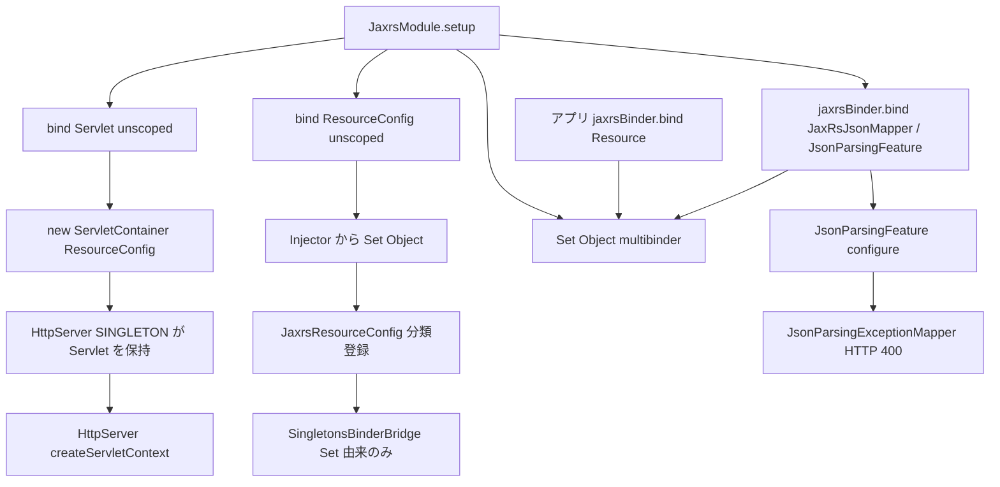

# 第11章 JAX-RS 統合

> **本章で読むソース**
>
> - [jaxrs/src/main/java/io/airlift/jaxrs/JaxrsModule.java](https://github.com/airlift/airlift/blob/439/jaxrs/src/main/java/io/airlift/jaxrs/JaxrsModule.java)
> - [jaxrs/src/main/java/io/airlift/jaxrs/JaxrsBinder.java](https://github.com/airlift/airlift/blob/439/jaxrs/src/main/java/io/airlift/jaxrs/JaxrsBinder.java)
> - [jaxrs/src/main/java/io/airlift/jaxrs/JaxrsResourceConfigProvider.java](https://github.com/airlift/airlift/blob/439/jaxrs/src/main/java/io/airlift/jaxrs/JaxrsResourceConfigProvider.java)
> - [jaxrs/src/main/java/io/airlift/jaxrs/JaxrsResourceConfig.java](https://github.com/airlift/airlift/blob/439/jaxrs/src/main/java/io/airlift/jaxrs/JaxrsResourceConfig.java)
> - [jaxrs/src/main/java/io/airlift/jaxrs/JaxrsServletProvider.java](https://github.com/airlift/airlift/blob/439/jaxrs/src/main/java/io/airlift/jaxrs/JaxrsServletProvider.java)
> - [jaxrs/src/main/java/io/airlift/jaxrs/JaxRsJsonMapper.java](https://github.com/airlift/airlift/blob/439/jaxrs/src/main/java/io/airlift/jaxrs/JaxRsJsonMapper.java)
> - [jaxrs/src/main/java/io/airlift/jaxrs/JsonParsingFeature.java](https://github.com/airlift/airlift/blob/439/jaxrs/src/main/java/io/airlift/jaxrs/JsonParsingFeature.java)
> - [jaxrs/src/main/java/io/airlift/jaxrs/JsonParsingExceptionMapper.java](https://github.com/airlift/airlift/blob/439/jaxrs/src/main/java/io/airlift/jaxrs/JsonParsingExceptionMapper.java)

## この章の狙い

第8章の `HttpServerProvider` は、同じ qualifier の `Servlet` を Injector から取って `HttpServer` に渡す。
その `Servlet` を Jersey の `ServletContainer` として供給するのが `JaxrsModule` である。
本章では `JaxrsBinder`（`Set<Object>`）から `JaxrsResourceConfig`、`JaxrsServletProvider`、そして `JaxRsJsonMapper` までの主経路を追う。

## 前提

第7章の `JsonMapper` 主経路、第8章の qualified `Servlet` 注入、第10章のハンドラ連鎖を読んだものとする。
Jakarta REST（JAX-RS）の Resource / Provider、および Guice の Multibinder を知っているとよい。

## JaxrsModule：Servlet と ResourceConfig のバインド

`JaxrsModule` も `AbstractConfigurationAwareModule` である。
qualifier なし、またはアノテーション付きのコンストラクタで、HttpServer 側と同じ資格子を揃えられる。

[jaxrs/src/main/java/io/airlift/jaxrs/JaxrsModule.java L35-L71](https://github.com/airlift/airlift/blob/439/jaxrs/src/main/java/io/airlift/jaxrs/JaxrsModule.java#L35-L71)

```java
public class JaxrsModule
        extends AbstractConfigurationAwareModule
{
    private final Optional<Class<? extends Annotation>> qualifier;

    public JaxrsModule()
    {
        this(null);
    }

    public JaxrsModule(@Nullable Class<? extends Annotation> qualifier)
    {
        this.qualifier = Optional.ofNullable(qualifier);
    }

    @Override
    protected void setup(Binder binder)
    {
        binder.bind(qualifiedKey(qualifier, Servlet.class))
                .toProvider(new JaxrsServletProvider(qualifier));
        binder.bind(qualifiedKey(qualifier, ResourceConfig.class))
                .toProvider(new JaxrsResourceConfigProvider(qualifier));
        newSetBinder(binder, qualifiedKey(qualifier, Object.class)).permitDuplicates();

        JaxrsBinder jaxrsBinder = jaxrsBinder(binder, qualifier);
        jaxrsBinder.bind(JaxRsJsonMapper.class);
        jaxrsBinder.bind(JsonParsingFeature.class, new JsonParsingFeature.Provider(qualifier));

        newOptionalBinder(binder, qualifiedKey(qualifier, MappingEnabled.class))
                .setDefault()
                .toInstance(ENABLED);

        if (getProperty("tracing.enabled").map(Boolean::parseBoolean).orElse(false)) {
            jaxrsBinder.bind(TracingDynamicFeature.class);
        }
    }
}
```

ここが HttpServer との接点である。
`Servlet` → `JaxrsServletProvider`、`ResourceConfig` → `JaxrsResourceConfigProvider` を同じ qualifier でバインドする。
ただしこの二つは scope 未指定である。
`HttpServer` は SINGLETON なので、その構築時に解決した `Servlet` / `ResourceConfig` の組をサーバが保持する。
別の Injector lookup が同じキーを再度解決すれば、新しい `ServletContainer` / `ResourceConfig` を作り得る。
一方 `JaxrsBinder` が登録するリソースや Provider は後述のとおり SINGLETON であり、トップレベルの二 binding とは所有権の粒度が違う。

`Set<Object>` の multibinder はリソースと JAX-RS Provider の袋である。
Module 自身が `JaxRsJsonMapper` と `JsonParsingFeature` をその袋へ既定登録する。
`tracing.enabled` が真なら `TracingDynamicFeature` も足す。

## JaxrsBinder：クラスを Guice と Set の両方へ

アプリや Module がリソースを足す API が `JaxrsBinder` である。

[jaxrs/src/main/java/io/airlift/jaxrs/JaxrsBinder.java L19-L73](https://github.com/airlift/airlift/blob/439/jaxrs/src/main/java/io/airlift/jaxrs/JaxrsBinder.java#L19-L73)

```java
public class JaxrsBinder
{
    private final Multibinder<Object> resourceBinder;
    private final Optional<Class<? extends Annotation>> qualifier;
    private final Binder binder;

    private JaxrsBinder(Binder binder, Optional<Class<? extends Annotation>> qualifier)
    {
        this.binder = requireNonNull(binder, "binder is null").skipSources(getClass());
        this.qualifier = requireNonNull(qualifier, "qualifier is null");
        this.resourceBinder = newSetBinder(binder, qualifiedKey(qualifier, Object.class)).permitDuplicates();
    }

    public static JaxrsBinder jaxrsBinder(Binder binder)
    {
        return jaxrsBinder(binder, Optional.empty());
    }

    public static JaxrsBinder jaxrsBinder(Binder binder, Class<? extends Annotation> qualifier)
    {
        return jaxrsBinder(binder, Optional.ofNullable(qualifier));
    }

    public static JaxrsBinder jaxrsBinder(Binder binder, Optional<Class<? extends Annotation>> qualifier)
    {
        return new JaxrsBinder(binder, qualifier);
    }

    public <T> void bind(Class<T> implementation)
    {
        if (qualifier.isPresent()) {
            binder.bind(implementation)
                    .annotatedWith(qualifier.orElseThrow())
                    .to(implementation)
                    .in(SINGLETON);
        }
        else {
            binder.bind(implementation).in(SINGLETON);
        }
        resourceBinder.addBinding().to(implementation).in(SINGLETON);
    }

    public <T> void bind(Class<T> implementation, Provider<T> provider)
    {
        if (qualifier.isPresent()) {
            binder.bind(implementation)
                    .annotatedWith(qualifier.orElseThrow())
                    .toProvider(provider)
                    .in(SINGLETON);
        }
        else {
            binder.bind(implementation).toProvider(provider).in(SINGLETON);
        }
        resourceBinder.addBinding().toProvider(provider).in(SINGLETON);
    }
```

`bind(Class)` は二つの独立した binding を一度に宣言する。

1. 実装型（qualifier があれば annotated）への直接 Key。scope は SINGLETON
2. `Set<Object>` 要素としての binding。こちらも各要素に SINGLETON が付く

両 binding に同じ実装や同じ Provider クラスを渡しても、「直接 Key の解決結果」と「Set 要素の解決結果」が同一オブジェクトである保証にはならない。
それぞれが自分の scope でインスタンスを持つ。
`bindInstance` は Set だけに実体を足す。
`disableJsonExceptionMapper` は `MappingEnabled` を DISABLED に差し替え、後述の `JsonParsingFeature` が Mapper を register しないようにする。

## JaxrsResourceConfigProvider：Set から ResourceConfig へ

[jaxrs/src/main/java/io/airlift/jaxrs/JaxrsResourceConfigProvider.java L36-L48](https://github.com/airlift/airlift/blob/439/jaxrs/src/main/java/io/airlift/jaxrs/JaxrsResourceConfigProvider.java#L36-L48)

```java
    @Override
    public ResourceConfig get()
    {
        Set<Object> singletons = injector.getInstance(qualifiedKey(qualifier, new TypeLiteral<>() {}));
        return new JaxrsResourceConfig(singletons)
                .setProperties(ImmutableMap.of(
                        RESPONSE_SET_STATUS_OVER_SEND_ERROR, "true",
                        // Jetty http server buffers output when writing which makes Jersey server-side buffering redundant.
                        // For small responses, allocating 8KB buffer is wasteful. For large responses, Jetty will buffer
                        // as needed. Having Content-Length for small responses is not critical as in the HTTP/2
                        // Content-Length can be inferred from DATA frame length.
                        OUTBOUND_CONTENT_LENGTH_BUFFER, "0"));
    }
```

Injector から同じ qualifier の `Set<Object>` を取り、`JaxrsResourceConfig` に渡す。
プロパティでは、送信エラーより明示的な status 設定を優先し、Jersey の出方向 Content-Length バッファを 0 にする。
コメントどおり、バッファリングは Jetty 側に任せ、Jersey 側の 8KB 確保を避ける。

## JaxrsResourceConfig：Guice インスタンスを Jersey へ橋渡し

[jaxrs/src/main/java/io/airlift/jaxrs/JaxrsResourceConfig.java L28-L75](https://github.com/airlift/airlift/blob/439/jaxrs/src/main/java/io/airlift/jaxrs/JaxrsResourceConfig.java#L28-L75)

```java
public class JaxrsResourceConfig
        extends ResourceConfig
{
    public JaxrsResourceConfig(Set<Object> singletons)
    {
        ImmutableMap.Builder<Class<?>, Object> builder = ImmutableMap.builder();
        for (Object singleton : singletons) {
            Class<?> clazz = singleton.getClass();
            if (singleton instanceof Class<?> clazzInstance) {
                register(clazzInstance);
            }
            else if (Providers.isProvider(clazz) || Binder.class.isAssignableFrom(clazz)) {
                // If Jersey supports this component's class (including Binders), register directly, so we can get @Context injections
                register(singleton);
            }
            else if (singleton instanceof Resource resource) {
                registerResources(resource);
            }
            else {
                builder.put(clazz, singleton);
            }
        }

        Map<Class<?>, Object> classToInstance = builder.buildOrThrow();
        registerClasses(classToInstance.keySet());
        register(new SingletonsBinderBridge(classToInstance));
    }

    // Allows HK2 to retrieve instances of registered singleton resources that we got from Guice
    private static class SingletonsBinderBridge
            extends AbstractBinder
    {
        private final Map<Class<?>, Object> singletons;

        public SingletonsBinderBridge(Map<Class<?>, Object> singletons)
        {
            this.singletons = ImmutableMap.copyOf(singletons);
        }

        @Override
        public void configure()
        {
            for (Map.Entry<Class<?>, Object> singleton : singletons.entrySet()) {
                bind(singleton.getValue()).to(singleton.getKey());
            }
        }
    }
}
```

分類は次のとおりである。

- **Class そのもの**：`register(Class)` で Jersey に型登録する。
- **JAX-RS Provider / HK2 Binder**：インスタンスを直接 `register` する（`@Context` 注入のため）。
- **Jersey `Resource` モデル**：`registerResources` する。
- **それ以外（典型的なリソース Bean）**：クラスを `registerClasses` し、`SingletonsBinderBridge` で Set から得たインスタンスを HK2 に bind する。

`SingletonsBinderBridge` が保証するのは、Set 経由で渡った Guice 管理インスタンスを HK2 が再生成せず使うことである。
直接 Key で注入したオブジェクトと Set 要素が同一であることは、ここでは保証しない。
依存性注入の主人は Guice のままである。

## JaxrsServletProvider：ServletContainer の生成

[jaxrs/src/main/java/io/airlift/jaxrs/JaxrsServletProvider.java L16-L38](https://github.com/airlift/airlift/blob/439/jaxrs/src/main/java/io/airlift/jaxrs/JaxrsServletProvider.java#L16-L38)

```java
public class JaxrsServletProvider
        implements Provider<Servlet>
{
    private final Optional<Class<? extends Annotation>> qualifier;
    private Injector injector;

    public JaxrsServletProvider(Optional<Class<? extends Annotation>> qualifier)
    {
        this.qualifier = requireNonNull(qualifier, "qualifier is null");
    }

    @Inject
    public void setInjector(Injector injector)
    {
        this.injector = requireNonNull(injector, "injector is null");
    }

    @Override
    public Servlet get()
    {
        return new ServletContainer(injector.getInstance(qualifiedKey(qualifier, ResourceConfig.class)));
    }
}
```

`ResourceConfig`（実体は `JaxrsResourceConfig`）を取り、`ServletContainer` に包んで返す。
scope 未指定の Provider なので、lookup のたびに新しい `ServletContainer` になり得る。
第8章の `HttpServer` が SINGLETON として一度だけ解決し保持する経路が、運用上の所有者である。
この `Servlet` が第10章の `createServletContext` で `/*` に載る。

## JaxRsJsonMapper：JSON の MessageBodyReader/Writer

第7章で触れたとおり、コンストラクタは `JsonMapper` を受け取る。

[jaxrs/src/main/java/io/airlift/jaxrs/JaxRsJsonMapper.java L22-L58](https://github.com/airlift/airlift/blob/439/jaxrs/src/main/java/io/airlift/jaxrs/JaxRsJsonMapper.java#L22-L58)

```java
// For backward compatibility with existing consumers
@Provider
@Consumes({MediaType.APPLICATION_JSON, "text/json"})
@Produces({MediaType.APPLICATION_JSON, "text/json"})
public class JaxRsJsonMapper
        extends JacksonJsonProvider
{
    @Inject
    public JaxRsJsonMapper(JsonMapper jsonMapper)
    {
        super(jsonMapper);
        enable(ADD_NO_SNIFF_HEADER);
        enable(INCLUDE_SOURCE_IN_LOCATION);
    }

    /**
     * Throws JsonParsingException only when Jakarta-RS container calls to deserialize given JSON value
     * Need to distinguish between:
     * - JsonProcessingException due to Jakarta-RS deserialization
     * - JsonProcessingException due to operation happening in resource body
     */
    @Override
    public Object readFrom(Class<Object> type, Type genericType, Annotation[] annotations, MediaType mediaType, MultivaluedMap<String, String> httpHeaders, InputStream entityStream)
            throws IOException
    {
        try {
            return super.readFrom(type, genericType, annotations, mediaType, httpHeaders, entityStream);
        }
        catch (IOException e) {
            // Re-throw real IO exceptions that are not due to bad JSON
            if (!(e instanceof JsonProcessingException) && !(e instanceof EOFException)) {
                throw e;
            }
            throw new JsonParsingException(e);
        }
    }
}
```

コンテナが entity を読む経路だけ、JSON 破損を `JsonParsingException` に畳む。
リソース本体で起きた `JsonProcessingException` と混同しないための境界である。
`JaxrsModule` が `jaxrsBinder.bind(JaxRsJsonMapper.class)` しているため、この Provider も `Set<Object>` 経由で `ResourceConfig` に入る。

## JsonParsingFeature：例外を HTTP 400 へ落とす終端

`JsonParsingException` は Mapper が HTTP 応答へ変換する。
`JaxrsModule` が既定登録する `JsonParsingFeature.Provider` は、qualified の `MappingEnabled` を読んで Feature を組み立てる。

[jaxrs/src/main/java/io/airlift/jaxrs/JsonParsingFeature.java L15-L63](https://github.com/airlift/airlift/blob/439/jaxrs/src/main/java/io/airlift/jaxrs/JsonParsingFeature.java#L15-L63)

```java
public record JsonParsingFeature(MappingEnabled enabled)
        implements Feature
{
    public enum MappingEnabled
    {
        ENABLED,
        DISABLED,
    }

    public JsonParsingFeature
    {
        requireNonNull(enabled, "config is null");
    }

    @Override
    public boolean configure(FeatureContext context)
    {
        if (enabled == DISABLED) {
            return false;
        }

        context.register(new JsonParsingExceptionMapper());
        return true;
    }

    public static class Provider
            implements com.google.inject.Provider<JsonParsingFeature>
    {
        private final Optional<Class<? extends Annotation>> qualifier;
        private Injector injector;

        public Provider(Optional<Class<? extends Annotation>> qualifier)
        {
            this.qualifier = requireNonNull(qualifier, "qualifier is null");
        }

        @Inject
        public void setInjector(Injector injector)
        {
            this.injector = requireNonNull(injector, "injector is null");
        }

        @Override
        public JsonParsingFeature get()
        {
            return new JsonParsingFeature(injector.getInstance(qualifiedKey(qualifier, MappingEnabled.class)));
        }
    }
}
```

ENABLED（Module の既定）なら `JsonParsingExceptionMapper` を register する。
`disableJsonExceptionMapper` が `MappingEnabled.DISABLED` に差し替えていれば、ここは何も register せず false を返す。

[jaxrs/src/main/java/io/airlift/jaxrs/JsonParsingExceptionMapper.java L11-L25](https://github.com/airlift/airlift/blob/439/jaxrs/src/main/java/io/airlift/jaxrs/JsonParsingExceptionMapper.java#L11-L25)

```java
@Provider
public class JsonParsingExceptionMapper
        implements ExceptionMapper<JsonParsingException>
{
    private static final String SERIALIZATION_ERROR_CODE = "JSON_PARSING_ERROR";

    @Override
    public Response toResponse(JsonParsingException e)
    {
        return Response.status(BAD_REQUEST)
                .type(APPLICATION_JSON_TYPE)
                .entity(new JsonError(SERIALIZATION_ERROR_CODE, getRootCause(e).getMessage()))
                .build();
    }
}
```

終端は HTTP 400、`application/json`、本体に `JSON_PARSING_ERROR` と root cause メッセージである。
`readFrom` の変換はここでクライアント向け応答になる。

## 処理の流れ



Guice の Set が Jersey の構成に変換され、HttpServer が保持した Servlet が HTTP サーバへ渡る。

## 高速化と最適化の工夫

`OUTBOUND_CONTENT_LENGTH_BUFFER=0` は、Jersey が応答ごとに用意しがちな出方向バッファを止める機構である。
コメントが述べるとおり小さな応答では 8KB 確保が無駄で、大きい応答のバッファリングは Jetty が必要に応じて行う。
`SingletonsBinderBridge` は Set から得たインスタンスを HK2 が再生成しない範囲で、Jersey 側の二重生成を避ける。
直接 Key と Set 要素の共有までは保証しない。

## まとめ

- `JaxrsModule` の `Servlet` / `ResourceConfig` は unscoped の Provider binding であり、所有の要は HttpServer の SINGLETON 解決である。
- `JaxrsBinder.bind` は直接 Key と Set 要素を別 binding として宣言し、各々に SINGLETON を付ける。
- 両者の同一インスタンスは保証しない。
- `JaxrsResourceConfig` の `SingletonsBinderBridge` は Set 由来インスタンスの HK2 再利用に限る。
- `JaxRsJsonMapper.readFrom` が投げた `JsonParsingException` は、既定の `JsonParsingFeature` 経由で `JsonParsingExceptionMapper` が HTTP 400 の JSON エラーへ落とす。

## 関連する章

- [第7章 JsonCodec と JsonMapper](../part03-json/07-json.md)
- [第8章 HttpServerModule と Provider](../part04-http-server/08-http-server-module.md)
- [第10章 HttpServer のハンドラ連鎖](../part04-http-server/10-http-server-handlers.md)
- [第21章 トレーシングと OpenTelemetry](../part08-observability/21-tracing.md)
