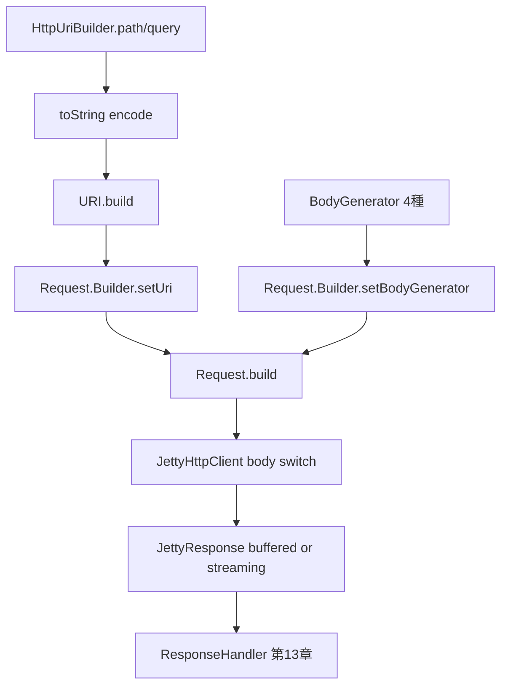

# 第12章 Request と Response と URI

> **本章で読むソース**
>
> - [http-client/src/main/java/io/airlift/http/client/Request.java](https://github.com/airlift/airlift/blob/439/http-client/src/main/java/io/airlift/http/client/Request.java)
> - [http-client/src/main/java/io/airlift/http/client/Response.java](https://github.com/airlift/airlift/blob/439/http-client/src/main/java/io/airlift/http/client/Response.java)
> - [http-client/src/main/java/io/airlift/http/client/BodyGenerator.java](https://github.com/airlift/airlift/blob/439/http-client/src/main/java/io/airlift/http/client/BodyGenerator.java)
> - [http-client/src/main/java/io/airlift/http/client/StaticBodyGenerator.java](https://github.com/airlift/airlift/blob/439/http-client/src/main/java/io/airlift/http/client/StaticBodyGenerator.java)
> - [http-client/src/main/java/io/airlift/http/client/JsonBodyGenerator.java](https://github.com/airlift/airlift/blob/439/http-client/src/main/java/io/airlift/http/client/JsonBodyGenerator.java)
> - [http-client/src/main/java/io/airlift/http/client/ByteBufferBodyGenerator.java](https://github.com/airlift/airlift/blob/439/http-client/src/main/java/io/airlift/http/client/ByteBufferBodyGenerator.java)
> - [http-client/src/main/java/io/airlift/http/client/FileBodyGenerator.java](https://github.com/airlift/airlift/blob/439/http-client/src/main/java/io/airlift/http/client/FileBodyGenerator.java)
> - [http-client/src/main/java/io/airlift/http/client/StreamingBodyGenerator.java](https://github.com/airlift/airlift/blob/439/http-client/src/main/java/io/airlift/http/client/StreamingBodyGenerator.java)
> - [http-client/src/main/java/io/airlift/http/client/HttpUriBuilder.java](https://github.com/airlift/airlift/blob/439/http-client/src/main/java/io/airlift/http/client/HttpUriBuilder.java)
> - [http-client/src/main/java/io/airlift/http/client/jetty/JettyHttpClient.java](https://github.com/airlift/airlift/blob/439/http-client/src/main/java/io/airlift/http/client/jetty/JettyHttpClient.java)
> - [http-client/src/main/java/io/airlift/http/client/jetty/JettyResponse.java](https://github.com/airlift/airlift/blob/439/http-client/src/main/java/io/airlift/http/client/jetty/JettyResponse.java)

## この章の狙い

HTTP クライアントの要求と応答の表層は、実行エンジン（第15章の JettyHttpClient）から切り離した API である。
本章では `Request`、`BodyGenerator`、`Response`（実装 `JettyResponse`）、`HttpUriBuilder` を追い、浅い不変性、送信時の 4 分岐（Json は Static 経由）、応答の共有ストリーム契約を押さえる。

## 前提

Java の `URI`、HTTP の method / header / body の役割を知っているものとする。
第7章の `JsonCodec` を読んでいると、`JsonBodyGenerator` の接続が追いやすい。
フィルタ適用や実送信は第14章と第15章で扱う。

## Request：Builder から組み立てるオブジェクト

`Request` は `final` クラスである。
コンストラクタでフィールドを埋め、method や URI をあとから差し替える setter はない。
深い不変性までは保証しない。

[http-client/src/main/java/io/airlift/http/client/Request.java L37-L79](https://github.com/airlift/airlift/blob/439/http-client/src/main/java/io/airlift/http/client/Request.java#L37-L79)

```java
public final class Request
{
    private final Optional<HttpVersion> httpVersion;
    private final URI uri;
    private final String method;
    private final ListMultimap<HeaderName, String> headers = MultimapBuilder.hashKeys().arrayListValues().build();
    private final Optional<Duration> requestTimeout;
    private final Optional<Duration> idleTimeout;
    private final BodyGenerator bodyGenerator;
    private final Optional<DataSize> maxResponseContentLength;
    private final Optional<SpanBuilder> spanBuilder;
    private final boolean followRedirects;

    private Request(
            Optional<HttpVersion> httpVersion,
            URI uri,
            String method,
            ListMultimap<HeaderName, String> headers,
            Optional<Duration> requestTimeout,
            Optional<Duration> idleTimeout,
            BodyGenerator bodyGenerator,
            Optional<DataSize> maxResponseContentLength,
            Optional<SpanBuilder> spanBuilder,
            boolean followRedirects)
    {
        requireNonNull(uri, "uri is null");
        checkArgument(uri.getHost() != null, "uri does not have a host: %s", uri);
        checkArgument(uri.getScheme() != null, "uri does not have a scheme: %s", uri);
        String scheme = uri.getScheme().toLowerCase(ENGLISH);
        checkArgument("http".equals(scheme) || "https".equals(scheme), "uri scheme must be http or https: %s", uri);
        requireNonNull(method, "method is null");

        this.httpVersion = requireNonNull(httpVersion, "httpVersion is null");
        this.uri = validateUri(uri);
        this.method = method.toUpperCase(ENGLISH);
        this.headers.putAll(headers);
        this.requestTimeout = requireNonNull(requestTimeout, "requestTimeout is null");
        this.idleTimeout = requireNonNull(idleTimeout, "idleTimeout is null");
        this.bodyGenerator = bodyGenerator;
        this.maxResponseContentLength = requireNonNull(maxResponseContentLength, "maxResponseContentLength is null");
        this.spanBuilder = requireNonNull(spanBuilder, "spanBuilder is null");
        this.followRedirects = followRedirects;
    }
```

URI は host と scheme（http / https）を必須とし、method は大文字に正規化する。
ヘッダは Builder から受けた内容を内部の `ListMultimap` へ `putAll` する。
しかし `getHeaders()` はその可変マップをそのまま返す。

[http-client/src/main/java/io/airlift/http/client/Request.java L119-L122](https://github.com/airlift/airlift/blob/439/http-client/src/main/java/io/airlift/http/client/Request.java#L119-L122)

```java
    public ListMultimap<HeaderName, String> getHeaders()
    {
        return headers;
    }
```

構築後も呼び出し側がヘッダを変更でき、`equals` / `hashCode` の観測値も変わり得る。
保証しているのは「フィールド参照を setter で差し替えない」ことであり、深い不変性ではない。
タイムアウト、最大応答長、OpenTelemetry の `SpanBuilder`、リダイレクト追従もフィールドに載る。

組み立ては内側の `Builder` である。
HTTP 動詞ごとの準備メソッドと、既存 `Request` からのコピーがある。

[http-client/src/main/java/io/airlift/http/client/Request.java L205-L258](https://github.com/airlift/airlift/blob/439/http-client/src/main/java/io/airlift/http/client/Request.java#L205-L258)

```java
    public static final class Builder
    {
        public static Builder prepareHead()
        {
            return new Builder().setMethod("HEAD");
        }

        public static Builder prepareGet()
        {
            return new Builder().setMethod("GET");
        }

        public static Builder preparePost()
        {
            return new Builder().setMethod("POST");
        }

        public static Builder preparePut()
        {
            return new Builder().setMethod("PUT");
        }

        public static Builder prepareDelete()
        {
            return new Builder().setMethod("DELETE");
        }

        public static Builder preparePatch()
        {
            return new Builder().setMethod("PATCH");
        }

        public static Builder prepareOptions()
        {
            return new Builder().setMethod("OPTIONS");
        }

        public static Builder fromRequest(Request request)
        {
            Builder builder = new Builder()
                    .setUri(request.getUri())
                    .setMethod(request.getMethod())
                    .addHeaders(request.getHeaders())
                    .setBodyGenerator(request.getBodyGenerator())
                    .setSpanBuilder(request.getSpanBuilder().orElse(null))
                    .setFollowRedirects(request.isFollowRedirects())
                    .setVersion(request.getHttpVersion().orElse(null));

            request.getRequestTimeout().ifPresent(builder::setRequestTimeout);
            request.getIdleTimeout().ifPresent(builder::setIdleTimeout);
            request.getMaxResponseContentLength().ifPresent(builder::setMaxResponseContentLength);

            return builder;
        }
```

[http-client/src/main/java/io/airlift/http/client/Request.java L390-L410](https://github.com/airlift/airlift/blob/439/http-client/src/main/java/io/airlift/http/client/Request.java#L390-L410)

```java
        public Request build()
        {
            return new Request(
                    version,
                    uri,
                    method,
                    headers,
                    requestTimeout,
                    idleTimeout,
                    bodyGenerator,
                    maxResponseContentLength,
                    Optional.ofNullable(spanBuilder),
                    followRedirects);
        }
    }

    private static URI validateUri(URI uri)
    {
        checkArgument(uri.getPort() != 0, "Cannot make requests to HTTP port 0");
        return uri;
    }
```

`fromRequest` は、リクエストフィルタがヘッダや URI だけを変えて新しい `Request` を返すときの起点になる（第14章）。
ポート 0 への要求は `validateUri` で拒否する。

## BodyGenerator：ボディの封印された種類

ボディは `OutputStream` をその場で書くコールバックではなく、sealed interface で種類を固定する。

[http-client/src/main/java/io/airlift/http/client/BodyGenerator.java L18-L22](https://github.com/airlift/airlift/blob/439/http-client/src/main/java/io/airlift/http/client/BodyGenerator.java#L18-L22)

```java
public sealed interface BodyGenerator
        permits ByteBufferBodyGenerator,
                FileBodyGenerator,
                StaticBodyGenerator,
                StreamingBodyGenerator {}
```

送信時の分岐は `JettyHttpClient` が 4 種を Jetty の `RequestContent` へ写す。

[http-client/src/main/java/io/airlift/http/client/jetty/JettyHttpClient.java L995-L1002](https://github.com/airlift/airlift/blob/439/http-client/src/main/java/io/airlift/http/client/jetty/JettyHttpClient.java#L995-L1002)

```java
        BodyGenerator bodyGenerator = finalRequest.getBodyGenerator();
        if (bodyGenerator != null) {
            switch (bodyGenerator) {
                case StaticBodyGenerator generator -> jettyRequest.body(new BytesRequestContent(generator.getBody()));
                case ByteBufferBodyGenerator generator -> jettyRequest.body(new ByteBufferRequestContent(generator.getByteBuffers()));
                case FileBodyGenerator generator -> jettyRequest.body(new PathRequestContent(generator.getContentType().toString(), generator.getPath(), sizedByteBufferPool));
                case StreamingBodyGenerator generator -> jettyRequest.body(new InputStreamRequestContent(generator.contentType(), generator.source(), sizedByteBufferPool));
            }
        }
```

それぞれの保持対象は次のとおりである。

**StaticBodyGenerator** は `byte[]` をコピーせず保持し、`getBody()` で同じ配列を返す。

[http-client/src/main/java/io/airlift/http/client/StaticBodyGenerator.java L20-L45](https://github.com/airlift/airlift/blob/439/http-client/src/main/java/io/airlift/http/client/StaticBodyGenerator.java#L20-L45)

```java
public sealed class StaticBodyGenerator
        implements BodyGenerator
        permits JsonBodyGenerator
{
    public static StaticBodyGenerator createStaticBodyGenerator(String body, Charset charset)
    {
        return new StaticBodyGenerator(body.getBytes(charset));
    }

    public static StaticBodyGenerator createStaticBodyGenerator(byte[] body)
    {
        return new StaticBodyGenerator(body);
    }

    private final byte[] body;

    protected StaticBodyGenerator(byte[] body)
    {
        this.body = body;
    }

    public byte[] getBody()
    {
        return body;
    }
}
```

JSON は `JsonBodyGenerator` が `JsonCodec.toJsonBytes` で先にバイト化し、`StaticBodyGenerator` として同じ switch 分岐に乗る。
呼び出し側が配列を書き換えれば、ボディ内容も変わる。

[http-client/src/main/java/io/airlift/http/client/JsonBodyGenerator.java L20-L32](https://github.com/airlift/airlift/blob/439/http-client/src/main/java/io/airlift/http/client/JsonBodyGenerator.java#L20-L32)

```java
public final class JsonBodyGenerator<T>
        extends StaticBodyGenerator
{
    public static <T> JsonBodyGenerator<T> jsonBodyGenerator(JsonCodec<T> jsonCodec, T instance)
    {
        return new JsonBodyGenerator<>(jsonCodec, instance);
    }

    private JsonBodyGenerator(JsonCodec<T> jsonCodec, T instance)
    {
        super(jsonCodec.toJsonBytes(instance));
    }
}
```

**ByteBufferBodyGenerator** も `ByteBuffer[]` を直接保持する。

[http-client/src/main/java/io/airlift/http/client/ByteBufferBodyGenerator.java L20-L33](https://github.com/airlift/airlift/blob/439/http-client/src/main/java/io/airlift/http/client/ByteBufferBodyGenerator.java#L20-L33)

```java
public final class ByteBufferBodyGenerator
        implements BodyGenerator
{
    private final ByteBuffer[] byteBuffers;

    public ByteBufferBodyGenerator(ByteBuffer... byteBuffers)
    {
        this.byteBuffers = requireNonNull(byteBuffers, "byteBuffers is null");
    }

    public ByteBuffer[] getByteBuffers()
    {
        return byteBuffers;
    }
}
```

**FileBodyGenerator** は `Path` と `MediaType` を保持し、送信時にファイルを読む。

[http-client/src/main/java/io/airlift/http/client/FileBodyGenerator.java L10-L36](https://github.com/airlift/airlift/blob/439/http-client/src/main/java/io/airlift/http/client/FileBodyGenerator.java#L10-L36)

```java
public final class FileBodyGenerator
        implements BodyGenerator
{
    private final Path path;
    private final MediaType contentType;

    public FileBodyGenerator(Path path, MediaType contentType)
    {
        this.path = requireNonNull(path, "path is null");
        this.contentType = requireNonNull(contentType, "contentType is null");
    }

    public FileBodyGenerator(Path path)
    {
        this(path, OCTET_STREAM);
    }

    public Path getPath()
    {
        return path;
    }

    public MediaType getContentType()
    {
        return contentType;
    }
}
```

**StreamingBodyGenerator** は再利用可能な値ではなく、送信時に消費される `InputStream` の所有権を持つ。

[http-client/src/main/java/io/airlift/http/client/StreamingBodyGenerator.java L10-L40](https://github.com/airlift/airlift/blob/439/http-client/src/main/java/io/airlift/http/client/StreamingBodyGenerator.java#L10-L40)

```java
public final class StreamingBodyGenerator
        implements BodyGenerator
{
    private final InputStream source;
    private final String contentType;

    public static StreamingBodyGenerator streamingBodyGenerator(InputStream source)
    {
        return new StreamingBodyGenerator(APPLICATION_BINARY, source);
    }

    public static StreamingBodyGenerator streamingBodyGenerator(MediaType contentType, InputStream source)
    {
        return new StreamingBodyGenerator(contentType, source);
    }

    public InputStream source()
    {
        return source;
    }

    public String contentType()
    {
        return contentType;
    }

    private StreamingBodyGenerator(MediaType contentType, InputStream source)
    {
        this.contentType = requireNonNull(contentType, "contentType is null").toString();
        this.source = requireNonNull(source, "source is null");
    }
}
```

同じ `StreamingBodyGenerator` を二度送信すれば、二度目は既に読まれたストリームに当たる。
静的バイト、バッファ、ファイルパスとは所有権の扱いが違う。

## Response：読み取り契約と JettyResponse

`Response` はインタフェースである。
実装の主経路は `JettyResponse` である。

[http-client/src/main/java/io/airlift/http/client/Response.java L32-L79](https://github.com/airlift/airlift/blob/439/http-client/src/main/java/io/airlift/http/client/Response.java#L32-L79)

```java
public interface Response
{
    HttpVersion getHttpVersion();

    int getStatusCode();

    default Optional<String> getHeader(HeaderName name)
    {
        List<String> values = getHeaders(name);
        return values.isEmpty() ? Optional.empty() : Optional.of(values.getFirst());
    }

    /**
     * @deprecated Use {@link #getHeader(HeaderName)} instead
     */
    @Deprecated
    default String getHeader(String name)
    {
        return getHeader(HeaderName.of(name)).orElse(null);
    }

    /**
     * @deprecated Use {@link #getHeaders(HeaderName)} instead
     */
    @Deprecated
    default List<String> getHeaders(String name)
    {
        return getHeaders().get(HeaderName.of(name));
    }

    default List<String> getHeaders(HeaderName name)
    {
        return getHeaders().get(name);
    }

    ListMultimap<HeaderName, String> getHeaders();

    @Beta
    Content getContent();

    // TODO eventually deprecate in favor of getContent()
    InputStream getInputStream()
            throws IOException;

    /**
     * Returns number of bytes read via {@link #getContent()} or {@link #getInputStream()}.
     */
    long getBytesRead();
```

`JettyResponse` はバッファ済みとストリームの二系統である。

[http-client/src/main/java/io/airlift/http/client/jetty/JettyResponse.java L18-L84](https://github.com/airlift/airlift/blob/439/http-client/src/main/java/io/airlift/http/client/jetty/JettyResponse.java#L18-L84)

```java
class JettyResponse
        implements io.airlift.http.client.Response
{
    private final Response response;
    private final Content content;
    private final InputStream inputStream;
    private final LongSupplier bytesRead;
    private final Supplier<ListMultimap<HeaderName, String>> headers;

    public JettyResponse(Response response, byte[] content)
    {
        this.response = response;
        this.content = new BytesContent(content);
        this.inputStream = new ByteArrayInputStream(content);
        this.bytesRead = () -> content.length;
        this.headers = Suppliers.memoize(() -> toHeadersMap(response.getHeaders()));
    }

    public JettyResponse(Response response, InputStream inputStream)
    {
        this.response = response;
        CountingInputStream countingInputStream = new CountingInputStream(inputStream);
        this.content = new InputStreamContent(countingInputStream);
        this.inputStream = countingInputStream;
        this.bytesRead = countingInputStream::getCount;
        this.headers = Suppliers.memoize(() -> toHeadersMap(response.getHeaders()));
    }

    @Override
    public int getStatusCode()
    {
        return response.getStatus();
    }

    @Override
    public HttpVersion getHttpVersion()
    {
        return switch (response.getVersion()) {
            case HTTP_0_9, HTTP_1_0, HTTP_1_1 -> HttpVersion.HTTP_1;
            case HTTP_2 -> HttpVersion.HTTP_2;
            case HTTP_3 -> HttpVersion.HTTP_3;
        };
    }

    @Override
    public ListMultimap<HeaderName, String> getHeaders()
    {
        return headers.get();
    }

    @Override
    public Content getContent()
    {
        return content;
    }

    @Override
    public InputStream getInputStream()
    {
        return inputStream;
    }

    @Override
    public long getBytesRead()
    {
        return bytesRead.getAsLong();
    }
```

バッファ済みでは `BytesContent` と `ByteArrayInputStream` が同じ `byte[]` を共有し、`bytesRead` は配列長で固定である。
ストリーミングでは一つの `CountingInputStream` を `InputStreamContent` と `getInputStream()` の双方が共有し、`bytesRead` は消費量である。
`getContent()` と `getInputStream()` は独立した二本のストリームではない。
ヘッダは `Suppliers.memoize` で一度だけ `toHeadersMap` する。
第13章の `ResponseHandler` がこの契約を消費する。

## HttpUriBuilder：デコード済み部品から RFC-3986 URI へ

`HttpUriBuilder` は scheme / host / port / path / query をデコード済みで保持し、文字列化のときにパーセントエンコードする。

[http-client/src/main/java/io/airlift/http/client/HttpUriBuilder.java L58-L152](https://github.com/airlift/airlift/blob/439/http-client/src/main/java/io/airlift/http/client/HttpUriBuilder.java#L58-L152)

```java
    public static HttpUriBuilder uriBuilder()
    {
        return new HttpUriBuilder();
    }

    public static HttpUriBuilder uriBuilderFrom(URI uri)
    {
        requireNonNull(uri, "uri is null");
        checkArgument(uri.getScheme() != null, "URI does not have a scheme: %s", uri);
        checkArgument(uri.getHost() != null, "URI does not have a host: %s", uri);

        return new HttpUriBuilder(uri);
    }

    public HttpUriBuilder scheme(String scheme)
    {
        requireNonNull(scheme, "scheme is null");

        this.scheme = scheme;
        return this;
    }

    public HttpUriBuilder host(String host)
    {
        requireNonNull(host, "host is null");
        checkArgument(!host.startsWith("["), "host starts with a bracket");
        checkArgument(!host.endsWith("]"), "host ends with a bracket");
        if (host.contains(":")) {
            host = "[" + host + "]";
        }
        this.host = host;
        return this;
    }

    public HttpUriBuilder port(int port)
    {
        checkArgument(port >= 1 && port <= 65535, "port must be in the range 1-65535");
        this.port = port;
        return this;
    }

    // ... (中略) ...

    /**
     * Replace the current path with the given unencoded path
     */
    public HttpUriBuilder replacePath(String path)
    {
        requireNonNull(path, "path is null");

        if (!path.isEmpty() && !path.startsWith("/")) {
            path = "/" + path;
        }

        this.path = path;
        return this;
    }

    /**
     * Append an unencoded path.
     * <p>
     * All reserved characters except '/' will be percent-encoded. '/' are considered as path separators and
     * appended verbatim.
     */
    public HttpUriBuilder appendPath(String path)
    {
        requireNonNull(path, "path is null");

        StringBuilder builder = new StringBuilder(this.path);
        if (!this.path.endsWith("/")) {
            builder.append('/');
        }

        if (path.startsWith("/")) {
            path = path.substring(1);
        }

        builder.append(path);

        this.path = builder.toString();

        return this;
    }
```

呼び出し側は未エンコードの path 断片を足し、ビルダが最終エンコードを担う。
IPv6 ホストは括弧で包む。

`toString` / `build` が成果物を作る。

[http-client/src/main/java/io/airlift/http/client/HttpUriBuilder.java L189-L244](https://github.com/airlift/airlift/blob/439/http-client/src/main/java/io/airlift/http/client/HttpUriBuilder.java#L189-L244)

```java
    // return an RFC-3986-compatible URI
    @Override
    public String toString()
    {
        StringBuilder builder = new StringBuilder();
        builder.append(scheme);
        builder.append("://");
        if (host != null) {
            builder.append(host);
        }
        if (!isDefaultPort()) {
            builder.append(':');
            builder.append(port);
        }

        String path = this.path;
        if (path.isEmpty() && !params.isEmpty()) {
            path = "/";
        }

        builder.append(encode(path, ALLOWED_PATH_CHARS));

        if (!params.isEmpty()) {
            builder.append('?');

            for (Iterator<Map.Entry<String, String>> iterator = params.entries().iterator(); iterator.hasNext(); ) {
                Map.Entry<String, String> entry = iterator.next();

                builder.append(encode(entry.getKey(), ALLOWED_QUERY_CHARS));
                if (entry.getValue() != null) {
                    builder.append('=');
                    builder.append(encode(entry.getValue(), ALLOWED_QUERY_CHARS));
                }

                if (iterator.hasNext()) {
                    builder.append('&');
                }
            }
        }

        return builder.toString();
    }

    private boolean isDefaultPort()
    {
        return port == -1 ||
                ("http".equalsIgnoreCase(scheme) && port == 80) ||
                ("https".equalsIgnoreCase(scheme) && port == 443);
    }

    public URI build()
    {
        checkState(scheme != null, "scheme has not been set");
        checkState(host != null, "host has not been set");
        return URI.create(toString());
    }
```

許可表に入るバイトはそのまま、それ以外は `%` エンコードする。
ASCII であっても空白や `%` など許可表外ならパーセント化する。

[http-client/src/main/java/io/airlift/http/client/HttpUriBuilder.java L262-L296](https://github.com/airlift/airlift/blob/439/http-client/src/main/java/io/airlift/http/client/HttpUriBuilder.java#L262-L296)

```java
    private static String encode(String input, boolean[] allowed)
    {
        byte[] bytes = input.getBytes(UTF_8);
        int encodedLength = encodedLength(bytes, allowed);
        if (encodedLength == input.length()) {
            return input;
        }
        StringBuilder builder = new StringBuilder(encodedLength);

        for (byte b : bytes) {
            // non-ASCII bytes are negative and always percent-encoded
            if (b >= 0 && allowed[b]) {
                builder.append((char) b); // b is ASCII
            }
            else {
                builder.append('%');
                builder.append(HEX_DIGITS[(b >> 4) & 0xF]);
                builder.append(HEX_DIGITS[b & 0xF]);
            }
        }

        return builder.toString();
    }

    private static int encodedLength(byte[] input, boolean[] allowed)
    {
        int length = input.length;
        for (byte b : input) {
            if (b >= 0 && allowed[b]) {
                continue;
            }
            length += 2; // two extra bytes per encoded octet
        }
        return length;
    }
```

早戻しは「ASCII なら常に」ではない。
UTF-8 各バイトが許可表に入り、かつ `encodedLength == input.length()` のときだけ入力文字列をそのまま返す。
ビルダ自身は組み立て中に状態を持つ。
最終成果の `URI` は Java 標準の不変オブジェクトとして `Request` へ渡る。

## 処理の流れ



クライアント利用者はこの層で要求を組み、実行結果は `JettyResponse` が満たす `Response` 契約経由でハンドラへ渡る。

## 高速化と最適化の工夫

`HttpUriBuilder.encode` は、UTF-8 バイトがすべて許可表に入り `encodedLength` が入力長と等しいときだけ、入力文字列をそのまま返す。
許可表外の ASCII（空白、`%` など）では `StringBuilder` を確保する。
`JsonBodyGenerator` は構築時点で `JsonCodec.toJsonBytes` を済ませるため、送信スレッド上での再シリアライズを避けられる。
`JettyResponse` のヘッダは `Suppliers.memoize` で一度だけ変換する。

## まとめ

- `Request` は構築後にフィールド参照を setter で差し替えないが、`getHeaders()` は可変 `ListMultimap` を返すため深い不変性ではない。
- `BodyGenerator` は sealed で、`JettyHttpClient` は Static、ByteBuffer、File、Streaming の 4 分岐であり、`JsonBodyGenerator` は Static の派生で同分岐に入り、Streaming は消費される `InputStream` の所有権を持つ。
- `JettyResponse` では `getContent()` と `getInputStream()` が同じバッファまたは同じ `CountingInputStream` を共有する。
- `HttpUriBuilder.encode` の早戻し条件は許可表上の無変更であり、ASCII 一般ではない。

## 関連する章

- [第7章 JsonCodec と JsonMapper](../part03-json/07-json.md)
- [第13章 ResponseHandler](13-response-handler.md)
- [第14章 HttpClientModule とフィルタ](14-http-client-module.md)
- [第15章 JettyHttpClient](15-jetty-http-client.md)
