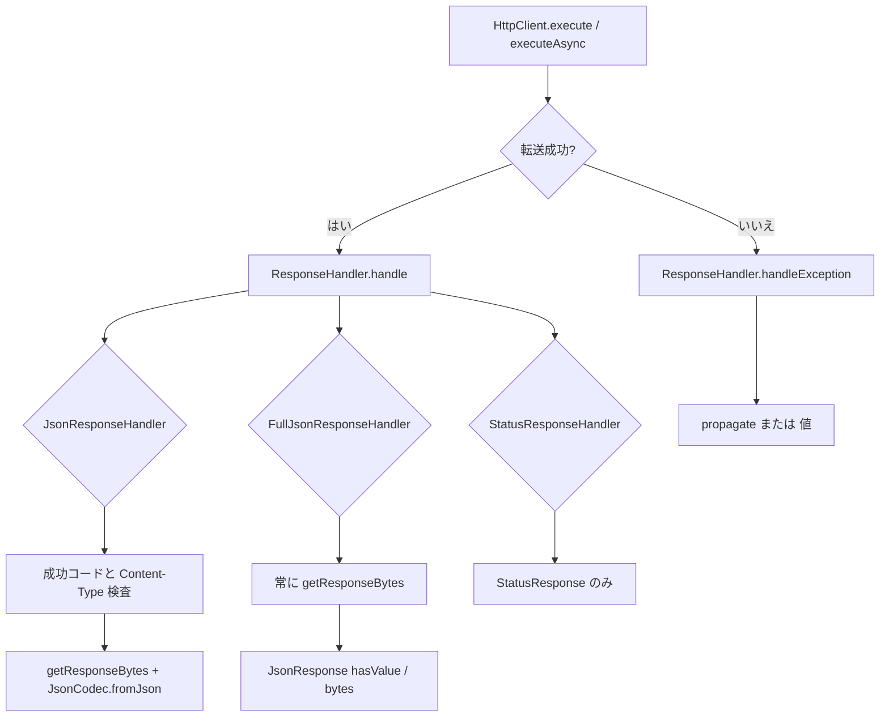

# 第13章 ResponseHandler

> **本章で読むソース**
>
> - [http-client/src/main/java/io/airlift/http/client/HttpClient.java](https://github.com/airlift/airlift/blob/439/http-client/src/main/java/io/airlift/http/client/HttpClient.java)
> - [http-client/src/main/java/io/airlift/http/client/ResponseHandler.java](https://github.com/airlift/airlift/blob/439/http-client/src/main/java/io/airlift/http/client/ResponseHandler.java)
> - [http-client/src/main/java/io/airlift/http/client/ResponseHandlerUtils.java](https://github.com/airlift/airlift/blob/439/http-client/src/main/java/io/airlift/http/client/ResponseHandlerUtils.java)
> - [http-client/src/main/java/io/airlift/http/client/JsonResponseHandler.java](https://github.com/airlift/airlift/blob/439/http-client/src/main/java/io/airlift/http/client/JsonResponseHandler.java)
> - [http-client/src/main/java/io/airlift/http/client/FullJsonResponseHandler.java](https://github.com/airlift/airlift/blob/439/http-client/src/main/java/io/airlift/http/client/FullJsonResponseHandler.java)
> - [http-client/src/main/java/io/airlift/http/client/StatusResponseHandler.java](https://github.com/airlift/airlift/blob/439/http-client/src/main/java/io/airlift/http/client/StatusResponseHandler.java)

## この章の狙い

第12章の `Response` は、ステータスと本文を読む契約である。
利用者はバイト列そのものではなく、型付きの結果やステータスだけを欲しいことが多い。
その変換と例外の扱いを担うのが **ResponseHandler** である。
本章ではインタフェース、共有ユーティリティ、そして JSON／ステータス向けの代表実装を追う。

## 前提

第7章の `JsonCodec`、第12章の `Response` と `Content` を読んだものとする。
ハンドラを誰がいつ呼ぶかは、第15章の `JettyHttpClient.execute` / `executeAsync` で扱う。

## HttpClient が渡す二つの口

`HttpClient` は同期と非同期の双方で、同じ `ResponseHandler` を受け取る。

[http-client/src/main/java/io/airlift/http/client/HttpClient.java L22-L45](https://github.com/airlift/airlift/blob/439/http-client/src/main/java/io/airlift/http/client/HttpClient.java#L22-L45)

```java
public interface HttpClient
        extends Closeable
{
    <T, E extends Exception> T execute(Request request, ResponseHandler<T, E> responseHandler)
            throws E;

    <T, E extends Exception> HttpResponseFuture<T> executeAsync(Request request, ResponseHandler<T, E> responseHandler);

    /**
     * Executes the given request and returns a response stream.
     * <p>
     * <b>Note:</b> {@link Request#getMaxResponseContentLength} is ignored.
     */
    StreamingResponse executeStreaming(Request request);

    RequestStats getStats();

    @Override
    void close();

    boolean isClosed();

    interface HttpResponseFuture<T>
            extends ListenableFuture<T>
```

成功時は `handle`、転送失敗などでハンドラへ委ねるときは `handleException` が呼ばれる。
結果の型 `T` と、ハンドラが宣言する例外型 `E` は、呼び出し側の文脈に合わせて選ぶ。

## ResponseHandler 契約

インタフェース自体は短い。

[http-client/src/main/java/io/airlift/http/client/ResponseHandler.java L18-L25](https://github.com/airlift/airlift/blob/439/http-client/src/main/java/io/airlift/http/client/ResponseHandler.java#L18-L25)

```java
public interface ResponseHandler<T, E extends Exception>
{
    T handleException(Request request, Exception exception)
            throws E;

    T handle(Request request, Response response)
            throws E;
}
```

`handleException` が例外を投げ直すか、代わりの `T` を返すかは実装次第である。
非同期経路では、例外から値へ畳んだ結果を Future に詰める余地が残る（第15章）。

## ResponseHandlerUtils：バッファリングと例外の共通化

実装が繰り返す作業はユーティリティに寄せる。

[http-client/src/main/java/io/airlift/http/client/ResponseHandlerUtils.java L19-L51](https://github.com/airlift/airlift/blob/439/http-client/src/main/java/io/airlift/http/client/ResponseHandlerUtils.java#L19-L51)

```java
    public static RuntimeException propagate(Request request, Throwable exception)
    {
        if (exception instanceof ConnectException) {
            throw new UncheckedIOException("Server refused connection: " + urlFor(request), (ConnectException) exception);
        }
        if (exception instanceof IOException) {
            throw new UncheckedIOException("Failed communicating with server: " + urlFor(request), (IOException) exception);
        }
        throwIfUnchecked(exception);
        throw new RuntimeException(exception);
    }

    public static byte[] getResponseBytes(Request request, Response response)
    {
        try {
            return switch (response.getContent()) {
                case Response.BytesContent(byte[] bytes) -> bytes;
                case Response.InputStreamContent(InputStream inputStream) -> inputStream.readAllBytes();
            };
        }
        catch (IOException e) {
            throw new UncheckedIOException("Failed reading response from server: " + urlFor(request), e);
        }
    }

    public static boolean isJsonUtf8Content(Response response)
    {
        return response.getHeader(CONTENT_TYPE)
                .map(MediaType::parse)
                // Empty charset is considered UTF-8
                .map(type -> type.type().equals("application") && type.subtype().equals("json") && type.charset().toJavaUtil().map(UTF_8::equals).orElse(true))
                .orElse(false);
    }
```

`getResponseBytes` は `BytesContent` なら配列を返し、ストリームなら `readAllBytes` で全体を読む。
JSON ハンドラは、この全体バイト列の上で `JsonCodec` を動かす。
`isJsonUtf8Content` は `application/json` かつ charset が空（UTF-8 とみなす）か UTF-8 であるかを見る。
`propagate` は接続拒否と IO を `UncheckedIOException` に畳み、URI をメッセージへ載せる。

## JsonResponseHandler：成功コードだけ JSON 化する

`JsonResponseHandler` は成功ステータス集合以外を拒否し、JSON 本文だけを返す。

[http-client/src/main/java/io/airlift/http/client/JsonResponseHandler.java L31-L90](https://github.com/airlift/airlift/blob/439/http-client/src/main/java/io/airlift/http/client/JsonResponseHandler.java#L31-L90)

```java
public class JsonResponseHandler<T>
        implements ResponseHandler<T, RuntimeException>
{
    public static <T> JsonResponseHandler<T> createJsonResponseHandler(JsonCodec<T> jsonCodec)
    {
        return new JsonResponseHandler<>(jsonCodec);
    }

    public static <T> JsonResponseHandler<T> createJsonResponseHandler(JsonCodec<T> jsonCodec, int firstSuccessfulResponseCode, int... otherSuccessfulResponseCodes)
    {
        return new JsonResponseHandler<>(jsonCodec, firstSuccessfulResponseCode, otherSuccessfulResponseCodes);
    }

    private final JsonCodec<T> jsonCodec;
    private final Set<Integer> successfulResponseCodes;

    private JsonResponseHandler(JsonCodec<T> jsonCodec)
    {
        this(jsonCodec, 200, 201, 202, 203, 204, 205, 206);
    }

    private JsonResponseHandler(JsonCodec<T> jsonCodec, int firstSuccessfulResponseCode, int... otherSuccessfulResponseCodes)
    {
        this.jsonCodec = jsonCodec;
        this.successfulResponseCodes = ImmutableSet.<Integer>builder().add(firstSuccessfulResponseCode).addAll(Ints.asList(otherSuccessfulResponseCodes)).build();
    }

    @Override
    public T handleException(Request request, Exception exception)
    {
        throw propagate(request, exception);
    }

    @Override
    public T handle(Request request, Response response)
    {
        if (!successfulResponseCodes.contains(response.getStatusCode())) {
            throw new UnexpectedResponseException(
                    "Expected response code to be %s, but was %d".formatted(successfulResponseCodes, response.getStatusCode()),
                    request,
                    response);
        }

        if (!isJsonUtf8Content(response)) {
            throw new UnexpectedResponseException("Expected %s response from server but got %s".formatted(JSON_UTF_8, response.getHeader(CONTENT_TYPE).orElse(null)), request, response);
        }

        // TODO avoid buffering whole response before invoking the JSON codec.
        // When response is an InputStream this requires additional data copy and increases peak memory usage.
        // The data buffering is used only for error reporting, so perhaps it can be applied only on a retry.
        byte[] bytes = getResponseBytes(request, response);

        try {
            return jsonCodec.fromJson(bytes);
        }
        catch (IllegalArgumentException e) {
            String json = new String(bytes, UTF_8);
            throw new IllegalArgumentException("Unable to create %s from JSON response: <%s>".formatted(jsonCodec.getType(), json), e);
        }
    }
}
```

既定の成功集合は 200 から 206 である。
ステータスや Content-Type が合わなければ `UnexpectedResponseException` になる。
デコード失敗時は、`JsonCodec.fromJson` を再試行せず、読んだ `byte[]` を UTF-8 文字列にして `IllegalArgumentException` のメッセージへ載せるだけである。
ソースの TODO も、全体バッファの用途を error reporting と書いている。
TODO コメントが示すとおり、全体バッファはピークメモリを押し上げる。
大きい応答で失敗時の診断テキストを諦めてよいなら、同モジュールの `StreamingJsonResponseHandler` の方が適する（本章はブリーフの三種に集中する）。

## FullJsonResponseHandler：ステータス付きの常時バッファ

`FullJsonResponseHandler` は常に本文を `byte[]` にし、成功ステータスを問わず `JsonResponse<T>` を返す。

[http-client/src/main/java/io/airlift/http/client/FullJsonResponseHandler.java L38-L117](https://github.com/airlift/airlift/blob/439/http-client/src/main/java/io/airlift/http/client/FullJsonResponseHandler.java#L38-L117)

```java
/**
 * FullJsonResponseHandler is a {@link ResponseHandler} that creates a JSON entity from the response bytes when Content-Type
 * is application/json. In contrast to {@link StreamingJsonResponseHandler} it always buffers a whole response, materializing
 * it to a byte[]. This allows for retrieval of the response bytes if decoding JSON fails, but at the same time does
 * data copying which sits in Jetty client buffers. If the response is rather large and debugabillity can be sacrified,
 * {@link StreamingJsonResponseHandler} should be used instead.
 */
public class FullJsonResponseHandler<T>
        implements ResponseHandler<JsonResponse<T>, RuntimeException>
{
    public static <T> FullJsonResponseHandler<T> createFullJsonResponseHandler(JsonCodec<T> jsonCodec)
    {
        return new FullJsonResponseHandler<>(jsonCodec);
    }

    private final JsonCodec<T> jsonCodec;

    private FullJsonResponseHandler(JsonCodec<T> jsonCodec)
    {
        this.jsonCodec = jsonCodec;
    }

    @Override
    public JsonResponse<T> handleException(Request request, Exception exception)
    {
        throw propagate(request, exception);
    }

    @Override
    public JsonResponse<T> handle(Request request, Response response)
    {
        byte[] bytes = getResponseBytes(request, response);
        if (!isJsonUtf8Content(response)) {
            return new JsonResponse<>(response.getStatusCode(), response.getHeaders(), bytes);
        }
        return new JsonResponse<>(response.getStatusCode(), response.getHeaders(), jsonCodec, bytes);
    }

    public static class JsonResponse<T>
    {
        private final int statusCode;
        private final ListMultimap<HeaderName, String> headers;
        private final boolean hasValue;
        private final byte[] jsonBytes;
        private final byte[] responseBytes;
        private final T value;
        private final IllegalArgumentException exception;

        public JsonResponse(int statusCode, ListMultimap<HeaderName, String> headers, byte[] responseBytes)
        {
            this.statusCode = statusCode;
            this.headers = ImmutableListMultimap.copyOf(headers);

            this.hasValue = false;
            this.jsonBytes = null;
            this.responseBytes = requireNonNull(responseBytes, "responseBytes is null");
            this.value = null;
            this.exception = null;
        }

        @SuppressWarnings("ThrowableInstanceNeverThrown")
        public JsonResponse(int statusCode, ListMultimap<HeaderName, String> headers, JsonCodec<T> jsonCodec, byte[] jsonBytes)
        {
            this.statusCode = statusCode;
            this.headers = ImmutableListMultimap.copyOf(headers);

            this.jsonBytes = requireNonNull(jsonBytes, "jsonBytes is null");
            this.responseBytes = requireNonNull(jsonBytes, "responseBytes is null");

            T value = null;
            IllegalArgumentException exception = null;
            try {
                value = jsonCodec.fromJson(jsonBytes);
            }
            catch (IllegalArgumentException e) {
                exception = new IllegalArgumentException("Unable to create %s from JSON response:\n[%s]".formatted(jsonCodec.getType(), getJson()), e);
            }
            this.hasValue = (exception == null);
            this.value = value;
            this.exception = exception;
        }
```

JSON でない Content-Type でもハンドラ例外にはせず、`hasValue == false` の `JsonResponse` になる。
JSON でありながらデコードに失敗した場合も、例外を握って `exception` フィールドに残す。
呼び出し側は `hasValue()` / `getValue()` / `getResponseBytes()` で、エラー応答の本文も含めて扱える。

`getValue` は値が無いときだけ状態例外を投げる。

[http-client/src/main/java/io/airlift/http/client/FullJsonResponseHandler.java L159-L180](https://github.com/airlift/airlift/blob/439/http-client/src/main/java/io/airlift/http/client/FullJsonResponseHandler.java#L159-L180)

```java
        public boolean hasValue()
        {
            return hasValue;
        }

        public T getValue()
        {
            if (!hasValue) {
                throw new IllegalStateException("Response does not contain a JSON value", exception);
            }
            return value;
        }

        public int getResponseSize()
        {
            return responseBytes.length;
        }

        public byte[] getResponseBytes()
        {
            return responseBytes.clone();
        }
```

`getResponseBytes` は clone を返す。
保持配列を呼び出し側が書き換えないための防御である。

## StatusResponseHandler：本文を読まない

ステータスとヘッダだけ欲しいときは、本文を捨てるハンドラがある。

[http-client/src/main/java/io/airlift/http/client/StatusResponseHandler.java L28-L61](https://github.com/airlift/airlift/blob/439/http-client/src/main/java/io/airlift/http/client/StatusResponseHandler.java#L28-L61)

```java
public class StatusResponseHandler
        implements ResponseHandler<StatusResponse, RuntimeException>
{
    private static final StatusResponseHandler statusResponseHandler = new StatusResponseHandler();

    public static StatusResponseHandler createStatusResponseHandler()
    {
        return statusResponseHandler;
    }

    private StatusResponseHandler() {}

    @Override
    public StatusResponse handleException(Request request, Exception exception)
    {
        throw propagate(request, exception);
    }

    @Override
    public StatusResponse handle(Request request, Response response)
    {
        return new StatusResponse(response.getStatusCode(), response.getHeaders());
    }

    public static class StatusResponse
    {
        private final int statusCode;
        private final ListMultimap<HeaderName, String> headers;

        public StatusResponse(int statusCode, ListMultimap<HeaderName, String> headers)
        {
            this.statusCode = statusCode;
            this.headers = ImmutableListMultimap.copyOf(headers);
        }
```

インスタンスは単一である。
`handle` は `getContent` / `getInputStream` に触れない。
同期実行でも応答ストリームを消費しないため、完了処理がストリームを閉じる際に未読バイトが残る可能性がある。
本文が不要な HEAD や、クライアント側で本文を無視してよい呼び出しに向く。

## 処理の流れ



三種の違いは「何を検査するか」と「バイト列をどこまで保持するか」に集約される。

## 高速化と最適化の工夫

`StatusResponseHandler` は本文を読まないため、大きなペイロードをヒープに載せない。
`JsonResponseHandler` と `FullJsonResponseHandler` は失敗時の診断に生 JSON を残すため全体バッファする。
その代償は TODO と Javadoc が明示している。
大きな応答ではストリーミング側ハンドラへ切り替える判断が、ピークメモリを抑える機構レベルの選択になる。

## まとめ

- `ResponseHandler` は成功時の `handle` と失敗時の `handleException` の二口である。
- `ResponseHandlerUtils.getResponseBytes` が `Content` の両形態を `byte[]` へ揃える。
- `JsonResponseHandler` は成功ステータスと JSON UTF-8 を要求し、それ以外は `UnexpectedResponseException` にする。
- `FullJsonResponseHandler` は常にバッファし、`JsonResponse` にステータス、生バイト、任意のデコード結果を載せる。
- `StatusResponseHandler` は本文に触れず、ステータスとヘッダだけを返す。

## 関連する章

- [第7章 JsonCodec と JsonMapper](../part03-json/07-json.md)
- [第12章 Request と Response と URI](12-request-response.md)
- [第14章 HttpClientModule とフィルタ](14-http-client-module.md)
- [第15章 JettyHttpClient](15-jetty-http-client.md)
