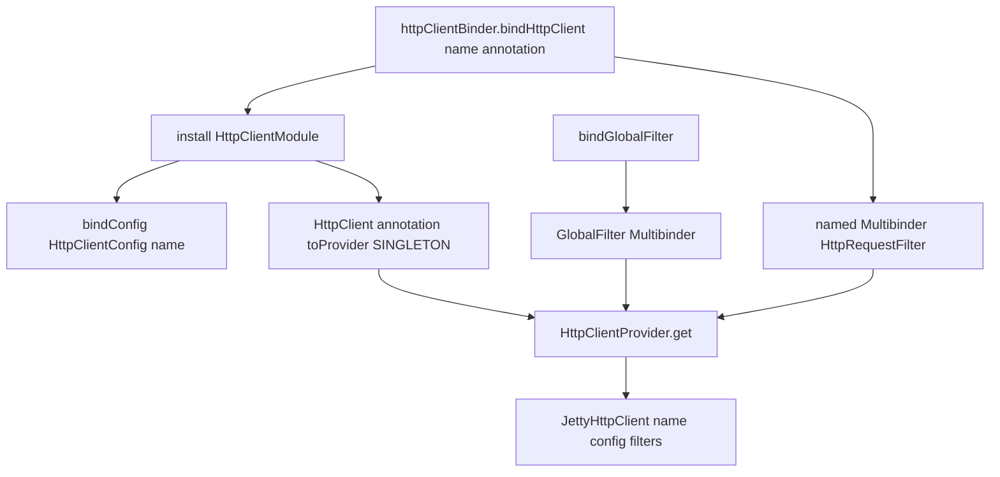

# 第14章 HttpClientModule とフィルタ

> **本章で読むソース**
>
> - [http-client/src/main/java/io/airlift/http/client/HttpClientBinder.java](https://github.com/airlift/airlift/blob/439/http-client/src/main/java/io/airlift/http/client/HttpClientBinder.java)
> - [http-client/src/main/java/io/airlift/http/client/HttpClientModule.java](https://github.com/airlift/airlift/blob/439/http-client/src/main/java/io/airlift/http/client/HttpClientModule.java)
> - [http-client/src/main/java/io/airlift/http/client/HttpClientConfig.java](https://github.com/airlift/airlift/blob/439/http-client/src/main/java/io/airlift/http/client/HttpClientConfig.java)
> - [http-client/src/main/java/io/airlift/http/client/HttpRequestFilter.java](https://github.com/airlift/airlift/blob/439/http-client/src/main/java/io/airlift/http/client/HttpRequestFilter.java)
> - [http-client/src/main/java/io/airlift/http/client/GlobalFilter.java](https://github.com/airlift/airlift/blob/439/http-client/src/main/java/io/airlift/http/client/GlobalFilter.java)

## この章の狙い

第13章のハンドラは「応答をどう読むか」である。
「どのクライアントを Injector から取るか」「フィルタと設定をどう束ねるか」は別経路である。
本章では `HttpClientBinder` が `HttpClientModule` を install し、named の `HttpClient` と global／named の `HttpRequestFilter` を組み立てる流れを追う。

## 前提

第4章の `ConfigBinder`、第6章の設定オブジェクト、Guice の multibinder と binding annotation を知っているものとする。
実際の送信は第15章の `JettyHttpClient` である。

## HttpRequestFilter と GlobalFilter

フィルタは `Request` を受け取り、別の（または同じ）`Request` を返す。

[http-client/src/main/java/io/airlift/http/client/HttpRequestFilter.java L18-L21](https://github.com/airlift/airlift/blob/439/http-client/src/main/java/io/airlift/http/client/HttpRequestFilter.java#L18-L21)

```java
public interface HttpRequestFilter
{
    Request filterRequest(Request request);
}
```

全クライアント共通のフィルタ集合には、パッケージ私有の binding annotation `GlobalFilter` が付く。

[http-client/src/main/java/io/airlift/http/client/GlobalFilter.java L26-L29](https://github.com/airlift/airlift/blob/439/http-client/src/main/java/io/airlift/http/client/GlobalFilter.java#L26-L29)

```java
@Target({FIELD, PARAMETER, METHOD})
@Retention(RUNTIME)
@BindingAnnotation
@interface GlobalFilter {}
```

公開 API ではなく、`HttpClientBinder` / `HttpClientModule` が multibinder の資格子として使う印である。
named クライアント固有のフィルタは、そのクライアントの annotation（利用側が選ぶ `@ForXxx` など）で別 Set になる。

## HttpClientBinder：入口のビルダ

`httpClientBinder(binder)` がグローバル側の multibinder を用意し、`bindHttpClient` が Module を install する。

[http-client/src/main/java/io/airlift/http/client/HttpClientBinder.java L34-L91](https://github.com/airlift/airlift/blob/439/http-client/src/main/java/io/airlift/http/client/HttpClientBinder.java#L34-L91)

```java
public class HttpClientBinder
{
    private final Binder binder;
    private final Multibinder<HttpRequestFilter> globalFilterBinder;
    private final Multibinder<HttpStatusListener> globalStatusListenerBinder;
    private final OptionalBinder<ByteBufferPool> byteBufferPool;

    private HttpClientBinder(Binder binder)
    {
        this.binder = binder.skipSources(getClass());
        this.globalFilterBinder = newSetBinder(binder, HttpRequestFilter.class, GlobalFilter.class);
        this.globalStatusListenerBinder = newSetBinder(binder, HttpStatusListener.class, GlobalFilter.class);
        this.byteBufferPool = newOptionalBinder(binder, ByteBufferPool.class);
    }

    public static HttpClientBinder httpClientBinder(Binder binder)
    {
        return new HttpClientBinder(binder);
    }

    public HttpClientBindingBuilder bindHttpClient(String name, Class<? extends Annotation> annotation)
    {
        HttpClientModule module = new HttpClientModule(name, annotation);
        binder.install(module);
        return new HttpClientBindingBuilder(
                module,
                newSetBinder(binder, Key.get(HttpRequestFilter.class, annotation)),
                newSetBinder(binder, Key.get(HttpStatusListener.class, annotation)),
                newOptionalBinder(binder, Key.get(ByteBufferPool.class, annotation)));
    }

    public LinkedBindingBuilder<HttpRequestFilter> addGlobalFilterBinding()
    {
        return globalFilterBinder.addBinding();
    }

    public LinkedBindingBuilder<HttpStatusListener> addGlobalStatusListenerBinding()
    {
        return globalStatusListenerBinder.addBinding();
    }

    public HttpClientBinder bindGlobalFilter(Class<? extends HttpRequestFilter> filterClass)
    {
        globalFilterBinder.addBinding().to(filterClass).in(Scopes.SINGLETON);
        return this;
    }

    public HttpClientBinder bindByteBufferPool(ByteBufferPool byteBufferPool)
    {
        this.byteBufferPool.setBinding().toInstance(byteBufferPool);
        return this;
    }

    public HttpClientBinder bindGlobalFilter(HttpRequestFilter filter)
    {
        globalFilterBinder.addBinding().toInstance(filter);
        return this;
    }
```

`name` は設定プレフィックスとログファイル名に使われる識別子である。
`annotation` は Injector 上の `HttpClient` Key と、そのクライアント専用フィルタ／ステータスリスナの Key である。

`HttpClientBindingBuilder` は alias、設定既定、named フィルタを足す。

[http-client/src/main/java/io/airlift/http/client/HttpClientBinder.java L108-L160](https://github.com/airlift/airlift/blob/439/http-client/src/main/java/io/airlift/http/client/HttpClientBinder.java#L108-L160)

```java
        public HttpClientBindingBuilder withAlias(Class<? extends Annotation> alias)
        {
            module.addAlias(alias);
            return this;
        }

        public HttpClientBindingBuilder withAliases(Collection<Class<? extends Annotation>> aliases)
        {
            for (Class<? extends Annotation> annotation : aliases) {
                module.addAlias(annotation);
            }
            return this;
        }

        public HttpClientBindingBuilder withConfigDefaults(ConfigDefaults<HttpClientConfig> configDefaults)
        {
            module.withConfigDefaults(configDefaults);
            return this;
        }

        public LinkedBindingBuilder<HttpRequestFilter> addFilterBinding()
        {
            return filterBinder.addBinding();
        }

        public HttpClientBindingBuilder withFilter(Class<? extends HttpRequestFilter> filterClass)
        {
            filterBinder.addBinding().to(filterClass);
            return this;
        }

        public HttpClientBindingBuilder withByteBufferPool(Class<? extends ByteBufferPool> byteBufferPoolClass)
        {
            byteBufferPoolBinder.setBinding().to(byteBufferPoolClass);
            return this;
        }

        public HttpClientBindingBuilder withByteBufferPool(ByteBufferPool byteBufferPool)
        {
            byteBufferPoolBinder.setDefault().toInstance(byteBufferPool);
            return this;
        }

        public LinkedBindingBuilder<HttpStatusListener> addStatusListenerBinding()
        {
            return statusListenerBinder.addBinding();
        }

        public HttpClientBindingBuilder withStatusListener(Class<? extends HttpStatusListener> listenerClass)
        {
            addStatusListenerBinding().to(listenerClass);
            return this;
        }
```

alias は別 annotation の `HttpClient` Key を、本体の Key へ `to` でつなぐだけである。
alias 専用のフィルタ Set や別クライアントは作られず、本体と同じ SINGLETON の `JettyHttpClient` と、構築済みの `requestFilters` を共有する。

## HttpClientModule：設定と SINGLETON Provider

Module は設定を `name` プレフィックスで bind し、`HttpClient` を Provider 経由の SINGLETON にする。

[http-client/src/main/java/io/airlift/http/client/HttpClientModule.java L46-L93](https://github.com/airlift/airlift/blob/439/http-client/src/main/java/io/airlift/http/client/HttpClientModule.java#L46-L93)

```java
public class HttpClientModule
        implements Module
{
    protected final String name;
    protected final Class<? extends Annotation> annotation;
    protected Binder binder;

    HttpClientModule(String name, Class<? extends Annotation> annotation)
    {
        this.name = requireNonNull(name, "name is null");
        this.annotation = requireNonNull(annotation, "annotation is null");
    }

    void withConfigDefaults(ConfigDefaults<HttpClientConfig> configDefaults)
    {
        configBinder(binder).bindConfigDefaults(HttpClientConfig.class, annotation, configDefaults);
    }

    @Override
    public void configure(Binder binder)
    {
        this.binder = requireNonNull(binder, "binder is null");

        // bind the configuration
        configBinder(binder).bindConfig(HttpClientConfig.class, annotation, name);

        // Allow users to bind their own SslContextFactory, pulling a globally-bound
        // SslContextFactory if one is not bound with the specific annotation
        newOptionalBinder(binder, SslContextFactory.Client.class);
        newOptionalBinder(binder, Key.get(SslContextFactory.Client.class, annotation));

        // bind the client
        binder.bind(HttpClient.class).annotatedWith(annotation).toProvider(new HttpClientProvider(name, annotation)).in(Scopes.SINGLETON);

        // kick off the binding for the default filters
        newSetBinder(binder, HttpRequestFilter.class, GlobalFilter.class);

        // kick off the binding for the filter set
        newSetBinder(binder, HttpRequestFilter.class, annotation);

        // export stats
        newExporter(binder).export(HttpClient.class).annotatedWith(annotation).withGeneratedName();
    }

    public void addAlias(Class<? extends Annotation> alias)
    {
        binder.bind(HttpClient.class).annotatedWith(alias).to(Key.get(HttpClient.class, annotation));
    }
```

`bindConfig(..., name)` により、プロパティは `name` をプレフィックスにした入口になる（例: `discovery.http-client.request-timeout`）。
グローバルと annotation 付きの `SslContextFactory.Client` を OptionalBinder で開ける。
グローバル側 multibinder を「kick off」するのは、Binder だけグローバルフィルタを登録した場合でも Set が空集合として存在するよう保証するためである。

Provider は設定、SSL、global＋named フィルタ、OpenTelemetry／Tracer を集め、`JettyHttpClient` を生成する。

[http-client/src/main/java/io/airlift/http/client/HttpClientModule.java L135-L155](https://github.com/airlift/airlift/blob/439/http-client/src/main/java/io/airlift/http/client/HttpClientModule.java#L135-L155)

```java
        @Override
        public HttpClient get()
        {
            HttpClientConfig config = injector.getInstance(Key.get(HttpClientConfig.class, annotation));
            Optional<String> environment = Optional.ofNullable(nodeInfo).map(NodeInfo::getEnvironment);
            Optional<SslContextFactory.Client> sslContextFactoryAnnotated = injector.getInstance(Key.get(new TypeLiteral<>() {}, annotation));
            Optional<SslContextFactory.Client> sslContextFactoryGlobal = injector.getInstance(Key.get(new TypeLiteral<>() {}));
            Optional<SslContextFactory.Client> sslContextFactory = sslContextFactoryAnnotated.or(() -> sslContextFactoryGlobal);

            Set<HttpRequestFilter> filters = ImmutableSet.<HttpRequestFilter>builder()
                    .addAll(injector.getInstance(Key.get(new TypeLiteral<Set<HttpRequestFilter>>() {}, GlobalFilter.class)))
                    .addAll(injector.getInstance(Key.get(new TypeLiteral<Set<HttpRequestFilter>>() {}, annotation)))
                    .build();

            Set<HttpStatusListener> httpStatusListeners = ImmutableSet.<HttpStatusListener>builder()
                    .addAll(injector.getInstance(Key.get(new TypeLiteral<Set<HttpStatusListener>>() {}, GlobalFilter.class)))
                    .addAll(injector.getInstance(Key.get(new TypeLiteral<Set<HttpStatusListener>>() {}, annotation)))
                    .build();

            return new JettyHttpClient(name, config, ImmutableList.copyOf(filters), openTelemetry, tracer, environment, sslContextFactory, httpStatusListeners);
        }
```

フィルタの合成順は、まず `GlobalFilter` の Set、次に named annotation の Set である。
`ImmutableSet` は挿入順を保つため、同一 Set 内の登録順も保たれる。
SSL は annotation 付きがあればそれを優先し、無ければグローバルを使う。
`NodeInfo`／`OpenTelemetry`／`Tracer` は optional 注入であり、未設定なら環境なしと noop テレメトリになる。

`bindByteBufferPool` と `withByteBufferPool` は OptionalBinder へ binding を載せる。
しかしタグ 439 の `HttpClientProvider.get` はグローバル／annotation 付きの `ByteBufferPool` を Injector から一度も取らない。
`JettyHttpClient` も `createByteBufferPool(maxBufferSize, config)` でプールを自前生成する。
この版では Binder 側のプール API に消費先がなく、死んだ binding 経路である。

## HttpClientConfig：タイムアウトと接続上限の既定

設定クラスはフィールドが多く（815 行級）、本章では Jetty へ渡る代表既定に絞る。

[http-client/src/main/java/io/airlift/http/client/HttpClientConfig.java L70-L129](https://github.com/airlift/airlift/blob/439/http-client/src/main/java/io/airlift/http/client/HttpClientConfig.java#L70-L129)

```java
    private Duration connectTimeout = new Duration(5, SECONDS);
    private Duration requestTimeout = new Duration(5, MINUTES);
    private Duration idleTimeout = new Duration(1, MINUTES);
    private Duration destinationIdleTimeout = new Duration(1, MINUTES);
    private int maxConnectionsPerServer = 20;
    private int maxRequestsQueuedPerDestination = 1024;
    private DataSize maxResponseContentLength = DataSize.of(16, MEGABYTE);
    private DataSize requestBufferSize = DataSize.of(4, KILOBYTE);
    private DataSize responseBufferSize = DataSize.of(16, KILOBYTE);
    private DataSize maxRequestHeaderSize = DataSize.of(8, KILOBYTE);
    private DataSize maxResponseHeaderSize = DataSize.of(16, KILOBYTE);
    private Optional<DataSize> maxHeapMemory = Optional.empty();
    private Optional<DataSize> maxDirectMemory = Optional.empty();
    private HostAndPort socksProxy;
    private HostAndPort httpProxy;
    private boolean secureProxy;
    private String keyStorePath = System.getProperty(JAVAX_NET_SSL_KEY_STORE);
    private String keyStorePassword = System.getProperty(JAVAX_NET_SSL_KEY_STORE_PASSWORD);
    private String trustStorePath = System.getProperty(JAVAX_NET_SSL_TRUST_STORE);
    private String trustStorePassword = System.getProperty(JAVAX_NET_SSL_TRUST_STORE_PASSWORD);
    private String secureRandomAlgorithm;
    private List<String> includedCipherSuites = ImmutableList.of();
    private String automaticHttpsSharedSecret;
    private Optional<Duration> tcpKeepAliveIdleTime = Optional.empty();
    private boolean strictEventOrdering;
    private boolean useVirtualThreads;

    /**
     * This property is initialized with Jetty's default excluded ciphers list.
     *
     * @see org.eclipse.jetty.util.ssl.SslContextFactory#SslContextFactory(boolean)
     */
    private List<String> excludedCipherSuites = ImmutableList.of("^.*_(MD5|SHA|SHA1)$", "^TLS_RSA_.*$", "^SSL_.*$", "^.*_NULL_.*$", "^.*_anon_.*$");

    private int selectorCount = 2;
    private boolean recordRequestComplete = true;
    private boolean connectBlocking;

    private int maxThreads = 200;
    private int minThreads = 8;
    private int timeoutThreads = 1;
    private int timeoutConcurrency = 1;

    private boolean http2Enabled;
    private DataSize http2InitialSessionReceiveWindowSize = DataSize.of(16, MEGABYTE);
    private DataSize http2InitialStreamReceiveWindowSize = DataSize.of(16, MEGABYTE);
    private DataSize http2InputBufferSize = DataSize.of(8, KILOBYTE);

    private String logPath = "var/log/";
    private boolean logEnabled;
    private int logHistory = 15;
    private int logQueueSize = 10_000;
    private DataSize logMaxFileSize = DataSize.of(1, GIGABYTE);
    private DataSize logBufferSize = DataSize.of(1, MEGABYTE);
    private Duration logFlushInterval = new Duration(10, SECONDS);
    private boolean logCompressionEnabled = true;
    private boolean verifyHostname = true;
    private Optional<String> httpProxyUser = Optional.empty();
    private Optional<String> httpProxyPassword = Optional.empty();
    private boolean trackMemoryAllocations;
```

接続タイムアウト 5 秒、要求タイムアウト 5 分、先あたり接続 20、応答上限 16MB、セレクタ 2、ワーカ 8〜200 が既定である。
ログは既定で無効であり、有効化するとパスとキュー／バッファ設定が効く。
キーストア系は JVM のシステムプロパティを初期値に取る。

タイムアウトと接続上限の `@Config` キーは次のとおりである。

[http-client/src/main/java/io/airlift/http/client/HttpClientConfig.java L164-L224](https://github.com/airlift/airlift/blob/439/http-client/src/main/java/io/airlift/http/client/HttpClientConfig.java#L164-L224)

```java
    @Config("http-client.connect-timeout")
    public HttpClientConfig setConnectTimeout(Duration connectTimeout)
    {
        this.connectTimeout = connectTimeout;
        return this;
    }

    @NotNull
    @MinDuration("0ms")
    public Duration getRequestTimeout()
    {
        return requestTimeout;
    }

    @Config("http-client.request-timeout")
    public HttpClientConfig setRequestTimeout(Duration requestTimeout)
    {
        this.requestTimeout = requestTimeout;
        return this;
    }

    @NotNull
    @MinDuration("0ms")
    public Duration getIdleTimeout()
    {
        return idleTimeout;
    }

    @Config("http-client.idle-timeout")
    @LegacyConfig("http-client.read-timeout")
    public HttpClientConfig setIdleTimeout(Duration idleTimeout)
    {
        this.idleTimeout = idleTimeout;
        return this;
    }

    @MinDuration("0ms")
    public Duration getDestinationIdleTimeout()
    {
        return destinationIdleTimeout;
    }

    @Config("http-client.destination-idle-timeout")
    public HttpClientConfig setDestinationIdleTimeout(Duration destinationIdleTimeout)
    {
        this.destinationIdleTimeout = destinationIdleTimeout;
        return this;
    }

    @Min(1)
    public int getMaxConnectionsPerServer()
    {
        return maxConnectionsPerServer;
    }

    @Config("http-client.max-connections-per-server")
    public HttpClientConfig setMaxConnectionsPerServer(int maxConnectionsPerServer)
    {
        this.maxConnectionsPerServer = maxConnectionsPerServer;
        return this;
    }
```

Module が `bindConfig(..., name)` したとき、実キーは `name` プレフィックス付きになる。
第15章のコンストラクタがこれらの値を Jetty `HttpClient` へ写す。

## 処理の流れ



Injector 解決時に一度だけ `JettyHttpClient` が作られ、要求ごとには第15章でフィルタ連鎖が走る。

## 高速化と最適化の工夫

クライアントは SINGLETON である。
接続プール、セレクタ、ワーカスレッド、そして `JettyHttpClient` が内部で作る `ByteBufferPool` を要求ごとに作り直さない。
ただし Binder API の `bindByteBufferPool`／`withByteBufferPool` で注入したプールがここに使われるわけではない。
`maxConnectionsPerServer` とキュー上限で、同一宛先への並行度と待ち行列を抑え、暴走時のメモリと FD 消費を制限する。
フィルタは構築時に `ImmutableList` へ固定されるため、要求経路での Set 解決は無い。

## まとめ

- `HttpClientBinder.bindHttpClient` が `HttpClientModule` を install し、named のフィルタ／ステータスリスナ multibinder を返す。
- `GlobalFilter` は全クライアント共通フィルタの binding annotation である。
- `HttpClientProvider` は global と named のフィルタをこの順で結合し、`JettyHttpClient` を生成する。
- `HttpClientConfig` はタイムアウト、接続上限、バッファ、HTTP/2、ログ、SSL などの既定を持つ。
- alias は別 annotation の Key を本体 `HttpClient` の SINGLETON へ紐づけ、フィルタも含めて同一インスタンスを共有する。
- `bindByteBufferPool`／`withByteBufferPool` は 439 では Injector へ載るだけで、`HttpClientProvider` から消費されない。

## 関連する章

- [第4章 設定の入力とバインド](../part02-config/04-config-binding.md)
- [第12章 Request と Response と URI](12-request-response.md)
- [第13章 ResponseHandler](13-response-handler.md)
- [第15章 JettyHttpClient](15-jetty-http-client.md)
