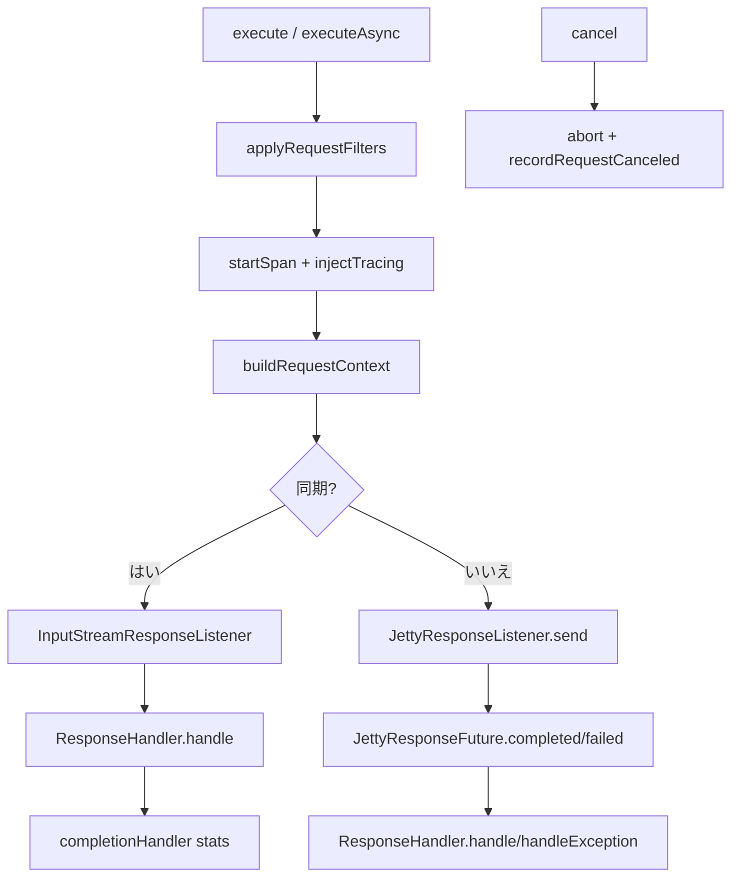

# 第15章 JettyHttpClient

> **本章で読むソース**
>
> - [http-client/src/main/java/io/airlift/http/client/jetty/JettyHttpClient.java](https://github.com/airlift/airlift/blob/439/http-client/src/main/java/io/airlift/http/client/jetty/JettyHttpClient.java)
> - [http-client/src/main/java/io/airlift/http/client/jetty/JettyResponseFuture.java](https://github.com/airlift/airlift/blob/439/http-client/src/main/java/io/airlift/http/client/jetty/JettyResponseFuture.java)
> - [http-client/src/main/java/io/airlift/http/client/jetty/JettyResponseListener.java](https://github.com/airlift/airlift/blob/439/http-client/src/main/java/io/airlift/http/client/jetty/JettyResponseListener.java)
> - [http-client/src/main/java/io/airlift/http/client/jetty/HttpClientLoggingListener.java](https://github.com/airlift/airlift/blob/439/http-client/src/main/java/io/airlift/http/client/jetty/HttpClientLoggingListener.java)
> - [http-client/src/main/java/io/airlift/http/client/RequestStats.java](https://github.com/airlift/airlift/blob/439/http-client/src/main/java/io/airlift/http/client/RequestStats.java)

## この章の狙い

第14章の Module が生成する実行体が `JettyHttpClient` である。
同期 `execute`、非同期 `executeAsync`、フィルタ適用、トレーシング伝播、接続プール設定、統計、ロギング、cancel を、1377 行級の実装から主経路に沿って追う。

## 前提

第12章の `Request` / `Response`、第13章の `ResponseHandler`、第14章のフィルタ合成を読んだものとする。
Jetty の `HttpClient` が送信本体であり、Airlift 側はフィルタ、span、ハンドラ、統計の薄い層である。

## 構築：設定を Jetty へ写す

コンストラクタは `HttpClientConfig` を Jetty の `HttpClient` へ写し、`start` する。
代表箇所はバッファ、接続上限、タイムアウト、クッキー無効化である。

[http-client/src/main/java/io/airlift/http/client/jetty/JettyHttpClient.java L248-L320](https://github.com/airlift/airlift/blob/439/http-client/src/main/java/io/airlift/http/client/jetty/JettyHttpClient.java#L248-L320)

```java
        maxResponseContentLength = config.getMaxResponseContentLength();
        requestTimeout = config.getRequestTimeout();
        idleTimeout = config.getIdleTimeout();
        recordRequestComplete = config.getRecordRequestComplete();

        SslContextFactory.Client sslContextFactory = maybeSslContextFactory.orElseGet(() -> getSslContextFactory(config, environment));

        ClientConnector connector = new ClientConnector()
        {
            @Override
            protected void configure(SelectableChannel selectable)
                    throws IOException
            {
                super.configure(selectable);
                if (config.getTcpKeepAliveIdleTime().isPresent()) {
                    setKeepAlive(selectable, config.getTcpKeepAliveIdleTime().orElseThrow());
                }
            }
        };

        connector.setSelectors(config.getSelectorCount());
        connector.setSslContextFactory(sslContextFactory);

        httpClient = new HttpClient(getClientTransport(connector, config));
        httpClient.setName("http-client-" + name);

        // request and response buffer size
        httpClient.setRequestBufferSize(toIntExact(config.getRequestBufferSize().toBytes()));
        httpClient.setResponseBufferSize(toIntExact(config.getResponseBufferSize().toBytes()));
        httpClient.setMaxRequestHeadersSize(toIntExact(config.getMaxRequestHeaderSize().toBytes()));
        httpClient.setMaxResponseHeadersSize(toIntExact(config.getMaxResponseHeaderSize().toBytes()));

        httpClient.setMaxConnectionsPerDestination(config.getMaxConnectionsPerServer());
        httpClient.setMaxRequestsQueuedPerDestination(config.getMaxRequestsQueuedPerDestination());
        httpClient.setDestinationIdleTimeout(config.getDestinationIdleTimeout().toMillis());

        // disable cookies
        httpClient.setHttpCookieStore(new HttpCookieStore.Empty());

        // remove default user agent
        httpClient.setUserAgentField(null);

        // timeouts
        httpClient.setIdleTimeout(idleTimeout.toMillis());
        httpClient.setConnectTimeout(config.getConnectTimeout().toMillis());
        httpClient.setAddressResolutionTimeout(config.getConnectTimeout().toMillis());

        httpClient.setConnectBlocking(config.isConnectBlocking());

        // ... (中略) ...

        int maxBufferSize = toIntExact(max(max(config.getMaxResponseContentLength().toBytes(), config.getRequestBufferSize().toBytes()), config.getResponseBufferSize().toBytes()));

        ByteBufferPool byteBufferPool = createByteBufferPool(maxBufferSize, config);
        this.sizedByteBufferPool = new ByteBufferPool.Sized(byteBufferPool, false, toIntExact(config.getResponseBufferSize().toBytes()));

        httpClient.setByteBufferPool(byteBufferPool);
        httpClient.setExecutor(createExecutor(name, config.getMinThreads(), config.getMaxThreads(), config.isUseVirtualThreads()));
        httpClient.setScheduler(createScheduler(name, config.getTimeoutConcurrency(), config.getTimeoutThreads()));
        httpClient.setStrictEventOrdering(config.isStrictEventOrdering());
```

宛先あたりの接続上限とキューは、接続プールの背圧である。
クッキーと既定 User-Agent を落とすのは、共有クライアントが意図しない状態を持たないためである。
ロギングが有効なら `DefaultHttpClientLogger` を、無効なら `NoopLogger` を使う。
`httpClient.start()` のあと、`ContentDecoderFactories` を clear して GZIP 自動復号を外す。

## 同期 execute：フィルタ、span、ハンドラ

同期経路はフィルタ適用、span 開始、トレース注入のあと `internalExecute` に入る。

[http-client/src/main/java/io/airlift/http/client/jetty/JettyHttpClient.java L662-L693](https://github.com/airlift/airlift/blob/439/http-client/src/main/java/io/airlift/http/client/jetty/JettyHttpClient.java#L662-L693)

```java
    @Override
    public <T, E extends Exception> T execute(Request request, ResponseHandler<T, E> responseHandler)
            throws E
    {
        request = applyRequestFilters(request);

        Span span = startSpan(request);
        request = injectTracing(request, span);

        try {
            InternalResponse<T> internalResponse = internalExecute(request, OptionalLong.of(getMaxResponseContentLength(request).toBytes()), responseHandler::handleException, span);
            return switch (internalResponse) {
                case InternalExceptionResponse(T exceptionResponse) -> exceptionResponse;
                case InternalStandardResponse(JettyResponse jettyResponse, Runnable completionHandler) -> {
                    try {
                        yield responseHandler.handle(request, jettyResponse);
                    }
                    finally {
                        completionHandler.run();
                    }
                }
            };
        }
        catch (Throwable t) {
            span.setStatus(StatusCode.ERROR, t.getMessage());
            span.recordException(t, Attributes.of(EXCEPTION_ESCAPED, true));
            throw t;
        }
        finally {
            span.end();
        }
    }
```

成功時は `handle` のあと、必ず `completionHandler` がリスナとストリームを閉じ、任意で統計を記録する。
例外経路では `handleException` が値を返すこともあり、その値は `InternalExceptionResponse` 経由でそのまま返る。

`internalExecute` は `InputStreamResponseListener` で送信し、応答開始までブロックする。

[http-client/src/main/java/io/airlift/http/client/jetty/JettyHttpClient.java L798-L862](https://github.com/airlift/airlift/blob/439/http-client/src/main/java/io/airlift/http/client/jetty/JettyHttpClient.java#L798-L862)

```java
    private <T, E extends Exception> InternalResponse<T> internalExecute(Request request, OptionalLong maxResponseContentLength, ExceptionHandler<T, E> exceptionHandler, Span span)
            throws E
    {
        long requestStart = System.nanoTime();

        // create jetty request and response listener
        RequestContext context = buildRequestContext(request);

        InputStreamResponseListener listener = new InputStreamResponseListener();
        // fire the request
        context.request().send(listener);

        // wait for response to begin
        Response response;
        try {
            response = listener.get(httpClient.getIdleTimeout(), MILLISECONDS);
        }
        catch (InterruptedException e) {
            stats.recordRequestFailed();
            requestLogger.log(context.info(), ResponseInfo.failed(Optional.empty(), Optional.of(e)));
            context.request().abort(e);
            IO.close(listener);
            Thread.currentThread().interrupt();
            return new InternalExceptionResponse<>(exceptionHandler.handleException(request, e));
        }
        catch (TimeoutException e) {
            stats.recordRequestFailed();
            requestLogger.log(context.info(), ResponseInfo.failed(Optional.empty(), Optional.of(e)));
            context.request().abort(e);
            IO.close(listener);
            return new InternalExceptionResponse<>(exceptionHandler.handleException(request, e));
        }
        catch (ExecutionException e) {
            stats.recordRequestFailed();
            requestLogger.log(context.info(), ResponseInfo.failed(Optional.empty(), Optional.of(e)));
            IO.close(listener);
            Throwable cause = e.getCause();
            if (cause instanceof Exception) {
                return new InternalExceptionResponse<>(exceptionHandler.handleException(request, (Exception) cause));
            }
            return new InternalExceptionResponse<>(exceptionHandler.handleException(request, new RuntimeException(cause)));
        }

        // record attributes
        span.setAttribute(HttpAttributes.HTTP_RESPONSE_STATUS_CODE, response.getStatus());

        // negotiated http version
        span.setAttribute(NetworkAttributes.NETWORK_PROTOCOL_NAME, "HTTP"); // https://osi-model.com/application-layer/
        span.setAttribute(NetworkAttributes.NETWORK_PROTOCOL_VERSION, getHttpVersion(response.getVersion()));

        if (request.getBodyGenerator() != null) {
            span.setAttribute(HttpIncubatingAttributes.HTTP_REQUEST_BODY_SIZE, context.sizeListener().getBytes());
        }

        // process response
        long responseStart = System.nanoTime();

        try {
            InputStream inputStream = listener.getInputStream();
            if (maxResponseContentLength.isPresent()) {
                inputStream = new ThrowingLimitingInputStream(inputStream, maxResponseContentLength.orElseThrow());
            }
            JettyResponse jettyResponse = new JettyResponse(response, inputStream);
            Runnable completionHandler = buildCompletionHandler(request, listener, span, jettyResponse, context.sizeListener(), requestStart, responseStart);
            return new InternalStandardResponse<>(jettyResponse, completionHandler);
        }
        catch (Throwable e) {
            Runnable completionHandler = buildCompletionHandler(request, listener, span, null, context.sizeListener(), requestStart, responseStart);
            try {
                throw propagate(request, e);
            }
            finally {
                completionHandler.run();
            }
        }
    }
```

同期では応答ボディをバッファせず、ストリーミングの `JettyResponse` をハンドラへ渡す。
上限があれば `ThrowingLimitingInputStream` で超過を例外にする。
`executeStreaming` は上限オプションを空にし、`close` で span 終了と完了ハンドラを動かす（本章では上記 execute を主経路とする）。

## 非同期：JettyResponseFuture と Listener

非同期は `JettyResponseListener` が応答全体を取り込み、将来に結果を載せる。

[http-client/src/main/java/io/airlift/http/client/jetty/JettyHttpClient.java L906-L944](https://github.com/airlift/airlift/blob/439/http-client/src/main/java/io/airlift/http/client/jetty/JettyHttpClient.java#L906-L944)

```java
    @Override
    public <T, E extends Exception> HttpResponseFuture<T> executeAsync(Request request, ResponseHandler<T, E> responseHandler)
    {
        requireNonNull(request, "request is null");
        requireNonNull(responseHandler, "responseHandler is null");

        try {
            request = applyRequestFilters(request);
        }
        catch (RuntimeException e) {
            startSpan(request)
                    .setStatus(StatusCode.ERROR, e.getMessage())
                    .recordException(e, Attributes.of(EXCEPTION_ESCAPED, true))
                    .end();
            return new FailedHttpResponseFuture<>(e);
        }

        Span span = startSpan(request);
        request = injectTracing(request, span);

        RequestContext jettyRequest = buildRequestContext(request);

        DataSize maxResponseContentLength = getMaxResponseContentLength(request);
        JettyResponseFuture<T, E> future = new JettyResponseFuture<>(request, jettyRequest.request(), jettyRequest.sizeListener()::getBytes, responseHandler, span, stats, recordRequestComplete);
        JettyResponseListener<T, E> listener = new JettyResponseListener<>(sizedByteBufferPool, jettyRequest.request(), future, Ints.saturatedCast(maxResponseContentLength.toBytes()));

        try {
            return listener.send();
        }
        catch (RuntimeException e) {
            if (!(e instanceof RejectedExecutionException)) {
                e = new RejectedExecutionException(e);
            }
            // normally this is a rejected execution exception because the client has been closed
            requestLogger.log(jettyRequest.info(), ResponseInfo.failed(Optional.empty(), Optional.of(e)));
            future.failed(e);
            return future;
        }
    }
```

フィルタが失敗すれば、送信せず `FailedHttpResponseFuture` を返す。
Listener は `AbstractResponseListener` で最大長までバッファし、完了時に Future を完了させる。

[http-client/src/main/java/io/airlift/http/client/jetty/JettyResponseListener.java L18-L110](https://github.com/airlift/airlift/blob/439/http-client/src/main/java/io/airlift/http/client/jetty/JettyResponseListener.java#L18-L110)

```java
class JettyResponseListener<T, E extends Exception>
        extends AbstractResponseListener
{
    private static final Logger log = Logger.get(JettyResponseListener.class);

    private final Request request;
    private final JettyResponseFuture<T, E> future;

    public JettyResponseListener(ByteBufferPool.Sized bufferPool, Request request, JettyResponseFuture<T, E> future, int maxLength)
    {
        super(new RetainableByteBuffer.DynamicCapacity(requireNonNull(bufferPool, "bufferPool is null"), maxLength, 0));
        this.future = requireNonNull(future, "future is null");
        this.request = requireNonNull(request, "request is null");
    }

    public JettyResponseFuture<T, E> send()
    {
        request.send(this);
        return future;
    }

    @Override
    public void onComplete(Result result)
    {
        // Request-side-only failures surface differently on HTTP/1.1 vs stream-based protocols.
        Response response = result.getResponse();
        if (response != null && isStreamBased(response.getVersion())) {
            completeStreamBased(result, response);
        }
        else {
            completeHttp1(result, response);
        }
    }

    private static boolean isStreamBased(HttpVersion version)
    {
        return switch (version) {
            case null -> false;
            case HTTP_2, HTTP_3 -> true;
            case HTTP_0_9, HTTP_1_0, HTTP_1_1 -> false;
        };
    }

    private void completeHttp1(Result result, Response response)
    {
        Throwable responseFailure = result.getResponseFailure();
        if (responseFailure != null) {
            future.failed(responseFailure);
            return;
        }
        if (response == null) {
            Throwable requestFailure = result.getRequestFailure();
            if (requestFailure == null) {
                // Settle the future so the caller is not left blocking on a violated invariant.
                future.failed(new IllegalStateException("Result has neither response nor failure: " + result));
                return;
            }
            future.failed(requestFailure);
            return;
        }
        Throwable requestFailure = result.getRequestFailure();
        if (requestFailure != null) {
            log.debug(requestFailure, "Suppressing request failure for fully-received response from %s", request.getURI());
        }
        deliver(response);
    }

    private void completeStreamBased(Result result, Response response)
    {
        Throwable responseFailure = result.getResponseFailure();
        if (responseFailure == null) {
            deliver(response);
            return;
        }
        // Transport-layer failure after headers were committed (e.g. a server stream reset
        // following an early response). Locally-initiated aborts propagate as RuntimeException.
        if (response.getStatus() > 0 && responseFailure instanceof IOException) {
            log.debug(responseFailure, "Suppressing transport failure after headers were received from %s", request.getURI());
            deliver(response);
            return;
        }
        future.failed(responseFailure);
    }

    private void deliver(Response response)
    {
        try (InputStream stream = takeContentAsInputStream()) {
            future.completed(response, stream);
        }
        catch (IOException e) {
            future.failed(new UncheckedIOException("Failed communicating with server: " + request.getURI().toASCIIString(), e));
        }
    }
}
```

HTTP/1.1 と HTTP/2 または HTTP/3 では、要求側失敗と応答側失敗の優先が違う。
ヘッダ受信後の輸送エラーを HTTP/2 または HTTP/3 で抑圧する分岐は、既に受け取った早期応答を捨てないためのものである。

Future の cancel は Jetty 要求を abort し、統計の canceled を上げて span を終える。

[http-client/src/main/java/io/airlift/http/client/jetty/JettyResponseFuture.java L73-L121](https://github.com/airlift/airlift/blob/439/http-client/src/main/java/io/airlift/http/client/jetty/JettyResponseFuture.java#L73-L121)

```java
    @Override
    public boolean cancel(boolean mayInterruptIfRunning)
    {
        try {
            span.setStatus(StatusCode.ERROR, "cancelled");
            stats.recordRequestCanceled();
            state.set(JettyAsyncHttpState.CANCELED);
            jettyRequest.abort(RequestCancelledException.INSTANCE);
            return super.cancel(mayInterruptIfRunning);
        }
        catch (Throwable e) {
            setException(e);
            return true;
        }
        finally {
            span.end();
        }
    }

    void completed(Response response, InputStream content)
    {
        if (state.get() == JettyAsyncHttpState.CANCELED) {
            return;
        }

        span.setAttribute(HttpAttributes.HTTP_RESPONSE_STATUS_CODE, response.getStatus());
        // negotiated http version
        span.setAttribute(NetworkAttributes.NETWORK_PROTOCOL_NAME, "HTTP"); // https://osi-model.com/application-layer/
        span.setAttribute(NetworkAttributes.NETWORK_PROTOCOL_VERSION, getHttpVersion(response.getVersion()));

        if (request.getBodyGenerator() != null) {
            span.setAttribute(HttpIncubatingAttributes.HTTP_REQUEST_SIZE, requestSize.getAsLong());
        }

        T value;
        try {
            value = processResponse(response, content);
        }
        catch (Throwable e) {
            // this will be an instance of E from the response handler or an Error
            storeException(e);
            return;
        }
        state.set(JettyAsyncHttpState.DONE);
        set(value);

        span.setStatus(StatusCode.OK);
        span.end();
    }
```

`failed` では `handleException` が値を返せば Future を成功扱いにできる。
投げ直せばその例外が Future に載る。

失敗を `storeException` へ落とす経路は、span に ERROR と例外を記録するが `span.end()` は呼ばない。

[http-client/src/main/java/io/airlift/http/client/jetty/JettyResponseFuture.java L148-L192](https://github.com/airlift/airlift/blob/439/http-client/src/main/java/io/airlift/http/client/jetty/JettyResponseFuture.java#L148-L192)

```java
    void failed(Throwable throwable)
    {
        if (state.get() == JettyAsyncHttpState.CANCELED) {
            return;
        }

        stats.recordRequestFailed();

        // give handler a chance to rewrite the exception or return a value instead
        if (throwable instanceof Exception) {
            try {
                T value = responseHandler.handleException(request, (Exception) throwable);
                // handler returned a value, store it in the future
                state.set(JettyAsyncHttpState.DONE);
                set(value);
                return;
            }
            catch (Throwable newThrowable) {
                throwable = newThrowable;
            }
        }

        // at this point "throwable" will either be an instance of E
        // from the response handler or not an instance of Exception
        storeException(throwable);
    }

    private void storeException(Throwable throwable)
    {
        if (throwable instanceof CancellationException) {
            state.set(JettyAsyncHttpState.CANCELED);
        }
        else {
            state.set(JettyAsyncHttpState.FAILED);
        }

        if (throwable == null) {
            throwable = new Throwable("Throwable is null");
        }

        setException(throwable);

        span.setStatus(StatusCode.ERROR, throwable.getMessage());
        span.recordException(throwable, Attributes.of(EXCEPTION_ESCAPED, true));
    }
```

タグ 439 で同クラスが `span.end()` を呼ぶのは `cancel` と `completed`（ハンドラ成功）だけである。
`processResponse` が投げて `storeException` に入った場合も、ここと同様に `end` は無い。

## フィルタとトレーシング伝播

[http-client/src/main/java/io/airlift/http/client/jetty/JettyHttpClient.java L946-L979](https://github.com/airlift/airlift/blob/439/http-client/src/main/java/io/airlift/http/client/jetty/JettyHttpClient.java#L946-L979)

```java
    private Request applyRequestFilters(Request request)
    {
        for (HttpRequestFilter requestFilter : requestFilters) {
            request = requestFilter.filterRequest(request);
        }
        return request;
    }

    private Span startSpan(Request request)
    {
        int port = normalizePort(request.getUri().getScheme(), request.getUri().getPort());
        return request.getSpanBuilder()
                .orElseGet(() -> tracer.spanBuilder(name + " " + request.getMethod()))
                .setSpanKind(SpanKind.CLIENT)
                .setAttribute(CLIENT_NAME, name)
                .setAttribute(UrlAttributes.URL_FULL, request.getUri().toString())
                .setAttribute(HttpAttributes.HTTP_REQUEST_METHOD, request.getMethod())
                .setAttribute(ServerAttributes.SERVER_ADDRESS, request.getUri().getHost())
                .setAttribute(ServerAttributes.SERVER_PORT, (long) port)
                .startSpan();
    }

    @SuppressWarnings("DataFlowIssue")
    private Request injectTracing(Request request, Span span)
    {
        // a propagator that injects no headers (e.g. noop telemetry) does not need the request rebuilt
        if (propagator.fields().isEmpty()) {
            return request;
        }
        Context context = Context.current().with(span);
        Request.Builder builder = Request.Builder.fromRequest(request);
        propagator.inject(context, builder, (carrier, headerName, value) -> carrier.addHeader(HeaderName.of(headerName), value));
        return builder.build();
    }
```

フィルタは登録順に `Request` を積み替える。
span は `Request` が持つ `SpanBuilder` があればそれを使い、無ければクライアント名と method で作る。
伝播ヘッダが無い（noop）ときは `Request` を作り直さない。

`buildRequestContext` はボディ分岐、タイムアウト、統計リスナ、診断、ステータスリスナ、任意ログを Jetty 要求へ載せる（第12章で見た BodyGenerator switch を含む）。

## 要求ログ：HttpClientLoggingListener

設定でログが有効なとき、`buildRequestContext` は `HttpClientLoggingListener` を request／response の双方に登録する。

[http-client/src/main/java/io/airlift/http/client/jetty/JettyHttpClient.java L1023-L1028](https://github.com/airlift/airlift/blob/439/http-client/src/main/java/io/airlift/http/client/jetty/JettyHttpClient.java#L1023-L1028)

```java
        // Add log listener
        if (logEnabled) {
            HttpClientLoggingListener httpClientLoggingListener = new HttpClientLoggingListener(jettyRequest, requestTime, requestLogger);
            jettyRequest.onRequestListener(httpClientLoggingListener);
            jettyRequest.onResponseListener(httpClientLoggingListener);
        }
```

Listener は begin／content／success／failure と response の begin／complete で時刻とサイズを集め、`onComplete` で `RequestInfo`／`ResponseInfo` を組み立てて `logger.log` する。

[http-client/src/main/java/io/airlift/http/client/jetty/HttpClientLoggingListener.java L48-L97](https://github.com/airlift/airlift/blob/439/http-client/src/main/java/io/airlift/http/client/jetty/HttpClientLoggingListener.java#L48-L97)

```java
    @Override
    public void onBegin(Request request)
    {
        requestBeginTimestamp = System.nanoTime();
    }

    @Override
    public void onContent(Request request, ByteBuffer content)
    {
        contentSize += content.remaining();
    }

    @Override
    public void onFailure(Request request, Throwable failure)
    {
        requestEndTimestamp = System.nanoTime();
    }

    @Override
    public void onSuccess(Request request)
    {
        requestEndTimestamp = System.nanoTime();
    }

    @Override
    public void onBegin(Response response)
    {
        responseBeginTimestamp = System.nanoTime();
    }

    @Override
    public void onComplete(Result result)
    {
        responseCompleteTimestamp = System.nanoTime();
        logRequestResponse(result);
    }

    private void logRequestResponse(Result result)
    {
        RequestInfo requestInfo = RequestInfo.from(request, requestTimestampMillis, requestCreatedTimestamp, requestBeginTimestamp, requestEndTimestamp);
        Throwable throwable = result.getFailure();
        ResponseInfo responseInfo;
        if (throwable != null) {
            responseInfo = ResponseInfo.failed(Optional.of(result.getResponse()), Optional.of(throwable), responseBeginTimestamp, responseCompleteTimestamp);
        }
        else {
            responseInfo = ResponseInfo.from(Optional.of(result.getResponse()), contentSize, responseBeginTimestamp, responseCompleteTimestamp);
        }
        logger.log(requestInfo, responseInfo);
    }
```

送信開始前後の例外は、Listener の `onComplete` に乗らないものがある。
同期の `internalExecute` は Interrupted／Timeout／Execution で `requestLogger.log(..., ResponseInfo.failed(...))` を直接呼ぶ。
非同期の `executeAsync` も、`listener.send()` が `RejectedExecutionException` 相当で落ちたときに同じ直書きをする。
通常の成功／失敗は Listener、接続前やクローズ後の拒否は `requestLogger` 直呼び、という二経路である。

## RequestStats と完了記録

応答が一度得られたあとの完了統計は、`recordRequestComplete`（設定フラグが true のとき）が `RequestStats.recordResponseReceived` へ渡す。
同期では `ResponseHandler.handle` が投げても `finally` の completionHandler が走り、非同期でも `processResponse` の `finally` が同じメソッドを呼ぶ。
`response` が非 null なら、ハンドラの成否に関係なくステータスファミリとサイズが積まれる。

[http-client/src/main/java/io/airlift/http/client/jetty/JettyHttpClient.java L1309-L1325](https://github.com/airlift/airlift/blob/439/http-client/src/main/java/io/airlift/http/client/jetty/JettyHttpClient.java#L1309-L1325)

```java
    static void recordRequestComplete(RequestStats requestStats, Request request, long requestBytes, long requestStart, JettyResponse response, long responseStart)
    {
        if (response == null) {
            return;
        }

        Duration responseProcessingTime = Duration.nanosSince(responseStart);
        Duration requestProcessingTime = new Duration(responseStart - requestStart, NANOSECONDS);

        requestStats.recordResponseReceived(
                request.getMethod(),
                response.getStatusCode(),
                requestBytes,
                response.getBytesRead(),
                requestProcessingTime,
                responseProcessingTime);
    }
```

[http-client/src/main/java/io/airlift/http/client/RequestStats.java L48-L79](https://github.com/airlift/airlift/blob/439/http-client/src/main/java/io/airlift/http/client/RequestStats.java#L48-L79)

```java
    public void recordResponseReceived(
            String method,
            int responseCode,
            long requestSizeInBytes,
            long responseSizeInBytes,
            Duration requestProcessingTime,
            Duration responseProcessingTime)
    {
        requestTime.add(requestProcessingTime);
        responseTime.add(responseProcessingTime);
        readBytes.add(responseSizeInBytes);
        writtenBytes.add(requestSizeInBytes);

        allResponse.update(1);
        switch (familyForStatusCode(responseCode)) {
            case INFORMATIONAL -> informationalResponse.update(1);
            case SUCCESSFUL -> successfulResponse.update(1);
            case REDIRECTION -> redirectionResponse.update(1);
            case CLIENT_ERROR -> clientErrorResponse.update(1);
            case SERVER_ERROR -> serverErrorResponse.update(1);
        }
    }

    public void recordRequestFailed()
    {
        requestFailed.update(1);
    }

    public void recordRequestCanceled()
    {
        requestCanceled.update(1);
    }
```

ステータスファミリ別カウンタとバイト分布、要求／応答処理時間を JMX 公開向けに積む。
`recordRequestComplete` が false なら、この応答完了統計（`recordResponseReceived`）だけを省略する。
`recordRequestFailed` と `recordRequestCanceled` は別経路であり、フラグに関係なく更新される。

停止順はクライアント本体、executor、scheduler、logger である。

[http-client/src/main/java/io/airlift/http/client/jetty/JettyHttpClient.java L1264-L1274](https://github.com/airlift/airlift/blob/439/http-client/src/main/java/io/airlift/http/client/jetty/JettyHttpClient.java#L1264-L1274)

```java
    @PreDestroy
    @Override
    public void close()
    {
        // client must be destroyed before the pools or
        // you will create a several second busy wait loop
        closeQuietly(httpClient);
        closeQuietly((LifeCycle) httpClient.getExecutor());
        closeQuietly(httpClient.getScheduler());
        requestLogger.close();
    }
```

プールや executor を先に止めると、クライアント停止が忙待機になる、というコメント上の制約である。

## 処理の流れ



## 高速化と最適化の工夫

`injectTracing` は propagator のフィールドが空なら `Request` を再構築しない。
noop トレーシング時にヘッダコピーのコストを払わない。
宛先あたりの接続上限とキュー上限は、接続プール上の並行度を抑え、スパイク時の FD とメモリを制限する。
同期経路は応答をストリームのままハンドラへ渡し、非同期経路だけ Listener が上限までバッファする。
用途に応じてどちらを選ぶかがピークメモリを左右する。

## まとめ

- `JettyHttpClient` は設定を Jetty `HttpClient` へ写し、接続プール、executor、ログを持つ SINGLETON 実行体である。
- 同期 `execute` はストリーム応答のうえ `ResponseHandler.handle` し、完了ハンドラで close と応答完了統計を行う。
- 非同期は `JettyResponseListener` がバッファし、`JettyResponseFuture` が完了／失敗／cancel を扱う。
- 失敗経路の `storeException` は span に ERROR を載せるが、`span.end()` は `cancel` と成功時 `completed` に限る。
- 要求ログは `logEnabled` 時の `HttpClientLoggingListener` が主経路で、送信前後の拒否は `requestLogger` 直書きである。
- フィルタは登録順に適用し、OTel propagator でトレースヘッダを注入する。
- `recordRequestComplete=false` が省略するのは応答完了統計だけであり、failed／canceled は別経路である。

## 関連する章

- [第12章 Request と Response と URI](12-request-response.md)
- [第13章 ResponseHandler](13-response-handler.md)
- [第14章 HttpClientModule とフィルタ](14-http-client-module.md)
- [第21章 トレーシングと OpenTelemetry](../part08-observability/21-tracing.md)
