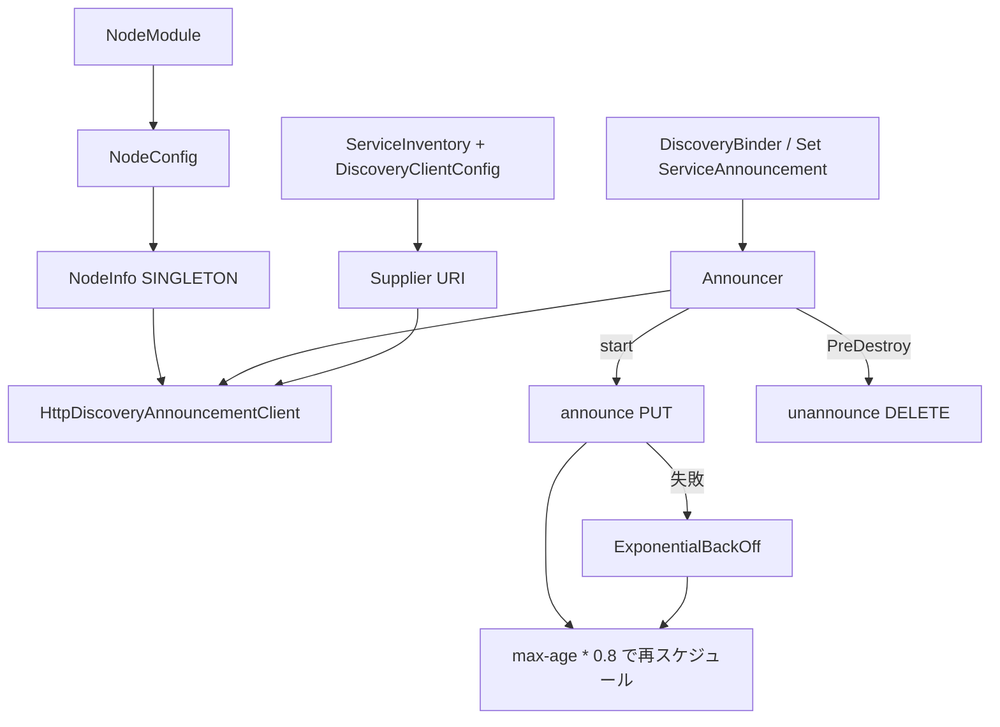

# 第16章 ノード識別とサービスアナウンス

> **本章で読むソース**
>
> - [node/src/main/java/io/airlift/node/NodeModule.java](https://github.com/airlift/airlift/blob/439/node/src/main/java/io/airlift/node/NodeModule.java)
> - [node/src/main/java/io/airlift/node/NodeConfig.java](https://github.com/airlift/airlift/blob/439/node/src/main/java/io/airlift/node/NodeConfig.java)
> - [node/src/main/java/io/airlift/node/NodeInfo.java](https://github.com/airlift/airlift/blob/439/node/src/main/java/io/airlift/node/NodeInfo.java)
> - [discovery/src/main/java/io/airlift/discovery/client/DiscoveryModule.java](https://github.com/airlift/airlift/blob/439/discovery/src/main/java/io/airlift/discovery/client/DiscoveryModule.java)
> - [discovery/src/main/java/io/airlift/discovery/client/Announcer.java](https://github.com/airlift/airlift/blob/439/discovery/src/main/java/io/airlift/discovery/client/Announcer.java)
> - [discovery/src/main/java/io/airlift/discovery/client/HttpDiscoveryAnnouncementClient.java](https://github.com/airlift/airlift/blob/439/discovery/src/main/java/io/airlift/discovery/client/HttpDiscoveryAnnouncementClient.java)

## この章の狙い

クラスタ内で自ノードを一意に示し、公開サービスを discovery へ載せる経路が **NodeInfo** と **Announcer** である。
本章では設定から識別子とアドレスを固め、`DiscoveryModule` がつないだ HTTP アナウンスまでを追う。
サービス一覧の取得とセレクタは第17章である。

## 前提

第2章の Bootstrap、第14章の `HttpClientBinder`（`discovery` 名のクライアント）を読んだものとする。
sample-server などでは `initialize` のあと明示的に `Announcer.start()` を呼ぶ。

## NodeModule：識別情報の SINGLETON

`NodeModule` は薄い。

[node/src/main/java/io/airlift/node/NodeModule.java L25-L34](https://github.com/airlift/airlift/blob/439/node/src/main/java/io/airlift/node/NodeModule.java#L25-L34)

```java
public class NodeModule
        implements Module
{
    @Override
    public void configure(Binder binder)
    {
        binder.bind(NodeInfo.class).in(Scopes.SINGLETON);
        configBinder(binder).bindConfig(NodeConfig.class);
        newExporter(binder).export(NodeInfo.class).withGeneratedName();
    }
}
```

`NodeInfo` は Injector 構築時に一度だけ作られる。
再起動のたびに変わる `instanceId` と、サービス記述に載る `nodeId` の差は、この構築に全て載る。
`node.id` を設定すれば `nodeId` は再起動をまたいで据え置ける。
未設定ならコンストラクタが UUID を採るため、その場合の `nodeId` もプロセス再生成で変わる。

## NodeConfig：環境と識別の正規表現

環境は必須であり、小文字英数字と `_` に限る。

[node/src/main/java/io/airlift/node/NodeConfig.java L35-L98](https://github.com/airlift/airlift/blob/439/node/src/main/java/io/airlift/node/NodeConfig.java#L35-L98)

```java
    public static final String ID_REGEXP = "[A-Za-z0-9][_A-Za-z0-9-]*";
    public static final String ID_REGEXP_ERROR = "should match " + ID_REGEXP;
    public static final String ENV_REGEXP = "[a-z0-9][_a-z0-9]*";
    public static final String ENV_REGEXP_ERROR = "should match " + ENV_REGEXP;
    public static final String POOL_REGEXP = "[a-z0-9][_a-z0-9]*";
    public static final String POOL_REGEXP_ERROR = "should match " + POOL_REGEXP;
    public static final Splitter.MapSplitter ANNOTATION_SPLITTER = Splitter.on(",")
            .omitEmptyStrings()
            .withKeyValueSeparator("=");

    private String environment;
    private String pool = "general";
    private String nodeId;
    private String location;
    private String nodeInternalAddress;
    private String nodeExternalAddress;
    private InetAddress nodeBindIp;
    private String binarySpec;
    private String configSpec;
    private AddressSource internalAddressSource = AddressSource.IP;
    private String annotationFile;
    private boolean preferIpv6Address = "true".equalsIgnoreCase(System.getenv("java.net.preferIPv6Address"));
    private Map<String, String> annotations;

    @NotNull
    @Pattern(regexp = ENV_REGEXP, message = ENV_REGEXP_ERROR)
    public String getEnvironment()
    {
        return environment;
    }

    @Config("node.environment")
    public NodeConfig setEnvironment(String environment)
    {
        this.environment = environment;
        return this;
    }

    @NotNull
    @Pattern(regexp = POOL_REGEXP, message = POOL_REGEXP_ERROR)
    public String getPool()
    {
        return pool;
    }

    @Config("node.pool")
    public NodeConfig setPool(String pool)
    {
        this.pool = pool;
        return this;
    }

    @Pattern(regexp = ID_REGEXP, message = ID_REGEXP_ERROR)
    public String getNodeId()
    {
        return nodeId;
    }

    @Config("node.id")
    public NodeConfig setNodeId(String nodeId)
    {
        this.nodeId = nodeId;
        return this;
    }
```

プール既定は `general` である。
内部アドレス未指定時の決定方式は `AddressSource`（既定 `IP`）である。
注釈は文字列マップとファイルのどちらか一方だけ許す（`isConfigurationValid`）。

## NodeInfo：nodeId とアドレスの確定

注入コンストラクタは `NodeConfig` の各フィールドを完全コンストラクタへ渡す。

[node/src/main/java/io/airlift/node/NodeInfo.java L74-L193](https://github.com/airlift/airlift/blob/439/node/src/main/java/io/airlift/node/NodeInfo.java#L74-L193)

```java
    @Inject
    public NodeInfo(NodeConfig config)
    {
        this(config.getEnvironment(),
                config.getPool(),
                config.getNodeId(),
                config.getNodeInternalAddress(),
                config.getNodeBindIp(),
                config.getNodeExternalAddress(),
                config.getLocation(),
                config.getBinarySpec(),
                config.getConfigSpec(),
                config.getInternalAddressSource(),
                config.getAnnotationFile(),
                config.getAnnotations(),
                config.getPreferIpv6Address());
    }

    // ... (中略) ...

    @VisibleForTesting
    NodeInfo(
            String environment,
            String pool,
            String nodeId,
            String internalAddress,
            InetAddress bindIp,
            String externalAddress,
            String location,
            String binarySpec,
            String configSpec,
            AddressSource internalAddressSource,
            String annotationFile,
            Map<String, String> annotations,
            boolean preferIpv6Address,
            NodeAddresses networkAddresses)
    {
        requireNonNull(environment, "environment is null");
        requireNonNull(pool, "pool is null");
        requireNonNull(internalAddressSource, "internalAddressSource is null");
        checkArgument(environment.matches(NodeConfig.ENV_REGEXP), "environment '%s' %s", environment, NodeConfig.ENV_REGEXP_ERROR);
        checkArgument(pool.matches(NodeConfig.POOL_REGEXP), "pool '%s' %s", pool, NodeConfig.POOL_REGEXP_ERROR);

        this.environment = environment;
        this.pool = pool;
        this.preferIpv6Address = preferIpv6Address;

        if (nodeId != null) {
            checkArgument(nodeId.matches(NodeConfig.ID_REGEXP), "nodeId '%s' %s", nodeId, NodeConfig.ID_REGEXP_ERROR);
            this.nodeId = nodeId;
        }
        else {
            this.nodeId = UUID.randomUUID().toString();
        }

        this.location = requireNonNullElseGet(location, () -> "/" + this.nodeId);
        this.binarySpec = binarySpec;
        this.configSpec = configSpec;

        if (internalAddress != null) {
            this.internalAddress = internalAddress;
        }
        else {
            this.internalAddress = findInternalAddress(internalAddressSource, networkAddresses);
        }

        this.bindIp = requireNonNullElseGet(bindIp, () -> InetAddresses.fromInteger(0));

        if (externalAddress != null) {
            this.externalAddress = externalAddress;
        }
        else {
            this.externalAddress = this.internalAddress;
        }

        verify(annotationFile == null || annotations == null, "Only one of annotationFile or annotations should be set, but not both");
        if (annotationFile != null) {
            try {
                this.annotations = ImmutableMap.copyOf(replaceEnvironmentVariables(loadPropertiesFrom(annotationFile)));
            }
            catch (IOException e) {
                throw new UncheckedIOException(e);
            }
        }
        else if (annotations != null) {
            this.annotations = ImmutableMap.copyOf(annotations);
        }
        else {
            this.annotations = ImmutableMap.of();
        }
    }
```

フィールド宣言では `instanceId` を常に `UUID.randomUUID()` で埋め、`startTime` を固定する。
`nodeId` はサービス記述上のノード識別子である。
設定されていれば再起動をまたいで安定し、未設定ならここでも UUID を採るため `instanceId` と同様にプロセスごとに変わる。
内部アドレス未指定なら `findInternalAddress` が `AddressSource` に応じて IP／ホスト名／FQDN を選ぶ。

[node/src/main/java/io/airlift/node/NodeInfo.java L332-L361](https://github.com/airlift/airlift/blob/439/node/src/main/java/io/airlift/node/NodeInfo.java#L332-L361)

```java
    private String findInternalAddress(AddressSource addressSource, NodeAddresses networkAddresses)
    {
        return switch (addressSource) {
            case IP -> InetAddresses.toAddrString(findInternalIp(networkAddresses));
            case IP_ENCODED_AS_HOSTNAME -> encodeAddressAsHostname(findInternalIp(networkAddresses));
            case HOSTNAME -> getLocalHost(networkAddresses).getHostName();
            case FQDN -> getLocalHost(networkAddresses).getCanonicalHostName();
        };
    }

    private InetAddress findInternalIp(NodeAddresses networkAddresses)
    {
        List<Function<List<InetAddress>, Optional<InetAddress>>> searchOrder = new ArrayList<>(3);
        searchOrder.add(candidates -> findLocalAddress(candidates, preferIpv6Address, networkAddresses));
        if (this.preferIpv6Address) {
            searchOrder.add(NodeInfo::findIpv6address);
            searchOrder.add(NodeInfo::findIpv4address);
        }
        else {
            searchOrder.add(NodeInfo::findIpv4address);
            searchOrder.add(NodeInfo::findIpv6address);
        }

        List<InetAddress> goodAddresses = networkAddresses.getAddresses();
        return searchOrder.stream()
                .map(source -> source.apply(goodAddresses))
                .filter(Optional::isPresent)                    // select only valid results
                .findFirst()
                .orElse(Optional.empty())                       // we could not find any source
                .orElseGet(InetAddress::getLoopbackAddress);    // it is most likely that this is a disconnected developer machine
    }
```

ループバックへ落ちるのは、よいアドレスが無い開発機向けの最終手段である。

## DiscoveryModule：Announcer と HTTP クライアント

アナウンス経路は Module がまとめて bind する。

[discovery/src/main/java/io/airlift/discovery/client/DiscoveryModule.java L43-L84](https://github.com/airlift/airlift/blob/439/discovery/src/main/java/io/airlift/discovery/client/DiscoveryModule.java#L43-L84)

```java
    @Override
    public void configure(Binder binder)
    {
        // bind service inventory
        binder.bind(ServiceInventory.class).in(Scopes.SINGLETON);
        configBinder(binder).bindConfig(ServiceInventoryConfig.class);

        // for legacy configurations
        configBinder(binder).bindConfig(DiscoveryClientConfig.class);

        // bind discovery client and dependencies
        binder.bind(DiscoveryLookupClient.class).to(HttpDiscoveryLookupClient.class).in(Scopes.SINGLETON);
        binder.bind(DiscoveryAnnouncementClient.class).to(HttpDiscoveryAnnouncementClient.class).in(Scopes.SINGLETON);
        jsonCodecBinder(binder).bindJsonCodec(ServiceDescriptorsRepresentation.class);
        jsonCodecBinder(binder).bindJsonCodec(Announcement.class);

        // bind the http client
        httpClientBinder(binder).bindHttpClient("discovery", ForDiscoveryClient.class);

        // bind announcer
        binder.bind(Announcer.class).in(Scopes.SINGLETON);
        newExporter(binder).export(Announcer.class).withGeneratedName();

        // Must create a multibinder for service announcements or construction will fail if no
        // service announcements are bound, which is legal for processes that don't have public services
        newSetBinder(binder, ServiceAnnouncement.class);

        // bind selector factory
        binder.bind(CachingServiceSelectorFactory.class).in(Scopes.SINGLETON);
        binder.bind(ServiceSelectorFactory.class).to(MergingServiceSelectorFactory.class).in(Scopes.SINGLETON);

        binder.bind(ScheduledExecutorService.class)
                .annotatedWith(ForDiscoveryClient.class)
                .toProvider(DiscoveryExecutorProvider.class)
                .in(Scopes.SINGLETON);

        // bind selector manager with initial empty multibinder
        newSetBinder(binder, ServiceSelector.class);
        binder.bind(ServiceSelectorManager.class).in(Scopes.SINGLETON);

        newExporter(binder).export(ServiceInventory.class).withGeneratedName();
    }
```

`ServiceAnnouncement` の空 multibinder は、公開サービスが無くても `Announcer` 構築を成立させるためのものである。
discovery 向け HTTP クライアント名は `discovery`、資格子は `ForDiscoveryClient` である。
セレクタ工場の束ね方は第17章で追う。

URI 供給は `ServiceInventory` 上の `discovery` 種別から https／http を試し、無ければ設定の固定 URI に戻る。

[discovery/src/main/java/io/airlift/discovery/client/DiscoveryModule.java L86-L112](https://github.com/airlift/airlift/blob/439/discovery/src/main/java/io/airlift/discovery/client/DiscoveryModule.java#L86-L112)

```java
    @Provides
    @ForDiscoveryClient
    public Supplier<URI> getDiscoveryUriSupplier(ServiceInventory serviceInventory, DiscoveryClientConfig config)
    {
        URI serviceUri = config.getDiscoveryServiceURI();

        return () -> {
            for (ServiceDescriptor descriptor : serviceInventory.getServiceDescriptors("discovery")) {
                if (descriptor.getState() != ServiceState.RUNNING) {
                    continue;
                }

                try {
                    return new URI(descriptor.getProperties().get("https"));
                }
                catch (Exception ignored) {
                }
                try {
                    return new URI(descriptor.getProperties().get("http"));
                }
                catch (Exception ignored) {
                }
            }

            return serviceUri;
        };
    }
```

ここでの `ServiceInventory` はセレクタのキャッシュではない。
discovery サーバの候補 URI を定期更新する入口である（詳細は第17章）。

## Announcer：周期アナウンス

構築時に multibinder 由来の `ServiceAnnouncement` を地図へ載せ、自前のスケジューラを持つ。

[discovery/src/main/java/io/airlift/discovery/client/Announcer.java L48-L169](https://github.com/airlift/airlift/blob/439/discovery/src/main/java/io/airlift/discovery/client/Announcer.java#L48-L169)

```java
public final class Announcer
{
    private static final Logger log = Logger.get(Announcer.class);
    private final ConcurrentMap<UUID, ServiceAnnouncement> announcements = new MapMaker().makeMap();

    private final DiscoveryAnnouncementClient announcementClient;
    private final ScheduledExecutorService executor;
    private final ThreadPoolExecutorMBean executorMBean;
    private final AtomicBoolean started = new AtomicBoolean(false);

    private final ExponentialBackOff errorBackOff = new ExponentialBackOff(
            new Duration(1, MILLISECONDS),
            new Duration(1, SECONDS),
            "Discovery server connect succeeded for announce",
            "Cannot connect to discovery server for announce",
            log);

    @Inject
    public Announcer(DiscoveryAnnouncementClient announcementClient, Set<ServiceAnnouncement> serviceAnnouncements)
    {
        requireNonNull(announcementClient, "client is null");
        requireNonNull(serviceAnnouncements, "serviceAnnouncements is null");

        this.announcementClient = announcementClient;
        serviceAnnouncements.forEach(this::addServiceAnnouncement);
        executor = new ScheduledThreadPoolExecutor(5, daemonThreadsNamed("Announcer-%s"));
        executorMBean = new ThreadPoolExecutorMBean((ThreadPoolExecutor) executor);
    }

    // ... (中略) ...

    public void start()
    {
        checkState(!executor.isShutdown(), "Announcer has been destroyed");
        if (started.compareAndSet(false, true)) {
            // announce immediately, if discovery is running
            ListenableFuture<Duration> announce = announce(System.nanoTime(), new Duration(0, SECONDS));
            try {
                announce.get(30, SECONDS);
            }
            catch (Exception ignored) {
            }
        }
    }

    // ... (中略) ...

    private ListenableFuture<Duration> announce(long delayStart, Duration expectedDelay)
    {
        // log announcement did not happen within 5 seconds of expected delay
        if (System.nanoTime() - (delayStart + expectedDelay.roundTo(NANOSECONDS)) > SECONDS.toNanos(5)) {
            log.error("Expected service announcement after %s, but announcement was delayed %s", expectedDelay, Duration.nanosSince(delayStart));
        }

        ListenableFuture<Duration> future = announcementClient.announce(getServiceAnnouncements());

        Futures.addCallback(future, new FutureCallback<>()
        {
            @Override
            public void onSuccess(Duration expectedDelay)
            {
                errorBackOff.success();

                // wait 80% of the suggested delay
                expectedDelay = new Duration(expectedDelay.toMillis() * 0.8, MILLISECONDS);
                scheduleNextAnnouncement(expectedDelay);
            }

            @Override
            public void onFailure(Throwable t)
            {
                Duration duration = errorBackOff.failed(t);
                scheduleNextAnnouncement(duration);
            }
        }, executor);

        return future;
    }
```

`start` は Bootstrap の `@PostConstruct` ではなく、利用側の明示呼出しである。
成功時はサーバが示した `max-age` の 80% だけ待って再アナウンスする。
失敗時は `ExponentialBackOff`（第17章と同型）で待ちを伸ばす。
`@PreDestroy` の `destroy` は executor を止め、`unannounce` で削除する。

## HttpDiscoveryAnnouncementClient：PUT と Cache-Control

[discovery/src/main/java/io/airlift/discovery/client/HttpDiscoveryAnnouncementClient.java L86-L163](https://github.com/airlift/airlift/blob/439/discovery/src/main/java/io/airlift/discovery/client/HttpDiscoveryAnnouncementClient.java#L86-L163)

```java
    @Override
    public ListenableFuture<Duration> announce(Set<ServiceAnnouncement> services)
    {
        requireNonNull(services, "services is null");

        URI uri = discoveryServiceURI.get();
        if (uri == null) {
            return immediateFailedFuture(new DiscoveryException("No discovery servers are available"));
        }

        reportChangedAddressResolution(uri, lastReportedDiscoveryServiceAddress, priorResolutionSucceeded).ifPresentOrElse(
                inetAddr -> {
                    lastReportedDiscoveryServiceAddress = Optional.of(inetAddr);
                    priorResolutionSucceeded = true;
                },
                () -> priorResolutionSucceeded = false);

        Announcement announcement = new Announcement(nodeInfo.getEnvironment(), nodeInfo.getNodeId(), nodeInfo.getPool(), nodeInfo.getLocation(), services);
        Request request = preparePut()
                .setUri(createAnnouncementLocation(uri, nodeInfo.getNodeId()))
                .setHeader(USER_AGENT, nodeInfo.getNodeId())
                .setHeader(CONTENT_TYPE, JSON_UTF_8.toString())
                .setBodyGenerator(jsonBodyGenerator(announcementCodec, announcement))
                .build();
        return httpClient.executeAsync(request, new DiscoveryResponseHandler<>("Announcement", uri)
        {
            @Override
            public Duration handle(Request request, Response response)
                    throws DiscoveryException
            {
                int statusCode = response.getStatusCode();
                if (!isSuccess(statusCode)) {
                    throw new DiscoveryException("Announcement failed with status code %s: %s".formatted(statusCode, getBodyForError(response)));
                }

                return extractMaxAge(response);
            }
        });
    }

    // ... (中略) ...

    @Override
    public ListenableFuture<Void> unannounce()
    {
        URI uri = discoveryServiceURI.get();
        if (uri == null) {
            return immediateFuture(null);
        }

        Request request = prepareDelete()
                .setUri(createAnnouncementLocation(uri, nodeInfo.getNodeId()))
                .setHeader(USER_AGENT, nodeInfo.getNodeId())
                .build();
        return httpClient.executeAsync(request, new DiscoveryResponseHandler<>("Unannouncement", uri));
    }

    @VisibleForTesting
    static URI createAnnouncementLocation(URI baseUri, String nodeId)
    {
        return uriBuilderFrom(baseUri)
                .appendPath("/v1/announcement")
                .appendPath(nodeId)
                .build();
    }
```

本体は `PUT /v1/announcement/{nodeId}` に `Announcement` JSON を載せる。
環境、nodeId、pool、location、サービス集合は `NodeInfo` から埋まる。
応答の `Cache-Control: max-age` が次周期の目安になる。
URI ホストの解決結果が変わると警告を出し、連続失敗時のログ連打は抑える。

## 処理の流れ



## 高速化と最適化の工夫

成功時はサーバが返した `max-age` の 80% だけ待って次を組む、という実装である。
期限切れ前に余裕を残し過剰な再投稿を抑える、という意図をソースはコメントしていない。
失敗時は指数バックオフする。
`ExponentialBackOff` の 500ms は障害の継続時間ではなく、インスタンス生成（Announcer 構築）からの経過である。
構築直後 500ms 以内の失敗は `serverDown` ログにせず、それを過ぎていれば最初の失敗でも直ちにログする（第17章の同クラス）。
`nodeId` を User-Agent に載せるため、ログ等でノードを識別できる。
サーバ側が接続追跡に使う、という設計意図はソースから読めない。

## まとめ

- `NodeModule` は `NodeInfo` を SINGLETON とし、`NodeConfig` で環境と識別を検証する。
- `NodeInfo` は `nodeId`（未設定なら UUID）と起動ごとの `instanceId` を分け、内部アドレスを `AddressSource` で決める。
- `nodeId` が配備スロットとして安定するのは `node.id` を明示したときに限る。
- `DiscoveryModule` は Announcer、HTTP クライアント、空の `ServiceAnnouncement` multibinder を用意する。
- `Announcer.start` が周期アナウンスを始め、成功時は max-age の 80%、失敗時はバックオフで次を組む。
- `HttpDiscoveryAnnouncementClient` は `PUT /v1/announcement/{nodeId}` と削除の DELETE を送る。

## 関連する章

- [第2章 Bootstrap と Injector 構築](../part01-di-lifecycle/02-bootstrap.md)
- [第14章 HttpClientModule とフィルタ](../part06-http-client/14-http-client-module.md)
- [第17章 サービス選択](17-service-selector.md)
