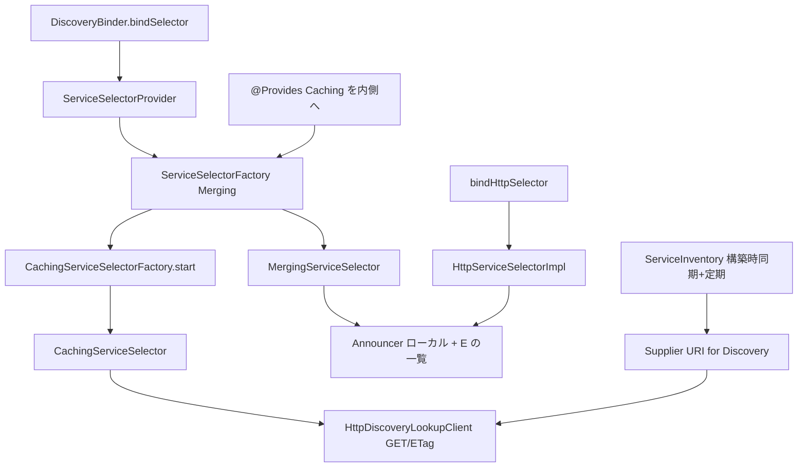

# 第17章 サービス選択

> **本章で読むソース**
>
> - [discovery/src/main/java/io/airlift/discovery/client/DiscoveryBinder.java](https://github.com/airlift/airlift/blob/439/discovery/src/main/java/io/airlift/discovery/client/DiscoveryBinder.java)
> - [discovery/src/main/java/io/airlift/discovery/client/DiscoveryModule.java](https://github.com/airlift/airlift/blob/439/discovery/src/main/java/io/airlift/discovery/client/DiscoveryModule.java)
> - [discovery/src/main/java/io/airlift/discovery/client/ServiceSelectorProvider.java](https://github.com/airlift/airlift/blob/439/discovery/src/main/java/io/airlift/discovery/client/ServiceSelectorProvider.java)
> - [discovery/src/main/java/io/airlift/discovery/client/MergingServiceSelectorFactory.java](https://github.com/airlift/airlift/blob/439/discovery/src/main/java/io/airlift/discovery/client/MergingServiceSelectorFactory.java)
> - [discovery/src/main/java/io/airlift/discovery/client/MergingServiceSelector.java](https://github.com/airlift/airlift/blob/439/discovery/src/main/java/io/airlift/discovery/client/MergingServiceSelector.java)
> - [discovery/src/main/java/io/airlift/discovery/client/CachingServiceSelectorFactory.java](https://github.com/airlift/airlift/blob/439/discovery/src/main/java/io/airlift/discovery/client/CachingServiceSelectorFactory.java)
> - [discovery/src/main/java/io/airlift/discovery/client/CachingServiceSelector.java](https://github.com/airlift/airlift/blob/439/discovery/src/main/java/io/airlift/discovery/client/CachingServiceSelector.java)
> - [discovery/src/main/java/io/airlift/discovery/client/HttpDiscoveryLookupClient.java](https://github.com/airlift/airlift/blob/439/discovery/src/main/java/io/airlift/discovery/client/HttpDiscoveryLookupClient.java)
> - [discovery/src/main/java/io/airlift/discovery/client/HttpServiceSelectorProvider.java](https://github.com/airlift/airlift/blob/439/discovery/src/main/java/io/airlift/discovery/client/HttpServiceSelectorProvider.java)
> - [discovery/src/main/java/io/airlift/discovery/client/HttpServiceSelectorImpl.java](https://github.com/airlift/airlift/blob/439/discovery/src/main/java/io/airlift/discovery/client/HttpServiceSelectorImpl.java)
> - [discovery/src/main/java/io/airlift/discovery/client/ExponentialBackOff.java](https://github.com/airlift/airlift/blob/439/discovery/src/main/java/io/airlift/discovery/client/ExponentialBackOff.java)
> - [discovery/src/main/java/io/airlift/discovery/client/ServiceInventory.java](https://github.com/airlift/airlift/blob/439/discovery/src/main/java/io/airlift/discovery/client/ServiceInventory.java)

## この章の狙い

第16章は自ノードのアナウンスである。
本章は他ノードのサービス記述を引き、型付きセレクタとして注入する経路を追う。
中心は `DiscoveryBinder.bindSelector` から `MergingServiceSelector`／`CachingServiceSelector`、lookup HTTP、そして discovery URI 供給用の `ServiceInventory` である。

## 前提

第16章の `DiscoveryModule` と `Announcer`、第13章の JSON 応答ハンドラを読んだものとする。
`ServiceInventory` をセレクタのローカルキャッシュと取り違えないこと。

## DiscoveryBinder：セレクタとアナウンスの入口

[discovery/src/main/java/io/airlift/discovery/client/DiscoveryBinder.java L42-L121](https://github.com/airlift/airlift/blob/439/discovery/src/main/java/io/airlift/discovery/client/DiscoveryBinder.java#L42-L121)

```java
public class DiscoveryBinder
{
    public static DiscoveryBinder discoveryBinder(Binder binder)
    {
        requireNonNull(binder, "binder is null");
        return new DiscoveryBinder(binder);
    }

    private final Multibinder<ServiceSelector> serviceSelectorBinder;
    private final Multibinder<ServiceAnnouncement> serviceAnnouncementBinder;
    private final Binder binder;

    protected DiscoveryBinder(Binder binder)
    {
        requireNonNull(binder, "binder is null");
        this.binder = binder.skipSources(getClass());
        this.serviceSelectorBinder = newSetBinder(binder, ServiceSelector.class);
        this.serviceAnnouncementBinder = newSetBinder(binder, ServiceAnnouncement.class);
    }

    public void bindSelector(String type)
    {
        requireNonNull(type, "type is null");
        bindSelector(serviceType(type));
    }

    public void bindSelector(ServiceType serviceType)
    {
        requireNonNull(serviceType, "serviceType is null");

        configBinder(binder).bindConfig(ServiceSelectorConfig.class, serviceType, "discovery." + serviceType.value());

        Key<ServiceSelector> key = Key.get(ServiceSelector.class, serviceType);
        binder.bind(key).toProvider(new ServiceSelectorProvider(serviceType.value())).in(Scopes.SINGLETON);
        serviceSelectorBinder.addBinding().to(key).in(Scopes.SINGLETON);
    }

    public void bindServiceAnnouncement(ServiceAnnouncement announcement)
    {
        requireNonNull(announcement, "announcement is null");
        serviceAnnouncementBinder.addBinding().toInstance(announcement);
    }

    // ... (中略) ...

    public void bindHttpSelector(String type)
    {
        requireNonNull(type, "type is null");
        bindHttpSelector(serviceType(type));
    }

    public void bindHttpSelector(ServiceType serviceType)
    {
        requireNonNull(serviceType, "serviceType is null");
        bindSelector(serviceType);
        binder.bind(HttpServiceSelector.class).annotatedWith(serviceType).toProvider(new HttpServiceSelectorProvider(serviceType.value())).in(Scopes.SINGLETON);
    }
```

`bindSelector` は `ServiceType` 付きの `ServiceSelectorConfig`（プレフィックス `discovery.<type>`）と、Provider 経由の SINGLETON セレクタを作る。
同じ Key を `Set<ServiceSelector>` へも足し、`ServiceSelectorManager` が一括操作できるようにする。
`bindHttpSelector` はその上に `HttpServiceSelector` を載せる。

## ServiceSelectorProvider：工場へ委譲

[discovery/src/main/java/io/airlift/discovery/client/ServiceSelectorProvider.java L26-L62](https://github.com/airlift/airlift/blob/439/discovery/src/main/java/io/airlift/discovery/client/ServiceSelectorProvider.java#L26-L62)

```java
public class ServiceSelectorProvider
        implements Provider<ServiceSelector>
{
    private final String type;
    private ServiceSelectorFactory serviceSelectorFactory;
    private Injector injector;

    public ServiceSelectorProvider(String type)
    {
        requireNonNull(type, "type is null");
        this.type = type;
    }

    @Inject
    public void setInjector(Injector injector)
    {
        requireNonNull(injector, "injector is null");
        this.injector = injector;
    }

    @Inject
    public void setServiceSelectorFactory(ServiceSelectorFactory serviceSelectorFactory)
    {
        requireNonNull(serviceSelectorFactory, "serviceSelectorFactory is null");
        this.serviceSelectorFactory = serviceSelectorFactory;
    }

    @Override
    public ServiceSelector get()
    {
        requireNonNull(serviceSelectorFactory, "serviceSelectorFactory is null");
        requireNonNull(injector, "injector is null");

        ServiceSelectorConfig selectorConfig = injector.getInstance(Key.get(ServiceSelectorConfig.class, serviceType(type)));

        return serviceSelectorFactory.createServiceSelector(type, selectorConfig);
    }
```

`DiscoveryModule` が `ServiceSelectorFactory` を `MergingServiceSelectorFactory` に向けている。
内側に何を渡すかは、別の `@Provides` が決める。

[discovery/src/main/java/io/airlift/discovery/client/DiscoveryModule.java L114-L122](https://github.com/airlift/airlift/blob/439/discovery/src/main/java/io/airlift/discovery/client/DiscoveryModule.java#L114-L122)

```java
    @Provides
    @Singleton
    public MergingServiceSelectorFactory createMergingServiceSelectorFactory(
            CachingServiceSelectorFactory factory,
            Announcer announcer,
            NodeInfo nodeInfo)
    {
        return new MergingServiceSelectorFactory(factory, announcer, nodeInfo);
    }
```

`MergingServiceSelectorFactory` の第1引数型は `ServiceSelectorFactory` である。
この `@Provides` が具象の `CachingServiceSelectorFactory` を渡すため、Merging が自分自身を注入されて無限連鎖にはならない。
`ServiceSelectorProvider` が得る工場は、常に Caching を内側に持つ Merging である。

## Merging と Caching の二重工場

[discovery/src/main/java/io/airlift/discovery/client/MergingServiceSelectorFactory.java L7-L26](https://github.com/airlift/airlift/blob/439/discovery/src/main/java/io/airlift/discovery/client/MergingServiceSelectorFactory.java#L7-L26)

```java
public class MergingServiceSelectorFactory
        implements ServiceSelectorFactory
{
    private final ServiceSelectorFactory selectorFactory;
    private final Announcer announcer;
    private final NodeInfo nodeInfo;

    public MergingServiceSelectorFactory(ServiceSelectorFactory selectorFactory, Announcer announcer, NodeInfo nodeInfo)
    {
        this.selectorFactory = requireNonNull(selectorFactory, "selectorFactory is null");
        this.announcer = requireNonNull(announcer, "announcer is null");
        this.nodeInfo = requireNonNull(nodeInfo, "nodeInfo is null");
    }

    @Override
    public ServiceSelector createServiceSelector(String type, ServiceSelectorConfig selectorConfig)
    {
        ServiceSelector selector = selectorFactory.createServiceSelector(type, selectorConfig);
        return new MergingServiceSelector(selector, announcer, nodeInfo);
    }
}
```

内側の工場は `CachingServiceSelectorFactory` である。

[discovery/src/main/java/io/airlift/discovery/client/CachingServiceSelectorFactory.java L24-L49](https://github.com/airlift/airlift/blob/439/discovery/src/main/java/io/airlift/discovery/client/CachingServiceSelectorFactory.java#L24-L49)

```java
public class CachingServiceSelectorFactory
        implements ServiceSelectorFactory
{
    private final DiscoveryLookupClient lookupClient;
    private final ScheduledExecutorService executor;

    @Inject
    public CachingServiceSelectorFactory(DiscoveryLookupClient lookupClient, @ForDiscoveryClient ScheduledExecutorService executor)
    {
        requireNonNull(lookupClient, "client is null");
        requireNonNull(executor, "executor is null");
        this.lookupClient = lookupClient;
        this.executor = executor;
    }

    @Override
    public ServiceSelector createServiceSelector(String type, ServiceSelectorConfig selectorConfig)
    {
        requireNonNull(type, "type is null");
        requireNonNull(selectorConfig, "selectorConfig is null");

        CachingServiceSelector serviceSelector = new CachingServiceSelector(type, selectorConfig, lookupClient, executor);
        serviceSelector.start();

        return serviceSelector;
    }
}
```

生成直後に `start` し、可能なら最初の lookup を最大 1 秒待つ。

`MergingServiceSelector` は自ノードのアナウンスを同じ type／pool の記述へ足し込む。

[discovery/src/main/java/io/airlift/discovery/client/MergingServiceSelector.java L40-L65](https://github.com/airlift/airlift/blob/439/discovery/src/main/java/io/airlift/discovery/client/MergingServiceSelector.java#L40-L65)

```java
    @Override
    public List<ServiceDescriptor> selectAllServices()
    {
        return merge(announcer.getServiceAnnouncements(), selector.selectAllServices());
    }

    @Override
    public ListenableFuture<List<ServiceDescriptor>> refresh()
    {
        return FluentFuture.from(selector.refresh())
                .transform(descriptors -> merge(announcer.getServiceAnnouncements(), descriptors), directExecutor());
    }

    private List<ServiceDescriptor> merge(Set<ServiceAnnouncement> serviceAnnouncements, List<ServiceDescriptor> serviceDescriptors)
    {
        Set<ServiceDescriptor> set = new HashSet<>();
        for (ServiceAnnouncement announcement : serviceAnnouncements) {
            ServiceDescriptor descriptor = announcement.toServiceDescriptor(nodeInfo);
            if (descriptor.getType().equals(getType()) && descriptor.getPool().equals(getPool())) {
                set.add(descriptor);
            }
        }
        set.addAll(serviceDescriptors);
        return ImmutableList.copyOf(set);
    }
```

自サービスが discovery 往復前でも、ローカル一覧に見える。

## CachingServiceSelector：周期 refresh

[discovery/src/main/java/io/airlift/discovery/client/CachingServiceSelector.java L102-L158](https://github.com/airlift/airlift/blob/439/discovery/src/main/java/io/airlift/discovery/client/CachingServiceSelector.java#L102-L158)

```java
    @Override
    public List<ServiceDescriptor> selectAllServices()
    {
        ServiceDescriptors serviceDescriptors = this.serviceDescriptors.get();
        if (serviceDescriptors == null) {
            return ImmutableList.of();
        }
        return serviceDescriptors.getServiceDescriptors();
    }

    @Override
    public ListenableFuture<List<ServiceDescriptor>> refresh()
    {
        ServiceDescriptors oldDescriptors = this.serviceDescriptors.get();

        ListenableFuture<ServiceDescriptors> future;
        if (oldDescriptors == null) {
            future = lookupClient.getServices(type, pool);
        }
        else {
            future = lookupClient.refreshServices(oldDescriptors);
        }

        future = chainedCallback(future, new FutureCallback<>()
        {
            @Override
            public void onSuccess(ServiceDescriptors newDescriptors)
            {
                serviceDescriptors.set(newDescriptors);
                errorBackOff.success();

                Duration delay = newDescriptors.getMaxAge();
                if (delay == null) {
                    delay = DEFAULT_DELAY;
                }
                scheduleRefresh(delay);
            }

            @Override
            public void onFailure(Throwable t)
            {
                Duration duration = errorBackOff.failed(t);
                scheduleRefresh(duration);
            }
        }, executor);

        return Futures.transform(future, ServiceDescriptors::getServiceDescriptors, directExecutor());
    }

    private void scheduleRefresh(Duration delay)
    {
        // already stopped?  avoids rejection exception
        if (executor.isShutdown()) {
            return;
        }
        executor.schedule(this::refresh, delay.toMillis(), TimeUnit.MILLISECONDS);
    }
```

未取得なら全件 GET、既取得なら ETag 付き refresh を `HttpDiscoveryLookupClient` に任せる。
成功時の待ちは応答の max-age（無ければ 10 秒の `DEFAULT_DELAY`）である。
読み取り側の `selectAllServices` はアトミック参照のスナップショットだけで、同期 HTTP はしない。

## HttpDiscoveryLookupClient：GET と ETag

[discovery/src/main/java/io/airlift/discovery/client/HttpDiscoveryLookupClient.java L111-L181](https://github.com/airlift/airlift/blob/439/discovery/src/main/java/io/airlift/discovery/client/HttpDiscoveryLookupClient.java#L111-L181)

```java
    private ListenableFuture<ServiceDescriptors> lookup(final String type, final String pool, final ServiceDescriptors serviceDescriptors)
    {
        requireNonNull(type, "type is null");

        URI uri = discoveryServiceURI.get();
        if (uri == null) {
            return immediateFailedFuture(new DiscoveryException("No discovery servers are available"));
        }

        Builder requestBuilder = prepareGet()
                .setUri(createServiceLocation(uri, type, Optional.ofNullable(pool)))
                .setHeader(USER_AGENT, nodeInfo.getNodeId());
        if (serviceDescriptors != null && serviceDescriptors.getETag() != null) {
            requestBuilder.setHeader(ETAG, serviceDescriptors.getETag());
        }
        return httpClient.executeAsync(requestBuilder.build(), new DiscoveryResponseHandler<>("Lookup of %s".formatted(type), uri)
        {
            @Override
            public ServiceDescriptors handle(Request request, Response response)
            {
                Duration maxAge = extractMaxAge(response);
                String eTag = response.getHeader(ETAG).orElse(null);

                if (NOT_MODIFIED.code() == response.getStatusCode() && serviceDescriptors != null) {
                    return new ServiceDescriptors(serviceDescriptors, maxAge, eTag);
                }

                if (OK.code() != response.getStatusCode()) {
                    throw new DiscoveryException("Lookup of %s failed with status code %s".formatted(type, response.getStatusCode()));
                }

                ServiceDescriptorsRepresentation serviceDescriptorsRepresentation;
                try (InputStream stream = response.getInputStream()) {
                    serviceDescriptorsRepresentation = serviceDescriptorsCodec.fromJson(stream);
                }
                catch (IOException e) {
                    throw new DiscoveryException("Lookup of %s failed".formatted(type), e);
                }

                if (!environment.equals(serviceDescriptorsRepresentation.getEnvironment())) {
                    throw new DiscoveryException("Expected environment to be %s, but was %s".formatted(environment, serviceDescriptorsRepresentation.getEnvironment()));
                }

                return new ServiceDescriptors(
                        type,
                        pool,
                        serviceDescriptorsRepresentation.getServiceDescriptors(),
                        maxAge,
                        eTag);
            }
        });
    }

    // ... (中略) ...

    @VisibleForTesting
    static URI createServiceLocation(URI baseUri, String type, Optional<String> pool)
    {
        HttpUriBuilder builder = uriBuilderFrom(baseUri)
                .appendPath("/v1/service")
                .appendPath(type);
        pool.ifPresent(builder::appendPath);
        return builder.build();
    }
```

パスは `/v1/service/{type}` または `/v1/service/{type}/{pool}` である。
304 なら本文を捨て、既存記述に新しい max-age／ETag だけ載せる。
環境文字列が食い違えば例外にする。

## HttpServiceSelector：https 優先とシャッフル

[discovery/src/main/java/io/airlift/discovery/client/HttpServiceSelectorProvider.java L45-L52](https://github.com/airlift/airlift/blob/439/discovery/src/main/java/io/airlift/discovery/client/HttpServiceSelectorProvider.java#L45-L52)

```java
    @Override
    public HttpServiceSelector get()
    {
        requireNonNull(injector, "injector is null");

        ServiceSelector serviceSelector = injector.getInstance(Key.get(ServiceSelector.class, serviceType(type)));

        return new HttpServiceSelectorImpl(serviceSelector);
    }
```

[discovery/src/main/java/io/airlift/discovery/client/HttpServiceSelectorImpl.java L51-L85](https://github.com/airlift/airlift/blob/439/discovery/src/main/java/io/airlift/discovery/client/HttpServiceSelectorImpl.java#L51-L85)

```java
    @Override
    public List<URI> selectHttpService()
    {
        List<ServiceDescriptor> serviceDescriptors = new ArrayList<>(serviceSelector.selectAllServices());
        if (serviceDescriptors.isEmpty()) {
            return ImmutableList.of();
        }

        // favor https over http
        List<URI> httpsUri = new ArrayList<>();
        for (ServiceDescriptor serviceDescriptor : serviceDescriptors) {
            if (serviceDescriptor.getProperties().get("https") instanceof String https) {
                try {
                    httpsUri.add(new URI(https));
                }
                catch (URISyntaxException ignored) {
                }
            }
        }
        List<URI> httpUri = new ArrayList<>();
        for (ServiceDescriptor serviceDescriptor : serviceDescriptors) {
            if (serviceDescriptor.getProperties().get("http") instanceof String http) {
                try {
                    httpUri.add(new URI(http));
                }
                catch (URISyntaxException ignored) {
                }
            }
        }

        // return random(https) + random(http)
        Collections.shuffle(httpsUri);
        Collections.shuffle(httpUri);
        return ImmutableList.<URI>builder().addAll(httpsUri).addAll(httpUri).build();
    }
```

https 群を先に、その中と http 群のそれぞれでシャッフルする。
クライアントは先頭から試せば、TLS 優先の疎結合な負荷分散になる。

## ExponentialBackOff

[discovery/src/main/java/io/airlift/discovery/client/ExponentialBackOff.java L11-L66](https://github.com/airlift/airlift/blob/439/discovery/src/main/java/io/airlift/discovery/client/ExponentialBackOff.java#L11-L66)

```java
class ExponentialBackOff
{
    private static final long ERROR_LOGGING_DELAY_NANOS = MILLISECONDS.toNanos(500);

    private final long initialWait;
    private final long maxWait;
    private final String serverUpMessage;
    private final String serverDownMessage;
    private final Logger log;

    private final long requestStart = System.nanoTime();

    @GuardedBy("this")
    private boolean serverUp = true;

    @GuardedBy("this")
    private long currentWaitInMillis = -1;

    public ExponentialBackOff(Duration initialWait, Duration maxWait, String serverUpMessage, String serverDownMessage, Logger log)
    {
        this.initialWait = requireNonNull(initialWait, "initialWait is null").toMillis();
        this.maxWait = requireNonNull(maxWait, "maxWait is null").toMillis();
        checkArgument(this.initialWait <= this.maxWait, "initialWait %s is less than maxWait %s", initialWait, maxWait);

        this.serverUpMessage = requireNonNull(serverUpMessage, "serverUpMessage is null");
        this.serverDownMessage = requireNonNull(serverDownMessage, "serverDownMessage is null");
        this.log = requireNonNull(log, "log is null");
    }

    public synchronized void success()
    {
        if (!serverUp) {
            serverUp = true;
            log.info(serverUpMessage);
        }
        currentWaitInMillis = -1;
    }

    public synchronized Duration failed(Throwable t)
    {
        if (serverUp) {
            // skip logging until 500ms has passed
            if ((System.nanoTime() - requestStart) >= ERROR_LOGGING_DELAY_NANOS) {
                serverUp = false;
                log.error(t, serverDownMessage);
            }
        }

        if (currentWaitInMillis <= 0) {
            currentWaitInMillis = initialWait;
        }
        else {
            currentWaitInMillis = Math.min(currentWaitInMillis * 2, maxWait);
        }
        return new Duration(currentWaitInMillis, MILLISECONDS);
    }
}
```

セレクタと Announcer はいずれも初期 1ms、上限 1s で使う。
成功で待ちをリセットする。
500ms は障害継続ではなく `ExponentialBackOff` 生成からの経過であり、それを過ぎれば最初の失敗でもエラーログする。

## ServiceInventory：discovery URI 候補の inventory

ここはセレクタの結果キャッシュではない。
設定 URI（http／https／file）からサービス記述一覧を取り、第16章の `getDiscoveryUriSupplier` が `type=discovery` を読むための候補になる。

URI が設定されていれば、コンストラクタが `updateServiceInventory()` を同期で一度試す。
初回データが最初の周期まで空、というわけではない。

[discovery/src/main/java/io/airlift/discovery/client/ServiceInventory.java L88-L114](https://github.com/airlift/airlift/blob/439/discovery/src/main/java/io/airlift/discovery/client/ServiceInventory.java#L88-L114)

```java
        if (serviceInventoryUri != null) {
            String scheme = serviceInventoryUri.getScheme().toLowerCase(ENGLISH);
            checkArgument(scheme.equals("http") || scheme.equals("https") || scheme.equals("file"), "Service inventory uri must have a http, https, or file scheme");

            try {
                updateServiceInventory();
            }
            catch (Exception ignored) {
            }
        }
    }

    @PostConstruct
    public synchronized void start()
    {
        if (serviceInventoryUri == null || scheduledFuture != null) {
            return;
        }
        scheduledFuture = executorService.scheduleAtFixedRate(() -> {
            try {
                updateServiceInventory();
            }
            catch (Throwable e) {
                log.error(e, "Unexpected exception from service inventory update");
            }
        }, updateInterval.toMillis(), updateInterval.toMillis(), TimeUnit.MILLISECONDS);
    }
```

`@PostConstruct` の `scheduleAtFixedRate` は、初回実行が `updateInterval` 後から始まる。
そのあとの定期更新が `updateServiceInventory` である。

[discovery/src/main/java/io/airlift/discovery/client/ServiceInventory.java L146-L181](https://github.com/airlift/airlift/blob/439/discovery/src/main/java/io/airlift/discovery/client/ServiceInventory.java#L146-L181)

```java
    @Managed
    public final void updateServiceInventory()
    {
        if (serviceInventoryUri == null) {
            return;
        }

        try {
            ServiceDescriptorsRepresentation serviceDescriptorsRepresentation;
            if (serviceInventoryUri.getScheme().toLowerCase(ENGLISH).startsWith("http")) {
                Builder requestBuilder = prepareGet()
                        .setUri(serviceInventoryUri)
                        .setHeader(USER_AGENT, nodeInfo.getNodeId());
                serviceDescriptorsRepresentation = httpClient.execute(requestBuilder.build(), createJsonResponseHandler(serviceDescriptorsCodec));
            }
            else {
                File file = new File(serviceInventoryUri);
                serviceDescriptorsRepresentation = serviceDescriptorsCodec.fromJson(newBufferedReader(file.toPath()));
            }

            if (!environment.equals(serviceDescriptorsRepresentation.getEnvironment())) {
                logServerError("Expected environment to be %s, but was %s", environment, serviceDescriptorsRepresentation.getEnvironment());
            }

            List<ServiceDescriptor> descriptors = new ArrayList<>(serviceDescriptorsRepresentation.getServiceDescriptors());
            Collections.shuffle(descriptors);
            serviceDescriptors.set(ImmutableList.copyOf(descriptors));

            if (serverUp.compareAndSet(false, true)) {
                log.info("ServiceInventory connect succeeded");
            }
        }
        catch (Exception e) {
            logServerError("Error loading service inventory from %s", serviceInventoryUri.toASCIIString());
        }
    }
```

URI 未設定なら何もしない。
環境文字列が食い違っても、`HttpDiscoveryLookupClient` のように `DiscoveryException` で拒否はしない。
`logServerError` したあと、記述をシャッフルして `serviceDescriptors` へ格納する。
シャッフルは更新成功のたびに一度であり、次の成功更新まで `AtomicReference` 上の順序は固定される。
第16章の URI `Supplier` は、そのあいだ同じ先頭の RUNNING 記述を繰り返し選び得る。
呼び出しごとに並びが変わるわけではない。
`CachingServiceSelector` が持つ type／pool 単位のキャッシュとは別レイヤである。

## 処理の流れ



## 高速化と最適化の工夫

`selectAllServices` はメモリ上の参照を読むだけで、呼び出しごとに discovery へ行かない。
refresh は ETag と 304 により、未変更時の JSON デコードを省く。
`HttpServiceSelectorImpl` のシャッフルは、固定先頭へのホットスポットを避けるための軽い負荷分散である。
失敗時の指数バックオフは、落ちた discovery への連打を抑える。

## まとめ

- `DiscoveryBinder.bindSelector` が `ServiceSelectorProvider` 経由で Merging＋Caching のセレクタを SINGLETON にする。
- `@Provides` が `CachingServiceSelectorFactory` を Merging の内側へ渡し、自己参照を避ける。
- `MergingServiceSelector` は自ノードの同 type／pool アナウンスを一覧へ混ぜる。
- `CachingServiceSelector` は max-age 間隔で lookup し、読み取りはキャッシュ参照である。
- `HttpDiscoveryLookupClient` は `/v1/service/...` と ETag／304 を扱い、環境不一致は例外にする。
- `ServiceInventory` は構築時に同期更新し、環境不一致でも記述を格納する。
- それはセレクタキャッシュではない。
- inventory のシャッフルは更新成功ごとであり、URI Supplier の呼び出しごとではない。

## 関連する章

- [第13章 ResponseHandler](../part06-http-client/13-response-handler.md)
- [第16章 ノード識別とサービスアナウンス](16-node-announce.md)
