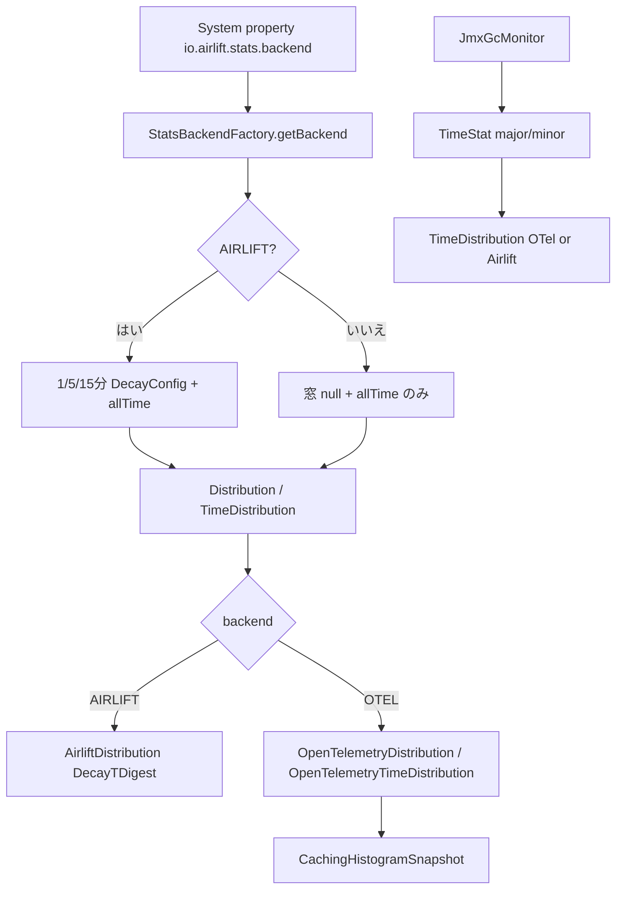

# 第18章 統計 facade と backend

> **本章で読むソース**
>
> - [stats/src/main/java/io/airlift/stats/StatsBackendFactory.java](https://github.com/airlift/airlift/blob/439/stats/src/main/java/io/airlift/stats/StatsBackendFactory.java)
> - [stats/src/main/java/io/airlift/stats/StatsBackend.java](https://github.com/airlift/airlift/blob/439/stats/src/main/java/io/airlift/stats/StatsBackend.java)
> - [stats/src/main/java/io/airlift/stats/DistributionStat.java](https://github.com/airlift/airlift/blob/439/stats/src/main/java/io/airlift/stats/DistributionStat.java)
> - [stats/src/main/java/io/airlift/stats/TimeStat.java](https://github.com/airlift/airlift/blob/439/stats/src/main/java/io/airlift/stats/TimeStat.java)
> - [stats/src/main/java/io/airlift/stats/CounterStat.java](https://github.com/airlift/airlift/blob/439/stats/src/main/java/io/airlift/stats/CounterStat.java)
> - [stats/src/main/java/io/airlift/stats/Distribution.java](https://github.com/airlift/airlift/blob/439/stats/src/main/java/io/airlift/stats/Distribution.java)
> - [stats/src/main/java/io/airlift/stats/TimeDistribution.java](https://github.com/airlift/airlift/blob/439/stats/src/main/java/io/airlift/stats/TimeDistribution.java)
> - [stats/src/main/java/io/airlift/stats/AirliftDistribution.java](https://github.com/airlift/airlift/blob/439/stats/src/main/java/io/airlift/stats/AirliftDistribution.java)
> - [stats/src/main/java/io/airlift/stats/OpenTelemetryDistribution.java](https://github.com/airlift/airlift/blob/439/stats/src/main/java/io/airlift/stats/OpenTelemetryDistribution.java)
> - [stats/src/main/java/io/airlift/stats/OpenTelemetryTimeDistribution.java](https://github.com/airlift/airlift/blob/439/stats/src/main/java/io/airlift/stats/OpenTelemetryTimeDistribution.java)
> - [stats/src/main/java/io/airlift/stats/StripedExponentialHistogram.java](https://github.com/airlift/airlift/blob/439/stats/src/main/java/io/airlift/stats/StripedExponentialHistogram.java)
> - [stats/src/main/java/io/airlift/stats/CachingHistogramSnapshot.java](https://github.com/airlift/airlift/blob/439/stats/src/main/java/io/airlift/stats/CachingHistogramSnapshot.java)
> - [stats/src/main/java/io/airlift/stats/JmxGcMonitor.java](https://github.com/airlift/airlift/blob/439/stats/src/main/java/io/airlift/stats/JmxGcMonitor.java)

## この章の狙い

観測用の数値は、呼び出し側からは `DistributionStat`、`TimeStat`、`CounterStat` に見える。
背後ではシステムプロパティで選ぶ **StatsBackend**（AIRLIFT か OPENTELEMETRY）が、減衰ウィンドウ付きの実装と all-time のみの実装を切り替える。
本章では facade、backend 選択、`Distribution`／`TimeDistribution` の実装振り分け、OTel 側の自前ヒストグラム、`JmxGcMonitor` を追う。
sketch 本体（TDigest、指数ヒストグラムの内部）は第19章である。

## 前提

JMX の `@Managed`／`@Nested`、指数減衰の直感（「新しい観測ほど重い」）を知っているものとする。
OpenTelemetry SDK の Metric exporter は、ここで言う OPENTELEMETRY backend とは別物である。

## StatsBackendFactory：初回取得で凍結する backend

[stats/src/main/java/io/airlift/stats/StatsBackendFactory.java L9-L40](https://github.com/airlift/airlift/blob/439/stats/src/main/java/io/airlift/stats/StatsBackendFactory.java#L9-L40)

```java
public final class StatsBackendFactory
{
    public static final String STATS_BACKEND_PROPERTY = "io.airlift.stats.backend";

    private static final Object lock = new Object();

    @GuardedBy("lock")
    private static StatsBackend backend;
    @GuardedBy("lock")
    private static boolean frozen;

    private StatsBackendFactory() {}

    public static StatsBackend getBackend()
    {
        synchronized (lock) {
            if (backend == null) {
                backend = StatsBackend.fromPropertyValue(System.getProperty(STATS_BACKEND_PROPERTY, "airlift"));
            }
            frozen = true;
            return backend;
        }
    }

    public static void setBackend(StatsBackend backend)
    {
        requireNonNull(backend, "backend is null");
        synchronized (lock) {
            checkState(!frozen, "stats backend is already initialized");
            StatsBackendFactory.backend = backend;
        }
    }
```

既定はシステムプロパティ `io.airlift.stats.backend`、未設定なら `airlift` である。
一度 `getBackend` したあと `setBackend` は拒否される。
プロセス内で facade の組が混在しないよう、初回解決で凍結する。

[stats/src/main/java/io/airlift/stats/StatsBackend.java L7-L24](https://github.com/airlift/airlift/blob/439/stats/src/main/java/io/airlift/stats/StatsBackend.java#L7-L24)

```java
public enum StatsBackend
{
    AIRLIFT,
    OPENTELEMETRY;

    static StatsBackend fromPropertyValue(String value)
    {
        String normalized = requireNonNull(value, "value is null")
                .trim()
                .replace("-", "")
                .replace("_", "")
                .toUpperCase(Locale.ROOT);
        return switch (normalized) {
            case "AIRLIFT" -> AIRLIFT;
            case "OPENTELEMETRY", "OTEL" -> OPENTELEMETRY;
            default -> throw new IllegalArgumentException("Unknown stats backend: " + value);
        };
    }
}
```

## DistributionStat／TimeStat／CounterStat：AIRLIFT だけ 1／5／15 分

三 facade は同じ分岐形である。
AIRLIFT なら 1／5／15 分の減衰窓を作り、それ以外なら窓フィールドは null で all-time だけ残す。

[stats/src/main/java/io/airlift/stats/DistributionStat.java L14-L57](https://github.com/airlift/airlift/blob/439/stats/src/main/java/io/airlift/stats/DistributionStat.java#L14-L57)

```java
public class DistributionStat
{
    @Nullable
    private final Distribution oneMinute;
    @Nullable
    private final Distribution fiveMinutes;
    @Nullable
    private final Distribution fifteenMinutes;
    private final Distribution allTime;

    public DistributionStat()
    {
        if (StatsBackendFactory.getBackend() == AIRLIFT) {
            oneMinute = new Distribution(DecayConfig.oneMinute());
            fiveMinutes = new Distribution(DecayConfig.fiveMinutes());
            fifteenMinutes = new Distribution(DecayConfig.fifteenMinutes());
        }
        else {
            oneMinute = null;
            fiveMinutes = null;
            fifteenMinutes = null;
        }
        allTime = new Distribution();
    }

    public void add(long value)
    {
        if (oneMinute != null && fiveMinutes != null && fifteenMinutes != null) {
            oneMinute.add(value);
            fiveMinutes.add(value);
            fifteenMinutes.add(value);
        }
        allTime.add(value);
    }

    public void add(long value, long count)
    {
        if (oneMinute != null && fiveMinutes != null && fifteenMinutes != null) {
            oneMinute.add(value, count);
            fiveMinutes.add(value, count);
            fifteenMinutes.add(value, count);
        }
        allTime.add(value, count);
    }
```

`TimeStat` も同じ backend 分岐で `TimeDistribution` を三窓＋all-time にする。

[stats/src/main/java/io/airlift/stats/TimeStat.java L59-L103](https://github.com/airlift/airlift/blob/439/stats/src/main/java/io/airlift/stats/TimeStat.java#L59-L103)

```java
    public TimeStat(Ticker ticker, TimeUnit unit)
    {
        this.ticker = ticker;
        if (StatsBackendFactory.getBackend() == AIRLIFT) {
            oneMinute = new TimeDistribution(ticker, DecayConfig.oneMinute(), unit);
            fiveMinutes = new TimeDistribution(ticker, DecayConfig.fiveMinutes(), unit);
            fifteenMinutes = new TimeDistribution(ticker, DecayConfig.fifteenMinutes(), unit);
        }
        else {
            oneMinute = null;
            fiveMinutes = null;
            fifteenMinutes = null;
        }
        allTime = new TimeDistribution(ticker, unit);
    }

    // ... (中略) ...

    public void addNanos(long nanos)
    {
        if (nanos < 0) {
            throw new IllegalArgumentException("value is negative: " + nanos);
        }
        if (oneMinute != null && fiveMinutes != null && fifteenMinutes != null) {
            oneMinute.add(nanos);
            fiveMinutes.add(nanos);
            fifteenMinutes.add(nanos);
        }
        allTime.add(nanos);
    }
```

`CounterStat` は減衰窓に `DecayCounter` を、全期間に `LongAdder` を使う。

[stats/src/main/java/io/airlift/stats/CounterStat.java L39-L71](https://github.com/airlift/airlift/blob/439/stats/src/main/java/io/airlift/stats/CounterStat.java#L39-L71)

```java
public final class CounterStat
{
    private final LongAdder count = new LongAdder();
    @Nullable
    private final DecayCounter oneMinute;
    @Nullable
    private final DecayCounter fiveMinute;
    @Nullable
    private final DecayCounter fifteenMinute;

    public CounterStat()
    {
        if (StatsBackendFactory.getBackend() == AIRLIFT) {
            oneMinute = new DecayCounter(DecayConfig.oneMinute());
            fiveMinute = new DecayCounter(DecayConfig.fiveMinutes());
            fifteenMinute = new DecayCounter(DecayConfig.fifteenMinutes());
        }
        else {
            oneMinute = null;
            fiveMinute = null;
            fifteenMinute = null;
        }
    }

    public void update(long count)
    {
        if (oneMinute != null && fiveMinute != null && fifteenMinute != null) {
            oneMinute.add(count);
            fiveMinute.add(count);
            fifteenMinute.add(count);
        }
        this.count.add(count);
    }
```

OPENTELEMETRY では 1／5／15 分の JMX Nested が null になる。
all-time（分布または時間）または累積カウントだけが残る。

## Distribution／TimeDistribution：実装クラスの選択

[stats/src/main/java/io/airlift/stats/Distribution.java L49-L70](https://github.com/airlift/airlift/blob/439/stats/src/main/java/io/airlift/stats/Distribution.java#L49-L70)

```java
    private Distribution(Ticker ticker, @Nullable DecayConfig config)
    {
        implementation = switch (StatsBackendFactory.getBackend()) {
            case AIRLIFT -> new AirliftDistribution(config);
            case OPENTELEMETRY -> new OpenTelemetryDistribution(ticker);
        };
    }

    private Distribution(DistributionImplementation implementation)
    {
        this.implementation = requireNonNull(implementation, "implementation is null");
    }

    public void add(long value)
    {
        implementation.add(value);
    }

    public void add(long value, long count)
    {
        implementation.add(value, count);
    }
```

[stats/src/main/java/io/airlift/stats/TimeDistribution.java L62-L70](https://github.com/airlift/airlift/blob/439/stats/src/main/java/io/airlift/stats/TimeDistribution.java#L62-L70)

```java
    public TimeDistribution(Ticker ticker, @Nullable DecayConfig config, TimeUnit unit)
    {
        requireNonNull(ticker, "ticker is null");
        requireNonNull(unit, "unit is null");
        implementation = switch (StatsBackendFactory.getBackend()) {
            case AIRLIFT -> new AirliftTimeDistribution(ticker, config, unit);
            case OPENTELEMETRY -> new OpenTelemetryTimeDistribution(ticker, unit);
        };
    }
```

OTel 側のコンストラクタは `DecayConfig` を受け取らない。
減衰窓付きの `Distribution(DecayConfig)` を OPENTELEMETRY backend で作っても、実装は非減衰の指数ヒストグラムになる。
ファサードが OPENTELEMETRY で窓を null にするのは、この不一致を利用者から隠すためでもある。

AIRLIFT 実装は `DecayTDigest` と `DecayCounter` を同期で更新する。

[stats/src/main/java/io/airlift/stats/AirliftDistribution.java L14-L50](https://github.com/airlift/airlift/blob/439/stats/src/main/java/io/airlift/stats/AirliftDistribution.java#L14-L50)

```java
final class AirliftDistribution
        implements DistributionImplementation
{
    private static final double[] SNAPSHOT_QUANTILES = new double[] {0.01, 0.05, 0.10, 0.25, 0.5, 0.75, 0.9, 0.95, 0.99};

    // immutable config shared by every sub-structure; null when this distribution does not decay
    @Nullable
    private final DecayConfig config;
    private DecayTDigest digest;

    private final DecayCounter total;

    AirliftDistribution(@Nullable DecayConfig config)
    {
        this(config, new DecayTDigest(TDigest.DEFAULT_COMPRESSION, config), new DecayCounter(config));
    }

    private AirliftDistribution(@Nullable DecayConfig config, DecayTDigest digest, DecayCounter total)
    {
        this.config = config;
        this.digest = requireNonNull(digest, "digest is null");
        this.total = requireNonNull(total, "total is null");
    }

    @Override
    public synchronized void add(long value)
    {
        digest.add(value);
        total.add(value);
    }

    @Override
    public synchronized void add(long value, long count)
    {
        digest.add(value, count);
        total.add(value * count);
    }
```

分位数は digest、合計は total である。
`config == null` が all-time（非減衰）である。

## OpenTelemetryDistribution：SDK exporter ではなく自前ヒストグラム

名前に OpenTelemetry とあるが、ここで起きているのは OTLP 送信ではない。
`StripedExponentialHistogram` へ記録し、`CachingHistogramSnapshot` で読取りコストを抑える。

[stats/src/main/java/io/airlift/stats/OpenTelemetryDistribution.java L14-L44](https://github.com/airlift/airlift/blob/439/stats/src/main/java/io/airlift/stats/OpenTelemetryDistribution.java#L14-L44)

```java
final class OpenTelemetryDistribution
        implements DistributionImplementation
{
    private static final double[] SNAPSHOT_QUANTILES = new double[] {0.01, 0.05, 0.10, 0.25, 0.5, 0.75, 0.9, 0.95, 0.99};

    private final StripedExponentialHistogram histogram;
    private final CachingHistogramSnapshot snapshotCache;

    OpenTelemetryDistribution(Ticker ticker)
    {
        histogram = new StripedExponentialHistogram();
        snapshotCache = new CachingHistogramSnapshot(histogram, ticker, Distribution.MERGE_THRESHOLD_NANOS);
    }

    private OpenTelemetryDistribution(ExponentialHistogramSnapshot snapshot)
    {
        histogram = new StripedExponentialHistogram(snapshot, ExponentialHistogram.DEFAULT_MAX_BUCKETS);
        snapshotCache = new CachingHistogramSnapshot(histogram, systemTicker(), Distribution.MERGE_THRESHOLD_NANOS);
    }

    @Override
    public void add(long value)
    {
        histogram.record(value);
    }

    @Override
    public void add(long value, long count)
    {
        histogram.record(value, count);
    }
```

ストライプはスレッド ID で選び、スナップショット時にマージする。

[stats/src/main/java/io/airlift/stats/StripedExponentialHistogram.java L12-L81](https://github.com/airlift/airlift/blob/439/stats/src/main/java/io/airlift/stats/StripedExponentialHistogram.java#L12-L81)

```java
@ThreadSafe
public final class StripedExponentialHistogram
{
    private static final int DEFAULT_STRIPES = clamp(Runtime.getRuntime().availableProcessors(), 2, 16);

    private final ExponentialHistogram[] stripes;
    private final int maxBuckets;

    public StripedExponentialHistogram()
    {
        this(ExponentialHistogram.DEFAULT_SCALE, ExponentialHistogram.DEFAULT_MAX_BUCKETS, DEFAULT_STRIPES);
    }

    // ... (中略) ...

    public void record(double value)
    {
        stripe().record(value);
    }

    public void record(double value, long occurrences)
    {
        stripe().record(value, occurrences);
    }

    public ExponentialHistogramSnapshot snapshot()
    {
        ExponentialHistogramSnapshot[] snapshots = Arrays.stream(stripes)
                .map(ExponentialHistogram::snapshot)
                .toArray(ExponentialHistogramSnapshot[]::new);

        ExponentialHistogramSnapshot merged = ExponentialHistogramSnapshot.merge(Arrays.asList(snapshots), maxBuckets);
        for (int i = 0; i < snapshots.length; i++) {
            if (snapshots[i].scale() != merged.scale()) {
                stripes[i].downscaleToAtMost(merged.scale());
            }
        }
        return merged;
    }

    // ... (中略) ...

    private ExponentialHistogram stripe()
    {
        return stripes[floorMod(Thread.currentThread().threadId(), stripes.length)];
    }
}
```

`CachingHistogramSnapshot.snapshot(false)` は、閾値（100ms、`MERGE_THRESHOLD_NANOS`）以内ならキャッシュを返す。
この経路は `getPxx` や `getMin`／`getMax`／`getAvg`／`getCount` など、`snapshot(false)` を使う単一値 getter の連続読取りに限る。
`getPercentiles()`、`snapshot()`、`exponentialHistogramSnapshot()` は `snapshot(true)` を呼び、閾値内でも全ストライプを強制マージする。

[stats/src/main/java/io/airlift/stats/CachingHistogramSnapshot.java L9-L42](https://github.com/airlift/airlift/blob/439/stats/src/main/java/io/airlift/stats/CachingHistogramSnapshot.java#L9-L42)

```java
final class CachingHistogramSnapshot
{
    private final StripedExponentialHistogram histogram;
    private final Ticker ticker;
    private final long snapshotThresholdNanos;

    @GuardedBy("this")
    private ExponentialHistogramSnapshot cachedSnapshot;
    @GuardedBy("this")
    private long lastSnapshot;

    CachingHistogramSnapshot(StripedExponentialHistogram histogram, Ticker ticker, long snapshotThresholdNanos)
    {
        this.histogram = requireNonNull(histogram, "histogram is null");
        this.ticker = requireNonNull(ticker, "ticker is null");
        this.snapshotThresholdNanos = snapshotThresholdNanos;
        lastSnapshot = ticker.read(); // do not snapshot immediately
    }

    synchronized ExponentialHistogramSnapshot snapshot(boolean forceSnapshot)
    {
        if (forceSnapshot || cachedSnapshot == null || ticker.read() - lastSnapshot >= snapshotThresholdNanos) {
            cachedSnapshot = histogram.snapshot();
            lastSnapshot = ticker.read();
        }
        return cachedSnapshot;
    }

    synchronized void reset()
    {
        histogram.reset();
        cachedSnapshot = null;
        lastSnapshot = ticker.read();
    }
}
```

JMX が短い間隔で `getP99` などを叩いても、単一値 getter のあいだは毎回全ストライプをマージしない。

[stats/src/main/java/io/airlift/stats/OpenTelemetryDistribution.java L143-L191](https://github.com/airlift/airlift/blob/439/stats/src/main/java/io/airlift/stats/OpenTelemetryDistribution.java#L143-L191)

```java
    public Map<Double, Double> getPercentiles()
    {
        double[] values = ExponentialHistogram.valuesAt(snapshot(true), PERCENTILES);
        return toMap(values);
    }

    @Override
    public Distribution.DistributionSnapshot snapshot()
    {
        ExponentialHistogramSnapshot snapshot = snapshot(true);
        double[] quantiles = ExponentialHistogram.valuesAt(snapshot, SNAPSHOT_QUANTILES);
        return new Distribution.DistributionSnapshot(
                snapshot.count(),
                snapshot.sum(),
                quantiles[0], // p01
                quantiles[1], // p05
                // ... (中略) ...
                snapshot.min(),
                snapshot.max(),
                average(snapshot.sum(), snapshot.count()));
    }

    @Override
    public Optional<ExponentialHistogramSnapshot> exponentialHistogramSnapshot()
    {
        return Optional.of(snapshot(true));
    }

    private double valueAt(double percentile)
    {
        return ExponentialHistogram.valuesAt(snapshotIfNeeded(), new double[] {percentile})[0];
    }

    private ExponentialHistogramSnapshot snapshotIfNeeded()
    {
        return snapshot(false);
    }

    private ExponentialHistogramSnapshot snapshot(boolean forceSnapshot)
    {
        return snapshotCache.snapshot(forceSnapshot);
    }
}
```

## OpenTelemetryTimeDistribution：ナノ秒記録と単位変換

`TimeDistribution` の OPENTELEMETRY 実装は `OpenTelemetryTimeDistribution` である。
`add` は観測をナノ秒のまま `StripedExponentialHistogram` に入れる。
キャッシュ契約（単一値は `snapshot(false)`、一括取得は `snapshot(true)`）と、返却単位の契約は別である。
`getPxx`／`getMin`／`getMax`／`getAvg` と `TimeDistributionSnapshot` の値は `convertToUnit` する。
一方 `getPercentiles()` は `snapshot(true)` の values を `toMap(values)` へ直接渡すため、タグ 439 ではナノ秒のままである。
`exponentialHistogramSnapshot()` もナノ秒の raw スナップショットを返す。
`AirliftTimeDistribution.getPercentiles()` も values を変換せず `toMap` する点は同じである。

[stats/src/main/java/io/airlift/stats/OpenTelemetryTimeDistribution.java L15-L48](https://github.com/airlift/airlift/blob/439/stats/src/main/java/io/airlift/stats/OpenTelemetryTimeDistribution.java#L15-L48)

```java
final class OpenTelemetryTimeDistribution
        implements TimeDistributionImplementation
{
    private static final double[] SNAPSHOT_QUANTILES = new double[] {0.5, 0.75, 0.9, 0.95, 0.99};

    private final StripedExponentialHistogram histogram = new StripedExponentialHistogram();
    private final TimeUnit unit;
    private final CachingHistogramSnapshot snapshotCache;

    OpenTelemetryTimeDistribution(Ticker ticker, TimeUnit unit)
    {
        this.unit = unit;
        snapshotCache = new CachingHistogramSnapshot(histogram, ticker, TimeDistribution.MERGE_THRESHOLD_NANOS);
    }

    @Override
    public void add(long value)
    {
        histogram.record(value);
    }

    @Override
    public double getCount()
    {
        return snapshotIfNeeded().count();
    }

    @Override
    public double getP50()
    {
        return valueAt(0.50);
    }
```

[stats/src/main/java/io/airlift/stats/OpenTelemetryTimeDistribution.java L72-L148](https://github.com/airlift/airlift/blob/439/stats/src/main/java/io/airlift/stats/OpenTelemetryTimeDistribution.java#L72-L148)

```java
    @Override
    public double getMin()
    {
        return convertToUnit(snapshotIfNeeded().min(), unit);
    }

    @Override
    public double getMax()
    {
        return convertToUnit(snapshotIfNeeded().max(), unit);
    }

    @Override
    public double getAvg()
    {
        ExponentialHistogramSnapshot snapshot = snapshotIfNeeded();
        return average(convertToUnit(snapshot.sum(), unit), snapshot.count());
    }

    // ... (中略) ...

    @Override
    public Map<Double, Double> getPercentiles()
    {
        ExponentialHistogramSnapshot snapshot = snapshot(true);
        double[] values = ExponentialHistogram.valuesAt(snapshot, PERCENTILES);
        return toMap(values);
    }

    @Override
    public TimeDistribution.TimeDistributionSnapshot snapshot()
    {
        ExponentialHistogramSnapshot snapshot = snapshot(true);
        double[] quantiles = ExponentialHistogram.valuesAt(snapshot, SNAPSHOT_QUANTILES);
        return new TimeDistribution.TimeDistributionSnapshot(
                snapshot.count(),
                convertToUnit(quantiles[0], unit), // p50
                convertToUnit(quantiles[1], unit), // p75
                convertToUnit(quantiles[2], unit), // p90
                convertToUnit(quantiles[3], unit), // p95
                convertToUnit(quantiles[4], unit), // p99
                convertToUnit(snapshot.min(), unit),
                convertToUnit(snapshot.max(), unit),
                average(convertToUnit(snapshot.sum(), unit), snapshot.count()),
                unit);
    }

    // ... (中略) ...

    private double valueAt(double percentile)
    {
        return convertToUnit(ExponentialHistogram.valuesAt(snapshotIfNeeded(), new double[] {percentile})[0], unit);
    }

    private ExponentialHistogramSnapshot snapshotIfNeeded()
    {
        return snapshot(false);
    }

    private ExponentialHistogramSnapshot snapshot(boolean forceSnapshot)
    {
        return snapshotCache.snapshot(forceSnapshot);
    }
}
```

backend が OPENTELEMETRY のとき、`TimeStat` と `JmxGcMonitor` の GC 時間は `TimeStat` → `TimeDistribution` → `OpenTelemetryTimeDistribution` へ落ちる。
`TimeStat()`／`TimeStat(Ticker)` の既定単位は `TimeUnit.SECONDS` である。
`JmxGcMonitor` の `majorGc`／`minorGc` も `new TimeStat()` なので読取りは秒表示になる。
明示コンストラクタなら任意の `TimeUnit` を渡せる。

[stats/src/main/java/io/airlift/stats/TimeStat.java L44-L57](https://github.com/airlift/airlift/blob/439/stats/src/main/java/io/airlift/stats/TimeStat.java#L44-L57)

```java
    public TimeStat()
    {
        this(Ticker.systemTicker(), TimeUnit.SECONDS);
    }

    public TimeStat(Ticker ticker)
    {
        this(ticker, TimeUnit.SECONDS);
    }

    public TimeStat(TimeUnit unit)
    {
        this(Ticker.systemTicker(), unit);
    }
```

## JmxGcMonitor：GC 通知を TimeStat へ

[stats/src/main/java/io/airlift/stats/JmxGcMonitor.java L61-L110](https://github.com/airlift/airlift/blob/439/stats/src/main/java/io/airlift/stats/JmxGcMonitor.java#L61-L110)

```java
public class JmxGcMonitor
        implements GcMonitor
{
    @VisibleForTesting
    static final double FRACTION_OF_MAX_HEAP_TO_TRIGGER_WARN = 0.8;
    private static final double MINIMUM_PERCENTAGE_OF_HEAP_RECLAIMED = 10.0;
    private static final String MAJOR_ZGC_NAME = "ZGC Major Cycles";
    private static final Set<String> ZGC_MBEANS = ImmutableSet.of("ZGC Cycles", MAJOR_ZGC_NAME, "ZGC Minor Cycles");

    private final Logger log = Logger.get(JmxGcMonitor.class);

    private final NotificationListener notificationListener = (notification, _) -> onNotification(notification);
    private final NotificationListener zgcNotificationListener = (notification, _) -> onZgcNotification(notification);

    private final AtomicLong majorGcCount = new AtomicLong();
    private final AtomicLong majorGcTime = new AtomicLong();
    private final TimeStat majorGc = new TimeStat();

    private final TimeStat minorGc = new TimeStat();

    @GuardedBy("this")
    private long lastGcEndTime = System.currentTimeMillis();

    @PostConstruct
    public void start()
    {
        for (GarbageCollectorMXBean mbean : ManagementFactory.getGarbageCollectorMXBeans()) {
            ObjectName objectName = mbean.getObjectName();
            try {
                // Don't register listeners for ZGC Pauses because it does not report memory usage statistics
                if (ZGC_MBEANS.contains(mbean.getName())) {
                    getPlatformMBeanServer().addNotificationListener(
                            objectName,
                            zgcNotificationListener,
                            null,
                            null);
                }
                else {
                    getPlatformMBeanServer().addNotificationListener(
                            objectName,
                            notificationListener,
                            null,
                            null);
                }
            }
            catch (JMException e) {
                throw new RuntimeException("Unable to add GC listener", e);
            }
        }
    }
```

[stats/src/main/java/io/airlift/stats/JmxGcMonitor.java L159-L177](https://github.com/airlift/airlift/blob/439/stats/src/main/java/io/airlift/stats/JmxGcMonitor.java#L159-L177)

```java
    private synchronized void onNotification(Notification notification)
    {
        if (GARBAGE_COLLECTION_NOTIFICATION.equals(notification.getType())) {
            GarbageCollectionNotificationInfo info = new GarbageCollectionNotificationInfo((CompositeData) notification.getUserData());

            if (info.isMajorGc()) {
                logMajorGc(info);
            }
            else if (info.isMinorGc()) {
                minorGc.add(info.getDurationMs(), MILLISECONDS);

                // assumption that minor GCs run currently, so we do not print stopped or application time
                log.debug(
                        "Minor GC: duration %s: %s -> %s",
                        succinctDuration(info.getDurationMs(), MILLISECONDS),
                        info.getBeforeGcTotal(),
                        info.getAfterGcTotal());
            }
        }
    }
```

Platform MBeanServer の GC 通知を聞き、major／minor を `TimeStat` へ載せる。
これは第20章の JMX export 基盤とは別で、統計 facade の消費例でもある。

## 処理の流れ



## 高速化と最適化の工夫

OPENTELEMETRY backend ではストライプ書き込みに加え、単一値 getter が使う `snapshot(false)` で閾値内のフルマージを間引く。
閾値は `Distribution`／`TimeDistribution` の `MERGE_THRESHOLD_NANOS`（100ms）である。
一括スナップショット系は `snapshot(true)` のため、この間引きの対象外である。
AIRLIFT の窓はプロセス起動時に一度だけ選び、毎回の `add` では null チェックで三種をまとめて更新する。

## まとめ

- `StatsBackendFactory` はシステムプロパティから backend を決め、初回取得で凍結する。
- `DistributionStat`／`TimeStat`／`CounterStat` は AIRLIFT のときだけ 1／5／15 分窓を持ち、OPENTELEMETRY では all-time（または累積）だけである。
- `Distribution`／`TimeDistribution` は backend で `Airlift*` と `OpenTelemetry*` を選ぶ。
- `OpenTelemetryDistribution`／`OpenTelemetryTimeDistribution` は OTel SDK exporter ではなく、`StripedExponentialHistogram` と `CachingHistogramSnapshot` である。
- `OpenTelemetryTimeDistribution` はナノ秒で記録し、単一値 getter と `snapshot()` は単位変換、`getPercentiles()`／`exponentialHistogramSnapshot()` はナノ秒のまま返す。
- `TimeStat` の既定単位は秒であり、`JmxGcMonitor` の GC 統計もその既定を使う。
- `JmxGcMonitor` は GC 通知を `TimeStat` に載せる。

## 関連する章

- [第15章 JettyHttpClient](../part06-http-client/15-jetty-http-client.md)
- [第19章 sketch と decay](19-stats-sketches.md)
- [第20章 JMX と OpenMetrics 公開](20-jmx-openmetrics.md)
