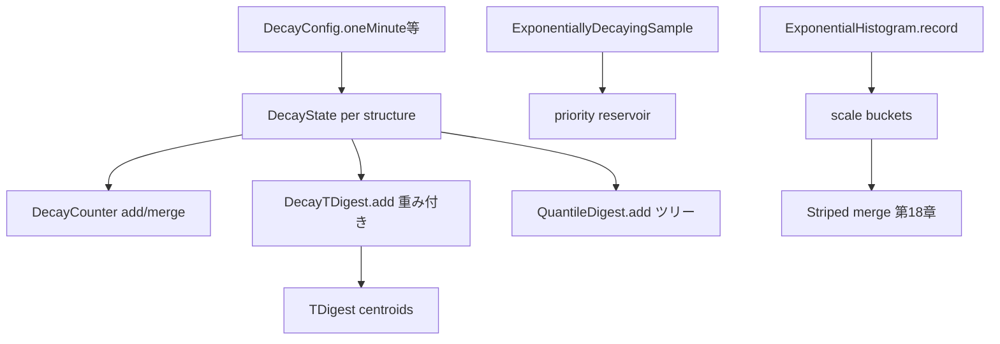

# 第19章 sketch と decay

> **本章で読むソース**
>
> - [stats/src/main/java/io/airlift/stats/DecayConfig.java](https://github.com/airlift/airlift/blob/439/stats/src/main/java/io/airlift/stats/DecayConfig.java)
> - [stats/src/main/java/io/airlift/stats/DecayState.java](https://github.com/airlift/airlift/blob/439/stats/src/main/java/io/airlift/stats/DecayState.java)
> - [stats/src/main/java/io/airlift/stats/DecayCounter.java](https://github.com/airlift/airlift/blob/439/stats/src/main/java/io/airlift/stats/DecayCounter.java)
> - [stats/src/main/java/io/airlift/stats/DecayTDigest.java](https://github.com/airlift/airlift/blob/439/stats/src/main/java/io/airlift/stats/DecayTDigest.java)
> - [stats/src/main/java/io/airlift/stats/TDigest.java](https://github.com/airlift/airlift/blob/439/stats/src/main/java/io/airlift/stats/TDigest.java)
> - [stats/src/main/java/io/airlift/stats/QuantileDigest.java](https://github.com/airlift/airlift/blob/439/stats/src/main/java/io/airlift/stats/QuantileDigest.java)
> - [stats/src/main/java/io/airlift/stats/ExponentiallyDecayingSample.java](https://github.com/airlift/airlift/blob/439/stats/src/main/java/io/airlift/stats/ExponentiallyDecayingSample.java)
> - [stats/src/main/java/io/airlift/stats/ExponentialHistogram.java](https://github.com/airlift/airlift/blob/439/stats/src/main/java/io/airlift/stats/ExponentialHistogram.java)

## この章の狙い

第18章の AIRLIFT backend は分位数に `DecayTDigest`（内部は `TDigest`）を、件数に `DecayCounter` を使う。
OPENTELEMETRY backend の基盤は `ExponentialHistogram` である。
本章では forward decay の設定、各 sketch の挿入と圧縮、reservoir の指数減衰サンプルを追う。

## 前提

第18章の facade／backend 分岐を読んだものとする。
分位数アルゴリズムの詳細証明ではなく、実装が何を保証し、どこで重み付けするかを押さえる。

## DecayConfig と DecayState：時間軸の共有と状態の分離

[stats/src/main/java/io/airlift/stats/DecayConfig.java L10-L83](https://github.com/airlift/airlift/blob/439/stats/src/main/java/io/airlift/stats/DecayConfig.java#L10-L83)

```java
/**
 * Immutable configuration for an exponential forward-decay timeline. It holds the two pieces of
 * state that never change for the lifetime of a decaying data structure:
 * <ul>
 *     <li>the decay factor {@code alpha}, and</li>
 *     <li>the {@link Ticker} used to measure the age of entries.</li>
 * </ul>
 * <p>
 * Weights follow the formula {@code w(t, alpha) = e^(alpha * (t - landmark))}, based on the ideas in
 * <a href="http://dimacs.rutgers.edu/~graham/pubs/papers/fwddecay.pdf">Forward Decay</a>. The
 * mutable part of a timeline (the landmark, plus a cached weight) lives in {@link DecayState}.
 * <p>
 * A config carries no mutable state, so a single instance is safe to share across any number of
 * decaying data structures and threads. Each structure derives its own mutable {@link DecayState}
 * via {@link #newState()}.
 */
public record DecayConfig(double alpha, Ticker ticker)
{
    // needs to be such that Math.exp(alpha * seconds) does not grow too big
    static final long RESCALE_THRESHOLD_SECONDS = 50;

    public DecayConfig
    {
        // alpha == 0 (no decay) is not a configuration of a decay timeline; callers that don't want
        // decay simply don't hold a DecayConfig/DecayState at all
        checkArgument(alpha > 0 && alpha < 1, "alpha must be in range (0, 1)");
        requireNonNull(ticker, "ticker is null");
    }

    public static DecayConfig oneMinute()
    {
        // alpha for a target weight of 1/E at 1 minute
        return seconds(60);
    }

    // ... (中略) ...

    public static DecayConfig seconds(int seconds, Ticker ticker)
    {
        // alpha for a target weight of 1/E at the specified number of seconds; the derived alpha
        // (1 / seconds) must land in [0, 1), so seconds must be greater than 1
        checkArgument(seconds > 1, "seconds must be greater than 1");
        return new DecayConfig(1.0 / seconds, ticker);
    }
```

1／5／15 分は、その秒数で重みが `1/e` になる `alpha = 1/seconds` である。
設定は不変で共有できる。
構造体ごとの landmark は `DecayState` に載る。

[stats/src/main/java/io/airlift/stats/DecayState.java L5-L31](https://github.com/airlift/airlift/blob/439/stats/src/main/java/io/airlift/stats/DecayState.java#L5-L31)

```java
/**
 * The mutable per-structure state of an exponential forward-decay timeline. It pairs an immutable
 * {@link DecayConfig} with:
 * <ul>
 *     <li>the {@code landmark} that the stored (forward-decayed) weights are relative to, and</li>
 *     <li>a one-entry cache of the most recently computed weight.</li>
 * </ul>
 * <p>
 * Because the landmark is mutable and the stored weights of the backing structure are anchored to
 * it, a single state must back exactly one data structure. A container that holds several decaying
 * structures should share one {@link DecayConfig} and give each structure its own state via
 * {@link DecayConfig#newState()}.
 * <p>
 * This class is NOT thread safe; callers that share an instance must synchronize externally.
 */
public final class DecayState
{
    private final DecayConfig config;
    private long landmarkInSeconds;

    // The weight is a pure function of the age (now - landmark) and alpha, so it is cached keyed by
    // age, maintaining the invariant cachedWeight == exp(alpha * cachedAgeInSeconds). A cache hit
    // (same age) is therefore always correct, even after the landmark moves, because equal ages yield
    // equal weights - so rescaleTo/setLandmarkInSeconds need not invalidate. A differing age
    // recomputes. Long.MIN_VALUE is an age no real (now - landmark) produces, marking "nothing cached".
    private double cachedWeight;
    private long cachedAgeInSeconds = Long.MIN_VALUE;
```

重みは秒単位の年齢に対する `exp(alpha * age)` である。
同じ年齢ならキャッシュが当たり、landmark 移動後も年齢一致なら再計算しない。

## DecayCounter：タイマーなしで減衰するカウンタ

[stats/src/main/java/io/airlift/stats/DecayCounter.java L12-L69](https://github.com/airlift/airlift/blob/439/stats/src/main/java/io/airlift/stats/DecayCounter.java#L12-L69)

```java
/*
 * A counter that decays exponentially. Values are weighted according to the formula
 *     w(t, α) = e^(-α * t), where α is the decay factor and t is the age in seconds
 *
 * The implementation is based on the ideas from
 * http://dimacs.rutgers.edu/~graham/pubs/papers/fwddecay.pdf
 * to not have to rely on a timer that decays the value periodically
 */
@ThreadSafe
public final class DecayCounter
{
    @Nullable
    private final DecayState decay;

    private double count;

    // ... (中略) ...

    public synchronized void add(long value)
    {
        if (decay == null) {
            count += value;
            return;
        }

        long nowInSeconds = decay.nowInSeconds();
        if (decay.needsRescale(nowInSeconds)) {
            count /= decay.rescaleTo(nowInSeconds);
        }
        count += value * decay.weightAt(nowInSeconds);
    }
```

コメント先頭の式は年齢に対する相対表現である。
実装は forward decay の重みを landmark 基準で掛け、長時間後は `rescale` で指数爆発を抑える。
定期タイマーは要らない。
`getCount` は現在重みで割り返す。
ここでの割り返しは count（加重合計）の正規化であり、構造の rescale そのものではない。
landmark を動かす rescale は更新側である。
`add` は `needsRescale` のとき `count /= rescaleTo` する。
`merge(DecayCounter)` も landmark を揃え、this 側が古ければ `rescaleTo(otherLandmark)` で this.count を割ってから加算し、this 側が新しければ otherCount を `weightFromLandmark` で換算する。
この `merge` は `CounterStat.merge` に加え、`AirliftTimeDistribution.mergeIfNeeded` の `total.merge(partialTotal)` でも主要経路になる。

[stats/src/main/java/io/airlift/stats/DecayCounter.java L71-L105](https://github.com/airlift/airlift/blob/439/stats/src/main/java/io/airlift/stats/DecayCounter.java#L71-L105)

```java
    public void merge(DecayCounter decayCounter)
    {
        requireNonNull(decayCounter, "decayCounter is null");

        // Snapshot the other counter under its own monitor, then apply the merge under ours. Holding
        // only one monitor at a time avoids the deadlock that nested locking allows when a.merge(b)
        // and b.merge(a) run concurrently.
        long otherLandmarkInSeconds;
        double otherCount;
        double otherAlpha;
        synchronized (decayCounter) {
            otherAlpha = decayCounter.getAlpha();
            otherLandmarkInSeconds = decayCounter.decay == null ? 0 : decayCounter.decay.getLandmarkInSeconds();
            otherCount = decayCounter.count;
        }

        checkArgument(otherAlpha == getAlpha(), "Expected decayCounter to have alpha %s, but was %s", getAlpha(), otherAlpha);

        synchronized (this) {
            if (decay == null) {
                // neither counter decays (equal alpha was checked above), so all weights are 1
                count += otherCount;
            }
            // if this counter's landmark is behind the other counter
            else if (decay.getLandmarkInSeconds() < otherLandmarkInSeconds) {
                // rescale this counter to the other counter, and add
                count /= decay.rescaleTo(otherLandmarkInSeconds);
                count += otherCount;
            }
            else {
                // rescale the other counter's value (without mutating it) and add
                count += otherCount / decay.weightFromLandmark(otherLandmarkInSeconds);
            }
        }
    }
```

## DecayTDigest：減衰付きで TDigest を包む

[stats/src/main/java/io/airlift/stats/DecayTDigest.java L24-L112](https://github.com/airlift/airlift/blob/439/stats/src/main/java/io/airlift/stats/DecayTDigest.java#L24-L112)

```java
public class DecayTDigest
{
    @VisibleForTesting
    static final long RESCALE_THRESHOLD_SECONDS = DecayConfig.RESCALE_THRESHOLD_SECONDS;
    @VisibleForTesting
    static final double ZERO_WEIGHT_THRESHOLD = 1e-5;

    // We scale every weight by this factor to ensure that weights in the underlying
    // digest are >= 1.
    private static final double SCALE_FACTOR = 1 / ZERO_WEIGHT_THRESHOLD;

    private final TDigest digest;
    @Nullable
    private final DecayState decay;

    // ... (中略) ...

    public void add(double value, double weight)
    {
        rescaleIfNeeded();

        if (decay != null) {
            weight *= decay.currentWeight() * SCALE_FACTOR;
        }

        digest.add(value, weight);
    }

    private void rescaleIfNeeded()
    {
        if (decay == null) {
            return;
        }
        long nowInSeconds = decay.nowInSeconds();
        if (decay.needsRescale(nowInSeconds)) {
            rescale(nowInSeconds);
        }
    }
```

内部 digest の重みが極端に小さくならないよう `SCALE_FACTOR` を掛ける。
`getCount()` は読取り時に `currentWeight * SCALE_FACTOR` で割り返す。
分位の `valueAt`／`valuesAt` は一様な重み倍率に対して不変なので割らず、内部 `TDigest` を直接読む。

[stats/src/main/java/io/airlift/stats/DecayTDigest.java L81-L137](https://github.com/airlift/airlift/blob/439/stats/src/main/java/io/airlift/stats/DecayTDigest.java#L81-L137)

```java
    public double getCount()
    {
        rescaleIfNeeded();

        double result = digest.getCount();

        if (decay != null) {
            result /= (decay.currentWeight() * SCALE_FACTOR);
        }

        if (result < ZERO_WEIGHT_THRESHOLD) {
            result = 0;
        }

        return result;
    }

    // ... (中略) ...

    public double valueAt(double quantile)
    {
        return digest.valueAt(quantile);
    }

    public List<Double> valuesAt(List<Double> quantiles)
    {
        return digest.valuesAt(quantiles);
    }

    public double[] valuesAt(double... quantiles)
    {
        return digest.valuesAt(quantiles);
    }
```

`getCount`（およびそれが空判定に使う `getMin`／`getMax`）経由では rescale が走る。
`valueAt`／`valuesAt` はこのクラス側では rescale も正規化もしない。

## TDigest：重心の追加と圧縮

[stats/src/main/java/io/airlift/stats/TDigest.java L191-L237](https://github.com/airlift/airlift/blob/439/stats/src/main/java/io/airlift/stats/TDigest.java#L191-L237)

```java
    public void add(double value)
    {
        add(value, 1);
    }

    public void add(double value, double weight)
    {
        // Fast path: a finite value with a strictly positive weight is the common case and clears
        // this guard in a single combined branch. Anything else (NaN/±Infinity on either argument,
        // or a non-positive weight) falls into the slow path, which reproduces the specific message.
        // The weight must be validated before any state is mutated below: a zero or negative weight
        // would still increment centroidCount while leaving totalWeight non-positive, desyncing
        // getCount()/getMin()/valueAt() and corrupting later merges.
        if (!isFinite(value) || !isFinite(weight) || weight <= 0) {
            checkArgument(!isNaN(value), "value is NaN");
            checkArgument(!isNaN(weight), "weight is NaN");
            checkArgument(!isInfinite(value), "value must be finite");
            checkArgument(!isInfinite(weight), "weight must be finite");
            checkArgument(weight > 0, "weight must be positive: %s", weight);
        }

        if (centroidCount == means.length) {
            if (means.length < maxSize) {
                ensureCapacity(Math.min(Math.max(means.length * 2, INITIAL_CAPACITY), maxSize));
            }
            else {
                merge(internalCompressionFactor(compression));
                if (centroidCount >= means.length) {
                    throw new AssertionError("Invalid size estimation for T-Digest: " + Base64.getEncoder().encodeToString(serializeInternal().getBytes()));
                }
            }
        }

        means[centroidCount] = value;
        weights[centroidCount] = weight;
        centroidCount++;

        totalWeight += weight;
        if (value < min) {
            min = value;
        }
        if (value > max) {
            max = value;
        }

        needsMerge = true;
    }
```

通常の `add` は配列末尾へ追記し、`needsMerge` を立てる。
配列が容量上限に達したときだけ、挿入前に `merge`（圧縮）して空きを作る。
照会の `valuesAt` も `needsMerge` が真なら `mergeIfNeeded` で圧縮してから読む。
`compact()`／`mergeWith()` も同様に条件付き圧縮を行う。

[stats/src/main/java/io/airlift/stats/TDigest.java L297-L317](https://github.com/airlift/airlift/blob/439/stats/src/main/java/io/airlift/stats/TDigest.java#L297-L317)

```java
    public double[] valuesAt(double... quantiles)
    {
        if (quantiles.length == 0) {
            return new double[0];
        }

        validateQuantilesArgument(quantiles);

        double[] result = new double[quantiles.length];

        if (centroidCount == 0) {
            Arrays.fill(result, Double.NaN);
            return result;
        }

        mergeIfNeeded(internalCompressionFactor(compression));

        if (centroidCount == 1) {
            Arrays.fill(result, means[0]);
            return result;
        }
```

既定 compression は `100` である。

## QuantileDigest：誤差保証付きツリーと減衰

[stats/src/main/java/io/airlift/stats/QuantileDigest.java L121-L140](https://github.com/airlift/airlift/blob/439/stats/src/main/java/io/airlift/stats/QuantileDigest.java#L121-L140)

```java
    /**
     * @param config the decay configuration, or null for a digest that does not decay
     */
    public QuantileDigest(double maxError, @Nullable DecayConfig config)
    {
        checkArgument(maxError >= 0 && maxError <= 1, "maxError must be in range [0, 1]");

        this.maxError = maxError;
        this.decay = config == null ? null : config.newState();

        counts = new double[INITIAL_CAPACITY];
        levels = new byte[INITIAL_CAPACITY];
        values = new long[INITIAL_CAPACITY];

        lefts = new int[INITIAL_CAPACITY];
        rights = new int[INITIAL_CAPACITY];

        Arrays.fill(lefts, -1);
        Arrays.fill(rights, -1);
    }
```

[stats/src/main/java/io/airlift/stats/QuantileDigest.java L241-L277](https://github.com/airlift/airlift/blob/439/stats/src/main/java/io/airlift/stats/QuantileDigest.java#L241-L277)

```java
    public void add(long value)
    {
        add(value, 1);
    }

    /**
     * Adds a value to this digest. The value must be {@code >= 0}
     */
    public void add(long value, double weight)
    {
        checkArgument(weight > 0, "weight must be > 0");

        boolean needsCompression = false;
        if (decay != null) {
            long nowInSeconds = decay.nowInSeconds();
            if (decay.needsRescale(nowInSeconds)) {
                rescale(nowInSeconds);
                needsCompression = true; // rescale affects weights globally, so force compression
            }

            weight *= decay.weightAt(nowInSeconds);
        }

        max = Math.max(max, value);
        min = Math.min(min, value);

        double previousCount = weightedCount;
        insert(longToBits(value), weight);

        // When totalCount crosses the next multiple of k (compression factor), the compression
        // equation changes for every node in the tree, so we need to compress globally.
        // Otherwise, only node along the insertion path are affected -- TODO: implement this.
        int compressionFactor = calculateCompressionFactor();
        if (needsCompression || ((long) previousCount) / compressionFactor != ((long) weightedCount) / compressionFactor) {
            compress();
        }
    }
```

値は `long` であり、ビットツリー上に挿入する。
`maxError` が圧縮の厳しさを決め、減衰時は挿入重みに `weightAt` を掛ける。
Airlift の主経路 `Distribution` は現在 TDigest 側を使うが、同モジュールの誤差保証付きダイジェストとして残る。

## ExponentiallyDecayingSample：固定サイズの reservoir

[stats/src/main/java/io/airlift/stats/ExponentiallyDecayingSample.java L83-L147](https://github.com/airlift/airlift/blob/439/stats/src/main/java/io/airlift/stats/ExponentiallyDecayingSample.java#L83-L147)

```java
    public ExponentiallyDecayingSample(int reservoirSize, double alpha)
    {
        this.values = new ConcurrentSkipListMap<>();
        this.lock = new ReentrantReadWriteLock();
        this.alpha = alpha;
        this.reservoirSize = reservoirSize;
        clear();
    }

    // ... (中略) ...

    public void update(long value, long timestamp)
    {
        lockForRegularUsage();
        try {
            final double priority = weight(timestamp - startTime) / random();
            count.increment();
            final long newCount = count.sum();
            if (newCount <= reservoirSize) {
                values.put(priority, value);
            }
            else {
                Double first = values.firstKey();
                if (first < priority) {
                    if (values.putIfAbsent(priority, value) == null) {
                        // ensure we always remove an item
                        while (values.remove(first) == null) {
                            first = values.firstKey();
                        }
                    }
                }
            }
        }
        finally {
            unlockForRegularUsage();
        }

        final long now = System.nanoTime();
        final long next = nextScaleTime.get();
        if (now >= next) {
            rescale(now, next);
        }
    }
```

優先度は `exp(alpha * age) / random()` である。
容量超過時は最低優先度を追い出し、新しい時刻ほど入りやすい。
rescale は `update` の末尾で約 1 時間閾値を確認したときだけ走り、照会 `values()` では走らない。

## ExponentialHistogram：尺度付きバケツ

[stats/src/main/java/io/airlift/stats/ExponentialHistogram.java L41-L144](https://github.com/airlift/airlift/blob/439/stats/src/main/java/io/airlift/stats/ExponentialHistogram.java#L41-L144)

```java
public final class ExponentialHistogram
{
    public static final int DEFAULT_SCALE = 20;
    public static final int DEFAULT_MAX_BUCKETS = 160;
    public static final int MIN_SCALE = -10;
    public static final int MAX_SCALE = 20;

    // ... (中略) ...

    public synchronized void record(double value, long occurrences)
    {
        checkArgument(occurrences >= 0, "occurrences is negative");
        if (occurrences == 0) {
            return;
        }
        if (!isFinite(value)) {
            return;
        }

        count += occurrences;
        sum += value * occurrences;
        min = Double.isNaN(min) ? value : min(min, value);
        max = Double.isNaN(max) ? value : max(max, value);

        if (value == 0) {
            zeroCount += occurrences;
            return;
        }

        BucketCounts buckets = value > 0 ? positiveBuckets : negativeBuckets;
        double magnitude = Math.abs(value);
        int bucketIndex = bucketIndex(magnitude, scale);
        int scaleReduction = buckets.scaleReduction(bucketIndex, maxBuckets);
        if (scaleReduction > 0) {
            downscale(scaleReduction);
            bucketIndex = bucketIndex(magnitude, scale);
        }
        buckets.increment(bucketIndex, occurrences);
    }
```

値は指数スケールのバケツへ落ちる。
必要なら `downscale` で解像度を下げ、バケツ数を `maxBuckets` 内に収める。
第18章の `StripedExponentialHistogram` がこれを複数本持ち、スナップショットでマージする。

## 処理の流れ



## 高速化と最適化の工夫

forward decay はタイマースレッドを置かない。
ただし rescale／正規化の契機は構造ごとに違う。
`DecayCounter` の照会は `currentWeight` で割るだけである。
rescale（共通 landmark 化）は `add` の `needsRescale` と `merge` の landmark 比較の両方で起きる。
`DecayTDigest` は `getCount` 経由で rescale しうる一方、`valueAt`／`valuesAt` は直接 `TDigest` を読む。
`ExponentiallyDecayingSample` は `update` 後にだけ約 1 時間閾値を見て rescale する。
`DecayState` は同一秒年齢の重みをキャッシュする。
`TDigest` は通常 `add` を末尾追記にし、容量上限時や照会、`compact`／`mergeWith` などで pending centroids を merge する。
`ExponentialHistogram` はバケツ上限を超えると downscale し、メモリと分位精度のバランスを取る。

## まとめ

- `DecayConfig` は不変の alpha と ticker であり、`DecayState` が landmark を持つ。
- `DecayCounter` と `DecayTDigest` は forward decay でタイマーなし減衰を実現する。
- `DecayCounter` の rescale は `add` と `merge` の更新側で起き、照会は `currentWeight` 正規化だけである。
- `DecayTDigest.getCount` だけが読取り正規化で割り、分位照会は割らない。
- `TDigest` は圧縮パラメータ付き重心 sketch であり、AIRLIFT 分布の分位の芯である。
- `QuantileDigest` は `maxError` 付きツリーと任意減衰を持ち、long 値向けの別系統である。
- `ExponentiallyDecayingSample` は固定サイズの優先度 reservoir である。
- `ExponentialHistogram` は OTEL backend のバケツ sketch 本体である。

## 関連する章

- [第18章 統計 facade と backend](18-stats-facade.md)
- [第20章 JMX と OpenMetrics 公開](20-jmx-openmetrics.md)
