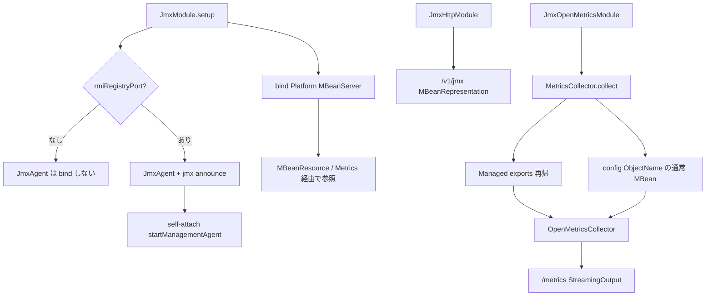

# 第20章 JMX と OpenMetrics 公開

> **本章で読むソース**
>
> - [jmx/src/main/java/io/airlift/jmx/JmxModule.java](https://github.com/airlift/airlift/blob/439/jmx/src/main/java/io/airlift/jmx/JmxModule.java)
> - [jmx/src/main/java/io/airlift/jmx/JmxAgent.java](https://github.com/airlift/airlift/blob/439/jmx/src/main/java/io/airlift/jmx/JmxAgent.java)
> - [jmx/src/main/java/io/airlift/jmx/JmxConfig.java](https://github.com/airlift/airlift/blob/439/jmx/src/main/java/io/airlift/jmx/JmxConfig.java)
> - [jmx-http/src/main/java/io/airlift/jmx/JmxHttpModule.java](https://github.com/airlift/airlift/blob/439/jmx-http/src/main/java/io/airlift/jmx/JmxHttpModule.java)
> - [jmx-http/src/main/java/io/airlift/jmx/MBeanResource.java](https://github.com/airlift/airlift/blob/439/jmx-http/src/main/java/io/airlift/jmx/MBeanResource.java)
> - [jmx-http/src/main/java/io/airlift/jmx/MBeanRepresentation.java](https://github.com/airlift/airlift/blob/439/jmx-http/src/main/java/io/airlift/jmx/MBeanRepresentation.java)
> - [openmetrics/src/main/java/io/airlift/openmetrics/JmxOpenMetricsModule.java](https://github.com/airlift/airlift/blob/439/openmetrics/src/main/java/io/airlift/openmetrics/JmxOpenMetricsModule.java)
> - [openmetrics/src/main/java/io/airlift/openmetrics/MetricsResource.java](https://github.com/airlift/airlift/blob/439/openmetrics/src/main/java/io/airlift/openmetrics/MetricsResource.java)
> - [openmetrics/src/main/java/io/airlift/openmetrics/OpenMetricsCollector.java](https://github.com/airlift/airlift/blob/439/openmetrics/src/main/java/io/airlift/openmetrics/OpenMetricsCollector.java)
> - [metrics/src/main/java/io/airlift/metrics/MetricsModule.java](https://github.com/airlift/airlift/blob/439/metrics/src/main/java/io/airlift/metrics/MetricsModule.java)
> - [metrics/src/main/java/io/airlift/metrics/MetricsCollector.java](https://github.com/airlift/airlift/blob/439/metrics/src/main/java/io/airlift/metrics/MetricsCollector.java)

## この章の狙い

観測データを外へ出す経路は三つある。
プラットフォームの **MBeanServer** への登録、HTTP 経由の MBean JSON、OpenMetrics テキストである。
本章では `JmxModule` が Platform MBeanServer を Guice に載せる役割と、`JmxAgent` が RMI 用 JDK agent を条件付きで起動する役割を分けて追う。
`@Managed` や `MBeanExporter`（外部 jmxutils）の登録そのものではなく、公開チャネル側の配線を対象とする。

## 前提

第18章の統計 facade が `@Managed` 経由で MBean になる前提を知っているものとする。
サービスディスカバリのアナウンス（第16章）も、JMX URL の公開に使う。

## JmxModule：PlatformMBeanServer のバインドと条件付き Agent

`JmxModule` は常に `ManagementFactory.getPlatformMBeanServer()` を `MBeanServer` として bind する。
RMI 用の `JmxAgent` は別である。
レジストリポートが未設定なら Agent も jmx アナウンスも入れない。

[jmx/src/main/java/io/airlift/jmx/JmxModule.java L38-L58](https://github.com/airlift/airlift/blob/439/jmx/src/main/java/io/airlift/jmx/JmxModule.java#L38-L58)

```java
    @Override
    protected void setup(Binder binder)
    {
        binder.bind(MBeanServer.class).toInstance(ManagementFactory.getPlatformMBeanServer());
        configBinder(binder).bindConfig(JmxConfig.class);

        newExporter(binder).export(StackTraceMBean.class).withGeneratedName();
        binder.bind(StackTraceMBean.class).in(Scopes.SINGLETON);

        JmxConfig jmxConfig = buildConfigObject(JmxConfig.class);

        if (jmxConfig.getRmiRegistryPort() == null) {
            // Do not export JmxAgent by default for security reasons.
            // Also, exporting it at randomly picked port was proven to be unreliable in certain environments.

            checkState(jmxConfig.getRmiServerPort() == null, "RMI registry port must be configured when RMI server port is configured");
        }
        else {
            discoveryBinder(binder).bindServiceAnnouncement(JmxAnnouncementProvider.class);
            binder.bind(JmxAgent.class).in(Scopes.SINGLETON);
        }
    }
```

設定キーは `jmx.rmiregistry.port` と `jmx.rmiserver.port` である。

[jmx/src/main/java/io/airlift/jmx/JmxConfig.java L22-L49](https://github.com/airlift/airlift/blob/439/jmx/src/main/java/io/airlift/jmx/JmxConfig.java#L22-L49)

```java
public class JmxConfig
{
    private Integer rmiRegistryPort;
    private Integer rmiServerPort;

    public Integer getRmiRegistryPort()
    {
        return rmiRegistryPort;
    }

    @Config("jmx.rmiregistry.port")
    public JmxConfig setRmiRegistryPort(Integer rmiRegistryPort)
    {
        this.rmiRegistryPort = rmiRegistryPort;
        return this;
    }

    public Integer getRmiServerPort()
    {
        return rmiServerPort;
    }

    @Config("jmx.rmiserver.port")
    public JmxConfig setRmiServerPort(Integer rmiServerPort)
    {
        this.rmiServerPort = rmiServerPort;
        return this;
    }
}
```

ポートを開けたときだけ `JmxAnnouncementProvider` が `jmxAgent.getUrl()` を discovery の `jmx` プロパティへ載せる。

## JmxAgent：self-attach で JDK management agent を起動する

`JmxAgent` は PlatformMBeanServer を「供給」しない。
コンストラクタで RMI ポートを検証し、未起動なら attach API で management agent を起動し、最終的な `JMXServiceURL` を保持する。

[jmx/src/main/java/io/airlift/jmx/JmxAgent.java L40-L106](https://github.com/airlift/airlift/blob/439/jmx/src/main/java/io/airlift/jmx/JmxAgent.java#L40-L106)

```java
    @Inject
    public JmxAgent(JmxConfig config)
            throws IOException
    {
        int registryPort = requireNonNull(config.getRmiRegistryPort(), "RMI registry port is not configured");
        Integer existingRegistryPort = Integer.getInteger(JMX_REGISTRY_PORT);

        if (existingRegistryPort != null) {
            if (existingRegistryPort != registryPort) {
                throw new RuntimeException("System property '%s=%s' does match configured RMI registry port %s".formatted(
                        JMX_REGISTRY_PORT,
                        existingRegistryPort,
                        registryPort));
            }
            if (existingRegistryPort.equals(0)) {
                throw new RuntimeException("JMX agent already running on an unknown port (system property '%s' is 0)".formatted(
                        JMX_REGISTRY_PORT));
            }
        }

        int serverPort = 0;
        Integer existingServerPort = Integer.getInteger(JMX_SERVER_PORT);
        Integer configuredServerPort = config.getRmiServerPort();
        if (!Objects.equals(existingServerPort, configuredServerPort)) {
            throw new RuntimeException("System property '%s=%s' does match configured RMI server port %s".formatted(
                    JMX_SERVER_PORT,
                    existingServerPort,
                    configuredServerPort));
        }
        if (configuredServerPort != null && !configuredServerPort.equals(0)) {
            serverPort = configuredServerPort;
        }

        // this is how the JDK JMX agent constructs its URL
        JMXServiceURL jmxUrl = new JMXServiceURL("rmi", null, registryPort);
        HostAndPort address = HostAndPort.fromParts(jmxUrl.getHost(), jmxUrl.getPort());

        if (existingRegistryPort == null) {
            startJmxAgent(registryPort, serverPort);
            log.info("JMX agent started and listening on %s", address);
        }
        else {
            log.info("JMX agent already running and listening on %s", address);
        }

        this.url = new JMXServiceURL("service:jmx:rmi:///jndi/rmi://%s:%s/jmxrmi".formatted(address.getHost(), address.getPort()));
    }

    // ... (中略) ...

    private static void startJmxAgent(int registryPort, int serverPort)
            throws IOException
    {
        try {
            VirtualMachine virtualMachine = VirtualMachine.attach(Long.toString(getProcessId()));
            try {
                virtualMachine.startLocalManagementAgent();

                Properties properties = new Properties();
                properties.setProperty(JMX_REGISTRY_PORT, Integer.toString(registryPort));
                properties.setProperty(JMX_SERVER_PORT, Integer.toString(serverPort));
                properties.setProperty("com.sun.management.jmxremote.authenticate", "false");
                properties.setProperty("com.sun.management.jmxremote.ssl", "false");
                virtualMachine.startManagementAgent(properties);
```

システムプロパティ側ですでに agent が動いていれば、同じポートであることを確認して再利用する。
self-attach が拒否されたときは `-Djdk.attach.allowAttachSelf=true` を案内する。

## JmxHttpModule と MBeanResource：HTTP で MBean を読む

`JmxHttpModule` は `MBeanResource` を JAX-RS に載せ、OpenType 系の Jackson serializer を追加し、`jmx-http` を HTTP アナウンスする。

[jmx-http/src/main/java/io/airlift/jmx/JmxHttpModule.java L50-L61](https://github.com/airlift/airlift/blob/439/jmx-http/src/main/java/io/airlift/jmx/JmxHttpModule.java#L50-L61)

```java
    @Override
    public void configure(Binder binder)
    {
        jaxrsBinder(binder).bind(MBeanResource.class);
        jsonBinder(binder).addSerializerBinding(InetAddress.class).toInstance(ToStringSerializer.instance);
        jsonBinder(binder).addSerializerBinding(ObjectName.class).toInstance(ToStringSerializer.instance);
        jsonBinder(binder).addSerializerBinding(OpenType.class).toInstance(ToStringSerializer.instance);
        jsonBinder(binder).addSerializerBinding(CompositeData.class).to(CompositeDataSerializer.class);
        jsonBinder(binder).addSerializerBinding(TabularData.class).to(TabularDataSerializer.class);

        discoveryBinder(binder).bindHttpAnnouncement("jmx-http");
    }
```

`MBeanResource` は注入された `MBeanServer`（多くの場合は `JmxModule` が bind した Platform）を読む。
一覧、単体、属性単発の三経路がある。

[jmx-http/src/main/java/io/airlift/jmx/MBeanResource.java L38-L91](https://github.com/airlift/airlift/blob/439/jmx-http/src/main/java/io/airlift/jmx/MBeanResource.java#L38-L91)

```java
@Path("/v1/jmx")
public class MBeanResource
{
    private final MBeanServer mbeanServer;
    private final JsonMapper jsonMapper;

    @Inject
    public MBeanResource(MBeanServer mbeanServer, JsonMapper jsonMapper)
    {
        this.mbeanServer = mbeanServer;
        this.jsonMapper = jsonMapper;
    }

    @GET
    @Produces(MediaType.TEXT_HTML)
    public String getMBeansUi()
            throws Exception
    {
        return Resources.toString(getResource(getClass(), "mbeans.html"), UTF_8);
    }

    @GET
    @Path("mbean")
    @Produces(MediaType.APPLICATION_JSON)
    public List<MBeanRepresentation> getMBeans()
            throws JMException
    {
        ImmutableList.Builder<MBeanRepresentation> mbeans = ImmutableList.builder();
        for (ObjectName objectName : mbeanServer.queryNames(ObjectName.WILDCARD, null)) {
            mbeans.add(new MBeanRepresentation(mbeanServer, objectName, jsonMapper));
        }

        return mbeans.build();
    }

    @GET
    @Path("mbean/{objectName}")
    @Produces(MediaType.APPLICATION_JSON)
    public MBeanRepresentation getMBean(@PathParam("objectName") ObjectName objectName)
            throws JMException
    {
        requireNonNull(objectName, "objectName is null");
        return new MBeanRepresentation(mbeanServer, objectName, jsonMapper);
    }

    @GET
    @Path("mbean/{objectName}/{attributeName}")
    @Produces(MediaType.APPLICATION_JSON)
    public Object getMBean(@PathParam("objectName") ObjectName objectName, @PathParam("attributeName") String attributeName)
            throws JMException
    {
        requireNonNull(objectName, "objectName is null");
        return mbeanServer.getAttribute(objectName, attributeName);
    }
}
```

`MBeanRepresentation` は `getMBeanInfo` のあと、属性名をまとめて `getAttributes` で取得する。

[jmx-http/src/main/java/io/airlift/jmx/MBeanRepresentation.java L50-L95](https://github.com/airlift/airlift/blob/439/jmx-http/src/main/java/io/airlift/jmx/MBeanRepresentation.java#L50-L95)

```java
    public MBeanRepresentation(MBeanServer mbeanServer, ObjectName objectName, JsonMapper jsonMapper)
            throws JMException
    {
        this.objectName = objectName;

        MBeanInfo mbeanInfo = mbeanServer.getMBeanInfo(objectName);

        className = mbeanInfo.getClassName();
        description = mbeanInfo.getDescription();
        descriptor = toMap(mbeanInfo.getDescriptor());

        //
        // Attributes
        //
        LinkedHashMap<String, MBeanAttributeInfo> attributeInfos = new LinkedHashMap<>();
        for (MBeanAttributeInfo attributeInfo : mbeanInfo.getAttributes()) {
            attributeInfos.put(attributeInfo.getName(), attributeInfo);
        }

        String[] attributeNames = attributeInfos.keySet().toArray(new String[0]);
        ImmutableList.Builder<AttributeRepresentation> attributes = ImmutableList.builder();
        for (Attribute attribute : mbeanServer.getAttributes(objectName, attributeNames).asList()) {
            String attributeName = attribute.getName();

            // use remove so we only include one value for each attribute
            MBeanAttributeInfo attributeInfo = attributeInfos.remove(attributeName);
            if (attributeInfo == null) {
                // unknown extra attribute, could have been added after MBeanInfo was fetched
                continue;
            }

            Object attributeValue = attribute.getValue();
            AttributeRepresentation attributeRepresentation = new AttributeRepresentation(attributeInfo, attributeValue, jsonMapper);
            attributes.add(attributeRepresentation);
        }
        this.attributes = attributes.build();

        //
        // Operations
        //
        ImmutableList.Builder<OperationRepresentation> operations = ImmutableList.builder();
        for (MBeanOperationInfo operationInfo : mbeanInfo.getOperations()) {
            operations.add(new OperationRepresentation(operationInfo));
        }
        this.operations = operations.build();
    }
```

シリアライズできない値でも属性自体は `attributes` リストに残る。
`value` を null にし、`readable`／`writable` を false にするだけである。
一方 `getAttributes` が返さなかった属性は、そもそもリストに入らない。

[jmx-http/src/main/java/io/airlift/jmx/MBeanRepresentation.java L144-L180](https://github.com/airlift/airlift/blob/439/jmx-http/src/main/java/io/airlift/jmx/MBeanRepresentation.java#L144-L180)

```java
        private AttributeRepresentation(MBeanAttributeInfo attributeInfo, Object value, JsonMapper jsonMapper)
        {
            if (canSerialize(value, jsonMapper)) {
                this.value = value;
                readable = attributeInfo.isReadable();
                writable = attributeInfo.isWritable();
            }
            else {
                this.value = null;
                readable = false;
                writable = false;
            }

            name = attributeInfo.getName();
            type = attributeInfo.getType();
            description = attributeInfo.getDescription();

            descriptor = toMap(attributeInfo.getDescriptor());
        }

        private static boolean canSerialize(Object value, JsonMapper jsonMapper)
        {
            if (value == null) {
                return true;
            }

            // Jackson is not smart enough in the canSerialize check (especially with collections) so
            // the only good way to check if something can be serialized it to serialize it
            // We could save off the serialized data but it looks wrong when pretty printing is enabled
            try {
                jsonMapper.writeValue(nullOutputStream(), value);
                return true;
            }
            catch (Exception e) {
                return false;
            }
        }
```

## JmxOpenMetricsModule：MetricsCollector からテキストへ

OpenMetrics 経路は `jmx` モジュールの Agent とは独立である。
`JmxOpenMetricsModule` は `MetricsModule` を install し、`OpenMetricsCollector` と `MetricsResource` を bind する。

[openmetrics/src/main/java/io/airlift/openmetrics/JmxOpenMetricsModule.java L42-L51](https://github.com/airlift/airlift/blob/439/openmetrics/src/main/java/io/airlift/openmetrics/JmxOpenMetricsModule.java#L42-L51)

```java
    @Override
    public void configure(Binder binder)
    {
        binder.install(new MetricsModule());
        binder.bind(OpenMetricsCollector.class).in(SINGLETON);
        annotation
                .map(value -> jaxrsBinder(binder, value))
                .orElseGet(() -> jaxrsBinder(binder))
                .bind(MetricsResource.class);
    }
```

[metrics/src/main/java/io/airlift/metrics/MetricsModule.java L25-L30](https://github.com/airlift/airlift/blob/439/metrics/src/main/java/io/airlift/metrics/MetricsModule.java#L25-L30)

```java
    @Override
    public void configure(Binder binder)
    {
        configBinder(binder).bindConfig(MetricsConfig.class);
        binder.bind(MetricsCollector.class).in(SINGLETON);
    }
```

収集本体は `MetricsCollector.collect()` である。
まず `MBeanExporter.getManagedObjectExports()` から Managed 側を再帰走査し、Number／Boolean と raw stat（`CounterStat` 等）を集める。
次に `MetricsConfig` の ObjectName パターンで通常 MBean を `queryNames` し、managed export と重複する ObjectName を除外してから Number／Boolean／CompositeData／TabularData を読む。
属性取得の失敗は debug ログで個別に skip する。

[metrics/src/main/java/io/airlift/metrics/MetricsCollector.java L74-L164](https://github.com/airlift/airlift/blob/439/metrics/src/main/java/io/airlift/metrics/MetricsCollector.java#L74-L164)

```java
    public List<CollectedMetricGroup> collect()
    {
        Collection<ManagedObjectExport> managedExports = mbeanExporter.getManagedObjectExports().values();
        Set<ObjectName> managedObjectNames = managedExports.stream()
                .map(ManagedObjectExport::getObjectName)
                .collect(toImmutableSet());

        return ImmutableList.<CollectedMetricGroup>builder()
                .addAll(collectManagedClasses(managedExports))
                .addAll(collectMBeans(managedObjectNames))
                .build();
    }

    // ... (中略) ...

    private static List<CollectedMetricGroup.Attribute> collectManagedClassAttributes(List<String> path, ManagedClass managedClass)
    {
        ImmutableList.Builder<CollectedMetricGroup.Attribute> metrics = ImmutableList.builder();

        Map<String, ManagedClass> children = managedClass.getChildren();
        for (String attributeName : managedClass.getAttributeNames()) {
            List<String> attributePath = managedClass.isAttributeFlatten(attributeName) ? path : append(path, attributeName);
            try {
                String attributeDescription = managedClass.getAttributeDescription(attributeName);

                ManagedClass child = children.get(attributeName);
                if (child != null) {
                    try {
                        Object target = child.getTarget();
                        if (isRawStat(target)) {
                            metrics.add(new CollectedMetricGroup.Attribute(attributePath, target, attributeDescription));
                            continue;
                        }
                    }
                    catch (IllegalStateException _) {
                    }
                    metrics.addAll(collectManagedClassAttributes(attributePath, child));
                }
                else {
                    Object attributeValue = managedClass.invokeAttribute(attributeName);
                    if (attributeValue instanceof Number || attributeValue instanceof Boolean) {
                        metrics.add(new CollectedMetricGroup.Attribute(attributePath, attributeValue, attributeDescription));
                    }
                }
            }
            catch (ReflectiveOperationException e) {
                log.debug(e, "Unable to invoke getter for managed attribute %s on %s, skipping", String.join(".", attributePath), managedClass.getTargetClass().getName());
            }
        }

        return metrics.build();
    }

    // ... (中略) ...

    private List<CollectedMetricGroup> collectMBeans(Set<ObjectName> managedObjectNames)
    {
        return allMetricsObjectNames.stream()
                .map(objectName -> mbeanServer.queryNames(objectName, null))
                .flatMap(Set::stream)
                .distinct()
                .filter(objectName -> !managedObjectNames.contains(objectName))
                .map(this::collectMBean)
                .flatMap(Optional::stream)
                .toList();
    }
```

[metrics/src/main/java/io/airlift/metrics/MetricsCollector.java L187-L199](https://github.com/airlift/airlift/blob/439/metrics/src/main/java/io/airlift/metrics/MetricsCollector.java#L187-L199)

```java
    private Optional<CollectedMetricGroup.Attribute> collectMBeanAttribute(ObjectName objectName, String attributeName, String description)
    {
        try {
            Object attributeValue = mbeanServer.getAttribute(objectName, attributeName);
            return switch (attributeValue) {
                case Number _, Boolean _, CompositeData _, TabularData _ -> Optional.of(new CollectedMetricGroup.Attribute(List.of(attributeName), attributeValue, description));
                case null, default -> Optional.empty();
            };
        }
        catch (JMException | RuntimeException e) {
            log.debug(e, "Unable to get Metric for ObjectName %s and Attribute %s, skipping", objectName.getCanonicalName(), attributeName);
            return Optional.empty();
        }
    }
```

`MetricsResource` は collect／group／validate を先に行い、その結果を `StreamingOutput` で書き出す。
コメントどおり、exposition 全体をメモリに抱えない。

[openmetrics/src/main/java/io/airlift/openmetrics/MetricsResource.java L49-L61](https://github.com/airlift/airlift/blob/439/openmetrics/src/main/java/io/airlift/openmetrics/MetricsResource.java#L49-L61)

```java
    @GET
    @Produces(OPENMETRICS_CONTENT_TYPE)
    public StreamingOutput getMetrics(@QueryParam("name[]") List<String> filter)
    {
        // collect, group, and validate eagerly so errors surface before the response is committed
        Map<String, List<Metric>> metricFamilies = groupMetricFamilies(collector.collect(filter));
        // metrics write directly to the response stream, so the exposition is never held in memory
        return output -> {
            Writer writer = new BufferedWriter(new OutputStreamWriter(output, UTF_8));
            writeMetricFamilies(writer, metricFamilies);
            writer.write("# EOF\n");
            writer.flush();
        };
    }
```

`OpenMetricsCollector` は `MetricsCollector.collect()` の結果を型ごとに Gauge／Counter／Summary／CompositeMetric へ写す。
JMX 由来の名前は固定テンプレートではない。
`JMX_<domain>` に ObjectName の `name` があれば `_NAME_`、`type` があれば `_TYPE_` を順に付け、その後 `_ATTRIBUTE_` と属性名を付ける。

[openmetrics/src/main/java/io/airlift/openmetrics/OpenMetricsCollector.java L212-L231](https://github.com/airlift/airlift/blob/439/openmetrics/src/main/java/io/airlift/openmetrics/OpenMetricsCollector.java#L212-L231)

```java
    private static String jmxMetricNamePrefix(ObjectName objectName)
    {
        if (objectName.getDomain().contains("_")) {
            throw new RuntimeException("Bad domain name %s".formatted(objectName.getDomain()));
        }

        StringBuilder metricNameBuilder = new StringBuilder("JMX_")
                .append(objectName.getDomain());

        if (objectName.getKeyProperty("name") != null) {
            metricNameBuilder.append(NAME_SEPARATOR)
                    .append(objectName.getKeyProperty("name"));
        }

        if (objectName.getKeyProperty("type") != null) {
            metricNameBuilder.append(TYPE_SEPARATOR)
                    .append(objectName.getKeyProperty("type"));
        }

        return sanitizeMetricName(metricNameBuilder.toString());
    }
```

[openmetrics/src/main/java/io/airlift/openmetrics/OpenMetricsCollector.java L156-L170](https://github.com/airlift/airlift/blob/439/openmetrics/src/main/java/io/airlift/openmetrics/OpenMetricsCollector.java#L156-L170)

```java
    private static Optional<Metric> toOpenMetric(String metricName, Attribute attribute, Map<String, String> labels)
    {
        Object value = attribute.value();
        return switch (value) {
            case Number number -> Optional.of(Gauge.from(metricName, number, labels, attribute.description()));
            case Boolean bool -> Optional.of(Gauge.from(metricName, bool ? 1 : 0, labels, attribute.description()));
            case CompositeData compositeData -> Optional.of(CompositeMetric.from(metricName, compositeData, labels, attribute.description()));
            case TabularData tabularData -> Optional.of(CompositeMetric.from(metricName, tabularData, labels, attribute.description()));
            case CounterStat counterStat -> Optional.of(Counter.from(metricName, counterStat, labels, attribute.description()));
            case TimeDistribution timeDistribution -> Optional.of(Summary.from(metricName, timeDistribution, labels, attribute.description()));
            case TimeStat timeStat -> Optional.of(timeStatToOpenMetrics(metricName, timeStat, attribute, labels));
            case Distribution distribution -> Optional.of(Summary.from(metricName, distribution, labels, attribute.description()));
            case DistributionStat distributionStat -> Optional.of(distributionStatToOpenMetrics(metricName, distributionStat, attribute, labels));
            case null, default -> Optional.empty();
        };
    }
```

## 処理の流れ



## 高速化と最適化の工夫

`MetricsResource` はメトリクス一覧を文字列バッファに積み上げず、レスポンスストリームへ直接書く。
収集とファミリ検証はコミット前に済ませ、巨大な exposition のピークメモリを抑える。
一方 `CompositeDataSerializer` は同一 `Class` が続くときにシリアライザ検索をキャッシュする。

## まとめ

- `JmxModule` だけが Platform MBeanServer を Guice に bind する。
- `JmxAgent` は RMI ポート設定時だけ self-attach で JDK management agent を起動し、URL をアナウンスする。
- HTTP の MBean 閲覧は `JmxHttpModule` → `MBeanResource` → `MBeanRepresentation` である。
- シリアライズ不能な属性はリストに残し value を null にする。
- `getAttributes` が返さない属性はリストに入らない。
- `MetricsCollector` は Managed 再帰と通常 MBean の二系統で集め、失敗属性は debug で skip する。
- OpenMetrics は `MetricsCollector` → `OpenMetricsCollector` → `MetricsResource` である。
- JMX メトリクス名は domain に `name`／`type` を条件付きで足し、その後属性名を付ける。
- `@Managed`／`MBeanExporter` の登録は外部 jmxutils 側であり、本章の公開チャネルとは役割が違う。

## 関連する章

- [第16章 ノード識別とサービスアナウンス](../part07-node-discovery/16-node-announce.md)
- [第18章 統計 facade と backend](18-stats-facade.md)
- [第21章 トレーシングと OpenTelemetry](21-tracing.md)
