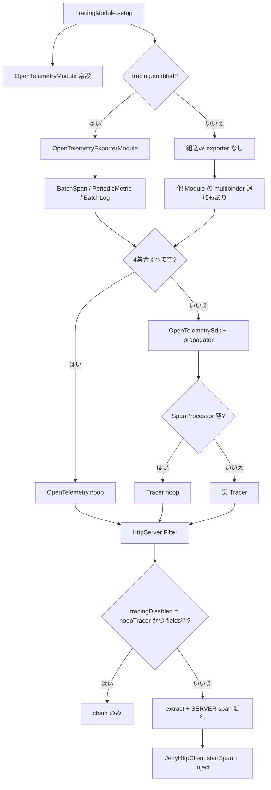

# 第21章 トレーシングと OpenTelemetry

> **本章で読むソース**
>
> - [tracing/src/main/java/io/airlift/tracing/TracingModule.java](https://github.com/airlift/airlift/blob/439/tracing/src/main/java/io/airlift/tracing/TracingModule.java)
> - [tracing/src/main/java/io/airlift/tracing/TracingEnabledConfig.java](https://github.com/airlift/airlift/blob/439/tracing/src/main/java/io/airlift/tracing/TracingEnabledConfig.java)
> - [tracing/src/main/java/io/airlift/tracing/Tracing.java](https://github.com/airlift/airlift/blob/439/tracing/src/main/java/io/airlift/tracing/Tracing.java)
> - [opentelemetry/src/main/java/io/airlift/opentelemetry/OpenTelemetryModule.java](https://github.com/airlift/airlift/blob/439/opentelemetry/src/main/java/io/airlift/opentelemetry/OpenTelemetryModule.java)
> - [opentelemetry/src/main/java/io/airlift/opentelemetry/OpenTelemetryExporterModule.java](https://github.com/airlift/airlift/blob/439/opentelemetry/src/main/java/io/airlift/opentelemetry/OpenTelemetryExporterModule.java)
> - [http-server/src/main/java/io/airlift/http/server/HttpServerModule.java](https://github.com/airlift/airlift/blob/439/http-server/src/main/java/io/airlift/http/server/HttpServerModule.java)
> - [http-server/src/main/java/io/airlift/http/server/tracing/TracingServletFilter.java](https://github.com/airlift/airlift/blob/439/http-server/src/main/java/io/airlift/http/server/tracing/TracingServletFilter.java)
> - [http-client/src/main/java/io/airlift/http/client/jetty/JettyHttpClient.java](https://github.com/airlift/airlift/blob/439/http-client/src/main/java/io/airlift/http/client/jetty/JettyHttpClient.java)

## この章の狙い

分散トレースは、プロセス内の SDK 組立てと、HTTP サーバ／クライアントへの接続の二層に分かれる。
本章では `TracingModule` が常に `OpenTelemetryModule` を入れ、`tracing.enabled` のときだけ exporter を足す配線を追う。
サーバ側は `TracingServletFilter`、クライアント側は `JettyHttpClient` の span 開始とヘッダ注入である。

## 前提

第8章の HttpServer フィルタ連鎖と、第15章の `JettyHttpClient` を読んだものとする。
OpenTelemetry の概念（Trace／Span／propagator）の用語は、実装がどうバインドするかを追うための入口として使う。

## TracingModule：常設 SDK と条件付き Exporter

`TracingModule` はサービス名と版を受け取り、まず `OpenTelemetryModule` を install する。
エクスポート用の `OpenTelemetryExporterModule` は `tracing.enabled` が真のときだけ追加する。

[tracing/src/main/java/io/airlift/tracing/TracingModule.java L26-L37](https://github.com/airlift/airlift/blob/439/tracing/src/main/java/io/airlift/tracing/TracingModule.java#L26-L37)

```java
    @Override
    protected void setup(Binder binder)
    {
        install(new OpenTelemetryModule(serviceName, serviceVersion));

        if (buildConfigObject(TracingEnabledConfig.class).isEnabled()) {
            binder.install(new OpenTelemetryExporterModule());
        }

        jsonBinder(binder).addSerializerBinding(Span.class).to(SpanSerializer.class);
        jsonBinder(binder).addDeserializerBinding(Span.class).to(SpanDeserializer.class);
    }
```

[tracing/src/main/java/io/airlift/tracing/TracingEnabledConfig.java L5-L19](https://github.com/airlift/airlift/blob/439/tracing/src/main/java/io/airlift/tracing/TracingEnabledConfig.java#L5-L19)

```java
public class TracingEnabledConfig
{
    private boolean enabled;

    public boolean isEnabled()
    {
        return enabled;
    }

    @Config("tracing.enabled")
    public TracingEnabledConfig setEnabled(boolean enabled)
    {
        this.enabled = enabled;
        return this;
    }
}
```

無効でも組込み exporter が無いだけで、他 Module が multibinder に足せば実 SDK になりうる。
テストや明示的 noop では `Tracing.noopTracer()` を直接使う経路もある。

[tracing/src/main/java/io/airlift/tracing/Tracing.java L11-L18](https://github.com/airlift/airlift/blob/439/tracing/src/main/java/io/airlift/tracing/Tracing.java#L11-L18)

```java
public final class Tracing
{
    private Tracing() {}

    public static Tracer noopTracer()
    {
        return TracerProvider.noop().get("noop");
    }
```

## OpenTelemetryModule：multibinding で SDK を組む

`configure` は空のセットバインダを用意するだけである。
`SpanProcessor`、`MetricReader`、`MetricProducer`、`LogRecordProcessor` を後から `@ProvidesIntoSet` で足せる。

[opentelemetry/src/main/java/io/airlift/opentelemetry/OpenTelemetryModule.java L66-L101](https://github.com/airlift/airlift/blob/439/opentelemetry/src/main/java/io/airlift/opentelemetry/OpenTelemetryModule.java#L66-L101)

```java
    @Override
    public void configure(Binder binder)
    {
        newSetBinder(binder, SpanProcessor.class);
        newSetBinder(binder, MetricReader.class);
        newSetBinder(binder, MetricProducer.class);
        newSetBinder(binder, LogRecordProcessor.class);
        configBinder(binder).bindConfig(OpenTelemetryConfig.class);
        configBinder(binder).bindConfig(BaggageConfig.class);
    }

    @Provides
    @Singleton
    public OpenTelemetry createOpenTelemetry(
            Set<SpanProcessor> spanProcessors,
            Set<MetricReader> metricReaders,
            Set<MetricProducer> metricProducers,
            Set<LogRecordProcessor> logRecordProcessors,
            SdkTracerProvider tracerProvider,
            SdkMeterProvider meterProvider,
            SdkLoggerProvider loggerProvider,
            BaggageConfig baggageConfig)
    {
        if (spanProcessors.isEmpty() && metricReaders.isEmpty() && metricProducers.isEmpty() && logRecordProcessors.isEmpty()) {
            return OpenTelemetry.noop();
        }

        return OpenTelemetrySdk.builder()
                .setTracerProvider(tracerProvider)
                .setMeterProvider(meterProvider)
                .setLoggerProvider(loggerProvider)
                .setPropagators(ContextPropagators.create(TextMapPropagator.composite(
                        W3CTraceContextPropagator.getInstance(),
                        new AllowlistBaggagePropagator(baggageConfig))))
                .build();
    }
```

四集合（`SpanProcessor`／`MetricReader`／`MetricProducer`／`LogRecordProcessor`）がすべて空のときだけ `OpenTelemetry.noop()` になる。
`Tracer` は `SpanProcessor` が空なら noop、`Meter` は `MetricReader` と `MetricProducer` が両方空なら noop である。
判定は API ごとに分かれる。
Resource は `NodeInfo` から service／instance／environment などを埋める。

[opentelemetry/src/main/java/io/airlift/opentelemetry/OpenTelemetryModule.java L103-L147](https://github.com/airlift/airlift/blob/439/opentelemetry/src/main/java/io/airlift/opentelemetry/OpenTelemetryModule.java#L103-L147)

```java
    @Provides
    @Singleton
    public Resource createResource(NodeInfo nodeInfo)
    {
        AttributesBuilder attributes = Attributes.builder()
                .put(ServiceAttributes.SERVICE_NAME, serviceName)
                .put(ServiceAttributes.SERVICE_VERSION, serviceVersion)
                .put(ServiceAttributes.SERVICE_INSTANCE_ID, nodeInfo.getNodeId())
                .put(DeploymentAttributes.DEPLOYMENT_ENVIRONMENT_NAME, nodeInfo.getEnvironment())
                .put(ProcessIncubatingAttributes.PROCESS_RUNTIME_NAME, System.getProperty("java.runtime.name"))
                .put(ProcessIncubatingAttributes.PROCESS_RUNTIME_VERSION, System.getProperty("java.runtime.version"))
                .put(ProcessIncubatingAttributes.PROCESS_RUNTIME_DESCRIPTION, processRuntime())
                .put(OsIncubatingAttributes.OS_TYPE, osType())
                .put(OsIncubatingAttributes.OS_NAME, OS_NAME.value())
                .put(OsIncubatingAttributes.OS_VERSION, OS_VERSION.value())
                .put(HostIncubatingAttributes.HOST_ARCH, hostArch());
        nodeInfo.getAnnotations().forEach((key, value) -> attributes.put("%s.%s".formatted(NODE_ANNOTATION_PREFIX, key), value));

        return Resource.getDefault().merge(Resource.create(attributes.build()));
    }

    @Provides
    @Singleton
    public SdkTracerProvider createTracerProvider(Resource resource, Set<SpanProcessor> spanProcessors, OpenTelemetryConfig config)
    {
        SdkTracerProviderBuilder builder = SdkTracerProvider.builder()
                .setSampler(parentBased(config.getSamplingRatio() == 1.0 ? alwaysOn() : traceIdRatioBased(config.getSamplingRatio())))
                .addSpanProcessor(SpanProcessor.composite(spanProcessors))
                .setResource(resource);
        config.getMaxAttributeValueLength().ifPresent(maxLength ->
                builder.setSpanLimits(SpanLimits.builder()
                        .setMaxAttributeValueLength(maxLength)
                        .build()));
        return builder.build();
    }

    @Provides
    @Singleton
    public Tracer createTracer(Set<SpanProcessor> spanProcessors, SdkTracerProvider tracerProvider)
    {
        if (spanProcessors.isEmpty()) {
            return TracerProvider.noop().get("noop");
        }
        return tracerProvider.get(serviceName);
    }
```

## OpenTelemetryExporterModule：OTLP をセットへ入れる

`tracing.enabled` が真だと組込みの OTLP exporter が `@ProvidesIntoSet` でセットに入る。
種類は Span＝`BatchSpanProcessor`、Metric＝`PeriodicMetricReader`、Log＝`BatchLogRecordProcessor` である。
プロトコルは gRPC か HTTP protobuf である。

[opentelemetry/src/main/java/io/airlift/opentelemetry/OpenTelemetryExporterModule.java L54-L91](https://github.com/airlift/airlift/blob/439/opentelemetry/src/main/java/io/airlift/opentelemetry/OpenTelemetryExporterModule.java#L54-L91)

```java
    @ProvidesIntoSet
    public static SpanProcessor createSpanProcessor(OpenTelemetryExporterConfig config, SdkMeterProvider meterProvider)
    {
        BatchSpanProcessorBuilder builder = BatchSpanProcessor.builder(createSpanExporter(config))
                .setMeterProvider(meterProvider);
        config.getSpanMaxExportBatchSize().ifPresent(builder::setMaxExportBatchSize);
        config.getSpanMaxQueueSize().ifPresent(builder::setMaxQueueSize);
        config.getSpanScheduleDelay().ifPresent(delay -> builder.setScheduleDelay(delay.toJavaTime()));
        builder.setInternalTelemetryVersion(InternalTelemetryVersion.LATEST);
        return builder.build();
    }

    static SpanExporter createSpanExporter(OpenTelemetryExporterConfig config)
    {
        return switch (config.getProtocol()) {
            case GRPC -> configureTls(
                    config,
                    OtlpGrpcSpanExporter.builder()
                            .setEndpoint(config.getEndpoint()),
                    OtlpGrpcSpanExporterBuilder::setTrustedCertificates,
                    OtlpGrpcSpanExporterBuilder::setClientTls)
                    .build();
            case HTTP_PROTOBUF -> configureTls(
                    config,
                    OtlpHttpSpanExporter.builder()
                            .setEndpoint(config.getEndpoint()),
                    OtlpHttpSpanExporterBuilder::setTrustedCertificates,
                    OtlpHttpSpanExporterBuilder::setClientTls)
                    .build();
        };
    }

    @ProvidesIntoSet
    public static MetricReader createMetricReader(OpenTelemetryExporterConfig config)
    {
        return PeriodicMetricReader.builder(createMetricExporter(config))
                .setInterval(config.getInterval().toJavaTime())
                .build();
    }
```

これで対応する集合が空でなくなり、実 SDK と W3C Trace Context＋baggage 許可リストの propagator を返しうる。
ただし `tracing.enabled` は組込み `OpenTelemetryExporterModule` を足すかだけを決める。
別 Module がいずれかの multibinder へ追加すれば、false でも noop にならない。
とくに Metric／Log だけを足した場合、`OpenTelemetry` は propagator を持つ一方 `Tracer` は noop になりうる。
そのとき `TracingServletFilter` の `tracingDisabled` は false のままなので、extract 経路は通る。

## HttpServer：TracingServletFilter を常時フィルタ集合へ

`HttpServerModule` は名前付き／無印に関わらず、`Filter` の multibinder へ `TracingServletFilter` を SINGLETON で足す。

[http-server/src/main/java/io/airlift/http/server/HttpServerModule.java L89-L100](https://github.com/airlift/airlift/blob/439/http-server/src/main/java/io/airlift/http/server/HttpServerModule.java#L89-L100)

```java
    @Override
    protected void setup(Binder binder)
    {
        binder.bind(qualifiedKey(qualifier, HttpServer.class))
                .toProvider(new HttpServerProvider(name, qualifier))
                .in(SINGLETON);
        newOptionalBinder(binder, qualifiedKey(qualifier, ClientCertificate.class)).setDefault().toInstance(ClientCertificate.NONE);
        newExporter(binder).export(qualifiedKey(qualifier, HttpServer.class)).withGeneratedName();
        newSetBinder(binder, qualifiedKey(qualifier, ServerFeature.class));
        newSetBinder(binder, qualifiedKey(qualifier, Filter.class)).addBinding()
                .to(TracingServletFilter.class)
                .in(SINGLETON);
```

フィルタ本体は、noop Tracer かつ propagator fields が空のときだけリクエスト処理を丸ごとスキップする。
propagator がフィールドを持つ（実 `OpenTelemetry`）なら、Tracer が noop でも extract は走る。

[http-server/src/main/java/io/airlift/http/server/tracing/TracingServletFilter.java L57-L149](https://github.com/airlift/airlift/blob/439/http-server/src/main/java/io/airlift/http/server/tracing/TracingServletFilter.java#L57-L149)

```java
    @Inject
    public TracingServletFilter(OpenTelemetry openTelemetry, Tracer tracer)
    {
        this.propagator = openTelemetry.getPropagators().getTextMapPropagator();
        this.tracer = requireNonNull(tracer, "tracer is null");
        // A noop tracer combined with a propagator that carries no fields cannot produce spans,
        // attributes, or extracted contexts, so all per-request work can be skipped. The noop
        // TracerProvider returns a singleton tracer, which is how both OpenTelemetry.noop() and
        // io.airlift.tracing.Tracing.noopTracer() create tracers; if a different noop
        // implementation is bound, the filter simply stays active.
        this.tracingDisabled = tracer == TracerProvider.noop().get("noop") && propagator.fields().isEmpty();
    }

    // ... (中略) ...

    @Override
    public void doFilter(HttpServletRequest request, HttpServletResponse response, FilterChain chain)
            throws IOException, ServletException
    {
        if (tracingDisabled) {
            chain.doFilter(request, response);
            return;
        }

        Context parent = propagator.extract(Context.root(), request, ServletTextMapGetter.INSTANCE);
        String method = request.getMethod().toUpperCase(ENGLISH);
        Baggage baggage = Baggage.fromContext(parent);

        SpanBuilder spanBuilder = tracer.spanBuilder(method + " " + request.getRequestURI())
                .setParent(parent)
                .setSpanKind(SpanKind.SERVER)
                .setAttribute(HttpAttributes.HTTP_REQUEST_METHOD, method)
                .setAttribute(UrlAttributes.URL_SCHEME, request.getScheme())
                .setAttribute(ServerAttributes.SERVER_ADDRESS, request.getServerName())
                .setAttribute(ServerAttributes.SERVER_PORT, getPort(request))
                .setAttribute(ClientAttributes.CLIENT_ADDRESS, request.getRemoteAddr())
                .setAttribute(NetworkAttributes.NETWORK_PROTOCOL_NAME, "http");
        baggage.forEach((key, entry) -> spanBuilder.setAttribute(BAGGAGE_ATTRIBUTE_PREFIX + key, entry.getValue()));

        // ... (中略) ...

        Span span = spanBuilder.startSpan();
        // Add to request attributes for TracingFilter to be able to update Span attributes
        request.setAttribute(REQUEST_SPAN, span);

        // Make the extracted parent context current (not just the span) so that baggage propagated
        // from the caller stays in scope for the request and is visible to handlers and logging.
        try (Scope ignored = Context.current()
                .with(baggage)
                .with(span)
                .makeCurrent()) {
            // a non-recording span drops all attributes, so the response wrapper that exists
            // only to record response attributes is not needed
            chain.doFilter(request, span.isRecording() ? new TracingHttpServletResponse(response, span) : response);
        }
        catch (Throwable t) {
            span.setStatus(StatusCode.ERROR, t.getMessage());
            span.recordException(t, Attributes.of(EXCEPTION_ESCAPED, true));
            throw t;
        }
        finally {
            span.end();
        }
    }
```

recording でない span ではレスポンスラッパーを付けない。
ステータスや Content-Length の記録コストを省略する。

## JettyHttpClient：CLIENT span とヘッダ注入

クライアントは実行のたびに `startSpan` し、`injectTracing` で現在コンテキストをリクエストヘッダへ載せる。
propagator が注入先フィールドを持たないときは Request を作り直さない。

[http-client/src/main/java/io/airlift/http/client/jetty/JettyHttpClient.java L954-L979](https://github.com/airlift/airlift/blob/439/http-client/src/main/java/io/airlift/http/client/jetty/JettyHttpClient.java#L954-L979)

```java
    private Span startSpan(Request request)
    {
        int port = normalizePort(request.getUri().getScheme(), request.getUri().getPort());
        return request.getSpanBuilder()
                .orElseGet(() -> tracer.spanBuilder(name + " " + request.getMethod()))
                .setSpanKind(SpanKind.CLIENT)
                .setAttribute(CLIENT_NAME, name)
                .setAttribute(UrlAttributes.URL_FULL, request.getUri().toString())
                .setAttribute(HttpAttributes.HTTP_REQUEST_METHOD, request.getMethod())
                .setAttribute(ServerAttributes.SERVER_ADDRESS, request.getUri().getHost())
                .setAttribute(ServerAttributes.SERVER_PORT, (long) port)
                .startSpan();
    }

    @SuppressWarnings("DataFlowIssue")
    private Request injectTracing(Request request, Span span)
    {
        // a propagator that injects no headers (e.g. noop telemetry) does not need the request rebuilt
        if (propagator.fields().isEmpty()) {
            return request;
        }
        Context context = Context.current().with(span);
        Request.Builder builder = Request.Builder.fromRequest(request);
        propagator.inject(context, builder, (carrier, headerName, value) -> carrier.addHeader(HeaderName.of(headerName), value));
        return builder.build();
    }
```

サーバで extract した親コンテキストが Scope に載っていれば、ここでの CLIENT span は同じ Trace に繋がる。

## 処理の流れ



## 高速化と最適化の工夫

`tracingDisabled` が真のときだけ、フィルタは毎リクエストの extract／spanBuilder を省く。
条件は noop Tracer かつ propagator fields 空である。
Metric／Log だけ有効な構成ではこのスキップが効かず、extract は走る。
クライアントは propagator fields が空なら immutable な `Request` を rebuild しない。

## まとめ

- `TracingModule` は `OpenTelemetryModule` を常設し、`tracing.enabled` のときだけ組込み exporter を足す。
- `OpenTelemetry.noop()` は四集合がすべて空のときだけである。
- `Tracer`／`Meter` の noop 判定はそれぞれ SpanProcessor、MetricReader＋MetricProducer で分かれる。
- `HttpServerModule` は `TracingServletFilter` を Filter 集合へ常時追加する。
- フィルタの全スキップは noop Tracer かつ fields 空に限り、そうでなければ extract する。
- `JettyHttpClient` は CLIENT span を立て、propagator があればヘッダへ inject する。

## 関連する章

- [第8章 HttpServerModule と Provider](../part04-http-server/08-http-server-module.md)
- [第15章 JettyHttpClient](../part06-http-client/15-jetty-http-client.md)
- [第20章 JMX と OpenMetrics 公開](20-jmx-openmetrics.md)
- [第22章 ログ](22-logging.md)
