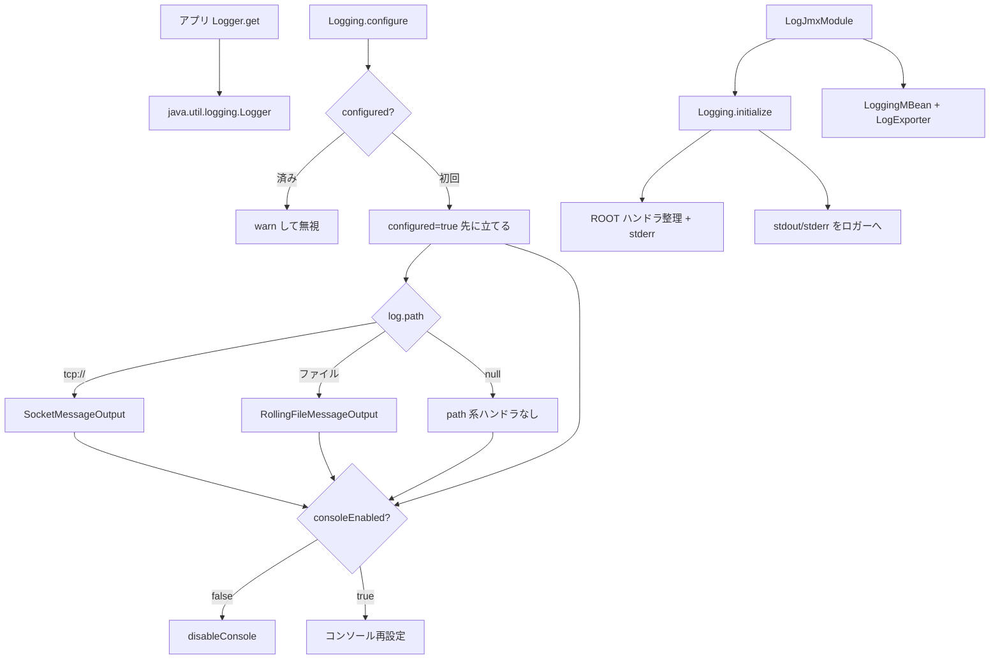

# 第22章 ログ

> **本章で読むソース**
>
> - [log/src/main/java/io/airlift/log/Logger.java](https://github.com/airlift/airlift/blob/439/log/src/main/java/io/airlift/log/Logger.java)
> - [log-manager/src/main/java/io/airlift/log/Logging.java](https://github.com/airlift/airlift/blob/439/log-manager/src/main/java/io/airlift/log/Logging.java)
> - [log-manager/src/main/java/io/airlift/log/LoggingConfiguration.java](https://github.com/airlift/airlift/blob/439/log-manager/src/main/java/io/airlift/log/LoggingConfiguration.java)
> - [log-manager/src/main/java/io/airlift/log/LogJmxModule.java](https://github.com/airlift/airlift/blob/439/log-manager/src/main/java/io/airlift/log/LogJmxModule.java)

## この章の狙い

ログは、呼び出し側の facade と、プロセス全体のハンドラ構成が別モジュールに分かれている。
`log` モジュールの **Logger** は `java.util.logging.Logger` への薄い API である。
`log-manager` の **Logging**／`LoggingConfiguration`／`LogJmxModule` がルートハンドラ、ファイル／ソケット出力、JMX 公開を担う。
本章ではその境界と、configure の一回限り契約（失敗時もロールバックしない点を含む）を押さえる。

## 前提

Maven モジュールとして `log` と `log-manager` が分かれている。
依存の向きは、アプリコードが `Logger` だけを使い、起動時に `Logging.configure` と Guice の `LogJmxModule` が裏側を組み立てる形である。

## Logger：呼び出し側 facade

`Logger.get` はクラス名または任意名で JUL のロガーを包む。
`get()` は `StackWalker` で呼び出し元クラスを取る。

[log/src/main/java/io/airlift/log/Logger.java L31-L70](https://github.com/airlift/airlift/blob/439/log/src/main/java/io/airlift/log/Logger.java#L31-L70)

```java
public class Logger
{
    private final java.util.logging.Logger logger;

    Logger(java.util.logging.Logger logger)
    {
        this.logger = requireNonNull(logger, "logger is null");
    }

    /**
     * Gets a logger named after a class' fully qualified name.
     *
     * @param clazz the class
     * @return the named logger
     */
    public static Logger get(Class<?> clazz)
    {
        return get(clazz.getName());
    }

    /**
     * Gets a logger named after a caller class' fully qualified name.
     *
     * @return the named logger
     */
    public static Logger get()
    {
        return get(StackWalker.getInstance(RETAIN_CLASS_REFERENCE).getCallerClass());
    }

    /**
     * Gets a named logger
     *
     * @param name the name of the logger
     * @return the named logger
     */
    public static Logger get(String name)
    {
        return new Logger(java.util.logging.Logger.getLogger(name));
    }
```

フォーマット付きの `info`／`warn`／`error`／`debug` は、レベルが無効なら `formatMessage` に入らない。
無効時の文字列組立てを避ける。

[log/src/main/java/io/airlift/log/Logger.java L158-L166](https://github.com/airlift/airlift/blob/439/log/src/main/java/io/airlift/log/Logger.java#L158-L166)

```java
    @FormatMethod
    public void info(String format, Object... args)
    {
        // Avoid potentially expensive formatMessage call if log level is disabled
        if (!logger.isLoggable(INFO)) {
            return;
        }
        logger.log(INFO, formatMessage(format, "INFO", args));
    }
```

[log/src/main/java/io/airlift/log/Logger.java L268-L344](https://github.com/airlift/airlift/blob/439/log/src/main/java/io/airlift/log/Logger.java#L268-L344)

```java
    @FormatMethod
    public void error(Throwable exception, String format, Object... args)
    {
        // Avoid potentially expensive formatMessage call if log level is disabled
        if (!logger.isLoggable(SEVERE)) {
            return;
        }
        logger.log(SEVERE, formatMessage(format, "ERROR", args), exception);
    }

    /**
     * Logs a message at ERROR level. The value of {@code exception.getMessage()} will be used as the log message.
     * <p>
     * Usage example:
     * <pre>
     *    logger.error(e);
     * </pre>
     *
     * @param exception an exception associated with the error being logged
     */
    public void error(Throwable exception)
    {
        // Avoid potentially expensive getMessage call if log level is disabled
        if (!logger.isLoggable(SEVERE)) {
            return;
        }
        logger.log(SEVERE, exception.getMessage(), exception);
    }

    // ... (中略) ...

    private String formatMessage(String format, String level, Object[] args)
    {
        try {
            return format.formatted(args);
        }
        catch (IllegalFormatException e) {
            logger.log(SEVERE, "Invalid format string while trying to log: %s '%s' %s".formatted(level, format, asList(args)), e);
            return "'%s' %s".formatted(format, asList(args));
        }
    }
}
```

フォーマット不正でも呼び出し側を落とさず、SEVERE で記録してプレースホルダ文字列へ落とす。

## Logging：プロセス全体のトンネル

`Logging.initialize` はシングルトンを作り、ルートロガーの既定ハンドラを外して stderr へ出し、stdout／stderr を名前付きロガーへリダイレクトする。

[log-manager/src/main/java/io/airlift/log/Logging.java L54-L150](https://github.com/airlift/airlift/blob/439/log-manager/src/main/java/io/airlift/log/Logging.java#L54-L150)

```java
/**
 * Initializes the logging subsystem.
 * <p>
 * java.util.Logging, System.out and System.err are tunneled through the logging system.
 * <p>
 * System.out and System.err are assigned to loggers named "stdout" and "stderr", respectively.
 */
public class Logging
{
    private static final Logger log = Logger.get(Logging.class);
    private static final String ROOT_LOGGER_NAME = "";
    private static final java.util.logging.Logger ROOT = java.util.logging.Logger.getLogger("");

    private static Logging instance;
    private static final PrintStream stdErr = System.err;

    // hard reference to loggers for which we set the level
    @GuardedBy("this")
    private final Map<String, java.util.logging.Logger> loggers = new HashMap<>();

    @GuardedBy("this")
    private OutputStreamHandler consoleHandler;

    @GuardedBy("this")
    private boolean configured;

    private final SettableFuture<MBeanExporter> mBeanExporterAvailableFuture = SettableFuture.create();
    private final SettableFuture<List<MBeanExport>> mBeanExportsFuture = SettableFuture.create();

    /**
     * Sets up default logging:
     * <p>
     * - INFO level
     * - Log entries are written to stderr
     *
     * @return the logging system singleton
     */
    public static synchronized Logging initialize()
    {
        if (instance == null) {
            instance = new Logging();
        }

        return instance;
    }

    private Logging()
    {
        ROOT.setLevel(Level.INFO.toJulLevel());
        for (Handler handler : ROOT.getHandlers()) {
            ROOT.removeHandler(handler);
        }

        enableConsole();
        log.info("Logging to stderr");

        redirectStdStreams();
    }

    // ... (中略) ...

    private static void redirectStdStreams()
    {
        System.setOut(new PrintStream(new LoggingOutputStream(Logger.get("stdout")), true));
        System.setErr(new PrintStream(new LoggingOutputStream(Logger.get("stderr")), true));
    }
```

レベル変更用に名前付き JUL ロガーへの強参照を `loggers` に残す。
弱参照だけだと GC でレベル設定が消える。

## LoggingConfiguration と configure：出力先の一度限りの決定

設定は `log.path`、サイズ上限、圧縮、レベルファイル、フォーマットなどを持つ。

[log-manager/src/main/java/io/airlift/log/LoggingConfiguration.java L35-L70](https://github.com/airlift/airlift/blob/439/log-manager/src/main/java/io/airlift/log/LoggingConfiguration.java#L35-L70)

```java
public class LoggingConfiguration
{
    private boolean consoleEnabled = true;
    private String logPath;
    private DataSize maxSize = DataSize.of(100, MEGABYTE);
    private DataSize maxTotalSize = DataSize.of(1, GIGABYTE);
    private CompressionType compression = CompressionType.GZIP;
    private String levelsFile;
    private String logAnnotationFile;
    private Format format = Format.TEXT;
    private Format consoleFormat = Format.TEXT;

    public boolean isConsoleEnabled()
    {
        return consoleEnabled;
    }

    @Config("log.enable-console")
    public LoggingConfiguration setConsoleEnabled(boolean consoleEnabled)
    {
        this.consoleEnabled = consoleEnabled;
        return this;
    }

    public String getLogPath()
    {
        return logPath;
    }

    @LegacyConfig("log.output-file")
    @Config("log.path")
    public LoggingConfiguration setLogPath(String logPath)
    {
        this.logPath = logPath;
        return this;
    }
```

`configure` は先頭で `configured = true` を立て、二度目を無視する。
この立て方は注釈ファイル読込み、`logToSocket`／`logToFile`、`levelsFile` 読込みより前である。
それらが例外を投げてもフラグは true のままで、再 configure は警告して無視される。
失敗位置によってはハンドラ追加が部分反映済みのままロールバックしない。

`log.path` が選ぶのはファイル対 TCP だけである。
`log.enable-console`（`consoleEnabled`）は独立で、既定ではファイルまたは TCP の BufferedHandler とコンソールを併用できる。

[log-manager/src/main/java/io/airlift/log/Logging.java L258-L319](https://github.com/airlift/airlift/blob/439/log-manager/src/main/java/io/airlift/log/Logging.java#L258-L319)

```java
    public synchronized void configure(LoggingConfiguration config)
    {
        if (configured) {
            log.warn("Logging already configured; ignoring new configuration.");
            return;
        }
        configured = true;

        List<LogMBeanExport> mBeanExportCollector = new ArrayList<>();

        Map<String, String> logAnnotations = ImmutableMap.of();
        if (config.getLogAnnotationFile() != null) {
            try {
                logAnnotations = replaceEnvironmentVariables(loadPropertiesFrom(config.getLogAnnotationFile()));
            }
            catch (IOException e) {
                throw new UncheckedIOException(e);
            }
        }

        if (config.getLogPath() != null) {
            if (config.getLogPath().startsWith("tcp://")) {
                logToSocket(config.getLogPath(), config.getFormat().createFormatter(logAnnotations, false), mBeanExportCollector);
            }
            else {
                logToFile(
                        config.getLogPath(),
                        config.getMaxSize(),
                        config.getMaxTotalSize(),
                        config.getCompression(),
                        config.getFormat().createFormatter(logAnnotations, false),
                        mBeanExportCollector);
            }
        }

        if (!config.isConsoleEnabled()) {
            disableConsole();
        }
        else {
            // reinitialize console handler with provided configs and redirect standard streams to a reconfigured logger
            resetStdStreams();
            disableConsole();
            enableConsole(config.getConsoleFormat().createFormatter(logAnnotations, true));
            redirectStdStreams();
        }

        if (config.getLevelsFile() != null) {
            try {
                setLevels(config.getLevelsFile());
            }
            catch (IOException e) {
                throw new UncheckedIOException(e);
            }
        }

        // Export MBeans when the exporter becomes available
        mBeanExportsFuture.setFuture(transform(
                mBeanExporterAvailableFuture,
                exporter -> mBeanExportCollector.stream()
                        .map(export -> exporter.exportWithGeneratedName(export.object(), export.type(), export.name()))
                        .collect(toImmutableList()),
                directExecutor()));
    }
```

ファイル／ソケットハンドラは `BufferedHandler` 越しに付け、エラーは退避した本物の `System.err`（`stdErr`）へ報告する。
コンソール無効化のあとも、ハンドラ自身の失敗経路は残る。

## LogJmxModule：Guice からの導線

`LogJmxModule` は `Logging.initialize()` を Provider で返し、`LoggingMBean` を export する。
`LogExporter` は `MBeanExporter` が揃った時点で `exportMBeans` し、`@PreDestroy` で unexport する。

[log-manager/src/main/java/io/airlift/log/LogJmxModule.java L30-L64](https://github.com/airlift/airlift/blob/439/log-manager/src/main/java/io/airlift/log/LogJmxModule.java#L30-L64)

```java
public class LogJmxModule
        implements Module
{
    @Override
    public void configure(Binder binder)
    {
        binder.bind(LoggingMBean.class).in(Scopes.SINGLETON);
        newExporter(binder).export(LoggingMBean.class).as("io.airlift.log:name=Logging");
        binder.bind(LogExporter.class).asEagerSingleton();
    }

    @Provides
    @Singleton
    public Logging getLogging()
    {
        return Logging.initialize();
    }

    public static class LogExporter
    {
        private final Logging logging;

        @Inject
        public LogExporter(Logging logging, MBeanExporter exporter)
        {
            this.logging = requireNonNull(logging, "logging is null");
            logging.exportMBeans(requireNonNull(exporter, "exporter is null"));
        }

        @PreDestroy
        public void destroy()
        {
            logging.unexportMBeans();
        }
    }
}
```

Logging の初期化が MBean exporter より先でも、`SettableFuture` で遅延エクスポートできる。
モジュール境界としては、facade は `log`、プロセス構成と JMX 配線は `log-manager` である。

## 処理の流れ



## 高速化と最適化の工夫

`Logger` の可変長引数メソッドは、レベルが無効なら `String.formatted` を呼ばない。
ホットパスでデバッグログを残しても、出力オフ時のフォーマットコストを払わない。
`BufferedHandler` 経由のファイル出力は、呼び出しスレッドと書き込みを分離する（実装詳細は `log-manager` の BufferedHandler 側）。

## まとめ

- `log` の `Logger` は JUL facade であり、レベル無効時はフォーマットしない。
- `log-manager` の `Logging` がルートハンドラ、標準ストリームのトンネル、configure を持つ。
- `configure` は `configured=true` を先に立て、失敗しても再試行せず部分反映のままになりうる。
- `log.path` はファイル対 TCP、`consoleEnabled` は独立で既定では併用できる。
- `LogJmxModule` が `Logging` シングルトンと MBean 導線を Guice に載せる。
- facade（`log`）と構成（`log-manager`）は Maven モジュールとしてファイルが分かれる。

## 関連する章

- [第2章 Bootstrap と Injector 構築](../part01-di-lifecycle/02-bootstrap.md)
- [第3章 ライフサイクル管理とリソース解放](../part01-di-lifecycle/03-lifecycle.md)
- [第20章 JMX と OpenMetrics 公開](20-jmx-openmetrics.md)
- [第21章 トレーシングと OpenTelemetry](21-tracing.md)
