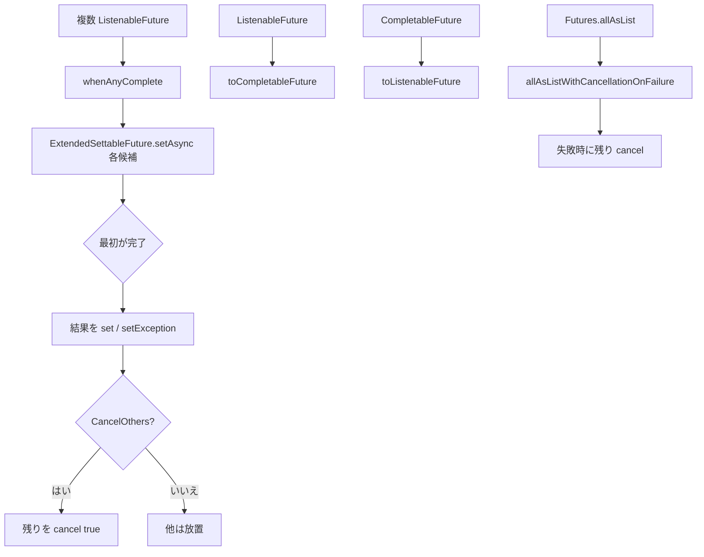

# 第23章 Future ユーティリティ

> **本章で読むソース**
>
> - [concurrent/src/main/java/io/airlift/concurrent/MoreFutures.java](https://github.com/airlift/airlift/blob/439/concurrent/src/main/java/io/airlift/concurrent/MoreFutures.java)
> - [concurrent/src/main/java/io/airlift/concurrent/ExtendedSettableFuture.java](https://github.com/airlift/airlift/blob/439/concurrent/src/main/java/io/airlift/concurrent/ExtendedSettableFuture.java)

## この章の狙い

非同期処理の橋渡しは Guava の `ListenableFuture` と JDK の `CompletableFuture` のあいだに跨る。
**MoreFutures** は変換、callback、完了合成、タイムアウト、値の取り出しを一箇所に集める。
完了合成の芯になるのが **ExtendedSettableFuture** である。
本章では代表的な入口から実装までを追う。

## 前提

Guava Futures の `Futures.transform`／`addCallback`／`allAsList` の基本を知っているものとする。
Executor 自体の背圧は第24章である。

## ExtendedSettableFuture：結果の転送とキャンセル伝播

`ExtendedSettableFuture` は `AbstractFuture` を公開 API として扱いやすくした型である。
`set`／`setException` を public にし、`setAsync` で他の `ListenableFuture` の結果を転写する。

[concurrent/src/main/java/io/airlift/concurrent/ExtendedSettableFuture.java L13-L69](https://github.com/airlift/airlift/blob/439/concurrent/src/main/java/io/airlift/concurrent/ExtendedSettableFuture.java#L13-L69)

```java
public final class ExtendedSettableFuture<V>
        extends AbstractFuture<V>
{
    public static <V> ExtendedSettableFuture<V> create()
    {
        return new ExtendedSettableFuture<>();
    }

    private ExtendedSettableFuture() {}

    @Override
    public boolean set(@Nullable V value)
    {
        return super.set(value);
    }

    @Override
    public boolean setException(Throwable throwable)
    {
        return super.setException(throwable);
    }

    /**
     * Sets this current future with the result of the delegate.
     * <p>
     * Values and exceptions are both propagated to this Future.
     * If this Future is cancelled, than the delegate will also be cancelled
     * with the same interrupt flag.
     */
    public void setAsync(ListenableFuture<? extends V> delegate)
    {
        delegate.addListener(() -> {
            if (super.isDone()) {
                // Opportunistically avoid calling getDone. This is critical for the performance
                // of whenAnyCompleteCancelOthers because calling getDone for cancelled Future
                // constructs CancellationException and populates stack trace.
                // See BenchmarkWhenAnyCompleteCancelOthers for benchmark numbers.
                return;
            }

            try {
                set(getDone(delegate));
            }
            catch (ExecutionException e) {
                setException(e.getCause());
            }
            catch (RuntimeException | Error e) {
                setException(e);
            }
        }, directExecutor());

        super.addListener(() -> {
            if (super.isCancelled()) {
                delegate.cancel(super.wasInterrupted());
            }
        }, directExecutor());
    }
```

自分側がすでに完了しているときは `getDone` を呼ばない。
`whenAnyCompleteCancelOthers` で多数を cancel したあと、スタックトレース付き `CancellationException` を大量生成しないためである。

## whenAnyComplete：最初の完了を拾う

複数 future のうちどれかが終われば十分な場面向けである。
各候補を同じ `ExtendedSettableFuture` に `setAsync` する。

[concurrent/src/main/java/io/airlift/concurrent/MoreFutures.java L303-L338](https://github.com/airlift/airlift/blob/439/concurrent/src/main/java/io/airlift/concurrent/MoreFutures.java#L303-L338)

```java
    public static <V> ListenableFuture<V> whenAnyComplete(Iterable<? extends ListenableFuture<? extends V>> futures)
    {
        requireNonNull(futures, "futures is null");
        checkArgument(stream(futures).findAny().isPresent(), "futures is empty");

        ExtendedSettableFuture<V> firstCompletedFuture = ExtendedSettableFuture.create();
        for (ListenableFuture<? extends V> future : futures) {
            firstCompletedFuture.setAsync(future);
        }
        return firstCompletedFuture;
    }

    /**
     * Creates a future that completes when the first future completes either normally
     * or exceptionally. All other futures are cancelled when one completes.
     * Cancellation of the returned future propagates to the supplied futures.
     * <p>
     * It is critical for the performance of this function that
     * {@code guava.concurrent.generate_cancellation_cause} is false,
     * which is the default since Guava v20.
     */
    public static <V> ListenableFuture<V> whenAnyCompleteCancelOthers(Iterable<? extends ListenableFuture<? extends V>> futures)
    {
        requireNonNull(futures, "futures is null");
        checkArgument(stream(futures).findAny().isPresent(), "futures is empty");

        // wait for the first task to unblock and then cancel all futures to free up resources
        ListenableFuture<V> anyComplete = whenAnyComplete(futures);
        anyComplete.addListener(
                () -> {
                    for (ListenableFuture<?> future : futures) {
                        future.cancel(true);
                    }
                },
                directExecutor());
        return anyComplete;
    }
```

`CancelOthers` 側は勝利したあと残りを cancel し、資源を解放する。
Javadoc が指摘するように、Guava の cancellation cause 生成がオンだとコストが跳ねる。

## mirror／変換／callback

片方向のミラーとキャンセルの逆伝播、Listenable と Completable の相互変換、成功／失敗 callback が並ぶ。
相互変換では、値／例外の転写と、返却側 cancel の逆伝播を分けて読む。

[concurrent/src/main/java/io/airlift/concurrent/MoreFutures.java L74-L106](https://github.com/airlift/airlift/blob/439/concurrent/src/main/java/io/airlift/concurrent/MoreFutures.java#L74-L106)

```java
    public static <X, Y> void propagateCancellation(ListenableFuture<? extends X> source, Future<? extends Y> destination, boolean mayInterruptIfRunning)
    {
        source.addListener(() -> {
            if (source.isCancelled()) {
                destination.cancel(mayInterruptIfRunning);
            }
        }, directExecutor());
    }

    /**
     * Mirrors all results of the source Future to the destination Future.
     * <p>
     * This also propagates cancellations from the destination Future back to the source Future.
     */
    public static <T> void mirror(ListenableFuture<? extends T> source, SettableFuture<? super T> destination, boolean mayInterruptIfRunning)
    {
        FutureCallback<T> callback = new FutureCallback<>()
        {
            @Override
            public void onSuccess(@Nullable T result)
            {
                destination.set(result);
            }

            @Override
            public void onFailure(Throwable t)
            {
                destination.setException(t);
            }
        };
        Futures.addCallback(source, callback, directExecutor());
        propagateCancellation(destination, source, mayInterruptIfRunning);
    }
```

[concurrent/src/main/java/io/airlift/concurrent/MoreFutures.java L472-L551](https://github.com/airlift/airlift/blob/439/concurrent/src/main/java/io/airlift/concurrent/MoreFutures.java#L472-L551)

```java
    public static <V> CompletableFuture<V> toCompletableFuture(ListenableFuture<V> listenableFuture)
    {
        requireNonNull(listenableFuture, "listenableFuture is null");

        CompletableFuture<V> future = new CompletableFuture<>();
        future.exceptionally(throwable -> {
            if (throwable instanceof CancellationException) {
                listenableFuture.cancel(true);
            }
            return null;
        });

        FutureCallback<V> callback = new FutureCallback<>()
        {
            @Override
            public void onSuccess(V result)
            {
                future.complete(result);
            }

            @Override
            public void onFailure(Throwable t)
            {
                future.completeExceptionally(t);
            }
        };
        Futures.addCallback(listenableFuture, callback, directExecutor());
        return future;
    }

    /**
     * Converts a CompletableFuture to a ListenableFuture. Cancellation of the
     * ListenableFuture will be propagated to the CompletableFuture.
     */
    public static <V> ListenableFuture<V> toListenableFuture(CompletableFuture<V> completableFuture)
    {
        requireNonNull(completableFuture, "completableFuture is null");
        SettableFuture<V> future = SettableFuture.create();
        propagateCancellation(future, completableFuture, true);

        completableFuture.whenComplete((value, exception) -> {
            if (exception != null) {
                future.setException(exception);
            }
            else {
                future.set(value);
            }
        });
        return future;
    }

    // ... (中略) ...

    public static <T> void addSuccessCallback(ListenableFuture<T> future, Consumer<T> successCallback, Executor executor)
    {
        requireNonNull(future, "future is null");
        requireNonNull(successCallback, "successCallback is null");

        FutureCallback<T> callback = new FutureCallback<>()
        {
            @Override
            public void onSuccess(@Nullable T result)
            {
                successCallback.accept(result);
            }

            @Override
            public void onFailure(Throwable t) {}
        };
        Futures.addCallback(future, callback, executor);
    }
```

`toCompletableFuture` は値と例外を返却側へ転写し、返却側の `CancellationException` では元 `ListenableFuture` を `cancel(true)` する。
`toListenableFuture` は返却側（`SettableFuture`）の cancel を `propagateCancellation` で元 `CompletableFuture` へ伝える。
一方、元 `CompletableFuture` が `CancellationException` で終わっても返却側は `setException` するだけであり、Listenable の cancel 状態として転写する実装ではない。

`addSuccessCallback` の無引数オーバーロードは `directExecutor` 固定である。
重い処理をそのまま渡すとコールバック実行スレッドを塞ぐ。

## 値の取り出しと allAsListWithCancellationOnFailure

同期待機は `getFutureValue`、完了済みの取り出しは `getDone`／`tryGetFutureValue` である。
合成では失敗時に残りを cancel する変種がある。

[concurrent/src/main/java/io/airlift/concurrent/MoreFutures.java L186-L204](https://github.com/airlift/airlift/blob/439/concurrent/src/main/java/io/airlift/concurrent/MoreFutures.java#L186-L204)

```java
    public static <V, E extends Exception> V getFutureValue(Future<V> future, Class<E> exceptionType)
            throws E
    {
        requireNonNull(future, "future is null");
        requireNonNull(exceptionType, "exceptionType is null");

        try {
            return future.get();
        }
        catch (InterruptedException e) {
            Thread.currentThread().interrupt();
            throw new RuntimeException("interrupted", e);
        }
        catch (ExecutionException e) {
            Throwable cause = e.getCause() == null ? e : e.getCause();
            throwIfInstanceOf(cause, exceptionType);
            throwIfUnchecked(cause);
            throw new RuntimeException(cause);
        }
    }
```

[concurrent/src/main/java/io/airlift/concurrent/MoreFutures.java L630-L636](https://github.com/airlift/airlift/blob/439/concurrent/src/main/java/io/airlift/concurrent/MoreFutures.java#L630-L636)

```java
    public static <V> ListenableFuture<List<V>> allAsListWithCancellationOnFailure(Iterable<? extends ListenableFuture<? extends V>> futures)
    {
        List<ListenableFuture<? extends V>> futuresSnapshot = ImmutableList.copyOf(futures);
        ListenableFuture<List<V>> listFuture = Futures.allAsList(futuresSnapshot);
        addExceptionCallback(listFuture, () -> futuresSnapshot.forEach(future -> future.cancel(true)));
        return listFuture;
    }
```

第24章の `AsyncSemaphore.processAll` がこの合成を使う。

## addTimeout：期限切れ時の代替値

Listenable 版は Guava `FluentFuture.withTimeout` に載せる。

[concurrent/src/main/java/io/airlift/concurrent/MoreFutures.java L422-L435](https://github.com/airlift/airlift/blob/439/concurrent/src/main/java/io/airlift/concurrent/MoreFutures.java#L422-L435)

```java
    public static <T> ListenableFuture<T> addTimeout(ListenableFuture<T> future, Callable<T> onTimeout, Duration timeout, ScheduledExecutorService executorService)
    {
        AsyncFunction<TimeoutException, T> timeoutHandler = _ -> {
            try {
                return immediateFuture(onTimeout.call());
            }
            catch (Throwable throwable) {
                return immediateFailedFuture(throwable);
            }
        };
        return FluentFuture.from(future)
                .withTimeout(timeout.toMillis(), MILLISECONDS, executorService)
                .catchingAsync(TimeoutException.class, timeoutHandler, directExecutor());
    }
```

Completable 版は完了済みならそのまま返し、未完了なら `unmodifiableFuture(future, true)` で返却側を作る。
元から返却へ値／例外を転送し、返却側 cancel は元へ伝播する。
期限では `TimeoutFutureTask` を schedule し、元が完了したらタイムアウトタスクを cancel する。

[concurrent/src/main/java/io/airlift/concurrent/MoreFutures.java L132-L153](https://github.com/airlift/airlift/blob/439/concurrent/src/main/java/io/airlift/concurrent/MoreFutures.java#L132-L153)

```java
    public static <V> CompletableFuture<V> unmodifiableFuture(CompletableFuture<V> future, boolean propagateCancel)
    {
        requireNonNull(future, "future is null");

        Function<Boolean, Boolean> onCancelFunction;
        if (propagateCancel) {
            onCancelFunction = future::cancel;
        }
        else {
            onCancelFunction = _ -> false;
        }

        UnmodifiableCompletableFuture<V> unmodifiableFuture = new UnmodifiableCompletableFuture<>(onCancelFunction);
        future.whenComplete((value, exception) -> {
            if (exception != null) {
                unmodifiableFuture.internalCompleteExceptionally(exception);
            }
            else {
                unmodifiableFuture.internalComplete(value);
            }
        });
        return unmodifiableFuture;
    }
```

[concurrent/src/main/java/io/airlift/concurrent/MoreFutures.java L443-L465](https://github.com/airlift/airlift/blob/439/concurrent/src/main/java/io/airlift/concurrent/MoreFutures.java#L443-L465)

```java
    public static <T> CompletableFuture<T> addTimeout(CompletableFuture<T> future, Callable<T> onTimeout, Duration timeout, ScheduledExecutorService executorService)
    {
        requireNonNull(future, "future is null");
        requireNonNull(onTimeout, "timeoutValue is null");
        requireNonNull(timeout, "timeout is null");
        requireNonNull(executorService, "executorService is null");

        // if the future is already complete, just return it
        if (future.isDone()) {
            return future;
        }

        // create an unmodifiable future that propagates cancel
        // down cast is safe because this is our code
        UnmodifiableCompletableFuture<T> futureWithTimeout = (UnmodifiableCompletableFuture<T>) unmodifiableFuture(future, true);

        // schedule a task to complete the future when the time expires
        ScheduledFuture<?> timeoutTaskFuture = executorService.schedule(new TimeoutFutureTask<>(futureWithTimeout, onTimeout, future), timeout.toMillis(), MILLISECONDS);

        // when future completes, cancel the timeout task
        future.whenCompleteAsync((_, _) -> timeoutTaskFuture.cancel(false), executorService);

        return futureWithTimeout;
    }
```

[concurrent/src/main/java/io/airlift/concurrent/MoreFutures.java L692-L731](https://github.com/airlift/airlift/blob/439/concurrent/src/main/java/io/airlift/concurrent/MoreFutures.java#L692-L731)

```java
    private static class TimeoutFutureTask<T>
            implements Runnable
    {
        private final UnmodifiableCompletableFuture<T> settableFuture;
        private final Callable<T> timeoutValue;
        private final WeakReference<CompletableFuture<T>> futureReference;

        public TimeoutFutureTask(UnmodifiableCompletableFuture<T> settableFuture, Callable<T> timeoutValue, CompletableFuture<T> future)
        {
            this.settableFuture = settableFuture;
            this.timeoutValue = timeoutValue;

            // the scheduled executor can hold on to the timeout task for a long time, and
            // the future can reference large expensive objects.  Since we are only interested
            // in canceling this future on a timeout, only hold a weak reference to the future
            this.futureReference = new WeakReference<>(future);
        }

        @Override
        public void run()
        {
            if (settableFuture.isDone()) {
                return;
            }

            // run the timeout task and set the result into the future
            try {
                T result = timeoutValue.call();
                settableFuture.internalComplete(result);
            }
            catch (Throwable t) {
                settableFuture.internalCompleteExceptionally(t);
                throwIfInstanceOf(t, RuntimeException.class);
            }

            // cancel the original future, if it still exists
            Future<T> future = futureReference.get();
            if (future != null) {
                future.cancel(true);
            }
        }
    }
```

`TimeoutFutureTask` はまず返却側が already done なら何もしない。
代替値の設定後、元 future を WeakReference 経由で `cancel(true)` しようとする。
ただし `onTimeout` が `RuntimeException` を投げると `throwIfInstanceOf` で再送出し、その cancel まで到達しない。
元 future の cancel を無条件の事実とは書けない。

## 処理の流れ



## 高速化と最適化の工夫

`setAsync` は自 future がすでに done なら `getDone` を呼ばない。
cancel 嵐のあとに例外オブジェクトとスタックを量産しない。
`TimeoutFutureTask` は元 future を WeakReference で持ち、スケジューラが長時間タスクを抱えても大きなオブジェクトグラフを繋ぎ止めにくくする。

## まとめ

- `ExtendedSettableFuture.setAsync` は結果転送とキャンセルの逆伝播を行う。
- `whenAnyComplete`／`whenAnyCompleteCancelOthers` は最初の完了を拾い、後者は残りを cancel する。
- `toCompletableFuture`／`toListenableFuture` は値と例外を転写し、返却側 cancel の逆伝播を明示するが、元の cancel を Listenable cancel 状態へ写すわけではない。
- `getFutureValue` は型付き例外を取り出し、`allAsListWithCancellationOnFailure` は失敗時に残りを止める。
- Completable 版 `addTimeout` は完了済み fast path、unmodifiable 転送、scheduled 取消を行い、元 cancel は `onTimeout` が RuntimeException でないときに限り到達する。

## 関連する章

- [第15章 JettyHttpClient](../part06-http-client/15-jetty-http-client.md)
- [第24章 Executor と backpressure](24-executors.md)
