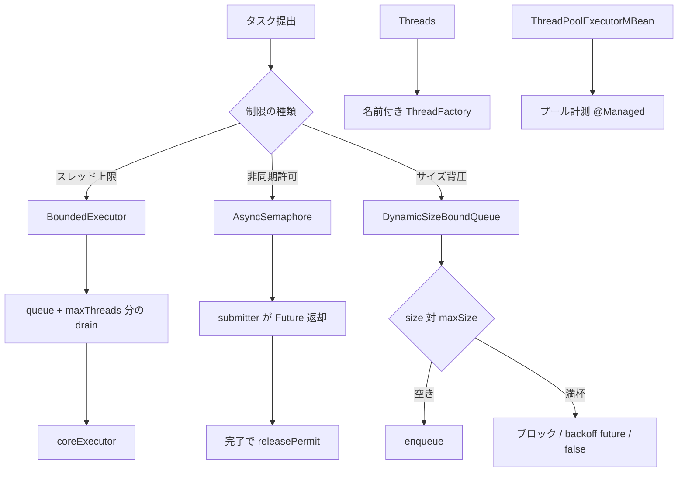

# 第24章 Executor と backpressure

> **本章で読むソース**
>
> - [concurrent/src/main/java/io/airlift/concurrent/BoundedExecutor.java](https://github.com/airlift/airlift/blob/439/concurrent/src/main/java/io/airlift/concurrent/BoundedExecutor.java)
> - [concurrent/src/main/java/io/airlift/concurrent/AsyncSemaphore.java](https://github.com/airlift/airlift/blob/439/concurrent/src/main/java/io/airlift/concurrent/AsyncSemaphore.java)
> - [concurrent/src/main/java/io/airlift/concurrent/DynamicSizeBoundQueue.java](https://github.com/airlift/airlift/blob/439/concurrent/src/main/java/io/airlift/concurrent/DynamicSizeBoundQueue.java)
> - [concurrent/src/main/java/io/airlift/concurrent/Threads.java](https://github.com/airlift/airlift/blob/439/concurrent/src/main/java/io/airlift/concurrent/Threads.java)
> - [concurrent/src/main/java/io/airlift/concurrent/ThreadPoolExecutorMBean.java](https://github.com/airlift/airlift/blob/439/concurrent/src/main/java/io/airlift/concurrent/ThreadPoolExecutorMBean.java)

## この章の狙い

共有スレッドプールをそのまま渡すと、一つの利用者がコアを占有しうる。
本章では **BoundedExecutor** による同時実行上限、**AsyncSemaphore** による非同期許可、**DynamicSizeBoundQueue** によるサイズ背圧、**Threads**／**ThreadPoolExecutorMBean** による生成と計測を追う。

## 前提

第23章の `MoreFutures.allAsListWithCancellationOnFailure` を読んだものとする。
背圧（backpressure）は「キューや同時実行が閾値に達したら、上流の投入を遅らせるか拒否する」仕組みを指す。

## BoundedExecutor：共有 Executor 上の公平な上限

複数の `BoundedExecutor` が同じ `coreExecutor` を使うとき、それぞれが `maxThreads` 分だけ同時に drain する。
Javadoc が約束するのは、タスクがスレッドへ「引き渡される順」（`handed to threads in that order`）である。
並列実行の開始順や完了順までの保証ではない。

[concurrent/src/main/java/io/airlift/concurrent/BoundedExecutor.java L16-L87](https://github.com/airlift/airlift/blob/439/concurrent/src/main/java/io/airlift/concurrent/BoundedExecutor.java#L16-L87)

```java
/**
 * Guarantees that no more than maxThreads will be used to execute tasks submitted
 * through {@link #execute(Runnable) execute()}.
 * <p>
 * There are a few interesting properties:
 * <ul>
 * <li>Multiple BoundedExecutors over a single coreExecutor will have fair sharing
 * of the coreExecutor threads proportional to their relative maxThread counts, but
 * can use less if not as active.</li>
 * <li>Tasks submitted to a BoundedExecutor is guaranteed to have those tasks
 * handed to threads in that order.</li>
 * <li>Will not encounter starvation</li>
 * </ul>
 */
@ThreadSafe
public class BoundedExecutor
        implements Executor
{
    private static final Logger log = Logger.get(BoundedExecutor.class);

    private final Queue<Runnable> queue = new ConcurrentLinkedQueue<>();
    private final AtomicInteger queueSize = new AtomicInteger(0);
    private final AtomicBoolean failed = new AtomicBoolean();
    private final Runnable drainQueueTask = this::drainQueue;

    private final Executor coreExecutor;
    private final int maxThreads;

    public BoundedExecutor(Executor coreExecutor, int maxThreads)
    {
        requireNonNull(coreExecutor, "coreExecutor is null");
        checkArgument(maxThreads > 0, "maxThreads must be greater than zero");
        this.coreExecutor = coreExecutor;
        this.maxThreads = maxThreads;
    }

    @Override
    public void execute(Runnable task)
    {
        if (failed.get()) {
            throw new RejectedExecutionException("BoundedExecutor is in a failed state");
        }

        queue.add(task);

        int size = queueSize.incrementAndGet();
        if (size <= maxThreads) {
            // If able to grab a permit, then we are short exactly one draining thread
            try {
                coreExecutor.execute(drainQueueTask);
            }
            catch (Throwable e) {
                failed.set(true);
                log.error("BoundedExecutor state corrupted due to underlying executor failure");
                throw e;
            }
        }
    }

    private void drainQueue()
    {
        // INVARIANT: queue has at least one task available when this method is called
        do {
            try {
                queue.poll().run();
            }
            catch (Throwable e) {
                log.error(e, "Task failed");
            }
        }
        while (queueSize.getAndDecrement() > maxThreads);
    }
}
```

`queueSize <= maxThreads` のときだけ `coreExecutor.execute(drainQueueTask)` で drain タスクを提出する。
これは新しい作業スレッドを作る保証ではなく、drain タスクの起動依頼である。
各 drain 実行は、許可を超える仕事が残っているあいだループする。
タスク失敗はログに留め、枠は解放する。
下位 Executor の提出失敗だけが `failed` を立て、以降は拒否する。

## AsyncSemaphore：Future 完了で許可を返す

タスク本体が非同期なら、スレッド数ではなく「進行中の Future 数」で上限を掛ける。
`submitter` が返す `ListenableFuture` の完了で許可を返す。

[concurrent/src/main/java/io/airlift/concurrent/AsyncSemaphore.java L37-L177](https://github.com/airlift/airlift/blob/439/concurrent/src/main/java/io/airlift/concurrent/AsyncSemaphore.java#L37-L177)

```java
/**
 * Guarantees that no more than maxPermits of tasks will be run concurrently.
 * The class will rely on the ListenableFuture returned by the submitter function to determine
 * when a task has been completed. The submitter function NEEDS to be thread-safe and is recommended
 * to do the bulk of its work asynchronously.
 */
@ThreadSafe
public class AsyncSemaphore<T, R>
{
    private final Queue<QueuedTask<T, R>> queuedTasks = new ConcurrentLinkedQueue<>();
    private final AtomicInteger counter = new AtomicInteger();
    private final Runnable runNextTask = this::runNext;
    private final int maxPermits;
    private final Executor submitExecutor;
    private final Function<T, ListenableFuture<R>> submitter;

    // ... (中略) ...

    public ListenableFuture<R> submit(T task)
    {
        QueuedTask<T, R> queuedTask = new QueuedTask<>(task);
        queuedTasks.add(queuedTask);
        acquirePermit();
        return queuedTask.getCompletionFuture();
    }

    private void acquirePermit()
    {
        if (counter.incrementAndGet() <= maxPermits) {
            // Kick off a task if not all permits have been handed out
            submitExecutor.execute(runNextTask);
        }
    }

    private void releasePermit()
    {
        if (counter.getAndDecrement() > maxPermits) {
            // Now that a task has finished, we can kick off another task if there are more tasks than permits
            submitExecutor.execute(runNextTask);
        }
    }

    private void runNext()
    {
        QueuedTask<T, R> queuedTask = queuedTasks.poll();
        verify(queuedTask != null);
        if (!queuedTask.getCompletionFuture().isDone()) {
            queuedTask.setFuture(submitTask(queuedTask.getTask()));
        }
        queuedTask.getCompletionFuture().addListener(this::releasePermit, directExecutor());
    }
```

`acquirePermit`／`releasePermit` は `submitExecutor.execute` を try／catch せず、拒否時の rollback もない。
`submit` は `queuedTasks` 追加と `counter` 増加のあとで `execute` するため、acquire 側で拒否されるとキューとカウンタが残ったまま例外が上がる。
release 側で拒否されると、後続の queued task 起動が失われる。
いずれも pending future やカウンタを残し得る。
`submitter.apply` の例外を `immediateFailedFuture` にする経路とは別であり、信頼できる `submitExecutor` を前提とする制約である。

`processAll` はセマフォ経由の提出を `allAsListWithCancellationOnFailure` で束ねる。
全体の失敗やキャンセルで残りを止められる。

[concurrent/src/main/java/io/airlift/concurrent/AsyncSemaphore.java L78-L92](https://github.com/airlift/airlift/blob/439/concurrent/src/main/java/io/airlift/concurrent/AsyncSemaphore.java#L78-L92)

```java
    public static <T, R> ListenableFuture<List<R>> processAll(List<T> tasks, Function<T, ListenableFuture<R>> submitter, int maxConcurrency, Executor submitExecutor)
    {
        SettableFuture<List<R>> resultFuture = SettableFuture.create();
        AsyncSemaphore<T, R> semaphore = new AsyncSemaphore<>(maxConcurrency, submitExecutor, task -> {
            if (resultFuture.isCancelled()) {
                // Task cancellation tends to happen in task submission order, which can race with subsequent task submissions after previous cancellations.
                // This eager check prevents this race from occurring, and can reduce the number of unnecessary submissions.
                return immediateCancelledFuture();
            }
            return submitter.apply(task);
        });
        resultFuture.setFuture(allAsListWithCancellationOnFailure(tasks.stream()
                .map(semaphore::submit)
                .collect(toImmutableList())));
        return resultFuture;
    }
```

提出前に全体キャンセルを見ると、不要な `submitter` 呼出しを減らせる。

## DynamicSizeBoundQueue：可変要素サイズの背圧

要素ごとにサイズ関数を持ち、合計が `maxSize` に達したら offer／put がブロックまたは失敗する。
すでに満杯でなければ追加を許すため、通常は「上限＋最大1要素」程度まで膨らみうる。
ゼロサイズ要素は禁止である。

[concurrent/src/main/java/io/airlift/concurrent/DynamicSizeBoundQueue.java L41-L131](https://github.com/airlift/airlift/blob/439/concurrent/src/main/java/io/airlift/concurrent/DynamicSizeBoundQueue.java#L41-L131)

```java
/**
 * Size constrained queue that utilizes a dynamic element size function. To prevent
 * starvation for adding large elements, the queue will only block new elements if
 * the total size has already been reached or exceeded. This means in the normal
 * case, the queue should be no larger than the max size plus the size of one element.
 * Callers also have the additional option to force insert further elements without
 * regard for size constraints. In the current implementation, elements are required
 * to have positive sizes (they cannot have zero size). This implementation is designed
 * to closely mirror the method signatures of {@link java.util.concurrent.BlockingQueue}.
 */
@ThreadSafe
public class DynamicSizeBoundQueue<T>
{
    private final AtomicLong size = new AtomicLong();
    private final Queue<ElementAndSize<T>> queue = new ConcurrentLinkedQueue<>();
    private final AtomicReference<SettableFuture<Void>> enqueueFuture = new AtomicReference<>();
    private final AtomicReference<SettableFuture<Void>> dequeueFuture = new AtomicReference<>();

    private final long maxSize;
    private final ToLongFunction<T> elementSizeFunction;
    private final Ticker ticker;

    // ... (中略) ...

    private boolean tryAcquireSizeReservation(long elementSize)
    {
        // Add the element as long as there is any space available
        if (size.get() >= maxSize) {
            return false;
        }

        long newSize;
        try {
            newSize = getAndAddOverflowChecked(size, elementSize);
        }
        catch (ArithmeticException e) { // Numeric overflow
            // While numeric overflow is extremely unlikely given typical numerical sizes,
            // even the largest possible element of size Long.MAX_VALUE can eventually fit
            // without numeric overflow as long as the queue can be emptied.
            return false;
        }

        if (newSize >= maxSize) {
            verify(size.addAndGet(-elementSize) >= 0);
            return false;
        }
        return true;
    }
```

`offerWithBackoff` は入れられなかったとき、dequeue 待ち用 future を返す。
呼び出し側は future 完了を待って再試行できる。
`put`／`take` は BlockingQueue 風に待機する。

[concurrent/src/main/java/io/airlift/concurrent/DynamicSizeBoundQueue.java L183-L226](https://github.com/airlift/airlift/blob/439/concurrent/src/main/java/io/airlift/concurrent/DynamicSizeBoundQueue.java#L183-L226)

```java
    public Optional<ListenableFuture<Void>> offerWithBackoff(T element)
    {
        long elementSize = elementSizeFunction.applyAsLong(element);
        if (offer(element, elementSize)) {
            return Optional.empty();
        }
        ListenableFuture<Void> future = getOrCreateFuture(dequeueFuture);
        // Check again in case we already missed the relevant dequeue event
        if (offer(element, elementSize)) {
            return Optional.empty();
        }
        return Optional.of(Futures.nonCancellationPropagating(future));
    }

    // ... (中略) ...

    @Nullable
    public T poll()
    {
        ElementAndSize<T> elementAndSize = queue.poll();
        if (elementAndSize == null) {
            return null;
        }

        verify(size.addAndGet(-elementAndSize.size()) >= 0);
        notifyIfNecessary(dequeueFuture);
        return elementAndSize.element();
    }
```

待ちは `SettableFuture` を AtomicReference に置き、相手側の完了で `set(null)` して起こす。
取りこぼしを避けるため、await 前後に再試行がある。

## Threads：名前付き ThreadFactory

`threadsNamed`／`daemonThreadsNamed`／`virtualThreadsNamed` は名前フォーマットと、作成時点の context class loader を引き継ぐ。

[concurrent/src/main/java/io/airlift/concurrent/Threads.java L24-L83](https://github.com/airlift/airlift/blob/439/concurrent/src/main/java/io/airlift/concurrent/Threads.java#L24-L83)

```java
    public static ThreadFactory threadsNamed(String nameFormat)
    {
        return new ThreadFactoryBuilder()
                .setNameFormat(nameFormat)
                .setThreadFactory(new ContextClassLoaderThreadFactory(Thread.currentThread().getContextClassLoader(), defaultThreadFactory()))
                .build();
    }

    // ... (中略) ...

    public static ThreadFactory daemonThreadsNamed(String nameFormat)
    {
        return new ThreadFactoryBuilder()
                .setNameFormat(nameFormat)
                .setDaemon(true)
                .setThreadFactory(new ContextClassLoaderThreadFactory(Thread.currentThread().getContextClassLoader(), defaultThreadFactory()))
                .build();
    }

    // ... (中略) ...

    public static ThreadFactory virtualThreadsNamed(String nameFormat)
    {
        return new ThreadFactoryBuilder()
                .setNameFormat(nameFormat)
                .setThreadFactory(new ContextClassLoaderThreadFactory(Thread.currentThread().getContextClassLoader(), Thread.ofVirtual().factory()))
                .build();
    }

    private static class ContextClassLoaderThreadFactory
            implements ThreadFactory
    {
        private final ClassLoader classLoader;
        private final ThreadFactory delegate;

        public ContextClassLoaderThreadFactory(ClassLoader classLoader, ThreadFactory delegate)
        {
            this.classLoader = classLoader;
            this.delegate = delegate;
        }

        @Override
        public Thread newThread(Runnable runnable)
        {
            Thread thread = delegate.newThread(runnable);
            thread.setContextClassLoader(classLoader);
            return thread;
        }
    }
```

## ThreadPoolExecutorMBean：プールの観測と一部設定

`ThreadPoolExecutor` を `@Managed` で公開する。
コア／最大サイズ、keep-alive、キュー滞留件数、完了タスク数などが読める。
一部は setter 付きで、稼働中にチューニングできる。

[concurrent/src/main/java/io/airlift/concurrent/ThreadPoolExecutorMBean.java L11-L129](https://github.com/airlift/airlift/blob/439/concurrent/src/main/java/io/airlift/concurrent/ThreadPoolExecutorMBean.java#L11-L129)

```java
public class ThreadPoolExecutorMBean
{
    private final ThreadPoolExecutor threadPoolExecutor;

    public ThreadPoolExecutorMBean(ThreadPoolExecutor threadPoolExecutor)
    {
        this.threadPoolExecutor = requireNonNull(threadPoolExecutor, "threadPoolExecutor is null");
    }

    @Managed
    public boolean isShutdown()
    {
        return threadPoolExecutor.isShutdown();
    }

    // ... (中略) ...

    @Managed
    public int getCorePoolSize()
    {
        return threadPoolExecutor.getCorePoolSize();
    }

    @Managed
    public void setCorePoolSize(int corePoolSize)
    {
        threadPoolExecutor.setCorePoolSize(corePoolSize);
    }

    // ... (中略) ...

    @Managed
    public int getActiveCount()
    {
        return threadPoolExecutor.getActiveCount();
    }

    // ... (中略) ...

    @Managed
    public long getCompletedTaskCount()
    {
        return threadPoolExecutor.getCompletedTaskCount();
    }

    @Managed
    public int getQueuedTaskCount()
    {
        return threadPoolExecutor.getQueue().size();
    }
}
```

背圧の結果（キュー長、活性スレッド）を JMX／OpenMetrics 側から見る入口になる。

## 処理の流れ



## 高速化と最適化の工夫

`BoundedExecutor`／`AsyncSemaphore` はカウンタが上限以下のときだけ drain／runNext の提出を起こす。
常時ポーリングしない。
`coreExecutor.execute` はスレッド生成ではなくタスク提出である。
`DynamicSizeBoundQueue` の待ちは共有 `SettableFuture` を起こすだけなので、要素ごとの待機オブジェクトを作らない。
大きな要素が永久に入れられない「飢餓」を避けるため、すでに満杯のときだけ拒否し、空きがあればサイズ超過を一度認める。

## まとめ

- `BoundedExecutor` は共有 Executor 上で同時 drain 数を `maxThreads` に抑え、スレッドへの引き渡し順を保証する。
- `AsyncSemaphore` は Future 完了で許可を返し、`submitExecutor` 拒否時はキューやカウンタの rollback がない。
- `DynamicSizeBoundQueue` は動的サイズで背圧し、`offerWithBackoff` で非同期待機もできる。
- `Threads` は名前と context class loader を持つ ThreadFactory を作る。
- `ThreadPoolExecutorMBean` はプール状態の計測と一部の実行時変更を公開する。

## 関連する章

- [第20章 JMX と OpenMetrics 公開](../part08-observability/20-jmx-openmetrics.md)
- [第23章 Future ユーティリティ](23-futures.md)
