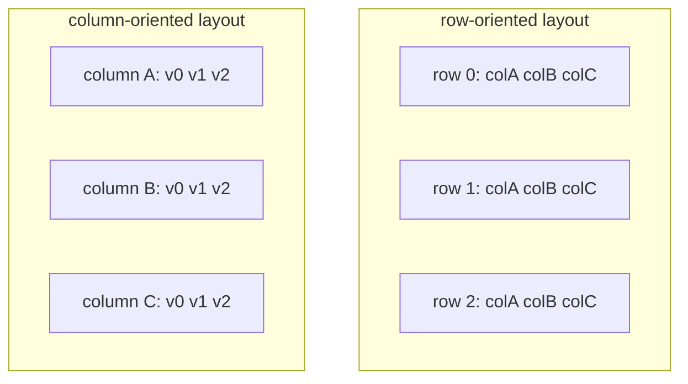
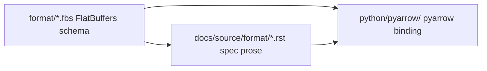

# 第1章 Apache Arrow とは何か

> **本章で読むソース**
>
> - [`format/README.rst`](https://github.com/apache/arrow/blob/apache-arrow-25.0.0/format/README.rst)
> - [`docs/source/format/Intro.rst`](https://github.com/apache/arrow/blob/apache-arrow-25.0.0/docs/source/format/Intro.rst)
> - [`python/pyarrow/__init__.py`](https://github.com/apache/arrow/blob/apache-arrow-25.0.0/python/pyarrow/__init__.py)

## この章の狙い

Apache Arrow が何を標準化し、なぜ列指向メモリ表現が中心にあるのかを、仕様書の導入部と `pyarrow` の公開面から押さえる。
リポジトリ内でフォーマット定義と実装がどう分かれているかを示し、以降の章が読むファイルの地図にする。

## 前提

本書は Apache Arrow 25.0.0 のフォーマット仕様と Python バインディング `pyarrow` を対象とする。
C++ コアの内部実装や他言語バインディングには深入りしない。
コード引用は GitHub 上の `apache-arrow-25.0.0` タグに固定する。

## 表形式データの相互運用問題

`Intro.rst` は Arrow の出発点を、言語やシステムをまたぐ表形式データの表現と交換の標準化にあると述べる。

[`docs/source/format/Intro.rst` L22-L29](https://github.com/apache/arrow/blob/apache-arrow-25.0.0/docs/source/format/Intro.rst#L22-L29)

```text
Apache Arrow was born from the need for a set of standards around
tabular data representation and interchange between systems.
The adoption of these standards reduces computing costs of data
serialization/deserialization and implementation costs across
systems implemented in different programming languages.

The Apache Arrow specification can be implemented in any programming
language but official implementations for many languages are available.
```

標準が共有されると、シリアライズとデシリアライズの計算コストと、言語ごとの再実装コストを同時に下げられる。
仕様は任意の言語で実装できるが、公式実装が複数言語で提供されている。

その後 Arrow は、ゼロコピー共有メモリ、ファイルフォーマット入出力、インメモリ分析といった周辺ライブラリ群へ広がった。

[`docs/source/format/Intro.rst` L38-L44](https://github.com/apache/arrow/blob/apache-arrow-25.0.0/docs/source/format/Intro.rst#L38-L44)

```text
Apart from this initial vision, Arrow has grown to also develop a
multi-language collection of libraries for solving problems related to
in-memory analytical data processing. This covers topics like:

* Zero-copy shared memory and RPC-based data movement
* Reading and writing file formats (like CSV, `Apache ORC`_, and `Apache Parquet`_)
* In-memory analytics and query processing
```

本書ではまずフォーマット仕様と `pyarrow` がどう対応するかを追い、IPC や Flight、Dataset などの周辺機能は後の部で扱う。

## 行指向と列指向の違い

`Intro.rst` は同じ表を、行単位に並べるか列単位に並べるかでメモリ上の形が変わることを図で説明する。

[`docs/source/format/Intro.rst` L61-L73](https://github.com/apache/arrow/blob/apache-arrow-25.0.0/docs/source/format/Intro.rst#L61-L73)

```text
Tabular data can be represented in memory using a row-based format or a
column-based format. The row-based format stores data row-by-row, meaning the rows
are adjacent in the computer memory:

.. figure:: ./images/columnar-diagram_2.svg
   :alt: Tabular data being structured row by row in computer memory.

   Tabular data being saved in memory row by row.

In a columnar format, the data is organized column-by-column instead.
This organization makes analytical operations like filtering, grouping,
aggregations and others, more efficient thanks to memory locality.
When processing the data, the memory locations accessed by the CPU tend
to be near one another.
```

列指向では、フィルタや集約のように列を走査する処理でアクセス先が近接しやすい。
CPU が触るアドレスがまとまるため、キャッシュ効率と SIMD によるベクトル化が効きやすい。

[`docs/source/format/Intro.rst` L74-L78](https://github.com/apache/arrow/blob/apache-arrow-25.0.0/docs/source/format/Intro.rst#L74-L78)

```text
By keeping the data contiguous in memory, it also
enables vectorization of the computations. Most modern CPUs have
`SIMD instructions`_ (a single instruction that operates on multiple values at
once) enabling parallel processing and execution of operations on vector data
using a single CPU instruction.
```

Arrow はこの列指向レイアウトを仕様として固定する。

[`docs/source/format/Intro.rst` L82-L83](https://github.com/apache/arrow/blob/apache-arrow-25.0.0/docs/source/format/Intro.rst#L82-L83)

```text
Apache Arrow is solving this exact problem. It is the specification that
uses the columnar layout.
```

行指向と列指向のメモリ配置を Mermaid で対比すると次のようになる。



## Array、Buffer、物理レイアウト

導入部は、列を **Array**、メモリ上の連続領域を **Buffer**、値の並べ方の規則を **物理レイアウト** と呼ぶ。

[`docs/source/format/Intro.rst` L90-L95](https://github.com/apache/arrow/blob/apache-arrow-25.0.0/docs/source/format/Intro.rst#L90-L95)

```text
Each column is called an **Array** in Arrow terminology. Arrays can be of
different data types and the way their values are stored in memory varies among
the data types. The specification of how these values are arranged in memory is
what we call a **physical memory layout**. One contiguous region of memory that
stores data for arrays is called a **Buffer**. An array consists of one or more
buffers.
```

型ごとにバッファ本数と意味が変わる。
詳細なレイアウト規則は `Columnar.rst` にあり、第2章で共通部分を読む。

## リポジトリ内の二系統：プロトコル定義と仕様書

`format/` ディレクトリは、Arrow 列指向フォーマットと Flight RPC などのバイナリプロトコル定義を置く場所である。

[`format/README.rst` L18-L25](https://github.com/apache/arrow/blob/apache-arrow-25.0.0/format/README.rst#L18-L25)

```text
Arrow Protocol Files
====================

This folder contains binary protocol definitions for the Arrow columnar format
and other parts of the project, like the Flight RPC framework.

For documentation about the Arrow format, see the `docs/source/format`
directory.
```

FlatBuffers の `.fbs` ファイルが IPC メタデータの実体であり、人間向けの説明は `docs/source/format/*.rst` にある。
本書は両方を引用し、定義と解説の対応を示す。



## データ共有の二つの経路

同じメモリレイアウトを、プロセス内とプロセス間でどう渡すかは別の仕様で定義される。

[`docs/source/format/Intro.rst` L511-L520](https://github.com/apache/arrow/blob/apache-arrow-25.0.0/docs/source/format/Intro.rst#L511-L520)

```text
Arrow memory layout is meant to be a universal standard for representing tabular data in memory,
not tied to a specific implementation. The Arrow standard defines two protocols for
well-defined and unambiguous communication of Arrow data between applications:

* Protocol to share Arrow data between processes or over the network is called :ref:`format-ipc`.
  The specification for sharing data is called IPC message format which defines how Arrow
  array or record batch buffers are stacked together to be serialized and deserialized.

* To share Arrow data in the same process :ref:`c-data-interface` is used, meant for sharing
  the same buffer zero-copy in memory between different libraries within the same process.
```

プロセス間やネットワークでは IPC メッセージ形式がバッファ列の積み上げ方を規定する。
同一プロセス内のライブラリ間では C Data Interface が、同じバッファをゼロコピーで受け渡すための契約になる。
第8章、第11章でそれぞれ実装を追う。

## pyarrow が公開する層

`pyarrow` パッケージの docstring は、Arrow を「言語に依存しない列指向メモリフォーマット」と定義している。

[`python/pyarrow/__init__.py` L20-L30](https://github.com/apache/arrow/blob/apache-arrow-25.0.0/python/pyarrow/__init__.py#L20-L30)

```python
"""
PyArrow is the python implementation of Apache Arrow.

Apache Arrow is a cross-language development platform for in-memory data.
It specifies a standardized language-independent columnar memory format for
flat and hierarchical data, organized for efficient analytic operations on
modern hardware. It also provides computational libraries and zero-copy
streaming messaging and interprocess communication.

For more information see the official page at https://arrow.apache.org
"""
```

`__init__.py` の import 群は、型、配列、バッファ、テーブル、IPC へと機能が広がる様子を示す。
型ファクトリと配列クラスは次のブロックにまとまっている。

[`python/pyarrow/__init__.py` L154-L168](https://github.com/apache/arrow/blob/apache-arrow-25.0.0/python/pyarrow/__init__.py#L154-L168)

```python
from pyarrow.lib import (null, bool_,
                         int8, int16, int32, int64,
                         uint8, uint16, uint32, uint64,
                         time32, time64, timestamp, date32, date64, duration,
                         month_day_nano_interval,
                         float16, float32, float64,
                         binary, string, utf8, binary_view, string_view,
                         large_binary, large_string, large_utf8,
                         decimal32, decimal64, decimal128, decimal256,
                         list_, large_list, list_view, large_list_view,
                         map_, struct,
                         union, sparse_union, dense_union,
                         dictionary,
                         run_end_encoded,
```

配列とテーブル関連のシンボルは続く import で揃えられる。

[`python/pyarrow/__init__.py` L189-L191](https://github.com/apache/arrow/blob/apache-arrow-25.0.0/python/pyarrow/__init__.py#L189-L191)

```python
                         Array, Tensor,
                         array, chunked_array, record_batch, nulls, repeat,
                         SparseCOOTensor, SparseCSRMatrix, SparseCSCMatrix,
```

二段テーブル表現として `RecordBatch` と `Table` が公開される。

[`python/pyarrow/__init__.py` L264-L266](https://github.com/apache/arrow/blob/apache-arrow-25.0.0/python/pyarrow/__init__.py#L264-L266)

```python
from pyarrow.lib import (ChunkedArray, RecordBatch, Table, table,
                         concat_arrays, concat_tables, TableGroupBy,
                         RecordBatchReader, concat_batches)
```

`RecordBatch` は同一長の列配列を一塊にした連続二维構造である。
`Table` は列ごとに `ChunkedArray` を持ち、チャンク境界が列ごとに異なってよい。
この区別は実装固有の概念として `Intro.rst` の用語集にも記載がある。

## RecordBatch と Table の役割分担

`Intro.rst` の用語集は、配列の上に載る二维コンテナを次のように分ける。

[`docs/source/format/Intro.rst` L441-L456](https://github.com/apache/arrow/blob/apache-arrow-25.0.0/docs/source/format/Intro.rst#L441-L456)

```text
**RecordBatch**
A contiguous, two-dimensional data structure which consists of an ordered collection of arrays
of the same length.

**Schema**
An ordered collection of fields that communicates all the data types of an object
like a RecordBatch or Table. Schemas can contain optional key/value metadata.

**Field**
A Field includes a field name, a data type, a nullability flag and
optional key-value metadata for a specific column in a RecordBatch.

**Table**
A discontiguous, two-dimensional chunk of data consisting of an ordered collection of Chunked
Arrays. All Chunked Arrays have the same length, but may have different types. Different columns
may be chunked differently.
```

スキーマは列名と型の並びを固定し、IPC やファイル形式ではメタデータとして先に送られる。
`pyarrow` では `schema()` と `field()` が型定義層に、`record_batch()` と `table()` がデータ構築 API に対応する。

ゼロコピーで列データを運ぶとき、実体は各列のバッファ列であり、`RecordBatch` はそれらへのハンドル集合とみなせる。
チャンク分割は大きなデータセットをメモリ上限内で扱うための実装上の工夫であり、各チャンク内部のレイアウトは依然として Arrow 列指向規則に従う。

## まとめ

Apache Arrow は列指向インメモリレイアウトを仕様化し、言語横断のデータ交換コストを下げる。
リポジトリでは FlatBuffers 定義と RST 仕様書がフォーマットを記述し、`pyarrow` が Python から型、配列、バッファ、テーブルを公開する。
プロセス内共有は C Data Interface、プロセス間は IPC が担う。
次章では、配列を構成するバッファ列と validity ビットマップの共通規則を読む。

## 関連する章

- 第2章 [列指向メモリレイアウトの原則](02-columnar-layout.md)：バッファ列、validity ビットマップ、アライメント
- 第3章 型システムとスキーマ：`Schema` と `Field` の定義
- 第8章 ストリーミング IPC：プロセス間でのバッファ列の運搬
