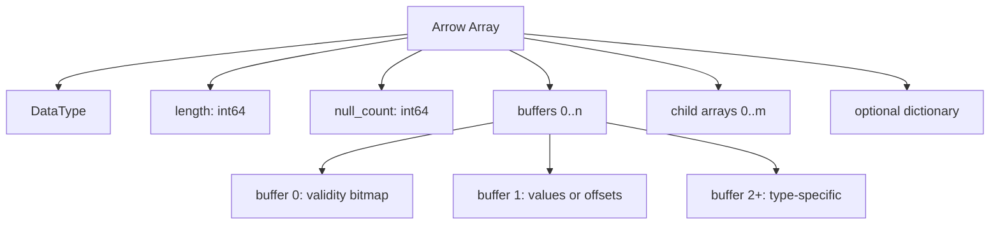
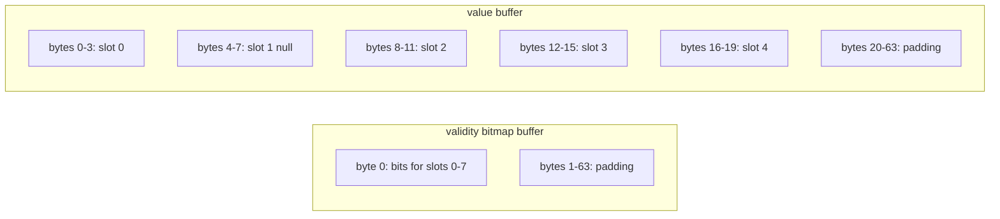

# 第2章 列指向メモリレイアウトの原則

> **本章で読むソース**
>
> - [`docs/source/format/Columnar.rst`](https://github.com/apache/arrow/blob/apache-arrow-25.0.0/docs/source/format/Columnar.rst)
> - [`python/pyarrow/types.pxi`](https://github.com/apache/arrow/blob/apache-arrow-25.0.0/python/pyarrow/types.pxi)
> - [`python/pyarrow/array.pxi`](https://github.com/apache/arrow/blob/apache-arrow-25.0.0/python/pyarrow/array.pxi)

## この章の狙い

第1章で Arrow が列指向インメモリフォーマットであることを確認した。
本章では、その中核となる**物理レイアウト**の共通規則を仕様書 `Columnar.rst` から読み取り、`pyarrow` がバッファ列としてどう露出するかまで追う。
固定長プリミティブを手本に、バッファ列、validity ビットマップ、アライメントの三つを押さえる。
可変長文字列やネスト型の個別レイアウトは第4章、第5章に譲る。

## 前提

**配列**は、同一型の値を長さ付きで並べた列である。
Arrow は行指向のレコード構造そのものをメモリ上に置かず、列ごとに独立したバッファ列として値を保持する。
そのため、列単位のスキャンでは隣接スロットへ順次アクセスでき、SIMD やキャッシュ効率を活かしやすい。
一方、行単位の更新や挿入は、複数列の整合を同時に保つ必要があり、仕様書も変更操作は実装側の責務に委ねると明記している。

## 列指向フォーマットが掲げる性質

`Columnar.rst` は列指向フォーマットの性質を次の四つに整理している。

[`docs/source/format/Columnar.rst` L40-L46](https://github.com/apache/arrow/blob/apache-arrow-25.0.0/docs/source/format/Columnar.rst#L40-L46)

```text
The columnar format has some key features:

* Data adjacency for sequential access (scans)
* O(1) (constant-time) random access [#f1]_
* SIMD and vectorization-friendly
* Relocatable without "pointer swizzling", allowing for true zero-copy
  access in shared memory
```

順次アクセスでは値が隣接するため、列走査の帯域を無駄にしにくい。
乱数アクセスはスロット番号からオフセット計算で定位置へ届くため、インデックス `j` への参照は配列長に対して定数時間である（Run-End Encoded 型は例外として対数時間）。
メモリ上の表現がポインタの実アドレスに依存しないため、共有メモリへマップしただけで他プロセスが同じバッファ列を解釈できる。
これが第1章で触れたゼロコピーの前提になる。

仕様書は、この設計が解析処理の局所性と引き換えに、変更操作を相対的に高く払うことを認めている。

[`docs/source/format/Columnar.rst` L48-L53](https://github.com/apache/arrow/blob/apache-arrow-25.0.0/docs/source/format/Columnar.rst#L48-L53)

```text
The Arrow columnar format provides analytical performance and data
locality guarantees in exchange for comparatively more expensive
mutation operations. This document is concerned only with in-memory
data representation and serialization details; issues such as
coordinating mutation of data structures are left to be handled by
implementations.
```

## 用語：Array、Buffer、物理レイアウト

仕様書の用語集は、以降の節で使う語を次のように定義する。

[`docs/source/format/Columnar.rst` L64-L75](https://github.com/apache/arrow/blob/apache-arrow-25.0.0/docs/source/format/Columnar.rst#L64-L75)

```text
* **Array** or **Vector**: a sequence of values with known length all
  having the same type. These terms are used interchangeably in
  different Arrow implementations, but we use "array" in this
  document.
* **Slot**: a single logical value in an array of some particular data type
* **Buffer** or **Contiguous memory region**: a sequential virtual
  address space with a given length. Any byte can be reached via a
  single pointer offset less than the region's length.
* **Physical Layout**: The underlying memory layout for an array
  without taking into account any value semantics. For example, a
  32-bit signed integer array and 32-bit floating point array have the
  same layout.
```

**スロット**は配列内の一要素を指す。
**バッファ**は連続した仮想アドレス空間であり、Arrow の値本体やビットマップはすべてバッファの断片として表現される。
**物理レイアウト**は意味論を除いたメモリ上の形だけを指す。
`Int32` と `Float32` は意味は異なるが、固定4バイト列として同じレイアウトに載る。

## 配列を構成するメタデータとバッファ列

物理レイアウトの節は、配列が何で構成されるかを最初に列挙する。

[`docs/source/format/Columnar.rst` L209-L219](https://github.com/apache/arrow/blob/apache-arrow-25.0.0/docs/source/format/Columnar.rst#L209-L219)

```text
Arrays are defined by a few pieces of metadata and data:

* A data type.
* A sequence of buffers.
* A length as a 64-bit signed integer. Implementations are permitted
  to be limited to 32-bit lengths, see more on this below.
* A null count as a 64-bit signed integer.
* An optional **dictionary**, for dictionary-encoded arrays.

Nested arrays additionally have a sequence of one or more sets of
these items, called the **child arrays**.
```

型はスロット幅やバッファ本数を決める。
バッファ列は値、validity ビットマップ、可変長用オフセットなど、型ごとに決まった順序で並ぶ。
長さと null count はメタデータとして配列と一緒に保持され、ネスト型では子配列が同じ構造を再帰的に持つ。

Mermaid で配列の論理構造を図示すると次のようになる。



`pyarrow` では、型が要求するバッファ本数を `DataType.num_buffers` が返す。

[`python/pyarrow/types.pxi` L321-L334](https://github.com/apache/arrow/blob/apache-arrow-25.0.0/python/pyarrow/types.pxi#L321-L334)

```python
    def num_buffers(self):
        """
        Number of data buffers required to construct Array type
        excluding children.

        Examples
        --------
        >>> import pyarrow as pa
        >>> pa.int64().num_buffers
        2
        >>> pa.string().num_buffers
        3
        """
        return self.type.layout().buffers.size()
```

`int64` は validity と値の2本、`string` は validity、オフセット、データの3本である。
子配列のバッファはこの数に含まれず、ネストは `child arrays` 側で再帰する。

## 配列長と null count

配列長はメタデータ上 64 ビット符号付き整数だが、実装は 32 ビット上限でも仕様上は有効とされる。
多言語連携では要素数を 2³¹−1 以下に抑え、それを超える場合はチャンク分割を推奨する。

[`docs/source/format/Columnar.rst` L300-L305](https://github.com/apache/arrow/blob/apache-arrow-25.0.0/docs/source/format/Columnar.rst#L300-L305)

```text
Array lengths are represented in the Arrow metadata as a 64-bit signed
integer. An implementation of Arrow is considered valid even if it only
supports lengths up to the maximum 32-bit signed integer, though. If using
Arrow in a multi-language environment, we recommend limiting lengths to
2 :sup:`31` - 1 elements or less. Larger data sets can be represented using
multiple array chunks.
```

null count も 64 ビット符号付き整数で、配列長と同じ大きさになりうる。
これは「欠損が何件あるか」を配列の物理的性質として保持するためである。

[`docs/source/format/Columnar.rst` L310-L313](https://github.com/apache/arrow/blob/apache-arrow-25.0.0/docs/source/format/Columnar.rst#L310-L313)

```text
The number of null value slots is a property of the physical array and
considered part of the data structure. The null count is represented
in the Arrow metadata as a 64-bit signed integer, as it may be as
large as the array length.
```

## バッファのアライメントとパディング

Arrow はバッファの先頭アドレスと総長を 8 バイトまたは 64 バイトの倍数に揃えることを推奨する。
プロセス間通信でシリアライズするときは、この要件が強制される。

[`docs/source/format/Columnar.rst` L267-L273](https://github.com/apache/arrow/blob/apache-arrow-25.0.0/docs/source/format/Columnar.rst#L267-L273)

```text
Implementations are recommended to allocate memory on aligned
addresses (multiple of 8- or 64-bytes) and pad (overallocate) to a
length that is a multiple of 8 or 64 bytes. When serializing Arrow
data for interprocess communication, these alignment and padding
requirements are enforced. If possible, we suggest that you prefer
using 64-byte alignment and padding. Unless otherwise noted, padded
bytes do not need to have a specific value.
```

アライメントの理由は、数値配列でアラインされたロードが保証されることと、キャッシュラインの部分利用を抑えられることにある。
64 バイト推奨は、広く配備された x86 の AVX-512 レジスタ幅に合わせるためである。

[`docs/source/format/Columnar.rst` L275-L285](https://github.com/apache/arrow/blob/apache-arrow-25.0.0/docs/source/format/Columnar.rst#L275-L285)

```text
The alignment requirement follows best practices for optimized memory
access:

* Elements in numeric arrays will be guaranteed to be retrieved via aligned access.
* On some architectures alignment can help limit partially used cache lines.

The recommendation for 64 byte alignment comes from the `Intel
performance guide`_ that recommends alignment of memory to match SIMD
register width.  The specific padding length was chosen because it
matches the largest SIMD instruction registers available on widely
deployed x86 architecture (Intel AVX-512).
```

64 バイトのパディングを確保すると、ループ内で毎回端数チェックを挟まずに SIMD 命令を一定パターンで回せる。
512 ビットレジスタに 64 バイト分をまとめて載せ、列方向の値を同時に処理できる。
パディング領域の中身は未定義でよいため、実装は長さ切り上げのためだけに余白を確保すれば足りる。

[`docs/source/format/Columnar.rst` L287-L295](https://github.com/apache/arrow/blob/apache-arrow-25.0.0/docs/source/format/Columnar.rst#L287-L295)

```text
The recommended padding of 64 bytes allows for using `SIMD`_
instructions consistently in loops without additional conditional
checks.  This should allow for simpler, efficient and CPU
cache-friendly code.  In other words, we can load the entire 64-byte
buffer into a 512-bit wide SIMD register and get data-level
parallelism on all the columnar values packed into the 64-byte
buffer. Guaranteed padding can also allow certain compilers to
generate more optimized code directly (e.g. One can safely use Intel's
``-qopt-assume-safe-padding``).
```

Int32 配列の例でも、値バッファ末尾に 20〜63 バイトのパディングが明示されている（後述）。
見かけの要素数が5件でも、バッファ全体は 64 バイト境界へ伸ばされる。

## validity ビットマップ

プリミティブでもネスト型でも、各スロットは意味論上 null になりうる。
Union 型を除くすべての配列は、スロットごとの有効性を表す **validity ビットマップ**用バッファを持つ。

[`docs/source/format/Columnar.rst` L318-L324](https://github.com/apache/arrow/blob/apache-arrow-25.0.0/docs/source/format/Columnar.rst#L318-L324)

```text
Any value in an array may be semantically null, whether primitive or nested
type.

All array types, with the exception of union types (more on these later),
utilize a dedicated memory buffer, known as the validity (or "null") bitmap, to
encode the nullness or non-nullness of each value slot. The validity bitmap
must be large enough to have at least 1 bit for each array slot.
```

ビット `1` は非 null、`0` は null を意味する。
スロット `j` の判定式は次のとおりである。

[`docs/source/format/Columnar.rst` L326-L331](https://github.com/apache/arrow/blob/apache-arrow-25.0.0/docs/source/format/Columnar.rst#L326-L331)

```text
Whether any array slot is valid (non-null) is encoded in the respective bits of
this bitmap. A 1 (set bit) for index ``j`` indicates that the value is not null,
while a 0 (bit not set) indicates that it is null. Bitmaps are to be
initialized to be all unset at allocation time (this includes padding): ::

    is_valid[j] -> bitmap[j / 8] & (1 << (j % 8))
```

ビット順序は **LSB 番号付け**（bit-endianness）である。
バイト内では右端がスロット `j mod 8` に対応し、次の例では `values = [0, 1, null, 2, null, 3]` の先頭8スロット分が `00011101` と並ぶ。

[`docs/source/format/Columnar.rst` L333-L341](https://github.com/apache/arrow/blob/apache-arrow-25.0.0/docs/source/format/Columnar.rst#L333-L341)

```text
We use `least-significant bit (LSB) numbering`_ (also known as
bit-endianness). This means that within a group of 8 bits, we read
right-to-left: ::

    values = [0, 1, null, 2, null, 3]

    bitmap
    j mod 8   7  6  5  4  3  2  1  0
              0  0  1  0  1  0  1  1
```

null count が 0 の配列は validity ビットマップを割り当てない実装が許される。
C++ では未割り当てを NULL ポインタで表す例が仕様書に挙がる。
消費側は「ビットマップあり」と「省略」の両方を扱えなければならない。

[`docs/source/format/Columnar.rst` L343-L348](https://github.com/apache/arrow/blob/apache-arrow-25.0.0/docs/source/format/Columnar.rst#L343-L348)

```text
Arrays having a 0 null count may choose to not allocate the validity
bitmap; how this is represented depends on the implementation (for
example, a C++ implementation may represent such an "absent" validity
bitmap using a NULL pointer). Implementations may choose to always allocate
a validity bitmap anyway as a matter of convenience. Consumers of Arrow
arrays should be ready to handle those two possibilities.
```

この省略は、非 null 列でビットマップ分のメモリとビットテストを省くための最適化である。
カーネル実装は null count が 0 なら validity バッファを読まずに値バッファへ直行できる。

ネスト型の親配列は、子の null 状態とは独立に独自の validity ビットマップと null count を持つ。
null スロットの値領域は未定義のままでよく、ゼロ埋めは必須ではない。

[`docs/source/format/Columnar.rst` L350-L356](https://github.com/apache/arrow/blob/apache-arrow-25.0.0/docs/source/format/Columnar.rst#L350-L356)

```text
Nested type arrays (except for union types as noted above) have their own
top-level validity bitmap and null count, regardless of the null count and
valid bits of their child arrays.

Array slots which are null are not required to have a particular value;
any "masked" memory can have any value and need not be zeroed, though
implementations frequently choose to zero memory for null values.
```

## 固定長プリミティブの例：Int32

固定長プリミティブは、スロット幅が一定の値列である。
配列内部には、スロット幅と長さの積以上の大きさを持つ連続バッファが一つ置かれる。
validity ビットマップは別バッファに置かれ、値バッファと隣接している必要はない。

[`docs/source/format/Columnar.rst` L361-L373](https://github.com/apache/arrow/blob/apache-arrow-25.0.0/docs/source/format/Columnar.rst#L361-L373)

```text
A primitive value array represents an array of values each having the
same physical slot width typically measured in bytes, though the spec
also provides for bit-packed types (e.g. boolean values encoded in
bits).

Internally, the array contains a contiguous memory buffer whose total
size is at least as large as the slot width multiplied by the array
length. For bit-packed types, the size is rounded up to the nearest
byte.

The associated validity bitmap is contiguously allocated (as described
above) but does not need to be adjacent in memory to the values
buffer.
```

`[1, null, 2, 4, 8]` という Int32 配列のレイアウトは、仕様書が表形式で示している。

[`docs/source/format/Columnar.rst` L377-L394](https://github.com/apache/arrow/blob/apache-arrow-25.0.0/docs/source/format/Columnar.rst#L377-L394)

```text
For example a primitive array of int32s: ::

    [1, null, 2, 4, 8]

Would look like: ::

    * Length: 5, Null count: 1
    * Validity bitmap buffer:

      | Byte 0 (validity bitmap) | Bytes 1-63            |
      |--------------------------|-----------------------|
      | 00011101                 | 0 (padding)           |

    * Value Buffer:

      | Bytes 0-3   | Bytes 4-7   | Bytes 8-11  | Bytes 12-15 | Bytes 16-19 | Bytes 20-63           |
      |-------------|-------------|-------------|-------------|-------------|-----------------------|
      | 1           | unspecified | 2           | 4           | 8           | unspecified (padding) |
```

インデックス1が null のため、値バッファの 4〜7 バイト目は未規定のまま残る。
validity バイト `00011101` は、LSB からスロット 0〜4 に対応する。

非 null の `[1, 2, 3, 4, 8]` では、validity をすべて 1 にした表現と、ビットマップ自体を省略する表現の二通りが許される。

[`docs/source/format/Columnar.rst` L398-L421](https://github.com/apache/arrow/blob/apache-arrow-25.0.0/docs/source/format/Columnar.rst#L398-L421)

```text
``[1, 2, 3, 4, 8]`` has two possible layouts: ::

    * Length: 5, Null count: 0
    * Validity bitmap buffer:

      | Byte 0 (validity bitmap) | Bytes 1-63            |
      |--------------------------|-----------------------|
      | 00011111                 | 0 (padding)           |

    * Value Buffer:

      | Bytes 0-3   | Bytes 4-7   | Bytes 8-11  | Bytes 12-15 | Bytes 16-19 | Bytes 20-63           |
      |-------------|-------------|-------------|-------------|-------------|-----------------------|
      | 1           | 2           | 3           | 4           | 8           | unspecified (padding) |

or with the bitmap elided: ::

    * Length 5, Null count: 0
    * Validity bitmap buffer: Not required
    * Value Buffer:

      | Bytes 0-3   | Bytes 4-7   | Bytes 8-11  | bytes 12-15 | bytes 16-19 | Bytes 20-63           |
      |-------------|-------------|-------------|-------------|-------------|-----------------------|
      | 1           | 2           | 3           | 4           | 8           | unspecified (padding) |
```

バッファ列とパディングの関係を図示すると次のようになる。



## pyarrow におけるバッファ列の露出

`pyarrow` は C++ コアの `ArrayData` をラップし、仕様のメタデータとバッファ列をそのまま運ぶ。
バッファ列から `Array` を組み立てる入口が `Array.from_buffers` である。

[`python/pyarrow/array.pxi` L1336-L1356](https://github.com/apache/arrow/blob/apache-arrow-25.0.0/python/pyarrow/array.pxi#L1336-L1356)

```python
    def from_buffers(DataType type, length, buffers, null_count=-1, offset=0,
                     children=None):
        """
        Construct an Array from a sequence of buffers.

        The concrete type returned depends on the datatype.

        Parameters
        ----------
        type : DataType
            The value type of the array.
        length : int
            The number of values in the array.
        buffers : List[Buffer | None]
            The buffers backing this array.
        null_count : int, default -1
            The number of null entries in the array. Negative value means that
            the null count is not known.
        offset : int, default 0
            The array's logical offset (in values, not in bytes) from the
            start of each buffer.
```

`buffers` の要素に `None` を渡すと、C++ 側では null ポインタのバッファスロットになる。
これが validity ビットマップ省略の実装表現に対応する。

[`python/pyarrow/array.pxi` L1388-L1397](https://github.com/apache/arrow/blob/apache-arrow-25.0.0/python/pyarrow/array.pxi#L1388-L1397)

```python
        for buf in buffers:
            # None will produce a null buffer pointer
            c_buffers.push_back(pyarrow_unwrap_buffer(buf))

        for child in children:
            c_child_data.push_back(child.ap.data())

        array_data = CArrayData.MakeWithChildren(type.sp_type, length,
                                                 c_buffers, c_child_data,
                                                 null_count, offset)
```

組み立て後は `validate()` が呼ばれ、バッファ本数と型の整合が検査される。

既存の `Array` からバッファ列を取り出すには `buffers()` を使う。
内部では `_append_array_buffers` が子配列を再帰的に辿り、バッファポインタが NULL のスロットは Python 側で `None` になる。

[`python/pyarrow/array.pxi` L696-L706](https://github.com/apache/arrow/blob/apache-arrow-25.0.0/python/pyarrow/array.pxi#L696-L706)

```python
cdef _append_array_buffers(const CArrayData* ad, list res):
    """
    Recursively append Buffer wrappers from *ad* and its children.
    """
    cdef size_t i, n
    assert ad != NULL
    n = ad.buffers.size()
    for i in range(n):
        buf = ad.buffers[i]
        res.append(pyarrow_wrap_buffer(buf)
                   if buf.get() != NULL else None)
```

ピクル化のための `_reduce_array_data` も同じ規則で、バッファ列を `(type, length, null_count, offset, buffers, children, dictionary)` のタプルに分解する。

[`python/pyarrow/array.pxi` L719-L737](https://github.com/apache/arrow/blob/apache-arrow-25.0.0/python/pyarrow/array.pxi#L719-L737)

```python
    n = ad.buffers.size()
    buffers = []
    for i in range(n):
        buf = ad.buffers[i]
        buffers.append(pyarrow_wrap_buffer(buf)
                       if buf.get() != NULL else None)

    children = []
    n = ad.child_data.size()
    for i in range(n):
        children.append(_reduce_array_data(ad.child_data[i].get()))

    if ad.dictionary.get() != NULL:
        dictionary = _reduce_array_data(ad.dictionary.get())
    else:
        dictionary = None

    return pyarrow_wrap_data_type(ad.type), ad.length, ad.null_count, \
        ad.offset, buffers, children, dictionary
```

スライスによるゼロコピー参照では、新しい `Array` が同じバッファを共有し、`offset` だけが進む。
`offset` は値個数単位であり、バイト単位ではない。

[`python/pyarrow/array.pxi` L1900-L1916](https://github.com/apache/arrow/blob/apache-arrow-25.0.0/python/pyarrow/array.pxi#L1900-L1916)

```python
    def offset(self):
        """
        A relative position into another array's data.

        The purpose is to enable zero-copy slicing. This value defaults to zero
        but must be applied on all operations with the physical storage
        buffers.
        """
        return self.sp_array.get().offset()

    def buffers(self):
        """
        Return a list of Buffer objects pointing to this array's physical
        storage.

        To correctly interpret these buffers, you need to also apply the offset
        multiplied with the size of the stored data type.
```

固定長プリミティブでは、値バッファの先頭から `offset * type.byte_width` バイト進めた位置が論理先頭になる。
バッファを読むコードは、生ポインタに `offset` を足し忘れるとスライス後の先頭値を誤る。

## まとめ

Arrow の列指向レイアウトは、型ごとに決まったバッファ列と長さ、null count、必要なら子配列から構成される。
validity ビットマップはスロット単位の null を LSB 順のビット列で表し、null count が 0 なら省略できる。
バッファは 64 バイトアライメントとパディングが推奨され、SIMD ループの端数処理を減らす。
`pyarrow` は `num_buffers` で要求本数を、`from_buffers` と `buffers()` でバッファ列の組み立てと取出しを行い、`offset` でゼロコピースライスを表現する。

## 関連する章

- 第1章 [Apache Arrow とは何か](01-what-is-arrow.md)：列指向フォーマットの位置づけと全体像
- 第3章 型システムとスキーマ：型がバッファ本数とレイアウト種別をどう決めるか
- 第4章 固定長・可変長レイアウト：可変長バイナリとオフセットバッファ
- 第10章 Buffer とメモリ管理：バッファの割り当てとゼロコピースライス
