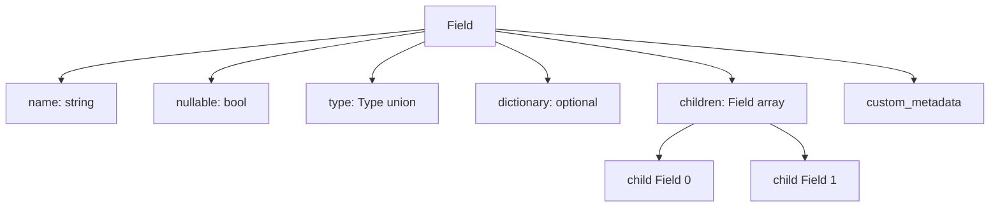

# 第3章 型システムとスキーマ

> **本章で読むソース**
>
> - [`format/Schema.fbs`](https://github.com/apache/arrow/blob/apache-arrow-25.0.0/format/Schema.fbs)
> - [`python/pyarrow/types.pxi`](https://github.com/apache/arrow/blob/apache-arrow-25.0.0/python/pyarrow/types.pxi)

## この章の狙い

第2章で配列の物理レイアウトの共通規則を読んだ。
本章では、列の意味論を決める**型**と、複数列を束ねる**スキーマ**が FlatBuffers の `Schema.fbs` でどう定義され、`pyarrow` の `DataType`、`Field`、`Schema` にどう写像されるかを追う。
型がバッファ本数や子フィールドを決める入口であることを押さえ、第4章以降の個別レイアウトへつなぐ。

## 前提

**データ型**はアプリケーション向けの意味を持ち、第2章の**物理レイアウト**はその意味をメモリ上でどう載せるかを規定する。
Arrow は多くの型でこの二層が一対一に対応し、型名からバッファ列の形が決まる。
レコードバッチやテーブルは、同名の `Field` 列を同じ長さで並べたものであり、全体の型宣言が `Schema` になる。

## Schema.fbs の位置づけ

`Schema.fbs` は論理型、ベクトルレイアウト、スキーマをまとめて定義する。
ファイル先頭のコメントは、フォーマット版の履歴もここに記録されることを示す。

[`format/Schema.fbs` L18-L27](https://github.com/apache/arrow/blob/apache-arrow-25.0.0/format/Schema.fbs#L18-L27)

```text
/// Logical types, vector layouts, and schemas

/// Format Version History.
/// Version 1.0 - Forward and backwards compatibility guaranteed.
/// Version 1.1 - Add Decimal256.
/// Version 1.2 - Add Interval MONTH_DAY_NANO.
/// Version 1.3 - Add Run-End Encoded.
/// Version 1.4 - Add BinaryView, Utf8View, variadicBufferCounts, ListView, and
/// LargeListView.
/// Version 1.5 - Add 32-bit and 64-bit as allowed bit widths for Decimal
```

IPC でメタデータを送るとき、この定義から生成した FlatBuffers メッセージがスキーマ本体になる。
第7章でメッセージ形式と合わせて読む。

## Type union：拡張可能な型タグ

組み込み型は `Type` union の各メンバーとして列挙される。
コメントは、新しい論理型を union に追加しても後方互換を保てる設計であると述べる。

[`format/Schema.fbs` L438-L469](https://github.com/apache/arrow/blob/apache-arrow-25.0.0/format/Schema.fbs#L438-L469)

```text
/// Top-level Type value, enabling extensible type-specific metadata. We can
/// add new logical types to Type without breaking backwards compatibility

union Type {
  Null,
  Int,
  FloatingPoint,
  Binary,
  Utf8,
  Bool,
  Decimal,
  Date,
  Time,
  Timestamp,
  Interval,
  List,
  Struct_,
  Union,
  FixedSizeBinary,
  FixedSizeList,
  Map,
  Duration,
  LargeBinary,
  LargeUtf8,
  LargeList,
  RunEndEncoded,
  BinaryView,
  Utf8View,
  ListView,
  LargeListView,
}
```

union メンバー名が `pyarrow` の型ファクトリや `DataType.id` と対応する。
`Struct_` のように言語予約語を避ける綴りになっている点に注意する。

パラメトリックな型は、union のタグに加えて別テーブルでパラメータを持つ。
`Int` はビット幅と符号の二つを持つ典型例である。

[`format/Schema.fbs` L159-L162](https://github.com/apache/arrow/blob/apache-arrow-25.0.0/format/Schema.fbs#L159-L162)

```text
table Int {
  bitWidth: int; // restricted to 8, 16, 32, and 64 in v1
  is_signed: bool;
}
```

`Utf8` と `Binary` は空テーブルであり、レイアウト種別そのものが型を区別する。
`Utf8View` は 1.4 で追加された可変長ビュー型で、可変本数のデータバッファを伴う。

[`format/Schema.fbs` L188-L206](https://github.com/apache/arrow/blob/apache-arrow-25.0.0/format/Schema.fbs#L188-L206)

```text
/// Logically the same as Utf8, but the internal representation uses a view
/// struct that contains the string length and either the string's entire data
/// inline (for small strings) or an inlined prefix, an index of another buffer,
/// and an offset pointing to a slice in that buffer (for non-small strings).
///
/// Since it uses a variable number of data buffers, each Field with this type
/// must have a corresponding entry in `variadicBufferCounts`.
table Utf8View {
}

/// Logically the same as Binary, but the internal representation uses a view
/// struct that contains the string length and either the string's entire data
/// inline (for small strings) or an inlined prefix, an index of another buffer,
/// and an offset pointing to a slice in that buffer (for non-small strings).
///
/// Since it uses a variable number of data buffers, each Field with this type
/// must have a corresponding entry in `variadicBufferCounts`.
table BinaryView {
}
```

union による拡張は、古いリーダーが未知の型タグを含むスキーマをどう扱うかという互換性問題とセットである。
実装は未知型を拒否するか、拡張型として透過するかを選ぶが、型 ID の追加はフィールドの子ツリー構造を壊さない。

## Field：名前付き列と子ツリー

`Field` はレコードバッチの列、またはネスト型の子を表す。

[`format/Schema.fbs` L508-L531](https://github.com/apache/arrow/blob/apache-arrow-25.0.0/format/Schema.fbs#L508-L531)

```text
/// A field represents a named column in a record / row batch or child of a
/// nested type.

table Field {
  /// Name is not required (e.g., in a List)
  name: string;

  /// Whether or not this field can contain nulls. Should be true in general.
  nullable: bool;

  /// This is the type of the decoded value if the field is dictionary encoded.
  type: Type;

  /// Present only if the field is dictionary encoded.
  dictionary: DictionaryEncoding;

  /// children apply only to nested data types like Struct, List and Union. For
  /// primitive types children will have length 0.
  children: [ Field ];

  /// User-defined metadata
  custom_metadata: [ KeyValue ];
}
```

名前はリストの要素型のように省略されうる。
`nullable` は列全体の null 許容を宣言する。
`children` は `Struct` や `List` のように子型を持つ型だけが非空になり、プリミティブでは長さ 0 になる。
ディクショナリエンコーディングは `dictionary` フィールドで別途宣言する（第6章）。

Mermaid で `Field` の再帰構造を示すと次のようになる。



## Schema：列集合の型宣言

`Schema` はレコードバッチの列定義の並びと、エンディアンやメタデータを保持する。

[`format/Schema.fbs` L554-L569](https://github.com/apache/arrow/blob/apache-arrow-25.0.0/format/Schema.fbs#L554-L569)

```text
/// A Schema describes the columns in a row batch

table Schema {

  /// endianness of the buffer
  /// it is Little Endian by default
  /// if endianness doesn't match the underlying system then the vectors need to be converted
  endianness: Endianness=Little;

  fields: [Field];
  // User-defined metadata
  custom_metadata: [ KeyValue ];

  /// Features used in the stream/file.
  features : [ Feature ];
}
```

`fields` の順序がレコードバッチ内の列順と一致する。
`custom_metadata` には Pandas 由来の型情報など、アプリケーション固有のキーと値が載る。

## pyarrow の DataType

`pyarrow` ではすべての型インスタンスが `DataType` のサブクラスとして表現される。
コンストラクタは直接呼ばず、`pa.int64()` のようなファクトリを使う。

[`python/pyarrow/types.pxi` L209-L222](https://github.com/apache/arrow/blob/apache-arrow-25.0.0/python/pyarrow/types.pxi#L209-L222)

```python
cdef class DataType(_Weakrefable):
    """
    Base class of all Arrow data types.

    Each data type is an *instance* of this class.

    Examples
    --------
    Instance of int64 type:

    >>> import pyarrow as pa
    >>> pa.int64()
    DataType(int64)
    """
```

ネスト型では `DataType.field(i)` が子 `Field` を返す。
C++ コアの `num_fields()` をラップしている。

[`python/pyarrow/types.pxi` L238-L251](https://github.com/apache/arrow/blob/apache-arrow-25.0.0/python/pyarrow/types.pxi#L238-L251)

```python
    cpdef Field field(self, i):
        """
        Parameters
        ----------
        i : int

        Returns
        -------
        pyarrow.Field
        """
        if not isinstance(i, int):
            raise TypeError(f"Expected int index, got type '{type(i)}'")
        cdef int index = <int> _normalize_index(i, self.type.num_fields())
        return pyarrow_wrap_field(self.type.field(index))
```

型から物理レイアウトへの橋は `num_buffers` である。
第2章で触れたバッファ本数は、C++ の `layout().buffers` から取得する。

[`python/pyarrow/types.pxi` L321-L350](https://github.com/apache/arrow/blob/apache-arrow-25.0.0/python/pyarrow/types.pxi#L321-L350)

```python
    def num_buffers(self):
        """
        Number of data buffers required to construct Array type
        excluding children.

        Examples
        --------
        >>> import pyarrow as pa
        >>> pa.int64().num_buffers
        2
        >>> pa.string().num_buffers
        3
        """
        return self.type.layout().buffers.size()

    @property
    def has_variadic_buffers(self):
        """
        If True, the number of expected buffers is only
        lower-bounded by num_buffers.

        Examples
        --------
        >>> import pyarrow as pa
        >>> pa.int64().has_variadic_buffers
        False
        >>> pa.string_view().has_variadic_buffers
        True
        """
        return self.type.layout().variadic_spec.has_value()
```

`string_view` のように `has_variadic_buffers` が真の型は、データバッファが可変本数になる。
`Schema.fbs` の `variadicBufferCounts` と対応し、IPC ではバッファ本数を別途伝える。

## field() ファクトリ

`pyarrow.field` は `Field` を組み立てる公開 API である。

[`python/pyarrow/types.pxi` L3761-L3837](https://github.com/apache/arrow/blob/apache-arrow-25.0.0/python/pyarrow/types.pxi#L3761-L3837)

```python
def field(name, type=None, nullable=None, metadata=None):
    """
    Create a pyarrow.Field instance.

    Parameters
    ----------
    name : str or bytes
        Name of the field.
        Alternatively, you can also pass an object that implements the Arrow
        PyCapsule Protocol for schemas (has an ``__arrow_c_schema__`` method).
    type : pyarrow.DataType or str
        Arrow datatype of the field or a string matching one.
    nullable : bool, default True
        Whether the field's values are nullable.
    metadata : dict, default None
        Optional field metadata, the keys and values must be coercible to
        bytes.
    ...
    """
    # ... (中略) ...
    nullable = True if nullable is None else nullable

    metadata = ensure_metadata(metadata, allow_none=True)
    c_meta = pyarrow_unwrap_metadata(metadata)

    if _type.type.id() == _Type_NA and not nullable:
        raise ValueError("A null type field may not be non-nullable")

    result.sp_field.reset(
        new CField(tobytes(name), _type.sp_type, nullable, c_meta)
    )
```

型引数には文字列エイリアス（`"int32"`）も渡せる。
`ensure_type` が `DataType` へ正規化する。
`null` 型のフィールドを non-nullable にすることは禁止されている。

## schema() ファクトリ

`schema()` は `Field` の列から `Schema` を構築する。

[`python/pyarrow/types.pxi` L5861-L5951](https://github.com/apache/arrow/blob/apache-arrow-25.0.0/python/pyarrow/types.pxi#L5861-L5951)

```python
def schema(fields, metadata=None):
    """
    Construct pyarrow.Schema from collection of fields.

    Parameters
    ----------
    fields : iterable of Fields or tuples, or mapping of strings to DataTypes
        Can also pass an object that implements the Arrow PyCapsule Protocol
        for schemas (has an ``__arrow_c_schema__`` method).
    metadata : dict, default None
        Keys and values must be coercible to bytes.
    ...
    """
    # ... (中略) ...
    if isinstance(fields, Mapping):
        fields = fields.items()

    for item in fields:
        if isinstance(item, tuple):
            py_field = field(*item)
        else:
            py_field = item
        if py_field is None:
            raise TypeError("field or tuple expected, got None")
        c_fields.push_back(py_field.sp_field)

    metadata = ensure_metadata(metadata, allow_none=True)
    c_meta = pyarrow_unwrap_metadata(metadata)

    c_schema.reset(new CSchema(c_fields, c_meta))
    result = Schema.__new__(Schema)
    result.init_schema(c_schema)

    return result
```

タプル `(名前, 型)` の列、 `Field` の列、辞書のいずれも受け付ける。
最終的に C++ の `CSchema` が生成され、Python ラッパーがそれを保持する。

## Field と Schema クラス

`Field` クラスは `pyarrow.field` 経由でのみ構築する。

[`python/pyarrow/types.pxi` L2488-L2495](https://github.com/apache/arrow/blob/apache-arrow-25.0.0/python/pyarrow/types.pxi#L2488-L2495)

```python
    def __init__(self):
        raise TypeError("Do not call Field's constructor directly, use "
                        "`pyarrow.field` instead.")

    cdef void init(self, const shared_ptr[CField]& field):
        self.sp_field = field
        self.field = field.get()
        self.type = pyarrow_wrap_data_type(field.get().type())
```

`Schema` も同様にファクトリ経由である。

[`python/pyarrow/types.pxi` L2853-L2896](https://github.com/apache/arrow/blob/apache-arrow-25.0.0/python/pyarrow/types.pxi#L2853-L2896)

```python
cdef class Schema(_Weakrefable):
    """
    A named collection of types a.k.a schema. A schema defines the
    column names and types in a record batch or table data structure.
    They also contain metadata about the columns. For example, schemas
    converted from Pandas contain metadata about their original Pandas
    types so they can be converted back to the same types.
    ...
    """

    def __init__(self):
        raise TypeError("Do not call Schema's constructor directly, use "
                        "`pyarrow.schema` instead.")

    def __len__(self):
        return self.schema.num_fields()
```

列の選択は `Schema.field` で行う。
名前または整数インデックスを受け付ける。

[`python/pyarrow/types.pxi` L3157-L3179](https://github.com/apache/arrow/blob/apache-arrow-25.0.0/python/pyarrow/types.pxi#L3157-L3179)

```python
    def field(self, i):
        """
        Select a field by its column name or numeric index.

        Parameters
        ----------
        i : int or string

        Returns
        -------
        pyarrow.Field

        Examples
        --------
        >>> import pyarrow as pa
        >>> schema = pa.schema([
        ...     pa.field('n_legs', pa.int64()),
        ...     pa.field('animals', pa.string())])

        Select the second field:

        >>> schema.field(1)
        pyarrow.Field<animals: string>
```

## 型情報からレイアウトを決める利点

配列の実データを読む前に、型とスキーマだけでバッファ本数と子の形が分かる。
カーネルや IPC デコーダは、スキーマを一度パースすれば各列のバッファ列を機械的に割り当てられる。
これは行指向フォーマットで可変長列ごとに別のデコード規則を推測するより、列並列処理の入口を単純に保つ。

`has_variadic_buffers` が立つ型だけ追加のバッファ本数情報が要るが、それ以外は `num_buffers` と `children` の再帰で足りる。

## まとめ

`Schema.fbs` の `Type` union、`Field`、`Schema` が Arrow の型システムの契約層である。
`Field.children` がネスト型のツリーを表し、プリミティブでは空になる。
`pyarrow` は `field()` と `schema()` で C++ コアの `CField` と `CSchema` を組み立て、`DataType.num_buffers` で物理レイアウトへの接続を公開する。
次章では、型ごとに決まる固定長と可変長のレイアウトを `Columnar.rst` と `array.pxi` から読む。

## 関連する章

- 第2章 [列指向メモリレイアウトの原則](../part00-overview/02-columnar-layout.md)：バッファ列と validity ビットマップの共通規則
- 第4章 [固定長・可変長レイアウト](04-fixed-and-variable-layout.md)：`Utf8` と `BinaryView` のメモリ配置
- 第6章 ディクショナリエンコーディング：`Field.dictionary` と `DictionaryEncoding`
- 第7章 メッセージとメタデータ：`Schema` の IPC シリアライズ
