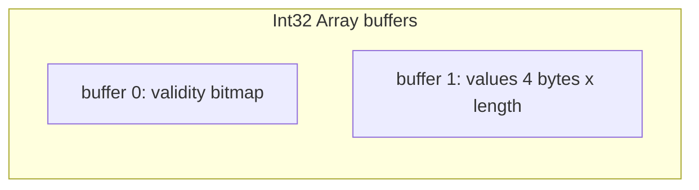
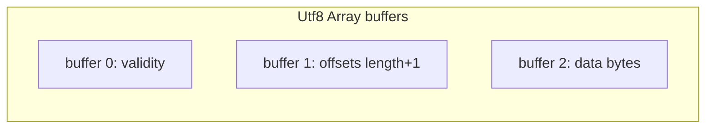

# 第4章 固定長・可変長レイアウト

> **本章で読むソース**
>
> - [`docs/source/format/Columnar.rst`](https://github.com/apache/arrow/blob/apache-arrow-25.0.0/docs/source/format/Columnar.rst)
> - [`python/pyarrow/types.pxi`](https://github.com/apache/arrow/blob/apache-arrow-25.0.0/python/pyarrow/types.pxi)
> - [`python/pyarrow/array.pxi`](https://github.com/apache/arrow/blob/apache-arrow-25.0.0/python/pyarrow/array.pxi)

## この章の狙い

第3章で型とスキーマの契約を読んだ。
本章では、第3章の型のうち固定長プリミティブと可変長バイナリ系の**物理レイアウト**を `Columnar.rst` から追い、`pyarrow` の `Array` がバッファをどう解釈するかまでつなぐ。
ネスト型（リストや struct）は第5章に譲る。

## 前提

第2章で、配列は validity ビットマップと型固有のバッファ列からなることを確認した。
`pa.int64().num_buffers` は 2、`pa.string().num_buffers` は 3 である。
本章はその差がメモリ上で何を意味するかを型別に読む。

## 固定長プリミティブレイアウト

固定長プリミティブは、各スロットが同じバイト幅を持つ値列である。
配列内部には、スロット幅と長さの積以上の連続バッファが一つ置かれる。
ビット単位で詰める `Boolean` 型もこの族に含まれる。

[`docs/source/format/Columnar.rst` L361-L373](https://github.com/apache/arrow/blob/apache-arrow-25.0.0/docs/source/format/Columnar.rst#L361-L373)

```text
A primitive value array represents an array of values each having the
same physical slot width typically measured in bytes, though the spec
also provides for bit-packed types (e.g. boolean values encoded in
bits).

Internally, the array contains a contiguous memory buffer whose total
size is at least as large as the slot width multiplied by the array
length. For bit-packed types, the size is rounded up to the nearest
byte.

The associated validity bitmap is contiguously allocated (as described
above) but does not need to be adjacent in memory to the values
buffer.
```

`Int32` の例は第2章と同じだが、固定長の要点はスロット `j` の値が `values[j * 4]` に直接対応することである。
乱数アクセスは乗算一回で済む。

[`docs/source/format/Columnar.rst` L377-L394](https://github.com/apache/arrow/blob/apache-arrow-25.0.0/docs/source/format/Columnar.rst#L377-L394)

```text
For example a primitive array of int32s: ::

    [1, null, 2, 4, 8]

Would look like: ::

    * Length: 5, Null count: 1
    * Validity bitmap buffer:

      | Byte 0 (validity bitmap) | Bytes 1-63            |
      |--------------------------|-----------------------|
      | 00011101                 | 0 (padding)           |

    * Value Buffer:

      | Bytes 0-3   | Bytes 4-7   | Bytes 8-11  | Bytes 12-15 | Bytes 16-19 | Bytes 20-63           |
      |-------------|-------------|-------------|-------------|-------------|-----------------------|
      | 1           | unspecified | 2           | 4           | 8           | unspecified (padding) |
```

固定長バッファ列を Mermaid で示すと次のようになる。



## 可変長バイナリとオフセットバッファ

可変長バイナリは、値バッファに加えて**オフセット**バッファを持つ。
オフセット配列の長さは `length + 1` で、各スロットの開始位置を符号付き整数（32 または 64 ビット）で格納する。

[`docs/source/format/Columnar.rst` L426-L440](https://github.com/apache/arrow/blob/apache-arrow-25.0.0/docs/source/format/Columnar.rst#L426-L440)

```text
Each value in this layout consists of 0 or more bytes. While primitive
arrays have a single values buffer, variable-size binary have an
**offsets** buffer and **data** buffer.

The offsets buffer contains ``length + 1`` signed integers (either
32-bit or 64-bit, depending on the data type), which encode the
start position of each slot in the data buffer. The length of the
value in each slot is computed using the difference between the offset
at that slot's index and the subsequent offset. For example, the
position and length of slot j is computed as:

::

    slot_position = offsets[j]
    slot_length = offsets[j + 1] - offsets[j]  // (for 0 <= j < length)
```

スロット `j` の長さは隣接オフセットの差分なので、値本体を走査せずに長さが分かる。
これが可変長列でもインデックス参照を定数時間に保つ機構である。

オフセットは単調増加しなければならない。
null スロットでもオフセット差分が正になることがあり、データ領域の中身は未定義のままでよい。

[`docs/source/format/Columnar.rst` L442-L453](https://github.com/apache/arrow/blob/apache-arrow-25.0.0/docs/source/format/Columnar.rst#L442-L453)

```text
It should be noted that a null value may have a positive slot length.
That is, a null value may occupy a **non-empty** memory space in the data
buffer. When this is true, the content of the corresponding memory space
is undefined.

Offsets must be monotonically increasing, that is ``offsets[j+1] >= offsets[j]``
for ``0 <= j < length``, even for null slots. This property ensures the
location for all values is valid and well defined.

Generally the first slot in the offsets array is 0, and the last slot
is the length of the values array. When serializing this layout, we
recommend normalizing the offsets to start at 0.
```

シリアライズ時にオフセットを 0 始まりへ正規化する推奨は、受信側がデータバッファ先頭から連続領域として読めるようにするためである。

`['joe', null, null, 'mark']` の例では、null 二件でもオフセットは `0, 3, 3, 3, 7` と進み、データは `joemark` と一続きに格納される。

[`docs/source/format/Columnar.rst` L455-L478](https://github.com/apache/arrow/blob/apache-arrow-25.0.0/docs/source/format/Columnar.rst#L455-L478)

```text
**Example Layout: ``VarBinary``**

``['joe', null, null, 'mark']``

will be represented as follows: ::

  * Length: 4, Null count: 2
  * Validity bitmap buffer:

    | Byte 0 (validity bitmap) | Bytes 1-63            |
    |--------------------------|-----------------------|
    | 00001001                 | 0 (padding)           |

  * Offsets buffer:

    | Bytes 0-19     | Bytes 20-63           |
    |----------------|-----------------------|
    | 0, 3, 3, 3, 7  | unspecified (padding) |

   * Value buffer:

    | Bytes 0-6      | Bytes 7-63            |
    |----------------|-----------------------|
    | joemark        | unspecified (padding) |
```

`Utf8` と `Binary` はレイアウトが同一で、意味論上 `Utf8` は有効な UTF-8 バイト列を期待するだけである。
`LargeUtf8` と `LargeBinary` はオフセット幅が 64 ビットになり、単一配列あたり 2GB 制限を超えるデータを扱える。



## Binary View レイアウト

フォーマット 1.4 で追加された **Binary View** は、古典的なオフセット方式とは別の可変長表現である。
各値の位置は **views** バッファの 16 バイト構造体で示され、データは複数のデータバッファに分散しうる。

[`docs/source/format/Columnar.rst` L487-L504](https://github.com/apache/arrow/blob/apache-arrow-25.0.0/docs/source/format/Columnar.rst#L487-L504)

```text
Each value in this layout consists of 0 or more bytes. These bytes'
locations are indicated using a **views** buffer, which may point to one
of potentially several **data** buffers or may contain the characters
inline.

The views buffer contains ``length`` view structures with the following layout:

::

    * Short strings, length <= 12
      | Bytes 0-3  | Bytes 4-15                            |
      |------------|---------------------------------------|
      | length     | data (padded with 0)                  |

    * Long strings, length > 12
      | Bytes 0-3  | Bytes 4-7  | Bytes 8-11 | Bytes 12-15 |
      |------------|------------|------------|-------------|
      | length     | prefix     | buf. index | offset      |
```

先頭 4 バイトは常に長さである。
12 バイト以下は view 内にインライン格納され、データバッファへの間接参照が不要になる。
長い文字列はバッファ番号とオフセットで外部バッファを指し、先頭 4 バイトのコピーを prefix として view 内に持つ。

[`docs/source/format/Columnar.rst` L506-L508](https://github.com/apache/arrow/blob/apache-arrow-25.0.0/docs/source/format/Columnar.rst#L506-L508)

```text
In both the long and short string cases, the first four bytes encode the
length of the string and can be used to determine how the rest of the view
should be interpreted.
```

12 バイト以下の短い文字列は、長さの直後 12 バイトに本体をインライン格納する。
残りはゼロパディングする。

[`docs/source/format/Columnar.rst` L514-L522](https://github.com/apache/arrow/blob/apache-arrow-25.0.0/docs/source/format/Columnar.rst#L514-L522)

```text
In the long string case, a buffer index indicates which data buffer
stores the data bytes and an offset indicates where in that buffer the
data bytes begin. Buffer index 0 refers to the first data buffer, IE
the first buffer **after** the validity buffer and the views buffer.
The half-open range ``[offset, offset + length)`` must be entirely contained
within the indicated buffer. A copy of the first four bytes of the string is
stored inline in the prefix, after the length. This prefix enables a
profitable fast path for string comparisons, which are frequently determined
within the first four bytes.
```

インライン短文字列はヒープ追跡を避け、比較では prefix だけで早期判定できる。
可変本数のデータバッファは第3章の `has_variadic_buffers` と `variadicBufferCounts` で本数が伝わる。

[`docs/source/format/Columnar.rst` L528-L529](https://github.com/apache/arrow/blob/apache-arrow-25.0.0/docs/source/format/Columnar.rst#L528-L529)

```text
Note that this layout uses one additional buffer to store the variadic buffer
lengths in the :ref:`Arrow C data interface <c-data-interface-binary-view-arrays>`.
```

## pyarrow の Array 基底

すべての配列は `Array` を継承する。
コンストラクタは公開されず、`array()` や `from_buffers()` を使う。

[`python/pyarrow/array.pxi` L1126-L1134](https://github.com/apache/arrow/blob/apache-arrow-25.0.0/python/pyarrow/array.pxi#L1126-L1134)

```python
cdef class Array(_PandasConvertible):
    """
    The base class for all Arrow arrays.
    """

    def __init__(self):
        raise TypeError(f"Do not call {self.__class__.__name__}'s constructor "
                        "directly, use one of the `pyarrow.Array.from_*` "
                        "functions instead.")
```

`slice` は同じバッファを共有したまま `offset` だけを進めるゼロコピー操作である。

[`python/pyarrow/array.pxi` L1620-L1650](https://github.com/apache/arrow/blob/apache-arrow-25.0.0/python/pyarrow/array.pxi#L1620-L1650)

```python
    def slice(self, offset=0, length=None):
        """
        Compute zero-copy slice of this array.

        Parameters
        ----------
        offset : int, default 0
            Offset from start of array to slice.
        length : int, default None
            Length of slice (default is until end of Array starting from
            offset).
        ...
        """
        # ... (中略) ...
        offset = min(len(self), offset)
        if length is None:
            result = self.ap.Slice(offset)
        else:
            if length < 0:
                raise ValueError('Length must be non-negative')
            result = self.ap.Slice(offset, length)

        return pyarrow_wrap_array(result)
```

固定長では `offset` は値個数、可変長オフセットバッファではスロット境界のずれとして効く。

## StringArray とバッファ列の組み立て

`StringArray.from_buffers` は、古典的 `Utf8` レイアウトの三バッファを明示的に渡す API である。
バッファ順は `[null_bitmap, value_offsets, data]` である。

[`python/pyarrow/array.pxi` L3977-L4001](https://github.com/apache/arrow/blob/apache-arrow-25.0.0/python/pyarrow/array.pxi#L3977-L4001)

```python
    @staticmethod
    def from_buffers(int length, Buffer value_offsets, Buffer data,
                     Buffer null_bitmap=None, int null_count=-1,
                     int offset=0):
        """
        Construct a StringArray from value_offsets and data buffers.
        If there are nulls in the data, also a null_bitmap and the matching
        null_count must be passed.
        ...
        """
        return Array.from_buffers(utf8(), length,
                                  [null_bitmap, value_offsets, data],
                                  null_count, offset)
```

`null_bitmap` に `None` を渡せば validity 省略を表現できる（第2章）。
`value_offsets` の要素数は `length + 1` である必要があり、仕様の単調増加制約を満たす必要がある。

## BinaryArray とデータ領域のサイズ

`BinaryArray` は可変長バイナリ列の具象クラスである。
`total_values_length` は、オフセットが参照するデータバッファ上のバイト範囲の総長を返す。

[`python/pyarrow/array.pxi` L4042-L4052](https://github.com/apache/arrow/blob/apache-arrow-25.0.0/python/pyarrow/array.pxi#L4042-L4052)

```python
cdef class BinaryArray(Array):
    """
    Concrete class for Arrow arrays of variable-sized binary data type.
    """
    @property
    def total_values_length(self):
        """
        The number of bytes from beginning to end of the data buffer addressed
        by the offsets of this BinaryArray.
        """
        return (<CBinaryArray*> self.ap).total_values_length()
```

通常、先頭オフセットが 0 で末尾がデータ長に等しければ、この値はデータバッファの使用バイト数と一致する。
正規化されていないオフセット列では、先頭より前や末尾より後の未使用領域を含む場合がある。

`StringViewArray` と `BinaryViewArray` は view レイアウト用の具象クラスとして定義されている。

[`python/pyarrow/array.pxi` L4036-L4071](https://github.com/apache/arrow/blob/apache-arrow-25.0.0/python/pyarrow/array.pxi#L4036-L4071)

```python
cdef class StringViewArray(Array):
    """
    Concrete class for Arrow arrays of string (or utf8) view data type.
    """


cdef class BinaryArray(Array):
    ...


cdef class BinaryViewArray(Array):
    """
    Concrete class for Arrow arrays of variable-sized binary view data type.
    """
```

型側では `pa.string_view().has_variadic_buffers` が真となり、データバッファ本数は配列ごとに可変である。

[`python/pyarrow/types.pxi` L345-L348](https://github.com/apache/arrow/blob/apache-arrow-25.0.0/python/pyarrow/types.pxi#L345-L348)

```python
        >>> pa.int64().has_variadic_buffers
        False
        >>> pa.string_view().has_variadic_buffers
        True
```

## まとめ

固定長プリミティブは validity と値の二バッファで、スロット幅が一定なためインデックス計算が単純である。
古典的な `Utf8` と `Binary` はオフセットとデータの三バッファで、単調増加オフセットによりスロット長を O(1) で得る。
`BinaryView` は view 構造体と可変個のデータバッファで、短い値のインライン格納と比較用 prefix による高速化を狙う。
`pyarrow` は `StringArray.from_buffers` で三バッファ組み立てを、`Array.slice` でゼロコピースライスを提供する。

## 関連する章

- 第2章 [列指向メモリレイアウトの原則](../part00-overview/02-columnar-layout.md)：validity ビットマップとアライメント
- 第3章 [型システムとスキーマ](03-type-system.md)：`num_buffers` と `has_variadic_buffers`
- 第5章 ネストレイアウト：オフセットを子配列へ向けた `List` と `Struct`
- 第10章 Buffer とメモリ管理：バッファのスライスとゼロコピー
