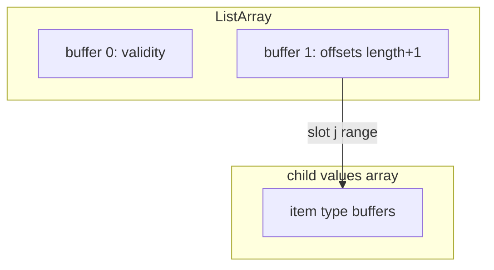

# 第5章 ネストレイアウト

> **本章で読むソース**
>
> - [`docs/source/format/Columnar.rst`](https://github.com/apache/arrow/blob/apache-arrow-25.0.0/docs/source/format/Columnar.rst)
> - [`format/Schema.fbs`](https://github.com/apache/arrow/blob/apache-arrow-25.0.0/format/Schema.fbs)
> - [`python/pyarrow/types.pxi`](https://github.com/apache/arrow/blob/apache-arrow-25.0.0/python/pyarrow/types.pxi)
> - [`python/pyarrow/array.pxi`](https://github.com/apache/arrow/blob/apache-arrow-25.0.0/python/pyarrow/array.pxi)

## この章の狙い

第4章で固定長プリミティブと可変長バイナリのレイアウトを読んだ。
本章では、列の値が子配列を持つ**ネスト型**の物理配置を `Columnar.rst` から追い、`Schema.fbs` の型定義と `pyarrow` の配列クラスまでつなぐ。
オフセットがデータバッファではなく子配列を指す `List`、フィールドごとに独立した子を持つ `Struct`、型タグで分岐する `Union`、連続キーと値を束ねる `Map`、同一値の連続を圧縮する `RunEndEncoded` を扱う。

## 前提

第2章で、配列は validity ビットマップと型固有のバッファ列からなることを確認した。
第3章で、`Field.children` がネスト型のツリーを表すことを読んだ。
ネスト型は親配列のバッファに加えて、再帰的な**子配列**を持つ。
子配列はメモリ上で隣接している必要はなく、親の `ArrayData` が子への参照を保持する。

## List レイアウト

**可変長リスト**は、意味論では第4章の可変長バイナリに近い。
物理配置は validity ビットマップ、オフセットバッファ、子配列の三要素で構成される。
オフセットは `length + 1` 個の符号付き整数であり、各スロットの開始位置を子配列内のインデックスで表す。
スロット長は隣接オフセットの差で O(1) に得られる。

[`docs/source/format/Columnar.rst` L541-L549](https://github.com/apache/arrow/blob/apache-arrow-25.0.0/docs/source/format/Columnar.rst#L541-L549)

```text
List Layout
~~~~~~~~~~~

The List layout is defined by two buffers, a validity bitmap and an offsets
buffer, and a child array. The offsets are the same as in the
variable-size binary case, and both 32-bit and 64-bit signed integer
offsets are supported options for the offsets. Rather than referencing
an additional data buffer, instead these offsets reference the child
array.
```

`List<Int8>` の例では、親の長さ 4 に対し子配列の長さ 7 になる。
親スロットが null でも、子配列上の対応セグメントが空でない場合がある。
このときセグメント内容は任意であり、読み手は親の validity を優先する。

[`docs/source/format/Columnar.rst` L551-L553](https://github.com/apache/arrow/blob/apache-arrow-25.0.0/docs/source/format/Columnar.rst#L551-L553)

```text
Similar to the layout of variable-size binary, a null value may
correspond to a **non-empty** segment in the child array. When this is
true, the content of the corresponding segment can be arbitrary.
```

[`docs/source/format/Columnar.rst` L561-L587](https://github.com/apache/arrow/blob/apache-arrow-25.0.0/docs/source/format/Columnar.rst#L561-L587)

```text
We illustrate an example of ``List<Int8>`` with length 4 having values::

    [[12, -7, 25], null, [0, -127, 127, 50], []]

will have the following representation: ::

    * Length: 4, Null count: 1
    // ... (中略) ...
    * Offsets buffer (int32)

      | Bytes 0-3  | Bytes 4-7   | Bytes 8-11  | Bytes 12-15 | Bytes 16-19 | Bytes 20-63           |
      |------------|-------------|-------------|-------------|-------------|-----------------------|
      | 0          | 3           | 3           | 7           | 7           | unspecified (padding) |

    * Values array (Int8Array):
      * Length: 7,  Null count: 0
      // ... (中略) ...
        | 12, -7, 25, 0, -127, 127, 50 | unspecified (padding) |
```

`Schema.fbs` では `List` と `LargeList` が空テーブルとして union に登録され、オフセット幅の違いだけが型タグで区別される。
`FixedSizeList` は `listSize` パラメータを持ち、オフセットバッファを省略する。

[`format/Schema.fbs` L94-L116](https://github.com/apache/arrow/blob/apache-arrow-25.0.0/format/Schema.fbs#L94-L116)

```text
table List {
}

/// Same as List, but with 64-bit offsets, allowing to represent
/// extremely large data values.
table LargeList {
}

// ... (中略) ...

table FixedSizeList {
  /// Number of list items per value
  listSize: int;
}
```

`pyarrow` の `list_()` は可変長と固定長を引数 `list_size` で切り替える。

[`python/pyarrow/types.pxi` L4957-L4980](https://github.com/apache/arrow/blob/apache-arrow-25.0.0/python/pyarrow/types.pxi#L4957-L4980)

```python
def list_(value_type, int list_size=-1):
    """
    Create ListType instance from child data type or field.
    // ... (中略) ...
    list_size : int, optional, default -1
        If length == -1 then return a variable length list type. If length is
        greater than or equal to 0 then return a fixed size list type.
    // ... (中略) ...
    >>> pa.list_(pa.string())
    ListType(list<item: string>)
    >>> pa.list_(pa.int32(), 2)
    FixedSizeListType(fixed_size_list<item: int32>[2])
```

`ListArray.from_arrays` はオフセット配列と値の子配列から `CListArray` を組み立てる。
組み立て後に `validate()` を呼び、オフセットの単調性などを検査する。

[`python/pyarrow/array.pxi` L2774-L2855](https://github.com/apache/arrow/blob/apache-arrow-25.0.0/python/pyarrow/array.pxi#L2774-L2855)

```python
cdef class ListArray(BaseListArray):
    """
    Concrete class for Arrow arrays of a list data type.
    """

    @staticmethod
    def from_arrays(offsets, values, DataType type=None, MemoryPool pool=None, mask=None):
        """
        Construct ListArray from arrays of int32 offsets and values.
        // ... (中略) ...
        """
        // ... (中略) ...
        cdef Array result = pyarrow_wrap_array(out)
        result.validate()
        return result
```

List のバッファ構成を Mermaid で示すと次のようになる。



## ListView レイアウト

**ListView** はフォーマット 1.4 で追加されたリストの別バリエーションである。
validity、オフセット、**サイズ**の三バッファと子配列で構成される。
List と異なり、スロット長はオフセット差ではなく sizes バッファに明示格納される。

[`docs/source/format/Columnar.rst` L633-L641](https://github.com/apache/arrow/blob/apache-arrow-25.0.0/docs/source/format/Columnar.rst#L633-L641)

```text
The ListView layout is defined by three buffers: a validity bitmap, an offsets
buffer, and an additional sizes buffer. Sizes and offsets have the identical bit
width and both 32-bit and 64-bit signed integer options are supported.

As in the List layout, the offsets encode the start position of each slot in the
child array. In contrast to the List layout, list lengths are stored explicitly
in the sizes buffer instead of inferred. This allows offsets to be out of order.
Elements of the child array do not have to be stored in the same order they
logically appear in the list elements of the parent array.
```

各スロットは次の不変条件を満たす。
オフセットとサイズの和が子配列長を超えないことである。

[`docs/source/format/Columnar.rst` L643-L647](https://github.com/apache/arrow/blob/apache-arrow-25.0.0/docs/source/format/Columnar.rst#L643-L647)

```text
Every list-view value, including null values, has to guarantee the following
invariants: ::

    0 <= offsets[i] <= length of the child array
    0 <= offsets[i] + size[i] <= length of the child array
```

ListView の利点は、子配列への追記とスロットの並べ替えを分離できる点にある。
List ではオフセットの単調増加が子配列の走査順を固定するが、ListView では sizes が長さを担うためオフセットを並べ替え可能である。
複数スロットが子配列の同一区間を指す**共有**も表現できる。
追記中心のビルダや、子データのデフラグを遅延したいパイプラインでメモリコピーを減らせる。

## Struct レイアウト

**struct** は名前付きフィールドの順序列でパラメータ化されるネスト型である。
物理配置では、フィールド数と同数の子配列と、親の validity ビットマップを持つ。
子配列は互いに独立であり、メモリ上で隣接している必要はない。

[`docs/source/format/Columnar.rst` L771-L779](https://github.com/apache/arrow/blob/apache-arrow-25.0.0/docs/source/format/Columnar.rst#L771-L779)

```text
A struct is a nested type parameterized by an ordered sequence of
types (which can all be distinct), called its fields. Each field must
have a UTF8-encoded name, and these field names are part of the type
metadata.

Physically, a struct array has one child array for each field. The
child arrays are independent and need not be adjacent to each other in
memory. A struct array also has a validity bitmap to encode top-level
validity information.
```

struct の validity は子配列の validity と独立である。
あるスロットで子が非 null でも親 struct が null と印字される場合がある。
子の有効性を判定するときは、親と子の validity ビットの論理積を取る。

[`docs/source/format/Columnar.rst` L844-L853](https://github.com/apache/arrow/blob/apache-arrow-25.0.0/docs/source/format/Columnar.rst#L844-L853)

```text
A struct array has its own validity bitmap that is independent of its
child arrays' validity bitmaps. The validity bitmap for the struct
array might indicate a null when one or more of its child arrays has
a non-null value in its corresponding slot; or conversely, a child
array might indicate a null in its validity bitmap while the struct array's
validity bitmap shows a non-null value.

Therefore, to know whether a particular child entry is valid, one must
take the logical AND of the corresponding bits in the two validity bitmaps
(the struct array's and the child array's).
```

`Schema.fbs` では FlatBuffers の予約語を避けて `Struct_` と綴る。

[`format/Schema.fbs` L88-L92](https://github.com/apache/arrow/blob/apache-arrow-25.0.0/format/Schema.fbs#L88-L92)

```text
/// A Struct_ in the flatbuffer metadata is the same as an Arrow Struct
/// (according to the physical memory layout). We used Struct_ here as
/// Struct is a reserved word in Flatbuffers
table Struct_ {
}
```

`StructArray.field` は名前またはインデックスで子配列を返す。
`_flattened_field` は親の null ビットマップを子に合成した配列を返す。

[`python/pyarrow/array.pxi` L4227-L4259](https://github.com/apache/arrow/blob/apache-arrow-25.0.0/python/pyarrow/array.pxi#L4227-L4259)

```python
cdef class StructArray(Array):
    """
    Concrete class for Arrow arrays of a struct data type.
    """

    def field(self, index):
        """
        Retrieves the child array belonging to field.
        // ... (中略) ...
        """
        cdef:
            CStructArray* arr = <CStructArray*> self.ap
            shared_ptr[CArray] child

        if isinstance(index, (bytes, str)):
            child = arr.GetFieldByName(tobytes(index))
            // ... (中略) ...
        elif isinstance(index, int):
            child = arr.field(
                <int>_normalize_index(index, self.ap.num_fields()))
        // ... (中略) ...

        return pyarrow_wrap_array(child)
```

## Map 型

**Map** は各行が可変個のキーと値のペアを持つネスト型である。
物理配置は `List<entries: Struct<key, value>>` と同一である。
キー列と値列がそれぞれ連続した子配列として並ぶ点が、名前がスキーマに固定される struct との違いである。

[`format/Schema.fbs` L118-L137](https://github.com/apache/arrow/blob/apache-arrow-25.0.0/format/Schema.fbs#L118-L137)

```text
/// A Map is a logical nested type that is represented as
///
/// List<entries: Struct<key: K, value: V>>
///
/// In this layout, the keys and values are each respectively contiguous. We do
/// not constrain the key and value types, so the application is responsible
/// for ensuring that the keys are hashable and unique. Whether the keys are sorted
/// may be set in the metadata for this field.
// ... (中略) ...
/// Map
/// ```text
///   - child[0] entries: Struct
///     - child[0] key: K
///     - child[1] value: V
/// ```
```

型一覧表でも Map は「可変長 List of Structs」と記される。

[`docs/source/format/Columnar.rst` L162-L163](https://github.com/apache/arrow/blob/apache-arrow-25.0.0/docs/source/format/Columnar.rst#L162-L163)

```text
| Map                | * *children*                 | Variable-size List of Structs                              |
|                    | * keys sortedness            |                                                            |
```

`MapType` は `keys_sorted` メタデータを持ち、各マップ内のキー順序が保証されるかを示す。

[`python/pyarrow/types.pxi` L5156-L5178](https://github.com/apache/arrow/blob/apache-arrow-25.0.0/python/pyarrow/types.pxi#L5156-L5178)

```python
cpdef MapType map_(key_type, item_type, keys_sorted=False):
    """
    Create MapType instance from key and item data types or fields.
    // ... (中略) ...
    >>> pa.map_(pa.string(), pa.int32())
    MapType(map<string, int32>)
    >>> pa.map_(pa.string(), pa.int32(), keys_sorted=True)
    MapType(map<string, int32, keys_sorted>)
```

`MapArray` は `ListArray` を継承し、平坦化された `keys` と `items` へのアクセスを提供する。
`from_arrays` は List と同様にオフセットから各行のエントリ範囲を切り出す。

[`python/pyarrow/array.pxi` L3549-L3557](https://github.com/apache/arrow/blob/apache-arrow-25.0.0/python/pyarrow/array.pxi#L3549-L3557)

```python
cdef class MapArray(ListArray):
    """
    Concrete class for Arrow arrays of a map data type.
    """

    @staticmethod
    def from_arrays(offsets, keys, items, DataType type=None, MemoryPool pool=None, mask=None):
        """
        Construct MapArray from arrays of int32 offsets and key, item arrays.
```

[`python/pyarrow/array.pxi` L3676-L3683](https://github.com/apache/arrow/blob/apache-arrow-25.0.0/python/pyarrow/array.pxi#L3676-L3683)

```python
    @property
    def keys(self):
        """Flattened array of keys across all maps in array"""
        return pyarrow_wrap_array((<CMapArray*> self.ap).keys())

    @property
    def items(self):
        """Flattened array of items across all maps in array"""
        return pyarrow_wrap_array((<CMapArray*> self.ap).items())
```

キーと値が別々の連続配列に並ぶため、キーだけを走査するカーネルは値バッファを読まずに済む。
これはハッシュ結合やキー比較の前処理でキャッシュ効率を上げる。

## Union レイアウト

**Union** は各スロットが候補型のいずれか一つを持つ混合型配列である。
他のネスト型と異なり、Union 自体には validity ビットマップがない。
スロットの null 性は、型タグで選ばれた子配列の validity だけで決まる。

[`docs/source/format/Columnar.rst` L867-L872](https://github.com/apache/arrow/blob/apache-arrow-25.0.0/docs/source/format/Columnar.rst#L867-L872)

```text
Unlike other data types, unions do not have their own validity bitmap. Instead,
the nullness of each slot is determined exclusively by the child arrays which
are composed to create the union.

We define two distinct union types, "dense" and "sparse", that are
optimized for different use cases.
```

**Dense Union** は型 ID バッファ（8 ビット符号付き整数）とオフセットバッファ（Int32）を持つ。
各子配列は実際に出現した値だけを格納し、スロットごとのオーバーヘッドは 5 バイトである。
子配列内のオフセットは型ごとに単調増加しなければならない。

[`docs/source/format/Columnar.rst` L877-L888](https://github.com/apache/arrow/blob/apache-arrow-25.0.0/docs/source/format/Columnar.rst#L877-L888)

```text
Dense union represents a mixed-type array with 5 bytes of overhead for
each value. Its physical layout is as follows:

* One child array for each type
* Types buffer: A buffer of 8-bit signed integers. Each type in the
  union has a corresponding type id whose values are found in this
  buffer. A union with more than 128 possible types can be modeled as
  a union of unions.
* Offsets buffer: A buffer of signed Int32 values indicating the
  relative offset into the respective child array for the type in a
  given slot. The respective offsets for each child value array must
  be in order / increasing.
```

**Sparse Union** はオフセットバッファを省略し、各子配列の長さが親と等しい。
未選択のスロットは子配列上で null として埋められる。
メモリは増えるが、子配列が等長のためベクトル化評価に向く場合がある。

[`docs/source/format/Columnar.rst` L936-L945](https://github.com/apache/arrow/blob/apache-arrow-25.0.0/docs/source/format/Columnar.rst#L936-L945)

```text
A sparse union has the same structure as a dense union, with the omission of
the offsets array. In this case, the child arrays are each equal in length to
the length of the union.

While a sparse union may use significantly more space compared with a
dense union, it has some advantages that may be desirable in certain
use cases:

* A sparse union is more amenable to vectorized expression evaluation in some use cases.
* Equal-length arrays can be interpreted as a union by only defining the types array.
```

`Schema.fbs` の `Union` テーブルは `mode` と任意の `typeIds` を持つ。

[`format/Schema.fbs` L148-L157](https://github.com/apache/arrow/blob/apache-arrow-25.0.0/format/Schema.fbs#L148-L157)

```text
enum UnionMode:short { Sparse, Dense }

/// A union is a complex type with children in Field
/// By default ids in the type vector refer to the offsets in the children
/// optionally typeIds provides an indirection between the child offset and the type id
/// for each child `typeIds[offset]` is the id used in the type vector
table Union {
  mode: UnionMode;
  typeIds: [ int ]; // optional, describes typeid of each child.
}
```

`UnionArray.field` は dense と sparse で返す子配列のオフセット調整が異なる。

[`python/pyarrow/array.pxi` L3841-L3864](https://github.com/apache/arrow/blob/apache-arrow-25.0.0/python/pyarrow/array.pxi#L3841-L3864)

```python
    def field(self, int pos):
        """
        Return the given child field as an individual array.

        For sparse unions, the returned array has its offset, length,
        and null count adjusted.

        For dense unions, the returned array is unchanged.
        // ... (中略) ...
        """
        cdef shared_ptr[CArray] result
        result = (<CUnionArray*> self.ap).field(pos)
        if result != NULL:
            return pyarrow_wrap_array(result)
        raise KeyError(f"UnionArray does not have child {pos}")
```

Dense は型ごとの子配列が圧縮されるためストレージ効率が高い。
Sparse は全子が等長のまま型タグだけ変えればよいため、既存の等長列群を Union に昇格させやすい。

## Run-End Encoded レイアウト

**Run-End Encoded**（REE）はフォーマット 1.3 で追加されたエンコーディングである。
同一値が連続する**ラン**を、値と「そのランが終わる論理インデックス」の組で表す。
RLE と異なり、ラン長ではなく累積終端位置を格納する。

[`docs/source/format/Columnar.rst` L1090-L1108](https://github.com/apache/arrow/blob/apache-arrow-25.0.0/docs/source/format/Columnar.rst#L1090-L1108)

```text
Run-end encoding (REE) is a variation of run-length encoding (RLE). These
encodings are well-suited for representing data containing sequences of the
same value, called runs. In run-end encoding, each run is represented as a
value and an integer giving the index in the array where the run ends.

Any array can be run-end encoded. A run-end encoded array has no buffers
by itself, but has two child arrays. The first child array, called the run ends array,
holds either 16, 32, or 64-bit signed integers. The actual values of each run
are held in the second child array.
// ... (中略) ...
The values in the first child array represent the accumulated length of all runs
from the first to the current one, i.e. the logical index where the
current run ends. This allows relatively efficient random access from a logical
index using binary search. The length of an individual run can be determined by
subtracting two adjacent values.
```

親 REE 配列自体に validity ビットマップはなく、null は values 子配列の null ランとして表現する。

[`docs/source/format/Columnar.rst` L1127-L1128](https://github.com/apache/arrow/blob/apache-arrow-25.0.0/docs/source/format/Columnar.rst#L1127-L1128)

```text
The REE parent has no validity bitmap, and it's null count field should always be 0.
Null values are encoded as runs with the value null.
```

`run_ends` を子配列にした設計は、論理長（デコード後の長さ）と物理長（ラン数）を分離するためである。
親にバッファとして持つと、親の `length` とバッファサイズの対応が曖昧になる。

[`docs/source/format/Columnar.rst` L1116-L1120](https://github.com/apache/arrow/blob/apache-arrow-25.0.0/docs/source/format/Columnar.rst#L1116-L1120)

```text
   Child arrays allow us to keep the "logical length" (the decoded length)
   associated with the parent array and the "physical length" (the number
   of run ends) associated with the child arrays.  If ``run_ends`` was a
   buffer in the parent array then the size of the buffer would be unrelated
   to the length of the array and this would be confusing.
```

累積終端インデックスを二分探索すれば、論理インデックスからランを O(log R) で特定できる（R はラン数）。
ラン数が論理長より十分小さいとき、スキャンよりランダムアクセスが有利になる。

`RunEndEncodedArray.from_arrays` は最後の run_end から論理長を推定する。

[`python/pyarrow/array.pxi` L4480-L4499](https://github.com/apache/arrow/blob/apache-arrow-25.0.0/python/pyarrow/array.pxi#L4480-L4499)

```python
    @staticmethod
    def from_arrays(run_ends, values, type=None):
        """
        Construct RunEndEncodedArray from run_ends and values arrays.
        // ... (中略) ...
        """
        logical_length = scalar(run_ends[-1]).as_py() if len(run_ends) > 0 else 0
        return RunEndEncodedArray._from_arrays(type, True, logical_length,
                                               run_ends, values, 0)
```

## バッファ一覧との対応

`Columnar.rst` 末尾の表は、レイアウト種別ごとのバッファ順序を一覧する。
ネスト型の多くは validity のあと型固有バッファを持ち、実データは子配列側にある。

[`docs/source/format/Columnar.rst` L1172-L1187](https://github.com/apache/arrow/blob/apache-arrow-25.0.0/docs/source/format/Columnar.rst#L1172-L1187)

```text
.. csv-table:: Buffer Layouts
   :header: "Layout Type", "Buffer 0", "Buffer 1", "Buffer 2", "Variadic Buffers"
   // ... (中略) ...
   "List",validity,offsets,,
   "List View",validity,offsets,sizes,
   "Fixed-size List",validity,,,
   "Struct",validity,,,
   "Sparse Union",type ids,,,
   "Dense Union",type ids,offsets,,
   "Run-end encoded",,,,
```

REE と Union は親にデータバッファがなく、子配列の再帰で解釈が完結する。

## まとめ

ネスト型は親のバッファ（オフセット、型 ID、サイズなど）と子配列の組み合わせで表現される。
`List` は可変長バイナリと同型のオフセットを子配列へ向ける。
`ListView` は sizes によりオフセットの並べ替えと子データ共有を可能にする。
`Struct` はフィールドごとの独立した子を持ち、親子の validity は論理積で解釈する。
`Map` は List of Struct としてキー列と値列を連続配置する。
`Union` は dense と sparse の二形態で、ストレージ効率とベクトル化のしやすさを切り替える。
`RunEndEncoded` は累積 run_end によりラン列への二分探索でランダムアクセスを可能にする。
`pyarrow` は各型に対応する `Array` サブクラスと `from_arrays` ファクトリで C++ コアへ委譲する。

## 関連する章

- 第3章 [型システムとスキーマ](03-type-system.md)：`Field.children` と `Type` union
- 第4章 [固定長・可変長レイアウト](04-fixed-and-variable-layout.md)：オフセットの基礎
- 第6章 [ディクショナリエンコーディング](06-dictionary-encoding.md)：別系統の圧縮表現
- 第7章 メッセージとメタデータ：ネスト列を含むレコードバッチの IPC
