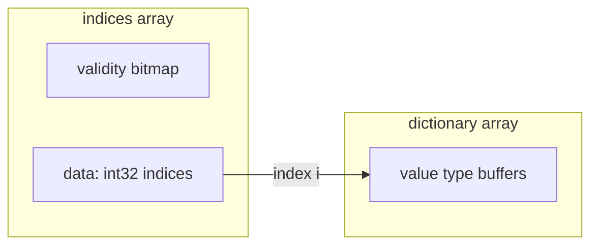

# 第6章 ディクショナリエンコーディング

> **本章で読むソース**
>
> - [`docs/source/format/Columnar.rst`](https://github.com/apache/arrow/blob/apache-arrow-25.0.0/docs/source/format/Columnar.rst)
> - [`format/Schema.fbs`](https://github.com/apache/arrow/blob/apache-arrow-25.0.0/format/Schema.fbs)
> - [`format/Message.fbs`](https://github.com/apache/arrow/blob/apache-arrow-25.0.0/format/Message.fbs)
> - [`python/pyarrow/types.pxi`](https://github.com/apache/arrow/blob/apache-arrow-25.0.0/python/pyarrow/types.pxi)
> - [`python/pyarrow/array.pxi`](https://github.com/apache/arrow/blob/apache-arrow-25.0.0/python/pyarrow/array.pxi)

## この章の狙い

第5章でネスト型の物理配置を読んだ。
本章では、値そのものではなく**辞書**への整数インデックスで値を間接参照する**ディクショナリエンコーディング**を扱う。
`Columnar.rst` のレイアウト規則、`Schema.fbs` のメタデータ、`Message.fbs` の IPC メッセージ、`pyarrow` の `DictionaryArray` を一連の流れとして追う。

## 前提

第3章で、`Field.dictionary` がディクショナリ型の宣言に使われることを確認した。
第4章で、プリミティブ整数配列は validity と値の二バッファであることを読んだ。
ディクショナリエンコードされた列のインデックス部分は、物理配置がプリミティブ整数と同一である。
辞書本体は別の列指向配列として並び、IPC では別メッセージで送られる。

## ディクショナリエンコーディングの意味

**ディクショナリエンコーディング**は、繰り返しの多い値を整数インデックスに置き換える表現技法である。
インデックス配列は非負整数で辞書内の位置を指す。
辞書は列指向配列として独立に保持され、インデックス列とは別レイアウトを持てる。

[`docs/source/format/Columnar.rst` L1028-L1038](https://github.com/apache/arrow/blob/apache-arrow-25.0.0/docs/source/format/Columnar.rst#L1028-L1038)

```text
Dictionary encoding is a data representation technique to represent
values by integers referencing a **dictionary** usually consisting of
unique values. It can be effective when you have data with many
repeated values.

Any array can be dictionary-encoded. The dictionary is stored as an optional
property of an array. When a field is dictionary encoded, the values are
represented by an array of non-negative integers representing the index of the
value in the dictionary. The memory layout for a dictionary-encoded array is
the same as that of a primitive integer layout. The dictionary is handled as a
separate columnar array with its own respective layout.
```

具体例では、6 要素の `VarBinary` 列がインデックス列と 3 要素の辞書に分かれる。

[`docs/source/format/Columnar.rst` L1040-L1056](https://github.com/apache/arrow/blob/apache-arrow-25.0.0/docs/source/format/Columnar.rst#L1040-L1056)

```text
As an example, you could have the following data: ::

    type: VarBinary

    ['foo', 'bar', 'foo', 'bar', null, 'baz']

In dictionary-encoded form, this could appear as:

::

    data VarBinary (dictionary-encoded)
       index_type: Int32
       values: [0, 1, 0, 1, null, 2]

    dictionary
       type: VarBinary
       values: ['foo', 'bar', 'baz']
```

辞書側に重複や null があってもよい。
列全体の null 個数はインデックス列の validity ビットマップだけで決まり、辞書内の null は列の null 数に数えない。

[`docs/source/format/Columnar.rst` L1058-L1072](https://github.com/apache/arrow/blob/apache-arrow-25.0.0/docs/source/format/Columnar.rst#L1058-L1072)

```text
Note that a dictionary is permitted to contain duplicate values or
nulls:

::

    data VarBinary (dictionary-encoded)
       index_type: Int32
       values: [0, 1, 3, 1, 4, 2]

    dictionary
       type: VarBinary
       values: ['foo', 'bar', 'baz', 'foo', null]

The null count of such arrays is dictated only by the validity bitmap
of its indices, irrespective of any null values in the dictionary.
```

インデックスと辞書の関係を Mermaid で示すと次のようになる。



繰り返し値が多い列では、比較やハッシュの対象が辞書サイズ D に縮む。
インデックスは幅の狭い整数型を選べるため、本体列のメモリ占有も減る。
カーネルはまずインデックスを走査し、辞書参照はユニーク値に限定できる。

## Schema.fbs の DictionaryEncoding

IPC メタデータでは、ディクショナリ情報は `Field` の `dictionary` フィールドに入る。
`DictionaryEncoding` テーブルは辞書 ID、インデックス型、順序付きフラグを保持する。

[`format/Schema.fbs` L485-L506](https://github.com/apache/arrow/blob/apache-arrow-25.0.0/format/Schema.fbs#L485-L506)

```text
enum DictionaryKind : short { DenseArray }
table DictionaryEncoding {
  /// The known dictionary id in the application where this data is used. In
  /// the file or streaming formats, the dictionary ids are found in the
  /// DictionaryBatch messages
  id: long;

  /// The dictionary indices are constrained to be non-negative integers. If
  /// this field is null, the indices must be signed int32. To maximize
  /// cross-language compatibility and performance, implementations are
  /// recommended to prefer signed integer types over unsigned integer types
  /// and to avoid uint64 indices unless they are required by an application.
  indexType: Int;

  /// By default, dictionaries are not ordered, or the order does not have
  /// semantic meaning. In some statistical applications, dictionary-encoding
  /// is used to represent ordered categorical data, and we provide a way to
  /// preserve that metadata here
  isOrdered: bool;

  dictionaryKind: DictionaryKind;
}
```

`Field.type` はデコード後の論理型を表す。
ディクショナリエンコード中も、型は「辞書の値型」として解釈される。

[`format/Schema.fbs` L512-L523](https://github.com/apache/arrow/blob/apache-arrow-25.0.0/format/Schema.fbs#L512-L523)

```text
table Field {
  /// Name is not required (e.g., in a List)
  name: string;

  /// Whether or not this field can contain nulls. Should be true in general.
  nullable: bool;

  /// This is the type of the decoded value if the field is dictionary encoded.
  type: Type;

  /// Present only if the field is dictionary encoded.
  dictionary: DictionaryEncoding;
```

`DictionaryKind` は現状 `DenseArray` のみである。
将来の非連続インデックス用に拡張余地がコメントで示されている。

インデックス型は符号付き整数が推奨される。
JVM など符号なし整数の扱いが煩雑な環境での相互運用を考慮した設計である。

[`docs/source/format/Columnar.rst` L1074-L1078](https://github.com/apache/arrow/blob/apache-arrow-25.0.0/docs/source/format/Columnar.rst#L1074-L1078)

```text
Since unsigned integers can be more difficult to work with in some cases
(e.g. in the JVM), we recommend preferring signed integers over unsigned
integers for representing dictionary indices. Additionally, we recommend
avoiding using 64-bit unsigned integer indices unless they are required by an
application.
```

## pyarrow の DictionaryType

`pa.dictionary()` はインデックス型と値型から `DictionaryType` を構築する。
インデックス型は整数族に限定され、C++ コアの `CDictionaryType` へ委譲される。

[`python/pyarrow/types.pxi` L5231-L5287](https://github.com/apache/arrow/blob/apache-arrow-25.0.0/python/pyarrow/types.pxi#L5231-L5287)

```python
cpdef DictionaryType dictionary(index_type, value_type, bint ordered=False):
    """
    Dictionary (categorical, or simply encoded) type.
    // ... (中略) ...
    >>> pa.dictionary(pa.int64(), pa.utf8())
    DictionaryType(dictionary<values=string, indices=int64, ordered=0>)
    """
    // ... (中略) ...
    if _index_type.id not in {
        Type_INT8, Type_INT16, Type_INT32, Type_INT64,
        Type_UINT8, Type_UINT16, Type_UINT32, Type_UINT64,
    }:
        raise TypeError("The dictionary index type should be integer.")

    dict_type.reset(new CDictionaryType(_index_type.sp_type,
                                        _value_type.sp_type, ordered == 1))
    out.init(dict_type)
    return out
```

`DictionaryType` は `index_type`、`value_type`、`ordered` を公開する。
`ordered` が真のとき、辞書内の値順序に意味がある（順序付きカテゴリ変数など）。

[`python/pyarrow/types.pxi` L505-L517](https://github.com/apache/arrow/blob/apache-arrow-25.0.0/python/pyarrow/types.pxi#L505-L517)

```python
    @property
    def ordered(self):
        """
        Whether the dictionary is ordered, i.e. whether the ordering of values
        in the dictionary is important.
        // ... (中略) ...
        >>> pa.dictionary(pa.int64(), pa.utf8()).ordered
        False
        """
        return self.dict_type.ordered()
```

`DictionaryMemo` は辞書 ID の追跡用コンテナであり、IPC 読み書きで辞書の対応付けに使われる。

[`python/pyarrow/types.pxi` L475-L482](https://github.com/apache/arrow/blob/apache-arrow-25.0.0/python/pyarrow/types.pxi#L475-L482)

```python
cdef class DictionaryMemo(_Weakrefable):
    """
    Tracking container for dictionary-encoded fields.
    """

    def __cinit__(self):
        self.sp_memo.reset(new CDictionaryMemo())
        self.memo = self.sp_memo.get()
```

## DictionaryArray の構造

`DictionaryArray` はインデックス列と辞書列のペアである。
`indices` プロパティはインデックス側の `Array` を返す。
`dictionary` プロパティは辞書側を返す。

[`python/pyarrow/array.pxi` L4074-L4104](https://github.com/apache/arrow/blob/apache-arrow-25.0.0/python/pyarrow/array.pxi#L4074-L4104)

```python
cdef class DictionaryArray(Array):
    """
    Concrete class for dictionary-encoded Arrow arrays.
    """

    def dictionary_encode(self):
        return self

    def dictionary_decode(self):
        """
        Decodes the DictionaryArray to an Array.
        """
        return self.dictionary.take(self.indices)

    @property
    def dictionary(self):
        cdef CDictionaryArray* darr = <CDictionaryArray*>(self.ap)

        if self._dictionary is None:
            self._dictionary = pyarrow_wrap_array(darr.dictionary())

        return self._dictionary

    @property
    def indices(self):
        cdef CDictionaryArray* darr = <CDictionaryArray*>(self.ap)

        if self._indices is None:
            self._indices = pyarrow_wrap_array(darr.indices())

        return self._indices
```

`dictionary_decode` は `dictionary.take(indices)` で物理的に値列へ展開する。
計算カーネルが辞書非対応のときの逃げ道になるが、ユニーク値への参照は失われる。
辞書のまま処理できるカーネル（ハッシュ集約や等価比較のインデックス比較）を使う方が、展開コピーを避けられる。

`from_buffers` はインデックス用バッファ列に `dictionary` を `ArrayData` へ付加する。

[`python/pyarrow/array.pxi` L4106-L4147](https://github.com/apache/arrow/blob/apache-arrow-25.0.0/python/pyarrow/array.pxi#L4106-L4147)

```python
    @staticmethod
    def from_buffers(DataType type, int64_t length, buffers, Array dictionary,
                     int64_t null_count=-1, int64_t offset=0):
        """
        Construct a DictionaryArray from buffers.
        // ... (中略) ...
        """
        // ... (中略) ...
        with nogil:
            c_data = CArrayData.Make(
                c_type, length, c_buffers, null_count, offset)
            c_data.get().dictionary = dictionary.sp_array.get().data()
            c_result.reset(new CDictionaryArray(c_data))

        cdef Array result = pyarrow_wrap_array(c_result)
        result.validate()
        return result
```

バッファ一覧表では、ディクショナリエンコード列の buffer 0 が validity、buffer 1 がインデックスデータである。

[`docs/source/format/Columnar.rst` L1186-L1186](https://github.com/apache/arrow/blob/apache-arrow-25.0.0/docs/source/format/Columnar.rst#L1186-L1186)

```text
   "Dictionary-encoded",validity,data (indices),,
```

## IPC の DictionaryBatch

ストリームとファイル形式では、辞書はレコードバッチ列とは別のメッセージとして送られる。
`DictionaryBatch` は辞書 ID、辞書本体（単一フィールドの `RecordBatch`）、差分フラグを持つ。

[`format/Message.fbs` L122-L137](https://github.com/apache/arrow/blob/apache-arrow-25.0.0/format/Message.fbs#L122-L137)

```text
/// For sending dictionary encoding information. Any Field can be
/// dictionary-encoded, but in this case none of its children may be
/// dictionary-encoded.
/// There is one vector / column per dictionary, but that vector / column
/// may be spread across multiple dictionary batches by using the isDelta
/// flag

table DictionaryBatch {
  id: long;
  data: RecordBatch;

  /// If isDelta is true the values in the dictionary are to be appended to a
  /// dictionary with the indicated id. If isDelta is false this dictionary
  /// should replace the existing dictionary.
  isDelta: bool = false;
}
```

スキーマ内の `dictionary.id` と `DictionaryBatch.id` が対応する。
同一 ID を複数フィールドが参照できるため、一つの辞書を複数列で共有できる。

[`docs/source/format/Columnar.rst` L1585-L1601](https://github.com/apache/arrow/blob/apache-arrow-25.0.0/docs/source/format/Columnar.rst#L1585-L1601)

```text
Dictionaries are written in the stream and file formats as a sequence of record
batches, each having a single field. The complete semantic schema for a
sequence of record batches, therefore, consists of the schema along with all of
the dictionaries. The dictionary types are found in the schema, so it is
necessary to read the schema to first determine the dictionary types so that
the dictionaries can be properly interpreted: ::

    table DictionaryBatch {
      id: long;
      data: RecordBatch;
      isDelta: boolean = false;
    }

The dictionary ``id`` in the message metadata can be referenced one or more times
in the schema, so that dictionaries can even be used for multiple fields. See
the :ref:`dictionary-encoded-layout` section for more about the semantics of
dictionary-encoded data.
```

IPC デコーダはスキーマを先に読み、辞書型を解決してから `DictionaryBatch` を辞書メモに登録する。
レコードバッチ到着時にはインデックス列だけをデコードし、辞書は ID 参照で結び付ける。
辞書本体の再送を避けられるため、ストリーム帯域を抑えられる。

## デルタ更新と置換

`isDelta` が真のとき、届いた辞書エントリは既存辞書の末尾へ連結される。
偽のとき、同じ ID の辞書は丸ごと置換される。

[`docs/source/format/Columnar.rst` L1603-L1631](https://github.com/apache/arrow/blob/apache-arrow-25.0.0/docs/source/format/Columnar.rst#L1603-L1631)

```text
The dictionary ``isDelta`` flag allows existing dictionaries to be
expanded for future record batch materializations. A dictionary batch
with ``isDelta`` set indicates that its vector should be concatenated
with those of any previous batches with the same ``id``. In a stream
which encodes one column, the list of strings ``["A", "B", "C", "B",
"D", "C", "E", "A"]``, with a delta dictionary batch could take the
form: ::

    <SCHEMA>
    <DICTIONARY 0>
    (0) "A"
    (1) "B"
    (2) "C"

    <RECORD BATCH 0>
    0
    1
    2
    1

    <DICTIONARY 0 DELTA>
    (3) "D"
    (4) "E"

    <RECORD BATCH 1>
    3
    2
    4
    0
    EOS
```

デルタ方式は、後続バッチで初めて現れるカテゴリだけを追記すればよい。
辞書全体を毎回送るよりメッセージサイズが小さくなる。
一方、受信側は ID ごとに辞書状態を保持し続ける必要がある。
置換方式は状態管理が単純だが、辞書が大きいと再送コストが増える。

`MessageHeader` union に `DictionaryBatch` が含まれ、他メッセージ種と排他的に送られる。

[`format/Message.fbs` L148-L150](https://github.com/apache/arrow/blob/apache-arrow-25.0.0/format/Message.fbs#L148-L150)

```text
union MessageHeader {
  Schema, DictionaryBatch, RecordBatch, Tensor, SparseTensor
}
```

## ネスト型との制約

`Message.fbs` のコメントは、フィールドがディクショナリエンコードされているとき、その子フィールドはディクショナリエンコードできないと述べる。
辞書は列全体に一つであり、ネスト内部で別 ID の辞書を重ねる設計にはなっていない。

[`format/Message.fbs` L122-L124](https://github.com/apache/arrow/blob/apache-arrow-25.0.0/format/Message.fbs#L122-L124)

```text
/// For sending dictionary encoding information. Any Field can be
/// dictionary-encoded, but in this case none of its children may be
/// dictionary-encoded.
```

ネスト列の要素型に対してディクショナリを使う場合は、子ではなく親フィールド単位で宣言する。

## まとめ

ディクショナリエンコーディングは、インデックス列（プリミティブ整数レイアウト）と辞書列の二層で値を表す。
繰り返しの多い列では、本体を狭い整数インデックスに置き換え、比較や集約の対象を辞書サイズへ縮小できる。
`Schema.fbs` の `DictionaryEncoding` が ID とインデックス型を宣言し、`Field.type` はデコード後の論理型を保持する。
`DictionaryArray` は `indices` と `dictionary` を分離し、`dictionary_decode` で展開できる。
IPC では `DictionaryBatch` が辞書本体を運び、`isDelta` で追記と置換を切り替える。
第7章以降では、このメッセージがストリームとファイル形式の中でどう並ぶかを読む。

## 関連する章

- 第3章 [型システムとスキーマ](03-type-system.md)：`Field.dictionary` の宣言
- 第5章 [ネストレイアウト](05-nested-layout.md)：ネスト型との併用制約
- 第7章 メッセージとメタデータ：`Message` と `RecordBatch` の封装
- 第8章 ストリーミング IPC：`DictionaryBatch` のストリーム上の順序
