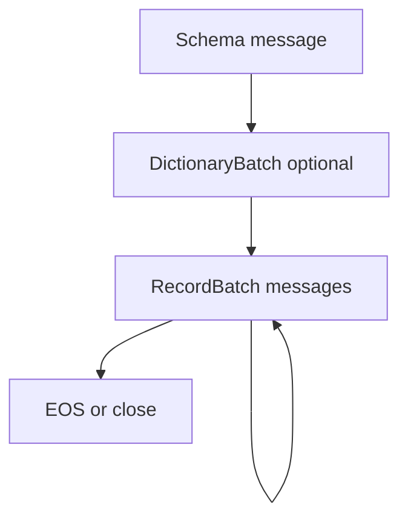

# 第8章 ストリーミング IPC

> **本章で読むソース**
>
> - [`docs/source/format/IPC.rst`](https://github.com/apache/arrow/blob/apache-arrow-25.0.0/docs/source/format/IPC.rst)
> - [`docs/source/format/Columnar.rst`](https://github.com/apache/arrow/blob/apache-arrow-25.0.0/docs/source/format/Columnar.rst)
> - [`python/pyarrow/ipc.pxi`](https://github.com/apache/arrow/blob/apache-arrow-25.0.0/python/pyarrow/ipc.pxi)
> - [`python/pyarrow/ipc.py`](https://github.com/apache/arrow/blob/apache-arrow-25.0.0/python/pyarrow/ipc.py)

## この章の狙い

第7章で単一 IPC メッセージの封入形式と `RecordBatch` メタデータを読んだ。
本章では、それらを時系列に並べた**ストリーミング IPC** のプロトコルを `Columnar.rst` から追い、`pyarrow` の `RecordBatchStreamReader` と `RecordBatchStreamWriter` がどう実装に接続するかを示す。
`IPC.rst` は列仕様書へ統合されたが、ストリームの意味論は `Columnar.rst` の IPC 節に記載されている。

## 前提

ストリーム形式は、第7章の封入メッセージを先頭から順に読むだけである。
最初のメッセージはスキーマであり、以降のレコードバッチは同じスキーマに従う。
ディクショナリエンコード列がある場合は `DictionaryBatch` が混在し、キー使用前に辞書が定義されている必要がある。

## ストリームのメッセージ順序

ストリーミングプロトコルは、スキーマ、辞書（任意）、レコードバッチの列である。
辞書とレコードバッチは交互に現れてもよいが、あるインデックスをレコードバッチで使う前に、その ID の辞書が定義されていなければならない。

[`docs/source/format/Columnar.rst` L1471-L1491](https://github.com/apache/arrow/blob/apache-arrow-25.0.0/docs/source/format/Columnar.rst#L1471-L1491)

```text
We provide a streaming protocol or "format" for record batches. It is
presented as a sequence of encapsulated messages, each of which
follows the format above. The schema comes first in the stream, and it
is the same for all of the record batches that follow. If any fields
in the schema are dictionary-encoded, one or more ``DictionaryBatch``
messages will be included. ``DictionaryBatch`` and ``RecordBatch``
messages may be interleaved, but before any dictionary key is used in
a ``RecordBatch`` it should be defined in a ``DictionaryBatch``. ::

    <SCHEMA>
    <DICTIONARY 0>
    ...
    <DICTIONARY k - 1>
    <RECORD BATCH 0>
    ...
    <DICTIONARY x REPLACEMENT>
    ...
    <DICTIONARY y DELTA>
    ...
    <RECORD BATCH n - 1>
    <EOS [optional]: 0xFFFFFFFF 0x00000000>
```

全 null のディクショナリ列では、辞書バッチが最初のレコードバッチより後に現れる境界例がある。
ストリームリーダは辞書状態を逐次更新しながらバッチを解釈する。

[`docs/source/format/Columnar.rst` L1493-L1496](https://github.com/apache/arrow/blob/apache-arrow-25.0.0/docs/source/format/Columnar.rst#L1493-L1496)

```text
.. note:: An edge-case for interleaved dictionary and record batches occurs
   when the record batches contain dictionary encoded arrays that are
   completely null. In this case, the dictionary for the encoded column might
   appear after the first record batch.
```

ストリームの読み書きフローを Mermaid で示すと次のようになる。



## 読み手の進め方と EOS

各メッセージの後、読み手は次の 8 バイトを覗いて継続とメタデータ長を判定できる。
メタデータ FlatBuffers を読んだあと、`bodyLength` 分の本体を読む。

[`docs/source/format/Columnar.rst` L1498-L1505](https://github.com/apache/arrow/blob/apache-arrow-25.0.0/docs/source/format/Columnar.rst#L1498-L1505)

```text
When a stream reader implementation is reading a stream, after each
message, it may read the next 8 bytes to determine both if the stream
continues and the size of the message metadata that follows. Once the
message flatbuffer is read, you can then read the message body.

The stream writer can signal end-of-stream (EOS) either by writing 8 bytes
containing the 4-byte continuation indicator (``0xFFFFFFFF``) followed by 0
metadata length (``0x00000000``) or closing the stream interface.
```

先読み 8 バイトにより、次メッセージのメタデータサイズが分かる。
本体をメモリマップした環境では、メタデータ長だけ先に読んでから本体領域をマップする二段読みが帯域効率に効く。

拡張子 `.arrows` と MIME 型 `vnd.apache.arrow.stream` が推奨される。

[`docs/source/format/Columnar.rst` L1510-L1512](https://github.com/apache/arrow/blob/apache-arrow-25.0.0/docs/source/format/Columnar.rst#L1510-L1512)

```text
IPC Streams are not typically stored as files, but when they are, we recommend
the ".arrows" file extension. The registered MIME type for IPC Streams is
`vnd.apache.arrow.stream`_.
```

## RecordBatchStreamWriter

`pyarrow` では `_RecordBatchStreamWriter` が C++ の `MakeStreamWriter` を呼び出す。
`write_batch` は単一レコードバッチを、`write_table` はチャンク分割しながら複数バッチを書く。

[`python/pyarrow/ipc.pxi` L642-L674](https://github.com/apache/arrow/blob/apache-arrow-25.0.0/python/pyarrow/ipc.pxi#L642-L674)

```python
cdef class _RecordBatchStreamWriter(_CRecordBatchWriter):
    // ... (中略) ...
    def _open(self, sink, Schema schema not None,
              IpcWriteOptions options=IpcWriteOptions()):
        cdef:
            shared_ptr[COutputStream] c_sink

        self.options = options.c_options
        get_writer(sink, &c_sink)
        with nogil:
            self.writer = GetResultValue(
                MakeStreamWriter(c_sink, schema.sp_schema,
                                 self.options))
```

[`python/pyarrow/ipc.pxi` L580-L617](https://github.com/apache/arrow/blob/apache-arrow-25.0.0/python/pyarrow/ipc.pxi#L580-L617)

```python
    def write_batch(self, RecordBatch batch, custom_metadata=None):
        """
        Write RecordBatch to stream.
        // ... (中略) ...
        """
        // ... (中略) ...
        with nogil:
            check_status(self.writer.get()
                         .WriteRecordBatch(deref(batch.batch), c_meta))

    def write_table(self, Table table, max_chunksize=None):
        """
        Write Table to stream in (contiguous) RecordBatch objects.
        // ... (中略) ...
        """
        // ... (中略) ...
        with nogil:
            check_status(self.writer.get().WriteTable(table.table[0],
                                                      c_max_chunksize))
```

`close` は EOS マーカを書き、ストリームを終端する。

[`python/pyarrow/ipc.pxi` L619-L624](https://github.com/apache/arrow/blob/apache-arrow-25.0.0/python/pyarrow/ipc.pxi#L619-L624)

```python
    def close(self):
        """
        Close stream and write end-of-stream 0 marker.
        """
        with nogil:
            check_status(self.writer.get().Close())
```

公開 API `ipc.new_stream` は `RecordBatchStreamWriter` のファクトリである。

[`python/pyarrow/ipc.py` L151-L154](https://github.com/apache/arrow/blob/apache-arrow-25.0.0/python/pyarrow/ipc.py#L151-L154)

```python
def new_stream(sink, schema, *, options=None):
    return RecordBatchStreamWriter(sink, schema,
                                   options=options)
```

## IpcWriteOptions

ストリーム書き込みの挙動は `IpcWriteOptions` で制御する。
`compression` に `lz4` または `zstd` を指定すると、第7章のバッファ単位圧縮が有効になる。
`emit_dictionary_deltas` は辞書の差分送信を許可し、デフォルトは互換性のため偽である。

[`python/pyarrow/ipc.pxi` L229-L261](https://github.com/apache/arrow/blob/apache-arrow-25.0.0/python/pyarrow/ipc.pxi#L229-L261)

```python
cdef class IpcWriteOptions(_Weakrefable):
    """
    Serialization options for the IPC format.
    // ... (中略) ...
    compression : str, Codec, or None
        compression codec to use for record batch buffers.
        If None then batch buffers will be uncompressed.
        Must be "lz4", "zstd" or None.
    // ... (中略) ...
    emit_dictionary_deltas : bool
        Whether to emit dictionary deltas.  Default is false for maximum
        stream compatibility.
    unify_dictionaries : bool
        If true then calls to write_table will attempt to unify dictionaries
        across all batches in the table.
        // ... (中略) ...
        This parameter is ignored when writing to the IPC stream format as
        the IPC stream format can support replacement dictionaries.
    """
```

`use_threads` が真なら圧縮などの計算をスレッドプールへ委譲できる。
大きなテーブルを `write_table` する際、CPU と I/O の重なりを増やせる。

## RecordBatchStreamReader

`_RecordBatchStreamReader` は `CRecordBatchStreamReader.Open` で入力ストリームを開く。
`RecordBatchReader` を継承し、イテレータとして `read_next_batch` を提供する。

[`python/pyarrow/ipc.pxi` L1077-L1094](https://github.com/apache/arrow/blob/apache-arrow-25.0.0/python/pyarrow/ipc.pxi#L1077-L1094)

```python
cdef class _RecordBatchStreamReader(RecordBatchReader):
    // ... (中略) ...
    def _open(self, source, IpcReadOptions options=IpcReadOptions(),
              MemoryPool memory_pool=None):
        self.options = options.c_options
        self.options.memory_pool = maybe_unbox_memory_pool(memory_pool)
        _get_input_stream(source, &self.in_stream)
        with nogil:
            self.reader = GetResultValue(CRecordBatchStreamReader.Open(
                self.in_stream, self.options))
            self.stream_reader = <CRecordBatchStreamReader*> self.reader.get()
```

`read_all` は C++ 側の `ToTable` を一度呼び、全バッチを `Table` にまとめる。

[`python/pyarrow/ipc.pxi` L838-L849](https://github.com/apache/arrow/blob/apache-arrow-25.0.0/python/pyarrow/ipc.pxi#L838-L849)

```python
    def read_all(self):
        """
        Read all record batches as a pyarrow.Table.
        // ... (中略) ...
        """
        cdef shared_ptr[CTable] table
        with nogil:
            check_status(self.reader.get().ToTable().Value(&table))
        return pyarrow_wrap_table(table)
```

バッチを一つずつ Python に返すより、`ToTable` で C++ 内で列を連結した方が、中間の Python オブジェクト生成を減らせる。

`ipc.open_stream` が読み手のエントリポイントである。

[`python/pyarrow/ipc.py` L168-L188](https://github.com/apache/arrow/blob/apache-arrow-25.0.0/python/pyarrow/ipc.py#L168-L188)

```python
def open_stream(source, *, options=None, memory_pool=None):
    """
    Create reader for Arrow streaming format.
    // ... (中略) ...
    """
    return RecordBatchStreamReader(source, options=options,
                                   memory_pool=memory_pool)
```

## _ReadPandasMixin と pandas 連携

`RecordBatchReader` とファイルリーダの双方に `read_pandas` がミックスインされる。
実装は `read_all` で `Table` を得てから `to_pandas` へ渡すだけである。

[`python/pyarrow/ipc.pxi` L686-L705](https://github.com/apache/arrow/blob/apache-arrow-25.0.0/python/pyarrow/ipc.pxi#L686-L705)

```python
class _ReadPandasMixin:

    def read_pandas(self, **options):
        """
        Read contents of stream to a pandas.DataFrame.
        // ... (中略) ...
        """
        table = self.read_all()
        return table.to_pandas(**options)
```

`ipc.serialize_pandas` と `deserialize_pandas` は、このストリーム API の薄いラッパである。
DataFrame を一バッチに変換し、ストリームへ書いてバイト列を返す。

[`python/pyarrow/ipc.py` L234-L280](https://github.com/apache/arrow/blob/apache-arrow-25.0.0/python/pyarrow/ipc.py#L234-L280)

```python
def serialize_pandas(df, *, nthreads=None, preserve_index=None):
    // ... (中略) ...
    batch = pa.RecordBatch.from_pandas(df, nthreads=nthreads,
                                       preserve_index=preserve_index)
    sink = pa.BufferOutputStream()
    with pa.RecordBatchStreamWriter(sink, batch.schema) as writer:
        writer.write_batch(batch)
    return sink.getvalue()


def deserialize_pandas(buf, *, use_threads=True):
    // ... (中略) ...
    buffer_reader = pa.BufferReader(buf)
    with pa.RecordBatchStreamReader(buffer_reader) as reader:
        table = reader.read_all()
    return table.to_pandas(use_threads=use_threads)
```

プロセス間で pandas オブジェクトを運ぶ最短経路として使われるが、中身は Arrow IPC ストリームである。

## MessageReader による低レベル走査

メッセージ単位でストリームを走査したい場合は `MessageReader.open_stream` を使う。
`read_next_message` は封入メッセージを `Message` オブジェクトとして返す。

[`python/pyarrow/ipc.pxi` L504-L551](https://github.com/apache/arrow/blob/apache-arrow-25.0.0/python/pyarrow/ipc.pxi#L504-L551)

```python
    @staticmethod
    def open_stream(source):
        """
        Open stream from source, if you want to use memory map use
        MemoryMappedFile as source.
        // ... (中略) ...
        """
        // ... (中略) ...
    def read_next_message(self):
        """
        Read next Message from the stream.
        // ... (中略) ...
        """
        cdef Message result = Message.__new__(Message)
        // ... (中略) ...
        if result.message.get() == NULL:
            raise StopIteration

        return result
```

レコードバッチへ復元する前にメタデータだけ検査するツールや、スキーマのみ抽出するユーティリティがこの層を使う。

## エンディアンとストリーム

IPC フォーマットはデフォルトでリトルエンディアンである。
スキーマの `endianness` フィールドはレコードバッチとディクショナリバッチの本体にのみ適用され、メタデータのエンディアンには影響しない。

[`docs/source/format/Columnar.rst` L1456-L1466](https://github.com/apache/arrow/blob/apache-arrow-25.0.0/docs/source/format/Columnar.rst#L1456-L1466)

```text
The Arrow IPC format is little-endian by default.

Serialized Schema metadata has an endianness field indicating the endianness of
Arrow data in all the RecordBatch and DictionaryBatch message bodies.
// ... (中略) ...
Note that the endianness field only applies to RecordBatch and DictionaryBatch
message bodies, not to message metadata or any other signaling in the IPC formats.
```

## まとめ

ストリーミング IPC は封入メッセージの時系列であり、先頭がスキーマ、続いて辞書とレコードバッチが並ぶ。
読み手は 8 バイト先読みで次メッセージのメタデータ長を知り、本体は第7章の `Buffer` オフセットでゼロコピー復元できる。
`RecordBatchStreamWriter` は `write_batch` と `write_table` で C++ ライタへ委譲し、`close` で EOS を書く。
`RecordBatchStreamReader.read_all` は `ToTable` で C++ 内連結し、Python 往復を抑える。
`serialize_pandas` は同じストリーム形式の実用ラッパである。
第9章では、同一メッセージ列にフッタを足したファイル形式とランダムアクセスを読む。

## 関連する章

- 第6章 [ディクショナリエンコーディング](../part01-types/06-dictionary-encoding.md)：ストリーム上の辞書順序
- 第7章 [メッセージ形式とレコードバッチ](07-message-format.md)：封入形式と `RecordBatch`
- 第9章 [ファイル形式](09-file-format.md)：ストリームへのフッタ追加
- 第10章 Buffer とメモリ管理：メモリマップ入力
