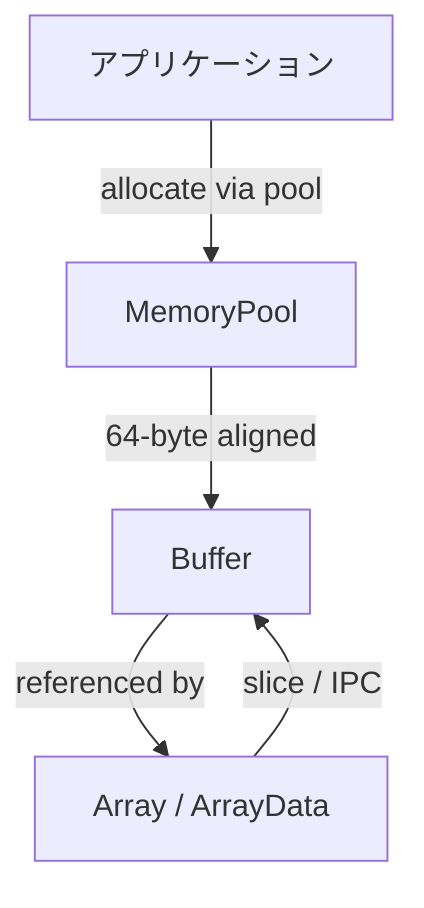
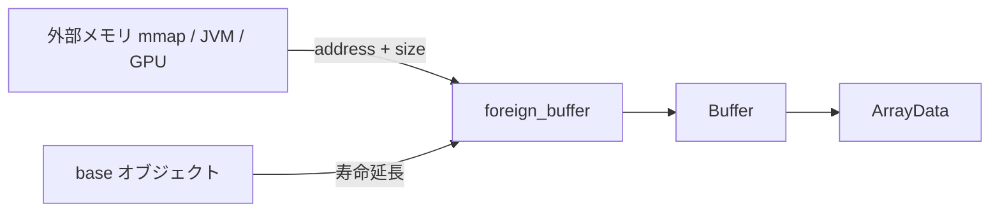

# 第10章 Buffer とメモリ管理

> **本章で読むソース**
>
> - [`python/pyarrow/memory.pxi`](https://github.com/apache/arrow/blob/apache-arrow-25.0.0/python/pyarrow/memory.pxi)
> - [`python/pyarrow/io.pxi`](https://github.com/apache/arrow/blob/apache-arrow-25.0.0/python/pyarrow/io.pxi)
> - [`docs/source/format/Columnar.rst`](https://github.com/apache/arrow/blob/apache-arrow-25.0.0/docs/source/format/Columnar.rst)

## この章の狙い

第2部で IPC メッセージとレコードバッチの直列化を読んだ。
配列の各列は validity ビットマップや値バッファといった**バッファ**の束であり、IPC ではそれらをメタデータのオフセットで既存メモリへマップする。
本章では、その土台となる **Buffer** と **MemoryPool** を `pyarrow` の実装から追う。
アライメント要件、ゼロコピーのスライス、`foreign_buffer` による外部メモリの取り込みまで押さえ、第11章の C Data Interface と第12章の Flight が共有するメモリ契約を明確にする。

## 前提

Arrow のカラムは第2章で読んだとおり、連続メモリ上のバッファ列として表現される。
`Array` は型メタデータと `ArrayData`（バッファへの参照列）を束ねたオブジェクトであり、実データの所有権は多くの場合 `Buffer` に委ねられる。
`Buffer` はアドレスとサイズを持つ連続領域のラッパーであり、必ずしも自前でメモリを確保するとは限らない。

## Columnar 仕様のアライメント

仕様は実装に、8 バイトまたは 64 バイト境界へのアライメントとパディングを推奨する。
IPC でプロセス間通信するときはこの要件が強制され、可能なら 64 バイトを選ぶことが示されている。

[`docs/source/format/Columnar.rst` L264-L295](https://github.com/apache/arrow/blob/apache-arrow-25.0.0/docs/source/format/Columnar.rst#L264-L295)

```text
Buffer Alignment and Padding
----------------------------

Implementations are recommended to allocate memory on aligned
addresses (multiple of 8- or 64-bytes) and pad (overallocate) to a
length that is a multiple of 8 or 64 bytes. When serializing Arrow
data for interprocess communication, these alignment and padding
requirements are enforced. If possible, we suggest that you prefer
using 64-byte alignment and padding. Unless otherwise noted, padded
bytes do not need to have a specific value.

The alignment requirement follows best practices for optimized memory
access:

* Elements in numeric arrays will be guaranteed to be retrieved via aligned access.
* On some architectures alignment can help limit partially used cache lines.

The recommendation for 64 byte alignment comes from the `Intel
performance guide`_ that recommends alignment of memory to match SIMD
register width.  The specific padding length was chosen because it
matches the largest SIMD instruction registers available on widely
deployed x86 architecture (Intel AVX-512).
// ... (中略) ...
In other words, we can load the entire 64-byte
buffer into a 512-bit wide SIMD register and get data-level
parallelism on all the columnar values packed into the 64-byte
buffer. Guaranteed padding can also allow certain compilers to
generate more optimized code directly (e.g. One can safely use Intel's
``-qopt-assume-safe-padding``).
```

64 バイト境界に揃えたバッファは、AVX-512 幅の SIMD レジスタへ一括ロードできる。
ループ内の境界チェックを減らし、カーネルが列データを並列に処理しやすくなるのが狙いである。
`pyarrow` の **MemoryPool** はこの 64 バイトアライメントを割り当て時に保証する役割を担う。

## MemoryPool：割り当てとアライメント

`MemoryPool` はメモリ割り当ての基底クラスである。
ドキュメントは、割り当てバイト数の追跡に加え、Arrow データに必要な 64 バイトアライメントを担うと明示している。

[`python/pyarrow/memory.pxi` L23-L29](https://github.com/apache/arrow/blob/apache-arrow-25.0.0/python/pyarrow/memory.pxi#L23-L29)

```python
cdef class MemoryPool(_Weakrefable):
    """
    Base class for memory allocation.

    Besides tracking its number of allocated bytes, a memory pool also
    takes care of the required 64-byte alignment for Arrow data.
    """
```

コンストラクタは直接呼べず、`default_memory_pool()` などのファクトリ経由で得る。

[`python/pyarrow/memory.pxi` L146-L158](https://github.com/apache/arrow/blob/apache-arrow-25.0.0/python/pyarrow/memory.pxi#L146-L158)

```python
def default_memory_pool():
    """
    Return the process-global memory pool.
    // ... (中略) ...
    """
    cdef:
        MemoryPool pool = MemoryPool.__new__(MemoryPool)
    pool.init(c_get_memory_pool())
    return pool
```

バックエンドには `system`（C の `malloc`）、`jemalloc`、`mimalloc` などがあり、`backend_name` で識別できる。
`proxy_memory_pool` は親プールへ転送しつつ統計だけ分離し、`logging_memory_pool` はデバッグ用に割り当てログを stderr へ出す。
`set_memory_pool` でプロセス全体のデフォルトを差し替えられる。

メモリ管理の流れを Mermaid で示すと次のようになる。



## Buffer：連続メモリのラッパー

`Buffer` は連続メモリ領域の基底クラスである。
多くのバッファは自前のメモリを所有するが、すべてがそうとは限らないと docstring が述べている。

[`python/pyarrow/io.pxi` L1377-L1383](https://github.com/apache/arrow/blob/apache-arrow-25.0.0/python/pyarrow/io.pxi#L1377-L1383)

```python
cdef class Buffer(_Weakrefable):
    """
    The base class for all Arrow buffers.

    A buffer represents a contiguous memory area.  Many buffers will own
    their memory, though not all of them do.
    """
```

`size` と `address` は C++ 側の `arrow::Buffer` を透過的に公開する。
`is_mutable` は書き換え可否、`parent` はスライス元のバッファを返す。
デバイスメモリ向けには `is_cpu` と `device` があり、GPU バッファとの区別にも使われる。

## ゼロコピーのスライス

`Buffer.slice` はメモリをコピーせず、既存バッファ上の論理ビューを作る。
実装は C++ の `SliceBufferSafe` を呼び、新しい `shared_ptr<Buffer>` を Python へ返す。

[`python/pyarrow/io.pxi` L1508-L1537](https://github.com/apache/arrow/blob/apache-arrow-25.0.0/python/pyarrow/io.pxi#L1508-L1537)

```python
    def slice(self, offset=0, length=None):
        """
        Slice this buffer.  Memory is not copied.

        You can also use the Python slice notation ``buffer[start:stop]``.
        // ... (中略) ...
        """
        cdef shared_ptr[CBuffer] result

        if offset < 0:
            raise IndexError('Offset must be non-negative')

        if length is None:
            result = GetResultValue(SliceBufferSafe(self.buffer, offset))
        else:
            result = GetResultValue(SliceBufferSafe(self.buffer, offset,
                                                    length))
        return pyarrow_wrap_buffer(result)
```

`__getitem__` も `step` が 1 のスライスのみ受け付け、同じ経路へ入る。
子 `Buffer` は親の `shared_ptr` を保持するため、親が生きている限りオフセット先のメモリは有効である。
IPC でメッセージ本体を mmap したあと、メタデータのオフセットで `slice` するのと同じ仕組みが、Python バインディングでもそのまま使える。

## Python オブジェクトからのバッファ構築

`py_buffer` は `bytes` や buffer プロトコルを持つ Python オブジェクトから `Buffer` を構築する。
`PyBuffer.FromPyObject` が C++ 側で Python のバッファビューを取り込む。

[`python/pyarrow/io.pxi` L2122-L2133](https://github.com/apache/arrow/blob/apache-arrow-25.0.0/python/pyarrow/io.pxi#L2122-L2133)

```python
def py_buffer(object obj):
    """
    Construct an Arrow buffer from a Python bytes-like or buffer-like object
    // ... (中略) ...
    """
    cdef shared_ptr[CBuffer] buf
    buf = GetResultValue(PyBuffer.FromPyObject(obj))
    return pyarrow_wrap_buffer(buf)
```

ここでもデータのコピーを避ける経路が選ばれることが多い。
Python が所有する `bytes` の寿命は、生成された `Buffer` が参照を保持する間は延長される。

## foreign_buffer：外部メモリの取り込み

`foreign_buffer` は既知のアドレスとサイズから `Buffer` を構築する。
`base` に Python オブジェクトを渡すと、そのオブジェクトがバッファ存続中ずっと生き続ける。
C++ コードがバッファを保持している間も、言語境界を越えて参照が有効になる。

[`python/pyarrow/io.pxi` L2136-L2164](https://github.com/apache/arrow/blob/apache-arrow-25.0.0/python/pyarrow/io.pxi#L2136-L2164)

```python
def foreign_buffer(address, size, base=None):
    """
    Construct an Arrow buffer with the given *address* and *size*.

    The buffer will be optionally backed by the Python *base* object, if given.
    The *base* object will be kept alive as long as this buffer is alive,
    including across language boundaries (for example if the buffer is
    referenced by C++ code).
    // ... (中略) ...
    """
    cdef:
        uintptr_t c_addr = address
        int64_t c_size = size
        shared_ptr[CBuffer] buf

    check_status(PyForeignBuffer.Make(<uint8_t*> c_addr, c_size,
                                      base, &buf))
    return pyarrow_wrap_buffer(buf)
```

第9章で触れたメモリマップファイルは、マップされた領域のアドレスを `foreign_buffer` に渡す典型的な用途である。
JVM や CUDA など他ランタイムが確保したメモリを Arrow の配列バッファとして解釈するときも同じパターンになる。
`base` を省略すると、呼び出し側がメモリ寿命を別途保証する必要がある。

外部メモリ取り込みの関係を Mermaid で示すと次のようになる。



## Buffer と IPC の接続

第7章の `RecordBatch` メッセージは、各物理バッファをメッセージ本体中のオフセットで指す。
読み手は本体を一度確保または mmap し、オフセット列に従って `Buffer.slice` 相当のビューを配列へ組み立てる。
メタデータだけを先に読めば本体バイト列をコピーせずに配列を再構成できるのは、各列が独立した `Buffer` 参照として表現されているからである。

ファイル形式では第9章のとおり、フッタの `Block` オフセットでレコードバッチ本体へ直接シークできる。
いずれの経路も、割り当て済みメモリ上に論理ビューを重ねる設計が共通している。

## まとめ

Arrow のカラムデータは **Buffer** の参照列として表現され、**MemoryPool** が 64 バイトアライメント付きの割り当てを担う。
`Buffer.slice` と IPC のオフセット解決はいずれもコピーを避ける論理ビューであり、SIMD 前提のアライメントと組み合わさってカーネルが高速に列を走査できる。
`py_buffer` は Python オブジェクトを取り込み、`foreign_buffer` は外部アドレスを Arrow のバッファ体系へ接続する。
この Buffer 層の契約が、次章の C Data Interface と Flight のゼロコピー経路の土台になる。

## 関連する章

- 第2章 [カラムレイアウト](../part00-overview/02-columnar-layout.md)：validity ビットマップとバッファ列
- 第7章 [メッセージ形式とレコードバッチ](../part02-ipc/07-message-format.md)：`Buffer` メタデータとメッセージ本体
- 第9章 [ファイル形式](../part02-ipc/09-file-format.md)：メモリマップと `Block` オフセット
- 第11章 [C Data Interface](11-c-data-interface.md)：`ArrowArray.buffers` と `Buffer` の対応
- 第12章 [Flight RPC](12-flight-rpc.md)：`FlightData.data_body` のバッファ扱い
