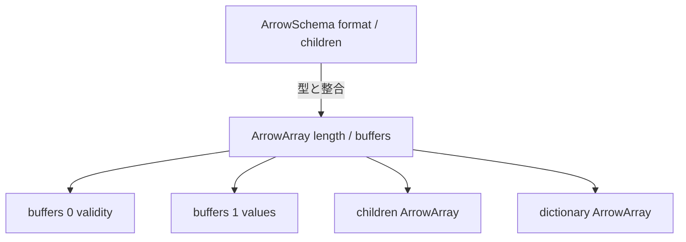
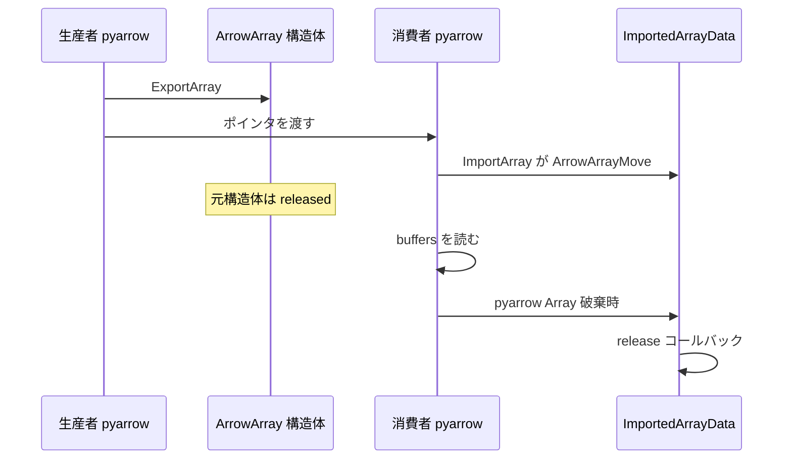

# 第11章 C Data Interface

> **本章で読むソース**
>
> - [`docs/source/format/CDataInterface.rst`](https://github.com/apache/arrow/blob/apache-arrow-25.0.0/docs/source/format/CDataInterface.rst)
> - [`python/pyarrow/cffi.py`](https://github.com/apache/arrow/blob/apache-arrow-25.0.0/python/pyarrow/cffi.py)
> - [`python/pyarrow/array.pxi`](https://github.com/apache/arrow/blob/apache-arrow-25.0.0/python/pyarrow/array.pxi)

## この章の狙い

第10章で **Buffer** とメモリプールの契約を読んだ。
同一プロセス内で言語やライブラリをまたいで配列を渡すには、FlatBuffers による IPC より軽い経路が必要になる。
本章では **C Data Interface** の `ArrowSchema` と `ArrowArray` を仕様書と `pyarrow` のエクスポート／インポート実装から追う。
`release` コールバックによる寿命管理、`_export_to_c` と `_import_from_c`、PyCapsule ベースの `__arrow_c_array__` まで押さえ、第12章の Flight が載せる IPC との使い分けを明確にする。

## 前提

IPC はプロセスやマシンをまたいでレコードバッチを運ぶストリーム形式である。
C Data Interface は C 構造体のポインタを介して、すでに論理的な Arrow レイアウトで露出しているメモリをそのまま共有する。
FlatBuffers への依存がなく、バッファの再組み立ても不要である。

仕様は IPC との比較で利点を列挙している。

[`docs/source/format/CDataInterface.rst` L74-L92](https://github.com/apache/arrow/blob/apache-arrow-25.0.0/docs/source/format/CDataInterface.rst#L74-L92)

```text
Comparison with the Arrow IPC format
------------------------------------

Pros of the C data interface vs. the IPC format:

* No dependency on Flatbuffers.
* No buffer reassembly (data is already exposed in logical Arrow format).
* Zero-copy by design.
* Easy to reimplement from scratch.
* Minimal C definition that can be easily copied into other codebases.
* Resource lifetime management through a custom release callback.

Pros of the IPC format vs. the data interface:

* Works across processes and machines.
* Allows data storage and persistence.
* Being a streamable format, the IPC format has room for composing more features
  (such as integrity checks, compression...).
* Does not require explicit C data access.
```

同一マシン上の Python と Rust、または `pyarrow` と NumPy エコシステムの橋渡しには C Data Interface が向く。
リモート転送や永続化には IPC か Flight が向く。

## ArrowSchema と ArrowArray の C 定義

仕様が示す構造体定義は、ヘッダにコピーして使うことを想定した最小限の C コードである。

[`docs/source/format/CDataInterface.rst` L278-L318](https://github.com/apache/arrow/blob/apache-arrow-25.0.0/docs/source/format/CDataInterface.rst#L278-L318)

```text
   struct ArrowSchema {
     // Array type description
     const char* format;
     const char* name;
     const char* metadata;
     int64_t flags;
     int64_t n_children;
     struct ArrowSchema** children;
     struct ArrowSchema* dictionary;

     // Release callback
     void (*release)(struct ArrowSchema*);
     // Opaque producer-specific data
     void* private_data;
   };

   struct ArrowArray {
     // Array data description
     int64_t length;
     int64_t null_count;
     int64_t offset;
     int64_t n_buffers;
     int64_t n_children;
     const void** buffers;
     struct ArrowArray** children;
     struct ArrowArray* dictionary;

     // Release callback
     void (*release)(struct ArrowArray*);
     // Opaque producer-specific data
     void* private_data;
   };
```

`ArrowSchema` は型とメタデータを、`ArrowArray` は長さ、null 数、物理バッファ列を運ぶ。
ネスト型は `children` ポインタ列で再帰的に表現し、ディクショナリ型は `dictionary` が別構造体を指す。
型は `format` 文字列で符号化され、第3章の型システムと対応する。

`ArrowArray.buffers` は第2章の物理バッファ列に対応する。
各ポインタは連続バッファの先頭を指し、`n_buffers` 個が並ぶ。

[`docs/source/format/CDataInterface.rst` L466-L497](https://github.com/apache/arrow/blob/apache-arrow-25.0.0/docs/source/format/CDataInterface.rst#L466-L497)

```text
.. c:member:: int64_t ArrowArray.n_buffers

   Mandatory.  The number of physical buffers backing this array.  The
   number of buffers is a function of the data type, as described in the
   :ref:`Columnar format specification <format_columnar>`, except for the
   the binary or utf-8 view type, which has one additional buffer compared
   to the Columnar format specification (see
   :ref:`c-data-interface-binary-view-arrays`).

   Buffers of children arrays are not included.

.. c:member:: const void** ArrowArray.buffers

   Mandatory.  A C array of pointers to the start of each physical buffer
   backing this array.  Each `void*` pointer is the physical start of
   a contiguous buffer.  There must be :c:member:`ArrowArray.n_buffers` pointers.
   // ... (中略) ...
   Buffers of children arrays are not included.
```

構造体間の関係を Mermaid で示すと次のようになる。



## release コールバックと寿命管理

C Data Interface の核心は、カスタム **release** コールバックによるリソース寿命管理である。
消費者が構造体をスタックまたはヒープに確保し、生産者が指す文字列やバッファ配列を割り当てる。
消費者が寿命に介入できるのは、ベース構造体の `release` を呼ぶことだけである。

[`docs/source/format/CDataInterface.rst` L574-L617](https://github.com/apache/arrow/blob/apache-arrow-25.0.0/docs/source/format/CDataInterface.rst#L574-L617)

```text
Memory management
-----------------

The ``ArrowSchema`` and ``ArrowArray`` structures follow the same conventions
for memory management.  The term *"base structure"* below refers to the
``ArrowSchema`` or ``ArrowArray`` that is passed between producer and consumer
-- not any child structure thereof.
// ... (中略) ...
Therefore, the consumer MUST not try to interfere with the producer's
handling of these members' lifetime.  The only way the consumer influences
data lifetime is by calling the base structure's ``release`` callback.
// ... (中略) ...
Consumers MUST call a base structure's release callback when they won't be using
it anymore, but they MUST not call any of its children's release callbacks
(including the optional dictionary).  The producer is responsible for releasing
the children.

In any case, a consumer MUST not try to access the base structure anymore
after calling its release callback -- including any associated data such
as its children.
```

生産者側の `release` は子構造体の `release` を再帰的に呼び、自構造体が直接所有する領域を解放し、最後に自身の `release` ポインタを NULL にする。
解放済みは `release == NULL` で示す。
C++ の `shared_ptr` などの簿記は `private_data` に置く。

この設計により、消費者は子の解放順序を知らなくてよい。
一方、エクスポート後に `release` を呼ばないとメモリが漏れる。

## cffi.py：構造体定義の複製

`pyarrow/cffi.py` は C Data Interface の定義を `cffi` 向けにそのまま埋め込んでいる。
テストやサードパーティ連携で、ヘッダをコピーせず Python から同じレイアウトを参照できる。

[`python/pyarrow/cffi.py` L22-L54](https://github.com/apache/arrow/blob/apache-arrow-25.0.0/python/pyarrow/cffi.py#L22-L54)

```python
c_source = """
    struct ArrowSchema {
      // Array type description
      const char* format;
      const char* name;
      const char* metadata;
      int64_t flags;
      int64_t n_children;
      struct ArrowSchema** children;
      struct ArrowSchema* dictionary;

      // Release callback
      void (*release)(struct ArrowSchema*);
      // Opaque producer-specific data
      void* private_data;
    };

    struct ArrowArray {
      // Array data description
      int64_t length;
      int64_t null_count;
      int64_t offset;
      int64_t n_buffers;
      int64_t n_children;
      const void** buffers;
      struct ArrowArray** children;
      struct ArrowArray* dictionary;

      // Release callback
      void (*release)(struct ArrowArray*);
      // Opaque producer-specific data
      void* private_data;
    };
```

同ファイルは `ArrowArrayStream` や `ArrowDeviceArray` も定義し、ストリームやデバイスメモリの拡張インターフェースへつなぐ。

## `_export_to_c` と `_import_from_c`

`Array` は C ポインタへ直接エクスポートする低レベル API を持つ。
`ExportArray` が C++ コアで `ArrowArray`（と任意で `ArrowSchema`）を埋める。

[`python/pyarrow/array.pxi` L1958-L2017](https://github.com/apache/arrow/blob/apache-arrow-25.0.0/python/pyarrow/array.pxi#L1958-L2017)

```python
    def _export_to_c(self, out_ptr, out_schema_ptr=0):
        """
        Export to a C ArrowArray struct, given its pointer.
        // ... (中略) ...
        Be careful: if you don't pass the ArrowArray struct to a consumer,
        array memory will leak.  This is a low-level function intended for
        expert users.
        """
        cdef:
            void* c_ptr = _as_c_pointer(out_ptr)
            void* c_schema_ptr = _as_c_pointer(out_schema_ptr,
                                               allow_null=True)
        with nogil:
            check_status(ExportArray(deref(self.sp_array),
                                     <ArrowArray*> c_ptr,
                                     <ArrowSchema*> c_schema_ptr))

    @staticmethod
    def _import_from_c(in_ptr, type):
        """
        Import Array from a C ArrowArray struct, given its pointer
        and the imported array type.
        // ... (中略) ...
        """
        cdef:
            void* c_ptr = _as_c_pointer(in_ptr)
            void* c_type_ptr
            shared_ptr[CArray] c_array

        c_type = pyarrow_unwrap_data_type(type)
        if c_type == nullptr:
            # Not a DataType object, perhaps a raw ArrowSchema pointer
            c_type_ptr = _as_c_pointer(type)
            with nogil:
                c_array = GetResultValue(ImportArray(
                    <ArrowArray*> c_ptr, <ArrowSchema*> c_type_ptr))
        else:
            with nogil:
                c_array = GetResultValue(ImportArray(<ArrowArray*> c_ptr,
                                                     c_type))
        return pyarrow_wrap_array(c_array)
```

インポート側は `DataType` オブジェクトか `ArrowSchema` ポインタのどちらかで型を渡せる。
エクスポートした構造体を消費者へ渡さないまま放置すると漏れる旨が docstring で警告されている。
`pyarrow` の `ImportArray` は C++ 側 `ArrayImporter::Import` を呼び、`ArrowArrayMove` で渡された `ArrowArray` を `ImportedArrayData` へ移す。
この経路では元の C 構造体はインポート直後に released 状態になり、消費者が明示的に `release` を呼ぶ流れにはならない。
`release` コールバックは、インポート済みデータを保持する `ImportedArrayData` が破棄されるときに C++ 層が呼ぶ。

エクスポートからインポートまでの流れを Mermaid で示すと次のようになる。



## PyCapsule と `__arrow_c_array__`

高レベル連携では Arrow PyCapsule Interface の `__arrow_c_array__` が使われる。
呼び出し側が `requested_schema` を渡せば、必要ならキャストしてからエクスポートする。

[`python/pyarrow/array.pxi` L2019-L2081](https://github.com/apache/arrow/blob/apache-arrow-25.0.0/python/pyarrow/array.pxi#L2019-L2081)

```python
    def __arrow_c_array__(self, requested_schema=None):
        """
        Get a pair of PyCapsules containing a C ArrowArray representation of the object.
        // ... (中略) ...
        """
        self._assert_cpu()

        cdef:
            ArrowArray* c_array
            ArrowSchema* c_schema
            shared_ptr[CArray] inner_array

        if requested_schema is not None:
            target_type = DataType._import_from_c_capsule(requested_schema)
            // ... (中略) ...
        else:
            inner_array = self.sp_array

        schema_capsule = alloc_c_schema(&c_schema)
        array_capsule = alloc_c_array(&c_array)

        with nogil:
            check_status(ExportArray(deref(inner_array), c_array, c_schema))

        return schema_capsule, array_capsule

    @staticmethod
    def _import_from_c_capsule(schema_capsule, array_capsule):
        cdef:
            ArrowSchema* c_schema
            ArrowArray* c_array
            shared_ptr[CArray] array

        c_schema = <ArrowSchema*> PyCapsule_GetPointer(schema_capsule, 'arrow_schema')
        c_array = <ArrowArray*> PyCapsule_GetPointer(array_capsule, 'arrow_array')

        with nogil:
            array = GetResultValue(ImportArray(c_array, c_schema))

        return pyarrow_wrap_array(array)
```

PyCapsule は `'arrow_schema'` と `'arrow_array'` という名前でポインタを包む。
`_import_from_c_capsule` はカプセルからポインタを取り出し `ImportArray` へ渡す。
`ImportArray` は `ArrowArrayMove` で C 構造体を `ImportedArrayData` へ移し、元のカプセル内構造体は released 状態になる。
インポート済みバッファの寿命は `pyarrow` の `Array` が保持し、破棄時に `ImportedArrayData` のデストラクタが `release` コールバックを呼ぶ。

ゼロコピーの要点は、エクスポート時にバッファ内容を複製せずポインタ列だけを書き込む点にある。
`ImportArray` 経由の取り込みでも、バッファの物理メモリはコピーせず `Buffer` として再利用する。

## IPC との使い分け

同一プロセス内で `pandas` や `polars`、自前の C 拡張へ配列を渡すなら C Data Interface か PyCapsule が最短である。
ファイルへ書き出す、ネットワークで運ぶ、圧縮や整合性チェックを載せるなら IPC か Flight を選ぶ。
C Data Interface は「すでに Arrow レイアウトのメモリがある」前提であり、ワイヤ形式の再パースコストを最初から排除する。

## まとめ

C Data Interface は `ArrowSchema` と `ArrowArray` の最小 C 定義で、型と物理バッファ列をポインタ越しに共有する。
一般の消費者は `release` コールバックで寿命を終えるが、`pyarrow` の `ImportArray` は `ArrowArrayMove` で取り込み、破棄時に C++ 層が `release` を呼ぶ。
`pyarrow` は `ExportArray` と `ImportArray` で低レベル API を提供し、`__arrow_c_array__` で PyCapsule 経由の高レベル連携も可能にする。
バッファのコピーを避ける設計が、第10章の `Buffer` 参照モデルと直結している。

## 関連する章

- 第3章 [型システム](../part01-types/03-type-system.md)：`format` 文字列と `DataType`
- 第7章 [メッセージ形式とレコードバッチ](../part02-ipc/07-message-format.md)：IPC との対比
- 第10章 [Buffer とメモリ管理](10-buffer-and-memory.md)：`buffers` と `Buffer`
- 第12章 [Flight RPC](12-flight-rpc.md)：リモート転送での IPC 利用
