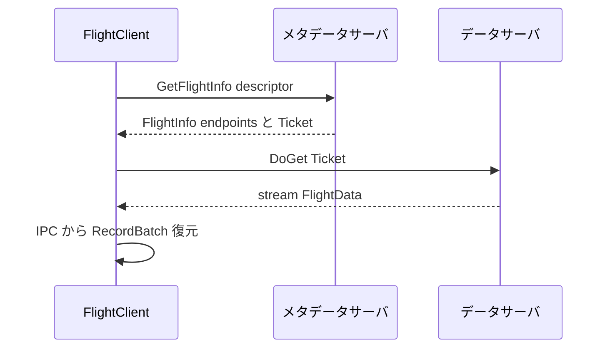
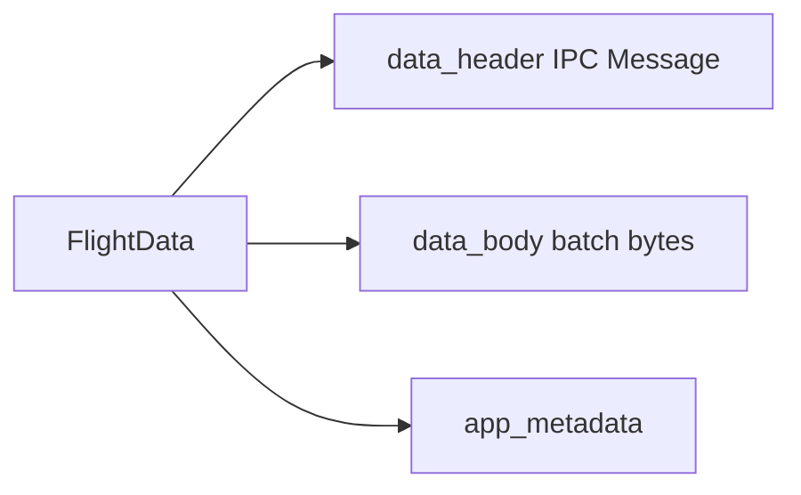
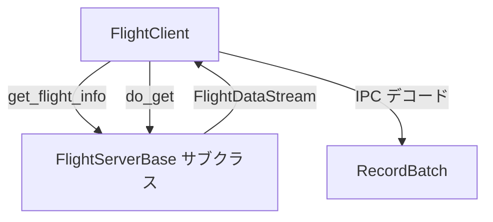

# 第12章 Flight RPC

> **本章で読むソース**
>
> - [`docs/source/format/Flight.rst`](https://github.com/apache/arrow/blob/apache-arrow-25.0.0/docs/source/format/Flight.rst)
> - [`format/Flight.proto`](https://github.com/apache/arrow/blob/apache-arrow-25.0.0/format/Flight.proto)
> - [`python/pyarrow/_flight.pyx`](https://github.com/apache/arrow/blob/apache-arrow-25.0.0/python/pyarrow/_flight.pyx)

## この章の狙い

第10章と第11章で同一プロセス内のバッファ共有と C Data Interface を読んだ。
リモートのサービスへレコードバッチを運ぶには、ネットワーク越しの RPC が必要になる。
本章では **Flight** を仕様書、`Flight.proto`、`_flight.pyx` のクライアントとサーバ実装から追う。
`FlightService` の RPC 群、`Ticket` と `FlightData` のメッセージ設計、`FlightClient` と `FlightServerBase` の対応関係を押さえ、IPC を載せた高スループット転送の仕組みを明らかにする。

## 前提

Flight は gRPC と IPC フォーマットの上に構築された RPC フレームワークである。
レコードバッチのストリームをアップロードまたはダウンロードし、メタデータ API でストリームの発見と内省を行う。
メソッドとワイヤ形式は Protobuf で定義されるが、実装は余分なメモリコピーを避ける最適化を含む。

[`docs/source/format/Flight.rst` L20-L37](https://github.com/apache/arrow/blob/apache-arrow-25.0.0/docs/source/format/Flight.rst#L20-L37)

```text
Arrow Flight is an RPC framework for high-performance data services
based on Arrow data, and is built on top of gRPC_ and the :doc:`IPC
format <IPC>`.

Flight is organized around streams of Arrow record batches, being
either downloaded from or uploaded to another service. A set of
metadata methods offers discovery and introspection of streams, as
well as the ability to implement application-specific methods.

Methods and message wire formats are defined by Protobuf_, enabling
interoperability with clients that may support gRPC and Arrow
separately, but not Flight. However, Flight implementations include
further optimizations to avoid overhead in usage of Protobuf (mostly
around avoiding excessive memory copies).
```

データ本体は第7章の IPC メッセージ形式のまま運ばれ、Flight はそれを gRPC ストリームに載せ替える層と捉えられる。

## FlightService の RPC 一覧

`Flight.proto` の `FlightService` はハンドシェイク、一覧、メタデータ取得、データ転送、アクションを定義する。

[`format/Flight.proto` L34-L145](https://github.com/apache/arrow/blob/apache-arrow-25.0.0/format/Flight.proto#L34-L145)

```protobuf
service FlightService {

  /*
   * Handshake between client and server. Depending on the server, the
   * handshake may be required to determine the token that should be used for
   * future operations. Both request and response are streams to allow multiple
   * round-trips depending on auth mechanism.
   */
  rpc Handshake(stream HandshakeRequest) returns (stream HandshakeResponse) {}
  // ... (中略) ...
  rpc ListFlights(Criteria) returns (stream FlightInfo) {}
  // ... (中略) ...
  rpc GetFlightInfo(FlightDescriptor) returns (FlightInfo) {}
  // ... (中略) ...
  rpc DoGet(Ticket) returns (stream FlightData) {}
  // ... (中略) ...
  rpc DoPut(stream FlightData) returns (stream PutResult) {}
  // ... (中略) ...
  rpc DoExchange(stream FlightData) returns (stream FlightData) {}
  // ... (中略) ...
  rpc DoAction(Action) returns (stream Result) {}
  // ... (中略) ...
  rpc ListActions(Empty) returns (stream ActionType) {}
}
```

ストリームは `FlightDescriptor` で識別される。
記述子はパス文字列か任意のバイナリコマンドであり、SQL 文やファイルパス、シリアライズした Python オブジェクトなどアプリケーションが自由に載せられる。

[`docs/source/format/Flight.rst` L45-L55](https://github.com/apache/arrow/blob/apache-arrow-25.0.0/docs/source/format/Flight.rst#L45-L55)

```text
Flight defines a set of RPC methods for uploading/downloading data,
retrieving metadata about a data stream, listing available data
streams, and for implementing application-specific RPC methods. A
Flight service implements some subset of these methods, while a Flight
client can call any of these methods.

Data streams are identified by descriptors (the ``FlightDescriptor``
message), which are either a path or an arbitrary binary command. For
instance, the descriptor may encode a SQL query, a path to a file on a
distributed file system, or even a pickled Python object; the
application can use this message as it sees fit.
```

## ダウンロードの流れ

クライアントはまず `GetFlightInfo` でエンドポイントと `Ticket` を得て、続けて `DoGet` でレコードバッチのストリームを受け取る。
メタデータとデータは別サーバに置けるため、`FlightInfo` は取得先の `Location` 列を返す。

[`docs/source/format/Flight.rst` L74-L115](https://github.com/apache/arrow/blob/apache-arrow-25.0.0/docs/source/format/Flight.rst#L74-L115)

```text
#. Construct or acquire a ``FlightDescriptor`` for the data set they
   are interested in.
   // ... (中略) ...
#. Call ``GetFlightInfo(FlightDescriptor)`` to get a ``FlightInfo``
   message.

   Flight does not require that data live on the same server as
   metadata. Hence, ``FlightInfo`` contains details on where the data
   is located, so the client can go fetch the data from an appropriate
   server. This is encoded as a series of ``FlightEndpoint`` messages
   inside ``FlightInfo``. Each endpoint represents some location that
   contains a subset of the response data.
   // ... (中略) ...
   An endpoint contains a list of locations (server addresses) where
   this data can be retrieved from, and a ``Ticket``, an opaque binary
   token that the server will use to identify the data being
   requested.
   // ... (中略) ...
#. Consume each endpoint returned by the server.

   To consume an endpoint, the client should connect to one of the
   locations in the endpoint, then call ``DoGet(Ticket)`` with the
   ticket in the endpoint. This will give the client a stream of Arrow
   record batches.
```

ダウンロード手順を Mermaid で示すと次のようになる。



## Ticket と FlightData

`Ticket` はサービスが特定ストリームを引き換えるための不透明な識別子である。
再利用はエラーまたはアプリケーション定義の挙動とされる。

[`format/Flight.proto` L418-L426](https://github.com/apache/arrow/blob/apache-arrow-25.0.0/format/Flight.proto#L418-L426)

```protobuf
message Ticket {
  bytes ticket = 1;
}
```

`FlightData` は1バッチ分の Arrow データを運ぶ。
`data_header` は `Message.fbs` の `Message` に相当し、`data_body` は IPC メッセージ本体である。
フィールド番号 1000 で `data_body` を最後に置くのは、サイドカーパターンで本体だけをワイヤから直接引き、余分なコピーを避けやすくするためである。

[`format/Flight.proto` L529-L557](https://github.com/apache/arrow/blob/apache-arrow-25.0.0/format/Flight.proto#L529-L557)

```protobuf
message FlightData {

  /*
   * The descriptor of the data. This is only relevant when a client is
   * starting a new DoPut stream.
   */
  FlightDescriptor flight_descriptor = 1;

  /*
   * Header for message data as described in Message.fbs::Message.
   */
  bytes data_header = 2;

  /*
   * Application-defined metadata.
   */
  bytes app_metadata = 3;

  /*
   * The actual batch of Arrow data. Preferably handled with minimal-copies
   * coming last in the definition to help with sidecar patterns (it is
   * expected that some implementations will fetch this field off the wire
   * with specialized code to avoid extra memory copies).
   */
  bytes data_body = 1000;
}
```

実装が gRPC のペイロードから `data_body` だけをゼロコピーに近い形で切り出せるよう、Protobuf のフィールド順序自体が最適化の手がかりになっている。

`FlightData` の内部構造を Mermaid で示すと次のようになる。



## FlightClient

`FlightClient` は gRPC 先への接続を表す。
`location` は `grpc://host:port` 形式の URI、ホストとポートのタプル、または `Location` インスタンスを受け付ける。

[`python/pyarrow/_flight.pyx` L1400-L1455](https://github.com/apache/arrow/blob/apache-arrow-25.0.0/python/pyarrow/_flight.pyx#L1400-L1455)

```python
cdef class FlightClient(_Weakrefable):
    """A client to a Flight service.

    Connect to a Flight service on the given host and port.
    // ... (中略) ...
    """
    cdef:
        unique_ptr[CFlightClient] client

    def __init__(self, location, *, tls_root_certs=None, cert_chain=None,
                 private_key=None, override_hostname=None, middleware=None,
                 write_size_limit_bytes=None,
                 disable_server_verification=None, generic_options=None):
        // ... (中略) ...
        self.init(location, tls_root_certs, cert_chain, private_key,
                  override_hostname, middleware, write_size_limit_bytes,
                  disable_server_verification, generic_options)
```

`get_flight_info` は C++ の `GetFlightInfo` を呼び、`FlightInfo` を返す。

[`python/pyarrow/_flight.pyx` L1702-L1715](https://github.com/apache/arrow/blob/apache-arrow-25.0.0/python/pyarrow/_flight.pyx#L1702-L1715)

```python
    def get_flight_info(self, descriptor: FlightDescriptor,
                        options: FlightCallOptions = None):
        """Request information about an available flight."""
        cdef:
            FlightInfo result = FlightInfo.__new__(FlightInfo)
            CFlightCallOptions* c_options = FlightCallOptions.unwrap(options)
            CFlightDescriptor c_descriptor = \
                FlightDescriptor.unwrap(descriptor)

        with nogil:
            check_flight_status(self.client.get().GetFlightInfo(
                deref(c_options), c_descriptor).Value(&result.info))

        return result
```

`do_get` は `Ticket` を渡して `FlightStreamReader` を得る。
リーダーは受信した `FlightData` を IPC として解釈し、第8章のストリームリーダと同様に `RecordBatch` を yield する。

[`python/pyarrow/_flight.pyx` L1733-L1750](https://github.com/apache/arrow/blob/apache-arrow-25.0.0/python/pyarrow/_flight.pyx#L1733-L1750)

```python
    def do_get(self, ticket: Ticket, options: FlightCallOptions = None):
        """Request the data for a flight.

        Returns
        -------
        reader : FlightStreamReader
        """
        cdef:
            unique_ptr[CFlightStreamReader] reader
            CFlightCallOptions* c_options = FlightCallOptions.unwrap(options)

        with nogil:
            check_flight_status(
                self.client.get().DoGet(
                    deref(c_options), ticket.c_ticket).Value(&reader))
        result = FlightStreamReader()
        result.reader.reset(reader.release())
        return result
```

`write_size_limit_bytes` はシリアライズ後サイズのソフトリミットであり、大きすぎるバッチ送信を防ぐ。

## FlightServerBase

サーバ側は `FlightServerBase` を継承し、RPC ハンドラをオーバーライドする。
インスタンス生成時点でサーバは起動しており、明示的な `serve` 呼び出しは必須ではない。

[`python/pyarrow/_flight.pyx` L2901-L2916](https://github.com/apache/arrow/blob/apache-arrow-25.0.0/python/pyarrow/_flight.pyx#L2901-L2916)

```python
cdef class FlightServerBase(_Weakrefable):
    """A Flight service definition.

    To start the server, create an instance of this class with an
    appropriate location. The server will be running as soon as the
    instance is created; it is not required to call :meth:`serve`.

    Override methods to define your Flight service.
    // ... (中略) ...
    """
```

`do_get` はデフォルトで `NotImplementedError` を投げる。
アプリケーションは `ticket` からデータを特定し、`FlightDataStream` でバッチ列を返す実装を書く。

[`python/pyarrow/_flight.pyx` L3125-L3144](https://github.com/apache/arrow/blob/apache-arrow-25.0.0/python/pyarrow/_flight.pyx#L3125-L3144)

```python
    def do_get(self, context, ticket):
        """Write data to a flight.

        Applications should override this method to implement their
        own behavior. The default method raises a NotImplementedError.
        // ... (中略) ...
        Returns
        -------
        FlightDataStream
            A stream of data to send back to the client.

        """
        raise NotImplementedError
```

`do_put` と `do_exchange` も同様にオーバーライドポイントである。
認証は `ServerAuthHandler`、相互 TLS は `tls_certificates` と `verify_client` で設定する。

クライアントとサーバの対応を Mermaid で示すと次のようになる。



## C Data Interface との位置づけ

同一プロセス内のライブラリ連携は第11章の C Data Interface が最短である。
別マシンや長期保存には Flight かファイル IPC を選ぶ。
Flight はワイヤ上では IPC メッセージを運び、受信側は第10章の `Buffer` モデルへマップする。
メタデータ RPC とデータストリームを分離できるため、クエリエンジンは結果をオブジェクトストアへ置き、`FlightInfo` だけを返す構成も取れる。

## まとめ

Flight は gRPC 上で Arrow レコードバッチをストリーミングする RPC 層である。
`FlightService` が転送とメタデータの契約を定め、`Ticket` がストリームを引き換え、`FlightData` が IPC ヘッダと本体を運ぶ。
`data_body` のフィールド配置はコピー回避のサイドカーパターンを想定している。
`FlightClient` と `FlightServerBase` は C++ コアへの薄いバインディングであり、アプリケーションは `do_get` などを実装するだけでプロトコル詳細の多くを委ねられる。

## 関連する章

- 第7章 [メッセージ形式とレコードバッチ](../part02-ipc/07-message-format.md)：`FlightData.data_header` の中身
- 第8章 [ストリーミング IPC](../part02-ipc/08-streaming-ipc.md)：ストリームリーダとの対応
- 第10章 [Buffer とメモリ管理](10-buffer-and-memory.md)：受信本体のバッファ化
- 第11章 [C Data Interface](11-c-data-interface.md)：プロセス内連携との使い分け
- 第15章 Dataset：リモートデータソースとの統合（後続）
