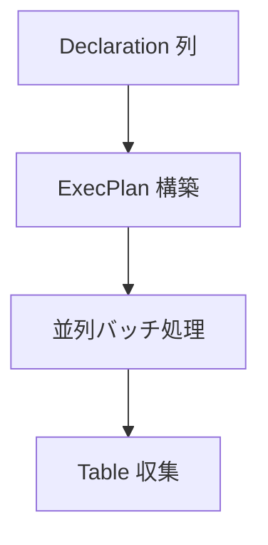
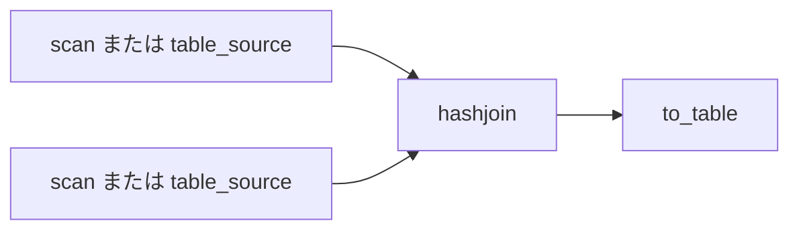

# 第14章 Acero 実行計画

> **本章で読むソース**
>
> - [`python/pyarrow/_acero.pyx`](https://github.com/apache/arrow/blob/apache-arrow-25.0.0/python/pyarrow/_acero.pyx)
> - [`python/pyarrow/acero.py`](https://github.com/apache/arrow/blob/apache-arrow-25.0.0/python/pyarrow/acero.py)
> - [`python/pyarrow/_dataset.pyx`](https://github.com/apache/arrow/blob/apache-arrow-25.0.0/python/pyarrow/_dataset.pyx)（`ScanNodeOptions`）

## この章の狙い

第13章で単一の compute 関数の呼び出し経路を読んだ。
フィルタ、射影、結合、集約を組み合わせるには、バッチを流す **実行計画** が必要になる。
本章では Acero の **Declaration** と **ExecNodeOptions** を `_acero.pyx` から追い、`acero.py` が Dataset を `scan` ノードへ接続する `_dataset_to_decl` と join 実装まで押さえる。
第15章の Scanner が担うスキャンを、グラフ実行のソースノードとして位置づける。

## 前提

Acero は C++ の `arrow::acero::ExecPlan` を Python から組み立てる層である。
各ノードはファクトリ名（`"filter"`、`"hashjoin"` など）と対応する `ExecNodeOptions` サブクラスで宣言される。
未構築のノードを表す **Declaration** を連結し、`to_table` で計画を走らせて `Table` を得る。

## ExecNodeOptions

`ExecNodeOptions` は全ノードオプションの基底クラスである。
具象クラスは C++ 側の `CExecNodeOptions` を包む。

[`python/pyarrow/_acero.pyx` L39-L44](https://github.com/apache/arrow/blob/apache-arrow-25.0.0/python/pyarrow/_acero.pyx#L39-L44)

```python
cdef class ExecNodeOptions(_Weakrefable):
    """
    Base class for the node options.

    Use one of the subclasses to construct an options object.
    """
```

`FilterNodeOptions` は `compute.Expression` を受け取り、行を除外するノードを定義する。

[`python/pyarrow/_acero.pyx` L90-L107](https://github.com/apache/arrow/blob/apache-arrow-25.0.0/python/pyarrow/_acero.pyx#L90-L107)

```python
class FilterNodeOptions(_FilterNodeOptions):
    """
    Make a node which excludes some rows from batches passed through it.

    This is the option class for the "filter" node factory.

    The "filter" operation provides an option to define data filtering
    criteria. It selects rows where the given expression evaluates to true.
    Filters can be written using pyarrow.compute.Expression, and the
    expression must have a return type of boolean.
    // ... (中略) ...
    """

    def __init__(self, Expression filter_expression):
        self._set_options(filter_expression)
```

`TableSourceNodeOptions` はメモリ上の `Table` をソースにする。
`ProjectNodeOptions`、`AggregateNodeOptions`、`HashJoinNodeOptions` などが同ファイルに並ぶ。

## Declaration：未構築の Exec ノード

`Declaration` はファクトリ名、オプション、入力 Declaration のリストを保持する。

[`python/pyarrow/_acero.pyx` L492-L548](https://github.com/apache/arrow/blob/apache-arrow-25.0.0/python/pyarrow/_acero.pyx#L492-L548)

```python
cdef class Declaration(_Weakrefable):
    """
    Helper class for declaring the nodes of an ExecPlan.

    A Declaration represents an unconstructed ExecNode, and potentially
    more since its inputs may also be Declarations or when constructed
    with ``from_sequence``.
    // ... (中略) ...
    """
    // ... (中略) ...
    def __init__(self, factory_name, ExecNodeOptions options, inputs=None):
        cdef:
            c_string c_factory_name
            CDeclaration c_decl
            vector[CDeclaration.Input] c_inputs

        c_factory_name = tobytes(factory_name)

        if inputs is not None:
            for ipt in inputs:
                c_inputs.push_back(
                    CDeclaration.Input((<Declaration>ipt).unwrap())
                )

        c_decl = CDeclaration(c_factory_name, c_inputs, options.unwrap())
        self.init(c_decl)
```

`from_sequence` は宣言列を直列につなぐ糖衣である。
末尾の宣言だけが最終グラフの根になる。

実行は `to_table` が暗黙にシンクノードを足し、`DeclarationToTable` でブロックする。

[`python/pyarrow/_acero.pyx` L583-L609](https://github.com/apache/arrow/blob/apache-arrow-25.0.0/python/pyarrow/_acero.pyx#L583-L609)

```python
    def to_table(self, bint use_threads=True):
        """
        Run the declaration and collect the results into a table.
        // ... (中略) ...
        """
        cdef:
            shared_ptr[CTable] c_table

        with nogil:
            c_table = GetResultValue(DeclarationToTable(self.unwrap(), use_threads))
        return pyarrow_wrap_table(c_table)
```

`use_threads=False` にすると CPU 作業は呼び出しスレッドに集約される。
I/O は別エグゼキュータで並列のまま動く。

宣言から実行までの流れを Mermaid で示すと次のようになる。



## Dataset 連携：_dataset_to_decl

`acero.py` は Dataset を `scan` ノードへ変換する `_dataset_to_decl` を提供する。
`ScanNodeOptions` は `_dataset.pyx` で定義され、Dataset スキャンを Acero のソースにする。

[`python/pyarrow/acero.py` L59-L79](https://github.com/apache/arrow/blob/apache-arrow-25.0.0/python/pyarrow/acero.py#L59-L79)

```python
def _dataset_to_decl(dataset, use_threads=True, implicit_ordering=False):
    decl = Declaration("scan", ScanNodeOptions(
        dataset, use_threads=use_threads,
        implicit_ordering=implicit_ordering))

    # Get rid of special dataset columns
    # "__fragment_index", "__batch_index", "__last_in_fragment", "__filename"
    projections = [field(f) for f in dataset.schema.names]
    decl = Declaration.from_sequence(
        [decl, Declaration("project", ProjectNodeOptions(projections))]
    )

    filter_expr = dataset._scan_options.get("filter")
    if filter_expr is not None:
        # Filters applied in CScanNodeOptions are "best effort" for the scan node itself
        # so we always need to inject an additional Filter node to apply them for real.
        decl = Declaration.from_sequence(
            [decl, Declaration("filter", FilterNodeOptions(filter_expr))]
        )

    return decl
```

スキャン直後に `project` で Dataset 固有のメタデータ列を落とす。
フィルタはスキャンノード側がベストエフォートで適用するため、確実な適用には別途 `filter` ノードを挿入する。

`ScanNodeOptions` の docstring は、ファイルリーダへのプッシュダウン投影とフィルタを説明している。

[`python/pyarrow/_dataset.pyx` L4200-L4227](https://github.com/apache/arrow/blob/apache-arrow-25.0.0/python/pyarrow/_dataset.pyx#L4200-L4227)

```python
class ScanNodeOptions(_ScanNodeOptions):
    """
    A Source node which yields batches from a Dataset scan.

    This is the option class for the "scan" node factory.

    This node is capable of applying pushdown projections or filters
    to the file readers which reduce the amount of data that needs to
    be read (if supported by the file format). But note that this does not
    construct associated filter or project nodes to perform the final
    filtering or projection. Rather, you may supply the same filter
    expression or projection to the scan node that you also supply
    to the filter or project node.
    // ... (中略) ...
    """
```

Parquet など対応フォーマットでは、スキャンノードが統計やパーティション式を使い、読み込む列と行を絞れる。
最終的な式評価は下流の `filter` ノードが担う二段構えである。

## join の組み立て：_perform_join

`acero.py` の `_perform_join` は左右オペランドをソースノードにし、`hashjoin` を挿入する。
オペランドが `Dataset` なら `_dataset_to_decl`、 `Table` なら `table_source` を使う。

[`python/pyarrow/acero.py` L171-L199](https://github.com/apache/arrow/blob/apache-arrow-25.0.0/python/pyarrow/acero.py#L171-L199)

```python
    # Add the join node to the execplan
    if isinstance(left_operand, ds.Dataset):
        left_source = _dataset_to_decl(left_operand, use_threads=use_threads)
    else:
        left_source = Declaration("table_source", TableSourceNodeOptions(left_operand))
    if isinstance(right_operand, ds.Dataset):
        right_source = _dataset_to_decl(right_operand, use_threads=use_threads)
    else:
        right_source = Declaration(
            "table_source", TableSourceNodeOptions(right_operand)
        )

    if coalesce_keys:
        join_opts = HashJoinNodeOptions(
            join_type, left_keys, right_keys, left_columns, right_columns,
            output_suffix_for_left=left_suffix or "",
            output_suffix_for_right=right_suffix or "",
            filter_expression=filter_expression,
        )
    else:
        join_opts = HashJoinNodeOptions(
            join_type, left_keys, right_keys,
            output_suffix_for_left=left_suffix or "",
            output_suffix_for_right=right_suffix or "",
            filter_expression=filter_expression,
        )
    decl = Declaration(
        "hashjoin", options=join_opts, inputs=[left_source, right_source]
    )
```

`hashjoin` 宣言は左右のソースノードと `HashJoinNodeOptions` を `Declaration` に束ねるだけで、結合アルゴリズムの実行本体は Acero（C++）実行エンジンが担う。
`use_threads` は `to_table` へ伝播するスレッド利用のフラグである。

結合グラフを Mermaid で示すと次のようになる。



`coalesce_keys` と full outer join のときは、結合後に `project` でキー列を `coalesce` して重複を除く追加段が入る。
最終結果は `decl.to_table(use_threads=use_threads)` で物質化される。

[`python/pyarrow/acero.py` L253-L257](https://github.com/apache/arrow/blob/apache-arrow-25.0.0/python/pyarrow/acero.py#L253-L257)

```python
    result_table = decl.to_table(use_threads=use_threads)

    if output_type == Table:
        return result_table
    elif output_type == ds.InMemoryDataset:
        return ds.InMemoryDataset(result_table)
```

## Scanner との境界

第15章の `Dataset.scanner` は C++ の `Scanner` を直接構築する高レベル APIである。
Acero 経由では同じ Dataset を `ScanNodeOptions` に渡し、計画の一部としてスキャンする。
フィルタと射影をスキャンと下流ノードの両方に渡す設計は、I/O 削減と正確な式評価の両立を狙っている。

## まとめ

Acero は **Declaration** で Exec ノード列を宣言し、**ExecNodeOptions** で各ノードの振る舞いを指定する。
`to_table` が計画を走らせ、マルチスレッドでバッチを処理する。
`acero.py` の `_dataset_to_decl` は Dataset を `scan` ソースへ接続し、プッシュダウンと確実な `filter` ノードを組み合わせる。
`_perform_join` はハッシュ join を計画に載せ、Table と Dataset の両方をオペランドにできる。

## 関連する章

- 第13章 [計算カーネルと FunctionRegistry](13-compute-kernels.md)：`Expression` と関数呼び出し
- 第15章 [Dataset と Scanner](15-dataset.md)：`ScanNodeOptions` のデータ源
- 第16章 Parquet 連携（後続）：プッシュダウンの統計利用
