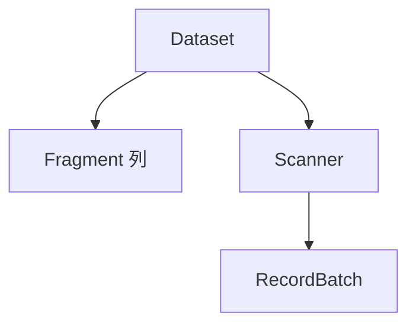
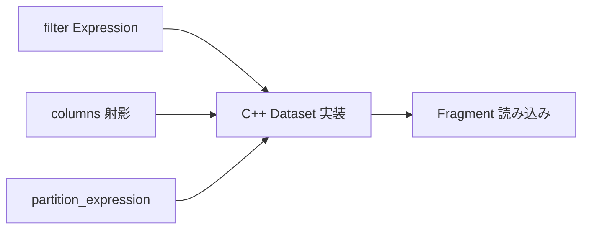

# 第15章 Dataset と Scanner

> **本章で読むソース**
>
> - [`python/pyarrow/_dataset.pyx`](https://github.com/apache/arrow/blob/apache-arrow-25.0.0/python/pyarrow/_dataset.pyx)
> - [`python/pyarrow/dataset.py`](https://github.com/apache/arrow/blob/apache-arrow-25.0.0/python/pyarrow/dataset.py)

## この章の狙い

第14章で Acero が Dataset を `scan` ノードへ接続する経路を読んだ。
本章では Dataset 自体の抽象、ファイル形式、パーティション、スキャン操作を `_dataset.pyx` と `dataset.py` から追う。
複数ファイルに分割されたデータを **Fragment** 単位で扱い、**Scanner** がフィルタと射影をプッシュダウンしながらレコードバッチを yield する流れを押さえる。
第16章の Parquet 連携は、この `FileFormat` 実装の具体例になる。

## 前提

Arrow Dataset は、ディスクやオブジェクトストア上の表形式データを統一的に読む API である。
データは **Fragment**（通常は1ファイル）の集合として表現され、パーティションはディレクトリ構造やファイル名から **Expression** として復元される。
スキャンは即座に全データを載せず、`Scanner` を経由して遅延評価する。

## Dataset：フラグメントの集合

`Dataset` はデータフラグメントと子 Dataset の集合である。
docstring は、シャーディングがパーティションを示し、一部パーティションだけ触るクエリを加速できると述べている。

[`python/pyarrow/_dataset.pyx` L162-L169](https://github.com/apache/arrow/blob/apache-arrow-25.0.0/python/pyarrow/_dataset.pyx#L162-L169)

```python
cdef class Dataset(_Weakrefable):
    """
    Collection of data fragments and potentially child datasets.

    Arrow Datasets allow you to query against data that has been split across
    multiple files. This sharding of data may indicate partitioning, which
    can accelerate queries that only touch some partitions (files).
    """
```

`get_fragments` は C++ 側の `GetFragments` を呼び、フィルタに合う Fragment のイテレータを返す。
除外判定の本体は C++ Dataset 実装が担い、docstring が述べるパーティション式や Parquet 統計の利用はその内部処理に委ねられる。

[`python/pyarrow/_dataset.pyx` L231-L268](https://github.com/apache/arrow/blob/apache-arrow-25.0.0/python/pyarrow/_dataset.pyx#L231-L268)

```python
    def get_fragments(self, Expression filter=None):
        """Returns an iterator over the fragments in this dataset.
        // ... (中略) ...
        filter : Expression, default None
            Return fragments matching the optional filter, either using the
            partition_expression or internal information like Parquet's
            statistics.
        // ... (中略) ...
        """
        // ... (中略) ...
        if filter is None:
            c_fragments = move(GetResultValue(self.dataset.GetFragments()))
        else:
            c_filter = _bind(filter, self.schema)
            c_fragments = move(GetResultValue(
                self.dataset.GetFragments(c_filter)))

        for maybe_fragment in c_fragments:
            yield Fragment.wrap(GetResultValue(move(maybe_fragment)))
```

`scanner` と `to_table` は Dataset からスキャンを起動する便利 API である。
`to_table` は内部で `scanner(...).to_table()` を呼び、全結果をメモリに載せる。

[`python/pyarrow/_dataset.pyx` L518-L522](https://github.com/apache/arrow/blob/apache-arrow-25.0.0/python/pyarrow/_dataset.pyx#L518-L522)

```python
        """
        Read the dataset to an Arrow table.

        Note that this method reads all the selected data from the dataset
        into memory.
```

Dataset から Scanner への関係を Mermaid で示すと次のようになる。



## FileFormat：形式ごとの Fragment 生成

`FileFormat` は Parquet、IPC、CSV など形式別の実装を包むファクトリである。
`inspect` でスキーマを推論し、`make_fragment` で `Fragment` を生成する。

[`python/pyarrow/_dataset.pyx` L1295-L1322](https://github.com/apache/arrow/blob/apache-arrow-25.0.0/python/pyarrow/_dataset.pyx#L1295-L1322)

```python
cdef class FileFormat(_Weakrefable):

    def __init__(self):
        _forbid_instantiation(self.__class__)

    cdef void init(self, const shared_ptr[CFileFormat]& sp):
        self.wrapped = sp
        self.format = sp.get()

    @staticmethod
    cdef wrap(const shared_ptr[CFileFormat]& sp):
        type_name = frombytes(sp.get().type_name())

        classes = {
            'ipc': IpcFileFormat,
            'csv': CsvFileFormat,
            'json': JsonFileFormat,
            'parquet': _get_parquet_symbol('ParquetFileFormat'),
            'orc': _get_orc_fileformat(),
        }
```

`make_fragment` は `partition_expression` を受け取り、その Fragment に常に真となる行条件を付与する。
スキャン時のフィルタと組み合わさると、パーティション外のファイルをスキップできる。

[`python/pyarrow/_dataset.pyx` L1358-L1389](https://github.com/apache/arrow/blob/apache-arrow-25.0.0/python/pyarrow/_dataset.pyx#L1358-L1389)

```python
    def make_fragment(self, file, filesystem=None,
                      Expression partition_expression=None,
                      *, file_size=None):
        """
        Make a FileFragment from a given file.
        // ... (中略) ...
        partition_expression : Expression, optional
            An expression that is guaranteed true for all rows in the fragment.  Allows
            fragment to be potentially skipped while scanning with a filter.
        // ... (中略) ...
        """
        if partition_expression is None:
            partition_expression = _true
        c_source = _make_file_source(file, filesystem, file_size)
        c_fragment = <shared_ptr[CFragment]> GetResultValue(
            self.format.MakeFragment(move(c_source),
                                     partition_expression.unwrap(),
                                     <shared_ptr[CSchema]>nullptr))
```

## Partitioning：パスから式へ

`Partitioning` はファイルパスとパーティション値の間を変換する。
`parse` はパスから `Expression` を、`format` は式からディレクトリ名を生成する。

[`python/pyarrow/_dataset.pyx` L2538-L2587](https://github.com/apache/arrow/blob/apache-arrow-25.0.0/python/pyarrow/_dataset.pyx#L2538-L2587)

```python
cdef class Partitioning(_Weakrefable):
    // ... (中略) ...
    @staticmethod
    cdef wrap(const shared_ptr[CPartitioning]& sp):
        type_name = frombytes(sp.get().type_name())

        classes = {
            'directory': DirectoryPartitioning,
            'hive': HivePartitioning,
            'filename': FilenamePartitioning,
        }
    // ... (中略) ...
    def parse(self, path):
        """
        Parse a path into a partition expression.
        // ... (中略) ...
        """
        cdef CResult[CExpression] result
        result = self.partitioning.Parse(tobytes(path))
        return Expression.wrap(GetResultValue(result))
```

`dataset.py` の `partitioning` は Hive 形式やディレクトリ形式を文字列フラグで選べる高レベル API である。

[`python/pyarrow/dataset.py` L121-L140](https://github.com/apache/arrow/blob/apache-arrow-25.0.0/python/pyarrow/dataset.py#L121-L140)

```python
def partitioning(schema=None, field_names=None, flavor=None,
                 dictionaries=None):
    """
    Specify a partitioning scheme.

    The supported schemes include:

    - "DirectoryPartitioning": this scheme expects one segment in the file path
      for each field in the specified schema (all fields are required to be
      present). For example given schema<year:int16, month:int8> the path
      "/2009/11" would be parsed to ("year"_ == 2009 and "month"_ == 11).
    - "HivePartitioning": a scheme for "/$key=$value/" nested directories as
      found in Apache Hive. This is a multi-level, directory based partitioning
      scheme.
```

`year=2009/month=11` のようなパスは `year == 2009 and month == 11` に落ち、フィルタ `year == 2009` と矛盾する Fragment は列挙段階で除外される。

## Scanner：スキャンコンテキストの束ね

`Scanner` はスキャンタスク、Fragment、データソースを結びつけるクラスである。

[`python/pyarrow/_dataset.pyx` L3587-L3592](https://github.com/apache/arrow/blob/apache-arrow-25.0.0/python/pyarrow/_dataset.pyx#L3587-L3592)

```python
cdef class Scanner(_Weakrefable):
    """A materialized scan operation with context and options bound.

    A scanner is the class that glues the scan tasks, data fragments and data
    sources together.
    """
```

`Scanner.from_dataset` の docstring は、射影とフィルタのプッシュダウンを明示している。
列リストを Fragment まで渡すことで、不要な列のデコードを避ける。

[`python/pyarrow/_dataset.pyx` L3652-L3676](https://github.com/apache/arrow/blob/apache-arrow-25.0.0/python/pyarrow/_dataset.pyx#L3652-L3676)

```python
        columns : list[str] or dict[str, Expression], default None
            The columns to project. This can be a list of column names to
            include (order and duplicates will be preserved), or a dictionary
            with {new_column_name: expression} values for more advanced
            projections.
            // ... (中略) ...
            The columns will be passed down to Datasets and corresponding data
            fragments to avoid loading, copying, and deserializing columns
            that will not be required further down the compute chain.
        filter : Expression, default None
            Scan will return only the rows matching the filter.
            If possible the predicate will be pushed down to exploit the
            partition information or internal metadata found in the data
            source, e.g. Parquet statistics. Otherwise filters the loaded
            RecordBatches before yielding them.
```

`scanner` は `Scanner.from_dataset` を呼び出し、即座にデータを読まず `Scanner` を返す。

[`python/pyarrow/_dataset.pyx` L295-L310](https://github.com/apache/arrow/blob/apache-arrow-25.0.0/python/pyarrow/_dataset.pyx#L295-L310)

```python
    def scanner(self,
                object columns=None,
                object filter=None,
                // ... (中略) ...
        """
        Build a scan operation against the dataset.

        Data is not loaded immediately. Instead, this produces a Scanner,
        which exposes further operations (e.g. loading all data as a
        table, counting rows).
```

`to_batches` も内部で `scanner(...).to_batches()` を呼ぶ。

[`python/pyarrow/_dataset.pyx` L496-L506](https://github.com/apache/arrow/blob/apache-arrow-25.0.0/python/pyarrow/_dataset.pyx#L496-L506)

```python
        return self.scanner(
            columns=columns,
            filter=filter,
            batch_size=batch_size,
            batch_readahead=batch_readahead,
            fragment_readahead=fragment_readahead,
            fragment_scan_options=fragment_scan_options,
            use_threads=use_threads,
            cache_metadata=cache_metadata,
            memory_pool=memory_pool
        ).to_batches()
```

`Scanner.from_dataset` は `ScannerBuilder` を組み立て、`Finish` で C++ 側 `Scanner` を得る。

[`python/pyarrow/_dataset.pyx` L3706-L3716](https://github.com/apache/arrow/blob/apache-arrow-25.0.0/python/pyarrow/_dataset.pyx#L3706-L3716)

```python
        options = Scanner._make_scan_options(
            dataset,
            dict(columns=columns, filter=filter, batch_size=batch_size,
                 // ... (中略) ...
        )
        builder = make_shared[CScannerBuilder](dataset.unwrap(), options)
        scanner = GetResultValue(builder.get().Finish())
        return Scanner.wrap(scanner)
```

`scan_batches` は C++ 側 `ScanBatches` を呼び、Fragment 情報付きのレコードバッチを yield する主要経路である。

[`python/pyarrow/_dataset.pyx` L3941-L3952](https://github.com/apache/arrow/blob/apache-arrow-25.0.0/python/pyarrow/_dataset.pyx#L3941-L3952)

```python
    def scan_batches(self):
        """
        Consume a Scanner in record batches with corresponding fragments.
        // ... (中略) ...
        """
        cdef CTaggedRecordBatchIterator iterator
        with nogil:
            iterator = move(GetResultValue(self.scanner.ScanBatches()))
        return TaggedRecordBatchIterator.wrap(self, move(iterator))
```

`batch_readahead` と `fragment_readahead` は I/O とデコードの先読み深さである。
値を上げるとメモリは増えるが、ディスク待ちを隠しやすくなる。

`to_table` はスキャン結果を一括で `Table` にまとめる。

[`python/pyarrow/_dataset.pyx` L3955-L3971](https://github.com/apache/arrow/blob/apache-arrow-25.0.0/python/pyarrow/_dataset.pyx#L3955-L3971)

```python
    def to_table(self):
        """
        Convert a Scanner into a Table.

        Use this convenience utility with care. This will serially materialize
        the Scan result in memory before creating the Table.
        // ... (中略) ...
        """
        cdef CResult[shared_ptr[CTable]] result

        with nogil:
            result = self.scanner.ToTable()

        return pyarrow_wrap_table(GetResultValue(result))
```

プッシュダウンの流れを Mermaid で示すと次のようになる。



## dataset() 高レベル API

`dataset.py` の `dataset` はパス、ファイル列、ネストした Dataset などから `Dataset` を構築する入口である。
docstring は述語プッシュダウン、射影、並列読み込みを統合インターフェースの利点として挙げている。

[`python/pyarrow/dataset.py` L580-L593](https://github.com/apache/arrow/blob/apache-arrow-25.0.0/python/pyarrow/dataset.py#L580-L593)

```python
def dataset(source, schema=None, format=None, filesystem=None,
            partitioning=None, partition_base_dir=None,
            exclude_invalid_files=None, ignore_prefixes=None):
    """
    Open a dataset.

    Datasets provides functionality to efficiently work with tabular,
    potentially larger than memory and multi-file dataset.

    - A unified interface for different sources, like Parquet and Feather
    - Discovery of sources (crawling directories, handle directory-based
      partitioned datasets, basic schema normalization)
    - Optimized reading with predicate pushdown (filtering rows), projection
      (selecting columns), parallel reading or fine-grained managing of tasks.
```

`format="parquet"` のような文字列は `_ensure_format` で `ParquetFileFormat` インスタンスに変換される。
単一ファイル、ディレクトリ再帰、明示的ファイルリスト、S3 URI などソース形態ごとに分岐する。

## Acero との接続

第14章の `_dataset_to_decl` は、ここで構築した `Dataset` を `ScanNodeOptions` に渡す。
`Dataset.scanner` が担うプッシュダウンオプションは、Acero 経由でも `ScanNodeOptions` の kwargs として再利用される。
高レベルでは `ds.dataset(...).to_table(filter=...)`、低レベルでは Declaration グラフ、いずれも同じ C++ Dataset 実装に届く。

## まとめ

**Dataset** は Fragment の抽象であり、パーティション式でファイル単位の pruning を可能にする。
**FileFormat** は形式ごとに Fragment を生成し、**Partitioning** はパスと式を相互変換する。
**Scanner** はフィルタと射影を C++ 側へ伝播し、`scan_batches` でレコードバッチを yield する。
統計やパーティションによる読み込み削減は C++ Dataset 実装の内部最適化に依存する。
`dataset()` が探索と形式選択をまとめ、メモリに載らないデータセットをレコードバッチ単位で処理する入口になる。

## 関連する章

- 第8章 [ストリーミング IPC](../part02-ipc/08-streaming-ipc.md)：`IpcFileFormat`
- 第9章 [ファイル形式](../part02-ipc/09-file-format.md)：Feather V2 と IPC ファイル
- 第13章 [計算カーネルと FunctionRegistry](13-compute-kernels.md)：フィルタ式
- 第14章 [Acero 実行計画](14-acero.md)：`ScanNodeOptions`
- 第16章 Parquet 連携（後続）：`ParquetFileFormat` と統計
