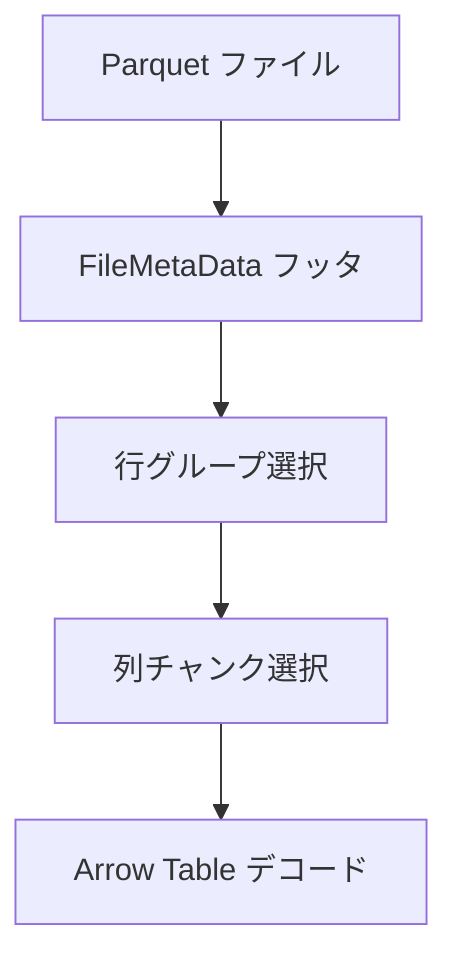
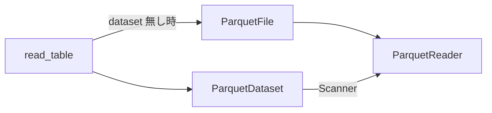

# 第16章 Parquet 連携

> **本章で読むソース**
>
> - [`python/pyarrow/_parquet.pyx`](https://github.com/apache/arrow/blob/apache-arrow-25.0.0/python/pyarrow/_parquet.pyx)
> - [`python/pyarrow/parquet/core.py`](https://github.com/apache/arrow/blob/apache-arrow-25.0.0/python/pyarrow/parquet/core.py)

## この章の狙い

第15章で Dataset が `ParquetFileFormat` 経由でファイル群を扱う流れを読んだ。
本章では Parquet 専用の読み書き層を `_parquet.pyx` と `parquet/core.py` から追う。
**FileMetaData**、**ParquetReader**、**ParquetWriter** の役割、行グループ単位の読み出し、統計情報と第15章のプッシュダウンの接点を押さえる。

## 前提

Parquet は列指向のファイル形式であり、データは**行グループ**（row group）と**列チャンク**（column chunk）に分割される。
ファイル末尾の Thrift メタデータがスキーマ、行グループ境界、列ごとの min/max 統計を保持する。
`pyarrow.parquet` は C++ の `parquet::arrow` ブリッジを包み、Arrow の `Table` と相互変換する。

## FileMetaData：フッタの Arrow 表現

`FileMetaData` は単一 Parquet ファイルのメタデータを表す。
コンストラクタは直接呼べず、リーダまたはライタから得る。

[`python/pyarrow/_parquet.pyx` L1025-L1026](https://github.com/apache/arrow/blob/apache-arrow-25.0.0/python/pyarrow/_parquet.pyx#L1025-L1026)

```python
cdef class FileMetaData(_Weakrefable):
    """Parquet metadata for a single file."""
```

`num_rows`、`num_row_groups`、`format_version` などがプロパティとして公開される。

[`python/pyarrow/_parquet.pyx` L1121-L1129](https://github.com/apache/arrow/blob/apache-arrow-25.0.0/python/pyarrow/_parquet.pyx#L1121-L1129)

```python
    @property
    def num_rows(self):
        """Total number of rows in file (int)."""
        return self._metadata.num_rows()

    @property
    def num_row_groups(self):
        """Number of row groups in file (int)."""
        return self._metadata.num_row_groups()
```

`row_group(i)` は i 番目の行グループメタデータを返す。
各列チャンクのオフセット、圧縮方式、統計がここから読める。

[`python/pyarrow/_parquet.pyx` L1172-L1187](https://github.com/apache/arrow/blob/apache-arrow-25.0.0/python/pyarrow/_parquet.pyx#L1172-L1187)

```python
    def row_group(self, int i):
        """
        Get metadata for row group at index i.
        // ... (中略) ...
        Returns
        -------
        row_group_metadata : RowGroupMetaData
        """
        cdef RowGroupMetaData row_group = RowGroupMetaData.__new__(RowGroupMetaData)
        row_group.init(self, i)
        return row_group
```

`FileMetaData` と `RowGroupMetaData` は Python から Parquet フッタメタデータを読む公開ラッパーである。
第15章の `Scanner` が Parquet 統計で Fragment を pruning するときに参照するのも、同じ C++ Dataset/Parquet 実装が読む基礎メタデータである（本章の Python ラッパーはその内容を覗く窓にあたる）。

## ParquetReader：デコードの入口

`ParquetReader` はファイルを開き、行グループと列を選択して Arrow へデコードする。

[`python/pyarrow/_parquet.pyx` L1570-L1614](https://github.com/apache/arrow/blob/apache-arrow-25.0.0/python/pyarrow/_parquet.pyx#L1570-L1614)

```python
cdef class ParquetReader(_Weakrefable):
    cdef:
        object source
        CMemoryPool* pool
        UniquePtrNoGIL[FileReader] reader
        FileMetaData _metadata
        shared_ptr[CRandomAccessFile] rd_handle
    // ... (中略) ...
    def open(self, object source not None, *, bint use_memory_map=False,
             read_dictionary=None, binary_type=None, list_type=None,
             FileMetaData metadata=None,
             int buffer_size=0, bint pre_buffer=True,
             // ... (中略) ...
        """
        Open a parquet file for reading.
        // ... (中略) ...
        pre_buffer : bool, default True
        // ... (中略) ...
        """
```

`pre_buffer=True` のとき、Arrow はバックグラウンド I/O スレッドプールで読み取りをまとめて発行する。
S3 や GCS のような高レイテンシストレージでは、ランダムアクセスを並列化してスループットを上げる。

`open` 内で `arrow_props.set_pre_buffer(pre_buffer)` が呼ばれる。

[`python/pyarrow/_parquet.pyx` L1652-L1652](https://github.com/apache/arrow/blob/apache-arrow-25.0.0/python/pyarrow/_parquet.pyx#L1652-L1652)

```python
        arrow_props.set_pre_buffer(pre_buffer)
```

`read_row_group` は指定インデックスの行グループだけを `Table` として返す。
`column_indices` を渡せば、必要な列だけデコードする。

[`python/pyarrow/_parquet.pyx` L1805-L1818](https://github.com/apache/arrow/blob/apache-arrow-25.0.0/python/pyarrow/_parquet.pyx#L1805-L1818)

```python
    def read_row_group(self, int i, column_indices=None,
                       bint use_threads=True):
        """
        Parameters
        ----------
        i : int
        column_indices : list[int], optional
        use_threads : bool, default True

        Returns
        -------
        table : pyarrow.Table
        """
        return self.read_row_groups([i], column_indices, use_threads)
```

列投影はデコード前に適用されるため、読み飛ばした列のページはディスクから展開されない。

読み出しの流れを Mermaid で示すと次のようになる。



## ParquetFile と core.py のラッパー

`parquet/core.py` の `ParquetFile` は `ParquetReader` を包む高レベル API である。
`pre_buffer` の docstring は、高レイテンシファイルシステムでの並列読み取りを明示している。

[`python/pyarrow/parquet/core.py` L239-L245](https://github.com/apache/arrow/blob/apache-arrow-25.0.0/python/pyarrow/parquet/core.py#L239-L245)

```python
    pre_buffer : bool, default True
        Coalesce and issue file reads in parallel to improve performance on
        high-latency filesystems (e.g. S3, GCS). If True, Arrow will use a
        background I/O thread pool. If using a filesystem layer that itself
        performs readahead (e.g. fsspec's S3FS), disable readahead for best
        results. Set to False if you want to prioritize minimal memory usage
        over maximum speed.
```

`__init__` は `ParquetReader()` を生成し `open` を呼ぶ。

[`python/pyarrow/parquet/core.py` L330-L342](https://github.com/apache/arrow/blob/apache-arrow-25.0.0/python/pyarrow/parquet/core.py#L330-L342)

```python
        self.reader = ParquetReader()
        self.reader.open(
            source, use_memory_map=memory_map,
            buffer_size=buffer_size, pre_buffer=pre_buffer,
            read_dictionary=read_dictionary, metadata=metadata,
            binary_type=binary_type, list_type=list_type,
            coerce_int96_timestamp_unit=coerce_int96_timestamp_unit,
            decryption_properties=decryption_properties,
            thrift_string_size_limit=thrift_string_size_limit,
            thrift_container_size_limit=thrift_container_size_limit,
            page_checksum_verification=page_checksum_verification,
            arrow_extensions_enabled=arrow_extensions_enabled,
        )
```

## ParquetWriter と write_table

`ParquetWriter` はスキーマを固定して行グループ単位で追記する。

[`python/pyarrow/_parquet.pyx` L2368-L2399](https://github.com/apache/arrow/blob/apache-arrow-25.0.0/python/pyarrow/_parquet.pyx#L2368-L2399)

```python
cdef class ParquetWriter(_Weakrefable):
    cdef:
        unique_ptr[FileWriter] writer
        shared_ptr[COutputStream] sink
        bint own_sink

    def __cinit__(self, where, Schema schema not None, use_dictionary=None,
                  compression=None, version=None,
                  write_statistics=None,
                  MemoryPool memory_pool=None,
                  // ... (中略) ...
                  store_schema=True,
                  write_page_index=False,
                  write_page_checksum=False,
                  // ... (中略) ...
```

`write_statistics=True` がデフォルトであり、列ごとの min/max をフッタに書き込む。
後続のスキャンで C++ Dataset/Parquet 実装が利用できる前提データになる。

`write_table` は行グループサイズを決めて `WriteTable` を呼ぶ。

[`python/pyarrow/_parquet.pyx` L2460-L2474](https://github.com/apache/arrow/blob/apache-arrow-25.0.0/python/pyarrow/_parquet.pyx#L2460-L2474)

```python
    def write_table(self, Table table, row_group_size=None):
        cdef:
            CTable* ctable = table.table
            int64_t c_row_group_size

        if row_group_size is None or row_group_size == -1:
            c_row_group_size = min(ctable.num_rows(), _DEFAULT_ROW_GROUP_SIZE)
        elif row_group_size == 0:
            raise ValueError('Row group size cannot be 0')
        else:
            c_row_group_size = row_group_size

        with nogil:
            check_status(self.writer.get()
                         .WriteTable(deref(ctable), c_row_group_size))
```

`parquet/core.py` の `ParquetWriter.write_table` はスキーマ一致を検証してから Cython 層へ委譲する。

[`python/pyarrow/parquet/core.py` L1191-L1216](https://github.com/apache/arrow/blob/apache-arrow-25.0.0/python/pyarrow/parquet/core.py#L1191-L1216)

```python
    def write_table(self, table, row_group_size=None):
        """
        Write Table to the Parquet file.
        // ... (中略) ...
        """
        if self.schema_changed:
            table = _sanitize_table(table, self.schema, self.flavor)
        assert self.is_open

        if not table.schema.equals(self.schema, check_metadata=False):
            msg = (
                "Table schema does not match schema used to create file: \n"
                f"table:\n{table.schema!s} vs. \nfile:\n{self.schema!s}"
            )
            raise ValueError(msg)

        self.writer.write_table(table, row_group_size=row_group_size)
```

`write_table` 便利関数は `ParquetWriter` コンテキストマネージャ内で一括書き込みする。

[`python/pyarrow/parquet/core.py` L1996-L2055](https://github.com/apache/arrow/blob/apache-arrow-25.0.0/python/pyarrow/parquet/core.py#L1996-L2055)

```python
def write_table(table, where, row_group_size=None, version='2.6',
                use_dictionary=True, compression='snappy',
                write_statistics=True,
                // ... (中略) ...
    try:
        with ParquetWriter(
                where, table.schema,
                filesystem=filesystem,
                version=version,
                // ... (中略) ...
                write_statistics=write_statistics,
                // ... (中略) ...
                **kwargs) as writer:
            writer.write_table(table, row_group_size=row_group_size)
```

## read_table と Dataset への委譲

`read_table` はまず `ParquetDataset` を構築し、第15章の Dataset API へ読み取りを委譲する。
`filters` や `partitioning` はこの経路でのみサポートされる。

[`python/pyarrow/parquet/core.py` L1884-L1915](https://github.com/apache/arrow/blob/apache-arrow-25.0.0/python/pyarrow/parquet/core.py#L1884-L1915)

```python
def read_table(source, *, columns=None, use_threads=True,
               schema=None, use_pandas_metadata=False, read_dictionary=None,
               binary_type=None, list_type=None, memory_map=False, buffer_size=0,
               partitioning="hive", filesystem=None, filters=None,
               ignore_prefixes=None, pre_buffer=True,
               // ... (中略) ...
    try:
        dataset = ParquetDataset(
            source,
            schema=schema,
            filesystem=filesystem,
            partitioning=partitioning,
            memory_map=memory_map,
            read_dictionary=read_dictionary,
            binary_type=binary_type,
            list_type=list_type,
            buffer_size=buffer_size,
            filters=filters,
            ignore_prefixes=ignore_prefixes,
            pre_buffer=pre_buffer,
            // ... (中略) ...
        )
```

`filters_to_expression` はタプル形式のフィルタを `compute.Expression` へ変換する。

[`python/pyarrow/parquet/core.py` L134-L155](https://github.com/apache/arrow/blob/apache-arrow-25.0.0/python/pyarrow/parquet/core.py#L134-L155)

```python
def filters_to_expression(filters):
    """
    Check if filters are well-formed and convert to an ``Expression``.
    // ... (中略) ...
    Returns
    -------
    pyarrow.compute.Expression
        An Expression representing the filters
    """
```

`read_table` は `ParquetDataset` を構築し、フィルタがあれば `filters_to_expression` で `Expression` に変換して Dataset へ渡す。
`ParquetDataset.read` は内部で `Dataset.to_table(filter=...)` を呼ぶ。
行グループ統計との比較や統計欠落時の扱いは C++ Dataset/Parquet 実装が担い、Python 層の引用からは pruning 条件の詳細までは追えない。

[`python/pyarrow/parquet/core.py` L1418-L1420](https://github.com/apache/arrow/blob/apache-arrow-25.0.0/python/pyarrow/parquet/core.py#L1418-L1420)

```python
        self._filter_expression = None
        if filters is not None:
            self._filter_expression = filters_to_expression(filters)
```

[`python/pyarrow/parquet/core.py` L1590-L1593](https://github.com/apache/arrow/blob/apache-arrow-25.0.0/python/pyarrow/parquet/core.py#L1590-L1593)

```python
        table = self._dataset.to_table(
            columns=columns, filter=self._filter_expression,
            use_threads=use_threads
        )
```

Parquet 読み取りの二経路を Mermaid で示すと次のようになる。



## store_schema と Arrow スキーマの埋め込み

`store_schema=True` のとき、ライタは Arrow スキーマを Parquet キーバリューメタデータへ書き込む。
リーダは `schema_arrow` で復元でき、論理型や extension の解釈が一貫する。
第17章の extension 型は、この埋め込みスキーマと `arrow_extensions_enabled` の組み合わせで往復する。

## まとめ

Parquet 連携は **FileMetaData** がフッタ統計と行グループ境界を提供し、**ParquetReader** と **ParquetWriter** が Arrow 表現との変換を担う。
`pre_buffer` と列投影は I/O とデコード量を削る主要なレバーである。
`read_table` は Dataset 経由でフィルタ式を渡し、`write_statistics` は後続スキャンで C++ 実装が参照しうる統計を書き込む。
単体の `ParquetFile` API と Dataset API は同じ C++ リーダを共有する。

## 関連する章

- 第7章 [メッセージ形式とレコードバッチ](../part02-ipc/07-message-format.md)：Arrow 列の直列化
- 第10章 [Buffer とメモリ管理](../part03-memory/10-buffer-and-memory.md)：メモリマップ読み取り
- 第15章 [Dataset と Scanner](15-dataset.md)：`ParquetFileFormat` と統計 pruning
- 第17章 [エコシステムと拡張型](../part05-ecosystem/17-ecosystem.md)：Parquet 内の extension 型
