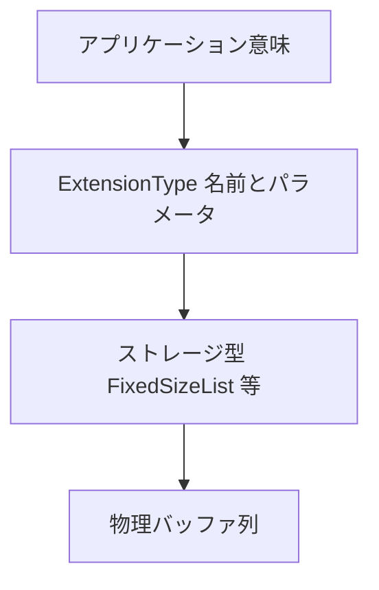
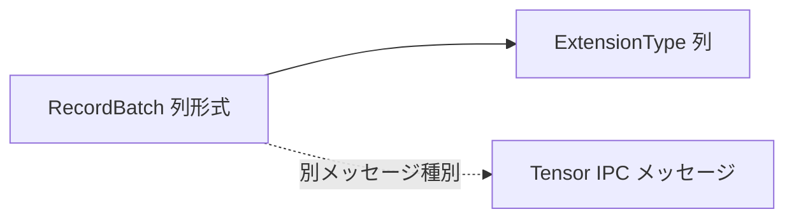

# 第17章 エコシステムと拡張型

> **本章で読むソース**
>
> - [`docs/source/format/CanonicalExtensions.rst`](https://github.com/apache/arrow/blob/apache-arrow-25.0.0/docs/source/format/CanonicalExtensions.rst)
> - [`format/Tensor.fbs`](https://github.com/apache/arrow/blob/apache-arrow-25.0.0/format/Tensor.fbs)
> - [`docs/source/format/Other.rst`](https://github.com/apache/arrow/blob/apache-arrow-25.0.0/docs/source/format/Other.rst)
> - [`python/pyarrow/types.pxi`](https://github.com/apache/arrow/blob/apache-arrow-25.0.0/python/pyarrow/types.pxi)

## この章の狙い

第1部から第4部で、カラム形式、IPC、メモリ共有、計算、Dataset、Parquet まで読んだ。
いずれも**列バッチ**を中心に設計されている。
本章では列形式の外縁と拡張機構を扱う。
**Canonical Extension Types** の標準化ルール、`types.pxi` の **ExtensionType**、および列形式とは別系統の **Tensor** メッセージを仕様と実装から追い、エコシステム全体の型の層を整理する。

## 前提

Arrow のコアはレコードバッチとスキーマである。
アプリケーション固有の意味（地理座標、UUID、JSON 文書など）を載せるには、既存のストレージ型の上に**拡張型**を定義する。
一方、NumPy の `ndarray` に相当する密な多次元配列は、列形式とは別の **Tensor** メッセージで表現できる。
列実装は Tensor を必須としないが、共通の IPC 封入を共有する。

## Canonical Extension Types

仕様は、拡張型で標準型のセマンティクスを拡張し、システム間の相互運用を高める目的を述べている。

[`docs/source/format/CanonicalExtensions.rst` L28-L33](https://github.com/apache/arrow/blob/apache-arrow-25.0.0/docs/source/format/CanonicalExtensions.rst#L28-L33)

```text
The Arrow columnar format allows defining
:ref:`extension types <format_metadata_extension_types>` so as to extend
standard Arrow data types with custom semantics.  Often these semantics
will be specific to a system or application.  However, it is beneficial
to share the definitions of well-known extension types so as to improve
interoperability between different systems integrating Arrow columnar data.
```

標準化にはメーリングリストでの議論と投票が必要である。
拡張名は `arrow.` で始まり、パラメータとシリアライズ形式を文書化する。

[`docs/source/format/CanonicalExtensions.rst` L38-L57](https://github.com/apache/arrow/blob/apache-arrow-25.0.0/docs/source/format/CanonicalExtensions.rst#L38-L57)

```text
These rules must be followed for the standardization of canonical extension
types:

* Canonical extension types are described and maintained below in this document.

* Each canonical extension type requires a distinct discussion and vote
  on the `Arrow development mailing-list <https://arrow.apache.org/community/>`__.

* The specification text to be added *must* follow these requirements:

  1) It *must* define a well-defined extension name starting with "``arrow.``".

  2) Its parameters, if any, *must* be described in the proposal.

  3) Its serialization *must* be described in the proposal and should
     not require unduly implementation work or unusual software dependencies
     (for example, a trivial custom text format or a JSON-based format would be acceptable).

  4) Its expected semantics *should* be described as well and any
     potential ambiguities or pain points addressed or at least mentioned.
```

標準化後は通常の Arrow 型と同様に安定扱いとし、後方互換を保った変更に限る。

## 例：arrow.fixed_shape_tensor

Canonical 一覧の代表が **fixed shape tensor** である。
ストレージ型は `FixedSizeList` で、要素型と形状の積が `list_size` になる。

[`docs/source/format/CanonicalExtensions.rst` L77-L91](https://github.com/apache/arrow/blob/apache-arrow-25.0.0/docs/source/format/CanonicalExtensions.rst#L77-L91)

```text
Fixed shape tensor
==================

* Extension name: ``arrow.fixed_shape_tensor``.

* The storage type of the extension: ``FixedSizeList`` where:

  * **value_type** is the data type of individual tensor elements.
  * **list_size** is the product of all the elements in tensor shape.

* Extension type parameters:

  * **value_type** = the Arrow data type of individual tensor elements.
  * **shape** = the physical shape of the contained tensors
    as an array.
```

`dim_names` や `permutation` は論理軸と物理レイアウトの対応を記述するオプションパラメータである。
同じストレージ列でも、解釈の契約が extension 名とパラメータで共有される。

拡張型の層を Mermaid で示すと次のようになる。



## ExtensionType の Python 実装

`types.pxi` の `ExtensionType` は、Python で定義する拡張型の具象基底クラスである。
`storage_type` と `extension_name` を受け取り、IPC 復元時の識別子になる。

[`python/pyarrow/types.pxi` L1737-L1747](https://github.com/apache/arrow/blob/apache-arrow-25.0.0/python/pyarrow/types.pxi#L1737-L1747)

```python
cdef class ExtensionType(BaseExtensionType):
    """
    Concrete base class for Python-defined extension types.

    Parameters
    ----------
    storage_type : DataType
        The underlying storage type for the extension type.
    extension_name : str
        A unique name distinguishing this extension type. The name will be
        used when deserializing IPC data.
```

サブクラスは `__arrow_ext_serialize__` と `__arrow_ext_deserialize__` でパラメータをバイト列として往復する。
docstring の `RationalType` 例は、struct ストレージに有理数の意味を載せる典型パターンである。

[`python/pyarrow/types.pxi` L1751-L1775](https://github.com/apache/arrow/blob/apache-arrow-25.0.0/python/pyarrow/types.pxi#L1751-L1775)

```python
    Define a RationalType extension type subclassing ExtensionType:

    >>> import pyarrow as pa
    >>> class RationalType(pa.ExtensionType):
    ...     def __init__(self, data_type: pa.DataType):
    ...         if not pa.types.is_integer(data_type):
    ...             raise TypeError(f"data_type must be an integer type not {data_type}")
    ...         super().__init__(
    ...             pa.struct(
    ...                 [
    ...                     ("numer", data_type),
    ...                     ("denom", data_type),
    ...                 ],
    ...             ),
    ...             # N.B. This name does _not_ reference `data_type` so deserialization
    ...             # will work for _any_ integer `data_type` after registration
    ...             "my_package.rational",
    ...         )
    ...     def __arrow_ext_serialize__(self) -> bytes:
    ...         # No parameters are necessary
    ...         return b""
    ...     @classmethod
    ...     def __arrow_ext_deserialize__(cls, storage_type, serialized):
    ...         # return an instance of this subclass
    ...         return RationalType(storage_type[0].type)
```

`register_extension_type` は拡張名をキーにグローバルレジストリへ登録する。
同じサブクラスの別パラメータ化インスタンスも、登録後は名前で復元できる。

[`python/pyarrow/types.pxi` L2170-L2181](https://github.com/apache/arrow/blob/apache-arrow-25.0.0/python/pyarrow/types.pxi#L2170-L2181)

```python
    """
    Register a Python extension type.

    Registration is based on the extension name (so different registered types
    need unique extension names). Registration needs an extension type
    instance, but then works for any instance of the same subclass regardless
    of parametrization of the type.

    Parameters
    ----------
    ext_type : BaseExtensionType instance
        The ExtensionType subclass to register.
```

IPC で拡張型メタデータ付きのフィールドを読み込む経路では、未登録の extension 名はストレージ型として扱われることが多い。
一方、`UnknownExtensionType` は Python `ExtensionType` サブクラスの `__arrow_ext_deserialize__` が未知の実装へ到達したときのフォールバック用クラスであり、extension 名 `"pyarrow.unknown"` を持つ。
そのため全経路が `UnknownExtensionType` に落ちるわけではなく、Python 拡張型のデシリアライズ経路と、メタデータだけが残ったストレージ型として読む経路を区別する必要がある。

## FixedShapeTensorType：Canonical の実装

`FixedShapeTensorType` は `arrow.fixed_shape_tensor` の Python 側実装である。
`fixed_shape_tensor()` ファクトリで `value_type` と `shape` を指定する。

[`python/pyarrow/types.pxi` L1991-L2001](https://github.com/apache/arrow/blob/apache-arrow-25.0.0/python/pyarrow/types.pxi#L1991-L2001)

```python
cdef class FixedShapeTensorType(BaseExtensionType):
    """
    Concrete class for fixed shape tensor extension type.

    Examples
    --------
    Create an instance of fixed shape tensor extension type:

    >>> import pyarrow as pa
    >>> pa.fixed_shape_tensor(pa.int32(), [2, 2])
    FixedShapeTensorType(extension<arrow.fixed_shape_tensor[value_type=int32, shape=[2,2]]>)
```

Canonical 仕様のストレージ契約（`FixedSizeList`）の上に、形状と軸のメタデータが載る。
列バッチ内でテンソル列を運びつつ、ストレージは通常のリスト列として他エンジンも読める。

## Tensor.fbs：列形式外の密テンソル

`format/Tensor.fbs` は IPC 用の **Tensor** メタデータを定義する。
`TensorDim` が各軸の長さと任意の名前を持ち、`Tensor` は型、形状、ストライド、データ `Buffer` を束ねる。

[`format/Tensor.fbs` L30-L52](https://github.com/apache/arrow/blob/apache-arrow-25.0.0/format/Tensor.fbs#L30-L52)

```text
table TensorDim {
  /// Length of dimension
  size: long;

  /// Name of the dimension, optional
  name: string;
}

table Tensor {
  /// The type of data contained in a value cell. Currently only fixed-width
  /// value types are supported, no strings or nested types
  type: Type (required);

  /// The dimensions of the tensor, optionally named
  shape: [TensorDim] (required);

  /// Non-negative byte offsets to advance one value cell along each dimension
  /// If omitted, default to row-major order (C-like).
  strides: [long];

  /// The location and size of the tensor's data
  data: Buffer (required);
}
```

固定幅型のみをサポートし、文字列やネスト型は対象外である。
ストライド省略時は C 順（行優先）とみなす。

## Other.rst：Tensor と SparseTensor の位置づけ

`Other.rst` は、これらの構造が**カラム形式の一部ではない**と明示する。
列実装は Tensor を実装しなくてよい。

[`docs/source/format/Other.rst` L18-L27](https://github.com/apache/arrow/blob/apache-arrow-25.0.0/docs/source/format/Other.rst#L18-L27)

```text
Other Data Structures
=====================

Our `Flatbuffers protocol definition files`_ have metadata for some other data
structures defined to allow other kinds of applications to take advantage of
common interprocess communication machinery. These data structures are not
considered to be part of the columnar format.

An Arrow columnar implementation is not required to implement these
types.
```

単体 Tensor メッセージは第7章の封入形式に載せ、本体開始オフセットを 64 バイト境界へ揃える。

[`docs/source/format/Other.rst` L29-L42](https://github.com/apache/arrow/blob/apache-arrow-25.0.0/docs/source/format/Other.rst#L29-L42)

```text
Tensor (Multi-dimensional Array)
--------------------------------

The ``Tensor`` message types provides a way to write a
multidimensional array of fixed-size values (such as a NumPy ndarray).

When writing a standalone encapsulated tensor message, we use the
encapsulated IPC format defined in the :ref:`Columnar Specification
<format_columnar>`, but additionally align the starting offset of the
tensor body to be a multiple of 64 bytes: ::

    <metadata prefix and metadata>
    <PADDING>
    <tensor body>
```

**SparseTensor** も同様に IPC 封入を共有するが、疎インデックスと本体の二領域を 64 バイト境界に揃える。

[`docs/source/format/Other.rst` L44-L60](https://github.com/apache/arrow/blob/apache-arrow-25.0.0/docs/source/format/Other.rst#L44-L60)

```text
Sparse Tensor
-------------

``SparseTensor`` represents a multidimensional array whose elements
are generally almost all zeros.

When writing a standalone encapsulated sparse tensor message, we use
the encapsulated IPC format defined in the :ref:`Columnar Specification
<format_columnar>`, but additionally align the starting offsets of the
sparse index and the sparse tensor body (if writing to a shared memory
region) to be multiples of 64 bytes: ::

    <metadata prefix and metadata>
    <PADDING>
    <sparse index>
    <PADDING>
    <sparse tensor body>
```

列形式と Tensor の関係を Mermaid で示すと次のようになる。



Extension でテンソル列を運ぶ経路と、単体 Tensor メッセージは目的が異なる。
前者はスキーマ付き表の一列、後者は ndarray 相当の単一オブジェクトである。

## Parquet と extension の接続

第16章の `arrow_extensions_enabled` は、Parquet 論理型を Canonical extension へマップする。
`arrow.json` や `arrow.uuid` など、仕様書に列挙された名前がそのまま使われる。
`store_schema` で埋め込んだ Arrow スキーマと組み合わさると、ファイル単体で型の意味が往復する。

## まとめ

**Canonical Extension Types** は `arrow.` 接頭の共有語彙で、ストレージ型の上に意味を載せる。
`ExtensionType` と `register_extension_type` は Python から同じ仕組みを拡張する API である。
`FixedShapeTensorType` は Canonical 定義の実装例であり、`Tensor.fbs` は列バッチ外の密テンソル用メッセージである。
`Other.rst` は後者がカラム形式の必須部分ではないと位置づける。
本書で読んできた IPC、Flight、Dataset、Parquet はいずれも列バッチ中心であり、本章の型はその周辺のエコシステム層を成す。

## 関連する章

- 第3章 [型システム](../part01-types/03-type-system.md)：`DataType` と `Schema`
- 第7章 [メッセージ形式とレコードバッチ](../part02-ipc/07-message-format.md)：IPC 封入と `MessageHeader`
- 第11章 [C Data Interface](../part03-memory/11-c-data-interface.md)：`ArrowSchema.format`
- 第16章 [Parquet 連携](../part04-compute/16-parquet-integration.md)：`arrow_extensions_enabled`
