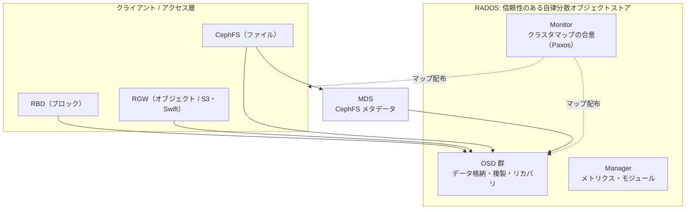
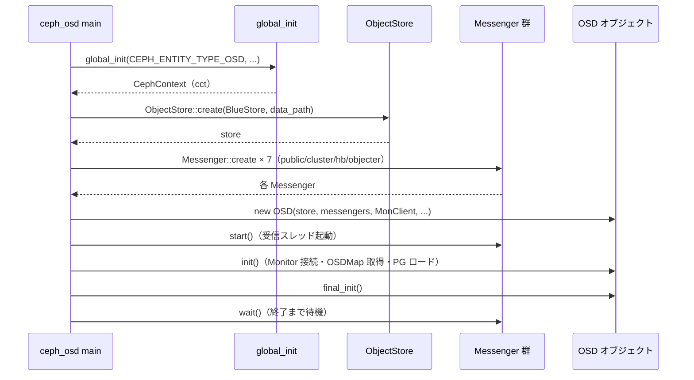

# 第1章 Ceph/RADOS のアーキテクチャとデーモン起動

> **本章で読むソース**
>
> - [`src/ceph_osd.cc`](https://github.com/ceph/ceph/blob/v20.2.2/src/ceph_osd.cc)
> - [`src/ceph_mon.cc`](https://github.com/ceph/ceph/blob/v20.2.2/src/ceph_mon.cc)
> - [`src/ceph_mds.cc`](https://github.com/ceph/ceph/blob/v20.2.2/src/ceph_mds.cc)
> - [`src/ceph_mgr.cc`](https://github.com/ceph/ceph/blob/v20.2.2/src/ceph_mgr.cc)
> - [`src/global/global_init.cc`](https://github.com/ceph/ceph/blob/v20.2.2/src/global/global_init.cc)
> - [`src/osd/OSD.h`](https://github.com/ceph/ceph/blob/v20.2.2/src/osd/OSD.h)

## この章の狙い

本章は本書全体の地図を描く導入章である。
Ceph が何を積み上げてできているか、その最下層に位置する **RADOS**（Reliable Autonomic Distributed Object Store）を中核として全体像を示す。
そのうえで、RADOS を構成する各デーモンがどのように起動し、どんなサブシステムを抱えて動き始めるかを、OSD デーモンの `main` を追いながら確認する。
個々のサブシステムの内部は第2部以降で読むため、ここでは分担と起動の骨格に絞る。

## 前提

読者は C++ と、分散システムまたはストレージシステムの基礎を身につけているものとする。
Ceph の運用経験は前提にしない。
本章で登場する Messenger、ObjectStore、OSDMap といった構成要素は、この章では役割の紹介にとどめ、実装は後続の章に譲る。

## Ceph の階層：RADOS とその上に載るもの

Ceph は単一のオブジェクトストア RADOS を土台に据え、その上に用途別のアクセス層を重ねた構造をとる。
RADOS はオブジェクトの複製、障害検知、リバランスを自律的に行う分散オブジェクトストアであり、Ceph のすべてのデータは最終的にこの層のオブジェクトとして格納される。
利用者が触れるのは、RADOS の上に載る三つのアクセス層である。
ブロックデバイスを提供する **RBD**、POSIX ファイルシステムを提供する **CephFS**、S3/Swift 互換のオブジェクトストレージを提供する **RGW**（RADOS Gateway）が、いずれも RADOS のオブジェクト操作へと翻訳される。

RADOS 自体は、役割の異なる複数のデーモンが協調して成り立つ。

- **Monitor**（mon）：クラスタの構成情報（OSDMap、MonMap、CRUSH map など）の正本を Paxos で合意しながら保持する、いわばクラスタの「地図」の管理者である。
- **OSD**（Object Storage Daemon）：実際のデータをローカルディスクに格納して複製、リカバリ、スクラブを担い、その台数がそのままクラスタの容量とスループットになる。
- **Manager**（mgr）：メトリクスの集約や各種モジュール（ダッシュボード、オーケストレータ等）のホストを担う補助デーモンである。
- **MDS**（Metadata Server）：CephFS を使うときだけ動いてファイルシステムのメタデータ（ディレクトリ木や inode）を管理する（RBD と RGW は MDS を必要としない）。

これらの関係を図に示す。



MDS はメタデータの木構造を管理するが、その内容自体も RADOS のオブジェクトとして OSD に格納する。
CephFS のファイルデータも同じく OSD に置かれる。
つまり図の実線がすべて OSD へ向かうとおり、あらゆるデータの終着点は RADOS のオブジェクトである。

## 設計の工夫：CRUSH による中央メタデータサーバの排除

分散ストレージの多くは、どのデータがどのノードにあるかを引く索引を中央のメタデータサーバに置く。
この方式では、全アクセスが索引参照を経由するため、索引サーバがスループットとスケーラビリティの頭打ちになりやすい。
Ceph はこの索引を持たない。
代わりに、オブジェクト名から配置先の OSD 群を計算で導く **CRUSH**（Controlled Replication Under Scalable Hashing）を用いる。

仕組みは次のとおりである。
オブジェクトは名前のハッシュによって **PG**（Placement Group、配置グループ）に割り当てられ、その PG を CRUSH map（OSD の階層構造と重みの記述）に通すと、格納先の OSD の集合（acting セット）が決定的に求まる。
クライアントは Monitor から OSDMap と CRUSH map を一度受け取れば、以後はオブジェクトごとに配置先を自分で計算し、Monitor を介さずに担当 OSD へ直接読み書きできる。

この設計がスケーラビリティを生む機構は明快である。
データ位置の解決がクライアント側のローカル計算に閉じるため、OSD を増設してもデータパスに新たな中央ボトルネックが加わらず、クラスタの台数に応じてスループットが伸びる。
Monitor はマップの合意と配布に専念でき、個々の I/O 経路から外れる。
CRUSH の実装そのものは第3部（[`part03-crush/07-crush.md`](../part03-crush/07-crush.md)）で読む。

## デーモン起動の共通形：global_init

各デーモンの `main` は、細部こそ違え、同じ骨格を共有する。
起点は `global_init` の呼び出しである。
これは設定ファイルの読み込み、CephContext（プロセス全体の設定とロガーを束ねる文脈オブジェクト）の生成、ログ基盤の準備といったプロセス初期化をまとめて行う。

OSD の `main` では次のように呼ぶ。

[`src/ceph_osd.cc` L132-L135](https://github.com/ceph/ceph/blob/v20.2.2/src/ceph_osd.cc#L132-L135)

```cpp
  auto cct = global_init(
    nullptr,
    args, CEPH_ENTITY_TYPE_OSD,
    CODE_ENVIRONMENT_DAEMON, 0);
```

第3引数の `module_type` だけがデーモンごとに異なる。
Monitor は `CEPH_ENTITY_TYPE_MON`、MDS は `CEPH_ENTITY_TYPE_MDS`、Manager は `CEPH_ENTITY_TYPE_MGR` を渡す。

[`src/ceph_mon.cc` L309-L311](https://github.com/ceph/ceph/blob/v20.2.2/src/ceph_mon.cc#L309-L311)

```cpp
  auto cct = global_init(&defaults, args,
			 CEPH_ENTITY_TYPE_MON, CODE_ENVIRONMENT_DAEMON,
			 flags);
```

`global_init` の内部は、まず `global_pre_init` で CephContext を組み立て、以後の二重初期化を静的フラグ `first_run` で防いだうえで、渡されたフラグに応じて初期化を進める。

[`src/global/global_init.cc` L182-L197](https://github.com/ceph/ceph/blob/v20.2.2/src/global/global_init.cc#L182-L197)

```cpp
global_init(const std::map<std::string,std::string> *defaults,
	    std::vector < const char* >& args,
	    uint32_t module_type, code_environment_t code_env,
	    int flags, bool run_pre_init)
{
  // Ensure we're not calling the global init functions multiple times.
  static bool first_run = true;
  if (run_pre_init) {
    // We will run pre_init from here (default).
    ceph_assert(!g_ceph_context && first_run);
    global_pre_init(defaults, args, module_type, code_env, flags);
  } else {
    // Caller should have invoked pre_init manually.
    ceph_assert(g_ceph_context && first_run);
  }
  first_run = false;
```

デーモン化（バックグラウンドプロセスへの移行）は `global_init_prefork` と `global_init_postfork_start`／`global_init_postfork_finish` に分かれている。
`fork` の前後で初期化を二段に割るのは、親プロセスが子の起動成否を待って終了ステータスに反映できるようにするためである。
`ceph_mgr` の `main` は、この共通形をもっとも短く体現していて、`global_init` のあとは `MgrStandby` を生成して制御を渡すだけである。

## OSD デーモンの起動シーケンス

OSD の `main` は、共通形の `global_init` に続けて、データ格納デーモンとして固有の初期化を積む。
流れは、ObjectStore を開き、複数の Messenger を生成し、それらを `OSD` オブジェクトへ束ねて `init` する、という順序である。

まず、ローカルディスクへの永続化を担う **ObjectStore** を生成する。
`store_type`（既定では BlueStore）とデータディレクトリを渡し、実体を作る。

[`src/ceph_osd.cc` L324-L328](https://github.com/ceph/ceph/blob/v20.2.2/src/ceph_osd.cc#L324-L328)

```cpp
  std::unique_ptr<ObjectStore> store = ObjectStore::create(g_ceph_context,
							   store_type,
							   data_path,
							   journal_path,
							   flags);
```

次に、ネットワーク通信を担う **Messenger** を生成する。
OSD は用途ごとに独立した Messenger を持つ点が特徴である。
クライアント向けの `ms_public`、OSD 間のレプリケーション向けの `ms_cluster`、ハートビート専用の前後2系統ずつ、そして Objecter 用と、計7個を作る。

[`src/ceph_osd.cc` L556-L569](https://github.com/ceph/ceph/blob/v20.2.2/src/ceph_osd.cc#L556-L569)

```cpp
  Messenger *ms_public = Messenger::create(g_ceph_context, public_msg_type,
					   entity_name_t::OSD(whoami), "client", nonce);
  Messenger *ms_cluster = Messenger::create(g_ceph_context, cluster_msg_type,
					    entity_name_t::OSD(whoami), "cluster", nonce);
  Messenger *ms_hb_back_client = Messenger::create(g_ceph_context, cluster_msg_type,
					     entity_name_t::OSD(whoami), "hb_back_client", nonce);
  // ... (中略) ...
  Messenger *ms_objecter = Messenger::create(g_ceph_context, public_msg_type,
					     entity_name_t::OSD(whoami), "ms_objecter", nonce);
```

ハートビートを専用の Messenger に分離する狙いは、生存監視をデータ転送の輻輳から切り離すことにある。
クライアント I/O やリカバリで `ms_cluster` が詰まっても、ハートビート経路が独立していれば、生きている OSD が輻輳のせいで死亡と誤判定されにくい。

これらを引数に `OSD` オブジェクトを生成する。
`OSD` は、ここで作った store と各 Messenger、そして Monitor と通信する `MonClient` を受け取って構築される。

[`src/ceph_osd.cc` L710-L724](https://github.com/ceph/ceph/blob/v20.2.2/src/ceph_osd.cc#L710-L724)

```cpp
  osdptr = new OSD(g_ceph_context,
		   std::move(store),
		   whoami,
		   ms_cluster,
		   ms_public,
		   ms_hb_front_client,
		   ms_hb_back_client,
		   ms_hb_front_server,
		   ms_hb_back_server,
		   ms_objecter,
		   &mc,
		   data_path,
		   journal_path,
		   poolctx);
```

`OSD` クラスの冒頭を見ると、`main` で渡したこれらの構成要素が、そのままメンバとして保持されているのがわかる。

[`src/osd/OSD.h` L1258-L1265](https://github.com/ceph/ceph/blob/v20.2.2/src/osd/OSD.h#L1258-L1265)

```cpp
  Messenger   *cluster_messenger;
  Messenger   *client_messenger;
  Messenger   *objecter_messenger;
  MonClient   *monc; // check the "monc helpers" list before accessing directly
  MgrClient   mgrc;
  PerfCounters      *logger;
  PerfCounters      *recoverystate_perf;
  std::unique_ptr<ObjectStore> store;
```

`OSD` が抱える現在の OSDMap は、補助クラス `OSDService` が `OSDMapRef`（参照カウント付きの共有ポインタ）として保持する。

[`src/osd/OSD.h` L155-L160](https://github.com/ceph/ceph/blob/v20.2.2/src/osd/OSD.h#L155-L160)

```cpp
  OSDMapRef osdmap;

public:
  OSDMapRef get_osdmap() {
    std::lock_guard l(publish_lock);
    return osdmap;
```

構築が済むと、各 Messenger の受信スレッドを `start` で起動し、`OSD::init` でクラスタへの参加処理（Monitor への接続、OSDMap の取得、PG のロード）を走らせる。
最後に `final_init` を呼んで管理用ソケットなどを整え、Messenger の終了を `wait` で待って `main` は待機状態に入る。

[`src/ceph_osd.cc` L734-L743](https://github.com/ceph/ceph/blob/v20.2.2/src/ceph_osd.cc#L734-L743)

```cpp
  ms_public->start();
  ms_hb_front_client->start();
  ms_hb_back_client->start();
  ms_hb_front_server->start();
  ms_hb_back_server->start();
  ms_cluster->start();
  ms_objecter->start();

  // start osd
  err = osdptr->init();
```

一連の流れをシーケンス図にまとめる。



MDS の `main` も同じ骨格をたどる。
`global_init` のあとに Messenger を1個生成して `start` し、`MDSDaemon` を作って `init` を呼び、`wait` で待つ。

[`src/ceph_mds.cc` L171-L173](https://github.com/ceph/ceph/blob/v20.2.2/src/ceph_mds.cc#L171-L173)

```cpp
  Messenger *msgr = Messenger::create(g_ceph_context, public_msgr_type,
				      entity_name_t::MDS(-1), "mds",
				      Messenger::get_random_nonce());
```

デーモンによって抱えるサブシステムの数は違うが、「global_init で文脈を作り、通信路（Messenger）を開き、本体オブジェクトを構築して init し、wait で常駐する」という順序は共通している。

## まとめ

Ceph は RADOS を土台に、RBD、CephFS、RGW を上位アクセス層として重ねた構造をとる。
RADOS は Monitor（マップの合意）、OSD（データ格納）、Manager（補助）から成り、CephFS のときだけ MDS が加わる。
設計の要は、データ位置を中央索引ではなく CRUSH の計算で解くことにある。
これにより I/O 経路から中央ボトルネックが消え、台数に応じてスループットが伸びる。
各デーモンの起動は、`global_init` で CephContext を作り、Messenger と本体サブシステム（OSD なら ObjectStore）を構築し、`init` してから `wait` で常駐する共通形をとる。
OSD が用途別に7個の Messenger を持ち、ハートビートをデータ転送から分離している点は、輻輳下での誤検知を避けるための工夫である。

## 関連する章

- RADOS のオブジェクトがどう表現され、ネットワーク越しに符号化されるかは[第2章 オブジェクトモデルとシリアライズ](../part01-foundation/02-object-model.md)で読む。
- 起動時に開いた Messenger の内部（イベント駆動 I/O）は[第4章 Messenger と AsyncConnection](../part02-network/04-messenger.md)で扱う。
- CRUSH による決定的な配置計算は[第7章 CRUSH アルゴリズム](../part03-crush/07-crush.md)で詳しく読む。
- Monitor がマップをどう合意するかは[第9章 Monitor と Paxos](../part04-monitor/09-monitor-paxos.md)で扱う。
- `OSD::init` 以降の OSD デーモン内部の構造は[第11章 OSD デーモンの構造](../part05-osd/11-osd-daemon.md)で読む。
- OSD が抱える ObjectStore の実装は[第18章 ObjectStore インターフェースと Transaction](../part06-bluestore/18-objectstore.md)から始まる第6部で扱う。
