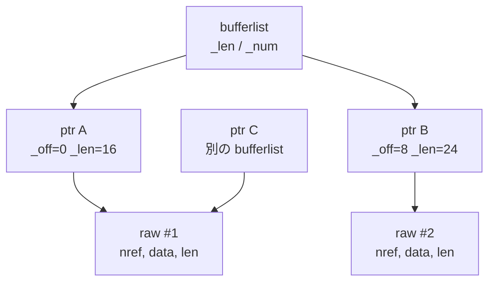
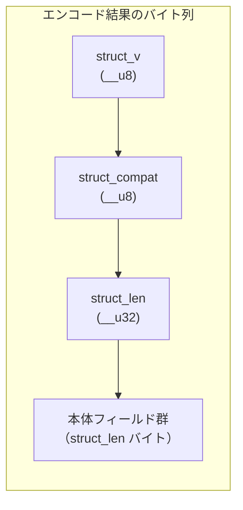

# 第2章 オブジェクトモデルとシリアライズ（bufferlist・encode/decode・CephContext）

> **本章で読むソース**
>
> - [`src/include/buffer.h`](https://github.com/ceph/ceph/blob/v20.2.2/src/include/buffer.h)
> - [`src/include/buffer_raw.h`](https://github.com/ceph/ceph/blob/v20.2.2/src/include/buffer_raw.h)
> - [`src/common/buffer.cc`](https://github.com/ceph/ceph/blob/v20.2.2/src/common/buffer.cc)
> - [`src/include/encoding.h`](https://github.com/ceph/ceph/blob/v20.2.2/src/include/encoding.h)
> - [`src/common/ceph_context.h`](https://github.com/ceph/ceph/blob/v20.2.2/src/common/ceph_context.h)
> - [`src/include/object.h`](https://github.com/ceph/ceph/blob/v20.2.2/src/include/object.h)

## この章の狙い

Ceph のあらゆるコンポーネントは、可変長のバイト列を作り、それをネットワークへ送り、ディスクへ書き、また読み戻す。
この「バイト列」を表現する共通の型が `bufferlist` であり、任意の C++ オブジェクトをバイト列へ変換する仕組みが `encode`/`decode` である。
本章では、この二つがどう組み合わさって Ceph 全体のデータ表現を支えるかを読む。
あわせて、プロセス全体で設定やカウンタを共有する `CephContext` の役割を押さえる。

これらは第3章以降で読むスレッド基盤、Messenger、OSD、BlueStore のいずれにも顔を出す。
先にここで基盤を固めておくと、以降の章でデータの受け渡しに立ち止まらずに済む。

## 前提

C++ の参照カウント（`shared_ptr` 的なもの）とテンプレートの基本、バイトオーダーの概念を前提とする。
Ceph の役割語（OSD、Monitor など）は第1章で導入済みとして使う。

## bufferlist はなぜ中心データ型なのか

Ceph が扱うデータは、その多くが「連続しているとは限らない可変長のバイト列」である。
ネットワークから届いたメッセージは複数のパケットに分かれ、ディスクへ書く前のオブジェクトは断片的に組み立てられる。
これを一本の連続メモリにまとめ直すのはコストが高い。
そこで Ceph は、複数のメモリ断片を連結したまま一つの列として扱う型を用意した。
それが `ceph::buffer::list`（別名 `bufferlist`）である。

`bufferlist` の実体は、バッファ断片を並べた単方向リストである。

[`src/include/buffer.h` L416-L421](https://github.com/ceph/ceph/blob/v20.2.2/src/include/buffer.h#L416-L421)

```cpp
  class CEPH_BUFFER_API list {
  public:
    // this the very low-level implementation of singly linked list
    // ceph::buffer::list is built on. We don't use intrusive slist
    // of Boost (or any other 3rd party) to save extra dependencies
    // in our public headers.
```

リストの各要素は `ptr`（別名 `bufferptr`）である。
`ptr` は生メモリを直接持たず、参照カウント付きの生バッファ `raw` の一部分（オフセットと長さ）を指す。

[`src/include/buffer.h` L166-L170](https://github.com/ceph/ceph/blob/v20.2.2/src/include/buffer.h#L166-L170)

```cpp
  class CEPH_BUFFER_API ptr {
    friend class list;
  protected:
    raw *_raw;
    unsigned _off, _len;
```

つまり階層は「`list` が複数の `ptr` を連結し、各 `ptr` が `raw` の部分区間を指す」という三層になる。
`list` は全体の長さと断片数を `_len` と `_num` にキャッシュして持つ。

[`src/include/buffer.h` L633-L641](https://github.com/ceph/ceph/blob/v20.2.2/src/include/buffer.h#L633-L641)

```cpp
  private:
    // my private bits
    buffers_t _buffers;

    // track bufferptr we can modify (especially ::append() to). Not all bptrs
    // bufferlist holds have this trait -- if somebody ::push_back(const ptr&),
    // he expects it won't change.
    ptr_node* _carriage;
    unsigned _len, _num;
```

この三層構造を図にすると次のようになる。



`bufferlist` への追記は `append` で行う。
末尾に空きのある `raw` があればそこへ書き足し、なければ新しい断片を継ぎ足す。
`_carriage` は「いま追記してよい断片」を覚えておくためのポインタで、`append` のたびに新しいバッファを確保しなくても済むようにする。
逆に、断片に分かれたままでは扱いにくい場面（連続メモリを前提とする API へ渡すときなど）では `rebuild` で一本のバッファへまとめ直す。
中身を先頭から順に読むときは iterator を使い、断片の境界をまたいで連続したバイト列であるかのように走査する。

## 参照カウントされた raw によるコピー削減

`bufferlist` が Ceph の性能を支えるのは、コピーを避ける設計にあるからだ。
生バッファ `raw` は参照カウント `nref` を持つ。

[`src/include/buffer_raw.h` L29-L58](https://github.com/ceph/ceph/blob/v20.2.2/src/include/buffer_raw.h#L29-L58)

```cpp
  class raw {
  public:
    // In the future we might want to have a slab allocator here with few
    // embedded slots. This would allow to avoid the "if" in dtor of ptr_node.
    std::aligned_storage<sizeof(ptr_node),
			 alignof(ptr_node)>::type bptr_storage;
  protected:
    char *data;
    unsigned len;
  public:
    ceph::atomic<unsigned> nref { 0 };
    int mempool;
    // ... (中略) ...
```

`ptr` をコピーすると、指している `raw` の `nref` を一つ増やすだけで、バイト列そのものは複製しない。

[`src/common/buffer.cc` L377-L383](https://github.com/ceph/ceph/blob/v20.2.2/src/common/buffer.cc#L377-L383)

```cpp
  buffer::ptr::ptr(const ptr& p) : _raw(p._raw), _off(p._off), _len(p._len)
  {
    if (_raw) {
      _raw->nref++;
      bdout << "ptr " << this << " get " << _raw << bendl;
    }
  }
```

同じ `raw` を複数の `bufferlist` が同時に参照でき、届いたメッセージのペイロードを OSD が別の宛先へ転送するときも、バイト列を持ち回るだけでコピーは起こらない。
これがネットワークからディスクまでをゼロコピーで貫く仕組みである。

破棄時は逆に `nref` を一つ減らし、ゼロになった最後の参照だけが実メモリを解放する。

[`src/common/buffer.cc` L458-L468](https://github.com/ceph/ceph/blob/v20.2.2/src/common/buffer.cc#L458-L468)

```cpp
    if (auto* const cached_raw = std::exchange(_raw, nullptr);
	cached_raw) {
      bdout << "ptr " << this << " release " << cached_raw << bendl;
      // optimize the common case where a particular `buffer::raw` has
      // only a single reference. Altogether with initializing `nref` of
      // freshly fabricated one with `1` through the std::atomic's ctor
      // (which doesn't impose a memory barrier on the strongly-ordered
      // x86), this allows to avoid all atomical operations in such case.
      const bool last_one = \
        (1 == cached_raw->nref.load(std::memory_order_acquire));
      if (likely(last_one) || --cached_raw->nref == 0) {
```

参照が一つしかない一般的な場合には、アトミックなデクリメントすら省く。
`nref` の読み出しが `1` なら他に共有者はいないと判断し、そのまま解放へ進む。
参照カウントは複数スレッドで共有される `bufferlist` を安全に扱うためにアトミックだが、共有が起きていない大多数の経路ではそのアトミック操作の同期コストを避けられる。

`raw` はさらに直近の CRC 値をキャッシュする。
同じ範囲の CRC を二度求めるときは再計算せずキャッシュを返す。
書き込みや送信のたびに走るチェックサム計算を、内容が変わらない限り繰り返さない工夫である。

## encode/decode によるバージョン付きシリアライズ

`bufferlist` がバイト列の器なら、任意の型をその器へ詰めるのが `encode`、取り出すのが `decode` である。
基本型や STL コンテナ向けの `encode`/`decode` はテンプレートとして定義され、クラスに対しては `WRITE_CLASS_ENCODER` マクロがメンバ関数 `encode`/`decode` への橋渡しを生成する。

[`src/include/encoding.h` L190-L193](https://github.com/ceph/ceph/blob/v20.2.2/src/include/encoding.h#L190-L193)

```cpp
#define WRITE_CLASS_ENCODER(cl)						\
  inline void encode(const cl& c, ::ceph::buffer::list &bl, uint64_t features=0) { \
    ENCODE_DUMP_PRE(); c.encode(bl); ENCODE_DUMP_POST(cl); }		\
  inline void decode(cl &c, ::ceph::bufferlist::const_iterator &p) { c.decode(p); }
```

Ceph は稼働中のクラスタをローリングアップグレードする。
新旧のバージョンが混在した状態で、古いコードが新しいコードの書いたデータを読み、その逆も起きる。
この前方後方互換を担保するのが `ENCODE_START` と `DECODE_START` によるバージョン付きの枠である。

書き込み側は `ENCODE_START(v, compat, bl)` で枠を開く。

[`src/include/encoding.h` L1440-L1448](https://github.com/ceph/ceph/blob/v20.2.2/src/include/encoding.h#L1440-L1448)

```cpp
#define ENCODE_START(v, compat, bl)			     \
  __u8 struct_v = v;                                         \
  __u8 struct_compat = compat;		                     \
  ceph_le32 struct_len;				             \
  auto filler = (bl).append_hole(sizeof(struct_v) +	     \
    sizeof(struct_compat) + sizeof(struct_len));	     \
  const auto starting_bl_len = (bl).length();		     \
  using ::ceph::encode;					     \
  do {
```

先頭にまず、この符号化の現行バージョン `struct_v`、これを読める最古のコードバージョン `struct_compat`、そして本体の長さ `struct_len` を書く場所を「穴（hole）」として予約する。
`append_hole` は長さぶんの領域を確保し、あとから値を埋められる `filler` を返す。
本体を書き終えたところで `ENCODE_FINISH` が穴を実際の値で埋める。

[`src/include/encoding.h` L1456-L1465](https://github.com/ceph/ceph/blob/v20.2.2/src/include/encoding.h#L1456-L1465)

```cpp
#define ENCODE_FINISH_NEW_COMPAT(bl, new_struct_compat)      \
  } while (false);                                           \
  if (new_struct_compat) {                                   \
    struct_compat = new_struct_compat;                       \
  }                                                          \
  struct_len = (bl).length() - starting_bl_len;              \
  filler.copy_in(sizeof(struct_v), (char *)&struct_v);       \
  filler.copy_in(sizeof(struct_compat),			     \
    (char *)&struct_compat);				     \
  filler.copy_in(sizeof(struct_len), (char *)&struct_len);
```

本体を書き終えてから長さが確定するため、開始時点では長さを穴として空けておき、終了時に遡って埋める。
このため出力先の `bufferlist` を先読みして長さを数え直す必要がない。

読み出し側の `DECODE_START(_v, bl)` は、この三つ組を先頭から取り出して互換性を検査する。

[`src/include/encoding.h` L1496-L1509](https://github.com/ceph/ceph/blob/v20.2.2/src/include/encoding.h#L1496-L1509)

```cpp
#define DECODE_START(_v, bl)						\
  StructVChecker<_v> struct_v;						\
  __u8 struct_compat;							\
  using ::ceph::decode;							\
  decode(struct_v.v, bl);						\
  decode(struct_compat, bl);						\
  if (_v < struct_compat)						\
    throw ::ceph::buffer::malformed_input(DECODE_ERR_NO_COMPAT(__PRETTY_FUNCTION__, _v, struct_v.v, struct_compat)); \
  __u32 struct_len;							\
  decode(struct_len, bl);						\
  if (struct_len > bl.get_remaining())					\
    throw ::ceph::buffer::malformed_input(DECODE_ERR_PAST(__PRETTY_FUNCTION__)); \
  unsigned struct_end = bl.get_off() + struct_len;			\
  do {
```

ここで `_v` は「読み手のコードが理解できる最新バージョン」である。
書き手が付けた `struct_compat`（このデータを読むのに最低限必要なコードバージョン）が読み手の `_v` を上回っていれば、読み手は古すぎて読めないと判断して例外を投げる。
逆に読み手が新しく、書き手が古い場合は、本体長 `struct_len` を頼りに既知のフィールドだけを読み、残りは読み飛ばす。

対称的に `DECODE_FINISH` が、本体の途中で読み終えても記録された長さの位置までイテレータを進める。

[`src/include/encoding.h` L1636-L1643](https://github.com/ceph/ceph/blob/v20.2.2/src/include/encoding.h#L1636-L1643)

```cpp
#define DECODE_FINISH(bl)						\
  } while (false);							\
  if (struct_end) {							\
    if (bl.get_off() > struct_end)					\
      throw ::ceph::buffer::malformed_input(DECODE_ERR_PAST(__PRETTY_FUNCTION__)); \
    if (bl.get_off() < struct_end)					\
      bl += struct_end - bl.get_off();					\
  }
```

新しい書き手が末尾に追加したフィールドを、古い読み手は知らないまま読み飛ばして次の構造へ進める。
先頭に長さを持たせたことが、この「知らないフィールドを安全に飛ばす」動作を可能にしている。

バージョン付きレイアウトを図にすると次のようになる。



デコーダは `struct_compat` と `struct_len` の二つを見て、「読めるか」と「どこまでがこの構造か」を判定する。
前者が世代間の可否を、後者が未知フィールドの読み飛ばしを担う。

## CephContext がプロセス全体を束ねる

`bufferlist` と `encode`/`decode` がデータの表現を担うのに対し、プロセスが動くうえで共有する状態をまとめて持つのが `CephContext`（別名 `cct`）である。
OSD であれ Monitor であれクライアントであれ、Ceph のプロセスはたいてい一つの `CephContext` を作り、あらゆる下位モジュールへ参照渡しする。

`CephContext` 自身も参照カウントで管理される。

[`src/common/ceph_context.h` L134-L145](https://github.com/ceph/ceph/blob/v20.2.2/src/common/ceph_context.h#L134-L145)

```cpp
  // ref count!
private:
  std::atomic<unsigned> nref;
public:
  CephContext *get() {
    ++nref;
    return this;
  }
  void put();

  ConfigProxy _conf;
  ceph::logging::Log *_log;
```

`CephContext` が抱える主な共有状態は、設定と、ログと、性能カウンタである。
`_conf`（`ConfigProxy`）は設定値の集合で、その実体は `md_config_t` が持つ Option のスキーマ表として表現される。
`_log` はログ出力先を指す。
これに加えて、性能カウンタの集約先である `PerfCountersCollection`、実行中の状態を外部から問い合わせる `AdminSocket`、スレッドの生存を監視する `HeartbeatMap` を保持する。

[`src/common/ceph_context.h` L324-L346](https://github.com/ceph/ceph/blob/v20.2.2/src/common/ceph_context.h#L324-L346)

```cpp
  /* libcommon service thread.
   * SIGHUP wakes this thread, which then reopens logfiles */
  friend class CephContextServiceThread;
  CephContextServiceThread *_service_thread;

  using md_config_obs_t = ceph::md_config_obs_impl<ConfigProxy>;

  md_config_obs_t *_log_obs;

  /* The admin socket associated with this context */
  AdminSocket *_admin_socket;

  /* lock which protects service thread creation, destruction, etc. */
  ceph::spinlock _service_thread_lock;

  /* The collection of profiling loggers associated with this context */
  PerfCountersCollection *_perf_counters_collection;
```

`_service_thread` は `SIGHUP` を受けてログファイルを開き直す常駐スレッドで、`_admin_socket` は運用時に統計や設定を引き出す窓口になる。
これらを一つのコンテキストに束ねることで、下位モジュールは `cct` を一つ受け取るだけで設定にもログにも計測にも到達できる。
第3章以降で読むスレッドプールや Messenger も、この `cct` を経由して設定値を参照する。

## オブジェクト識別子

RADOS が扱う個々のオブジェクトは名前で識別される。
最も素朴な識別子が `object_t` で、中身は名前の文字列一つである。

[`src/include/object.h` L36-L45](https://github.com/ceph/ceph/blob/v20.2.2/src/include/object.h#L36-L45)

```cpp
struct object_t {
  std::string name;

  object_t() {}
  // cppcheck-suppress noExplicitConstructor
  object_t(const char *s) : name(s) {}
  // cppcheck-suppress noExplicitConstructor
  object_t(const std::string& s) : name(s) {}
  object_t(std::string&& s) : name(std::move(s)) {}
  object_t(std::string_view s) : name(s) {}
```

これにスナップショット ID を組み合わせたのが `sobject_t` である。
これらの識別子も `encode`/`decode` の対象であり、ここまで見た仕組みの上に載る。
配置計算で使うより豊かな識別子（`hobject_t` など）は第3部で扱う。

## まとめ

`bufferlist` は、複数の生バッファを連結したまま一つの可変長バイト列として扱う型である。
各断片は参照カウント付きの `raw` を指す `ptr` であり、コピーはカウントの増加だけで済むため、ネットワークからディスクまでをゼロコピーで貫ける。
`encode`/`decode` は `ENCODE_START`/`DECODE_START` の枠で先頭にバージョンと本体長を書き、世代間の可否判定と未知フィールドの読み飛ばしを実現して、ローリングアップグレードでの互換を担保する。
`CephContext` は設定やログや性能カウンタといったプロセス共有の状態を一つに束ね、下位モジュールへ配る。

本章で説明した最適化の工夫は、参照カウントされた `raw` の共有により `bufferlist` のコピーを実データの複製なしで行い、単一参照の一般ケースではアトミック操作すら省く点である。

## 関連する章

- 第1章では、これらの基盤を使う Ceph/RADOS のアーキテクチャとデーモン起動を扱う。
- 第3章では、`CephContext` を経由して設定を参照するスレッド基盤（ShardedThreadPool・WorkQueue・Finisher・Throttle）を読む。
- `encode`/`decode` されたバイト列がネットワークを流れる仕組みは第2部（Messenger・ProtocolV2）で、ディスクへ書かれる経路は第6部（BlueStore）で扱う。
