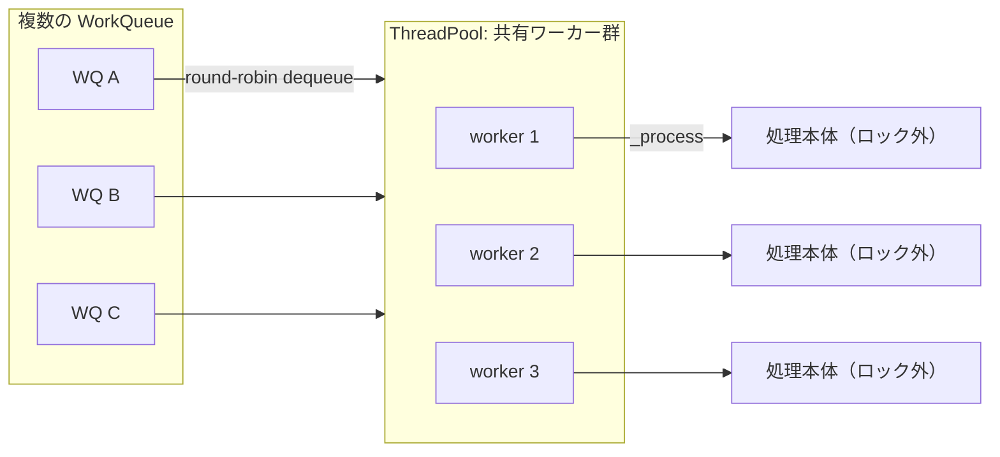
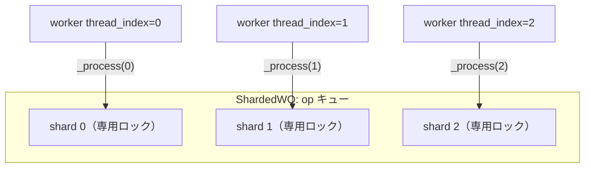
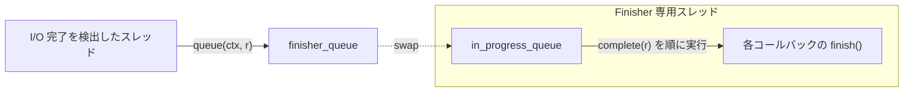

# 第3章 スレッド基盤（ShardedThreadPool・WorkQueue・Finisher・Throttle）

> **本章で読むソース**
>
> - [`src/common/WorkQueue.h`](https://github.com/ceph/ceph/blob/v20.2.2/src/common/WorkQueue.h)
> - [`src/common/WorkQueue.cc`](https://github.com/ceph/ceph/blob/v20.2.2/src/common/WorkQueue.cc)
> - [`src/common/Finisher.h`](https://github.com/ceph/ceph/blob/v20.2.2/src/common/Finisher.h)
> - [`src/common/Finisher.cc`](https://github.com/ceph/ceph/blob/v20.2.2/src/common/Finisher.cc)
> - [`src/common/Throttle.h`](https://github.com/ceph/ceph/blob/v20.2.2/src/common/Throttle.h)
> - [`src/common/Throttle.cc`](https://github.com/ceph/ceph/blob/v20.2.2/src/common/Throttle.cc)
> - [`src/include/Context.h`](https://github.com/ceph/ceph/blob/v20.2.2/src/include/Context.h)

## この章の狙い

Ceph の各デーモンは、ネットワーク受信、ディスク I/O、ピア間通信、バックグラウンドのスクラブといった性質の異なる仕事を、大量のスレッドで同時にこなす。
この並行性を無秩序なスレッド生成で実装すると、スレッド数が仕事の種類ぶんだけ増え、ロック競合と文脈切り替えでスループットが頭打ちになる。

Ceph はこれを、仕事の投入口と実行資源を分離する枠組みで解く。
仕事の種類ごとにキューを持つ「**WorkQueue**」と、それらを共有して処理するワーカースレッド群「**ThreadPool**」を分け、後者を使い回す。
本章では、この基本形と、OSD の op 処理が載る「**ShardedThreadPool**」、非同期完了コールバックを直列実行する「**Finisher**」、過負荷を防ぐ「**Throttle**」を、それぞれのワーカーループとバックプレッシャの機構まで読む。

## 前提

第2章で見た `Context`（コールバックの抽象）と `CephContext`（プロセス全体の設定とサービスの器）を前提とする。
コード引用は C++ を対象とし、ロックは `ceph::mutex`、条件変数は `ceph::condition_variable` を使う。
本章で「スリープ」と書くのは、スレッドが条件変数などで CPU を手放して待機する状態を指す。

## Context：非同期処理の基本単位

Ceph 全体の非同期処理は、`Context` という一つの抽象に集約される。
`Context` は完了時に呼ばれるコールバックを表す抽象クラスで、派生クラスが `finish(int r)` を実装する。

[`src/include/Context.h` L85-L104](https://github.com/ceph/ceph/blob/v20.2.2/src/include/Context.h#L85-L104)

```cpp
class Context {
  Context(const Context& other);
  const Context& operator=(const Context& other);

 protected:
  virtual void finish(int r) = 0;
  // ...
 public:
  Context() {}
  virtual ~Context() {}       // we want a virtual destructor!!!
  virtual void complete(int r) {
    finish(r);
    delete this;
  }
```

`complete(r)` は `finish(r)` を呼んでから自身を `delete` する。
呼び出し側は完了コールバックを `new` して各層に渡し、処理が終わった時点で誰かが `complete` を呼ぶ。
引数 `r` は処理結果（0 が成功、負値がエラーコード）を運ぶ。
この単純な契約が、以降で見る WorkQueue と Finisher に共通の「実行される仕事」の単位になる。

## ThreadPool と WorkQueue：投入口と実行資源の分離

`ThreadPool` は、複数の WorkQueue に投入された仕事を共有するワーカースレッド群である。

[`src/common/WorkQueue.h` L42-L54](https://github.com/ceph/ceph/blob/v20.2.2/src/common/WorkQueue.h#L42-L54)

```cpp
/// Pool of threads that share work submitted to multiple work queues.
class ThreadPool : public md_config_obs_t {
protected:
  CephContext *cct;
  std::string name;
  std::string thread_name;
  std::string lockname;
  ceph::mutex _lock;
  ceph::condition_variable _cond;
  bool _stop;
  int _pause;
  int _draining;
  ceph::condition_variable _wait_cond;
```

仕事を型付きで受けるのが `WorkQueue<T>` である。
利用側はこのテンプレートを継承し、`_enqueue`（投入）と `_dequeue`（取り出し）と `_process`（処理本体）を実装する。
`queue()` はプールのロックを取り、内部キューへ積んでから条件変数で待機中のワーカーを一つ起こす。

[`src/common/WorkQueue.h` L215-L259](https://github.com/ceph/ceph/blob/v20.2.2/src/common/WorkQueue.h#L215-L259)

```cpp
  template<class T>
  class WorkQueue : public WorkQueue_ {
    ThreadPool *pool;
    // ...
  public:
    WorkQueue(std::string n,
	      ceph::timespan ti, ceph::timespan sti,
	      ThreadPool* p)
      : WorkQueue_(std::move(n), ti, sti), pool(p) {
      pool->add_work_queue(this);
    }
    // ...
    bool queue(T *item) {
      pool->_lock.lock();
      bool r = _enqueue(item);
      pool->_cond.notify_one();
      pool->_lock.unlock();
      return r;
    }
```

構築時に `add_work_queue(this)` でプールへ自分を登録する点に注目したい。
一つの `ThreadPool` に複数の WorkQueue がぶら下がり、ワーカーは登録された全キューを見て回る。
これが「仕事の種類ごとにキューを分けつつ、実行スレッドは共有する」構造の要である。

### ワーカーのメインループ

ワーカースレッドの実体は `ThreadPool::worker` である。
停止フラグが立つまで、登録済みの WorkQueue を順に見て、取り出せた仕事を処理し続ける。

[`src/common/WorkQueue.cc` L84-L137](https://github.com/ceph/ceph/blob/v20.2.2/src/common/WorkQueue.cc#L84-L137)

```cpp
  while (!_stop) {
    // ... (中略：動的なスレッド数調整) ...
    } else if (!_pause) {
      WorkQueue_* wq;
      int tries = 2 * work_queues.size();
      bool did = false;
      while (tries--) {
	next_work_queue %= work_queues.size();
	wq = work_queues[next_work_queue++];

	void *item = wq->_void_dequeue();
	if (item) {
	  processing++;
	  // ...
	  ul.unlock();
	  TPHandle tp_handle(cct, hb, wq->timeout_interval.load(), wq->suicide_interval.load());
	  tp_handle.reset_tp_timeout();
	  wq->_void_process(item, tp_handle);
	  ul.lock();
	  wq->_void_process_finish(item);
	  processing--;
	  // ...
	  did = true;
	  break;
	}
      }
      if (did)
	continue;
    }
    // ... (中略) ...
    _cond.wait_for(ul, wait);
  }
```

ループは複数の WorkQueue を `next_work_queue` でラウンドロビンに走査し、最初に仕事を返したキューを処理する。
`_void_process(item, tp_handle)` を呼ぶ間はプールのロックを外す。
処理本体は並行に走ってよい部分なので、ここでロックを手放すことで、他のワーカーが別の仕事を並行して取り出せる。
仕事が一つも取れなければ `_cond.wait_for` で一定時間スリープし、`queue()` からの通知で起きる。

`tp_handle` はハートビート監視のためのハンドルである。
処理が長引いてタイムアウトを超えると、ヘルスチェック機構が当該スレッドの停滞を検出する。
処理の途中で `reset_tp_timeout()` を呼べば、正常に進行していることを監視側へ知らせられる。



## ShardedThreadPool：キューのシャード分割

`ThreadPool` の素朴な形には、単一のプールロック `_lock` がある。
`queue()` も `worker` も、キューへの出し入れのたびにこの一つのロックを取り合う。
ワーカー数と投入レートが上がるほど、このロックが競合の一点に化ける。

`ShardedThreadPool` はこれを、キューをシャードに分割して解く。
プール全体を統括するロックは持つが、仕事の取り出しはシャード単位のワーカーへ委ねる。

[`src/common/WorkQueue.h` L571-L610](https://github.com/ceph/ceph/blob/v20.2.2/src/common/WorkQueue.h#L571-L610)

```cpp
class ShardedThreadPool {

  CephContext *cct;
  // ...
  ceph::mutex shardedpool_lock;
  ceph::condition_variable shardedpool_cond;
  ceph::condition_variable wait_cond;
  uint32_t num_threads;

  std::atomic<bool> stop_threads = { false };
  std::atomic<bool> pause_threads = { false };
  std::atomic<bool> drain_threads = { false };
  // ...
  class BaseShardedWQ {
  public:
    // ...
    virtual void _process(uint32_t thread_index, ceph::heartbeat_handle_d *hb ) = 0;
    virtual void return_waiting_threads() = 0;
    virtual void stop_return_waiting_threads() = 0;
    virtual bool is_shard_empty(uint32_t thread_index) = 0;
```

鍵は `_process` が引数に `thread_index` を取ることである。
各ワーカースレッドには 0 から始まる通し番号が割り当てられ、その番号を自分の担当シャードとして扱う。
どのシャードから取り出すかの判断とロックは、`BaseShardedWQ` を継承した具体クラス（OSD の op キュー）の内部に閉じる。
プール側はスレッドの起動、停止、一時停止、ドレインといった生存管理だけを担う。

### シャードワーカーのループ

ワーカーの実体は `shardedthreadpool_worker(thread_index)` である。

[`src/common/WorkQueue.cc` L260-L308](https://github.com/ceph/ceph/blob/v20.2.2/src/common/WorkQueue.cc#L260-L308)

```cpp
void ShardedThreadPool::shardedthreadpool_worker(uint32_t thread_index)
{
  ceph_assert(wq != NULL);
  // ...
  while (!stop_threads) {
    if (pause_threads) {
      // ... (中略：一時停止のスリープ) ...
    }
    if (drain_threads) {
      // ... (中略：ドレインのスリープ) ...
    }

    cct->get_heartbeat_map()->reset_timeout(
	hb,
	wq->timeout_interval.load(),
	wq->suicide_interval.load());
	wq->_process(thread_index, hb);
  }
  // ...
}
```

ループ本体は自スレッドの番号を渡して `wq->_process(thread_index, hb)` を呼ぶだけである。
仕事の取り出しと、対応するシャードのロック取得は、その呼び先で `thread_index` を使って行われる。
その結果、あるシャードを触るのは基本的にそのシャード担当のワーカーだけになり、シャードごとのロックは別々に取り合える。



**このシャード分割が本章の最適化の工夫である。**
キューをシャードに割り、各シャードを専有スレッドが処理することで、単一プールロックへの競合をシャード数ぶんに分散させ、コア数に応じてスループットを伸ばせる。
OSD はこの `ShardedThreadPool` の上に op スケジューラを載せ、PG を複数シャードへ分けて並列に処理する（第11章）。

## Finisher：完了コールバックの直列実行

I/O の完了を、それを待つアプリロジックへ通知する経路が要る。
完了を検出したスレッド（多くはネットワークやディスクの割り込み文脈に近いスレッド）で、そのままコールバックを実行すると、コールバックが重いロックを取ったときにその文脈まで巻き込む。
`Finisher` は、実行すべき `Context` を専用スレッドのキューへ積み、そこで直列に実行することで、完了検出とコールバック実行を疎結合にする。

[`src/common/Finisher.h` L32-L47](https://github.com/ceph/ceph/blob/v20.2.2/src/common/Finisher.h#L32-L47)

```cpp
/** @brief Asynchronous cleanup class.
 * Finisher asynchronously completes Contexts, which are simple classes
 * representing callbacks, in a dedicated worker thread. Enqueuing
 * contexts to complete is thread-safe.
 */
class Finisher {
  CephContext *const cct;
  ceph::mutex finisher_lock; ///< Protects access to queues and finisher_running.
  ceph::condition_variable finisher_cond; ///< Signaled when there is something to process.
  // ...
  /// Queue for contexts for which complete(0) will be called.
  std::vector<std::pair<Context*,int>> finisher_queue;
  std::vector<std::pair<Context*,int>> in_progress_queue;
```

`queue(Context*, int r)` は `finisher_lock` を取り、`(コールバック, 結果)` の組をキューへ積む。
キューが空で、かつワーカーが実行中でないときだけ条件変数を鳴らす。

### Finisher のワーカーループ

専用スレッドの実体は `finisher_thread_entry` である。

[`src/common/Finisher.cc` L83-L129](https://github.com/ceph/ceph/blob/v20.2.2/src/common/Finisher.cc#L83-L129)

```cpp
void *Finisher::finisher_thread_entry()
{
  std::unique_lock ul(finisher_lock);
  // ...
  while (!finisher_stop) {
    /// Every time we are woken up, we process the queue until it is empty.
    while (!finisher_queue.empty()) {
      // To reduce lock contention, we swap out the queue to process.
      // This way other threads can submit new contexts to complete
      // while we are working.
      in_progress_queue.swap(finisher_queue);
      finisher_running = true;
      ul.unlock();
      // ...
      // Now actually process the contexts.
      for (auto p : in_progress_queue) {
	p.first->complete(p.second);
      }
      // ...
      in_progress_queue.clear();
      ul.lock();
      finisher_running = false;
    }
    // ...
    finisher_cond.wait(ul);
  }
```

ここに、もう一つの最適化がある。
ワーカーは処理を始める前に `in_progress_queue.swap(finisher_queue)` でキューを丸ごと入れ替え、ロックを外してから実行に入る。
実行の間、投入側は空になった `finisher_queue` へ新しいコールバックを積み続けられる。
コールバックを一つ実行するたびにロックを取り直すのではなく、まとめて一括で入れ替えることで、実行中のロック保持をなくしている。
各コールバックの `complete(r)` は、先に見たとおり `finish(r)` を呼んでから自身を破棄する。



`Context` を Finisher 経由で完了させたいときは、`C_OnFinisher` でくるむ。
これは `finish` の中で内側の `Context` を指定の Finisher へ積み直すだけのアダプタで、完了処理を別スレッドへ確実に逃がす（[`src/common/Finisher.h` L130-L150](https://github.com/ceph/ceph/blob/v20.2.2/src/common/Finisher.h#L130-L150)）。

## Throttle：バックプレッシャによる過負荷防止

投入を無制限に受け付けると、インフライトの操作数やバッファのメモリが際限なく積み上がる。
`Throttle` は、取得できる「スロット」の総数に上限を設け、上限を超える要求を出したスレッドをスリープさせる。
これにより、下流が捌ける速度に合わせて上流の投入を抑える、バックプレッシャが効く。

[`src/common/Throttle.h` L32-L54](https://github.com/ceph/ceph/blob/v20.2.2/src/common/Throttle.h#L32-L54)

```cpp
class Throttle final : public ThrottleInterface {
  CephContext *cct;
  const std::string name;
  PerfCountersRef logger;
  std::atomic<int64_t> count = { 0 }, max = { 0 };
  std::mutex lock;
  std::list<std::condition_variable> conds;
  const bool use_perf;
  // ...
private:
  void _reset_max(int64_t m);
  bool _should_wait(int64_t c) const {
    int64_t m = max;
    int64_t cur = count;
    return
      m &&
      ((c <= m && cur + c > m) || // normally stay under max
       (c >= m && cur > m));     // except for large c
  }
```

`count` が現在取られているスロット数、`max` が上限である。
`_should_wait(c)` は、上限が設定されていて（`m` が非ゼロ）、今 `c` 個を追加取得すると上限を超えるときに真を返す。
`c` が上限そのものより大きい特別な場合も、既に上限を超えている間は待つ。

### 待機と公平性

要求側は `get(c)` を呼ぶ。
`_wait(c, l)` で待ち条件を満たすまでスリープし、満たされたら `count += c` する。

[`src/common/Throttle.cc` L94-L121](https://github.com/ceph/ceph/blob/v20.2.2/src/common/Throttle.cc#L94-L121)

```cpp
bool Throttle::_wait(int64_t c, std::unique_lock<std::mutex>& l)
{
  mono_time start;
  bool waited = false;
  if (_should_wait(c) || !conds.empty()) { // always wait behind other waiters.
    {
      auto cv = conds.emplace(conds.end());
      auto w = make_scope_guard([this, cv]() {
	  conds.erase(cv);
	});
      waited = true;
      // ...
      cv->wait(l, [this, c, cv]() { return (!_should_wait(c) &&
					    cv == conds.begin()); });
      // ...
    }
    // wake up the next guy
    if (!conds.empty())
      conds.front().notify_one();
  }
  return waited;
}
```

ここに、待機の公平性の工夫がある。
待ち手はそれぞれ自分専用の条件変数を `conds` リストの末尾に追加し、その一つだけで待つ。
起床条件は「上限に余裕がある」ことに加えて「自分がリストの先頭である」ことを要求する。
先に並んだ待ち手から順に一つずつ起こす FIFO の待ち行列になり、単一条件変数の `notify_all` で全員が起きて奪い合う無駄と、後着が先着を追い越す不公平を避ける。
スロットが解放される `put(c)` は `count` を減らし、待ち行列の先頭を一つ起こす（[`src/common/Throttle.cc` L222-L251](https://github.com/ceph/ceph/blob/v20.2.2/src/common/Throttle.cc#L222-L251)）。

スリープしたくない経路のために `get_or_fail(c)` もある。
待つ代わりに、待ちが必要なら即座に false を返す非ブロッキング版で、キューの深さを超える投入をその場で拒否したい箇所で使う。

## Thread：薄い pthread ラッパー

これらのプールとキューが起動するスレッドの実体は、`Thread` クラスである。
`Thread` は POSIX スレッドを薄く覆うラッパーで、派生クラスが `entry()` を実装し、`create(name)` で起動する。

[`src/common/Thread.h` L33-L66](https://github.com/ceph/ceph/blob/v20.2.2/src/common/Thread.h#L33-L66)

```cpp
class Thread {
 private:
  pthread_t thread_id;
  pid_t pid;
  int cpuid;
  std::string thread_name;

  void *entry_wrapper();
 public:
  // ...
 protected:
  virtual void *entry() = 0;
  // ...
 public:
  void create(const char *name, size_t stacksize = 0);
  int join(void **prval = 0);
  int detach();
  int set_affinity(int cpuid);
};
```

`WorkThread`（`ThreadPool` 用）や `FinisherThread`（`Finisher` 用）は、いずれもこの `Thread` を継承し、`entry()` の中で各自のワーカーループを呼ぶ薄い橋渡しにすぎない。
スレッド名を渡せる点が運用上効き、`create(name)` がその名前を OS のスレッド名に設定するため、`top` などでどのプールのスレッドかを識別できる。

## まとめ

Ceph の並行性は、仕事の投入口（WorkQueue）と実行資源（ThreadPool のワーカー群）を分離し、後者を複数のキューで共有する構造を土台にする。
ワーカーのメインループは、登録された複数キューをラウンドロビンに走査し、処理本体の実行中はプールロックを外して並行実行を許す。
負荷の中心である OSD の op 処理には、キューをシャードへ分けて単一プールロックの競合を分散する `ShardedThreadPool` を使う。
非同期完了は `Context` を単位とし、`Finisher` が専用スレッドで直列実行して完了検出とコールバックを疎結合にする。
`Throttle` は取得スロットの上限とFIFOの待ち行列で、下流の処理速度に上流の投入を合わせるバックプレッシャを提供する。

## 関連する章

- 第2章「オブジェクトモデルとシリアライズ」で導入した `Context` と `CephContext` を本章の前提とした。
- 第4章「Messenger と AsyncConnection」は、受信処理の完了通知に本章の Finisher とスレッド基盤を使う。
- 第11章「OSD デーモンの構造と op スケジューリング」は、本章の `ShardedThreadPool` の上に op スケジューラを載せ、PG をシャードへ分けて並列処理する。
