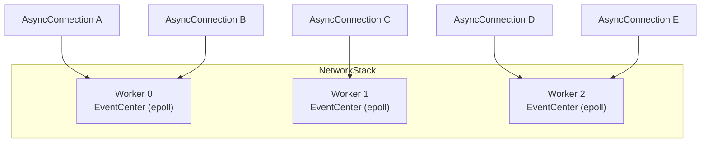
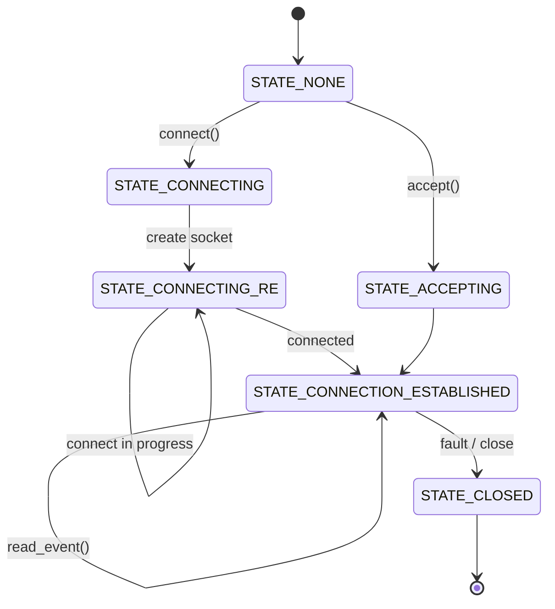
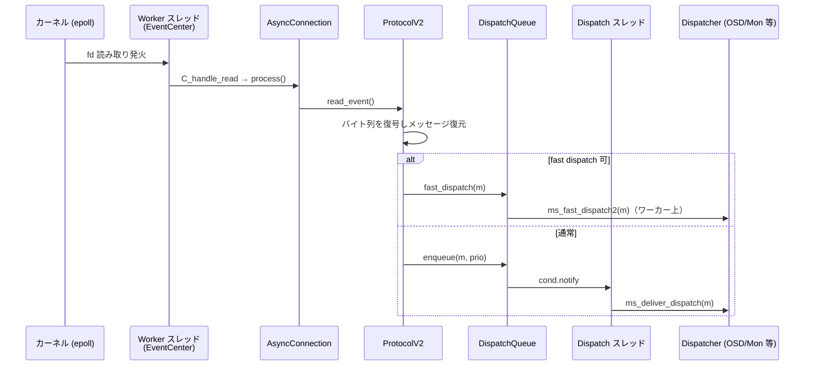

# 第4章 Messenger と AsyncConnection のイベント駆動 I/O

> **本章で読むソース**
>
> - [`src/msg/Messenger.h`](https://github.com/ceph/ceph/blob/v20.2.2/src/msg/Messenger.h)
> - [`src/msg/Dispatcher.h`](https://github.com/ceph/ceph/blob/v20.2.2/src/msg/Dispatcher.h)
> - [`src/msg/async/AsyncMessenger.cc`](https://github.com/ceph/ceph/blob/v20.2.2/src/msg/async/AsyncMessenger.cc)
> - [`src/msg/async/AsyncConnection.h`](https://github.com/ceph/ceph/blob/v20.2.2/src/msg/async/AsyncConnection.h)
> - [`src/msg/async/AsyncConnection.cc`](https://github.com/ceph/ceph/blob/v20.2.2/src/msg/async/AsyncConnection.cc)
> - [`src/msg/async/Event.h`](https://github.com/ceph/ceph/blob/v20.2.2/src/msg/async/Event.h)
> - [`src/msg/async/Event.cc`](https://github.com/ceph/ceph/blob/v20.2.2/src/msg/async/Event.cc)
> - [`src/msg/async/Stack.h`](https://github.com/ceph/ceph/blob/v20.2.2/src/msg/async/Stack.h)
> - [`src/msg/async/Stack.cc`](https://github.com/ceph/ceph/blob/v20.2.2/src/msg/async/Stack.cc)
> - [`src/msg/DispatchQueue.cc`](https://github.com/ceph/ceph/blob/v20.2.2/src/msg/DispatchQueue.cc)

## この章の狙い

Ceph の各デーモンは、他のデーモンやクライアントと大量のメッセージをやり取りしながら動く。
OSD は数百のピア OSD、Monitor、クライアントと同時に接続を張り、Monitor は全 OSD からの心拍とマップ購読をさばく。
この通信を接続ごとに専用スレッドで受けると、接続数だけスレッドが要り、文脈切り替えとメモリで破綻する。

Ceph はこれを、少数のワーカースレッドが epoll で多数の接続を多重化するイベント駆動モデルで解く。
本章では、送受信を抽象化する「**Messenger**」と受信側の実装インターフェース「**Dispatcher**」から入り、その本番実装である「**AsyncMessenger**」が「**NetworkStack**」のワーカー群と「**EventCenter**」の上でどう接続をさばくかを読む。
1本の接続を表す「**AsyncConnection**」の状態機械、`EventCenter` のイベントループ、受信メッセージが `DispatchQueue` を経て `Dispatcher` に届くまでの流れを追う。
バイト列とメッセージの相互変換を担う ProtocolV2 の詳細は第5章に委ね、本章は「接続をどのスレッドで、どう駆動するか」に絞る。

## 前提

第1章で見たデーモン構成と、用途別に複数の Messenger を持つ設計を前提とする。
第3章で見た `Context` とスレッドプールの考え方を下敷きにする。
本章で「スリープ」と書くのは、スレッドが条件変数や epoll でCPUを手放して待機する状態を指す。
コード引用は C++ を対象とする。

## Messenger と Dispatcher：送受信の抽象と受信の受け皿

`Messenger` は、あるデーモンにとってのメッセージ送受信口を抽象化した基底クラスである。
上位層（OSD、Monitor など）はこの型を通じてメッセージを送り、受信は後述の `Dispatcher` を登録して受ける。

[`src/msg/Messenger.h` L94-L106](https://github.com/ceph/ceph/blob/v20.2.2/src/msg/Messenger.h#L94-L106)

```cpp
class Messenger {
private:
  struct PriorityDispatcher {
    using priority_t = Dispatcher::priority_t;
    priority_t priority;
    Dispatcher* dispatcher;

    bool operator<(const PriorityDispatcher& other) const {
      return priority < other.priority;
    }
  };
  std::vector<PriorityDispatcher> dispatchers;
  std::vector<PriorityDispatcher> fast_dispatchers;
```

`Messenger` は登録された `Dispatcher` を優先度つきで2列に保持する。
通常の `dispatchers` と、後述する fast dispatch 用の `fast_dispatchers` である。
上位層は `add_dispatcher_head` や `add_dispatcher_tail` で自分を登録し、受信のたびにコールバックされる。

受信側が実装するインターフェースが `Dispatcher` である。
中心は `ms_dispatch` で、Messenger は受け取ったメッセージを登録順に各 `Dispatcher` へ渡し、処理したものが現れた時点で止める。

[`src/msg/Dispatcher.h` L124-L149](https://github.com/ceph/ceph/blob/v20.2.2/src/msg/Dispatcher.h#L124-L149)

```cpp
  virtual bool ms_dispatch(Message *m) {
    ceph_abort();
  }

  /* ms_dispatch2 because otherwise the child must define both */
  struct HANDLED {};
  struct UNHANDLED {};
  struct ACKNOWLEDGED {};
  typedef std::variant<bool, HANDLED, UNHANDLED, ACKNOWLEDGED> dispatch_result_t;
  // ... (中略) ...
  virtual dispatch_result_t ms_dispatch2(const MessageRef &m) {
```

戻り値の `HANDLED` は「自分が処理した」を、`UNHANDLED` は「次の Dispatcher へ回せ」を意味する。
Messenger 側の配送ループは、`HANDLED` を受けた時点で打ち切る。

[`src/msg/Messenger.h` L742-L758](https://github.com/ceph/ceph/blob/v20.2.2/src/msg/Messenger.h#L742-L758)

```cpp
  void ms_deliver_dispatch(const ceph::ref_t<Message> &m) {
    m->set_dispatch_stamp(ceph_clock_now());
    bool acked = false;
    for ([[maybe_unused]] const auto& [priority, dispatcher] : dispatchers) {
      auto r = Dispatcher::fold_dispatch_result(dispatcher->ms_dispatch2(m));
      if (std::holds_alternative<Dispatcher::HANDLED>(r)) {
        return;
      } else if (std::holds_alternative<Dispatcher::ACKNOWLEDGED>(r)) {
        acked = true;
      }
    }
    // ... (中略) ...
  }
```

Messenger と Dispatcher は抽象と受け皿だけを定める。
これ以降で見る `AsyncMessenger` が、この抽象を epoll ベースのイベント駆動で実装する本番の実体である。

## NetworkStack と Worker：ワーカーごとに epoll を1つ持つ

`AsyncMessenger` の並行モデルの土台が `NetworkStack` である。
`NetworkStack` は固定数の `Worker` を抱え、各 `Worker` は自分専用の `EventCenter`（epoll のラッパー）を1つ持つ。

[`src/msg/async/Stack.h` L239-L253](https://github.com/ceph/ceph/blob/v20.2.2/src/msg/async/Stack.h#L239-L253)

```cpp
class Worker {
  std::mutex init_lock;
  std::condition_variable init_cond;
  bool init = false;

 public:
  bool done = false;

  CephContext *cct;
  PerfCounters *perf_logger;
  PerfCounters *perf_labeled_logger;
  unsigned id;

  std::atomic_uint references;
  EventCenter center;
```

ワーカースレッドの本体は `NetworkStack::add_thread` が返すループである。
スレッドはひたすら自分の `EventCenter::process_events` を回し続ける。

[`src/msg/async/Stack.cc` L36-L60](https://github.com/ceph/ceph/blob/v20.2.2/src/msg/async/Stack.cc#L36-L60)

```cpp
std::function<void ()> NetworkStack::add_thread(Worker* w)
{
  return [this, w]() {
      rename_thread(w->id);
      const unsigned EventMaxWaitUs = 30000000;
      w->center.set_owner();
      // ...
      while (!w->done) {
        // ...
        ceph::timespan dur;
        int r = w->center.process_events(EventMaxWaitUs, &dur);
        // ...
      }
      w->reset();
      w->destroy();
  };
}
```

1つの接続は生成時にちょうど1つの `Worker` へ割り当てられ、その接続の読み書きは以後そのワーカースレッドだけが触る。
この「接続はワーカーに固定される」不変条件が、接続ごとのロックを最小化する。
新しい接続をどのワーカーに載せるかは `NetworkStack::get_worker` が決める。

[`src/msg/async/Stack.cc` L134-L157](https://github.com/ceph/ceph/blob/v20.2.2/src/msg/async/Stack.cc#L134-L157)

```cpp
   // start with some reasonably large number
  unsigned min_load = std::numeric_limits<int>::max();
  Worker* current_best = nullptr;

  pool_spin.lock();
  // find worker with least references
  // ...
  for (Worker* worker : workers) {
    unsigned worker_load = worker->references.load();
    if (worker_load < min_load) {
      current_best = worker;
      min_load = worker_load;
    }
  }

  pool_spin.unlock();
  ceph_assert(current_best);
  ++current_best->references;
  return current_best;
```

割り当ての基準は「担当接続数（`references`）が最も少ないワーカー」である。
新規接続をそこへ載せて `references` を増やすので、接続はワーカー間に平均化される。

ここに、この章の最適化の工夫がある。
接続ごとにスレッドを立てず、少数のワーカーそれぞれが1つの epoll で多数の接続を多重化し、接続を最小負荷のワーカーへ割り当てる。
接続数が増えてもスレッド数は `ms_async_op_threads` で決まる固定数のままなので、文脈切り替えとスタックメモリが接続数に比例して膨らむことを避けられる。



## EventCenter：ファイルイベントと時間イベントのループ

`EventCenter` は、epoll（Linux では `EventEpoll`）を薄く包み、ファイルディスクリプタのイベントと時間イベントを一括で回すループである。
ソケットへの関心を登録するのが `create_file_event` で、fd と関心マスク（読み取りと書き込み）に対してコールバックを結びつける。

[`src/msg/async/Event.cc` L227-L243](https://github.com/ceph/ceph/blob/v20.2.2/src/msg/async/Event.cc#L227-L243)

```cpp
int EventCenter::create_file_event(int fd, int mask, EventCallbackRef ctxt)
{
  ceph_assert(in_thread());
  int r = 0;
  if (fd >= nevent) {
    int new_size = nevent << 2;
    while (fd >= new_size)
      new_size <<= 2;
    // ...
    file_events.resize(new_size);
    nevent = new_size;
  }
```

先頭の `ceph_assert(in_thread())` が、`EventCenter` を操作できるのは所有ワーカースレッド自身に限ることを表明する。
別スレッドから接続を触りたいときは、後述の `submit_to` で所有ワーカーへ処理を送り込む。

ループ本体が `process_events` である。
epoll の `event_wait` で発火した fd を集め、それぞれのコールバックを呼び、続いて時間イベントと外部イベントを処理する。

[`src/msg/async/Event.cc` L392-L466](https://github.com/ceph/ceph/blob/v20.2.2/src/msg/async/Event.cc#L392-L466)

```cpp
int EventCenter::process_events(unsigned timeout_microseconds,  ceph::timespan *working_dur)
{
  // ...
  std::vector<FiredFileEvent> fired_events;
  numevents = driver->event_wait(fired_events, &tv);
  auto working_start = ceph::mono_clock::now();
  for (int event_id = 0; event_id < numevents; event_id++) {
    // ...
    if (event->mask & fired_events[event_id].mask & EVENT_READABLE) {
      rfired = 1;
      cb = event->read_cb;
      cb->do_request(fired_events[event_id].fd);
    }

    if (event->mask & fired_events[event_id].mask & EVENT_WRITABLE) {
      if (!rfired || event->read_cb != event->write_cb) {
        cb = event->write_cb;
        cb->do_request(fired_events[event_id].fd);
      }
    }
    // ...
  }

  if (trigger_time)
    numevents += process_time_events();
  // ...
}
```

`event_wait` の待ち時間は、直近の時間イベントの発火時刻から逆算して詰められる。
接続のタイムアウトや心拍の再送のような時刻起点の処理は、この時間イベントに乗る。
読み取りが発火したときに呼ばれる `read_cb` の実体が、接続側で登録した `C_handle_read` であり、その中で `AsyncConnection::process()` が走る。

別スレッドからの介入は `submit_to` を通す。
呼び出し元が対象ワーカーと同じスレッドなら即実行し、違えば外部イベントキューへ積んでワーカーに処理させる。

[`src/msg/async/Event.h` L247-L262](https://github.com/ceph/ceph/blob/v20.2.2/src/msg/async/Event.h#L247-L262)

```cpp
  void submit_to(int i, func &&f, bool always_async = false) {
    ceph_assert(i < MAX_EVENTCENTER && global_centers);
    EventCenter *c = global_centers->centers[i];
    ceph_assert(c);
    if (always_async) {
      C_submit_event<func> *event = new C_submit_event<func>(std::move(f), true);
      c->dispatch_event_external(event);
    } else if (c->in_thread()) {
      f();
      return;
    } else {
      C_submit_event<func> event(std::move(f), false);
      c->dispatch_event_external(&event);
      event.wait();
    }
  };
```

この仕組みにより、接続の状態はロックではなく「所有ワーカースレッド上で実行する」規律で守られる。
`process_events` の末尾で `external_events` を処理するのがこの外部投入の受け口である。

## 接続の受け入れ：Processor と add_accept

サーバー側の接続受け入れはリスニングソケットを持つ `Processor` が担う。
`Processor` はリスニング fd の読み取りイベントを `EventCenter` に登録しておき、着信が発火すると `accept()` が呼ばれる。

[`src/msg/async/AsyncMessenger.cc` L179-L209](https://github.com/ceph/ceph/blob/v20.2.2/src/msg/async/AsyncMessenger.cc#L179-L209)

```cpp
void Processor::accept()
{
  // ...
  for (auto& listen_socket : listen_sockets) {
    // ...
    while (true) {
      entity_addr_t addr;
      ConnectedSocket cli_socket;
      Worker *w = worker;
      if (!msgr->get_stack()->support_local_listen_table())
	w = msgr->get_stack()->get_worker();
      else
	++w->references;
      int r = listen_socket.accept(&cli_socket, opts, &addr, w);
      if (r == 0) {
        // ...
	msgr->add_accept(
	  w, std::move(cli_socket),
	  msgr->get_myaddrs().v[listen_socket.get_addr_slot()],
	  addr);
	accept_error_num = 0;
	continue;
      }
      // ...
    }
  }
}
```

`accept()` は受理したソケットを載せるワーカーを `get_worker()` で選び、そのワーカーを引き渡して `add_accept` を呼ぶ。
`add_accept` は `AsyncConnection` を生成し、割り当てられたワーカー `w` に紐づける。

[`src/msg/async/AsyncMessenger.cc` L826-L836](https://github.com/ceph/ceph/blob/v20.2.2/src/msg/async/AsyncMessenger.cc#L826-L836)

```cpp
void AsyncMessenger::add_accept(Worker *w, ConnectedSocket cli_socket,
				const entity_addr_t &listen_addr,
				const entity_addr_t &peer_addr)
{
  std::lock_guard l{lock};
  auto conn = ceph::make_ref<AsyncConnection>(cct, this, &dispatch_queue, w,
						listen_addr.is_msgr2(), false);
  conn->accept(std::move(cli_socket), listen_addr, peer_addr);
  accepting_conns.insert(conn);
  w->get_perf_counter()->inc(l_msgr_active_connections);
}
```

能動的に接続を張る場合も対称で、`AsyncMessenger::create_connect` が同じく `stack->get_worker()` でワーカーを選んで `AsyncConnection` を作る。
どちらの経路でも、生成された接続は1つのワーカーに固定される。

## AsyncConnection：ノンブロッキング接続の状態機械

`AsyncConnection` は1本の接続を表し、少数の状態を持つ状態機械として振る舞う。

[`src/msg/async/AsyncConnection.h` L153-L160](https://github.com/ceph/ceph/blob/v20.2.2/src/msg/async/AsyncConnection.h#L153-L160)

```cpp
  enum {
    STATE_NONE,
    STATE_CONNECTING,
    STATE_CONNECTING_RE,
    STATE_ACCEPTING,
    STATE_CONNECTION_ESTABLISHED,
    STATE_CLOSED
  };
```

ソケットの読み取りが発火するたびに呼ばれるのが `process()` である。
`process()` は現在の状態で分岐し、接続確立の途中ならその一歩を進め、確立後はプロトコル層の読み取りへ制御を渡す。

[`src/msg/async/AsyncConnection.cc` L383-L431](https://github.com/ceph/ceph/blob/v20.2.2/src/msg/async/AsyncConnection.cc#L383-L431)

```cpp
void AsyncConnection::process() {
  std::lock_guard<std::mutex> l(lock);
  last_active = ceph::coarse_mono_clock::now();
  recv_start_time = ceph::mono_clock::now();
  // ...
  switch (state) {
    // ...
    case STATE_CONNECTING: {
      ceph_assert(!policy.server);
      // ...
      ssize_t r = worker->connect(target_addr, opts, &cs);
      if (r < 0) {
        protocol->fault();
        return;
      }

      center->create_file_event(cs.fd(), EVENT_READABLE, read_handler);
      state = STATE_CONNECTING_RE;
    }
```

能動接続では、`worker->connect` でノンブロッキングにソケットを開き、そのソケットに読み取りイベントを登録して `STATE_CONNECTING_RE` へ進む。
`STATE_CONNECTING_RE` では `cs.is_connected()` で接続完了を確かめ、まだ進行中（戻り値0）なら書き込みイベントの発火を待って一旦戻る。
接続がまだ完了していないのに `process()` の中でスリープして待つことはせず、完了は次のイベントで再入して確かめる。
接続が確立すると `STATE_CONNECTION_ESTABLISHED` へ移り、末尾でプロトコル層の読み取りが駆動される。

[`src/msg/async/AsyncConnection.cc` L477-L497](https://github.com/ceph/ceph/blob/v20.2.2/src/msg/async/AsyncConnection.cc#L477-L497)

```cpp
    case STATE_CONNECTION_ESTABLISHED: {
      if (pendingReadLen) {
        ssize_t r = read(*pendingReadLen, read_buffer, readCallback);
        // ...
        return;
      }
      break;
    }
  }

  protocol->read_event();

  logger->tinc(l_msgr_running_recv_time,
               ceph::mono_clock::now() - recv_start_time);
}
```

受動接続（`STATE_ACCEPTING`）は、ソケットに読み取りイベントを登録してそのまま `STATE_CONNECTION_ESTABLISHED` へ進む。
確立後の `process()` は `protocol->read_event()` を呼び、ここから先のバナー交換、認証、メッセージ復号は `ProtocolV2` が担う。
その中身は第5章で扱う。

`process()` を発火させるコールバックが `C_handle_read` である。
これは接続生成時に読み取りハンドラとして作られ、`EventCenter` の `read_cb` に登録される。

[`src/msg/async/AsyncConnection.cc` L71-L79](https://github.com/ceph/ceph/blob/v20.2.2/src/msg/async/AsyncConnection.cc#L71-L79)

```cpp
class C_handle_read : public EventCallback {
  AsyncConnectionRef conn;

 public:
  explicit C_handle_read(AsyncConnectionRef c): conn(c) {}
  void do_request(uint64_t fd_or_id) override {
    conn->process();
  }
};
```

状態遷移をまとめると次のようになる。
図には、実行経路で実際に到達する状態だけを描く（`STATE_NONE` は初期値、`STATE_CLOSED` は終端である）。



## 受信からディスパッチへ：DispatchQueue の二段構え

プロトコル層が1つのメッセージを復号し終えると、それを上位へ渡す。
渡し口が `DispatchQueue` で、ここに二つの経路がある。
遅延に敏感で軽い処理はワーカースレッド上でそのまま実行する fast dispatch、それ以外は専用スレッドへ積むキュー経路である。

[`src/msg/DispatchQueue.cc` L66-L74](https://github.com/ceph/ceph/blob/v20.2.2/src/msg/DispatchQueue.cc#L66-L74)

```cpp
bool DispatchQueue::can_fast_dispatch(const cref_t<Message> &m) const
{
  return msgr->ms_can_fast_dispatch(m);
}

void DispatchQueue::fast_dispatch(const ref_t<Message>& m)
{
  msgr->ms_fast_dispatch(m);
}
```

fast dispatch は `fast_dispatchers` の中から処理できる Dispatcher を探し、その `ms_fast_dispatch2` を呼び出し側スレッド上で直接呼ぶ。

[`src/msg/Messenger.h` L714-L724](https://github.com/ceph/ceph/blob/v20.2.2/src/msg/Messenger.h#L714-L724)

```cpp
  void ms_fast_dispatch(const ceph::ref_t<Message> &m) {
    m->set_dispatch_stamp(ceph_clock_now());
    for ([[maybe_unused]] const auto& [priority, dispatcher] : fast_dispatchers) {
      if (dispatcher->ms_can_fast_dispatch2(m)) {
        dispatcher->ms_fast_dispatch2(m);
        return;
      }
    }
    ceph_abort();
  }
```

fast dispatch に載らないメッセージは `enqueue` で優先度つきキューに積まれる。
優先度が `CEPH_MSG_PRIO_LOW` 以上なら厳格な優先度キューへ、それ未満なら重み付き公平キューへ入れて、専用ディスパッチスレッドを起こす。

[`src/msg/DispatchQueue.cc` L83-L98](https://github.com/ceph/ceph/blob/v20.2.2/src/msg/DispatchQueue.cc#L83-L98)

```cpp
void DispatchQueue::enqueue(const ref_t<Message>& m, int priority, uint64_t id)
{
  std::lock_guard l{lock};
  if (stop) {
    return;
  }
  ldout(cct,20) << "queue " << m << " prio " << priority << dendl;
  QueueItem item{m};
  add_arrival(item);
  if (priority >= CEPH_MSG_PRIO_LOW) {
    mqueue.enqueue_strict(id, priority, std::move(item));
  } else {
    mqueue.enqueue(id, priority, m->get_cost(), std::move(item));
  }
  cond.notify_one();
}
```

積まれたメッセージを実際に配送するのが `DispatchQueue::entry`、すなわちディスパッチスレッドの本体である。
キューから優先度順に取り出し、メッセージなら `ms_deliver_dispatch` で `Dispatcher` へ配送する。

[`src/msg/DispatchQueue.cc` L196-L204](https://github.com/ceph/ceph/blob/v20.2.2/src/msg/DispatchQueue.cc#L196-L204)

```cpp
      } else {
	const ref_t<Message>& m = qitem.get_message();
	if (stop) {
	  ldout(cct,10) << " stop flag set, discarding " << m << " " << *m << dendl;
	} else {
	  uint64_t msize = pre_dispatch(m);
	  msgr->ms_deliver_dispatch(m);
	  post_dispatch(m, msize);
	}
      }
```

この二段構えの狙いは、I/O ワーカースレッドを配送処理でスリープさせない点にある。
重い処理をワーカー上で同期実行すると、その間そのワーカーが担当する他の接続のイベントが待たされる。
配送を別スレッドのキューへ逃がすことで、ワーカーは epoll ループへ素早く戻り、多数の接続の多重化を保てる。
一方、遅延が致命的で処理が軽いメッセージ（たとえば心拍）は、キューの往復を省いてワーカー上で即処理する。

受信からディスパッチまでの流れを示す。



## まとめ

`Messenger` は送受信の抽象、`Dispatcher` は受信の受け皿を定め、上位デーモンはこの2つの契約でネットワークから切り離される。
本番実装の `AsyncMessenger` は、`NetworkStack` の固定数ワーカーそれぞれに epoll をラップした `EventCenter` を1つ持たせ、接続を最小負荷ワーカーへ割り当てて固定する。
各接続は `AsyncConnection` の状態機械としてノンブロッキングに確立と読み書きを進め、状態遷移は epoll のイベント再入で駆動する。
受信メッセージは `DispatchQueue` の二段構え（ワーカー上の fast dispatch と専用スレッドのキュー）を経て `Dispatcher` に届く。
少数スレッドで多数接続をさばく設計と、配送でワーカーを止めないキュー分離が、この層の効率を支えている。

## 関連する章

- 第1章「Ceph/RADOS のアーキテクチャとデーモン起動」：用途別に複数の Messenger を持つデーモン構成の全体像。
- 第3章「スレッド基盤」：`Context` とスレッドプール、ディスパッチスレッドが載る並行基盤。
- 第5章「ProtocolV2 とワイヤーフォーマット」：`AsyncConnection` が確立後に駆動するプロトコル層の中身。
- 第9章「Monitor と Paxos によるマップの合意」：`Dispatcher` を実装してメッセージを受ける上位層の一例。
