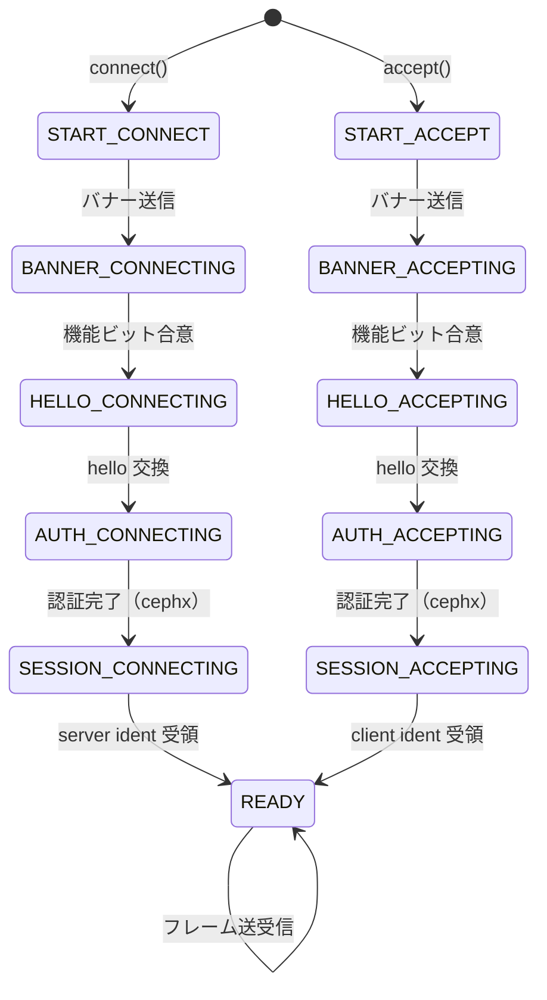
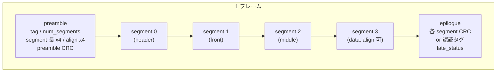

# 第5章 ProtocolV2 とワイヤーフォーマット

> **本章で読むソース**
>
> - [`src/msg/async/ProtocolV2.h`](https://github.com/ceph/ceph/blob/v20.2.2/src/msg/async/ProtocolV2.h)
> - [`src/msg/async/ProtocolV2.cc`](https://github.com/ceph/ceph/blob/v20.2.2/src/msg/async/ProtocolV2.cc)
> - [`src/msg/async/frames_v2.h`](https://github.com/ceph/ceph/blob/v20.2.2/src/msg/async/frames_v2.h)
> - [`src/msg/async/frames_v2.cc`](https://github.com/ceph/ceph/blob/v20.2.2/src/msg/async/frames_v2.cc)
> - [`src/msg/async/crypto_onwire.h`](https://github.com/ceph/ceph/blob/v20.2.2/src/msg/async/crypto_onwire.h)
> - [`src/include/msgr.h`](https://github.com/ceph/ceph/blob/v20.2.2/src/include/msgr.h)

## この章の狙い

第4章では、TCP ソケットの読み書きをイベントループに載せる `AsyncConnection` を読んだ。
その上で実際に「何をどんなバイト列で送るか」を決めるのが、msgr2 と呼ばれるワイヤープロトコルである。
Ceph 20.2.2 のデーモン間通信は、既定でこの msgr2 を話す。

msgr2 は二つの層からなる。
一つは、接続を開いてから相手と能力を合意し、認証を通してセッションを確立するまでの手順を進める状態機械であり、`ProtocolV2` がこれを実装する。
もう一つは、確立後にメッセージや制御情報を運ぶ「**フレーム**」のバイト形式であり、`ceph::msgr::v2::FrameAssembler` がこれを組み立てる。
本章では、接続確立の状態遷移と、フレームがどの単位に分かれ、どこで完全性が検証されるかを読む。
cephx による鍵交換そのものは第6章に譲り、本章は認証層とプロトコル層の接続点までを扱う。

## 前提

第4章の `AsyncConnection`（ソケットとイベント登録の管理）と、第2章の `bufferlist`・`encode`/`decode` を前提とする。
`ProtocolV2` は `Protocol` を継承し、`connect()`・`accept()`・`read_event()` などの仮想関数で `AsyncConnection` から駆動される。
本章で「フレーム」と書くときは msgr2 の転送単位を指し、その中に載る `Message`（第4章で見たディスパッチ対象）とは区別する。

## msgr2 の位置づけと旧 ProtocolV1 との違い

msgr2 は、接続の冒頭でまず固定のバナー文字列を交換する。
バナーの先頭は `include/msgr.h` で定義された定数である。

[`src/include/msgr.h` L38](https://github.com/ceph/ceph/blob/v20.2.2/src/include/msgr.h#L38)

```c
#define CEPH_BANNER_V2_PREFIX "ceph v2\n"
```

このプレフィックスに続けて、各ピアが対応する機能ビットと必須機能ビットを送り合う。
機能ビットは同じヘッダで定義され、msgr2.1 への切り替え（`REVISION_1`）とオンワイヤ圧縮（`COMPRESSION`）が並ぶ。

[`src/include/msgr.h` L53-L64](https://github.com/ceph/ceph/blob/v20.2.2/src/include/msgr.h#L53-L64)

```c
DEFINE_MSGR2_FEATURE(0, 1, REVISION_1)   // msgr2.1
DEFINE_MSGR2_FEATURE(1, 1, COMPRESSION)  // on-wire compression

/*
 * Features supported.  Should be everything above.
 */
#define CEPH_MSGR2_SUPPORTED_FEATURES \
	(CEPH_MSGR2_FEATURE_REVISION_1 | \
	 CEPH_MSGR2_FEATURE_COMPRESSION | \
	 0ULL)

#define CEPH_MSGR2_REQUIRED_FEATURES (0ULL)
```

旧 ProtocolV1 との違いは、認証と暗号化を最初から組み込んだ点にある。
ProtocolV1 では平文ヘッダを固定形式で流していたが、msgr2 は認証フェーズを済ませてからでないとメッセージを流さない。
認証結果として得た鍵を使えば、以降のフレームを暗号化する「secure モード」に入れる。
バナー段階で相手が V1 のバナーを送ってきたことは検出され、そのまま切断される。

[`src/msg/async/ProtocolV2.cc` L916-L924](https://github.com/ceph/ceph/blob/v20.2.2/src/msg/async/ProtocolV2.cc#L916-L924)

```cpp
  if (memcmp(buffer->c_str(), CEPH_BANNER_V2_PREFIX, banner_prefix_len)) {
    if (memcmp(buffer->c_str(), CEPH_BANNER, strlen(CEPH_BANNER)) == 0) {
      lderr(cct) << __func__ << " peer " << *connection->peer_addrs
                 << " is using msgr V1 protocol" << dendl;
      return _fault();
    }
    ldout(cct, 1) << __func__ << " accept peer sent bad banner" << dendl;
    return _fault();
  }
```

## 状態機械とコンティニュエーション

`ProtocolV2` は自身の進行を `State` の enum で持つ。
接続を開始する側は `connect()` で `START_CONNECT` に入り、受け入れる側は `accept()` で `START_ACCEPT` に入る。

[`src/msg/async/ProtocolV2.cc` L110-L119](https://github.com/ceph/ceph/blob/v20.2.2/src/msg/async/ProtocolV2.cc#L110-L119)

```cpp
void ProtocolV2::connect() {
  ldout(cct, 1) << __func__ << dendl;
  state = START_CONNECT;
  pre_auth.enabled = true;
}

void ProtocolV2::accept() {
  ldout(cct, 1) << __func__ << dendl;
  state = START_ACCEPT;
}
```

各ステップは `Ct<ProtocolV2>`（コンティニュエーション）を返す関数として書かれ、`run_continuation` がそれを実行する。
非同期の読み書きは「この長さを読めたら次はこの関数へ」という形で、次に走る関数をコンティニュエーションとして登録する。
ソケットからのデータ到着でイベントループが `read_event()` を呼ぶと、現在の状態に応じたコンティニュエーションが再開される。

[`src/msg/async/ProtocolV2.cc` L47-L60](https://github.com/ceph/ceph/blob/v20.2.2/src/msg/async/ProtocolV2.cc#L47-L60)

```cpp
void ProtocolV2::run_continuation(CtRef continuation) {
  try {
    CONTINUATION_RUN(continuation)
  } catch (const ceph::buffer::error &e) {
    lderr(cct) << __func__ << " failed decoding of frame header: " << e.what()
               << dendl;
    _fault();
  } catch (const ceph::crypto::onwire::MsgAuthError &e) {
    lderr(cct) << __func__ << " " << e.what() << dendl;
    _fault();
  } catch (const DecryptionError &) {
    lderr(cct) << __func__ << " failed to decrypt frame payload" << dendl;
  }
```

フレームのデコード失敗、署名の不一致、復号の失敗は、いずれもここで例外として捕捉される。
デコード側は例外を投げるだけでよく、各ステップ関数がエラー分岐を書かなくてよい構造になっている。

接続確立で実際に通る状態は次のように遷移する。
enum には `THROTTLE_*` や `STANDBY` などの値もあるが、下図は確立フェーズで通る経路に絞る。



## バナー交換と機能ビットの合意

バナー交換は `_banner_exchange` から始まる。
プレフィックスに続けて、対応機能ビットと必須機能ビットを `bufferlist` に符号化して送る。

[`src/msg/async/ProtocolV2.cc` L885-L897](https://github.com/ceph/ceph/blob/v20.2.2/src/msg/async/ProtocolV2.cc#L885-L897)

```cpp
  ceph::bufferlist banner_payload;
  using ceph::encode;
  encode((uint64_t)CEPH_MSGR2_SUPPORTED_FEATURES, banner_payload, 0);
  encode((uint64_t)CEPH_MSGR2_REQUIRED_FEATURES, banner_payload, 0);

  ceph::bufferlist bl;
  bl.append(CEPH_BANNER_V2_PREFIX, strlen(CEPH_BANNER_V2_PREFIX));
  encode((uint16_t)banner_payload.length(), bl, 0);
  bl.claim_append(banner_payload);

  INTERCEPT(state == BANNER_CONNECTING ? 3 : 4);

  return WRITE(bl, "banner", _wait_for_peer_banner);
```

相手のバナーペイロードを受け取ると、双方の必須機能が満たされているかを検査する。
自分の必須機能を相手が対応していない、あるいは相手の必須機能を自分が対応していない場合は、接続を閉じてリセットを通知する。

[`src/msg/async/ProtocolV2.cc` L978-L994](https://github.com/ceph/ceph/blob/v20.2.2/src/msg/async/ProtocolV2.cc#L978-L994)

```cpp
  if ((required_features & peer_supported_features) != required_features) {
    ldout(cct, 1) << __func__ << " peer does not support all required features"
                  << " required=" << std::hex << required_features
                  << " supported=" << std::hex << peer_supported_features
                  << std::dec << dendl;
    stop();
    connection->dispatch_queue->queue_reset(connection);
    return nullptr;
  }
```

検査を通ると、相手が `REVISION_1`（msgr2.1）に対応していれば送受信の `FrameAssembler` をその版に切り替える。
以後のフレーム形式は、この時点で確定した rev0（msgr2.0）か rev1（msgr2.1）かで分岐する。

[`src/msg/async/ProtocolV2.cc` L1001-L1004](https://github.com/ceph/ceph/blob/v20.2.2/src/msg/async/ProtocolV2.cc#L1001-L1004)

```cpp
  // if the peer supports msgr2.1, switch to it
  bool is_rev1 = HAVE_MSGR2_FEATURE(peer_supported_features, REVISION_1);
  tx_frame_asm.set_is_rev1(is_rev1);
  rx_frame_asm.set_is_rev1(is_rev1);
```

機能合意の直後に `HelloFrame` を送り、状態は `HELLO_CONNECTING` または `HELLO_ACCEPTING` へ進む。
ここまでは平文であり、ここから先が認証フェーズになる。

## 認証層との接続点

hello 交換を終えた接続側は `AUTH_CONNECTING` に入り、認証リクエストを送る。

[`src/msg/async/ProtocolV2.cc` L1745-L1751](https://github.com/ceph/ceph/blob/v20.2.2/src/msg/async/ProtocolV2.cc#L1745-L1751)

```cpp
CtPtr ProtocolV2::post_client_banner_exchange() {
  ldout(cct, 20) << __func__ << dendl;

  state = AUTH_CONNECTING;

  return send_auth_request();
}
```

認証方式の選択や鍵導出そのものは `messenger->auth_client`（cephx の実装）に委ねられ、`ProtocolV2` はフレームの往復だけを担う。
認証が完了すると、そこで得た `session_key` や `connection_secret` を使って、オンワイヤ暗号化のハンドラ対を生成する。

[`src/msg/async/ProtocolV2.cc` L1881-L1884](https://github.com/ceph/ceph/blob/v20.2.2/src/msg/async/ProtocolV2.cc#L1881-L1884)

```cpp
  auth_meta->con_mode = auth_done.con_mode();
  bool is_rev1 = HAVE_MSGR2_FEATURE(peer_supported_features, REVISION_1);
  session_stream_handlers = ceph::crypto::onwire::rxtx_t::create_handler_pair(
      cct, *auth_meta, /*new_nonce_format=*/is_rev1, /*crossed=*/false);
```

`session_stream_handlers` は送信用の `TxHandler` と受信用の `RxHandler` の対である。
このハンドラが存在し、その `rx` がセットされていれば、以降のフレームは secure モード（暗号化つき）で組み立てられ、分解される。

[`src/msg/async/crypto_onwire.h` L119-L131](https://github.com/ceph/ceph/blob/v20.2.2/src/msg/async/crypto_onwire.h#L119-L131)

```cpp
struct rxtx_t {
  //rxtx_t(rxtx_t&& r) : rx(std::move(rx)), tx(std::move(tx)) {}
  // Each peer can use different handlers.
  // Hmm, isn't that too much flexbility?
  std::unique_ptr<RxHandler> rx;
  std::unique_ptr<TxHandler> tx;

  static rxtx_t create_handler_pair(
    CephContext* ctx,
    const class AuthConnectionMeta& auth_meta,
    bool new_nonce_format,
    bool crossed);
};
```

認証成功後、クライアントは自分の識別情報（ident）を送り、サーバの ident を受け取ると `ready()` を呼んでセッションを確立する。
cephx がどうやって鍵を配り、この `auth_meta` を満たすかは第6章で読む。

## フレーム形式

セッション確立後に流れるのはすべてフレームである。
1フレームは、先頭の「**preamble**」、1個から4個の「**segment**」、末尾の「**epilogue**」からなる。
segment の役割は `SegmentIndex` で決まっており、メッセージフレームでは header・front・middle・data の4区画に対応する。

[`src/msg/async/frames_v2.h` L81-L96](https://github.com/ceph/ceph/blob/v20.2.2/src/msg/async/frames_v2.h#L81-L96)

```cpp
struct SegmentIndex {
  struct Msg {
    static constexpr std::size_t HEADER = 0;
    static constexpr std::size_t FRONT = 1;
    static constexpr std::size_t MIDDLE = 2;
    static constexpr std::size_t DATA = 3;
  };

  struct Control {
    static constexpr std::size_t PAYLOAD = 0;
  };
};

static constexpr uint8_t CRYPTO_BLOCK_SIZE { 16 };

static constexpr std::size_t MAX_NUM_SEGMENTS = 4;
```

preamble は、タグ（フレーム種別）と segment ごとの長さ・アラインメントを収める固定長ブロックであり、自分自身の CRC を末尾に持つ。

[`src/msg/async/frames_v2.h` L103-L121](https://github.com/ceph/ceph/blob/v20.2.2/src/msg/async/frames_v2.h#L103-L121)

```cpp
struct preamble_block_t {  
  // Tag. For multi-segmented frames the value is the same
  // between subsequent preamble blocks.
  __u8 tag;

  // Number of segments to go in entire frame. First preable block has
  // set this to just #segments, second #segments - MAX_NUM_SEGMENTS,
  // third to #segments - MAX_NUM_SEGMENTS and so on.
  __u8 num_segments;

  segment_t segments[MAX_NUM_SEGMENTS];

  __u8 flags;
  __u8 _reserved;

  // CRC32 for this single preamble block.
  ceph_le32 crc;
} __attribute__((packed));
```

各 segment 記述子は、長さとアラインメントの2フィールドだけを持つ。
アラインメントを preamble に持たせることで、受信側は data segment を要求どおりの境界にそろえて確保できる。

[`src/msg/async/frames_v2.h` L70-L79](https://github.com/ceph/ceph/blob/v20.2.2/src/msg/async/frames_v2.h#L70-L79)

```cpp
struct segment_t {
  // TODO: this will be dropped with support for `allocation policies`.
  // We need them because of the rx_buffers zero-copy optimization.
  static constexpr __u16 PAGE_SIZE_ALIGNMENT = 4096;

  static constexpr __u16 DEFAULT_ALIGNMENT = sizeof(void *);

  ceph_le32 length;
  ceph_le16 alignment;
} __attribute__((packed));
```

epilogue は、CRC モードか secure モードか、そして msgr2.0 か msgr2.1 かで4通りある。
CRC モードの epilogue は各 segment の CRC32C を並べ、secure モードの epilogue は末尾に認証タグ（AES-128-GCM の16バイトタグ）を持つ。
フレーム全体のバイトレイアウトは次のようになる。



## フレームの組み立てと分解

送信側の `assemble_frame` は、渡された segment 群から記述子を作り、preamble を埋め、モードに応じた形式でフレームを組む。
圧縮が有効なら segment を圧縮し、secure モードなら各 segment を暗号ブロック境界へゼロ詰めしてから暗号化する。

[`src/msg/async/frames_v2.cc` L247-L271](https://github.com/ceph/ceph/blob/v20.2.2/src/msg/async/frames_v2.cc#L247-L271)

```cpp
  preamble_block_t preamble;
  fill_preamble(tag, preamble);

  if (m_crypto->rx) {
    for (size_t i = 0; i < m_descs.size(); i++) {
      ceph_assert(segment_bls[i].length() == m_descs[i].logical_len);
      // We're padding segments to biggest cipher's block size. Although
      // AES-GCM can live without that as it's a stream cipher, we don't
      // want to be fixed to stream ciphers only.
      uint32_t padded_len = get_segment_padded_len(i);
      if (padded_len > segment_bls[i].length()) {
        uint32_t pad_len = padded_len - segment_bls[i].length();
        segment_bls[i].reserve(pad_len);
        segment_bls[i].append_zero(pad_len);
      }
    }
    if (m_is_rev1) {
      return asm_secure_rev1(preamble, segment_bls);
    }
    return asm_secure_rev0(preamble, segment_bls);
  }
```

受信側はまず preamble だけを読み、`disassemble_preamble` で検査する。
このとき、後続の segment を読む前に preamble 自身の CRC を照合する。
CRC が合わなければ `FrameError` を投げ、segment の読み込みには進まない。

[`src/msg/async/frames_v2.cc` L293-L311](https://github.com/ceph/ceph/blob/v20.2.2/src/msg/async/frames_v2.cc#L293-L311)

```cpp
  // check preamble crc before any further processing
  uint32_t crc = ceph_crc32c(
      0, reinterpret_cast<const unsigned char*>(preamble),
      sizeof(*preamble) - sizeof(preamble->crc));
  if (crc != preamble->crc) {
    throw FrameError(fmt::format(
        "bad preamble crc calculated={} expected={}", crc, (uint32_t)preamble->crc));
  }

  // see calc_num_segments()
  if (preamble->num_segments < 1 ||
      preamble->num_segments > MAX_NUM_SEGMENTS) {
    throw FrameError(fmt::format(
        "bad number of segments num_segments={}", preamble->num_segments));
  }
```

preamble から segment の長さとアラインメントが分かると、`ProtocolV2` は各 segment ぶんの受信バッファを、要求されたアラインメントで確保して読み込む。

[`src/msg/async/ProtocolV2.cc` L1226-L1240](https://github.com/ceph/ceph/blob/v20.2.2/src/msg/async/ProtocolV2.cc#L1226-L1240)

```cpp
  rx_buffer_t rx_buffer;
  uint16_t align = rx_frame_asm.get_segment_align(seg_idx);
  try {
    rx_buffer = ceph::buffer::ptr_node::create(ceph::buffer::create_aligned(
        onwire_len, align));
  } catch (const ceph::buffer::bad_alloc&) {
    // Catching because of potential issues with satisfying alignment.
    ldout(cct, 1) << __func__ << " can't allocate aligned rx_buffer"
                  << " len=" << onwire_len
                  << " align=" << align
                  << dendl;
    return _fault();
  }

  return READ_RXBUF(std::move(rx_buffer), handle_read_frame_segment);
```

全 segment を読み終えると epilogue を読み、`disassemble_segments` で残りの完全性を検証する。
CRC モードなら各 segment の CRC を照合し、secure モードなら認証タグで復号と改竄検出を行う。
検証が通ったフレームだけが `handle_read_frame_dispatch` へ渡され、タグに応じたハンドラに配られる。

[`src/msg/async/ProtocolV2.cc` L1374-L1394](https://github.com/ceph/ceph/blob/v20.2.2/src/msg/async/ProtocolV2.cc#L1374-L1394)

```cpp
CtPtr ProtocolV2::_handle_read_frame_epilogue_main() {
  bool ok = false;
  try {
    ok = rx_frame_asm.disassemble_segments(rx_preamble, rx_segments_data.data(), rx_epilogue);
  } catch (FrameError& e) {
    ldout(cct, 1) << __func__ << " " << e.what() << dendl;
    return _fault();
  } catch (ceph::crypto::onwire::MsgAuthError&) {
    ldout(cct, 1) << __func__ << "bad auth tag" << dendl;
    return _fault();
  }
```

タグ `MESSAGE` のフレームだけは、preamble を読んだ段階で `Throttle`（第3章）を通し、メモリ使用量を抑えてから segment 本体を読む。
制御用フレーム（認証や ident など）はスロットルを介さず、そのまま payload ハンドラへ進む。

[`src/msg/async/ProtocolV2.cc` L1162-L1173](https://github.com/ceph/ceph/blob/v20.2.2/src/msg/async/ProtocolV2.cc#L1162-L1173)

```cpp
  // does it need throttle?
  if (next_tag == Tag::MESSAGE) {
    if (state != READY) {
      lderr(cct) << __func__ << " not in ready state!" << dendl;
      return _fault();
    }
    recv_stamp = ceph_clock_now();
    state = THROTTLE_MESSAGE;
    return CONTINUE(throttle_message);
  } else {
    return read_frame_segment();
  }
```

## 高速化・堅牢性の工夫

preamble に segment ごとのアラインメントを持たせる設計が、大きな data segment のゼロコピー受信を成立させている。
受信側は本体を読み始める前に「data segment は 4096 バイト境界に置きたい」といった要求を preamble から知り、その境界で確保したバッファへソケットから直接読み込む。
そのため、いったん任意位置のバッファに受けてから境界へコピーし直す手間がなく、`bufferlist` を BlueStore などの下位層へそのまま渡せる。
segment ごとに独立した長さとアラインメントを持てる構造が、この受信時ゼロコピーの前提になっている。

完全性検証を二段階に分けた点も、この構造の効果である。
preamble はそれ自身の CRC を持ち、segment を1バイトも読む前に検証される。
長さフィールドが壊れたフレームで巨大なバッファを確保してしまう事態を、本体読み込みの前に弾ける。

## まとめ

msgr2 は、バナーで機能ビットを合意し、hello を交わし、cephx で認証してからセッションを確立する状態機械（`ProtocolV2`）と、確立後に流れるフレーム形式（`FrameAssembler`）の二層からなる。
フレームは preamble・複数 segment・epilogue に分かれ、preamble に各 segment の長さとアラインメントを、epilogue に CRC もしくは認証タグを収める。
このレイアウトにより、preamble を先に検証してから本体を境界そろえのバッファへゼロコピーで読み込める。
本章では認証層との接続点までを読み、鍵交換の中身は次章に残した。

## 関連する章

- [第4章 Messenger と AsyncConnection のイベント駆動 I/O](04-messenger.md)：本章の状態機械を駆動するソケット層とイベントループ。
- [第6章 cephx 認証](06-cephx.md)：本章で `auth_client` に委ねた認証方式の選択と鍵導出の中身。
