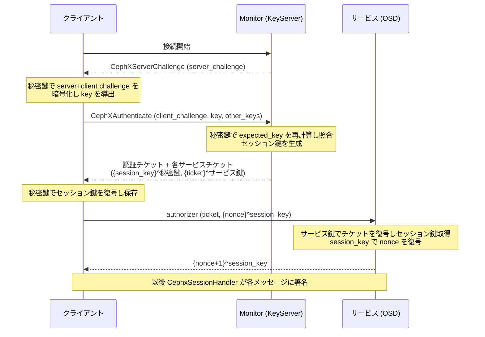

# 第6章 cephx 認証

> **本章で読むソース**
>
> - [`src/auth/Auth.h`](https://github.com/ceph/ceph/blob/v20.2.2/src/auth/Auth.h)
> - [`src/auth/cephx/CephxProtocol.h`](https://github.com/ceph/ceph/blob/v20.2.2/src/auth/cephx/CephxProtocol.h)
> - [`src/auth/cephx/CephxProtocol.cc`](https://github.com/ceph/ceph/blob/v20.2.2/src/auth/cephx/CephxProtocol.cc)
> - [`src/auth/cephx/CephxClientHandler.cc`](https://github.com/ceph/ceph/blob/v20.2.2/src/auth/cephx/CephxClientHandler.cc)
> - [`src/auth/cephx/CephxServiceHandler.cc`](https://github.com/ceph/ceph/blob/v20.2.2/src/auth/cephx/CephxServiceHandler.cc)
> - [`src/auth/cephx/CephxKeyServer.cc`](https://github.com/ceph/ceph/blob/v20.2.2/src/auth/cephx/CephxKeyServer.cc)
> - [`src/auth/cephx/CephxSessionHandler.cc`](https://github.com/ceph/ceph/blob/v20.2.2/src/auth/cephx/CephxSessionHandler.cc)

## この章の狙い

Ceph のクラスタは、クライアント、Monitor、OSD、MDS といった多数の主体が相互に通信する。
このとき、通信相手が名乗るとおりの主体かを検証しなければ、なりすましたプロセスがオブジェクトを読み書きできてしまう。
cephx は、この認証を共有鍵で解く仕組みである。

cephx は Kerberos に似た三者構成を取る。
各主体は自分の秘密鍵を持ち、Monitor 内の鍵サーバ「**KeyServer**」が全主体の秘密鍵を保持する。
クライアントはまず秘密鍵で Monitor に認証して認証チケット（auth ticket）を得て、そのチケットを使って OSD などの各サービス用のチケット（service ticket）を得る。
以後は各サービスに対してそのチケットで認証する。

本章では、この二段のチケット取得の流れを、チャレンジ応答による鍵導出、チケットの構造、鍵サーバのチケット発行、そして確立後のメッセージ署名まで読む。
第5章で見た ProtocolV2 のハンドシェイクは、この cephx を認証方式として呼び出す。

## 前提

第2章で見た `encode`/`decode` と `bufferlist`、および `CryptoKey`（対称鍵と暗号操作の抽象）を前提とする。
cephx の暗号は `CryptoKey::encrypt`/`decrypt` に集約され、既定のアルゴリズムは AES である。
principal（主体）は `client.admin` や `osd.0` のような `EntityName` で識別する。
本章で「秘密鍵」と書くのは principal ごとの共有鍵、「セッション鍵」と書くのはチケット発行時に生成される一時鍵を指す。

## 暗号ヘルパ：encode してから暗号化する

cephx が扱う構造体は、すべて同じ枠組みで暗号化される。
`encode_encrypt` は、対象を `encode` した先頭に版数と固定のマジック値を付け、`CryptoKey` で暗号化する。

[`src/auth/cephx/CephxProtocol.h` L604-L617](https://github.com/ceph/ceph/blob/v20.2.2/src/auth/cephx/CephxProtocol.h#L604-L617)

```cpp
template <typename T>
void encode_encrypt_enc_bl(CephContext *cct, const T& t, const CryptoKey& key,
			   ceph::buffer::list& out, std::string &error)
{
  ceph::buffer::list bl;
  __u8 struct_v = 1;
  using ceph::encode;
  encode(struct_v, bl);
  uint64_t magic = AUTH_ENC_MAGIC;
  encode(magic, bl);
  encode(t, bl);

  key.encrypt(cct, bl, out, &error);
}
```

復号側の `decode_decrypt_enc_bl` は、復号した平文の先頭マジックが `AUTH_ENC_MAGIC` と一致するかを確認する。
鍵が違えば復号結果は無意味なバイト列になり、マジックが一致しない確率が高い。
この照合は、正しい鍵で暗号化されたことの簡便な検査として働く。

## チケットとチャレンジ：ネットワークに秘密鍵を流さない

認証の起点は、Monitor 側が乱数のチャレンジをクライアントへ送ることである。
`do_start_session` は非ゼロの `server_challenge` を生成し、`CephXServerChallenge` として返す。

[`src/auth/cephx/CephxServiceHandler.cc` L38-L56](https://github.com/ceph/ceph/blob/v20.2.2/src/auth/cephx/CephxServiceHandler.cc#L38-L56)

```cpp
int CephxServiceHandler::do_start_session(
  bool is_new_global_id,
  bufferlist *result_bl,
  AuthCapsInfo *caps)
{
  global_id_status = is_new_global_id ? global_id_status_t::NEW_PENDING :
					global_id_status_t::RECLAIM_PENDING;

  uint64_t min = 1; // always non-zero
  uint64_t max = std::numeric_limits<uint64_t>::max();
  server_challenge = ceph::util::generate_random_number<uint64_t>(min, max);
  // ...
  CephXServerChallenge ch;
  ch.server_challenge = server_challenge;
  encode(ch, *result_bl);
  return 0;
}
```

クライアントは自分の乱数 `client_challenge` を足し、両方の乱数を秘密鍵で暗号化した結果から `key` を導く。
導出は `cephx_calc_client_server_challenge` が担う。

[`src/auth/cephx/CephxProtocol.cc` L34-L50](https://github.com/ceph/ceph/blob/v20.2.2/src/auth/cephx/CephxProtocol.cc#L34-L50)

```cpp
void cephx_calc_client_server_challenge(CephContext *cct, CryptoKey& secret, uint64_t server_challenge, 
		  uint64_t client_challenge, uint64_t *key, std::string &error)
{
  CephXChallengeBlob b;
  b.server_challenge = server_challenge;
  b.client_challenge = client_challenge;

  bufferlist enc;
  if (encode_encrypt(cct, b, secret, enc, error))
    return;

  uint64_t k = 0;
  const ceph_le64 *p = (const ceph_le64 *)enc.c_str();
  for (int pos = 0; pos + sizeof(k) <= enc.length(); pos+=sizeof(k), p++)
    k ^= *p;
  *key = k;
}
```

暗号文を 8 バイトごとに XOR で畳み込み、64 ビットの `key` にする。
クライアントはこの `key` と `client_challenge` を `CephXAuthenticate` に載せて送る。

[`src/auth/cephx/CephxClientHandler.cc` L65-L88](https://github.com/ceph/ceph/blob/v20.2.2/src/auth/cephx/CephxClientHandler.cc#L65-L88)

```cpp
    CephXAuthenticate req;
    req.client_challenge = ceph::util::generate_random_number<uint64_t>();
    std::string error;
    cephx_calc_client_server_challenge(cct, secret, server_challenge,
				       req.client_challenge, &req.key, error);
    // ...
    req.old_ticket = ticket_handler->ticket;

    // for nautilus+ servers: request other keys at the same time
    req.other_keys = need;
    // ...
    encode(req, bl);
```

Monitor 側は、同じ principal の秘密鍵を KeyServer から引き、`server_challenge` とクライアントが送った `client_challenge` から `expected_key` を同じ手順で再計算する。
両者が一致すれば、クライアントが正しい秘密鍵を持つと確認できる。

[`src/auth/cephx/CephxServiceHandler.cc` L185-L218](https://github.com/ceph/ceph/blob/v20.2.2/src/auth/cephx/CephxServiceHandler.cc#L185-L218)

```cpp
      uint64_t expected_key;
      CryptoKey *used_key = &eauth.key;
      std::string error;
      cephx_calc_client_server_challenge(cct, eauth.key, server_challenge,
					 req.client_challenge, &expected_key, error);
      // ... (pending_key での再試行は中略) ...
      if (req.key != expected_key) {
        ldout(cct, 0) << " unexpected key: req.key=" << hex << req.key
		<< " expected_key=" << expected_key << dec << dendl;
        ret = -EACCES;
	break;
      }
```

ここで秘密鍵そのものは一度もネットワークに出ていない。
やり取りされるのは、双方の乱数と、それを秘密鍵で暗号化して畳み込んだ 64 ビット値だけである。

## 認証チケットの発行：二重の暗号化

認証に成功すると、Monitor はセッション鍵を新規生成し、チケットを組み立てて返す。
チケットの中身は `CephXServiceTicketInfo` で、principal を表す `AuthTicket` とセッション鍵を持つ。

[`src/auth/cephx/CephxProtocol.h` L453-L470](https://github.com/ceph/ceph/blob/v20.2.2/src/auth/cephx/CephxProtocol.h#L453-L470)

```cpp
struct CephXServiceTicketInfo {
  AuthTicket ticket;
  CryptoKey session_key;
  // ...
};
```

応答の組み立ては `cephx_build_service_ticket_reply` が行い、チケットごとに二つの暗号化された塊を並べる。
一つは `CephXServiceTicket`（セッション鍵と有効期限）で、宛先クライアントの秘密鍵で暗号化する。
もう一つはチケット本体の `CephXTicketBlob` で、宛先サービスの秘密鍵で暗号化する。

[`src/auth/cephx/CephxProtocol.cc` L109-L146](https://github.com/ceph/ceph/blob/v20.2.2/src/auth/cephx/CephxProtocol.cc#L109-L146)

```cpp
    CephXServiceTicket msg_a;
    msg_a.session_key = info.session_key;
    msg_a.validity = info.validity;
    std::string error;
    if (encode_encrypt(cct, msg_a, principal_secret, reply, error)) {
      // ...
    }

    bufferlist service_ticket_bl;
    CephXTicketBlob blob;
    if (!cephx_build_service_ticket_blob(cct, info, blob)) {
      return false;
    }
    encode(blob, service_ticket_bl);
    // ...
    encode((__u8)should_encrypt_ticket, reply);
    if (should_encrypt_ticket) {
      // ...
    } else {
      encode(service_ticket_bl, reply);
    }
```

この二重化には役割の分担がある。
セッション鍵は宛先クライアントの秘密鍵で包むので、正しい秘密鍵を持つクライアントだけがセッション鍵を取り出せる。
チケット本体は宛先サービスの秘密鍵で包むので、クライアントには中身が読めず（`CephXTicketBlob` のコメントは `// opaque to us` と記す）、後でサービスに提示したときにサービス側だけが復号できる。
クライアントは `verify_service_ticket_reply` で `CephXServiceTicket` を自分の秘密鍵で復号し、セッション鍵と有効期限を取り出して保存する。

[`src/auth/cephx/CephxProtocol.cc` L197-L207](https://github.com/ceph/ceph/blob/v20.2.2/src/auth/cephx/CephxProtocol.cc#L197-L207)

```cpp
    session_key = msg_a.session_key;
    if (!msg_a.validity.is_zero()) {
      expires = ceph_clock_now();
      expires += msg_a.validity;
      renew_after = expires;
      renew_after -= ((double)msg_a.validity.sec() / 4);
      // ...
    }

    have_key_flag = true;
```

有効期限 `expires` に加えて、その手前の `renew_after`（有効期間の 4 分の 1 を残した時刻）も記録する。
`need_key` は現在時刻が `renew_after` を過ぎていれば再取得が必要と判定するので、チケットは期限切れの前に前倒しで更新される。

## サービスチケットの取得と提示

認証チケットを得たクライアントは、続けて OSD や MDS 用のサービスチケットを取得する。
`build_request` は、認証チケットが手に入った後は `CEPHX_GET_PRINCIPAL_SESSION_KEY` 要求を組み立てる。
このとき、認証チケットから作った authorizer を要求に添える。

[`src/auth/cephx/CephxClientHandler.cc` L91-L108](https://github.com/ceph/ceph/blob/v20.2.2/src/auth/cephx/CephxClientHandler.cc#L91-L108)

```cpp
  if (_need_tickets()) {
    /* get service tickets */
    // ...
    CephXRequestHeader header;
    header.request_type = CEPHX_GET_PRINCIPAL_SESSION_KEY;
    encode(header, bl);

    CephXAuthorizer *authorizer = ticket_handler->build_authorizer(global_id);
    if (!authorizer)
      return -EINVAL;
    bl.claim_append(authorizer->bl);
    delete authorizer;

    CephXServiceTicketRequest req;
    req.keys = need;
    encode(req, bl);
  }
```

nautilus 以降のクライアントは、認証と同時に必要なサービス鍵をまとめて要求できる。
`CephXAuthenticate` の `other_keys` に欲しいサービスのビットマスクを載せておくと、Monitor は認証応答に各サービスのチケットを同梱する。

[`src/auth/cephx/CephxServiceHandler.cc` L298-L322](https://github.com/ceph/ceph/blob/v20.2.2/src/auth/cephx/CephxServiceHandler.cc#L298-L322)

```cpp
	  vector<CephXSessionAuthInfo> info_vec;
	  for (uint32_t service_id = 1; service_id <= req.other_keys;
	       service_id <<= 1) {
	    // skip CEPH_ENTITY_TYPE_AUTH: auth ticket is already encoded
	    // (possibly encrypted with the old session key)
	    if ((req.other_keys & service_id) &&
		service_id != CEPH_ENTITY_TYPE_AUTH) {
	      // ...
	      CephXSessionAuthInfo svc_info;
	      key_server->build_session_auth_info(
		service_id,
		info.ticket,
		svc_info);
	      info_vec.push_back(svc_info);
	    }
	  }
```

サービスチケットのセッション鍵は認証チケットのセッション鍵で暗号化して同梱する。
この同梱により、認証とサービスチケット取得を一往復にまとめられ、通信の往復回数を減らせる。

サービスにアクセスするとき、クライアントは `build_authorizer` で authorizer を組み立てる。
authorizer は、平文の `CephXTicketBlob`（サービスの秘密鍵で暗号化済み）と、セッション鍵で暗号化した nonce を並べたものである。

[`src/auth/cephx/CephxProtocol.cc` L323-L346](https://github.com/ceph/ceph/blob/v20.2.2/src/auth/cephx/CephxProtocol.cc#L323-L346)

```cpp
CephXAuthorizer *CephXTicketHandler::build_authorizer(uint64_t global_id) const
{
  CephXAuthorizer *a = new CephXAuthorizer(cct);
  a->session_key = session_key;
  cct->random()->get_bytes((char*)&a->nonce, sizeof(a->nonce));
  // ...
  encode(ticket, a->bl);
  a->base_bl = a->bl;

  CephXAuthorize msg;
  msg.nonce = a->nonce;

  std::string error;
  if (encode_encrypt(cct, msg, session_key, a->bl, error)) {
    // ...
  }
  return a;
}
```

サービス側は `cephx_verify_authorizer` でチケットを自分の秘密鍵で復号してセッション鍵を得て、その鍵で nonce を復号する。
検証に成功すると、nonce に 1 を足した値を同じセッション鍵で暗号化して返す。

[`src/auth/cephx/CephxProtocol.cc` L522-L544](https://github.com/ceph/ceph/blob/v20.2.2/src/auth/cephx/CephxProtocol.cc#L522-L544)

```cpp
  CephXAuthorizeReply reply;
  // reply.trans_id = auth_msg.trans_id;
  reply.nonce_plus_one = auth_msg.nonce + 1;
  if (connection_secret) {
    // generate a connection secret
    connection_secret->resize(connection_secret_required_len);
    // ...
    reply.connection_secret = *connection_secret;
  }
  if (encode_encrypt(cct, reply, ticket_info.session_key, *reply_bl, error)) {
    // ...
  }
```

クライアントは `verify_reply` で `nonce + 1` を照合し、応答した相手が正しいサービスの秘密鍵を持つことを確認する。
この nonce の往復が、リプレイを防ぐ相互確認になる。

## KeyServer：principal の秘密鍵とサービス鍵の回転

これまで「Monitor の鍵サーバ」と呼んだ主体が `KeyServer` である。
principal ごとの秘密鍵は `KeyServerData::secrets`（`EntityName` から `EntityAuth` への写像）に置く。
サービスの秘密鍵は `rotating_secrets` に置き、こちらは時間とともに入れ替わる。

サービスチケットに使うサービス鍵の取り出しは `get_service_secret` が担う。
最古ではなく「二番目に古い」鍵を選ぶ点に、回転の設計が表れている。

[`src/auth/cephx/CephxKeyServer.cc` L44-L62](https://github.com/ceph/ceph/blob/v20.2.2/src/auth/cephx/CephxKeyServer.cc#L44-L62)

```cpp
  // second to oldest, unless it's expired
  auto riter = secrets.secrets.begin();
  if (secrets.secrets.size() > 1)
    ++riter;

  utime_t now = ceph_clock_now();
  if (riter->second.expiration < now)
    ++riter;   // "current" key has expired, use "next" key instead

  secret_id = riter->first;
  secret = riter->second.key;

  // ttl may have just been increased by the user
  // cap it by expiration of "next" key to prevent handing out a ticket
  // with a bogus, possibly way into the future, validity
  ttl = service_id == CEPH_ENTITY_TYPE_AUTH ?
      cct->_conf->auth_mon_ticket_ttl : cct->_conf->auth_service_ticket_ttl;
```

KeyServer は各サービス種別につき複数世代の鍵を保持し、`_rotate_secret` で新しい世代を先に追加してから古い世代を失効させる。
発行時は少し古い世代の鍵を使い、検証側（OSD 等）は最新世代まで受け取り済みなので、鍵の入れ替え中もチケットが途切れない。
チケットの `ttl` を「次の鍵」の失効時刻で上限するのも、失効済みの鍵で署名されたチケットを配らないためである。

サービスチケットの実体を組み立てるのは `_build_session_auth_info` で、親チケット（クライアントの認証チケット）を引き継ぎ、新しいセッション鍵と有効期限、principal の Capability を詰める。

[`src/auth/cephx/CephxKeyServer.cc` L440-L459](https://github.com/ceph/ceph/blob/v20.2.2/src/auth/cephx/CephxKeyServer.cc#L440-L459)

```cpp
int KeyServer::_build_session_auth_info(uint32_t service_id,
					const AuthTicket& parent_ticket,
					CephXSessionAuthInfo& info,
					double ttl)
{
  info.service_id = service_id;
  info.ticket = parent_ticket;
  info.ticket.init_timestamps(ceph_clock_now(), ttl);
  info.validity.set_from_double(ttl);

  generate_secret(info.session_key);

  // mon keys are stored externally.  and the caps are blank anyway.
  if (service_id != CEPH_ENTITY_TYPE_MON) {
    string s = ceph_entity_type_name(service_id);
    if (!data.get_caps(cct, info.ticket.name, s, info.ticket.caps)) {
      return -EINVAL;
    }
  }
  return 0;
}
```

チケットに Capability を埋め込むので、サービス側はチケットを復号するだけで、その principal に許した操作範囲を知る。
Capability の意味づけと評価は第9章以降の Monitor と各サービスで扱う。

## メッセージ署名：確立後の改竄検出

認証が済むと、AsyncConnection は cephx のセッション鍵を持つ `CephxSessionHandler` を得る。
以後の各メッセージには、そのセッション鍵で計算した署名を付けられる。
`_calc_signature` は、メッセージのヘッダとフッタにある各種 CRC と長さ、シーケンス番号を固定レイアウトの構造体に詰め、セッション鍵で暗号化する。

[`src/auth/cephx/CephxSessionHandler.cc` L82-L124](https://github.com/ceph/ceph/blob/v20.2.2/src/auth/cephx/CephxSessionHandler.cc#L82-L124)

```cpp
  } else {
    // newer mimic+ signatures
    struct {
      ceph_le32 header_crc;
      ceph_le32 front_crc;
      ceph_le32 front_len;
      ceph_le32 middle_crc;
      ceph_le32 middle_len;
      ceph_le32 data_crc;
      ceph_le32 data_len;
      ceph_le32 seq_lower_word;
    } __attribute__ ((packed)) sigblock = {
      // ...
    };
    // ...
    key.encrypt(cct, in, out);
    // ...
    struct enc {
      ceph_le64 a, b, c, d;
    } *penc = reinterpret_cast<enc*>(exp_buf);
    *psig = penc->a ^ penc->b ^ penc->c ^ penc->d;
  }
```

署名は本文全体を暗号化するのではなく、各部の CRC を材料にする。
第5章で見たとおり、ProtocolV2 のフレームは各セグメントの CRC をフッタ（epilogue）に持つ。
cephx はその CRC を材料に署名を作るので、本文を暗号化し直さずに、CRC が指す内容が改竄されていないことをセッション鍵の所持者だけが確認できる。

`sign_message` は計算した署名をフッタに書き、`CEPH_MSG_FOOTER_SIGNED` フラグを立てる。

[`src/auth/cephx/CephxSessionHandler.cc` L136-L154](https://github.com/ceph/ceph/blob/v20.2.2/src/auth/cephx/CephxSessionHandler.cc#L136-L154)

```cpp
int CephxSessionHandler::sign_message(Message *m)
{
  // If runtime signing option is off, just return success without signing.
  if (!conf(cct)->cephx_sign_messages) {
    return 0;
  }

  uint64_t sig;
  int r = _calc_signature(m, &sig);
  if (r < 0)
    return r;

  ceph_msg_footer& f = m->get_footer();
  f.sig = sig;
  f.flags = (unsigned)f.flags | CEPH_MSG_FOOTER_SIGNED;
  // ...
}
```

受信側の `check_message_signature` は同じ計算を繰り返し、フッタの署名と一致しなければ `SESSION_SIGNATURE_FAILURE` を返す。
署名はセッション鍵を持つ者だけが作れるので、途中の主体がメッセージを差し替えれば署名が合わなくなり、改竄を検出できる。

## 全体の流れ

ここまでの三者のやり取りを、認証チケットとサービスチケットの取得、そしてサービスへの提示までまとめる。



## 高速化・最適化の工夫

cephx の性能上の要は、認証と全サービスチケットの取得を一往復にまとめる点にある。
`CephXAuthenticate` の `other_keys` に必要なサービスのビットマスクを載せると、Monitor は認証応答に各サービスチケットを同梱し、そのセッション鍵を認証チケットのセッション鍵で暗号化して返す。
これにより、サービスごとに `CEPHX_GET_PRINCIPAL_SESSION_KEY` を往復する追加のラウンドトリップを省ける。

## セキュリティ機構の工夫

秘密鍵をネットワークに一度も流さず、サーバとクライアント双方の乱数を秘密鍵で暗号化して 64 ビットに畳み込んだ値だけを交換することで、盗聴者に鍵を渡さずに鍵の所持を証明する。

## まとめ

cephx は、principal ごとの共有鍵を土台に、Kerberos 型の二段チケットで認証する。
クライアントはチャレンジ応答で秘密鍵の所持を証明して認証チケットを得て、そのチケットで各サービスのチケットを得る。
チケットは宛先クライアントの秘密鍵と宛先サービスの秘密鍵で二重に暗号化され、セッション鍵はクライアントだけが、チケット本体はサービスだけが取り出せる。
KeyServer は世代を重ねてサービス鍵を回転させ、チケットの有効期限は危殆化の窓を限る。
確立後は `CephxSessionHandler` が各メッセージの CRC を材料にセッション鍵で署名し、改竄を検出する。

## 関連する章

- [第5章 ProtocolV2 とワイヤーフォーマット](05-protocol-v2.md)：cephx を呼び出す認証ハンドシェイクと、署名の材料になる epilogue の CRC。
- [第9章 Monitor と Paxos によるマップの合意](../part04-monitor/09-monitor-paxos.md)：KeyServer を内包する Monitor と、principal ごとの Capability の管理。
