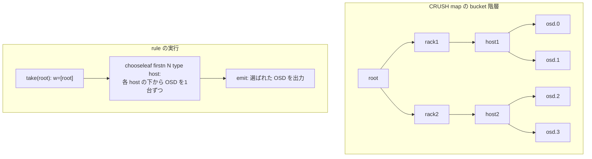

# 第7章 CRUSH アルゴリズムによる決定的なデータ配置

> **本章で読むソース**
>
> - [`src/crush/crush.h`](https://github.com/ceph/ceph/blob/v20.2.2/src/crush/crush.h)
> - [`src/crush/mapper.c`](https://github.com/ceph/ceph/blob/v20.2.2/src/crush/mapper.c)
> - [`src/crush/hash.c`](https://github.com/ceph/ceph/blob/v20.2.2/src/crush/hash.c)
> - [`src/crush/hash.h`](https://github.com/ceph/ceph/blob/v20.2.2/src/crush/hash.h)
> - [`src/crush/CrushWrapper.h`](https://github.com/ceph/ceph/blob/v20.2.2/src/crush/CrushWrapper.h)

## この章の狙い

数千台の OSD を束ねるクラスタで、あるオブジェクトがどの OSD に置かれているかを、どこかの索引に問い合わせずに知りたい。
索引を中央に置くと、その索引がボトルネックと単一障害点になり、クラスタの規模に対して素直に伸びない。
Ceph はこの問題を、配置先を計算で求める「**CRUSH**」（Controlled Replication Under Scalable Hashing）で解く。

CRUSH は、入力値（オブジェクトに対応する整数）とクラスタの構成図（CRUSH map）だけから、配置先の OSD 群を決定的に計算する。
同じ map と同じ入力からは、どのノードで計算しても同じ結果が出る。
クライアントも OSD も Monitor も、map さえ共有していれば配置先を各自で算出でき、位置の問い合わせが不要になる。
本章では、配置計算の本体である `crush_do_rule` がルールを解釈して bucket 階層を降り、OSD を選ぶまでの流れを読む。
とりわけ、重み付き選択の中核である straw2 が、なぜ重み変更時のデータ移動を最小に抑えられるかを機構のレベルで見る。

## 前提

第1章で見た RADOS の構成と、クラスタ状態を配布する仕組みを前提とする。
CRUSH map を運ぶ OSDMap、計算結果である acting セットと PG の対応は第8章で扱う。
本章が読む `src/crush/` は Linux カーネルクライアントと共有するため C で書かれており、`crush.h` と `mapper.c` が計算の中心である。
C++ 側はこの C コアを `CrushWrapper` で薄く覆う。

## CRUSH map の構成要素

CRUSH map は、OSD を末端の葉とする bucket の階層と、階層の降り方を記述する rule の集まりである。
[`src/crush/crush.h` L355-L372](https://github.com/ceph/ceph/blob/v20.2.2/src/crush/crush.h#L355-L372) が map の本体を定義する。

```c
struct crush_map {
	struct crush_bucket **buckets;
	struct crush_rule **rules;
        __s32 max_buckets; /*!< the size of __buckets__ */
	__u32 max_rules; /*!< the size of __rules__ */
        __s32 max_devices;
```

`buckets` は root、rack、host といった内部ノードの配列である。
各 bucket は `id` が負の値で、その内部に子を持つ。
[`src/crush/crush.h` L230-L240](https://github.com/ceph/ceph/blob/v20.2.2/src/crush/crush.h#L230-L240) が共通ヘッダを定義する。

```c
struct crush_bucket {
	__s32 id;        /*!< bucket identifier, < 0 and unique within a crush_map */
	__u16 type;      /*!< > 0 bucket type, defined by the caller */
	__u8 alg;        /*!< the item selection ::crush_algorithm */
	__u8 hash;       /* which hash function to use, CRUSH_HASH_* */
	__u32 weight;    /*!< 16.16 fixed point cumulated children weight */
	__u32 size;      /*!< size of the __items__ array */
        __s32 *items;    /*!< array of children: < 0 are buckets, >= 0 items */
};
```

`items` の要素は、負なら子 bucket の `id`、非負なら OSD 番号を指す。
`type` は root や host といった階層の種別を表し、rule がどの層で何個選ぶかを指定するときの目印になる。
`weight` は 16.16 固定小数点の重みで、子の重みを積み上げた値である。

`alg` は bucket 内で子を選ぶアルゴリズムを指す。
[`src/crush/crush.h` L118-L123](https://github.com/ceph/ceph/blob/v20.2.2/src/crush/crush.h#L118-L123) のコメントが、種別ごとの速度と再編成効率の対応を表にまとめている。

```c
 * 	Bucket Alg     Speed       Additions    Removals
 * 	------------------------------------------------
 * 	uniform         O(1)       poor         poor
 * 	list            O(n)       optimal      poor
 * 	straw2          O(n)       optimal      optimal
```

uniform は同一構成のデバイス群を定数時間で選べるが、要素数が変わると全体を組み直す。
list は追加には最適だが、途中や末尾の削除で不要な移動が起きる。
straw2 は追加と削除のどちらでもデータ移動が最適になり、現在の推奨である。
後述するように、straw2 が推奨されるのはこの再編成効率のためである。

rule は、階層をどう降りるかを表すステップ列である。
[`src/crush/crush.h` L43-L75](https://github.com/ceph/ceph/blob/v20.2.2/src/crush/crush.h#L43-L75) がステップの型と命令を定義する。

```c
struct crush_rule_step {
	__u32 op;
	__s32 arg1;
	__s32 arg2;
};

enum crush_opcodes {
	CRUSH_RULE_NOOP = 0,
	CRUSH_RULE_TAKE = 1,          /* arg1 = value to start with */
	CRUSH_RULE_CHOOSE_FIRSTN = 2, /* arg1 = num items to pick */
				      /* arg2 = type */
	CRUSH_RULE_CHOOSE_INDEP = 3,  /* same */
	CRUSH_RULE_EMIT = 4,          /* no args */
	CRUSH_RULE_CHOOSELEAF_FIRSTN = 6,
	CRUSH_RULE_CHOOSELEAF_INDEP = 7,
```

典型的な rule は「`take`（root から始める）」「`chooseleaf firstn`（各 host の下から1台ずつ OSD を選ぶ）」「`emit`（結果を出力する）」の3段からなる。

## crush_do_rule：ルールの解釈

配置計算の入口は `crush_do_rule` である。
[`src/crush/mapper.c` L2016-L2052](https://github.com/ceph/ceph/blob/v20.2.2/src/crush/mapper.c#L2016-L2052) は rule の種別を見て処理を振り分ける。

```c
int crush_do_rule(const struct crush_map *map,
		  int ruleno, int x, int *result, int result_max,
		  const __u32 *weight, int weight_max,
		  void *cwin, const struct crush_choose_arg *choose_args)
{
	const struct crush_rule *rule;
	// ... (中略) ...
	rule = map->rules[ruleno];
	if (rule_type_is_msr(rule->type)) {
		return crush_msr_do_rule(
			// ... (中略) ...
	} else {
		return crush_do_rule_no_retry(
			// ... (中略) ...
	}
}
```

`x` が入力値、`result` が選ばれた OSD 番号を書き込む出力である。
`weight` は OSD ごとの in/out 重みで、後述する脱落判定に使う。
新しい MSR 系ルールは別経路に送るが、本章では従来経路の `crush_do_rule_no_retry` を追う。

`crush_do_rule_no_retry` は rule のステップを順に解釈する。
[`src/crush/mapper.c` L877-L888](https://github.com/ceph/ceph/blob/v20.2.2/src/crush/mapper.c#L877-L888) の `TAKE` は、作業配列 `w` に開始点を1個だけ置く。

```c
		case CRUSH_RULE_TAKE:
			if ((curstep->arg1 >= 0 &&
			     curstep->arg1 < map->max_devices) ||
			    (-1-curstep->arg1 >= 0 &&
			     -1-curstep->arg1 < map->max_buckets &&
			     map->buckets[-1-curstep->arg1])) {
				w[0] = curstep->arg1;
				wsize = 1;
			} else {
```

続く choose 系ステップは、この `w` の各要素を起点に、指定された `type` の要素を `numrep` 個選び、結果を別の作業配列に集める。
[`src/crush/mapper.c` L920-L933](https://github.com/ceph/ceph/blob/v20.2.2/src/crush/mapper.c#L920-L933) が、選び方を firstn と indep に、そして「型で止まる choose」と「葉まで降りる chooseleaf」に振り分ける。

```c
		case CRUSH_RULE_CHOOSELEAF_FIRSTN:
		case CRUSH_RULE_CHOOSE_FIRSTN:
			firstn = 1;
			/* fall through */
		case CRUSH_RULE_CHOOSELEAF_INDEP:
		case CRUSH_RULE_CHOOSE_INDEP:
			if (wsize == 0)
				break;

			recurse_to_leaf =
				curstep->op ==
				 CRUSH_RULE_CHOOSELEAF_FIRSTN ||
				curstep->op ==
				CRUSH_RULE_CHOOSELEAF_INDEP;
```

ステップを1段処理するたびに、選んだ結果を入れた配列 `o` を次段の入力 `w` と入れ替える。
これにより、rule は root から rack、host、OSD へと段階的に降りていく。
最後に `EMIT` で、そのとき `w` にある要素を出力へ書き出す。
[`src/crush/mapper.c` L1016-L1022](https://github.com/ceph/ceph/blob/v20.2.2/src/crush/mapper.c#L1016-L1022) がその処理である。

```c
		case CRUSH_RULE_EMIT:
			for (i = 0; i < wsize && result_len < result_max; i++) {
				result[result_len] = w[i];
				result_len++;
			}
			wsize = 0;
			break;
```



## bucket からの選択と決定的ハッシュ

各 bucket での1要素の選択は `crush_bucket_choose` が担い、bucket の `alg` で実装を切り替える。
[`src/crush/mapper.c` L376-L398](https://github.com/ceph/ceph/blob/v20.2.2/src/crush/mapper.c#L376-L398) がその分岐である。

```c
	switch (in->alg) {
	case CRUSH_BUCKET_UNIFORM:
		// ... (中略) ...
	case CRUSH_BUCKET_STRAW2:
		return bucket_straw2_choose(
			(const struct crush_bucket_straw2 *)in,
			x, r, arg, position);
	default:
		dprintk("unknown bucket %d alg %d\n", in->id, in->alg);
		return in->items[0];
	}
```

選択は、入力 `x` と試行番号 `r` を種にした決定的ハッシュに乗る。
ハッシュは Robert Jenkins の混合関数で、[`src/crush/hash.c` L113-L121](https://github.com/ceph/ceph/blob/v20.2.2/src/crush/hash.c#L113-L121) の `crush_hash32_3` などが値を返す。

```c
__u32 crush_hash32_3(int type, __u32 a, __u32 b, __u32 c)
{
	switch (type) {
	case CRUSH_HASH_RJENKINS1:
		return crush_hash32_rjenkins1_3(a, b, c);
	default:
		return 0;
	}
}
```

このハッシュは同じ入力から常に同じ値を返す。
CRUSH の決定性は、乱数生成器の状態や時刻に依存せず、`x` と bucket の要素 id と試行番号だけからハッシュを引くことに拠る。
どのノードも同じ map で同じ計算をたどるため、配置先が一致する。

## straw2：重み付き選択と最小の再配置

straw2 bucket は、各要素に「くじ（straw）」を引かせ、最も長いくじを引いた要素を選ぶ。
[`src/crush/mapper.c` L342-L365](https://github.com/ceph/ceph/blob/v20.2.2/src/crush/mapper.c#L342-L365) がその本体である。

```c
static int bucket_straw2_choose(const struct crush_bucket_straw2 *bucket,
				int x, int r, const struct crush_choose_arg *arg,
                                int position)
{
	unsigned int i, high = 0;
	__s64 draw, high_draw = 0;
        __u32 *weights = get_choose_arg_weights(bucket, arg, position);
        __s32 *ids = get_choose_arg_ids(bucket, arg);
	for (i = 0; i < bucket->h.size; i++) {
		if (weights[i]) {
			draw = generate_exponential_distribution(bucket->h.hash, x, ids[i], r, weights[i]);
		} else {
			draw = S64_MIN;
		}

		if (i == 0 || draw > high_draw) {
			high = i;
			high_draw = draw;
		}
	}

	return bucket->h.items[high];
}
```

くじ値 `draw` は要素ごとに独立に計算され、その最大値を取る要素が勝つ。
くじ値の作り方が肝心である。
[`src/crush/mapper.c` L315-L340](https://github.com/ceph/ceph/blob/v20.2.2/src/crush/mapper.c#L315-L340) の `generate_exponential_distribution` は、ハッシュ値を `[0, 0xffff]` に収めてから自然対数を引き、要素の重みで割る。

```c
static inline __s64 generate_exponential_distribution(int type, int x, int y, int z, 
                                                      int weight)
{
	unsigned int u = crush_hash32_3(type, x, y, z);
	u &= 0xffff;
	// ... (中略) ...
	__s64 ln = crush_ln(u) - 0x1000000000000ll;
	// ... (中略) ...
	return div64_s64(ln, weight);
}
```

くじ値は `ln(hash) / weight` の形になる。
`ln` は負なので、重みが大きいほど値は0に近づき、最大値を取りやすい。
これが重み付きの当選確率を生む。

この形が、straw2 の再配置効率の核心である。
ある要素のくじ値は、その要素自身の id と重み、そして入力 `x` だけで決まり、他の要素の重みも要素数も含まない。
[`src/crush/mapper.c` L353](https://github.com/ceph/ceph/blob/v20.2.2/src/crush/mapper.c#L353) の引数が `ids[i]` と `weights[i]` に閉じていることが、その独立性を示す。

```c
			draw = generate_exponential_distribution(bucket->h.hash, x, ids[i], r, weights[i]);
```

ある要素を追加・削除・再重み付けしても、他の要素のくじ値は一切変わらない。
勝敗が動くのは、変わった要素のくじ値が新たに最大になったか、最大でなくなった `x` に限られる。
その結果、移動するデータ量は重みの変化に比例した最小限にとどまる。
list や tree のように「先頭要素を優先する」「部分木を丸ごと飛ばす」構造では、途中の要素が変わると後続の判定条件がずれて連鎖的に勝敗が動くのに対し、straw2 は各要素を独立の1本のくじに閉じ込めることでこの連鎖を断つ。
全要素分のくじを引くため計算量は O(n) だが、再編成の最小性をこの走査コストで買っている。

## firstn と indep：レプリケーションと EC の選び分け

choose には firstn と indep の2系統があり、失敗時のふるまいが違う。
firstn は `crush_choose_firstn` が実装する。
選ぶたびに試行番号 `r` を進め、[`src/crush/mapper.c` L491-L493](https://github.com/ceph/ceph/blob/v20.2.2/src/crush/mapper.c#L491-L493) のように、これまでの失敗回数 `ftotal` を `r` に足し込んで別の要素を引き直す。

```c
				r = rep + parent_r;
				/* r' = r + f_total */
				r += ftotal;
```

同一 OSD の重複や、脱落した OSD（`is_out`）、葉が取れない場合は棄却し、`r` を進めて再試行する。
[`src/crush/mapper.c` L538-L544](https://github.com/ceph/ceph/blob/v20.2.2/src/crush/mapper.c#L538-L544) が重複判定である。

```c
				/* collision? */
				for (i = 0; i < outpos; i++) {
					if (out[i] == item) {
						collide = 1;
						break;
					}
				}
```

firstn は必要数が埋まるまで詰めて選ぶため、途中に欠員が出ても後ろが繰り上がる。
レプリケーションのように「N 個の OSD が対等で、順序に穴が空かないほうが扱いやすい」用途に向く。

一方 indep は `crush_choose_indep` が実装し、各位置を独立の枠として扱う。
[`src/crush/mapper.c` L663-L667](https://github.com/ceph/ceph/blob/v20.2.2/src/crush/mapper.c#L663-L667) は、まず全位置を「未定義」で初期化する。

```c
	/* initially my result is undefined */
	for (rep = outpos; rep < endpos; rep++) {
		out[rep] = CRUSH_ITEM_UNDEF;
		if (out2)
			out2[rep] = CRUSH_ITEM_UNDEF;
	}
```

失敗した位置だけを埋め直し、成功済みの位置は動かさない。
[`src/crush/mapper.c` L692-L699](https://github.com/ceph/ceph/blob/v20.2.2/src/crush/mapper.c#L692-L699) のコメントが、選択を位置に基づける狙いを述べる。

```c
				/* note: we base the choice on the position
				 * even in the nested call.  that means that
				 * if the first layer chooses the same bucket
				 * in a different position, we will tend to
				 * choose a different item in that bucket.
				 * this will involve more devices in data
				 * movement and tend to distribute the load.
				 */
```

Erasure Code では、各シャードがデータ片かパリティ片かで役割が決まっており、位置が入れ替わると復号の対応が崩れる。
indep は位置を固定したまま欠員だけを補うため、EC のシャード配置に使う。
その復号側の対応は第15章で扱う。

## chooseleaf の再帰と vary_r

chooseleaf は、指定 type（例えば host）の bucket を選んだうえで、その下の葉 OSD まで再帰的に1台選ぶ。
再帰呼び出しに渡す試行番号を、firstn では `vary_r` に応じて加工する。
[`src/crush/mapper.c` L549-L553](https://github.com/ceph/ceph/blob/v20.2.2/src/crush/mapper.c#L549-L553) がその計算である。

```c
						int sub_r;
						if (vary_r)
							sub_r = r >> (vary_r-1);
						else
							sub_r = 0;
```

`vary_r` が0のとき、再帰の試行番号は常に0から始まる。
すると、外側で host を選び直しても、その host 内で同じ OSD が選ばれてしまい、無駄なマッピング変更が起きうる。
`vary_r` を1以上にすると、外側の試行番号 `r` を再帰側へ伝え、host を選び直したときに内側の選択も変わるようにする。
これは過去のマッピングとの互換性のために段階導入された調整項目（tunable）で、新規クラスタでは1が推奨される。
[`src/crush/crush.h` L406-L412](https://github.com/ceph/ceph/blob/v20.2.2/src/crush/crush.h#L406-L412) がその意図を記す。

```c
	 *  If non-zero, feed r into chooseleaf, bit-shifted right by
	 *  (r-1) bits.  a value of 1 is best for new clusters.  for
	 *  legacy clusters that want to limit reshuffling, a value of
	 *  3 or 4 will make the mappings line up a bit better with
	 *  previous mappings.
	 */
	__u8 chooseleaf_vary_r;
```

## C++ 側の位置づけ

この C コアは、C++ からは `CrushWrapper` を通して呼ばれる。
[`src/crush/CrushWrapper.h` L1601-L1611](https://github.com/ceph/ceph/blob/v20.2.2/src/crush/CrushWrapper.h#L1601-L1611) の `do_rule` が、作業領域を確保して `crush_do_rule` に渡す薄いラッパーである。

```cpp
  void do_rule(int rule, int x, std::vector<int>& out, int maxout,
	       const WeightVector& weight,
	       uint64_t choose_args_index) const {
    std::vector<int> rawout(maxout);
    std::vector<char> work(crush_work_size(crush, maxout));
    crush_init_workspace(crush, std::data(work));
    crush_choose_arg_map arg_map = choose_args_get_with_fallback(
      choose_args_index);
    int numrep = crush_do_rule(crush, rule, x, std::data(rawout), maxout,
			       std::data(weight), std::size(weight),
			       std::data(work), arg_map.args);
```

作業領域を呼び出し側で確保して渡す設計により、map 自体は計算中に変更されず、mapper がロックを取らずに並行して計算できる。
OSD や Monitor がこの `do_rule` に PG を入力として与え、acting セットを求める使い方は第8章で見る。

## まとめ

CRUSH は、入力値と CRUSH map から配置先 OSD を決定的に計算し、位置索引を不要にする。
`crush_do_rule` は rule のステップ（`take` → `choose`/`chooseleaf` → `emit`）を解釈し、bucket 階層を段階的に降りて OSD を選ぶ。
各 bucket での選択は Jenkins ハッシュに乗った決定的な計算で、乱数状態や時刻に依存しないため、全ノードが同じ結果を得る。
straw2 は各要素のくじ値を自身の重みと id だけで独立に決めるため、要素の増減や再重み付けが他要素の勝敗に波及せず、データ移動が最小になる。
firstn は欠員を繰り上げるレプリケーション向き、indep は位置を固定する EC 向きと選び分ける。

本章で説明した最適化の工夫は、straw2 のくじ値を各要素独立の `ln(hash)/weight` に閉じ込めることで、重み変更時の再配置を変化分に比例した最小限に抑える点である。

## 関連する章

- 第1章「Ceph/RADOS のアーキテクチャとデーモン起動」：CRUSH map を共有する RADOS の全体構成。
- 第8章「OSDMap・PG マッピング・プール」：CRUSH map を運ぶ OSDMap と、`do_rule` を PG に適用して acting セットを得る経路。
- 第15章「Erasure Code バックエンド」：indep が固定する位置と EC のシャード復号の対応。
