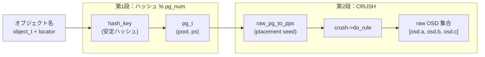
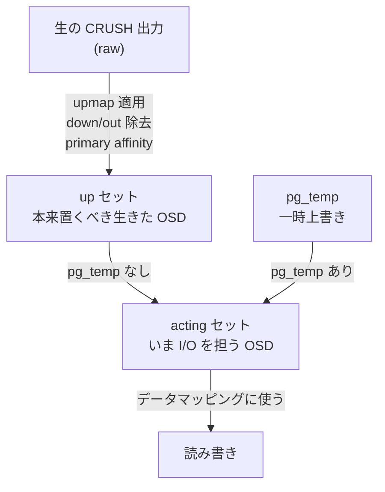

# 第8章 OSDMap・PG マッピング・プール

> **本章で読むソース**
>
> - [`src/osd/OSDMap.h`](https://github.com/ceph/ceph/blob/v20.2.2/src/osd/OSDMap.h)
> - [`src/osd/OSDMap.cc`](https://github.com/ceph/ceph/blob/v20.2.2/src/osd/OSDMap.cc)
> - [`src/osd/osd_types.h`](https://github.com/ceph/ceph/blob/v20.2.2/src/osd/osd_types.h)
> - [`src/osd/osd_types.cc`](https://github.com/ceph/ceph/blob/v20.2.2/src/osd/osd_types.cc)
> - [`src/include/rados.h`](https://github.com/ceph/ceph/blob/v20.2.2/src/include/rados.h)
> - [`src/crush/CrushWrapper.h`](https://github.com/ceph/ceph/blob/v20.2.2/src/crush/CrushWrapper.h)

## この章の狙い

第7章では、CRUSH がクラスタの階層構造と重みから、入力値に対して決定的に OSD の集合を選ぶ様子を読んだ。
ただし CRUSH の入力はオブジェクト名そのものではない。
RADOS は個々のオブジェクトを直接 OSD へ対応づけるのではなく、いったん「Placement Group（PG）」という中間の入れ物にまとめ、その PG を CRUSH で OSD 集合へ写す。
本章では、この二段階のマッピングがどこでどう計算されるかを `OSDMap` のコードで追う。

前半では、オブジェクト名からハッシュを取り PG を決める `object_locator_to_pg` を読む。
後半では、その PG を CRUSH に通して得た生の OSD 集合に、down/out した OSD の除去、upmap による差し替え、primary affinity の適用を重ねて、最終的な up セットと acting セットを決める `_pg_to_up_acting_osds` の流れを読む。
あわせて、これらの計算のパラメータを供給する「プール（`pg_pool_t`）」の主要フィールドを押さえる。

## 前提

第7章の CRUSH と、CRUSH map や OSDMap という用語を導入済みとして使う。
オブジェクト識別子（`object_t`）とシリアライズの基盤は第2章で扱った。
本章のコードはクライアントと OSD の双方が同じ `OSDMap` を共有して同一の結果を得る前提で読むとよい。

## なぜ PG という中間層を挟むのか

素朴に考えれば、オブジェクトごとに「どの OSD に置くか」を表で持てばよい。
しかし RADOS が扱うオブジェクトは容易に数十億に達し、その一つずつに配置先を記録すれば、テーブル自体が巨大なメタデータになる。
クラスタの誰もが同じ配置を再現するにはこのテーブルを全員へ配る必要があり、OSD が一台増減するたびに更新して配り直すことになる。

RADOS はこれを二段階に分けて避ける。
まずオブジェクト名を安定ハッシュで PG 番号に畳み込み、次に PG を CRUSH で OSD 集合へ写す。
配置の記録が必要なのは PG の側だけで、PG の数はプールごとに `pg_num` で決まる固定の値である。
オブジェクトが何十億あっても、マッピングを追跡する対象は数千から数万の PG に圧縮される。
しかも PG から OSD への対応は CRUSH が `OSDMap` の内容だけから決定的に再計算するため、対応表を明示的に保持して配る必要すらない。
これが、オブジェクト単位の配置追跡を避けるための中間層である。

二段階のマッピングを図にすると次のようになる。



## 第1段：オブジェクトから PG へ

入口は `object_locator_to_pg` である。
オブジェクト名 `oid` と、それがどのプールに属しどのキーで配置されるかを表す `object_locator_t` を受け取り、`pg_t` を返す。

[`src/osd/OSDMap.cc` L2724-L2735](https://github.com/ceph/ceph/blob/v20.2.2/src/osd/OSDMap.cc#L2724-L2735)

```cpp
int OSDMap::object_locator_to_pg(
  const object_t& oid, const object_locator_t& loc, pg_t &pg) const
{
  if (loc.hash >= 0) {
    if (!get_pg_pool(loc.get_pool())) {
      return -ENOENT;
    }
    pg = pg_t(loc.hash, loc.get_pool());
    return 0;
  }
  return map_to_pg(loc.get_pool(), oid.name, loc.key, loc.nspace, &pg);
}
```

ロケータが明示的なハッシュ値（`loc.hash >= 0`）を持つ場合は、それをそのまま配置シードとして `pg_t` を組み立てる。
そうでない通常の経路では `map_to_pg` に進み、名前からハッシュを計算する。

`map_to_pg` は、キーが指定されていればキーを、なければオブジェクト名をハッシュ関数に通し、その値と プール ID から `pg_t` を作る。

[`src/osd/OSDMap.cc` L2713-L2721](https://github.com/ceph/ceph/blob/v20.2.2/src/osd/OSDMap.cc#L2713-L2721)

```cpp
  if (!pool)
    return -ENOENT;
  ps_t ps;
  if (!key.empty())
    ps = pool->hash_key(key, nspace);
  else
    ps = pool->hash_key(name, nspace);
  *pg = pg_t(ps, poolid);
  return 0;
}
```

キーを名前と別に指定できるのは、複数のオブジェクトを意図的に同じ PG へ同居させるためである。
名前が違っても同じ `key` を与えれば同じ `ps` になり、同じ PG に落ちる。

ハッシュそのものは `pg_pool_t::hash_key` が計算する。
名前空間 `ns` が空でなければ、名前空間とキーを区切り文字 `\037` でつないだバイト列をハッシュし、名前空間ごとにハッシュ空間を分ける。

[`src/osd/osd_types.cc` L1794-L1805](https://github.com/ceph/ceph/blob/v20.2.2/src/osd/osd_types.cc#L1794-L1805)

```cpp
uint32_t pg_pool_t::hash_key(const string& key, const string& ns) const
{
 if (ns.empty()) 
    return ceph_str_hash(object_hash, key.data(), key.length());
  int nsl = ns.length();
  int len = key.length() + nsl + 1;
  char buf[len];
  memcpy(&buf[0], ns.data(), nsl);
  buf[nsl] = '\037';
  memcpy(&buf[nsl+1], key.data(), key.length());
  return ceph_str_hash(object_hash, &buf[0], len);
}
```

ここで得られる `ps` は 32 ビットのフルレンジのハッシュ値である。
これを実際の PG 番号へ畳み込むのが `ceph_stable_mod` で、`pg_num` とそれを含む2の冪から1を引いた `pg_num_mask` を使う。

[`src/include/rados.h` L96-L102](https://github.com/ceph/ceph/blob/v20.2.2/src/include/rados.h#L96-L102)

```c
static inline int ceph_stable_mod(int x, int b, int bmask)
{
	if ((x & bmask) < b)
		return x & bmask;
	else
		return x & (bmask >> 1);
}
```

これは単なる `x % pg_num` ではなく、`pg_num` が2の冪でないときにも PG の分割（split）を安定させるための剰余である。
`pg_num` が `pg_num_mask + 1`（つまり2の冪）に等しい場合、`x & bmask` は必ず `b` 未満になり、通常のビットマスク剰余に一致する。
`pg_num` を2の冪でない値に増やしていく途中では、下位ビットで決まる一部の入力だけが新しい PG へ移り、それ以外は元の PG に留まる。
`pg_num` を増やしたときに全オブジェクトが一斉に再配置されるのを避け、増えたぶんの PG に対応する入力だけが移動する。
この安定性が、稼働中に PG 数を増やしても移動量を最小に抑える土台になる。

`pg_num` とは別に `pgp_num` があり、CRUSH に渡す配置シードの畳み込みに使う。
生の PG から CRUSH 用の配置シード（placement ps）を作るのが `raw_pg_to_pps` である。

[`src/osd/osd_types.cc` L1826-L1843](https://github.com/ceph/ceph/blob/v20.2.2/src/osd/osd_types.cc#L1826-L1843)

```cpp
ps_t pg_pool_t::raw_pg_to_pps(pg_t pg) const
{
  if (flags & FLAG_HASHPSPOOL) {
    // Hash the pool id so that pool PGs do not overlap.
    return
      crush_hash32_2(CRUSH_HASH_RJENKINS1,
		     ceph_stable_mod(pg.ps(), pgp_num, pgp_num_mask),
		     pg.pool());
  } else {
    // Legacy behavior; add ps and pool together.  This is not a great
    // idea because the PGs from each pool will essentially overlap on
    // top of each other: 0.5 == 1.4 == 2.3 == ...
    return
      ceph_stable_mod(pg.ps(), pgp_num, pgp_num_mask) +
      pg.pool();
  }
}
```

`pgp_num` が `pg_num` より小さいと、複数の PG が同じ配置シードに畳み込まれ、CRUSH からは同じ OSD 集合を得る。
これにより、PG 数（オブジェクトを振り分ける粒度）と配置数（CRUSH が区別する配置パターンの数）を別々に調整できる。
`pg_num` を先に増やして PG を分割し、データ移動を伴う `pgp_num` の増加はあとから行う、という段階的な拡張がこの分離で可能になる。
現行のプールでは `FLAG_HASHPSPOOL` が立ち、配置シードにプール ID を混ぜて、異なるプールの PG が同じ OSD 集合へ重なるのを防ぐ。

## プール（`pg_pool_t`）が供給するパラメータ

ここまでの計算は、すべてプールの設定値を参照していた。
プールは `pg_pool_t` で表現され、配置に関わる主要フィールドを一箇所に持つ。

[`src/osd/osd_types.h` L1478-L1485](https://github.com/ceph/ceph/blob/v20.2.2/src/osd/osd_types.h#L1478-L1485)

```cpp
  __u8 type = 0;                ///< TYPE_*
  __u8 size = 0, min_size = 0;  ///< number of osds in each pg
  __u8 crush_rule = 0;          ///< crush placement rule
  __u8 object_hash = 0;         ///< hash mapping object name to ps
  pg_autoscale_mode_t pg_autoscale_mode = pg_autoscale_mode_t::UNKNOWN;

private:
  __u32 pg_num = 0, pgp_num = 0;  ///< number of pgs
```

`size` は各 PG を何台の OSD に置くか（レプリカ数、または EC のシャード総数）、`min_size` は I/O を受け付けるのに必要な最小の OSD 数である。
`crush_rule` は CRUSH のどのルールでこのプールの PG を配置するかを指し、`object_hash` は名前をハッシュする関数を選ぶ。

プールには複製型とイレージャーコード型の別がある。

[`src/osd/osd_types.h` L1262-L1266](https://github.com/ceph/ceph/blob/v20.2.2/src/osd/osd_types.h#L1262-L1266)

```cpp
  enum {
    TYPE_REPLICATED = 1,     // replication
    //TYPE_RAID4 = 2,   // raid4 (never implemented)
    TYPE_ERASURE = 3,      // erasure-coded
  };
```

この型の違いは、CRUSH の出力から欠けた OSD をどう扱うかに直結する。
判定するのが `can_shift_osds` である。

[`src/osd/osd_types.h` L1808-L1817](https://github.com/ceph/ceph/blob/v20.2.2/src/osd/osd_types.h#L1808-L1817)

```cpp
  bool can_shift_osds() const {
    switch (get_type()) {
    case TYPE_REPLICATED:
      return true;
    case TYPE_ERASURE:
      return false;
    default:
      ceph_abort_msg("unhandled pool type");
```

複製型では、集合内の OSD はどれも同じデータの複製を持つので、down した OSD を詰めて左に寄せてよい（`can_shift_osds` が真）。
イレージャーコード型では、集合内の位置がシャード番号を意味し、`k` 番目の位置には `k` 番目のシャードが対応する。
位置を詰めるとシャードの対応が崩れるため、欠けた位置は詰めずに `CRUSH_ITEM_NONE` を埋めて位置を保つ。
この後で見る `_raw_to_up_osds` は、この一行の真偽で二つの経路に分かれる。

## 第2段：生の OSD 集合から up セットと acting セットへ

PG が決まると、いよいよ OSD 集合を求める。
CRUSH をそのまま呼ぶのが `_pg_to_raw_osds` である。
配置シードを `raw_pg_to_pps` で作り、プールの `crush_rule` を使って `do_rule` を呼ぶ。

[`src/osd/OSDMap.cc` L2773-L2792](https://github.com/ceph/ceph/blob/v20.2.2/src/osd/OSDMap.cc#L2773-L2792)

```cpp
void OSDMap::_pg_to_raw_osds(
  const pg_pool_t& pool, pg_t pg,
  vector<int> *osds,
  ps_t *ppps) const
{
  // map to osds[]
  ps_t pps = pool.raw_pg_to_pps(pg);  // placement ps
  unsigned size = pool.get_size();

  // what crush rule?
  int ruleno = pool.get_crush_rule();
  if (ruleno >= 0)
    crush->do_rule(ruleno, pps, *osds, size, osd_weight, pg.pool());

  _remove_nonexistent_osds(pool, *osds);

  if (ppps)
    *ppps = pps;
}
```

`do_rule` は CRUSH map とルールを引き、`pps` を入力 `x`、`size` を要求する出力数として、最大 `size` 個の OSD を選ぶ。

[`src/crush/CrushWrapper.h` L1601-L1617](https://github.com/ceph/ceph/blob/v20.2.2/src/crush/CrushWrapper.h#L1601-L1617)

```cpp
  void do_rule(int rule, int x, std::vector<int>& out, int maxout,
	       const WeightVector& weight,
	       uint64_t choose_args_index) const {
    std::vector<int> rawout(maxout);
    std::vector<char> work(crush_work_size(crush, maxout));
    crush_init_workspace(crush, std::data(work));
    crush_choose_arg_map arg_map = choose_args_get_with_fallback(
      choose_args_index);
    int numrep = crush_do_rule(crush, rule, x, std::data(rawout), maxout,
			       std::data(weight), std::size(weight),
			       std::data(work), arg_map.args);
    if (numrep < 0)
      numrep = 0;
    out.resize(numrep);
    for (int i=0; i<numrep; i++)
      out[i] = rawout[i];
  }
```

ここまでの出力を「raw な OSD 集合」と呼ぶ。
CRUSH map の階層と重みだけから決まる、クラスタの現在の稼働状況を反映しない集合である。
実際にクライアントが読み書きする集合を得るには、この生の集合にいくつかの補正を重ねる。
その全体を束ねるのが `_pg_to_up_acting_osds` で、生集合から up セットと acting セットの両方を組み立てる。

[`src/osd/OSDMap.cc` L3161-L3172](https://github.com/ceph/ceph/blob/v20.2.2/src/osd/OSDMap.cc#L3161-L3172)

```cpp
  _get_temp_osds(*pool, pg, &_acting, &_acting_primary);
  if (_acting.empty() || up || up_primary) {
    _pg_to_raw_osds(*pool, pg, &raw, &pps);
    _apply_upmap(*pool, pg, &raw);
    _raw_to_up_osds(*pool, raw, &_up);
    _up_primary = _pick_primary(_up);
    _apply_primary_affinity(pps, *pool, &_up, &_up_primary);
    if (_acting.empty()) {
      _acting = _up;
      if (_acting_primary == -1) {
        _acting_primary = _up_primary;
      }
    }
```

up セットは「本来ここに置くべきで、いま生きている OSD の集合」を、生集合から次の順で計算する。

1. `_pg_to_raw_osds`：CRUSH で生集合を得る。
2. `_apply_upmap`：管理者が明示した個別マッピングで OSD を差し替える。
3. `_raw_to_up_osds`：存在しない OSD と down した OSD を取り除く。
4. `_apply_primary_affinity`：primary affinity に従ってプライマリを選び直す。

`_apply_upmap` は、生集合に対して三種類の明示マッピングを順に適用する。

[`src/osd/OSDMap.cc` L2803-L2812](https://github.com/ceph/ceph/blob/v20.2.2/src/osd/OSDMap.cc#L2803-L2812)

```cpp
void OSDMap::_apply_upmap(const pg_pool_t& pi, pg_t raw_pg, vector<int> *raw) const
{
  pg_t pg = pi.raw_pg_to_pg(raw_pg);
  auto p = pg_upmap.find(pg);
  if (p != pg_upmap.end()) {
    // make sure targets aren't marked out
    for (auto osd : p->second) {
      if (osd != CRUSH_ITEM_NONE && osd < max_osd && osd >= 0 &&
          osd_weight[osd] == 0) {
	// reject/ignore the explicit mapping
```

三つのマッピングは `OSDMap` が持つテーブルとして保持される。

[`src/osd/OSDMap.h` L599-L601](https://github.com/ceph/ceph/blob/v20.2.2/src/osd/OSDMap.h#L599-L601)

```cpp
  mempool::osdmap::map<pg_t,mempool::osdmap::vector<int32_t>> pg_upmap; ///< remap pg
  mempool::osdmap::map<pg_t,mempool::osdmap::vector<std::pair<int32_t,int32_t>>> pg_upmap_items; ///< remap osds in up set
  mempool::osdmap::map<pg_t, int32_t> pg_upmap_primaries; ///< remap primary of a pg
```

`pg_upmap` は PG の集合そのものを丸ごと差し替え、`pg_upmap_items` は集合内の特定の OSD を別の OSD に付け替える（`osd_from` から `osd_to` へ）。
`pg_upmap_primaries` はプライマリだけを差し替える。
いずれも、差し替え先が out（`osd_weight` が0）になっていれば適用を見送り、無効なマッピングでデータを行方不明にしないよう検査する。

差し替えを終えた生集合から、存在しない OSD と down した OSD を落とすのが `_raw_to_up_osds` である。
ここでプールの型による分岐が効く。

[`src/osd/OSDMap.cc` L2871-L2894](https://github.com/ceph/ceph/blob/v20.2.2/src/osd/OSDMap.cc#L2871-L2894)

```cpp
void OSDMap::_raw_to_up_osds(const pg_pool_t& pool, const vector<int>& raw,
                             vector<int> *up) const
{
  if (pool.can_shift_osds()) {
    // shift left
    up->clear();
    up->reserve(raw.size());
    for (unsigned i=0; i<raw.size(); i++) {
      if (!exists(raw[i]) || is_down(raw[i]))
	continue;
      up->push_back(raw[i]);
    }
  } else {
    // set down/dne devices to NONE
    up->resize(raw.size());
    for (int i = raw.size() - 1; i >= 0; --i) {
      if (!exists(raw[i]) || is_down(raw[i])) {
	(*up)[i] = CRUSH_ITEM_NONE;
      } else {
	(*up)[i] = raw[i];
      }
    }
  }
}
```

複製型では欠けた OSD を飛ばして左詰めにし、イレージャーコード型では位置を保ったまま欠けた枠を `CRUSH_ITEM_NONE` にする。
前節で見た `can_shift_osds` の一行が、この二経路を切り替えている。

最後に `_apply_primary_affinity` が、OSD ごとに設定できる primary affinity（プライマリになりやすさ）を反映してプライマリを選ぶ。
affinity が既定値のままなら何もしないため、この機能を使わないクラスタでは追加コストがない。

## up セットと acting セットの違い

`_pg_to_up_acting_osds` は up セットと並んで acting セットを返す。
両者はほとんどの場合一致するが、役割が異なる。

up セットは「CRUSH と現在の `OSDMap` から算出される、本来この PG を置くべき生きた OSD の集合」である。
acting セットは「いま実際にこの PG の I/O を担っている OSD の集合」で、データマッピングにはこちらを使う。
両者がずれるのは、一時的な上書き `pg_temp` が設定されているときである。

acting セットは、まず `_get_temp_osds` が `pg_temp` を引くところから始まる。

[`src/osd/OSDMap.cc` L3060-L3072](https://github.com/ceph/ceph/blob/v20.2.2/src/osd/OSDMap.cc#L3060-L3072)

```cpp
void OSDMap::_get_temp_osds(const pg_pool_t& pool, pg_t pg,
                            vector<int> *temp_pg, int *temp_primary) const
{
  vector<int> temp;
  pg = pool.raw_pg_to_pg(pg);
  const auto p = pg_temp->find(pg);
  temp_pg->clear();
  if (p != pg_temp->end()) {
    for (unsigned i=0; i<p->second.size(); i++) {
      if (!exists(p->second[i]) || is_down(p->second[i])) {
	if (pool.can_shift_osds()) {
	  continue;
	} else {
```

先の `_pg_to_up_acting_osds` を振り返ると、`_get_temp_osds` の結果 `_acting` が空でなければ、それがそのまま acting セットになる。
空であれば `_acting = _up` として up セットをそのまま使う。
つまり `pg_temp` が設定されていない通常時は up と acting が一致し、設定されているときだけ acting が up からずれる。

`pg_temp` は、CRUSH が選んだ本来の集合ではまだデータが揃っておらず、そのまま I/O を任せられないときに使う。
たとえば新しくこの PG に加わった OSD がまだ他から回復し終えていない場合、CRUSH の理想集合（up）を目標として保ちつつ、データが揃っている既存の OSD を acting として一時的に指定し、回復が済むまで I/O を継続させる。
この up と acting のずれをどう解消していくかが、次に述べる peering の主題になる。

up セットと acting セットの関係を図にすると次のようになる。



## まとめ

RADOS はオブジェクトを直接 OSD へ対応づけず、PG という中間層を挟む。
第1段では、`object_locator_to_pg` がオブジェクト名を安定ハッシュ `hash_key` に通し、`ceph_stable_mod` で `pg_num` に畳み込んで `pg_t` を得る。
第2段では、`_pg_to_raw_osds` が `raw_pg_to_pps` で作った配置シードを CRUSH の `do_rule` に渡して生の OSD 集合を得て、そこに upmap の差し替え、down/out した OSD の除去、primary affinity を重ねて up セットを作る。
acting セットは、`pg_temp` の一時上書きがなければ up セットに一致し、あればそちらを優先する。
プール `pg_pool_t` は `pg_num`、`pgp_num`、`size`、`crush_rule`、型（複製かイレージャーコードか）を供給し、これらの計算のパラメータを一箇所で持つ。

本章で説明した最適化の工夫は、オブジェクト名を `ceph_stable_mod` で PG に畳み込む中間層により、配置追跡の対象を数十億のオブジェクトから数千から数万の PG へ圧縮し、PG から OSD への対応は CRUSH が `OSDMap` から決定的に再計算するため対応表を保持も配布もせずに済む点である。

## 関連する章

- 第7章では、本章で `do_rule` として呼んだ CRUSH アルゴリズムの内部（bucket 選択と retry）を扱う。
- 第11章では、この `OSDMap` を保持し PG を実際に動かす OSD デーモンの構造を扱う。
- 第12章では、up セットと acting セットのずれを解消してデータを揃える PG の peering と PeeringState を扱う。
