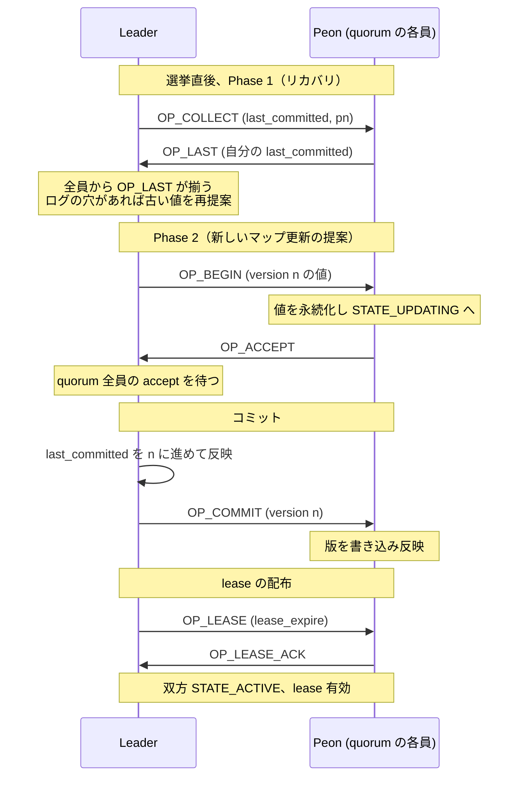
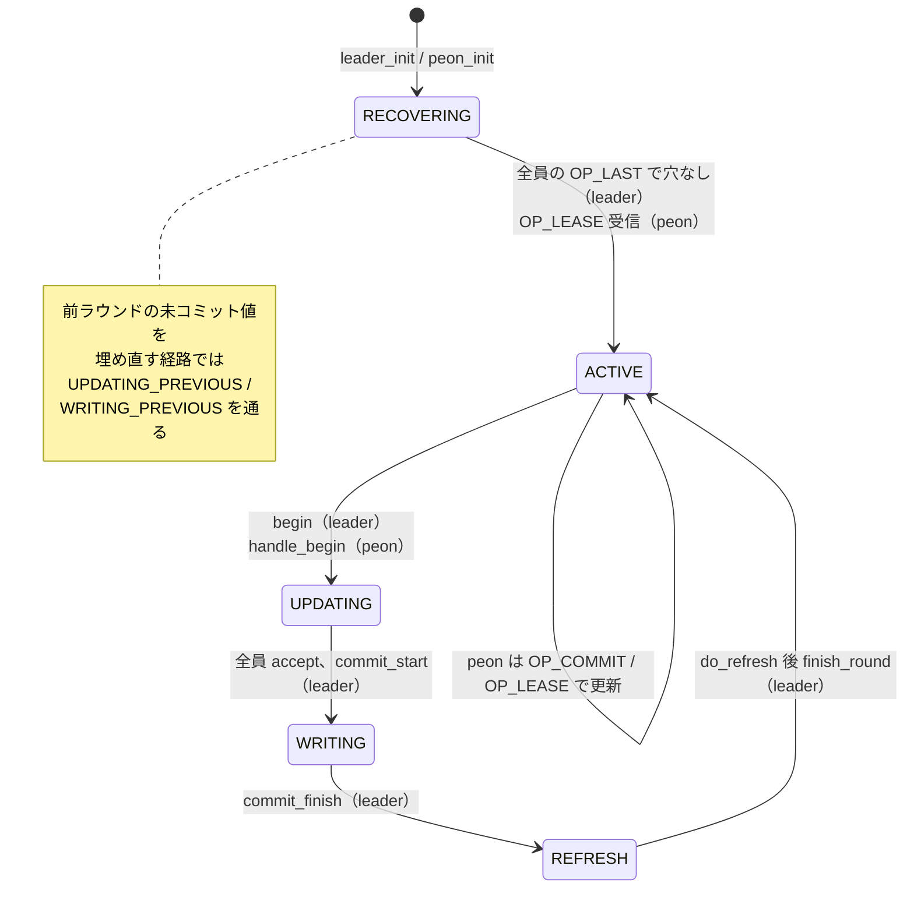

# 第9章 Monitor と Paxos によるマップの合意

> **本章で読むソース**
>
> - [`src/mon/Paxos.h`](https://github.com/ceph/ceph/blob/v20.2.2/src/mon/Paxos.h)
> - [`src/mon/Paxos.cc`](https://github.com/ceph/ceph/blob/v20.2.2/src/mon/Paxos.cc)
> - [`src/mon/Monitor.h`](https://github.com/ceph/ceph/blob/v20.2.2/src/mon/Monitor.h)
> - [`src/mon/MonMap.h`](https://github.com/ceph/ceph/blob/v20.2.2/src/mon/MonMap.h)

## この章の狙い

Ceph クラスタの動作は、OSDMap や MonMap といったクラスタマップの共有に支えられている。
第8章で見たとおり、OSDMap はどの OSD が生きていてどのプールがどう配置されるかを定め、クライアントと OSD はこの同じ版を見て初めて整合したデータ配置に到達する。
その正となり、全員に同じ版を配るのが Monitor である。

Monitor は少数（3台や5台）で quorum を組み、マップの更新を全員が同じ順序で受け入れることで一貫性を保つ。
この合意の中核が、Ceph 独自の変種を加えた Paxos の実装である。
本章では Paxos がどのようにマップの更新を複製し、`lease` によって読み取りを合意なしで捌くかを、状態遷移とメッセージのやり取りに沿って読む。

各マップごとの更新ロジック（`OSDMonitor` などの `PaxosService`）は第10章に譲り、本章は複製の土台そのものに絞る。

## 前提

- 第1章で述べた Monitor と OSD の役割分担、およびクラスタマップの位置づけ。
- 第8章の OSDMap とエポックの概念（Paxos が複製するのはこの種のマップの更新である）。
- Monitor どうしの選挙（`Elector`）で leader と peon が決まっていること（選挙そのものは第10章で扱う）。

## Monitor が守るもの

Monitor は複数種類のクラスタマップを保持し、それぞれを一つの `PaxosService` として束ねる。
`Monitor` は単一の `Paxos` インスタンスと、マップ種別ごとの `PaxosService` の配列を持つ。

[`src/mon/Monitor.h` L236](https://github.com/ceph/ceph/blob/v20.2.2/src/mon/Monitor.h#L236)

```cpp
  std::unique_ptr<Paxos> paxos;
```

[`src/mon/Monitor.h` L690](https://github.com/ceph/ceph/blob/v20.2.2/src/mon/Monitor.h#L690)

```cpp
  std::array<std::unique_ptr<PaxosService>, PAXOS_NUM> paxos_service;
```

配列の添字は複製対象のマップ種別を表す。
MDSMap、OSDMap、MonMap、認証情報などがここに並ぶ。

[`src/mon/mon_types.h` L34-L46](https://github.com/ceph/ceph/blob/v20.2.2/src/mon/mon_types.h#L34-L46)

```cpp
enum {
  PAXOS_MDSMAP,
  PAXOS_OSDMAP,
  PAXOS_LOG,
  PAXOS_MONMAP,
  PAXOS_AUTH,
  PAXOS_MGR,
  PAXOS_MGRSTAT,
  PAXOS_HEALTH,
  PAXOS_CONFIG,
  PAXOS_KV,
  PAXOS_NVMEGW,
  PAXOS_NUM
};
```

このうち MonMap は Monitor 集合そのものの定義であり、どのアドレスの Monitor が quorum を構成しうるかを epoch 付きで持つ。

[`src/mon/MonMap.h` L101-L108](https://github.com/ceph/ceph/blob/v20.2.2/src/mon/MonMap.h#L101-L108)

```cpp
class MonMap {
 public:
  epoch_t epoch;       // what epoch/version of the monmap
  uuid_d fsid;
  utime_t last_changed;
  utime_t created;

  std::map<std::string, mon_info_t> mon_info;
```

重要なのは、これらの種別ごとに別々の Paxos があるのではない点である。
全種別の更新が単一の Paxos の上を、単一の連番の版として流れる。
各 `PaxosService` は自分のマップの更新をトランザクションとして Paxos に渡し、Paxos はそれを版 `n` の値として全 Monitor に複製する。

## Ceph の Paxos は「単一値」ではなく「更新ログ」を複製する

教科書的な Paxos は、一つの値について合意する手続きである。
Ceph の実装はそこから意図的にずれている。
ヘッダーのコメントが、その変種を三点に整理している。

[`src/mon/Paxos.h` L164-L172](https://github.com/ceph/ceph/blob/v20.2.2/src/mon/Paxos.h#L164-L172)

```cpp
/**
 * This library is based on the Paxos algorithm, but varies in a few key ways:
 *  1- Only a single new value is generated at a time, simplifying the recovery logic.
 *  2- Nodes track "committed" values, and share them generously (and trustingly)
 *  3- A 'leasing' mechanism is built-in, allowing nodes to determine when it is 
 *     safe to "read" their copy of the last committed value.
 */
```

一度に提案中の値は常に一つだけであり、確定した値には `last_committed` という連番が振られる。
各 Monitor は `first_committed` から `last_committed` までの値をキー/バリューストアに順に保持する。
つまり Paxos が複製しているのは、単一の値ではなく順序付きの更新ログである。
版 `n` の値は、その版でどのマップをどう書き換えるかを符号化したトランザクションであり、Paxos はそれを不透明なバイト列として扱う。

leader はこのログの末尾に新しい版を一つずつ追加していく。
末尾追加が過半数に受け入れられて初めて `last_committed` が進み、その版が読み取り可能になる。

## 状態機械としての Paxos

Paxos は一つの状態機械として実装されている。
leader と peon はどちらも同じ状態集合の上を動く。

[`src/mon/Paxos.h` L205-L235](https://github.com/ceph/ceph/blob/v20.2.2/src/mon/Paxos.h#L205-L235)

```cpp
  enum {
    /**
     * Leader/Peon is in Paxos' Recovery state
     */
    STATE_RECOVERING,
    /**
     * Leader/Peon is idle, and the Peon may or may not have a valid lease.
     */
    STATE_ACTIVE,
    /**
     * Leader/Peon is updating to a new value.
     */
    STATE_UPDATING,
    /*
     * Leader proposing an old value
     */
    STATE_UPDATING_PREVIOUS,
    /*
     * Leader/Peon is writing a new commit.  readable, but not
     * writeable.
     */
    STATE_WRITING,
    /*
     * Leader/Peon is writing a new commit from a previous round.
     */
    STATE_WRITING_PREVIOUS,
    // leader: refresh following a commit
    STATE_REFRESH,
    // Shutdown after WRITING or WRITING_PREVIOUS
    STATE_SHUTDOWN
  };
```

選挙が終わると、leader は `leader_init()` から、peon は `peon_init()` からそれぞれ状態機械を起動する。
どちらも `STATE_RECOVERING` に入る。

[`src/mon/Paxos.cc` L1353-L1374](https://github.com/ceph/ceph/blob/v20.2.2/src/mon/Paxos.cc#L1353-L1374)

```cpp
void Paxos::leader_init()
{
  cancel_events();
  new_value.clear();

  // discard pending transaction
  pending_proposal.reset();

  reset_pending_committing_finishers();

  logger->inc(l_paxos_start_leader);

  if (mon.get_quorum().size() == 1) {
    state = STATE_ACTIVE;
    return;
  }

  state = STATE_RECOVERING;
  lease_expire = {};
  dout(10) << "leader_init -- starting paxos recovery" << dendl;
  collect(0);
}
```

quorum が自分1台だけなら合意相手がいないので、いきなり `STATE_ACTIVE` になる。
2台以上なら `collect()` を呼んでリカバリ（Phase 1）を始める。

以降の節で、リカバリ、値の提案、コミット、`lease` の順に読む。

## Phase 1（collect）でログをそろえる

新しく leader になった Monitor は、自分のログが最新とは限らない。
前の leader が途中まで複製した版が残っている場合もある。
そこで leader は `collect()` で、自分が知る `last_committed` と新しい提案番号（`pn`）を全 peon に送る。

[`src/mon/Paxos.cc` L195-L213](https://github.com/ceph/ceph/blob/v20.2.2/src/mon/Paxos.cc#L195-L213)

```cpp
  // pick new pn
  accepted_pn = get_new_proposal_number(std::max(accepted_pn, oldpn));
  accepted_pn_from = last_committed;
  num_last = 1;
  dout(10) << "collect with pn " << accepted_pn << dendl;

  // send collect
  for (auto p = mon.get_quorum().begin();
       p != mon.get_quorum().end();
       ++p) {
    if (*p == mon.rank) continue;

    MMonPaxos *collect = new MMonPaxos(mon.get_epoch(), MMonPaxos::OP_COLLECT,
				       ceph_clock_now());
    collect->last_committed = last_committed;
    collect->first_committed = first_committed;
    collect->pn = accepted_pn;
    mon.send_mon_message(collect, *p);
  }
```

提案番号は Monitor ごとに一意になるよう採番され、これが古い leader の提案を退ける根拠になる。
peon は `handle_collect()` で受け取り、送られた `pn` が自分の知る `accepted_pn` より大きければそれを受け入れて永続化し、自分の `last_committed` を `OP_LAST` で返す。

[`src/mon/Paxos.cc` L263-L272](https://github.com/ceph/ceph/blob/v20.2.2/src/mon/Paxos.cc#L263-L272)

```cpp
  // can we accept this pn?
  if (collect->pn > accepted_pn) {
    // ok, accept it
    accepted_pn = collect->pn;
    accepted_pn_from = collect->pn_from;
    dout(10) << "accepting pn " << accepted_pn << " from " 
	     << accepted_pn_from << dendl;
  
    auto t(std::make_shared<MonitorDBStore::Transaction>());
    t->put(get_name(), "accepted_pn", accepted_pn);
```

leader は `handle_last()` で応答を集計する。
quorum 全員から `OP_LAST` を受け取ったところで、直前のラウンドの未コミット値が残っていたかどうかで分岐する。

[`src/mon/Paxos.cc` L582-L596](https://github.com/ceph/ceph/blob/v20.2.2/src/mon/Paxos.cc#L582-L596)

```cpp
      // did we learn an old value?
      if (uncommitted_v == last_committed+1 &&
	  uncommitted_value.length()) {
	dout(10) << "that's everyone.  begin on old learned value" << dendl;
	state = STATE_UPDATING_PREVIOUS;
	begin(uncommitted_value);
      } else {
	// active!
	dout(10) << "that's everyone.  active!" << dendl;
	extend_lease();

	need_refresh = false;
	if (do_refresh()) {
	  finish_round();
	}
      }
```

前の leader が複製しかけて確定に至らなかった値があれば、leader はまずそれを `STATE_UPDATING_PREVIOUS` で再提案し、ログの穴を埋める。
残っていなければ、ログは既にそろっているので `extend_lease()` で `lease` を配り、`finish_round()` で `STATE_ACTIVE` に入る。
`STATE_UPDATING_PREVIOUS` と `STATE_WRITING_PREVIOUS` は、この「前ラウンドの値を確定させ直す」経路でだけ現れる状態である。

## Phase 2（begin）と過半数の accept

`STATE_ACTIVE` の leader に新しいマップ更新が渡ると、`begin()` で提案（Phase 2）が始まる。
leader は次の版 `last_committed+1` の値を自分のストアに書き、`OP_BEGIN` で全 peon に送る。

[`src/mon/Paxos.cc` L634-L637](https://github.com/ceph/ceph/blob/v20.2.2/src/mon/Paxos.cc#L634-L637)

```cpp
  // accept it ourselves
  accepted.clear();
  accepted.insert(mon.rank);
  new_value = v;
```

[`src/mon/Paxos.cc` L690-L704](https://github.com/ceph/ceph/blob/v20.2.2/src/mon/Paxos.cc#L690-L704)

```cpp
  // ask others to accept it too!
  for (auto p = mon.get_quorum().begin();
       p != mon.get_quorum().end();
       ++p) {
    if (*p == mon.rank) continue;
    
    dout(10) << " sending begin to mon." << *p << dendl;
    MMonPaxos *begin = new MMonPaxos(mon.get_epoch(), MMonPaxos::OP_BEGIN,
				     ceph_clock_now());
    begin->values[last_committed+1] = new_value;
    begin->last_committed = last_committed;
    begin->pn = accepted_pn;
    
    mon.send_mon_message(begin, *p);
  }
```

peon は `handle_begin()` で、提案番号が自分の受け入れ済み `accepted_pn` と一致するときだけ値を受け入れる。
値を永続化してから `STATE_UPDATING` に移り、`lease` を捨てて `OP_ACCEPT` を返す。

[`src/mon/Paxos.cc` L736-L746](https://github.com/ceph/ceph/blob/v20.2.2/src/mon/Paxos.cc#L736-L746)

```cpp
  // set state.
  state = STATE_UPDATING;
  lease_expire = {};  // cancel lease

  // yes.
  version_t v = last_committed+1;
  dout(10) << "accepting value for " << v << " pn " << accepted_pn << dendl;
  // store the accepted value onto our store. We will have to decode it and
  // apply its transaction once we receive permission to commit.
  auto t(std::make_shared<MonitorDBStore::Transaction>());
  t->put(get_name(), v, begin->values[v]);
```

leader は `handle_accept()` で受諾を数える。
ここが Ceph の変種の特徴で、過半数ではなく quorum 全員の受諾を待ってからコミットに進む。

[`src/mon/Paxos.cc` L806-L816](https://github.com/ceph/ceph/blob/v20.2.2/src/mon/Paxos.cc#L806-L816)

```cpp
  // only commit (and expose committed state) when we get *all* quorum
  // members to accept.  otherwise, they may still be sharing the now
  // stale state.
  // FIXME: we can improve this with an additional lease revocation message
  // that doesn't block for the persist.
  if (accepted == mon.get_quorum()) {
    // yay, commit!
    dout(10) << " got majority, committing, done with update" << dendl;
    op->mark_paxos_event("commit_start");
    commit_start();
  }
```

安全性そのものには過半数で足りるが、全員を待つのは `lease` による読み取りと関わる。
コミット前の peon はまだ古い値を `lease` で読ませているかもしれず、全員が新しい値を受諾するまで待つことで、確定と同時に全員が新しい版を配れる状態にそろえている。

## コミットと反映

`commit_start()` は、新しい版を `last_committed+1` として自ストアに書くトランザクションを非同期に投入し、`STATE_WRITING` に移る。

[`src/mon/Paxos.cc` L858-L886](https://github.com/ceph/ceph/blob/v20.2.2/src/mon/Paxos.cc#L858-L886)

```cpp
  auto t(std::make_shared<MonitorDBStore::Transaction>());

  // commit locally
  t->put(get_name(), "last_committed", last_committed + 1);

  // decode the value and apply its transaction to the store.
  // this value can now be read from last_committed.
  decode_append_transaction(t, new_value);

  // ... (中略) ...

  get_store()->queue_transaction(t, new C_Committed(this));

  if (is_updating_previous())
    state = STATE_WRITING_PREVIOUS;
  else if (is_updating())
    state = STATE_WRITING;
  else
    ceph_abort();
```

書き込みが完了すると `commit_finish()` が走る。
ここで `last_committed` を一つ進め、`OP_COMMIT` を全 peon に送って版を確定させる。
そのうえで `STATE_REFRESH` に移り、`do_refresh()` で新しいマップを各 `PaxosService` に反映する。

[`src/mon/Paxos.cc` L908-L947](https://github.com/ceph/ceph/blob/v20.2.2/src/mon/Paxos.cc#L908-L947)

```cpp
  last_committed++;
  last_commit_time = ceph_clock_now();

  // ... (中略) ...

  // tell everyone
  for (auto p = mon.get_quorum().begin();
       p != mon.get_quorum().end();
       ++p) {
    if (*p == mon.rank) continue;

    dout(10) << " sending commit to mon." << *p << dendl;
    MMonPaxos *commit = new MMonPaxos(mon.get_epoch(), MMonPaxos::OP_COMMIT,
				      ceph_clock_now());
    commit->values[last_committed] = new_value;
    commit->pn = accepted_pn;
    commit->last_committed = last_committed;

    mon.send_mon_message(commit, *p);
  }

  // ... (中略) ...

  // WRITING -> REFRESH
  ceph_assert(is_writing() || is_writing_previous());
  state = STATE_REFRESH;
  ceph_assert(commits_started > 0);
  --commits_started;

  if (do_refresh()) {
    commit_proposal();
```

peon 側の `handle_commit()` は、送られた版を自ストアに書き込み（`store_state()`）、同じく `do_refresh()` で反映する。

[`src/mon/Paxos.cc` L967-L976](https://github.com/ceph/ceph/blob/v20.2.2/src/mon/Paxos.cc#L967-L976)

```cpp
  if (!mon.is_peon()) {
    dout(10) << "not a peon, dropping" << dendl;
    ceph_abort();
    return;
  }

  op->mark_paxos_event("store_state");
  store_state(commit);

  (void)do_refresh();
```

反映まで終えると、leader は `extend_lease()` で `lease` を配り直し、`finish_round()` で `STATE_ACTIVE` に戻る。

[`src/mon/Paxos.cc` L1084-L1085](https://github.com/ceph/ceph/blob/v20.2.2/src/mon/Paxos.cc#L1084-L1085)

```cpp
  // ok, now go active!
  state = STATE_ACTIVE;
```

ここまでの Phase 1、Phase 2、コミットのやり取りを、leader と peon の間で図にすると次のようになる。



これらのメッセージは `dispatch()` で振り分けられる。

[`src/mon/Paxos.cc` L1452-L1477](https://github.com/ceph/ceph/blob/v20.2.2/src/mon/Paxos.cc#L1452-L1477)

```cpp
  switch (req->op) {
    // learner
  case MMonPaxos::OP_COLLECT:
    handle_collect(op);
    break;
  case MMonPaxos::OP_LAST:
    handle_last(op);
    break;
  case MMonPaxos::OP_BEGIN:
    handle_begin(op);
    break;
  case MMonPaxos::OP_ACCEPT:
    handle_accept(op);
    break;		
  case MMonPaxos::OP_COMMIT:
    handle_commit(op);
    break;
  case MMonPaxos::OP_LEASE:
    handle_lease(op);
    break;
  case MMonPaxos::OP_LEASE_ACK:
    handle_lease_ack(op);
    break;
  default:
    ceph_abort();
  }
```

実際に生成される状態遷移をまとめると次のようになる。



## lease による読み取りの最適化

Monitor への問い合わせの大半は、マップの読み取りである。
クライアントは最新の OSDMap を求め、OSD は自分の版が古くないかを確かめる。
これらを毎回 Paxos の合意にかけていたら、読み取り一つごとに quorum 全員との往復が要る。

Ceph はここを `lease` で最適化する。
leader はコミットのたびに `extend_lease()` で、一定時間先までの有効期限を全 peon に配る。

[`src/mon/Paxos.cc` L984-L1002](https://github.com/ceph/ceph/blob/v20.2.2/src/mon/Paxos.cc#L984-L1002)

```cpp
  lease_expire = ceph::real_clock::now();
  lease_expire += ceph::make_timespan(g_conf()->mon_lease);
  acked_lease.clear();
  acked_lease.insert(mon.rank);

  // ... (中略) ...

  // bcast
  for (auto p = mon.get_quorum().begin();
      p != mon.get_quorum().end(); ++p) {

    if (*p == mon.rank) continue;
    MMonPaxos *lease = new MMonPaxos(mon.get_epoch(), MMonPaxos::OP_LEASE,
				     ceph_clock_now());
    lease->last_committed = last_committed;
    lease->lease_timestamp = utime_t{lease_expire};
    lease->first_committed = first_committed;
    mon.send_mon_message(lease, *p);
  }
```

peon は `handle_lease()` で有効期限を取り込み、`STATE_ACTIVE` に入って `OP_LEASE_ACK` を返す。

[`src/mon/Paxos.cc` L1122-L1134](https://github.com/ceph/ceph/blob/v20.2.2/src/mon/Paxos.cc#L1122-L1134)

```cpp
  // extend lease
  if (auto new_expire = lease->lease_timestamp.to_real_time();
      lease_expire < new_expire) {
    lease_expire = new_expire;

    auto now = ceph::real_clock::now();
    if (lease_expire < now) {
      auto diff = now - lease_expire;
      derr << "lease_expire from " << lease->get_source_inst() << " is " << diff << " seconds in the past; mons are probably laggy (or possibly clocks are too skewed)" << dendl;
    }
  }

  state = STATE_ACTIVE;
```

読み取りが来たとき、Monitor は `is_readable()` で応答してよいかを判定する。
その最後の条件が `is_lease_valid()` である。

[`src/mon/Paxos.cc` L1489-L1495](https://github.com/ceph/ceph/blob/v20.2.2/src/mon/Paxos.cc#L1489-L1495)

```cpp
  if (v > last_committed)
    ret = false;
  else
    ret =
      (mon.is_peon() || mon.is_leader()) &&
      (is_active() || is_updating() || is_writing()) &&
      last_committed > 0 && is_lease_valid(); // must have a value alone, or have lease
```

[`src/mon/Paxos.cc` L1519-L1523](https://github.com/ceph/ceph/blob/v20.2.2/src/mon/Paxos.cc#L1519-L1523)

```cpp
bool Paxos::is_lease_valid()
{
  return ((mon.get_quorum().size() == 1)
	  || (ceph::real_clock::now() < lease_expire));
}
```

`lease` が有効な間、各 peon は他の Monitor に問い合わせず、自分のローカルコピーから読み取りに応答できる。
これが本章の最適化の工夫である。

なぜ安全かは、leader が新しい値を確定させる前に必ず古い `lease` を無効化する仕組みにある。
peon は `handle_begin()` で新しい値を受け入れるとき `lease_expire` を空にして `lease` を捨てる。
leader も過半数ではなく quorum 全員の accept を待ってからコミットする。
その結果、`lease` を握って古い版を読ませている Monitor がいる限り、新しい版は確定しない。
書き込みが起きなければ、有効期限内に読める値は今の確定版だけであり、`lease` の間はローカル読みが最新と一致する。
`lease` が切れれば `is_lease_valid()` が偽になり、Monitor は読み取りを保留して次の `lease` を待つ。
peon 側で `lease` が更新されないまま期限が来れば、`lease_timeout()` が新しい選挙を呼び、leader の失踪を検知する。

この設計により、読み取りは合意の往復を省いてローカルで捌ける一方、書き込みの安全性は全員 accept と `lease` 無効化で保たれる。

## まとめ

Monitor はクラスタマップの正であり、少数で quorum を組んで一貫性を保つ。
その土台の Paxos は、教科書的な単一値の合意ではなく、`last_committed` で連番付けした更新ログを複製する形に作り替えられている。
leader は選挙後に `collect()`（Phase 1）でログをそろえ、`begin()`（Phase 2）で次の版を提案し、quorum 全員の accept を得てコミットする。
コミット後は `lease` を配ることで、有効期間中の読み取りを合意なしでローカルに捌く。
状態機械は `RECOVERING` から `ACTIVE`、`UPDATING`、`WRITING`、`REFRESH` を経て `ACTIVE` に戻る循環を描き、前ラウンドの未確定値を埋める経路でだけ `UPDATING_PREVIOUS` と `WRITING_PREVIOUS` を通る。
種別ごとのマップをこの土台に載せる `PaxosService` は、次章で読む。

## 関連する章

- [第1章 Ceph/RADOS のアーキテクチャとデーモン起動](../part00-overview/01-architecture.md)
- [第8章 OSDMap・PG マッピング・プール](../part03-crush/08-osdmap-pg.md)
- [第10章 Elector と PaxosService（OSDMonitor ほか）](10-elector-paxosservice.md)
