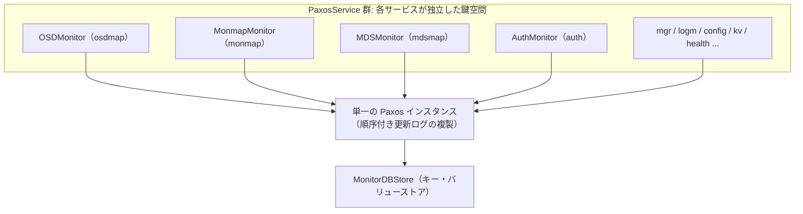
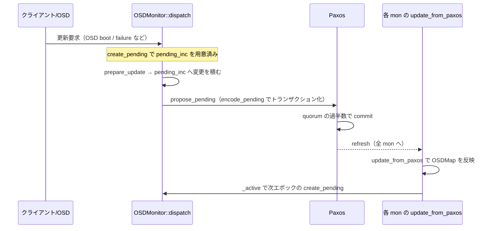

# 第10章 Elector と PaxosService（OSDMonitor ほか）

> **本章で読むソース**
>
> - [`src/mon/Elector.h`](https://github.com/ceph/ceph/blob/v20.2.2/src/mon/Elector.h)
> - [`src/mon/Elector.cc`](https://github.com/ceph/ceph/blob/v20.2.2/src/mon/Elector.cc)
> - [`src/mon/ElectionLogic.h`](https://github.com/ceph/ceph/blob/v20.2.2/src/mon/ElectionLogic.h)
> - [`src/mon/ElectionLogic.cc`](https://github.com/ceph/ceph/blob/v20.2.2/src/mon/ElectionLogic.cc)
> - [`src/mon/PaxosService.h`](https://github.com/ceph/ceph/blob/v20.2.2/src/mon/PaxosService.h)
> - [`src/mon/PaxosService.cc`](https://github.com/ceph/ceph/blob/v20.2.2/src/mon/PaxosService.cc)
> - [`src/mon/OSDMonitor.h`](https://github.com/ceph/ceph/blob/v20.2.2/src/mon/OSDMonitor.h)
> - [`src/mon/OSDMonitor.cc`](https://github.com/ceph/ceph/blob/v20.2.2/src/mon/OSDMonitor.cc)
> - [`src/mon/Monitor.cc`](https://github.com/ceph/ceph/blob/v20.2.2/src/mon/Monitor.cc)

## この章の狙い

第9章では、Monitor が Paxos によって「順序付きの更新ログ」をクラスタ全体で複製する仕組みを見た。
本章はその上下に位置する二つの層を読む。

一つは Paxos の下で動く leader 選出である。
Paxos が値を提案・確定するには、まず提案する権利を持つ1台（leader）を quorum が合意していなければならない。
この選出を担うのが `Elector` と、その判定ロジックを切り出した `ElectionLogic` である。

もう一つは Paxos の上に載る各サービスである。
OSDMap も MonMap も MDSMap も、それぞれ独立したデータでありながら、内部では単一の Paxos インスタンスを共有して更新される。
この共有を可能にしているのが `PaxosService` 基底クラスであり、`OSDMonitor` はその代表的な実装である。
本章では、OSDMap の更新がどのように Paxos のトランザクションへ流れ込むかを実例として追う。

## 前提

第9章の Paxos の役割（1つの値を quorum の過半数で確定し、確定順に番号を振って複製する）を前提とする。
Monitor は `MonMap` に列挙された各 mon に0起点の `rank` を割り当てる。
rank は数が小さいほど優先度が高い。
Monitor がキー・バリューストア（`MonitorDBStore`）を持ち、`put` を1つの `Transaction` にまとめて原子的に適用できることも前提とする。

## 選出の起点：奇数エポックで自分を候補に立てる

選出は、Monitor が起動したときや、既存の leader との通信が途切れたときに始まる。
`ElectionLogic::start` は、まず自分を leader 候補として名乗り出る。

[`src/mon/ElectionLogic.cc` L122-L148](https://github.com/ceph/ceph/blob/v20.2.2/src/mon/ElectionLogic.cc#L122-L148)

```cpp
void ElectionLogic::start()
{
  if (!participating) {
    ldout(cct, 0) << "not starting new election -- not participating" << dendl;
    return;
  }
  ldout(cct, 5) << "start -- can i be leader?" << dendl;

  acked_me.clear();
  init();
  
  // start by trying to elect me
  if (epoch % 2 == 0) {
    bump_epoch(epoch+1);  // odd == election cycle
  } else {
    elector->validate_store();
  }
  acked_me.insert(elector->get_my_rank());
  clear_live_election_state();
  reset_stable_tracker();
  electing_me = true;

  bufferlist bl;
  if (strategy == CONNECTIVITY) {
    stable_peer_tracker->encode(bl);
  }
  elector->propose_to_peers(epoch, bl);
  elector->_start();
}
```

ここで `epoch` は選出の版数であり、偶奇に意味を持たせている。
偶数エポックは「選出が済んで quorum が安定している状態」、奇数エポックは「選出の最中」を表す。
そのため選出を始めるときは、偶数であればエポックを1つ上げて奇数にしてから提案する。
自分の rank を `acked_me`（自分に賛同した mon の集合）へ入れ、`propose_to_peers` で他の全 mon へ提案を送る。

`propose_to_peers` は `MMonElection` の `OP_PROPOSE` メッセージを、自分以外の各 rank へ配る。

[`src/mon/Elector.cc` L149-L162](https://github.com/ceph/ceph/blob/v20.2.2/src/mon/Elector.cc#L149-L162)

```cpp
void Elector::propose_to_peers(epoch_t e, bufferlist& logic_bl)
{
  // bcast to everyone else
  for (unsigned i=0; i<mon->monmap->size(); ++i) {
    if ((int)i == mon->rank) continue;
    MMonElection *m =
      new MMonElection(MMonElection::OP_PROPOSE, e,
		       peer_tracker.get_encoded_bl(),
		       logic.strategy, mon->monmap);
    m->sharing_bl = logic_bl;
    m->mon_features = ceph::features::mon::get_supported();
    m->mon_release = ceph_release();
    mon->send_mon_message(m, i);
  }  
}
```

`ElectionLogic` が判定ロジックだけを持ち、実際のメッセージ送受信や永続化を `Elector` へ委ねている点に注意する。
`ElectionLogic` は `ElectionOwner` インターフェース越しに `Elector` を呼ぶ（`propose_to_peers`、`persist_epoch`、`get_my_rank` など）。
選出アルゴリズムを I/O から切り離すことで、ロジック単体をテストしやすくしている。

## 提案の受信：rank の小さいほうへ道を譲る

提案を受け取った mon は、送り主と自分の rank を比べて、どちらが leader にふさわしいかを判定する。
既定の CLASSIC 戦略では、rank が小さいほうが勝つ。

[`src/mon/ElectionLogic.cc` L290-L317](https://github.com/ceph/ceph/blob/v20.2.2/src/mon/ElectionLogic.cc#L290-L317)

```cpp
void ElectionLogic::propose_classic_handler(int from, epoch_t mepoch)
{
  if (propose_classic_prefix(from, mepoch)) {
    return;
  }
  if (elector->get_my_rank() < from) {
    // i would win over them.
    if (leader_acked >= 0) {        // we already acked someone
      ceph_assert(leader_acked < from);  // and they still win, of course
      ldout(cct, 5) << "no, we already acked " << leader_acked << dendl;
    } else {
      // wait, i should win!
      if (!electing_me) {
	elector->trigger_new_election();
      }
    }
  } else {
    // they would win over me
    if (leader_acked < 0 || // haven't acked anyone yet, or
	leader_acked > from ||   // they would win over who you did ack, or
	leader_acked == from) {  // this is the guy we're already deferring to
      defer(from);
    } else {
      // ignore them!
      ldout(cct, 5) << "no, we already acked " << leader_acked << dendl;
    }
  }
}
```

自分の rank が送り主より小さければ、自分のほうが leader にふさわしい。
まだ誰にも賛同していなければ、自分が名乗り出るために新しい選出を起こす。
逆に送り主の rank が小さければ、`defer(from)` でその相手に賛同し、`OP_ACK` を返す。
すでに別の相手へ賛同していても、いま来た相手のほうが rank が小さければ乗り換える。
この一貫した比較のおかげで、全 mon の賛同先は最終的に「生きている mon のうち rank が最小の1台」へ収束する。

## 勝敗の確定：過半数の賛同で leader になる

提案から一定時間が経つと、`Elector` のタイマーが `end_election_period` を呼ぶ。
ここで自分に賛同した mon が過半数に達していれば勝ちである。

[`src/mon/ElectionLogic.cc` L173-L189](https://github.com/ceph/ceph/blob/v20.2.2/src/mon/ElectionLogic.cc#L173-L189)

```cpp
void ElectionLogic::end_election_period()
{
  ldout(cct, 5) << "election period ended" << dendl;
  
  // did i win?
  if (electing_me &&
      acked_me.size() > (elector->paxos_size() / 2)) {
    // i win
    declare_victory();
  } else {
    // whoever i deferred to didn't declare victory quickly enough.
    if (elector->ever_participated())
      start();
    else
      elector->reset_election();
  }
}
```

賛同数が `paxos_size() / 2` を超えたときにだけ勝利を宣言する。
過半数を要求することが、ネットワーク分断で複数の leader が同時に立つ split-brain を防ぐ。
分断された二つのグループがそれぞれ過半数を同時に集めることはできないため、確定できる leader はどの瞬間もクラスタ全体で高々1台になる。

賛同先が時間内に勝利を宣言しなかった場合は、選出をやり直す（`start()`）。
勝ったときは `declare_victory` が quorum を確定し、エポックを偶数へ戻す。

[`src/mon/ElectionLogic.cc` L192-L206](https://github.com/ceph/ceph/blob/v20.2.2/src/mon/ElectionLogic.cc#L192-L206)

```cpp
void ElectionLogic::declare_victory()
{
  ldout(cct, 5) << "I win! acked_me=" << acked_me << dendl;
  last_election_winner = elector->get_my_rank();
  last_voted_for = last_election_winner;
  clear_live_election_state();

  set<int> new_quorum;
  new_quorum.swap(acked_me);
  
  ceph_assert(epoch % 2 == 1);  // election
  bump_epoch(epoch+1);     // is over!

  elector->message_victory(new_quorum);
}
```

賛同した mon の集合が、そのまま新しい quorum になる。
エポックを1つ上げて奇数から偶数へ戻し、`message_victory` で quorum の全員へ勝利を通知する。

### エポックの単調増加で古いメッセージを弾く

選出のエポックは `bump_epoch` を通してのみ進み、後戻りしない。

[`src/mon/ElectionLogic.cc` L74-L84](https://github.com/ceph/ceph/blob/v20.2.2/src/mon/ElectionLogic.cc#L74-L84)

```cpp
void ElectionLogic::bump_epoch(epoch_t e)
{
  ldout(cct, 10) << __func__ << " to "  << e << dendl;
  ceph_assert(epoch <= e);
  epoch = e;
  peer_tracker->increase_epoch(e);
  elector->persist_epoch(epoch);
  // clear up some state
  electing_me = false;
  acked_me.clear();
  elector->notify_bump_epoch();
}
```

`ceph_assert(epoch <= e)` が後退を禁じ、`persist_epoch` で新しいエポックをディスクへ書く。
エポックを永続化してから提案するため、プロセスが再起動しても過去のエポックを再利用しない。
これにより、遅れて届いた古いエポックの提案や賛同は、現在のエポックと一致せず無視される。
選出のたびに単調増加する番号を振ることが、遅延メッセージによる混乱を機構として排除している。

## PaxosService：1つの Paxos を複数サービスで共有する

ここからは Paxos の上の層を読む。
Monitor は起動時に、単一の `Paxos` インスタンスと、その上に載る複数の `PaxosService` を生成する。

[`src/mon/Monitor.cc` L249-L259](https://github.com/ceph/ceph/blob/v20.2.2/src/mon/Monitor.cc#L249-L259)

```cpp
  paxos_service[PAXOS_MDSMAP].reset(new MDSMonitor(*this, *paxos, "mdsmap"));
  paxos_service[PAXOS_MONMAP].reset(new MonmapMonitor(*this, *paxos, "monmap"));
  paxos_service[PAXOS_OSDMAP].reset(new OSDMonitor(cct, *this, *paxos, "osdmap"));
  paxos_service[PAXOS_LOG].reset(new LogMonitor(*this, *paxos, "logm"));
  paxos_service[PAXOS_AUTH].reset(new AuthMonitor(*this, *paxos, "auth"));
  paxos_service[PAXOS_MGR].reset(new MgrMonitor(*this, *paxos, "mgr"));
  paxos_service[PAXOS_MGRSTAT].reset(new MgrStatMonitor(*this, *paxos, "mgrstat"));
  paxos_service[PAXOS_HEALTH].reset(new HealthMonitor(*this, *paxos, "health"));
  paxos_service[PAXOS_CONFIG].reset(new ConfigMonitor(*this, *paxos, "config"));
  paxos_service[PAXOS_KV].reset(new KVMonitor(*this, *paxos, "kv"));
  paxos_service[PAXOS_NVMEGW].reset(new NVMeofGwMon(*this, *paxos, "nvmeofgw"));
```

すべての `PaxosService` が同じ `*paxos` を受け取る。
`OSDMonitor` は OSDMap を、`MonmapMonitor` は MonMap を、`MDSMonitor` は MDSMap を、`AuthMonitor` は cephx の鍵を担当する。
`MgrMonitor`、`LogMonitor`、`ConfigMonitor`、`KVMonitor`、`HealthMonitor`、`MgrStatMonitor`、`NVMeofGwMon` も同じ枠組みに載る。

各サービスは、コンストラクタで受け取った名前（`"osdmap"` など）を、キー・バリューストアのキー接頭辞として使う。
`put_version` や `put_last_committed` は、必ず自分の `service_name` をプレフィックスにして書き込む。

[`src/mon/PaxosService.h` L752-L753](https://github.com/ceph/ceph/blob/v20.2.2/src/mon/PaxosService.h#L752-L753)

```cpp
  void put_last_committed(MonitorDBStore::TransactionRef t, version_t ver) {
    t->put(get_service_name(), last_committed_name, ver);
```

Paxos は「番号の付いた不透明なバイト列を確定順に複製する」ことだけを担う。
そのバイト列が OSDMap の差分なのか鍵なのかを Paxos は知らない。
各サービスがプレフィックス付きの独立した鍵空間へ書き込むため、単一の Paxos ログ上に複数サービスの状態が衝突せず同居できる。



## サービスの更新フロー：pending を積んで propose する

`PaxosService` の更新は、三つの仮想メソッドの協調で進む。
`create_pending` が変更を貯める作業領域を用意し、`prepare_update` がクライアントの要求をその作業領域へ反映し、`encode_pending` が作業領域をトランザクションへ書き出す。

クライアントからのメッセージは `dispatch` に入る。

[`src/mon/PaxosService.cc` L82-L98](https://github.com/ceph/ceph/blob/v20.2.2/src/mon/PaxosService.cc#L82-L98)

```cpp
  // leader?
  if (!mon.is_leader()) {
    mon.forward_request_leader(op);
    return true;
  }
  
  // writeable?
  if (!is_writeable()) {
    dout(10) << " waiting for paxos -> writeable" << dendl;
    wait_for_writeable(op, new C_RetryMessage(this, op));
    return true;
  }

  // update
  if (!prepare_update(op)) {
    // no changes made.
    return true;
  }
```

読み取りだけで済む要求は、この手前の `preprocess_query` が処理済みである。
状態を変える要求は leader だけが扱えるため、自分が leader でなければ leader へ転送する。
leader は `prepare_update` を呼んで pending 状態へ変更を積む。
`prepare_update` が `true`（提案すべき変更がある）を返したときにだけ、`propose_pending` へ進む。

`propose_pending` は、貯めた pending をトランザクションへエンコードし、Paxos へ提案する。

[`src/mon/PaxosService.cc` L219-L228](https://github.com/ceph/ceph/blob/v20.2.2/src/mon/PaxosService.cc#L219-L228)

```cpp
  MonitorDBStore::TransactionRef t = paxos.get_pending_transaction();

  if (should_stash_full())
    encode_full(t);

  encode_pending(t);
  have_pending = false;

  if (format_version > 0) {
    t->put(get_service_name(), "format_version", format_version);
  }
```

[`src/mon/PaxosService.cc` L258-L259](https://github.com/ceph/ceph/blob/v20.2.2/src/mon/PaxosService.cc#L258-L259)

```cpp
  paxos.queue_pending_finisher(new C_Committed(this));
  paxos.trigger_propose();
```

`get_pending_transaction` が返すのは Paxos の共有トランザクションである。
`encode_pending` が自分の変更をそこへ書き足し、`trigger_propose` で Paxos の提案を起動する。
複数サービスが同じ `pending_transaction` へ書き足せるため、Paxos の1ラウンドで複数サービスの変更をまとめて確定できる。
これが本章の最適化の核である（後述）。

commit が完了すると、`C_Committed` コールバックが `_active` を呼ぶ。
`_active` は、自分が leader であれば次のラウンド用の pending を新しく作る。

[`src/mon/PaxosService.cc` L337-L343](https://github.com/ceph/ceph/blob/v20.2.2/src/mon/PaxosService.cc#L337-L343)

```cpp
  // create pending state?
  if (mon.is_leader()) {
    dout(7) << __func__ << " creating new pending" << dendl;
    if (!have_pending) {
      create_pending();
      have_pending = true;
    }
```

commit された値をメモリ上の状態へ反映するのは `update_from_paxos` である。
Paxos が新しい版を確定すると、Monitor は全サービスの `refresh` を順に呼ぶ。

[`src/mon/Monitor.cc` L1022-L1024](https://github.com/ceph/ceph/blob/v20.2.2/src/mon/Monitor.cc#L1022-L1024)

```cpp
  for (auto& svc : paxos_service) {
    svc->refresh(need_bootstrap);
  }
```

`PaxosService::refresh` はキャッシュした版数を更新し、`update_from_paxos` を呼ぶ。
各サービスは自分のプレフィックスの下から確定済みの版を読み、メモリ上の構造（OSDMap など）へ反映する。
leader も peon（非 leader）も同じ `update_from_paxos` を通るため、確定後の状態は quorum 全体で一致する。

## OSDMonitor を実例に：OSDMap 更新の一往復

`OSDMonitor` は `PaxosService` の四つのフックを OSDMap 向けに実装している。

`create_pending` は、現在の OSDMap の次のエポックを持つ差分（`OSDMap::Incremental`）を作る。

[`src/mon/OSDMonitor.cc` L1167-L1174](https://github.com/ceph/ceph/blob/v20.2.2/src/mon/OSDMonitor.cc#L1167-L1174)

```cpp
void OSDMonitor::create_pending()
{
  pending_inc = OSDMap::Incremental(osdmap.epoch+1);
  pending_inc.fsid = mon.monmap->fsid;
  pending_metadata.clear();
  pending_metadata_rm.clear();

  dout(10) << "create_pending e " << pending_inc.epoch << dendl;
```

OSDMap 全体ではなく差分を pending の単位にしている点が要である。
OSD の up/down や重みの変更、プールの作成など、個々の更新は `pending_inc` へ少しずつ積まれる。

積む処理は `prepare_update` が担い、メッセージ種別ごとに専用ハンドラへ振り分ける。

[`src/mon/OSDMonitor.cc` L2741-L2770](https://github.com/ceph/ceph/blob/v20.2.2/src/mon/OSDMonitor.cc#L2741-L2770)

```cpp
bool OSDMonitor::prepare_update(MonOpRequestRef op)
{
  op->mark_osdmon_event(__func__);
  Message *m = op->get_req();
  dout(7) << "prepare_update " << *m << " from " << m->get_orig_source_inst() << dendl;

  switch (m->get_type()) {
    // damp updates
  case MSG_OSD_MARK_ME_DOWN:
    return prepare_mark_me_down(op);
  case MSG_OSD_MARK_ME_DEAD:
    return prepare_mark_me_dead(op);
  case MSG_OSD_FULL:
    return prepare_full(op);
  case MSG_OSD_FAILURE:
    return prepare_failure(op);
  case MSG_OSD_BOOT:
    return prepare_boot(op);
  case MSG_OSD_ALIVE:
    return prepare_alive(op);
  case MSG_OSD_PG_CREATED:
    return prepare_pg_created(op);
  case MSG_OSD_PGTEMP:
    return prepare_pgtemp(op);
  case MSG_OSD_PG_READY_TO_MERGE:
    return prepare_pg_ready_to_merge(op);
  case MSG_OSD_BEACON:
    return prepare_beacon(op);
```

たとえば OSD の障害報告（`MSG_OSD_FAILURE`）は `prepare_failure` が受け、対象 OSD を down にする変更を `pending_inc` へ書く。
提案すべき変更が積まれれば、各ハンドラは `true` を返し、`dispatch` から `propose_pending` が呼ばれる。

`encode_pending` は、積み上がった `pending_inc` をシリアライズしてトランザクションへ置く。

[`src/mon/OSDMonitor.cc` L2024-L2036](https://github.com/ceph/ceph/blob/v20.2.2/src/mon/OSDMonitor.cc#L2024-L2036)

```cpp
  // encode
  ceph_assert(get_last_committed() + 1 == pending_inc.epoch);
  bufferlist bl;
  encode(pending_inc, bl, features | CEPH_FEATURE_RESERVED);

  dout(20) << __func__ << " mon is running version: "
    << ceph_version_to_str() << dendl;
  dout(20) << " full_crc " << tmp.get_crc()
	   << " inc_crc " << pending_inc.inc_crc << dendl;

  /* put everything in the transaction */
  put_version(t, pending_inc.epoch, bl);
  put_last_committed(t, pending_inc.epoch);
```

差分を1つの `bufferlist` へエンコードし、`put_version` でそのエポックの版として、`put_last_committed` で最新の確定版として書く。
どちらも `osdmap` プレフィックスの下に入る。
`ceph_assert(get_last_committed() + 1 == pending_inc.epoch)` が、エポックが必ず1つずつ連続して進むことを保証する。

commit 後、`update_from_paxos` が確定した差分をメモリ上の OSDMap へ適用する。

[`src/mon/OSDMonitor.cc` L717-L727](https://github.com/ceph/ceph/blob/v20.2.2/src/mon/OSDMonitor.cc#L717-L727)

```cpp
void OSDMonitor::update_from_paxos(bool *need_bootstrap)
{
  // we really don't care if the version has been updated, because we may
  // have trimmed without having increased the last committed; yet, we may
  // need to update the in-memory manifest.
  load_osdmap_manifest();

  version_t version = get_last_committed();
  if (version == osdmap.epoch)
    return;
  ceph_assert(version > osdmap.epoch);
```

確定版が手元の `osdmap.epoch` より新しければ、差分を順に適用してメモリ上の OSDMap を最新へ進める。
この一連の流れを図にすると次のようになる。



## 高速化・堅牢性の工夫：pending のバッチングと単調エポック

本章の最適化は、更新を1件ずつ Paxos へ流さず、`pending` へ貯めてから1トランザクションで提案するバッチングである。
`prepare_update` は変更を `pending_inc` へ積むだけで、その場では提案しない。
`should_propose` が返す遅延の間に届いた複数の変更は同じ `pending_inc` へ合流し、`propose_pending` の1回の呼び出しでまとめて確定する。
Paxos の1ラウンドには往復のメッセージとディスク書き込みが伴うため、多数の OSD 障害報告が同時に来る場面で、ラウンド数を変更件数から提案回数へ減らせる。
これが Monitor のスループットを支える。

堅牢性の工夫は、選出エポックの単調増加による古いメッセージの排除である。
`bump_epoch` が後退を禁じて永続化し、`dispatch` は過去の選出エポックで転送されたメッセージを捨てる。

[`src/mon/PaxosService.cc` L51-L57](https://github.com/ceph/ceph/blob/v20.2.2/src/mon/PaxosService.cc#L51-L57)

```cpp
  // make sure this message isn't forwarded from a previous election epoch
  if (m->rx_election_epoch &&
      m->rx_election_epoch < mon.get_epoch()) {
    dout(10) << " discarding forwarded message from previous election epoch "
	     << m->rx_election_epoch << " < " << mon.get_epoch() << dendl;
    return true;
  }
```

leader が交代した直後には、前の leader 宛てに転送された古い要求が遅れて届くことがある。
選出エポックを比べて古いものを捨てることで、交代前の文脈で作られた要求が新しい leader の pending を汚さないようにしている。

## まとめ

Monitor の合意は二層で成り立つ。
下層の選出は、`ElectionLogic` が rank の小さいほうへ賛同を集め、過半数を得た1台を leader に確定する。
過半数の要求が split-brain を防ぎ、単調増加するエポックが古いメッセージを排除する。

上層では、単一の Paxos を複数の `PaxosService` が共有する。
Paxos は順序付き更新ログの複製だけを担い、各サービスは自分のプレフィックスの下で pending をエンコードして propose し、commit 後に `update_from_paxos` で状態へ反映する。
`OSDMonitor` はこの枠組みに OSDMap の差分更新を載せ、変更をバッチングして Paxos のラウンド数を抑える。

## 関連する章

- 第8章「OSDMap・PG マッピング・プール」：本章で更新した OSDMap のデータ構造そのもの。
- 第9章「Monitor と Paxos によるマップの合意」：本章が前提とする Paxos の確定と複製の仕組み。
- 第11章「OSD デーモンの構造と op スケジューリング」：ここで確定した OSDMap を受け取って動く OSD 側の構造。
