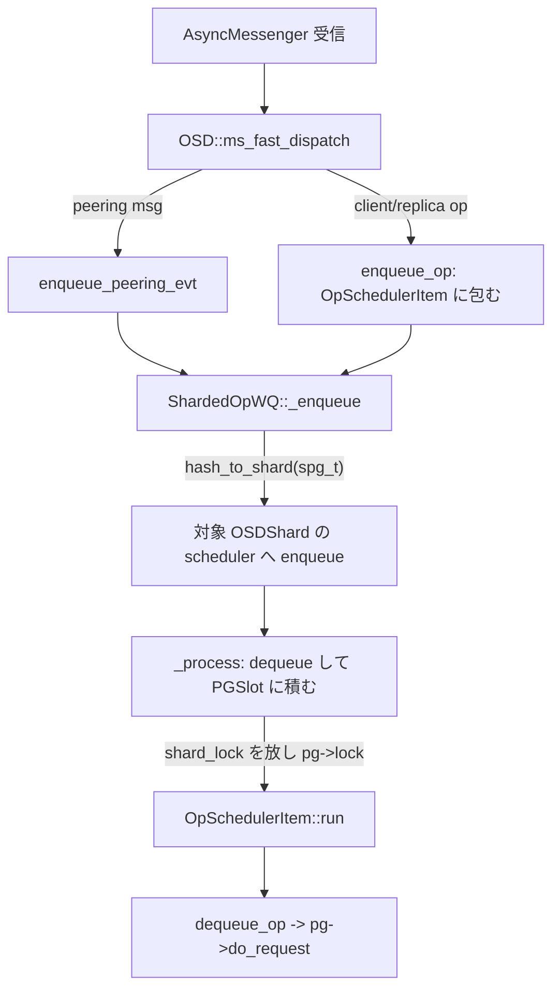
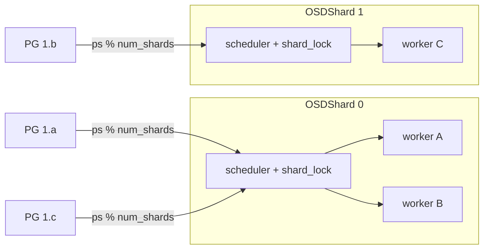

# 第11章 OSD デーモンの構造と op スケジューリング

> **本章で読むソース**
>
> - [`src/osd/OSD.h`](https://github.com/ceph/ceph/blob/v20.2.2/src/osd/OSD.h)
> - [`src/osd/OSD.cc`](https://github.com/ceph/ceph/blob/v20.2.2/src/osd/OSD.cc)
> - [`src/osd/scheduler/OpScheduler.h`](https://github.com/ceph/ceph/blob/v20.2.2/src/osd/scheduler/OpScheduler.h)
> - [`src/osd/scheduler/OpScheduler.cc`](https://github.com/ceph/ceph/blob/v20.2.2/src/osd/scheduler/OpScheduler.cc)
> - [`src/osd/scheduler/OpSchedulerItem.h`](https://github.com/ceph/ceph/blob/v20.2.2/src/osd/scheduler/OpSchedulerItem.h)
> - [`src/osd/scheduler/OpSchedulerItem.cc`](https://github.com/ceph/ceph/blob/v20.2.2/src/osd/scheduler/OpSchedulerItem.cc)
> - [`src/osd/scheduler/mClockScheduler.h`](https://github.com/ceph/ceph/blob/v20.2.2/src/osd/scheduler/mClockScheduler.h)
> - [`src/osd/scheduler/mClockScheduler.cc`](https://github.com/ceph/ceph/blob/v20.2.2/src/osd/scheduler/mClockScheduler.cc)

## この章の狙い

OSD は RADOS のデータ経路を担うデーモンであり、クライアントの読み書きから peering・recovery・scrub まで、性質の異なる仕事を1プロセスで同時に処理する。
これらを無秩序に受けると、同じ PG への操作が別スレッドで並走してオブジェクトの整合が壊れ、またクライアント I/O がバックグラウンド処理に帯域を奪われて遅延が跳ねる。

OSD はこの2つの問題を、受信 op を PG 単位で直列化するシャーディングと、種別ごとに帯域を調停する op スケジューラで解く。
本章では、Messenger が受け取った client op が対象 PG の処理に届くまでの経路を追い、PG を特定シャードへ固定することで直列性とロック局所性を同時に得る機構と、mClock による QoS 調停を読む。

## 前提

第3章の「**ShardedThreadPool**」（シャードごとにワーカースレッドを割り当てるスレッドプール）と「WorkQueue」を前提とする。
第4章の Messenger が接続ごとにメッセージを受信し、登録された `Dispatcher` の高速経路（fast dispatch）へ渡すところから話を始める。
第8章の「OSDMap」と `spg_t`（シャード付き PGID）を、op の宛先を決める鍵として使う。
本章で「スリープ」と書くのは、ワーカースレッドがキューの空きを条件変数で待って CPU を手放す状態を指す。

## op の入口：`ms_fast_dispatch`

Messenger は受信メッセージを `OSD::ms_fast_dispatch` に渡す。
この関数は、メッセージ種別を見て2つの経路に振り分ける入口である。

[`src/osd/OSD.cc` L7643-L7688](https://github.com/ceph/ceph/blob/v20.2.2/src/osd/OSD.cc#L7643-L7688)

```cpp
void OSD::ms_fast_dispatch(Message *m)
{
  FUNCTRACE(cct);
  if (service.is_stopping()) {
    m->put();
    return;
  }
  // peering event?
  switch (m->get_type()) {
  // ...
  case MSG_OSD_PG_NOTIFY2:
  // ...
    {
      MOSDPeeringOp *pm = static_cast<MOSDPeeringOp*>(m);
      if (require_osd_peer(pm)) {
	enqueue_peering_evt(
	  pm->get_spg(),
	  PGPeeringEventRef(pm->get_event()));
      }
      pm->put();
      return;
    }
  }

  OpRequestRef op = op_tracker.create_request<OpRequest, Message*>(m);
```

peering 系のメッセージは、その場で `enqueue_peering_evt` に流し込む。
それ以外のメッセージ（クライアントの `CEPH_MSG_OSD_OP` や OSD 間の replica op など）は `OpRequestRef`（追跡可能な op ラッパー）に包み、宛先 PG を確定してからキューへ入れる。

宛先の確定には2つの道がある。

[`src/osd/OSD.cc` L7730-L7752](https://github.com/ceph/ceph/blob/v20.2.2/src/osd/OSD.cc#L7730-L7752)

```cpp
  if (!legacy &&
      (m->get_connection()->has_features(CEPH_FEATUREMASK_RESEND_ON_SPLIT) ||
       m->get_type() != CEPH_MSG_OSD_OP)) {
    // queue it directly
    enqueue_op(
      spg,
      std::move(op),
      static_cast<MOSDFastDispatchOp*>(m)->get_map_epoch());
  } else {
    // legacy client, and this is an MOSDOp (the *only* fast dispatch
    // message that didn't have an explicit spg_t); we need to map
    // them to an spg_t while preserving delivery order.
    auto priv = m->get_connection()->get_priv();
    if (auto session = static_cast<Session*>(priv.get()); session) {
      std::lock_guard l{session->session_dispatch_lock};
      op->get();
      session->waiting_on_map.push_back(*op);
      OSDMapRef nextmap = service.get_nextmap_reserved();
      dispatch_session_waiting(session, nextmap);
      service.release_map(nextmap);
    }
  }
```

メッセージが宛先 `spg_t` を明示していれば、そのまま `enqueue_op` に渡す。
明示しない旧クライアントの `MOSDOp` だけは、セッションの `session_dispatch_lock` の下で OSDMap を引いて `spg_t` を割り当てる。
配送順を保つために、この経路はセッション単位のロックで直列化する。

## PG 単位でのキュー投入：`enqueue_op`

`enqueue_op` は、op を「**OpSchedulerItem**」（スケジューラのキュー要素）に包んでシャードキューへ投入する。

[`src/osd/OSD.cc` L9845-L9885](https://github.com/ceph/ceph/blob/v20.2.2/src/osd/OSD.cc#L9845-L9885)

```cpp
void OSD::enqueue_op(spg_t pg, OpRequestRef&& op, epoch_t epoch)
{
  const utime_t stamp = op->get_req()->get_recv_stamp();
  const utime_t latency = ceph_clock_now() - stamp;
  const unsigned priority = op->get_req()->get_priority();
  const int cost = op->get_req()->get_cost();
  const uint64_t owner = op->get_req()->get_source().num();
  // ...
  op->mark_queued_for_pg();
  logger->tinc(l_osd_op_before_queue_op_lat, latency);
  if (PGRecoveryMsg::is_recovery_msg(op)) {
    op_shardedwq.queue(
      OpSchedulerItem(
        unique_ptr<OpSchedulerItem::OpQueueable>(new PGRecoveryMsg(pg, std::move(op))),
        cost, priority, stamp, owner, epoch));
  } else {
    op_shardedwq.queue(
      OpSchedulerItem(
        unique_ptr<OpSchedulerItem::OpQueueable>(new PGOpItem(pg, std::move(op))),
        cost, priority, stamp, owner, epoch));
  }
}
```

`OpSchedulerItem` は、優先度（`priority`）、コスト（`cost`）、投入時刻（`stamp`）、所有者（`owner`、`client.XXX` のグローバル ID）、マップエポック（`epoch`）といったスケジューリングの材料を op と一緒に運ぶ。
中身の op は `OpQueueable` の派生で表現し、通常のクライアント/replica op は `PGOpItem`、recovery のメッセージは `PGRecoveryMsg` になる。
peering イベントや scrub、snap trim も同じキューに別の `OpQueueable` として並ぶため、同じ PG に対するあらゆる仕事が1本のキュー要素の列として順序付けられる。

`OpQueueable` は、宛先 PG を2つの粒度で返す。

[`src/osd/scheduler/OpSchedulerItem.h` L49-L54](https://github.com/ceph/ceph/blob/v20.2.2/src/osd/scheduler/OpSchedulerItem.h#L49-L54)

```cpp
    /// Items with the same queue token will end up in the same shard
    virtual uint32_t get_queue_token() const = 0;

    /* Items will be dequeued and locked atomically w.r.t. other items with the
       * same ordering token */
    virtual const spg_t& get_ordering_token() const = 0;
```

`get_ordering_token` が返す `spg_t` が、同一 PG の要素を「アトミックに直列化する単位」を定める。
これが以降のシャード割り当てと PG スロットの鍵になる。

## シャーディング：PG をシャードへ固定する

`op_shardedwq`（`ShardedOpWQ` 型）は、投入された要素をどのシャードに入れるかを `_enqueue` で決める。

[`src/osd/OSD.cc` L11412-L11441](https://github.com/ceph/ceph/blob/v20.2.2/src/osd/OSD.cc#L11412-L11441)

```cpp
void OSD::ShardedOpWQ::_enqueue(OpSchedulerItem&& item) {
  if (unlikely(m_fast_shutdown) ) {
    // stop enqueing when we are in the middle of a fast shutdown
    return;
  }

  uint32_t shard_index =
    item.get_ordering_token().hash_to_shard(osd->shards.size());

  OSDShard* sdata = osd->shards[shard_index];
  assert (NULL != sdata);
  // ...
  bool empty = true;
  {
    std::lock_guard l{sdata->shard_lock};
    empty = sdata->scheduler->empty();
    sdata->scheduler->enqueue(std::move(item));
  }

  {
    std::lock_guard l{sdata->sdata_wait_lock};
    if (empty) {
      sdata->sdata_cond.notify_all();
    } else if (sdata->waiting_threads) {
      sdata->sdata_cond.notify_one();
    }
  }
}
```

シャード番号は `spg_t::hash_to_shard` が決める。

[`src/osd/osd_types.h` L632-L634](https://github.com/ceph/ceph/blob/v20.2.2/src/osd/osd_types.h#L632-L634)

```cpp
  unsigned hash_to_shard(unsigned num_shards) const {
    return ps() % num_shards;
  }
```

`ps()`（PG のシード）を `num_shards` で割った剰余なので、ある PG は常に同じシャードへ写る。
シャード数はストレージの回転種別で決まり、既定は HDD なら `osd_op_num_shards_hdd`、SSD なら `osd_op_num_shards_ssd` から取る（[`src/osd/OSD.cc` L3587-L3595](https://github.com/ceph/ceph/blob/v20.2.2/src/osd/OSD.cc#L3587-L3595)）。
各シャードは独立した「**OSDShard**」構造体で、専用のロックとスケジューラを1つずつ持つ。

[`src/osd/OSD.h` L992-L1018](https://github.com/ceph/ceph/blob/v20.2.2/src/osd/OSD.h#L992-L1018)

```cpp
  std::string shard_lock_name;
  ceph::mutex shard_lock;   ///< protects remaining members below

  /// map of slots for each spg_t.  maintains ordering of items dequeued
  /// from scheduler while _process thread drops shard lock to acquire the
  /// pg lock.  stale slots are removed by consume_map.
  std::unordered_map<spg_t,std::unique_ptr<OSDShardPGSlot>> pg_slots;
  // ...
  /// priority queue
  ceph::osd::scheduler::OpSchedulerRef scheduler;
```

PG がシャードに固定される効果は2つある。
第1に、同じ PG の要素は必ず同じ `shard_lock` と同じスケジューラを通るので、PG 内の順序が1つのキューだけで保たれる。
第2に、あるシャードのワーカーが触るのは自シャードの `shard_lock`・スケジューラ・`pg_slots` に限られ、他シャードとロックを共有しない。
シャードごとにロックが分かれることで、異なる PG への並行 op がロックで衝突せずに別々のコアで進み、これがスループットを支える。

## デキューと PG ロック：`_process`

ワーカースレッドは `ShardedThreadPool` から `_process` を呼ばれる。
どのシャードを担当するかは、スレッド番号をシャード数で割った剰余で決まる。

[`src/osd/OSD.cc` L11075-L11090](https://github.com/ceph/ceph/blob/v20.2.2/src/osd/OSD.cc#L11075-L11090)

```cpp
void OSD::ShardedOpWQ::_process(uint32_t thread_index, heartbeat_handle_d *hb)
{
  uint32_t shard_index = thread_index % osd->num_shards;
  auto& sdata = osd->shards[shard_index];
  ceph_assert(sdata);
  // ...
  // peek at spg_t
  sdata->shard_lock.lock();
  if (sdata->scheduler->empty() &&
      (!is_smallest_thread_index || sdata->context_queue.empty())) {
    std::unique_lock wait_lock{sdata->sdata_wait_lock};
```

1シャードには複数のワーカーを割り当てられる。
キューが空なら `sdata_cond` でスリープし、投入時の `notify` で起こされる。
要素を取り出すときは `scheduler->dequeue()` を呼び、得た `OpSchedulerItem` を、順序トークン（`spg_t`）ごとの「**OSDShardPGSlot**」の `to_process` 列に積む。

ここで直列性の要となるのが、PG ロックの取り方である。

[`src/osd/OSD.cc` L11209-L11223](https://github.com/ceph/ceph/blob/v20.2.2/src/osd/OSD.cc#L11209-L11223)

```cpp
  // lock pg (if we have it)
  if (pg) {
    // note the requeue seq now...
    uint64_t requeue_seq = slot->requeue_seq;
    ++slot->num_running;

    sdata->shard_lock.unlock();
    osd->service.maybe_inject_dispatch_delay();
    pg->lock();
    osd->service.maybe_inject_dispatch_delay();
    sdata->shard_lock.lock();

    auto q = sdata->pg_slots.find(token);
    if (q == sdata->pg_slots.end()) {
      // this can happen if we race with pg removal.
```

`shard_lock` をいったん手放してから `pg->lock()` を取り、再び `shard_lock` を取り直す。
2つのロックを重ねて取ると PG ロックとシャードロックの獲得順が経路ごとに食い違い、デッドロックを招くため、この順序反転を避ける設計になっている。
ロックを手放している間に PG が削除されたり別の要素が割り込んだりした場合に備え、取り直した後で `pg_slots` の再確認や `requeue_seq` の照合を行う。

PG ロックを握った状態で要素の `run` を呼ぶと、`OpQueueable` の種別に応じた処理に分岐する。
クライアント/replica op の `PGOpItem` は `dequeue_op` を呼ぶ。

[`src/osd/scheduler/OpSchedulerItem.cc` L27-L35](https://github.com/ceph/ceph/blob/v20.2.2/src/osd/scheduler/OpSchedulerItem.cc#L27-L35)

```cpp
void PGOpItem::run(
  OSD *osd,
  OSDShard *sdata,
  PGRef& pg,
  ThreadPool::TPHandle &handle)
{
  osd->dequeue_op(pg, op, handle);
  pg->unlock();
}
```

`dequeue_op` は最終的に `pg->do_request` を呼び、op を PG の I/O パイプライン（第13章）へ渡す。

[`src/osd/OSD.cc` L9933-L9936](https://github.com/ceph/ceph/blob/v20.2.2/src/osd/OSD.cc#L9933-L9936)

```cpp
  op->mark_reached_pg();
  op->osd_trace.event("dequeue_op");

  pg->do_request(op, handle);
```

ここまでが、Messenger の受信から PG の処理までをつなぐ経路である。





## op スケジューラ：`OpScheduler` 抽象

各シャードが持つスケジューラは、`OpScheduler` という抽象インターフェースで表される。

[`src/osd/scheduler/OpScheduler.h` L35-L49](https://github.com/ceph/ceph/blob/v20.2.2/src/osd/scheduler/OpScheduler.h#L35-L49)

```cpp
class OpScheduler {
public:
  // Enqueue op for scheduling
  virtual void enqueue(OpSchedulerItem &&item) = 0;

  // Enqueue op for processing as though it were enqueued prior
  // to other items already scheduled.
  virtual void enqueue_front(OpSchedulerItem &&item) = 0;

  // Returns true iff there are no ops scheduled
  virtual bool empty() const = 0;

  // Return next op to be processed
  virtual WorkItem dequeue() = 0;
```

実装は2種類あり、`make_scheduler` が設定に応じて選ぶ。

[`src/osd/scheduler/OpScheduler.cc` L24-L47](https://github.com/ceph/ceph/blob/v20.2.2/src/osd/scheduler/OpScheduler.cc#L24-L47)

```cpp
OpSchedulerRef make_scheduler(
  CephContext *cct, int whoami, uint32_t num_shards, int shard_id,
  bool is_rotational, std::string_view osd_objectstore,
  op_queue_type_t osd_scheduler, unsigned op_queue_cut_off, MonClient *monc)
{
  // Force the use of 'wpq' scheduler for filestore OSDs.
  // The 'mclock_scheduler' is not supported for filestore OSDs.
  if (op_queue_type_t::WeightedPriorityQueue == osd_scheduler ||
      osd_objectstore == "filestore") {
    return std::make_unique<
      ClassedOpQueueScheduler<WeightedPriorityQueue<OpSchedulerItem, client>>>(
	// ...
    );
  } else if (op_queue_type_t::mClockScheduler == osd_scheduler) {
    // default is 'mclock_scheduler'
    return std::make_unique<
      mClockScheduler>(cct, whoami, num_shards, shard_id, is_rotational,
        op_queue_cut_off, monc);
  } else {
    ceph_abort_msg("Invalid choice of wq");
  }
}
```

`WeightedPriorityQueue` は、優先度の重み付き公平キューである。
優先度がしきい値（cutoff）以上の要素は厳密優先で先に出し、それ未満は重みに比例したトークンで公平に配分する。
これに対し既定の `mClockScheduler` は、後述する QoS 制御を持つ。

## QoS：mClock による帯域調停

mClock は、op を4つのクラスに分けて扱う。

[`src/osd/scheduler/OpSchedulerItem.h` L32-L37](https://github.com/ceph/ceph/blob/v20.2.2/src/osd/scheduler/OpSchedulerItem.h#L32-L37)

```cpp
enum class op_scheduler_class : uint8_t {
  background_recovery = 0,
  background_best_effort,
  immediate,
  client,
};
```

クライアントの読み書きは `client`、recovery や backfill は `background_recovery`、scrub や snap trim は `background_best_effort`、peering など遅延できない処理は `immediate` に対応する。
`PGOpItem` は、op の種別がクライアント op なら `client` を、それ以外なら `immediate` を返す。

[`src/osd/scheduler/OpSchedulerItem.h` L243-L251](https://github.com/ceph/ceph/blob/v20.2.2/src/osd/scheduler/OpSchedulerItem.h#L243-L251)

```cpp
  op_scheduler_class get_scheduler_class() const final {
    auto type = op->get_req()->get_type();
    if (type == CEPH_MSG_OSD_OP ||
	type == CEPH_MSG_OSD_BACKOFF) {
      return op_scheduler_class::client;
    } else {
      return op_scheduler_class::immediate;
    }
  }
```

投入時、`immediate` と cutoff 以上の高優先要素は mClock の外の厳密優先キュー（`high_priority`）へ回し、それ以外だけを mClock 本体に入れる。

[`src/osd/scheduler/mClockScheduler.cc` L448-L471](https://github.com/ceph/ceph/blob/v20.2.2/src/osd/scheduler/mClockScheduler.cc#L448-L471)

```cpp
void mClockScheduler::enqueue(OpSchedulerItem&& item)
{
  auto id = get_scheduler_id(item);
  unsigned priority = item.get_priority();
  
  // TODO: move this check into OpSchedulerItem, handle backwards compat
  if (op_scheduler_class::immediate == id.class_id) {
    enqueue_high(immediate_class_priority, std::move(item));
  } else if (priority >= cutoff_priority) {
    enqueue_high(priority, std::move(item));
  } else {
    auto cost = calc_scaled_cost(item.get_cost());
    item.set_qos_cost(cost);
    // ...
    // Add item to scheduler queue
    scheduler.add_request(
      std::move(item),
      id,
      cost);
```

mClock 本体は、クラスごとに3つのパラメーターで帯域を配る。
「**reservation**」は最低保証帯域、「**weight**」は余剰帯域を分け合う比、「**limit**」は上限帯域である。
これらは、OSD の測定容量から求めた1シャードあたりの帯域に対する比率として設定から解決する。

[`src/osd/scheduler/mClockScheduler.cc` L138-L169](https://github.com/ceph/ceph/blob/v20.2.2/src/osd/scheduler/mClockScheduler.cc#L138-L169)

```cpp
void mClockScheduler::ClientRegistry::update_from_config(
  const ConfigProxy &conf,
  const double capacity_per_shard)
{

  auto get_res = [&](double res) {
    if (res) {
      return res * capacity_per_shard;
    } else {
      return default_min; // min reservation
    }
  };

  auto get_lim = [&](double lim) {
    if (lim) {
      return lim * capacity_per_shard;
    } else {
      return default_max; // high limit
    }
  };

  // Set external client infos
  double res = conf.get_val<double>(
    "osd_mclock_scheduler_client_res");
  double lim = conf.get_val<double>(
    "osd_mclock_scheduler_client_lim");
  uint64_t wgt = conf.get_val<uint64_t>(
    "osd_mclock_scheduler_client_wgt");
```

既定プロファイルの1つ `high_client_ops` は、クライアントに容量の60%を reservation として与えて weight を2に、background recovery には40%と weight 1、background best effort には reservation なしで limit を70%に設定する。

[`src/osd/scheduler/mClockScheduler.cc` L308-L312](https://github.com/ceph/ceph/blob/v20.2.2/src/osd/scheduler/mClockScheduler.cc#L308-L312)

```cpp
  static constexpr profile_t high_client_ops_profile{
    { .6, 2,  0 },
    { .4, 1,  0 },
    {  0, 1, .7 }
  };
```

この配分が QoS の効きどころである。
recovery が大量に発生してもクライアント I/O には60%の帯域が reservation で確保され、逆にクライアントが空いていれば余剰を weight 比でバックグラウンドが使う。
best effort に limit を課すことで、scrub のような遅延して構わない処理が帯域を占有してクライアント遅延を跳ね上げるのを防ぐ。
本章の最適化として説明するのはこの点である。
reservation で最低帯域を守りつつ weight で余剰を融通することで、負荷が偏っても総帯域を遊ばせずに、クライアント遅延の悪化を抑える。

デキューは、まず厳密優先キューを空にしてから mClock 本体を引く。

[`src/osd/scheduler/mClockScheduler.cc` L520-L555](https://github.com/ceph/ceph/blob/v20.2.2/src/osd/scheduler/mClockScheduler.cc#L520-L555)

```cpp
WorkItem mClockScheduler::dequeue()
{
  if (!high_priority.empty()) {
    auto iter = high_priority.begin();
    // ...
    return ret;
  } else {
    mclock_queue_t::PullReq result = scheduler.pull_request();
    if (result.is_future()) {
      return result.getTime();
    } else if (result.is_none()) {
      ceph_assert(
	0 == "Impossible, must have checked empty() first");
      return {};
```

`pull_request` は、次に出すべき要素がまだ「将来の時刻」に予約されている場合、要素ではなくその時刻を返す。
`_process` はこの時刻まで `sdata_cond` でスリープしてから引き直すので、mClock は limit を時間軸で強制できる。

## OSDService：シャードをまたぐ共有状態

シャードとワーカーが分かれても、全体で1つでなければならない状態がある。
それを抱えるのが「**OSDService**」である。

[`src/osd/OSD.h` L155-L167](https://github.com/ceph/ceph/blob/v20.2.2/src/osd/OSD.h#L155-L167)

```cpp
  OSDMapRef osdmap;

public:
  OSDMapRef get_osdmap() {
    std::lock_guard l(publish_lock);
    return osdmap;
  }
  epoch_t get_osdmap_epoch() {
    std::lock_guard l(publish_lock);
    return osdmap ? osdmap->get_epoch() : 0;
  }
  void publish_map(OSDMapRef map) {
    std::lock_guard l(publish_lock);
    osdmap = map;
  }
```

`OSDService` は、現在発効中の OSDMap を `OSDMapRef`（参照カウント付き共有ポインター）で公開する。
`publish_map` で差し替え、各ワーカーは `get_osdmap` で今のマップを引く。
マップは共有ポインターで配るため、あるスレッドが古い版を処理中でも新しい版を安全に公開でき、古い版は最後の参照が消えた時点で解放される。

OSDMap のほか、`OSDService` は OSD 間通信のための `Objecter`、非同期完了を直列実行する `Finisher` 群、`OSDSuperblock`（ディスク上のメタ情報）などを保持する。
各シャードのワーカーはこれらを `service.` 経由で共有し、シャードごとに複製しない。
`enqueue_op` が recovery のレイテンシを計上する `logger`（`PerfCounters`）も、この共有状態の一部である。

## まとめ

OSD が受け取った op は、`ms_fast_dispatch` で peering 系と通常 op に分けられ、通常 op は宛先 `spg_t` を確定して `enqueue_op` からシャードキューへ入る。
`spg_t::hash_to_shard` が PG をシャードへ固定するため、同じ PG の要素は同じ `shard_lock` とスケジューラを通り、PG 単位の直列性とロック局所性が同時に得られる。
`_process` は `shard_lock` を手放してから PG ロックを取り直す順序でデッドロックを避け、`run` を経て `dequeue_op` から `pg->do_request` へ op を渡す。
スケジューラは `OpScheduler` 抽象の下に `WeightedPriorityQueue` と既定の `mClockScheduler` を持ち、mClock は reservation・weight・limit でクライアント I/O とバックグラウンド処理の帯域を調停する。
シャードをまたぐ OSDMap や `Objecter` は `OSDService` が共有状態として抱える。

## 関連する章

- 第3章「スレッド基盤」：本章の `ShardedOpWQ` が載る `ShardedThreadPool` と `WorkQueue` の基本形。
- 第4章「Messenger と AsyncConnection」：`ms_fast_dispatch` に op を届ける受信経路。
- 第8章「OSDMap・PG マッピング・プール」：`spg_t` と OSDMap による宛先決定の前提。
- 第12章「PG と PeeringState」：`enqueue_peering_evt` が流す peering イベントの処理先。
- 第13章「PrimaryLogPG の I/O パイプライン」：`dequeue_op` から呼ばれる `pg->do_request` の続き。
