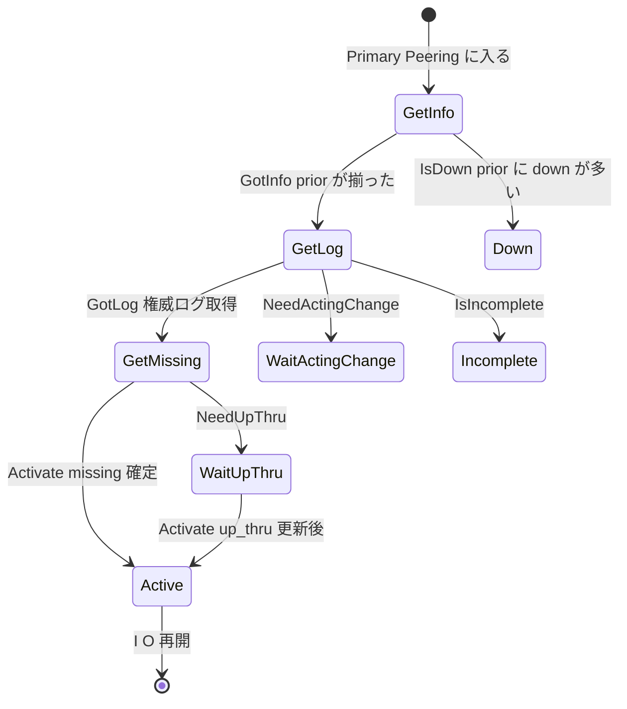

# 第12章 PG と PeeringState

> **本章で読むソース**
>
> - [`src/osd/PG.h`](https://github.com/ceph/ceph/blob/v20.2.2/src/osd/PG.h)
> - [`src/osd/PeeringState.h`](https://github.com/ceph/ceph/blob/v20.2.2/src/osd/PeeringState.h)
> - [`src/osd/PeeringState.cc`](https://github.com/ceph/ceph/blob/v20.2.2/src/osd/PeeringState.cc)
> - [`src/osd/osd_types.h`](https://github.com/ceph/ceph/blob/v20.2.2/src/osd/osd_types.h)

## この章の狙い

第8章では、OSDMap と CRUSH が PG から up セットと acting セットを決定的に計算する様子を読んだ。
ただし acting セットが決まっただけでは、その PG はまだ読み書きを受け付けられない。
acting セットに並んだ OSD 群は、直前まで別々のメンバー構成で動いていたかもしれず、それぞれが保持するオブジェクトの版数もログの長さも食い違っている。
本章では、この食い違いを解消して I/O 可能な状態へ持っていく合意手続き「peering」を、`PeeringState` の状態機械のコードで追う。

前半では、PG がどのように `PeeringState` を抱え、Boost.Statechart の状態機械として peering を駆動するかを見る。
後半では、プライマリ OSD が各 peer の `pg_info_t` を集め、権威ログを選び、欠けているオブジェクトを確定してから `Active` へ入るまでの流れを、`GetInfo`、`GetLog`、`GetMissing` の各状態のコードで読む。
あわせて、down していた OSD が最新データを持つ可能性を漏らさず判定する `PastIntervals` の仕組みを機構レベルで説明する。

## 前提

第8章の up セット、acting セット、pg_temp、プライマリ OSD の用語を導入済みとして使う。
OSDMap のエポックと、マップ更新がクラスタ全体へ配られる流れも第8章と第9章で扱った。
peering の後段にあたる recovery と backfill は第16章で扱うため、本章では acting セットが I/O を再開できる状態に達するところまでを対象にする。

## peering は何を合意するのか

acting セットの各 OSD は、同じ PG のレプリカを持つ。
しかし直前のメンバー構成（interval）が変わる過程で、ある OSD は書き込みを受け取り損ねてログが短く、別の OSD は最新の書き込みまで適用済み、という差が生じうる。
このまま I/O を再開すれば、古いレプリカが新しい書き込みを上書きしたり、欠けたオブジェクトを気付かず読み返したりする。

peering は、これを防ぐための合意手続きである。
プライマリ OSD が acting セットと過去メンバーの `pg_info_t` を集め、そのうち最も新しいログを持つ OSD を権威ログ（authoritative log）の持ち主として選ぶ。
権威ログと各レプリカのログを突き合わせれば、どのオブジェクトがどの OSD で欠けているか（missing）が確定する。
missing が分かれば、プライマリはまず整合の取れた版数から I/O を再開でき、欠けた分は recovery で後から埋められる。
peering が合意するのは、この「権威ログの持ち主」と「各レプリカの missing 集合」の二つである。

## PG は PeeringState に状態機械を委ねる

peering の状態遷移そのものは、`PG` ではなく `PeeringState` が持つ。
`PG` は `PeeringState::PeeringListener` を継承し、状態機械からのコールバック（クエリ送信、統計公開など）を受ける側に回る。

[`src/osd/PG.h` L166-167](https://github.com/ceph/ceph/blob/v20.2.2/src/osd/PG.h#L166-L167)

```cpp
class PG : public DoutPrefixProvider,
	   public PeeringState::PeeringListener,
```

`PG` は `PeeringState` をメンバーとして一つ抱える。
名前は `recovery_state` だが、これが peering から recovery までの状態機械の本体である。

[`src/osd/PG.h` L1391](https://github.com/ceph/ceph/blob/v20.2.2/src/osd/PG.h#L1391)

```cpp
  PeeringState recovery_state;
```

`PeeringState` の内部では、Boost.Statechart による状態機械 `PeeringMachine` がメンバーとして保持される。

[`src/osd/PeeringState.h` L1582](https://github.com/ceph/ceph/blob/v20.2.2/src/osd/PeeringState.h#L1582)

```cpp
  PeeringMachine machine;
```

Boost.Statechart は、状態を C++ の型（`struct`）で表し、状態のネストを型のネストで表現するライブラリである。
`PeeringState` の各状態は `boost::statechart::state< 自分, 親状態 >` を継承した `struct` として宣言され、状態が受け取るイベントと遷移先は、その `struct` 内の `reactions` 型リストで静的に定義される。
状態機械へイベントを投げると、現在の状態から親状態へ向かってイベントに反応する `reactions` が探索され、最初に一致した反応が遷移や副作用を起こす。

## 状態のネスト構造

`PeeringState` の状態は、`Initial` を起点に大きく入れ子になっている。
主要な入れ子関係はヘッダのコメントに一覧されている。

[`src/osd/PeeringState.h` L654-687](https://github.com/ceph/ceph/blob/v20.2.2/src/osd/PeeringState.h#L654-L687)

```cpp
  // Initial
  // Reset
  // Started
  //   Start
  //   Primary
  //     WaitActingChange
  //     Peering
  //       GetInfo
  //       GetLog
  //       GetMissing
  //       WaitUpThru
  //       Incomplete
  //     Active
  // ... (中略) ...
  //   ReplicaActive
  //     RepNotRecovering
  // ... (中略) ...
  //   Stray
```

`Started` の下で、その PG における自 OSD の役割によって枝が分かれる。
自 OSD がプライマリなら `Primary` へ、そうでなければ `Stray` へ入る。
この分岐は `Start` 状態のコンストラクタが `is_primary()` を見て決める。

[`src/osd/PeeringState.cc` L5359-5365](https://github.com/ceph/ceph/blob/v20.2.2/src/osd/PeeringState.cc#L5359-L5365)

```cpp
  if (ps->is_primary()) {
    psdout(1) << "transitioning to Primary" << dendl;
    post_event(MakePrimary());
  } else { //is_stray
    psdout(1) << "transitioning to Stray" << dendl;
    post_event(MakeStray());
  }
```

peering の合意手続きを主導するのはプライマリだけである。
`Primary` はさらに `Peering` を初期サブ状態に持ち、`Peering` は `GetInfo` を初期サブ状態に持つ。

[`src/osd/PeeringState.h` L833](https://github.com/ceph/ceph/blob/v20.2.2/src/osd/PeeringState.h#L833)

```cpp
  struct Peering : boost::statechart::state< Peering, Primary, GetInfo >, NamedState {
```

つまりプライマリで peering が始まると、状態機械は自動的に `Started/Primary/Peering/GetInfo` まで降りる。
以降の三つの状態 `GetInfo`、`GetLog`、`GetMissing` が、権威ログと missing を確定する本体である。
レプリカ側は `Stray` から `ReplicaActive` へ進み、プライマリからのクエリに `pg_info_t` やログで応答する受け身の役に回る。

以下では、実際に peering で通過する状態だけを図示する。
Boost.Statechart のイベント型や、backfill・recovery 予約に関わる `Active` 配下のサブ状態は、本図では省く。



## GetInfo：prior set を組んで各 peer の pg_info を集める

`GetInfo` のコンストラクタは、まず `build_prior()` で prior set を組み、その各メンバーへ `pg_info_t` を問い合わせる。

[`src/osd/PeeringState.cc` L7401-7415](https://github.com/ceph/ceph/blob/v20.2.2/src/osd/PeeringState.cc#L7401-L7415)

```cpp
  prior_set = ps->build_prior();
  ps->prior_readable_down_osds = prior_set.down;

  if (ps->prior_readable_down_osds.empty()) {
    psdout(10) << " no prior_set down osds, will clear prior_readable_until_ub before activating"
	       << dendl;
  }

  ps->reset_min_peer_features();
  get_infos();
  if (prior_set.pg_down) {
    post_event(IsDown());
  } else if (peer_info_requested.empty()) {
    post_event(GotInfo());
  }
```

prior set の `probe` に載った各 OSD へ、`INFO` クエリを送るのが `get_infos()` である。
すでに手元に info がある peer や down している peer は問い合わせから外す。

[`src/osd/PeeringState.cc` L7442-7451](https://github.com/ceph/ceph/blob/v20.2.2/src/osd/PeeringState.cc#L7442-L7451)

```cpp
      psdout(10) << " querying info from osd." << peer << dendl;
      context< PeeringMachine >().send_query(
	peer.osd,
	pg_query_t(pg_query_t::INFO,
		   it->shard, ps->pg_whoami.shard,
		   ps->info.history,
		   ps->get_osdmap_epoch()));
      peer_info_requested.insert(peer);
      ps->blocked_by.insert(peer.osd);
```

問い合わせた相手からの応答は `MNotifyRec` イベントとして届き、`peer_info_requested` から消し込まれる。
`peer_info_requested` が空になれば、`GotInfo` イベントで `GetLog` へ遷移する。
遷移先は `struct GetInfo` の `reactions` に静的に書かれている。

[`src/osd/PeeringState.h` L1300-1306](https://github.com/ceph/ceph/blob/v20.2.2/src/osd/PeeringState.h#L1300-L1306)

```cpp
    typedef boost::mpl::list <
      boost::statechart::custom_reaction< QueryState >,
      boost::statechart::custom_reaction< QueryUnfound >,
      boost::statechart::transition< GotInfo, GetLog >,
      boost::statechart::custom_reaction< MNotifyRec >,
      boost::statechart::transition< IsDown, Down >
      > reactions;
```

prior set の down 状況によっては、権威ログを選べるだけの情報が揃わない。
その場合 `IsDown` で `Down` 状態へ移り、down している OSD の復帰を待つ。

## GetLog：choose_acting で権威ログを選ぶ

`GetLog` のコンストラクタは、集めた info をもとに `choose_acting()` を呼び、権威ログを持つ OSD を `auth_log_shard` に決める。

[`src/osd/PeeringState.cc` L7567-7582](https://github.com/ceph/ceph/blob/v20.2.2/src/osd/PeeringState.cc#L7567-L7582)

```cpp
  // adjust acting?
  if (!ps->choose_acting(auth_log_shard, false, false,
			 &context< Peering >().history_les_bound,
                         &repeat_getlog)) {
    if (!ps->want_acting.empty()) {
      post_event(NeedActingChange());
    } else {
      post_event(IsIncomplete());
    }
    return;
  }

  // am i the best?
  if (auth_log_shard == ps->pg_whoami) {
    post_event(GotLog());
    return;
  }
```

`choose_acting()` は、集めた info を一つの表 `all_info` にまとめ、そこから権威ログの持ち主を `find_best_info()` で選ぶ。

[`src/osd/PeeringState.cc` L2499-2512](https://github.com/ceph/ceph/blob/v20.2.2/src/osd/PeeringState.cc#L2499-L2512)

```cpp
  map<pg_shard_t, pg_info_t> all_info(peer_info.begin(), peer_info.end());
  all_info[pg_whoami] = info;

  if (cct->_conf->subsys.should_gather<dout_subsys, 10>()) {
    for (auto p = all_info.begin(); p != all_info.end(); ++p) {
      psdout(10) << "all_info osd." << p->first << " "
		 << p->second << dendl;
    }
  }

  auto auth_log_shard = find_best_info(all_info, restrict_to_up_acting,
				       true, history_les_bound);
```

`find_best_info()` の選び方は、コメントに書かれた三段の優先順位に沿う。
最も新しい `last_update` を持つ info を選び、同点なら別の peer をログの連続性に引き込めるよう `log_tail` の長いものを、それでも同点なら現プライマリを選ぶ。

[`src/osd/PeeringState.cc` L1656-1659](https://github.com/ceph/ceph/blob/v20.2.2/src/osd/PeeringState.cc#L1656-L1659)

```cpp
 * Returns an iterator to the best info in infos sorted by:
 *  1) Prefer newer last_update
 *  2) Prefer longer tail if it brings another info into contiguity
 *  3) Prefer current primary
```

`last_update` の比較に先立って、`find_best_info()` は古すぎる候補をふるい落とす。
`last_epoch_started` がクラスタ内で観測された最大値より古い info や、まだ完全でない（`is_incomplete()`）info は権威ログの候補から外す。

[`src/osd/PeeringState.cc` L1690-1695](https://github.com/ceph/ceph/blob/v20.2.2/src/osd/PeeringState.cc#L1690-L1695)

```cpp
    // Disqualify anyone with a too old last_epoch_started
    if (p->second.last_epoch_started < max_last_epoch_started)
      continue;
    // Disqualify anyone who is incomplete (not fully backfilled)
    if (p->second.is_incomplete())
      continue;
```

権威ログの持ち主が自分自身なら、追加のログ取得は要らず `GotLog` を投げる。
他 OSD なら、その OSD へ `LOG` クエリを送ってログを取り寄せ、応答（`MLogRec`）が届いたときに `GotLog` を投げる。
`GotLog` を受けた `GetLog` は、取り寄せたログを `proc_master_log()` で自分の状態に取り込み、`GetMissing` へ遷移する。

[`src/osd/PeeringState.cc` L7658-7677](https://github.com/ceph/ceph/blob/v20.2.2/src/osd/PeeringState.cc#L7658-L7677)

```cpp
  if (msg) {
    psdout(10) << "processing master log" << dendl;
    ps->proc_master_log(context<PeeringMachine>().get_cur_transaction(),
			msg->info, std::move(msg->log), std::move(msg->missing),
			auth_log_shard);
    // ... (中略) ...
  }
  ps->start_flush(context< PeeringMachine >().get_cur_transaction());
  return transit< GetMissing >();
```

`choose_acting()` は権威ログを選ぶだけでなく、望ましい acting セット `want` を計算する。
これが現在の acting セットと食い違うときは、`want` を pg_temp としてモニターへ要求し、いったん `false` を返す。

[`src/osd/PeeringState.cc` L2643-2660](https://github.com/ceph/ceph/blob/v20.2.2/src/osd/PeeringState.cc#L2643-L2660)

```cpp
      psdout(10) << "want " << pg_vector_string(want)
	       << " != acting " << pg_vector_string(acting)
	       << ", requesting pg_temp change" << dendl;
    }
    want_acting = want;

    if (!cct->_conf->osd_debug_no_acting_change) {
      if ((want_acting == up) &&
	  !pool.info.is_nonprimary_shard(pg_whoami.shard)) {
	// There can't be any pending backfill if
	// want is the same as crush map up OSDs.
	ceph_assert(want_backfill.empty());
	vector<int> empty;
	pl->queue_want_pg_temp(empty);
      } else
	pl->queue_want_pg_temp(want);
    }
    return false;
```

第8章で見た pg_temp は、CRUSH が選んだ up セットとは別に、モニターが一時的に acting セットを差し替える仕組みだった。
その差し替えを要求する起点がここである。
権威ログを持つ OSD がたまたま up セットに含まれないとき、`choose_acting()` はその OSD を暫定的に acting へ引き込むよう pg_temp を要求し、モニターの OSDMap 更新を待って peering をやり直す。

## GetMissing：各レプリカの欠損を確定して Active へ

権威ログが定まると、`GetMissing` は acting セットの各 OSD について、権威ログとの差分から missing 集合を求める。
相手のログが権威ログと連続する範囲を持つなら、その差分を照合するために `LOG` または `FULLLOG` クエリでログと missing を取り寄せる。

[`src/osd/PeeringState.cc` L7967-7987](https://github.com/ceph/ceph/blob/v20.2.2/src/osd/PeeringState.cc#L7967-L7987)

```cpp
    since.epoch = pi.last_epoch_started;
    ceph_assert(pi.last_update >= ps->info.log_tail);  // or else choose_acting() did a bad thing
    if (pi.log_tail <= since) {
      psdout(10) << " requesting log+missing since " << since << " from osd." << *i << dendl;
      context< PeeringMachine >().send_query(
	i->osd,
	pg_query_t(
	  pg_query_t::LOG,
	  i->shard, ps->pg_whoami.shard,
	  since, ps->info.history,
	  ps->get_osdmap_epoch()));
    } else {
      // ... (中略) ...
      context< PeeringMachine >().send_query(
	i->osd, pg_query_t(
	  pg_query_t::FULLLOG,
	  i->shard, ps->pg_whoami.shard,
	  ps->info.history, ps->get_osdmap_epoch()));
    }
```

問い合わせるべき相手がいなければ、missing は手元の情報だけで確定している。
このとき `up_thru` の更新がまだ必要なら `NeedUpThru` で `WaitUpThru` へ移り、そうでなければ `Activate` を投げて `Active` へ入る。

[`src/osd/PeeringState.cc` L7992-8004](https://github.com/ceph/ceph/blob/v20.2.2/src/osd/PeeringState.cc#L7992-L8004)

```cpp
  if (peer_missing_requested.empty()) {
    if (ps->need_up_thru) {
      psdout(10) << " still need up_thru update before going active"
			 << dendl;
      post_event(NeedUpThru());
      return;
    }

    // all good!
    post_event(Activate(ps->get_osdmap_epoch()));
  } else {
    pl->publish_stats_to_osd();
  }
```

`Active` のコンストラクタが `activate()` を呼ぶと、プライマリは acting セットのレプリカへ活性化を通知し、全員のコミットを待つ。
全レプリカが活性化を確認すれば、その PG は clean へ向かい、クライアントの I/O を受け付ける状態になる。
missing が残るオブジェクトは、`Active` 配下の recovery と backfill で埋める（第16章）。

## 堅牢性の工夫：PastIntervals による過去 acting 集合の追跡

peering の難しさは、「今 up している OSD だけを見ても、最新データの持ち主を取りこぼしうる」点にある。
prior set を組む `build_prior()` のコメントは、その典型を挙げている。
ある interval で `A B` の二台が acting だったとき、B だけが最後の書き込みを受け取り、その直後に A も B も落ちたとする。
次に A だけが復帰しても、A は B の受けた書き込みを持たない。
A の info だけで peering を通してしまえば、B が持っていたはずの更新を失う。

`PriorSet` は、この取りこぼしを防ぐために「過去の acting 集合のうち、書き込みを受けた可能性がある OSD で今 down しているもの」を追跡する。

[`src/osd/osd_types.h` L3652-3658](https://github.com/ceph/ceph/blob/v20.2.2/src/osd/osd_types.h#L3652-L3658)

```cpp
  struct PriorSet {
    bool ec_pool = false;
    std::set<pg_shard_t> probe; ///< current+prior OSDs we need to probe.
    std::set<int> down;  ///< down osds that would normally be in @a probe and might be interesting.
    std::map<int, epoch_t> blocked_by;  ///< current lost_at values for any OSDs in cur set for which (re)marking them lost would affect cur set

    bool pg_down = false;   ///< some down osds are included in @a cur; the DOWN pg state bit should be set.
```

prior set の構築は、`PastIntervals` が記録した過去の各 interval を新しい方から遡り、その interval の acting だった OSD を up・down・lost に振り分ける。
ある interval を生き延びた OSD が復旧判定（`pcontdec`）を満たさず、しかも down の候補がいるなら、その interval で書き込みが起きた可能性を消せない。
このとき `pg_down` を立て、down 候補を `blocked_by` に積む。

[`src/osd/osd_types.h` L3854-3863](https://github.com/ceph/ceph/blob/v20.2.2/src/osd/osd_types.h#L3854-L3863)

```cpp
      if (!(*pcontdec)(up_now) && any_down_now) {
	// fixme: how do we identify a "clean" shutdown anyway?
	ldpp_dout(dpp, 10) << "build_prior  possibly went active+rw,"
			   << " insufficient up; including down osds" << dendl;
	ceph_assert(!candidate_blocked_by.empty());
	pg_down = true;
	blocked_by.insert(
	  candidate_blocked_by.begin(),
	  candidate_blocked_by.end());
      }
```

`pg_down` が立った prior set では、`GetInfo` が `IsDown` を投げて `Down` 状態へ移り、down している OSD が復帰するか、管理者がその OSD を lost と宣言するまで活性化を止める。
これが、down していた OSD が最新データを持つ可能性を漏らさず判定する仕組みである。
今 up している OSD だけで多数決するのではなく、過去の全 interval を遡って「書き込みを受けたかもしれない down OSD」を明示的に待つことで、可視化されないデータ喪失を機構として防いでいる。

## up_thru が果たす役割

prior set が down 候補を待つと言っても、落ちた OSD がすべて書き込みを受けたわけではない。
書き込みを一度も受けずに落ちた OSD まで待てば、peering は無用に止まる。
これを切り分けるのが、第8章で触れた OSDMap 中の `up_thru` である。

`build_prior()` のコメントは、`up_thru` がゼロの OSD を安全に無視できる理由を説明する。
ある OSD が peering を通して活性化するには、モニターへ活性化を告げて OSDMap の `up_thru` を自分のエポックまで進める必要がある。
`up_thru` がそのエポックまで進んでいない OSD は、その interval で活性化しておらず、書き込みを受け付けていない。
だから prior set はその OSD を待たなくてよい。

`GetMissing` の後段にある `WaitUpThru` は、この保証を自分側で確立する状態である。
プライマリは活性化に先立って自分の `up_thru` をモニターへ進めてもらい、更新済みの OSDMap が届いてから `Active` へ入る。
これにより、次に interval が変わってこの PG が再び peering するとき、他のプライマリが `up_thru` を見て「この OSD は書き込みを受けた」と正しく判定できる。

## まとめ

peering は、acting セットの OSD 群が最新の権威ログを選び、各レプリカの missing を確定してから I/O を再開する合意手続きである。
`PG` は `PeeringState` に状態機械を委ね、`PeeringState` は Boost.Statechart の状態型のネストで peering を表す。
プライマリは `GetInfo` で prior set の各 peer から `pg_info_t` を集め、`GetLog` の `choose_acting()` と `find_best_info()` で権威ログの持ち主を選び、`GetMissing` で各レプリカの欠損を確定して `Active` へ入る。
権威ログの OSD が up セットにいなければ、pg_temp で暫定的に acting へ引き込む。
堅牢性の要は `PastIntervals` による過去 acting 集合の追跡であり、今 up している OSD だけを見て多数決するのではなく、過去の interval で書き込みを受けたかもしれない down OSD を prior set に含めて待つことで、可視化されないデータ喪失を防ぐ。
`up_thru` は、書き込みを受けずに落ちた OSD を安全に待機対象から外し、この待機が無用に長引くのを防ぐ。

## 関連する章

- [第8章 OSDMap・PG マッピング・プール](../part03-crush/08-osdmap-pg.md)：up セット、acting セット、pg_temp の計算。
- [第11章 OSD デーモンの構造と op スケジューリング](11-osd-daemon.md)：peering イベントを PG へ配送する OSD 側の仕組み。
- [第13章 PrimaryLogPG の I/O パイプライン](13-primarylogpg.md)：peering が完了した PG が受け付ける読み書きの処理。
- [第16章 PGLog・recovery・backfill](16-recovery.md)：peering で確定した missing を埋める後段の手続き。
